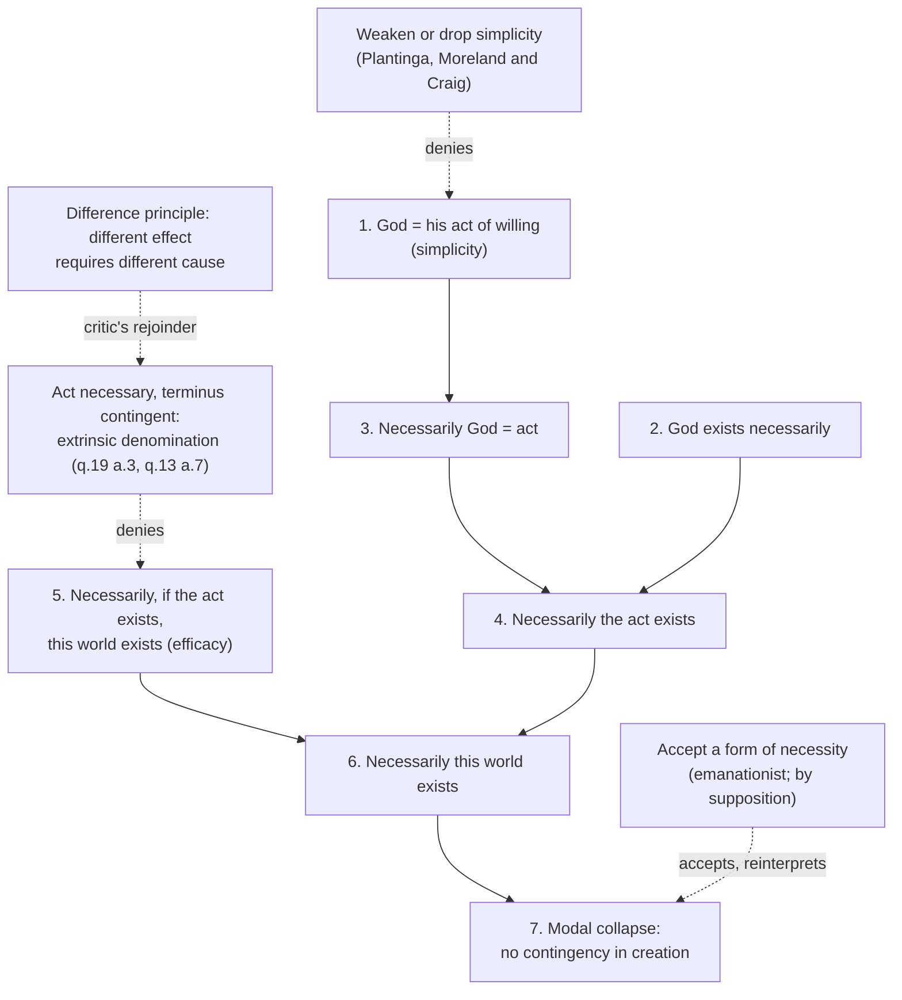

# Philosophy of Religion · Lesson 1.4: Eternity, immutability, and simplicity

> ⏱ ~15 min · Module 1: The concept of God and the divine attributes · Builds on: [1.3](01-03-omniscience-and-human-freedom.md), [`metaphysics` 5.1](../../metaphysics/lessons/05-01-the-a-theory-and-the-b-theory.md), [`thomistic-synthesis` 3.4](../../thomistic-synthesis/lessons/03-04-divine-simplicity-and-the-attributes.md) · Unlocks: [2.2](02-02-the-modal-ontological-argument.md), [2.4](02-04-cosmological-arguments-sufficient-reason.md)

## Why this matters

Omnipotence and omniscience are attributes everyone's God has. Eternity, immutability and simplicity are the attributes that divide theists: classical theism holds all three; theistic personalism ([1.1](01-01-which-god-and-what-an-argument-must-do.md)) drops or weakens them. So the incoherence arguments here are pressed by atheists *and* by theists, and a verdict against them is a verdict between two pictures of God, not only between theism and atheism. This lesson states the two strongest: that a timeless, unchanging God cannot know what time it is, and that a simple God is either a property or a God whose creation could not have been otherwise.

## The idea

The three attributes are a package. Start from **simplicity**: there is no composition in God at all, not even of a subject with its attributes, so God does not *have* goodness or power but *is* them ([`thomistic-synthesis` 3.4](../../thomistic-synthesis/lessons/03-04-divine-simplicity-and-the-attributes.md) derives this from ST I q.3; `trinity-and-god` [1.3](../../trinity-and-god/lessons/01-03-simplicity-as-doctrine.md) gives its doctrinal standing, one position this course neither asserts nor denies). A simple being has nothing that could be swapped out, so it is **immutable**. A being that undergoes no change has no before and after in its life, so it is **timeless**: [Boethian eternity](../reference.md#boethian-eternity), the whole of an unending life possessed at once (the definition is quoted and glossed in `trinity-and-god` [1.4](../../trinity-and-god/lessons/01-04-immutability-eternity-immensity.md)).

The rival is the [everlasting](../reference.md#timeless-and-everlasting) God: in time, without beginning or end, living through a sequence. Nicholas Wolterstorff ("God Everlasting", 1975) argued that a God who acts in history, first promising and then fulfilling, has a life with an order of before and after. Richard Swinburne (*The Coherence of Theism*, 1977) also places God in time. William Lane Craig (*Time and Eternity*, 2001) splits the difference: God is timeless without creation and temporal from creation on.

Which picture fits depends on the theory of time. On the B-theory, the whole of time is laid out tenselessly and "now" marks a perspective, not a further fact, so a God outside the series can see all of it. On the A-theory, there are facts about what is *present*, and a God outside time looks bound to miss them. That is why [`metaphysics` 5.1](../../metaphysics/lessons/05-01-the-a-theory-and-the-b-theory.md) says a timeless God fits a B-series far more naturally. Eleonore Stump and Norman Kretzmann ("Eternity", 1981) proposed a special relation, ET-simultaneity, under which every temporal moment is present to the eternal God without God being in time; whether it is coherent is itself disputed.

## The argument

**A. Tensed knowledge** (Norman Kretzmann, "Omniscience and Immutability", 1966).

1. **A perfect being is omniscient.**
2. **An omniscient being knows, at each time, what time it is now.** *In words:* among the truths are tensed ones, "it is now noon", and an all-knowing being knows them.
3. **What time it is now changes.** *In words:* the truths in (2) are true at one moment and false at the next.
4. **So a being that always knows what time it is now changes in what it knows.**
5. **A perfect being is immutable.**
6. **∴ No being is both perfect and omniscient-and-immutable.** *In words:* the classical package is inconsistent.

The **B-theorist** denies (2) as it is meant: there is no extra fact that "it is now noon" reports beyond the tenseless fact that a given thought occurs at noon, and God knows all of those. The cost is the one Prior pressed with "thank goodness that's over" ([`metaphysics` 5.1](../../metaphysics/lessons/05-01-the-a-theory-and-the-b-theory.md), Ex 2): if tensed beliefs carry something tenseless facts miss, God misses it. The **everlasting theist** denies (5) in its strong form: God's character, purposes and power never change, but his knowledge of the passing present does, and that is no imperfection. The **timeless A-theorist** has the hardest job, which is why Craig moves God into time. Call this the problem of [knowledge of tensed facts](../reference.md#knowledge-of-tensed-facts).

**B. The property objection** (Alvin Plantinga, *Does God Have a Nature?*, 1980).

1. **God is identical with each of his properties:** his goodness, his power, his knowledge.
2. **Identity is transitive.** So his goodness is his power, and he has just one property.
3. **So God is a property.**
4. **Properties are abstract and causally inert.** *In words:* the causal criterion of [`metaphysics` 1.2](../../metaphysics/lessons/01-02-abstract-objects.md): nothing a property is could create, know or love.
5. **∴ The simple God cannot be the personal creator theism says he is.**

Replies deny (1) as Plantinga reads it. Stump and Kretzmann ("Absolute Simplicity", 1985) treat "goodness" and "power" as different descriptions of one reality, as "morning star" and "evening star" name one planet. Jeffrey Brower ("Making Sense of Divine Simplicity", 2008) reads the identity claims as truthmaker claims: what makes "God is good" true is God himself, not a property he instantiates. William Mann identifies God with his property *instances*, which are concrete, rather than with universals (compare tropes, [`metaphysics` 1.4](../../metaphysics/lessons/01-04-nominalism-and-tropes.md)). See [property objection](../reference.md#property-objection).

**C. Modal collapse** (in Moreland and Craig, *Philosophical Foundations for a Christian Worldview*, 2003; Brian Leftow; R. T. Mullins, "Simply Impossible", 2013). Let $G$ be God, $A$ God's act of willing that the world be created, $C$ the proposition that the created world exists as it does, and $\Box$ "in every possible world".

1. $G = A$. *Premise (simplicity):* nothing in God is distinct from God, his act of will included.
2. $\Box\,(G \text{ exists})$. *Premise (necessary existence).*
3. $\Box\,(G = A)$. *From 1, necessity of identity* ([`metaphysics` 3.1](../../metaphysics/lessons/03-01-kinds-of-necessity.md)).
4. $\Box\,(A \text{ exists})$. *From 2, 3:* in every world $G$ exists and is $A$.
5. $\Box\,(A \text{ exists} \to C)$. *Premise (efficacy):* $A$ is intrinsically a willing of *this* world, and an omnipotent will gets what it wills.
6. $\Box C$. *From 4, 5 by K:* $\Box(p \to q),\ \Box p \vdash \Box q$.
7. $C$ was arbitrary, so every truth about creation is necessary. *In words:* nothing could have been otherwise; [modal collapse](../reference.md#modal-collapse).

Christopher Tomaszewski (*Analysis*, 2019) argued that a common formulation is invalid; others reply that several published versions are valid. This one is: each line follows by the rule named, so the dispute is over premises 1, 2 and 5.

**Where the argument is weakest.** The defender of simplicity attacks **premise 5**. On the classical reply, God's act is necessary but its *terminus*, what it brings about, is contingent: "God wills this world" is true of God by an extrinsic denomination, made true partly by the creature, as Aquinas holds that God's relations to creatures are real in them and not in him (ST I q.13 a.7) and that God wills creatures only by supposition, not absolutely (ST I q.19 a.3). The same intrinsic act would exist had God created nothing. The critic replies that this abandons a principle the classical theist uses everywhere else: a difference in the effect requires a difference in the cause. If the very same God, in the very same state, is compatible with this world, another world and none, then nothing in God accounts for which obtains, and creation is a brute contingency. The defender thinks that principle is the hidden premise, and that free causation by a unique, simple cause is exactly where it fails. Others accept a form of the conclusion, or drop strong simplicity (Plantinga, Craig). The same collapse returns against the principle of sufficient reason in [2.4](02-04-cosmological-arguments-sufficient-reason.md).

## The argument map

Solid arrows are the derivation; dashed arrows are replies and the premise each denies; the bottom edge is the critic's rejoinder to the main reply.

## Worked examples

**Example 1 (clean case: the tensed-knowledge argument on a launch).** A rocket launches at 09:00 on 12 May. The flight director knows two things: *the launch is at 09:00 on 12 May*, and at 09:00, *the launch is happening now*. Only the second makes her act. Run argument A. The B-theorist's timeless God knows the first and every fact of the form *this token of "launch now" occurs at 09:00*. What he lacks is the director's indexical way of holding it, and the B-theorist says that way requires being located in time, as knowing "I am here" requires being somewhere: no fact is missed, so (2) is false as intended. The A-theorist says the second is a further fact, it is true only at 09:00, and so (4) follows for anyone who knows it. The case isolates the crux: whether "now" adds a fact or only a perspective.

**Example 2 (hard case: where premise 5's denial strains).** The classical reply leans on Aquinas's remark that a necessary cause can have a non-necessary relation to its effect through a deficiency in the effect, not in the cause (q.19 a.3 ad 4). Try the familiar analogy. The sun shines the same whether the sky is clear or clouded; the light that arrives varies with what receives it, and the sun has not changed. That works because the cloud is already there to explain the difference. Creation is from nothing: there is no prior receiver whose state could explain why this world rather than none results from the same act. The defender's answer is that the effect *is* the whole difference, because it depends on God for all it is, and no receiver is needed; the critic hears an explanation with nothing doing the explaining. Example 1 resolves into a question about time; this one does not resolve into anything simpler. It is where the dispute currently sits.

## Watch out

- **You might think the tensed-knowledge argument is an atheist argument,** but it is used by everlasting theists against the classical package. Its conclusion is that the attributes conflict, not that God does not exist.
- **You might think modal collapse turns on the fallacy of [1.3](01-03-omniscience-and-human-freedom.md),** sliding from $\Box(p \to q)$ to $p \to \Box q$, but the careful version above needs no such step: line 4 gets the necessity of the act itself, so it never trades on confusing the [necessity of the consequence and of the consequent](../reference.md#necessity-of-the-consequence-and-of-the-consequent).
- **You might think the property objection refutes [divine simplicity](../reference.md#divine-simplicity),** but it refutes one reading of "God is his goodness", identity with an abstract universal, which no classical defender holds. Whether the alternative readings are intelligible is the live question.

## One-liner

> The classical package holds or falls on two questions: whether "now" is a fact a timeless God would miss, and whether one necessary act can have a contingent result.

## Problems

**P1 (🟢)** *(Exegetical (a) · Evaluative (b))* Two invented panellists:

> **Hale:** "If God *is* his goodness, and goodness is a property, then God is a property, and a property cannot love anybody."
>
> **Okafor:** "'God is his goodness' doesn't say God is a universal. It says that what makes 'God is good' true is God himself, and nothing else."

(a) Which premise of the property-objection skeleton (premises 1–5 of argument B above; cite them as B1–B5) does Okafor deny, and which reply in the literature does she give? (b) Name the crux between them and say what argument would move each side. **Two sentences for (a), 80 words or fewer for (b).**

**P2 (🟡)** *(Exegetical (a) · Evaluative (b))* Invented: Orla, a theist, holds that God is timeless and the B-theory is true. Dev, also a theist, holds the A-theory and that God is everlasting. A solar eclipse occurs at 14:02 on 9 April. (a) For each of Orla and Dev, say which premise of the tensed-knowledge argument (premises 1–6 of argument A above, cited as A1–A6) they deny, and what each says God knows about the eclipse at 14:02. (b) State the strongest cost of Orla's position, and the best reply she can give to it. **Two sentences per person for (a), 100 words or fewer for (b).**

**P3 (🔴)** *(Formal (a) · Evaluative (b))* An invented forum post:

> "Modal collapse in three lines. (1) Necessarily, if God wills that the world exists, the world exists. (2) God wills that the world exists. (3) So necessarily the world exists. Simplicity just guarantees (2)."

(a) Show that (3) does not follow from (1) and (2), with a two-world countermodel. Then name the extra premises the lesson's derivation uses to reach the necessity of God's willing, and say which line supplies it. (b) Steelman the critic of simplicity against the reply "the act is necessary, its terminus contingent", in **120 words or fewer**. Any verdict, but the steelman must be one a defender would recognize.

Solutions

**P1** *(Exegetical (a) · Evaluative (b))*

(a) Okafor denies **B1** as Hale reads it: that God is identical with each property taken as an abstract universal. Her reply is the **truthmaker** reading (Brower, 2008): "God is good" is made true by God himself, so no property entity is identified with God and B3–B4 never get started.

**Must hit, strict (a):**

- B1 (not B4; she grants that universals are causally inert).
- Truthmaker reading, Brower; credit also for "not a universal" plus a correct gloss, or for Stump and Kretzmann's one-reality-many-descriptions as a neighbour.

**Must hit, any verdict (b):**

- The crux: whether a true predication of God must be made true by a property God has, or can be made true by God himself with no property in between.
- What moves each side: for Hale, an account of truthmaking on which a simple object grounds many distinct truths without any distinction in it; for Okafor, an argument that distinct truths need distinct truthmakers (so "good" and "powerful" need different grounds).

**Wrong turns:** saying Okafor denies B4 by making properties causal; calling the dispute verbal, when the two disagree about what grounds predication; deciding the crux by asserting that God is (or is not) simple.

**Model answer (b), one of several:** They disagree over whether every true predication needs a property as its truthmaker. Hale should move if shown a working case of one simple truthmaker for several non-synonymous truths; Okafor should move if shown that distinct truths require distinct grounds, since then "God is good" and "God is powerful" demand a distinction in God that simplicity forbids.

---

**P2** *(Exegetical (a) · Evaluative (b))*

**Must hit, strict (a):**

- **Orla** denies **A2** as intended: there is no further fact "the eclipse is happening now" beyond the tenseless fact that the eclipse occurs at 14:02 on 9 April and that tokens of "now" occur when they do. God timelessly knows all of those, and does not know it at 14:02, since God is not at 14:02.
- **Dev** denies **A5** in its strong form: God's knowledge changes as the present moves, and at 14:02 God knows the eclipse is happening now, as at 14:01 he knew it was about to happen. God's character, purposes and power do not change.

**Must hit, any verdict (b):**

- The cost: if tensed beliefs carry something tenseless facts lack (the "thank goodness that's over" point), God lacks it, so either omniscience is weakened or the B-theory must explain that content away.
- A reply: the missing item is an indexical way of grasping facts, available only to beings located in time, so lacking it is no more a gap in knowledge than lacking "I am here" is for something not located anywhere; or omniscience is knowing every fact, and there is no extra fact.

**Wrong turns:** having Orla deny A3 (she grants that "now" shifts; she denies it reports a further fact); making Dev deny omniscience; treating (b) as decided by which theory of time is true.

**Model answer (b), one of several:** Orla's cost is Prior's: the relief at "that's over" seems to be about something tenseless facts do not contain, so a God who knows only tenseless facts seems to miss part of reality. Her best reply is that what is missed is a perspective, not a fact. "The eclipse is now" adds to "the eclipse is at 14:02" only the knower's own location in time, as "I am here" adds a location in space. A God not located in time lacks the perspective but not any truth, so omniscience, defined as knowing every truth, survives.

---

**P3** *(Formal (a) · Evaluative (b))*

(a) **Countermodel** (checked by brute force in the build script): world $w_1$, where God wills the world and it exists; world $w_2$, where God does not will it and it does not exist. Premise (1), $\Box(W \to C)$, is true (the conditional holds at both worlds). Premise (2), $W$, is true at $w_1$. But $\Box C$ is false, since $C$ fails at $w_2$. So (1)–(2) give only $C$, not $\Box C$: the move from necessity of the consequence to necessity of the consequent from [1.3](01-03-omniscience-and-human-freedom.md).

**What the lesson's derivation adds:** the conclusion needs $\Box W$ (necessarily the act exists), not $W$. Line 4 supplies it, from **line 1** (God = his act, by simplicity), **line 2** (God exists necessarily) and **line 3** (necessity of identity). Then line 6 follows by K. "Simplicity just guarantees (2)" is the error: simplicity is meant to guarantee the *necessity* of the willing, which is why premises 1–3 are needed, not just (2).

**Must hit, any verdict (b):**

- State the reply fairly: one necessary act, a contingent terminus; "God wills this world" true partly in virtue of the creature (extrinsic denomination).
- The critic's move: a difference in effect requires a difference in cause; if God's intrinsic state is the same whether this world, another or none exists, nothing in God explains which obtains.
- Say why this bites the classical theist in particular: the principle is one the defender relies on elsewhere (e.g. in cosmological arguments).

**Wrong turns:** steelmanning the critic with the three-line fallacy just diagnosed; attacking premise 2 (necessary existence), which the reply does not touch; asserting that the reply makes God's will arbitrary without saying why.

**Model answer (b), one of several:** The reply says God's single act is necessary and only its result is contingent. But then God is intrinsically exactly the same in a world with this universe, with another, and with none. A difference in what exists with no difference in what makes it exist is just what classical theists deny when they argue from a contingent world to a cause of it. So either that principle has an exception at the one place it matters most, and creation is a brute fact, or the difference lies in God, and simplicity is lost. The defender may say free causation is the exception; the critic asks why that is not special pleading.

## Flashback

**From Lesson [1.2](01-02-omnipotence-and-its-paradoxes.md) (Omnipotence and its paradoxes):** *(Exegetical.)* Diagnose this invented parish bulletin:

> "Can God make a stone so heavy He cannot lift it? Two answers. First: 'a stone too heavy for an all-powerful being to lift' describes nothing, like a four-sided triangle, so there is no task here for God to fail at. Second, and without even assuming God is all-powerful: to say someone cannot make a stone he cannot lift means only that every stone he can make, he can lift, which is no limit at all. So let us say it plainly: God can do absolutely anything, the contradictory included."

(a) Name the modern reply each of the first two answers gives, and say how each disposes of the stone paradox's premise 3 ("if God cannot make it, there is a possible task God cannot do"). (b) Explain why the last sentence undercuts the first answer, naming the definition of omnipotence it slides to and the one the first two answers rely on. Two sentences per part.

Solution

**Must hit, strict (a):**

- First answer: **Mavrodes's pseudo-task reply**. Given that the maker is omnipotent, "a stone its maker cannot lift" is self-contradictory, so making it is not a possible task and premise 3's "possible task" is not there. (Credit for noting Aquinas's q.25 a.3 point: better to say such things cannot be done than that God cannot do them.)
- Second answer: **Savage's reply**. It does not assume omnipotence; "x cannot make a stone x cannot lift" says only that whatever x can make, x can lift, which entails no limit on making or lifting, so premise 3 states no limit at all.

**Must hit, strict (b):**

- The last sentence slides to **D0**, "can do anything at all, even the contradictory" (Descartes as often read).
- The first answer relies on **D1** (power over what is logically possible): it excuses God *because* a contradictory description names no task. If God can do the contradictory, that excuse is withdrawn, so the bulletin asserts the ground of its first answer and then denies it. (D0 does dissolve the paradox another way, but at the cost the lesson names: the attribute then rules nothing out.)

**Wrong turns:** swapping the two authors (the tell is "without even assuming God is all-powerful", which is Savage's); saying either answer denies premise 2; reading the last sentence as harmless emphasis.

**Model answer:** (a) The first is Mavrodes's: for an omnipotent maker, "a stone its maker cannot lift" is contradictory, so failing to make it is failing at no possible task. The second is Savage's: without assuming omnipotence, the inability means only that every stone x makes, x can lift, which is no limit on power. (b) The closing line adopts D0, power even over contradictions. But the first answer worked only because, on D1, contradictory descriptions are not tasks at all, so the bulletin ends by denying the premise its first answer stood on.

## Connections

- **Backward:** [1.3](01-03-omniscience-and-human-freedom.md) supplied the necessity of the consequence and of the consequent, which separates the valid collapse from its fallacious cousin; [`metaphysics` 5.1](../../metaphysics/lessons/05-01-the-a-theory-and-the-b-theory.md) the A/B fork that decides whether a timeless God misses a fact; [`metaphysics` 3.1](../../metaphysics/lessons/03-01-kinds-of-necessity.md) the necessity of identity in line 3.
- **Forward:** [2.2](02-02-the-modal-ontological-argument.md) needs a being that exists necessarily, line 2 here; [2.4](02-04-cosmological-arguments-sufficient-reason.md) meets the same collapse aimed at the principle of sufficient reason (van Inwagen) rather than at simplicity. Boss 1 asks whether timeless eternity helps with foreknowledge for a God also simple and immutable.
- **Sideways:** [`thomistic-synthesis` 3.4](../../thomistic-synthesis/lessons/03-04-divine-simplicity-and-the-attributes.md) derives simplicity inside Aquinas's system, and its Boss 3 replies to the collapse stated here from within it; `trinity-and-god` [1.3](../../trinity-and-god/lessons/01-03-simplicity-as-doctrine.md)–[1.4](../../trinity-and-god/lessons/01-04-immutability-eternity-immensity.md) give the doctrinal standing of simplicity and eternity; Plotinus's One ([`ancient-medieval-philosophy` 4.4](../../ancient-medieval-philosophy/lessons/04-04-plotinus-the-one-intellect-and-soul.md)) is the ancestor of the simple first principle.
