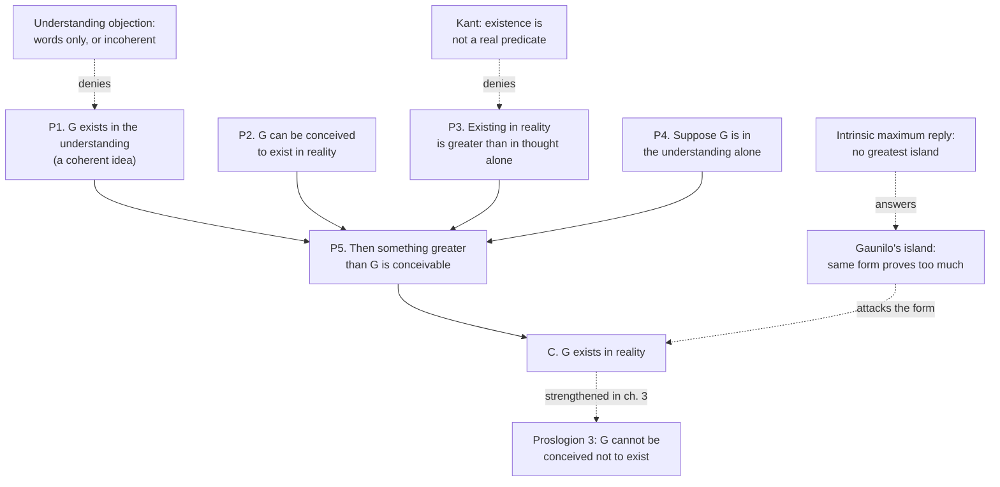

# Philosophy of Religion · Lesson 2.1: Anselm's ontological argument

> ⏱ ~15 min · Module 2: Ontological and cosmological arguments · Builds on: [1.1 Which God, and what an argument must do](01-01-which-god-and-what-an-argument-must-do.md), [ancient-medieval-philosophy 6.1](../../ancient-medieval-philosophy/lessons/06-01-anselm-and-the-proslogion-as-history.md), [metaphysics 2.5](../../metaphysics/lessons/02-05-essence-and-existence.md) · Unlocks: [2.2 The modal ontological argument](02-02-the-modal-ontological-argument.md)

## Why this matters

Almost every other argument for God starts from something in the world: motion, contingency, a fine-tuned constant, an experience. Anselm's starts from a phrase. If it works, nothing in experience could count against its conclusion, and it reaches the God of [perfect-being theology](../reference.md#perfect-being-theology) directly, with no [gap problem](../reference.md#the-gap-problem) left to close. That is why theists and atheists alike have attacked it for nine centuries, and why it keeps being repaired. [ancient-medieval-philosophy 6.1](../../ancient-medieval-philosophy/lessons/06-01-anselm-and-the-proslogion-as-history.md) read *Proslogion* 2–3 as history. This lesson reconstructs the argument in full and weighs the three classic replies.

## The idea

Start with a reductio you already trust. Suppose there is a largest whole number, $N$. Then $N+1$ is a whole number larger than $N$, which contradicts the supposition. So there is no largest whole number.

Anselm runs the same shape in the opposite direction. Take the description **"a being than which nothing greater can be conceived"**; call whatever answers to it $G$. Suppose $G$ exists only as an idea. Then you can conceive of something greater, namely that same being existing for real. That contradicts the description, so $G$ is not merely an idea.

The number reductio shows that nothing fits its description. Anselm's shows that something must, and the difference comes from one premise: that **existing in reality is greater than existing in the mind alone**. Everything turns on that premise, and on whether the description picks out a coherent thing at all.

## Source

Anselm, *Proslogion* ch. 2, in S. N. Deane's translation (1903, public domain). The fool of Psalm 14 has just heard the description:

> Hence, even the fool is convinced that something exists in the understanding, at least, than which nothing greater can be conceived. For, when he hears of this, he understands it. And whatever is understood, exists in the understanding. And assuredly that, than which nothing greater can be conceived, cannot exist in the understanding alone. For, suppose it exists in the understanding alone: then it can be conceived to exist in reality; which is greater. Therefore, if that, than which nothing greater can be conceived, exists in the understanding alone, the very being, than which nothing greater can be conceived, is one, than which a greater can be conceived. But obviously this is impossible. Hence, there is no doubt that there exists a being, than which nothing greater can be conceived, and it exists both in the understanding and in reality.

The three words "which is greater" are Anselm's entire support for the premise that carries the weight.

## The argument

Write $G$ for [that than which nothing greater can be conceived](../reference.md#that-than-which-nothing-greater). "In the understanding" means *thought of*; "in reality" means *exists outside the thought*.

**Proslogion 2.**

1. **P1. $G$ exists in the understanding.** The fool understands the phrase, and whatever is understood is in the understanding. *In words:* even the denier has a coherent idea before him, or he would not know what he denies.
2. **P2. $G$ can be conceived to exist in reality.**
3. **P3. Whatever exists in the understanding alone, but can be conceived to exist in reality, can be conceived to be greater than it is.** *In words:* the real thing beats the mere idea of it. This is the **greater-than premise**.
4. **P4. Suppose, for reductio, that $G$ exists in the understanding alone.**
5. **P5. Then a being greater than $G$ can be conceived.** (P2, P3, P4)
6. **P6. No being greater than $G$ can be conceived.** (definition of $G$)
7. **∴ C. $G$ exists in reality as well as in the understanding.** (P4–P6, reductio)

Read with each term fixed, the reductio is valid. The debate is over P1 and P3, and over whether "conceive" means the same thing in every premise.

**Proslogion 3.** Chapter 3 swaps the greater-than premise for a stronger one.

1. **Q1. A being that cannot be conceived not to exist can be conceived.**
2. **Q2. Such a being is greater than one that can be conceived not to exist.**
3. **Q3. So if $G$ could be conceived not to exist, a being greater than $G$ could be conceived.** (Q1, Q2)
4. **∴ C3. $G$ cannot be conceived not to exist.** (Q3, definition of $G$)

*In words:* chapter 2 concludes that God *exists*; chapter 3 concludes that God's non-existence is *inconceivable*. That is [necessary existence](../reference.md#necessary-existence). In his reply to Gaunilo (ch. 1), Anselm puts the bridge in a single conditional: "if that being can be even conceived to be, it must exist in reality." The shape is *possible, therefore actual*. [2.2](02-02-the-modal-ontological-argument.md) states it in modal logic, where it turns out to need S5.

**The three classic replies.**

**(i) The understanding objection, against P1.** Gaunilo's first move: the fool has only the words, so $G$ is in his understanding the way a doubtful or unreal thing is. Aquinas adds (*ST* I q.2 a.1 ad 2) that not everyone who hears "God" takes it to mean this, and that even granting the meaning, it follows only that God exists mentally unless one already admits that such a being actually exists. Both texts are read in [ancient-medieval-philosophy 6.1](../../ancient-medieval-philosophy/lessons/06-01-anselm-and-the-proslogion-as-history.md). Today it is usually put as a question of **coherence**: does the description pick out a possible being, or is it like "the largest number," understood but answering to nothing? If the great-making properties have no joint maximum, or clash (the paradoxes of [1.2](01-02-omnipotence-and-its-paradoxes.md)), P1 fails in the only sense that matters.

**(ii) [Gaunilo's island](../reference.md#gaunilos-island), against the form.** Gaunilo runs the same steps on an island more excellent than all lands and gets a conclusion no one accepts. This is a **proves-too-much** objection ([philosophical-method 4.1](../../philosophical-method/lessons/04-01-objections-and-replies.md)): if the form were valid with premises this cheap, it would populate the world with perfect islands. A parody does not say *which* premise fails. It shows that something does, and the defender must find a principled difference. Two have been offered. Anselm's own: his reasoning fits only the unrestricted description, never "the greatest of its kind." Plantinga's, in *The Nature of Necessity* (1974): an island's great-making properties, such as fruit, palm trees and beaches, have no **[intrinsic maximum](../reference.md#intrinsic-maximum)**, since one more palm tree always makes it better. So "the greatest conceivable island" is incoherent, like "the largest number," and the island's version of P1 fails. Knowledge and power, by contrast, do have maxima: knowing every truth, being able to do anything possible. The critic's rejoinder is that the parody can be rebuilt from properties that *do* have maxima. That is your P1.

**(iii) Kant, against P3.** [Existence is not a real predicate](../reference.md#existence-is-not-a-predicate) (*Critique of Pure Reason* A598/B626): a hundred real thalers contain no more than a hundred possible ones. [metaphysics 2.5](../../metaphysics/lessons/02-05-essence-and-existence.md) states the thesis and its Fregean sharpening; the only question here is whether it defeats Anselm. It does so only if P3 *needs* existence to be a feature that enlarges a concept. The critic says it does: comparing "$G$ in the understanding alone" with "$G$ in reality" treats existence as one more feature. The defender replies that the concept never changes: P3 says only that an instance is greater than an empty concept, a claim about value, not about the contents of a concept. The critic answers that a concept with nothing falling under it has no greatness to be outdone. So the reductio compares something with nothing, unless the argument counts non-existent objects among the things it talks about.

Norman Malcolm ("Anselm's Ontological Arguments," *Philosophical Review*, 1960) agreed that existence is not a perfection, so chapter 2 fails, and argued that chapter 3 escapes, because necessary existence is a perfection even if plain existence is not. Charles Hartshorne had pressed a similar modal reading (*Man's Vision of God*, 1941).

**Where the argument is weakest.** Critics attack **P3**. Existing is not a way of being *better*, they say, and a reductio that sets a thing beside its own absence compares nothing with something. Defenders reply that this objection rests on the Fregean thesis that existence is never a property of individuals, which is itself disputed (metaphysics 2.5 names its first-order rivals), and that Q2 in chapter 3 survives even if the thesis is granted. The deeper vulnerability is **P1**, read as a coherence claim, because every repair of the island reply leans on it. As for where opinion sits, the Stanford Encyclopedia's entry reports a widespread view, among theists too, that no known ontological argument succeeds; Plantinga's modal version is weighed in [2.2](02-02-the-modal-ontological-argument.md).

## The argument map

Solid arrows are the argument. Dashed arrows are objections, with the one premise each denies, and the reply that turns the island back onto P1.

## Worked examples

**Example 1 (clean case: the island run on the template).** Let $I$ be "an island than which no greater island can be conceived."

- P1′: $I$ is in the understanding. P3′: an existing island is greater than an imagined one. P4′: suppose $I$ is imagined only. P5′: then a greater island is conceivable. C′: $I$ exists.
- Every step matches, so the defender needs a premise that fails for $I$ and holds for $G$.
- The intrinsic-maximum reply puts the failure in P1′. One more palm tree is always conceivable, so nothing answers to the description: it is understood, as Gaunilo says, but incoherent.
- The cost: the reply needs *greatness* to have an intrinsic maximum and the maximal properties to be jointly possible. Module 1's question now carries Module 2's weight.

**Example 2 (hard case: does Kant reach chapter 3?).** Grant Kant entirely, so that "exists" adds nothing to any concept. Chapter 2's P3 is then in trouble. Chapter 3's Q2 compares two *concepts*: a being whose non-existence is conceivable, and a being whose non-existence is not. "Cannot fail to exist" looks like a real determination, one that rules things out (no beginning, no parts that could come apart, no place or time where it is absent), and Anselm's *Reply* (ch. 1) draws out exactly these consequences. So the predicate objection, by itself, does not touch Q2.

The objection moves rather than dies. From C3 to "$G$ exists" chapter 3 needs a bridge: inconceivable non-existence implies existence. That holds only if "inconceivable" means *impossible*, and Q1 holds only if "conceivable" means *possible*. Q1 is then the claim that necessary existence is possibly instantiated. [metaphysics 3.1](../../metaphysics/lessons/03-01-kinds-of-necessity.md) has already shown why conceivability is weak evidence for possibility. The weight shifts from Kant's predicate to Q1, which is the [possibility premise](../reference.md#possibility-premise) of [2.2](02-02-the-modal-ontological-argument.md).

## Watch out

- **You might think the argument says "I can think of God, so God exists," but** it is a reductio on one specific description, powered by the greater-than premise. "Whatever I can think of exists" is plainly invalid, and Anselm never uses it. That is why a parody has to copy the *description*, not just the slogan.
- **You might think Gaunilo's island locates the false premise, but** a parody only shows that something proves too much. The debate then becomes whether the defender's difference between island and $G$ is principled.
- **You might think Kant's slogan refutes every ontological argument, but** Malcolm accepted it against chapter 2 and denied it touches chapter 3. Whether necessary existence is a "real predicate" is a separate question, and the modal version stands or falls on its possibility premise instead.

## One-liner

> Anselm's reductio is valid; it lives or dies on whether "that than which nothing greater can be conceived" is coherent (P1, where the island reply sends the weight) and whether existing is a way of being greater (P3, Kant's target), and chapter 3 trades P3 for necessary existence and a possibility claim.

## Problems

**P1 (🟡) *(Evaluative.)*** Gaunilo's island falls to the intrinsic-maximum reply. (a) Build a parody of *Proslogion* 2 whose description uses **only properties that have intrinsic maxima**, runs every step P1–C, and reaches a conclusion the Anselmian theist must reject. Write its P1, P3 and C. (b) Say which premise of your parody the Anselmian should deny, and whether that denial is available without also endangering the original argument. 150 words or fewer in total.

**P2 (🟢) *(Exegetical.)*** Read *Proslogion* ch. 3 (Deane):

> AND it assuredly exists so truly, that it cannot be conceived not to exist. For, it is possible to conceive of a being which cannot be conceived not to exist; and this is greater than one which can be conceived not to exist. Hence, if that, than which nothing greater can be conceived, can be conceived not to exist, it is not that, than which nothing greater can be conceived. But this is an irreconcilable contradiction. There is, then, so truly a being than which nothing greater can be conceived to exist, that it cannot even be conceived not to exist; and this being thou art, O Lord, our God.

(a) Quote the words that do in chapter 3 the job "which is greater" did in chapter 2, and say what is now claimed to be greater than what. (b) What does chapter 3 conclude that chapter 2 did not? (c) Does the reductio in sentences 2–4 use chapter 2's conclusion as a premise? Answer yes or no and cite the words that decide it. 100 words or fewer in total.

**P3 (🔴, optional) *(Evaluative.)*** Steelman the objection to P3 that a critic in the Kant–Frege line would make: state it in its strongest form, in two or three sentences. Then give the best Anselmian reply, and name the one claim on which the exchange turns. Any verdict. 150 words or fewer in total.

Solutions

**P1** *(Evaluative)*

**Accept:** any parody whose description uses only maximum-having properties (omniscience, omnipotence, a maximal or zero degree of some attitude), mirrors P1, P3 and the reductio, and yields a conclusion that conflicts with theism or with the original conclusion. For (b), a named premise and an honest assessment of what denying it costs.

**Must hit, any verdict:**

- (a) The parody's P3 must be as plausible as Anselm's: existing in reality has to raise the parody's own measure, not just "greatness".
- (a) The conclusion must clash with something the theist holds, such as there being a second omnipotent being, or an omnipotent being that is not good.
- (b) Locate the denial, usually at the parody's P1 (its description is incoherent) or at its P3 (existence raises *greatness* but not the parody's measure). Then say whether the same denial would threaten $G$.

**Wrong turns:** building a parody from properties with no maximum, which is just the island again and answered the same way. Building one whose conclusion the theist happily accepts, such as "an omniscient being exists".

**Model answer, one of several:** (a) P1*: "A being than which nothing more powerful and knowing can be conceived, and which is wholly indifferent to creatures" is in the understanding. P3*: existing in reality gives a being real power, so the real one is more powerful than the merely imagined one. C*: an omnipotent, omniscient, indifferent being exists. This contradicts theism, on which the only omnipotent being is perfectly good. (b) The Anselmian denies P1*: if $G$ is possible, an omnipotent being distinct from $G$, or not good, is impossible, so the description is incoherent. The cost is symmetry. The parodist can say the same of $G$ if P1* is possible. So the denial is available, but it makes everything turn on which coherence claim to grant first.

---

**P2** *(Exegetical, strict)*

**Must hit, strict:**

- (a) "this is greater than one which can be conceived not to exist." What is greater is now a being that *cannot be conceived not to exist*, compared with one that *can*, rather than existence in reality compared with existence in the understanding alone.
- (b) Chapter 2 concludes that $G$ exists in reality. Chapter 3 concludes that $G$ "cannot even be conceived not to exist": necessary existence, a stronger modal claim. It also identifies $G$ with God ("this being thou art, O Lord").
- (c) **No.** The reductio's premises are "it is possible to conceive of a being which cannot be conceived not to exist" and the comparison of greatness, together with the definition of $G$. None of them is "$G$ exists in reality." The opening "it assuredly exists" refers back to chapter 2, but it frames the argument and is not one of its steps.

**Wrong turns:** answering (c) "yes" because of the opening sentence. Reading (b) as "God exists" again, missing the modal strengthening.

**Model answer:** (a) "this is greater than one which can be conceived not to exist": being unable to be conceived not to exist is greater than being able to. (b) That $G$ cannot even be conceived not to exist, which is necessary existence and not just existence, and that this being is God. (c) No. The reductio runs from "it is possible to conceive of a being which cannot be conceived not to exist" plus the greatness comparison. "It assuredly exists" only links back to chapter 2.

---

**P3** *(Evaluative)*

**Must hit, any verdict:**

- The objection aimed precisely at P3. Comparing $G$-in-the-understanding-alone with $G$-in-reality treats existence as an added feature. Or, sharper: a concept with no instance has no greatness at all, so the reductio compares something with nothing unless non-existent objects are admitted.
- A real Anselmian reply, for example: P3 compares an instance with an empty concept as a matter of value, and never adds existence to the concept; or existence is a first-order property after all (a contested position, cited from metaphysics 2.5); or retreat to chapter 3, where the comparison is between two concepts.
- The claim the exchange turns on, named: whether greatness comparisons can hold between a thing and its own non-existence, or whether existence is a property of individuals.

**Wrong turns:** reciting "existence is not a predicate" without saying which premise it hits or why. Treating the hundred thalers as settling the matter, when the question is whether P3 needs what Kant denies.

**Model answer, one of several:** Objection: "greater than" relates things that have properties. A being that exists only in thought has none, since "it" is just a concept with nothing under it. So P3 does not compare two candidates for greatness. It compares an actual being with nothing, and that makes sense only if non-existent objects can bear properties, which a Kant–Frege view denies. Reply: the comparison is between two *conceptions*, a being conceived as merely thought of and the same being conceived as real, and the second is the conception of something greater. That needs no non-existent objects, only conceivings. Crux: whether "conceived as existing" adds anything to the content of a conception. If it does not (Kant), the two conceptions are the same and P3 fails. If it does, Kant's thesis is false for this case.

## Flashback

**From Lesson [1.3](01-03-omniscience-and-human-freedom.md) (Omniscience and human freedom):** *(Exegetical.)* Three invented knowers are each infallible: necessarily, whatever they believe is true. All three believe that Teo signs a petition at noon on Wednesday. The **Seer** formed the belief on Monday. The **Witness** forms it at noon on Wednesday, at the very instant Teo signs. The **Ledger** forms it on Thursday, from the record. (a) For each knower, say whether the valid argument's line 3 (no one has a choice about the knower's belief) is available at Wednesday noon, the moment Teo acts, and so whether the argument reaches line 6 against his signing. One sentence per knower. (b) An Ockhamist says the Seer's Monday belief is a soft fact. Which numbered line does that deny, and what is the critic's standard reply? One sentence each.

Solution

**Must hit, strict (a):**

- **Seer: yes.** At Wednesday noon the belief is past, so fixity of the past (line 2) gives line 3, and with infallibility (line 4) and transfer (line 5) the argument reaches line 6.
- **Witness: no.** At the moment of acting the belief is present, not past, so line 2 does not apply and there is no fixed antecedent to transfer from.
- **Ledger: no.** At Wednesday noon the belief does not exist yet, so nothing about it is fixed when Teo acts.
- The point to state: infallibility alone threatens no one. The threat needs an infallible belief that is *already past when the agent acts*.

**Must hit, strict (b):**

- It denies **line 2** for this belief: the belief is partly about Wednesday, so Teo has counterfactual power over it (were he to refrain, the Seer would always have believed otherwise).
- The critic's reply, Pike's first: a belief is a state of the believer at a time, as hard a fact as any.

**Wrong turns:** saying the Ledger case also threatens freedom because after Thursday no one has a choice about whether Teo signed. That is fixity of the past applied to the signing itself once it is done, which is true of every past act and says nothing about whether it was free when done. In (b), naming line 4: the Ockhamist keeps infallibility.

**Model answer:** (a) The Seer's belief is past at noon, so the past fixes it and transfer carries that fixity to the signing: the argument reaches line 6. The Witness's belief is simultaneous with the act, not past, so line 2 has nothing to fix. The Ledger's belief does not yet exist when Teo acts, so again line 2 has nothing to fix. (b) The Ockhamist denies line 2 for the Seer's belief, holding that a belief about Wednesday is partly a fact about Wednesday, over which Teo has counterfactual power. The critic replies that believing is a state the Seer was in on Monday, as hard as anything gets.

## Connections

- **Backward:** [1.1](01-01-which-god-and-what-an-argument-must-do.md) set the success conditions. This is the one argument that would need no gap-closing step, because its description *is* perfect-being theology. The coherence worries behind P1 are Module 1's, especially [1.2](01-02-omnipotence-and-its-paradoxes.md). The history and the Gaunilo–Anselm exchange are [ancient-medieval-philosophy 6.1](../../ancient-medieval-philosophy/lessons/06-01-anselm-and-the-proslogion-as-history.md), and Kant's thesis is [metaphysics 2.5](../../metaphysics/lessons/02-05-essence-and-existence.md). The proves-too-much pattern and its "principled difference" reply come from [philosophical-method 4.1](../../philosophical-method/lessons/04-01-objections-and-replies.md).
- **Forward:** [2.2](02-02-the-modal-ontological-argument.md) turns chapter 3 and the *Reply*'s "if it can be conceived, it exists" into Plantinga's S5 argument. There the possibility premise carries all the weight, and parodies return as reverse arguments. [2.4](02-04-cosmological-arguments-sufficient-reason.md) needs necessary existence again, reached from contingency rather than from a concept.
- **Sideways:** conceivability as evidence of possibility, which chapter 3 and the *Reply* rely on, is [metaphysics 3.1](../../metaphysics/lessons/03-01-kinds-of-necessity.md). Descartes's version in *Meditation* V and Kant's critique read inside his system belong to [`modern-philosophy`](../../modern-philosophy/syllabus.md). Aquinas's rejection of the argument as "self-evident to us" sits alongside his own route from effects, which [`thomistic-synthesis`](../../thomistic-synthesis/syllabus.md) develops.
