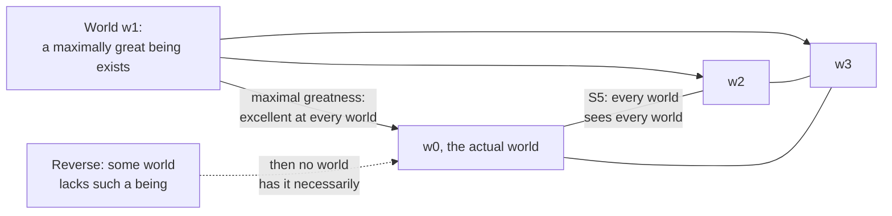

# Philosophy of Religion · Lesson 2.2: The modal ontological argument

> ⏱ ~15 min · Module 2: Ontological and cosmological arguments · Builds on: [2.1 Anselm's ontological argument](02-01-anselms-ontological-argument.md), [metaphysics 3.1](../../metaphysics/lessons/03-01-kinds-of-necessity.md), [metaphysics 3.2](../../metaphysics/lessons/03-02-what-possible-worlds-are.md) · Unlocks: [2.3 Cosmological arguments I](02-03-cosmological-arguments-the-per-se-regress.md), [2.4 Cosmological arguments II](02-04-cosmological-arguments-sufficient-reason.md)

## Why this matters

*Proslogion* 3 ([2.1](02-01-anselms-ontological-argument.md)) hinted that the strong ontological argument is about *necessary* existence, not existence. In the twentieth century Charles Hartshorne (*Man's Vision of God*, 1941) and Norman Malcolm ("Anselm's Ontological Arguments", 1960) rebuilt it in modal terms. Alvin Plantinga (*The Nature of Necessity*, 1974) then gave the version everyone now discusses. It is **valid** in the standard logic of metaphysical necessity, and almost nobody disputes that. So every disagreement about it has to land on one premise. This lesson carries out the logic and shows why that premise is where the whole question sits.

## The idea

Think of a property that, if it is had anywhere, has to be had everywhere. Being a mathematical truth is like that. If "there are infinitely many primes" is true in *some* possible world, it is true in all of them, because mathematical truths don't vary from world to world. So for that kind of claim, "possibly true" and "necessarily true" collapse into one.

Plantinga builds God's greatness to be that kind of property. A being is **maximally great** only if it exists, and is perfect, in *every* possible world. Now suppose that maximal greatness is so much as *possible*: some world contains a maximally great being. Then that being is, by definition, present and perfect in every world, ours included. "Possibly God" becomes "God."

The trick, if it is one, is that the possibility premise looks modest and isn't. For a property built this way, granting that it is possible already grants everything. An atheist can run the same machinery from the opposite premise, "possibly there is no maximally great being", and get atheism just as validly. The logic is a megaphone. It amplifies whichever possibility premise you feed it.

## The argument

**Definitions** (Plantinga 1974, paraphrased). A being is [maximally excellent](../reference.md#maximal-greatness) in a world $w$ iff it is omnipotent, omniscient and morally perfect in $w$. It is **maximally great** in $w$ iff it is maximally excellent in *every* world. Let $G$ abbreviate "a maximally great being exists." $\Box$ means "true in every possible world"; $\Diamond$ means "true in some possible world" (worlds as in [metaphysics 3.2](../../metaphysics/lessons/03-02-what-possible-worlds-are.md)).

This is a **de re** claim: maximal greatness is a property a particular being has, which is the "de re claim about a being's possible existence" [metaphysics 3.1](../../metaphysics/lessons/03-01-kinds-of-necessity.md) said this argument turns on. The individual, not just the sentence $G$, is what exists at every world. Since it is part of the definition, the following holds in every world: if a maximally great being exists here, it exists, maximally excellent, everywhere.

**The logic.** Three principles of modal logic are used. **K**: if $\Box(A \to B)$ and $\Diamond A$, then $\Diamond B$. **T**: $\Box p \to p$ (what is necessary is true). **Duality**: $\Diamond A$ is equivalent to $\neg\Box\neg A$. **S5** adds [axiom 5](../reference.md#s5-and-the-characteristic-axiom): $\Diamond p \to \Box\Diamond p$. *In words:* what is possible is necessarily possible, so the facts about what is possible are the same from every world. (S5 as a formal system belongs to [`philosophy-of-language-and-logic`](../../philosophy-of-language-and-logic/syllabus.md); this lesson needs only these steps.)

**Plantinga's argument.**

- **P1.** $\Diamond G$. *(The [possibility premise](../reference.md#possibility-premise).)*
- **P2.** $\Box(G \to \Box G)$. *(From the definition of maximal greatness.)*
- **3.** $\Diamond\Box G$. *(From P2 and P1 by K.)*
- **4.** $\Box G$. *(From 3 by derivation (i) below.)*
- **∴ C.** $G$. *(From 4 by T.)*

*In words:* if a maximally great being is possible, then it is possible that one exists necessarily. If that is possible, it is necessary. So it is actual.

**Derivation (i): $\Diamond\Box G \vdash \Box G$ in S5.**

1. $\Diamond\Box G$. *Premise.*
2. $\Diamond\neg G \to \Box\Diamond\neg G$. *Axiom 5, with $\neg G$ for $p$.*
3. $\neg\Box G \to \Box\neg\Box G$. *From 2: Duality turns $\Diamond\neg G$ into $\neg\Box G$, in both places.*
4. $\Box\neg\Box G \leftrightarrow \neg\Diamond\Box G$. *Duality, with $\Box G$ for $A$.*
5. $\neg\Box G \to \neg\Diamond\Box G$. *From 3 and 4.*
6. $\Diamond\Box G \to \Box G$. *Contraposition of 5.*
7. $\Box G$. *From 1 and 6, modus ponens.*

Line 6 is the dual form of axiom 5, and it is the step usually quoted as "S5's characteristic principle." Semantically: in S5 every world can see every world. So if some world sees $G$ everywhere, then "everywhere" includes ours. A weaker system, B, already proves $\Diamond\Box p \to p$, and that is enough for C. The argument is no hostage to S5 in particular.

**The [reverse ontological argument](../reference.md#reverse-ontological-argument).** Plantinga himself stated the rival premise, which he called *no-maximality*: possibly, no being is maximally great. Here it is in its strongest form, keeping P2, which the atheist need not deny (it only says what the concept requires).

**Derivation (ii): $\Diamond\neg\Box G \vdash \neg G$, given P2.**

1. $\Diamond\neg\Box G$. *Premise: possibly, maximal greatness is not necessarily instantiated.*
2. $\Box(G \to \Box G)$. *P2.*
3. $\Box(\neg\Box G \to \neg G)$. *From 2: contraposition inside the box (a tautology holds in every world).*
4. $\Diamond\neg G$. *From 3 and 1 by K.*
5. $\neg\Box G$. *From 4 by Duality.*
6. $G \to \Box G$. *From 2 by T.*
7. $\neg G$. *From 5 and 6, modus tollens.*

Notice that this direction never used axiom 5. It is valid with K and T alone. The theist's direction needs B or S5. Either way, once P2 is granted, the arguments are mirror images. In S5, P2 makes $\Diamond G$, $G$ and $\Box G$ equivalent: a maximally great being is either necessary or impossible, with nothing in between.

**Does Kant's objection touch it?** ([metaphysics 2.5](../../metaphysics/lessons/02-05-essence-and-existence.md) states the claim that [existence is not a predicate](../reference.md#existence-is-not-a-predicate).) Not directly. P2 doesn't add existence to a concept as a perfection. It says that *if* the property is instantiated at a world, it is instantiated at all of them, and existence at a world is handled by the semantics. A Kantian worry comes back in a new form, though: is "exists necessarily" a property a concept can just contain? If it is, then the question of whether that concept is possibly instantiated is the existence question all over again.

**Dialectical vs logical success.** Plantinga's own verdict (1974, paraphrased) is modest. The argument does not *prove* God's existence to someone who doubts the conclusion. Since he takes its key premise to be rationally acceptable, he holds that it shows belief in the conclusion to be rationally acceptable. That is a claim about [proof vs rational acceptability](../reference.md#proof-and-probability) (compare [1.1](01-01-which-god-and-what-an-argument-must-do.md)), not a claim that the argument should convince.

**Where the argument is weakest.** P1. The critic (J. L. Mackie, *The Miracle of Theism*, 1982, pressed Plantinga's own no-maximality premise against him) says that our grounds for believing $\Diamond G$ can be no better than our grounds for believing $G$, since in S5 with P2 the two are equivalent. And no-maximality looks every bit as conceivable. The two possibility premises are symmetric, so neither can be credited without begging the question. The defender replies that the symmetry can be broken. One way is to show that the perfections are mutually consistent, a project Leibniz already said Descartes's argument needed. Another is to argue that positive, maximal properties are better candidates for possibility than their negations, or to support $\Diamond G$ with an independent argument, such as a cosmological one ([2.4](02-04-cosmological-arguments-sufficient-reason.md)). The defender also thinks the critic is leaning on an unstated premise: that conceivability counts equally on both sides. The [conceivability checklist](../../metaphysics/lessons/03-01-kinds-of-necessity.md) contains a symmetry test, but it doesn't settle whether two conceivings really are on a par.

## The picture

If the being exists at one world, it exists at every world that world can see. In S5 that is all of them, so it includes ours. The dashed edge runs the same machinery from the opposite possibility premise.

## Worked examples

**Example 1 (clean case: a necessary-or-impossible proposition).** Let $C$ = "Goldbach's conjecture is true." Mathematical truths don't vary across worlds, so $\Box(C \to \Box C)$ holds, just like P2. Suppose someone asserts $\Diamond C$ because they "can't see any contradiction." From $\Diamond C$ and $\Box(C \to \Box C)$, K gives $\Diamond\Box C$. Derivation (i) gives $\Box C$, and T gives $C$. So this person has proved Goldbach's conjecture from a premise that felt cheap. Nobody thinks that. What the example shows is that, for a necessary-or-impossible proposition, *asserting possibility is asserting truth*, so the evidence for $\Diamond C$ has to be just as strong as the evidence for $C$. The theist's question is whether $\Diamond G$ can be known some other way than Goldbach's possibility can. The critic's question is how it could be.

**Example 2 (hard case: a modal parody).** Define a **maximally pervasive island** as an island that exists, with every great-making island feature, in every world. By construction, $\Box(I \to \Box I)$. If it is possible, the S5 step puts it in our world, and no such island exists. So the island's possibility premise is false. Gaunilo's parody ([2.1](02-01-anselms-ontological-argument.md)) returns in modal form. The defender's reply, Plantinga's to the original island, is that "island" has no intrinsic maximum. A better island could always have more palm trees, so "maximally great island" is not a coherent property at all, and the parody's P1 fails *for a reason*. A stronger parody avoids that reply by using intrinsic maxima: a being that is omnipotent, omniscient and *maximally evil* in every world. Now the theist has to explain why omnipotence and omniscience fit with perfect goodness but not with perfect evil. That is a substantive claim about the attributes, so it brings Module 1 back in.

## Watch out

- **You might think the critic attacks the S5 step, but** the logic is the least contested part. Reject S5 for B and the argument still goes through. The serious objections all target P1.
- **You might think $\Diamond G$ is the weak, safe premise, but** given P2 it is exactly as strong as $\Box G$. "Possibly a maximally great being" is not like "possibly a unicorn."
- **You might think the reverse argument assumes atheism, but** it begs the question exactly as much as P1 does, no more and no less. That symmetry is the objection.

## One-liner

> With necessary existence built into the concept, "possibly God" and "God" stand or fall together, so the modal ontological argument is valid and all the work goes into whether its possibility premise can be known without already knowing the conclusion.

## Problems

**P1 (🟢) *(Formal (a)–(b) · Evaluative (c))*** Let $E$ = "a maximally evil-great being exists," where such a being is omnipotent, omniscient and perfectly evil in every world. So $\Box(E \to \Box E)$. (a) From $\Diamond E$ and $\Box(E \to \Box E)$, derive $E$ in numbered lines with the rule for each. You may cite derivation (i) as a single step. (b) Add $\Diamond G$, P2, and $\Box\neg(G \wedge E)$ (no world has both beings). Derive a contradiction in numbered lines. (c) In two sentences, say what (b) shows about possibility premises of this form, and name the premise a theist would reject, with one reason.

**P2 (🟡) *(Exegetical (a) · Evaluative (b))*** Ada and Ben both accept S5 and P2 and agree that Plantinga's argument is valid. Ada asserts $\Diamond G$, and Ben asserts $\Diamond\neg G$. (a) Show in one or two lines why they cannot both be right, and say whether either of them has made a logical mistake. (b) Name one consideration that, if established, would rationally move Ben toward Ada, and one that would move Ada toward Ben. 100 words or fewer for (b).

**P3 (🔴, optional) *(Exegetical)*** An invented debate transcript:

> **Debater A:** I can conceive of a being with every perfection. I've checked: no contradiction in it. So it's possible, and I only need the *weakest* premise, that God is possible somewhere. S5 does the rest.
> **Debater B:** And I can conceive of a world with no God at all. So I'm entitled to my premise too.
> **Debater A:** Conceiving an empty world is easy. That shows nothing.

(a) Name the item in the [conceivability checklist](../../metaphysics/lessons/03-01-kinds-of-necessity.md) that A's first speech skips, and the item that B's reply invokes. (b) A calls $\Diamond G$ "the weakest premise." Name the hidden premise that makes this false, and say what it does. (c) Is A's last line consistent with A's first? One sentence. 120 words or fewer in total.

Solutions

**P1** *(Formal (a)–(b) · Evaluative (c))*

(a) Derivation:

1. $\Diamond E$. *Premise.*
2. $\Box(E \to \Box E)$. *Premise.*
3. $\Diamond\Box E$. *1, 2, K.*
4. $\Box E$. *3, derivation (i) (S5).*
5. $E$. *4, T.*

(b) Derivation:

1. $\Box G$. *From $\Diamond G$ and P2, exactly as in (a), lines 1–4.*
2. $\Box E$. *From (a), line 4.*
3. $G$. *1, T.*
4. $E$. *2, T.*
5. $G \wedge E$. *3, 4, conjunction.*
6. $\neg(G \wedge E)$. *From $\Box\neg(G \wedge E)$ by T.*
7. Contradiction. *5, 6.*

So $\Diamond G$ and $\Diamond E$ cannot both be true, given their definitions and the incompatibility premise. (Checked by brute force over every Kripke model with up to three worlds: the premise set is unsatisfiable in S5.)

**Must hit, any verdict (c):**

- (b) shows that possibility premises for necessary-or-impossible properties can't simply be granted on the basis of conceivability, since two equally conceivable ones are jointly inconsistent.
- A theist rejects $\Diamond E$, with a reason that is not just "because God exists". For example: perfect evil is not a coherent maximum (evil as privation, or an omniscient agent would see and be moved by the good), or omnipotence is incompatible with a will bent wholly on destruction.

**Wrong turns:** using derivation (ii) in (a), where nothing is negated. In (b), deriving $\neg E$ from $G$ without the incompatibility premise, which smuggles in the answer.

**Model answer (c), one of several:** The parody shows that a possibility premise of this shape can't be accepted just because it seems conceivable, since $\Diamond G$ and $\Diamond E$ are equally conceivable and cannot both hold. The theist denies $\Diamond E$: knowing everything, including the good, while being wholly bent against it is arguably incoherent, a claim that needs an independent defense.

---

**P2** *(Exegetical (a) · Evaluative (b))*

(a) From $\Diamond G$ and P2, Plantinga's argument gives $G$. From $\Diamond\neg G$ (so $\neg\Box G$ by Duality) and $G \to \Box G$ (P2 by T), modus tollens gives $\neg G$. So they would have $G \wedge \neg G$.

**Must hit, strict (a):**

- The two premises, together with P2, yield contradictory conclusions.
- Neither has made a *logical* mistake. Each argument is valid, and they differ only in a premise.

**Must hit, any verdict (b):**

- One mover for each side, and each must bear on *possibility* by some route other than simply asserting the conclusion. Toward Ada: a demonstration that the perfections are mutually consistent and positive (the Leibniz project), or an independent argument for a necessary being (2.4). Toward Ben: a proof that two attributes are incompatible (Module 1, e.g. omniscience and immutability), or a principled reason why negative possibilities are easier to know than positive ones.

**Wrong turns:** saying Ben "misuses S5" (his direction does not even need it). Answering (b) with "evidence that God exists", which moves both premises at once and so explains nothing.

**Model answer (b), one of several:** Ben should move if someone shows the divine attributes are jointly consistent, for example by deriving them all from a single property such as unlimited being, because that is direct evidence for possibility. Ada should move if Module 1's incoherence arguments land, for example if perfect knowledge of tensed facts is impossible for an immutable being.

---

**P3** *(Exegetical)*

**Must hit, strict:**

- (a) A skips the first item, conceiving a *scenario* rather than a description: "no contradiction I can find" is negative conceivability. Ideal conceivability is also acceptable. B invokes the **symmetry** item: an equally vivid conceiving of the negation cancels.
- (b) The hidden premise is P2, $\Box(G \to \Box G)$. Built into maximal greatness, it makes $\Diamond G$ equivalent to $\Box G$ in S5, so the "weakest" premise is as strong as the conclusion.
- (c) No. If conceivability without contradiction licenses A's possibility claim, it licenses B's equally. A needs a principled asymmetry, not a dismissal.

**Wrong turns:** blaming S5 rather than the premise. Saying that B's conceiving is weaker because it is "of an absence", which is the very asymmetry A owes an argument for.

**Model answer:** (a) A treats "no contradiction found" as conceiving a scenario. B's reply is the symmetry test. (b) The hidden premise is P2: maximal greatness includes existing in every world, so possibly-G is equivalent to necessarily-G, and the "weak" premise is the conclusion's equal. (c) No. A's dismissal of B's conceiving undercuts A's own method unless A can say why the two cases differ.

## Flashback

**From Lesson [1.4](01-04-eternity-immutability-and-simplicity.md) (Eternity, immutability, and simplicity):** *(Evaluative.)* Counterexample. The classical package runs in two steps: a simple being cannot change, since nothing in it could be swapped out; and a being that undergoes no change has no before and after in its life, so it is timeless. (a) Invent a case that tests the *second* step: something that undergoes no intrinsic change yet seems to have a before and after. Say exactly which inference your case blocks. (b) Give the best reply a classical theist can make to your case, then the critic's rejoinder. 120 words or fewer in total.

Solution

**Accept:** any case in which a thing's intrinsic properties stay fixed over an interval through which it still exists while other things change (a sealed crystal in a vault for a year as the guards change shifts; an inert particle drifting through empty space), provided the case is genuinely changeless intrinsically.

**Must hit, any verdict:**

- (a) The case blocks the inference from "no intrinsic change" to "no before and after": the crystal exists at the start of the year and at its end, so it has temporal location and duration without changing. Immutability alone does not yield timelessness.
- (b) A classical reply that names what the case has and God lacks. The crystal is in time by coexisting with changing things and by standing in relations to them that shift (first coexisting with the night shift, then with the day shift). The classical theist denies God any such real relation: on the view 1.4 uses (ST I q.13 a.7), God's relations to creatures are real in the creatures, not in God, and God's life is a single act possessed at once, not a persistence through an interval.
- (b) The critic's rejoinder aimed at that reply: a God who knows and acts on a changing world (Wolterstorff's promise first, fulfilment after) seems related to it at least as much as the crystal is to the guards, so the step to timelessness needs more than immutability plus the doctrine of relations.

**Wrong turns:** a case where the thing changes intrinsically (a melting ice cube); treating the counterexample as a refutation of simplicity or immutability, when it targets only the step from immutability to timelessness (an everlasting God unchanging in character is the view it leaves standing); concluding that God is or is not in time.

**Model answer, one of several:** (a) A sealed crystal sits unchanged in a vault for a year while the guards change shifts. It undergoes no intrinsic change, yet it existed in January and still exists in December, so "no change" does not give "no before and after." (b) Classical reply: the crystal is in time because it coexists with changing things and its relations to them shift; God has no real relations to creatures, and his life is possessed all at once rather than persisting. Rejoinder: a God who knows the guards' shifts and acts in history is related to time at least as much as the crystal, so immutability alone does not deliver timelessness.

## Connections

- **Backward:** *Proslogion* 3's necessary existence and Gaunilo's island come from [2.1](02-01-anselms-ontological-argument.md). Worlds, the de re claim and the conceivability checklist come from [metaphysics 3.1](../../metaphysics/lessons/03-01-kinds-of-necessity.md) and [3.2](../../metaphysics/lessons/03-02-what-possible-worlds-are.md). Whether the attributes are jointly coherent, which is now the substance of P1, is Module 1's question ([1.2](01-02-omnipotence-and-its-paradoxes.md)–[1.4](01-04-eternity-immutability-and-simplicity.md)).
- **Forward:** [2.4](02-04-cosmological-arguments-sufficient-reason.md) uses the same worlds machinery for the modal-collapse objection, and its necessary being is one proposed source of independent support for P1. Boss 2(c) sets the two derivations done here.
- **Sideways:** S5, accessibility and Kripke frames as a formal system belong to [`philosophy-of-language-and-logic`](../../philosophy-of-language-and-logic/syllabus.md). The "necessary-or-impossible" pattern is the same one mathematicians live with: a conjecture is never "contingently" true.
