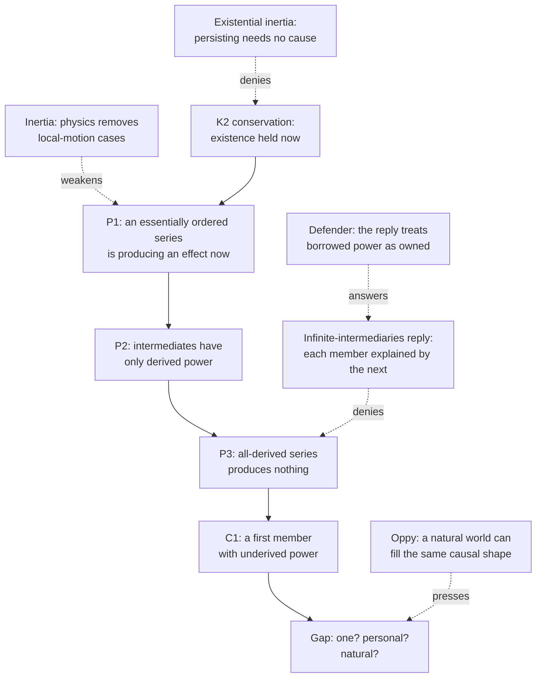

# Philosophy of Religion · Lesson 2.3: Cosmological arguments I: the per se regress

> ⏱ ~15 min · Module 2: Ontological and cosmological arguments · Builds on: [2.2 The modal ontological argument](02-02-the-modal-ontological-argument.md), [1.1 Which God, and what an argument must do](01-01-which-god-and-what-an-argument-must-do.md), [`metaphysics` 4.4](../../metaphysics/lessons/04-04-ordered-causal-series.md) · Unlocks: [2.4 Cosmological arguments II: sufficient reason](02-04-cosmological-arguments-sufficient-reason.md)

## Why this matters

The ontological arguments of 2.1–2.2 start from a concept. Cosmological arguments start from the world: something exists, or causes, or depends, and that fact is supposed to need a source. They come in three families that succeed or fail for unrelated reasons. This lesson takes the oldest: a **hierarchy of borrowed power needs a lender**. It needs no beginning of time (that is the kalam, [2.5](02-05-cosmological-arguments-the-kalam.md)) and no general principle of sufficient reason (that is [2.4](02-04-cosmological-arguments-sufficient-reason.md)). It needs one premise about regresses. Several courses defer the verdict here: whether the Second and Third Ways succeed as arguments, what physics does to a premise about movers, and what a first member would have to be.

## The idea

Take the distinction as given from [`metaphysics` 4.4](../../metaphysics/lessons/04-04-ordered-causal-series.md): in a [per se series](../reference.md#per-se-and-per-accidens-series) each intermediate member exercises its power now only because the member above it is exercising its power now. In a per accidens series each member owns what it has.

Picture a live radio play carried across a country by repeater towers. Each tower originates nothing. It retransmits exactly what it is receiving, and only while it receives it. Ask where the play is coming from, and pointing at the next tower up is a correct answer, but not a final one. It defers the question.

Now let the towers run up the chain forever, with no studio anywhere. Two intuitions collide. One says that every tower's output is fully explained by its input, so nothing is unexplained. The other says that a stack of pure relays, however tall, has nothing to relay; infinitely many repeaters with no source broadcast silence. **The per se regress argument bets on the second intuition.** The infinite-intermediaries reply bets on the first. Most of this lesson is about which bet is better.

Note what is *not* in the picture: time. Aquinas himself held that an infinite per accidens series (one man begetting another, without end) is not impossible. It is the per se series, the stick moved by the hand, that cannot go to infinity (*Summa Theologiae* I q.46 a.2 ad 7). The argument is about vertical dependence now, not about whether the world had a first day.

## The argument

**R: the per se regress argument.** A neutral skeleton, which defenders (Aquinas's Second Way read with ad 7; Feser, *Five Proofs of the Existence of God*, 2017) and critics (Oppy) both recognize:

1. **P1.** Some effect is being produced now by an essentially ordered series. *In words:* there is at least one real hierarchy of borrowers.
2. **P2.** In such a series every intermediate member's power to produce the effect is derived, held only while the member above exercises its own.
3. **P3 (the regress premise).** A series every one of whose members has only derived power produces no effect.
4. **C1.** So the series has a member whose power, in that series, is underived: a first member. (From P1–P3.)
5. **P4.** If that member's power is in turn derived from some other series, apply P1–P3 to that series.
6. **∴ C.** There is at least one being whose causal power is underived from anything.

*In words:* borrowing all the way up means nothing was ever lent, so somewhere there is an owner.

The Second Way states P3 compactly, and in a form critics seize on: "to take away the cause is to take away the effect" (q.2 a.3), so without a first cause there would be no intermediate or last. Read literally, this assumes what is at issue. An infinite series takes nothing away. Thomas Oberle (2022) argues that affirming an infinite series is not the same as removing the first member of a finite one. Defenders read the text as the borrowing point above, not as a remark about counting.

**What modern physics does to P1.** If "moved" means local motion, Newton's first law removes the paradigm cases: a coasting body needs no mover. Defenders reply that the principle concerns any actualizing of a potency, not locomotion. That exchange, with Kenny's objection, is already set out in [`metaphysics` 4.4](../../metaphysics/lessons/04-04-ordered-causal-series.md) and [`mechanics-refresher` 1.2](../../mechanics-refresher/lessons/01-02-newtons-laws.md). Its upshot for R is this: physics no longer *supplies* P1. P1 becomes a metaphysical claim about derived power, which a naturalist may decline to grant.

**K: the contingency argument in Thomist form.** The Third Way has two halves ([`ancient-medieval-philosophy` 7.3](../../ancient-medieval-philosophy/lessons/07-03-the-five-ways-as-text.md) reads the text; [`thomistic-synthesis` 3.3](../../thomistic-synthesis/lessons/03-03-the-third-fourth-and-fifth-ways.md) gives the framework). The first half moves from "each corruptible thing at some time is not" to "at some time nothing was." As logic, that is the quantifier swap flagged in [`philosophical-method` 1.4](../../philosophical-method/lessons/01-04-argument-forms-and-formal-fallacies.md):

$$\forall x\, \exists t\; \neg E(x,t) \;\not\vdash\; \exists t\, \forall x\; \neg E(x,t)$$

*In words:* that every corruptible thing fails to exist at some time does not entail that there is a time when they all fail to exist. Here $E(x,t)$ means "$x$ exists at $t$." Each repair (an infinite past, a restricted domain) adds a premise the text does not state. The second half is R again, applied to things that "have their necessity caused by another."

Modern Thomists usually run the [argument from contingency](../reference.md#argument-from-contingency) without the first half:

- **K1.** Some things exist whose existence is not part of what they are.
- **K2 (conservation).** Whatever does not have existence of itself is, at each moment it exists, being given existence by something.
- **K3.** By R, a series of existence-givers that are themselves given existence has a first member.
- **∴ C.** Something exists whose existence is underived.

K avoids the physics trouble, since existing is not moving. It pays for this with K2, the premise the [existential inertia](../reference.md#existential-inertia) thesis denies (Beaudoin, Oppy, Schmid): on that view persisting is the default and needs no sustainer. Without K2 there is no per se series for R to regress.

**What "first" gives you.** C gives a being with underived power, or underived existence, and nothing more. It does not give **uniqueness**, since separate series might end in separate firsts. It does not give **personhood**, since nothing in "owns its power" implies intellect or will. And it does not rule out a **natural** first member. Oppy argues that whatever causal shape the theist posits (an infinite regress, a contingent initial state, a necessary initial state), the naturalist can posit the same shape with the natural world in it. That is [the gap problem](../reference.md#the-gap-problem) of [1.1](01-01-which-god-and-what-an-argument-must-do.md) in its sharpest form. Aquinas closes it with further arguments from simplicity, perfection and unity (q.3–11, set out in [`thomistic-synthesis` 3.4](../../thomistic-synthesis/lessons/03-04-divine-simplicity-and-the-attributes.md)), and those arguments must succeed on their own.

**Where the argument is weakest.** P3. The critic offers the [infinite-intermediaries reply](../reference.md#infinite-intermediaries-reply): in an infinite per se series each member's activity is explained by the next, no member is left unexplained, and demanding a first member is demanding an explanation of the whole series. That demand is the PSR, which R promised not to need ([2.4](02-04-cosmological-arguments-sufficient-reason.md)). The defender answers that the reply quietly treats derived power as owned power. It explains each relay as if it were a source, and so denies the per se distinction rather than answering the argument built on it. This is the line of Feser's *Five Proofs*; Oppy (2019) and Feser (2021) took it up in an exchange in *Religious Studies*. Underneath is one crux: is a derived-power explanation a *deferral*, which an infinite regress never pays out, or a *complete local explanation*, which an infinite regress pays out at every step? The same fork divides infinitists from foundationalists about justification ([`epistemology` 2.1](../../epistemology/lessons/02-01-the-regress-problem.md)).

## The argument map

Solid arrows are steps of R; dashed arrows are objections and replies, each aimed at the premise it denies.

## Worked examples

**Example 1 (clean): the repeater chain with a studio.** Run R on the finite case. P1: tower 1's transmission now depends on tower 2's transmission now, and so on up to a studio. P2: each tower's output is derived. Kill any tower and everything below goes silent at once. P3 is not even needed, because the chain is finite and visibly ends: C1 holds, and the studio is the first member.

Now apply P4. The studio's transmitter runs on grid power, which runs on a turbine. The studio is first *in this series* and derived *simpliciter*. That is the lesson's most useful distinction. C1 gives a series-relative first, and only the iteration in P4 pushes toward an unconditionally underived being. Every step of that iteration needs P3 again.

**Example 2 (where it strains): towers forever.** Stipulate infinitely many towers, no studio, and ignore travel time. Each tower is retransmitting a signal.

*The critic's reading.* Assign each tower $n$ the signal it receives from tower $n+1$. Every tower's output is accounted for, and no tower does anything unexplained. The only question left is "why is there signal in the system at all?", and that question is about the whole. Whether wholes need explanations beyond their members is the Hume–Edwards dispute, which belongs to [2.4](02-04-cosmological-arguments-sufficient-reason.md).

*The defender's reading.* Each explanation is conditional: tower $n$ broadcasts *if* tower $n+1$ does. Infinitely many conditionals never discharge an antecedent. The critic's "every tower is explained" means only "every tower is explained given the next," and the case was built so that this is all there ever is.

Who is right turns on what the stipulation hides. If the signal is something the towers *have* (an owned state passed along), the critic's model fits, and the series starts to look per accidens. If the signal is something each tower *exercises only while receiving* (the per se case), the defender has a point, but only by asserting P3 about this very case. The example does not settle the crux. It shows exactly where the crux sits.

## Watch out

- **You might think the argument needs the universe to have a beginning, but actually** it is indifferent to time. Aquinas allowed an infinite per accidens past (q.46 a.2 ad 7). Arguing that the past is finite is the kalam's job ([2.5](02-05-cosmological-arguments-the-kalam.md)).
- **You might think "first" means earliest, but actually** it means underived in the order of dependence, and C1 gives that only relative to one series. The road to an unconditionally first being, and then to God, is further argument (P4, then the gap).
- **You might think refuting the Third Way's quantifier shift refutes the contingency argument, but actually** the shift infects only the first half. The modern Thomist form K drops that half and stands or falls on K2 and P3.

## One-liner

> The per se regress says a tower of borrowers needs a lender. The infinite-intermediaries reply says each borrower is paid by the next. The crux is whether derived power defers an explanation or completes one, and even a lender, if granted, is not yet God.

## Problems

**P1 (🟢)** *(Exegetical.)* **Find the crux.** An invented debate transcript:

> **Ada:** Grant your hierarchy. The series of dependences goes up forever. Every member is explained by the one above it. What's missing?
>
> **Bram:** The power. Stack up borrowers without end and nobody has lent anything.
>
> **Ada:** And suppose I give you a first member. Why not the fundamental physical fields? They have whatever powers they have, underived.

(a) Which numbered premise of R are Ada's first speech and Bram's reply disputing, and what is Ada's move called? (b) Which part of the argument does Ada's last speech target, and does it deny C? Two sentences per part.

**P2 (🟡)** *(Exegetical (a) · Evaluative (b).)* **Apply to a hard case.** An invented financial arrangement: Arden Bank's bond is rated sound only because Brill Bank guarantees it; Brill's guarantee counts only because Crane Bank guarantees Brill; and so on without end. No bank in the chain holds any assets. The moment any guarantor is downgraded, every bond below it is downgraded too.

(a) Is this chain per se or per accidens? Name the mark that decides it. (b) Most readers judge Arden's bond worthless. Does the case therefore support P3, or does it presuppose P3? **150 words or fewer for (b).**

**P3 (🔴, optional)** *(Evaluative.)* **Steelman and reply.** (a) State the existential inertia objection to argument K at the strength its defenders would recognize, and name the premise it denies. (b) Give the best reply on the defender's behalf, and say what that reply has to assume. **150 words or fewer in total.**

Solutions

**P1** *(Exegetical.)*

**Must hit, strict (a):**

- P3, the regress premise. Ada denies that a series made entirely of derived-power members produces nothing; Bram asserts it.
- Ada's move is the **infinite-intermediaries reply**: each member is explained by the next, so no first member is needed.

**Must hit, strict (b):**

- It targets the **gap** from C to God. It does not deny C. It grants a being with underived power and proposes a natural candidate for it, which is Oppy's point that a naturalist can fill the same causal shape.

**Wrong turns:** reading Ada's "goes up forever" as an infinite *past*. Nothing here is temporal, and the kalam is 2.5. Saying Ada's last speech denies P1: she accepts the hierarchy and disputes only what sits at its top.

---

**P2** *(Exegetical (a) · Evaluative (b).)*

**Must hit, strict (a):**

- **Per se.** Each bond's soundness is held now, only while the guarantor above it holds its own (M2, derived "power"). Immediate collapse on downgrade (M3) is the diagnostic. Either mark, correctly explained, earns credit, but naming M2 as the defining one is better.

**Must hit, any verdict (b):**

- State the pull: with no assets anywhere, nothing backs anything, which is exactly P3's intuition.
- Test whether the intuition is independent of P3. Our judgment that the bond is worthless comes from knowing that a guarantee is a promise to pay out of *assets*, so "guarantee" already builds a lender into the concept. If so, the case presupposes P3 for guarantees rather than supporting it for causation in general.
- Say what the defender can reply. Derived causal power is like a guarantee in exactly that respect, which is what "derived" means. The critic in turn can ask whether that analogy holds.

**Wrong turns:** treating the chain as per accidens because it "stretches out." Extent is irrelevant, and the downgrade propagates at once. Answering only "yes, it's worthless" without asking where the judgment comes from.

**Model answer (b), one of several:** The case makes P3 vivid but does not independently support it. We judge Arden's bond worthless because a guarantee *means* a claim that ultimately pays out of assets. Remove every asset and the chain is empty by definition. So the case presupposes a regress premise for guarantees: no ultimate payer, no value. Whether causal power is like that is exactly what is in dispute. A defender will say it is, since derived power just is power held on another's account, so the case illustrates P3 correctly. A critic will say causal activity, unlike creditworthiness, is fully present in each member, so the analogy imports the conclusion. The case moves only someone who already reads "derived" the defender's way.

---

**P3** *(Evaluative.)*

**Must hit, any verdict:**

- (a) Target **K2** (conservation). The objection: persisting is the default; a thing continues unless something destroys it, so continued existence needs no positive cause. It must be stated as a positive thesis, not as "maybe nothing sustains things."
- Note what it leaves standing. It grants the per se distinction and P3; it removes the per se series K needs.
- (b) A reply that engages K2 directly. Options: if what a thing is does not include *that* it is, nothing in the thing accounts for its persisting, so "default" names no ground; or physical inertia presupposes a nature already actual and so cannot ground existing. Then name the cost. The reply assumes that persisting needs a ground at all, which edges toward the PSR (2.4).

**Wrong turns:** answering with Newtonian inertia. Existential inertia is about existing, not moving. Treating the objection as a denial of P3.

**Model answer, one of several:** Existential inertia denies K2. A thing that exists keeps existing unless something destroys it; persistence is the absence of an event, not an achievement needing an agent. K then has no present-tense series of existence-givers, and R has nothing to regress. The defender replies that "default" is not an explanation. If a thing's essence does not include existing, nothing about the thing accounts for its existing now rather than not, so something else must. That reply assumes that a thing's existing at each moment needs some ground, which is a restricted sufficient-reason principle. So the dispute moves to 2.4.

## Flashback

**From Lesson [2.1](02-01-anselms-ontological-argument.md) (Anselm's ontological argument):** *(Exegetical.)* **Diagnose.** An invented newspaper column:

> Anselm's famous proof boils down to this: if I can think of a perfect God, God must exist. Gaunilo exposed its false premise long ago with his perfect island, which shows that what we can conceive need not be real. Then Kant finished the job: existence is not a predicate, so every version collapses, including Anselm's claim that God cannot even be conceived not to exist.

Name three places where the column misdescribes the argument or the replies, and correct each. One sentence per error. Judge the description, not the column's verdict.

Solution

**Must hit, strict:**

- **The argument.** It is not "whatever I can think of exists" (plainly invalid, and never used by Anselm) but a reductio on one specific description, "that than which nothing greater can be conceived", driven by the greater-than premise P3.
- **The island.** A parody does not expose *which* premise is false; it shows that something proves too much, and the debate becomes whether the defender has a principled difference. The intrinsic-maximum reply locates the island's failure in the island's own P1: the description is incoherent.
- **Kant.** His thesis targets P3 of chapter 2 at most. Chapter 3's Q2 compares two concepts (a being that can be conceived not to exist, and one that cannot), so the predicate objection by itself does not reach it. Malcolm accepted Kant against chapter 2 and denied it touches chapter 3; the weight shifts to Q1, the possibility premise.

**Wrong turns:** treating "the argument fails" as one of the errors. A critic can accept all three corrections and still reject the argument, and a defender needs them too. Correcting the island point by saying the island parody is simply bad: it is a legitimate proves-too-much objection, and the reply has to show a principled difference.

**Model answer:** (1) Anselm does not argue from "I can think of it" to "it exists"; he runs a reductio on one description, powered by the premise that existing in reality is greater than existing in the understanding alone. (2) The island does not expose a false premise; as a parody it shows only that something proves too much, and the intrinsic-maximum reply answers that the island's description, unlike God's, is incoherent. (3) Kant's thesis touches at most chapter 2's greater-than premise; chapter 3 compares conceivable and inconceivable non-existence, which Malcolm held survives Kant, leaving the dispute on whether necessary existence is possible.

## Connections

- **Backward:** the per se/per accidens distinction and the conservation premise are [`metaphysics` 4.4](../../metaphysics/lessons/04-04-ordered-causal-series.md)'s, used here, not re-taught. The text of the Second and Third Ways is [`ancient-medieval-philosophy` 7.3](../../ancient-medieval-philosophy/lessons/07-03-the-five-ways-as-text.md), and the Thomist framework for them is [`thomistic-synthesis` 3.2](../../thomistic-synthesis/lessons/03-02-the-first-and-second-ways-inside-the-system.md) and [3.3](../../thomistic-synthesis/lessons/03-03-the-third-fourth-and-fifth-ways.md). The gap problem is [1.1](01-01-which-god-and-what-an-argument-must-do.md)'s.
- **Forward:** [2.4](02-04-cosmological-arguments-sufficient-reason.md) asks what happens if you demand an explanation of the whole series, which is where the infinite-intermediaries reply sends the debate. [2.5](02-05-cosmological-arguments-the-kalam.md) adds the premise this lesson avoids, a finite past.
- **Sideways:** the regress fork is the one [`epistemology` 2.1](../../epistemology/lessons/02-01-the-regress-problem.md) runs for justification, where infinitism plays the infinite-intermediaries role. Inertia as physics is [`mechanics-refresher` 1.2](../../mechanics-refresher/lessons/01-02-newtons-laws.md). [`thomistic-synthesis`](../../thomistic-synthesis/syllabus.md) takes the regress into act and potency, and [`apologetics-foundations`](../../apologetics-foundations/syllabus.md) argues for the theist side on top of this lesson.
