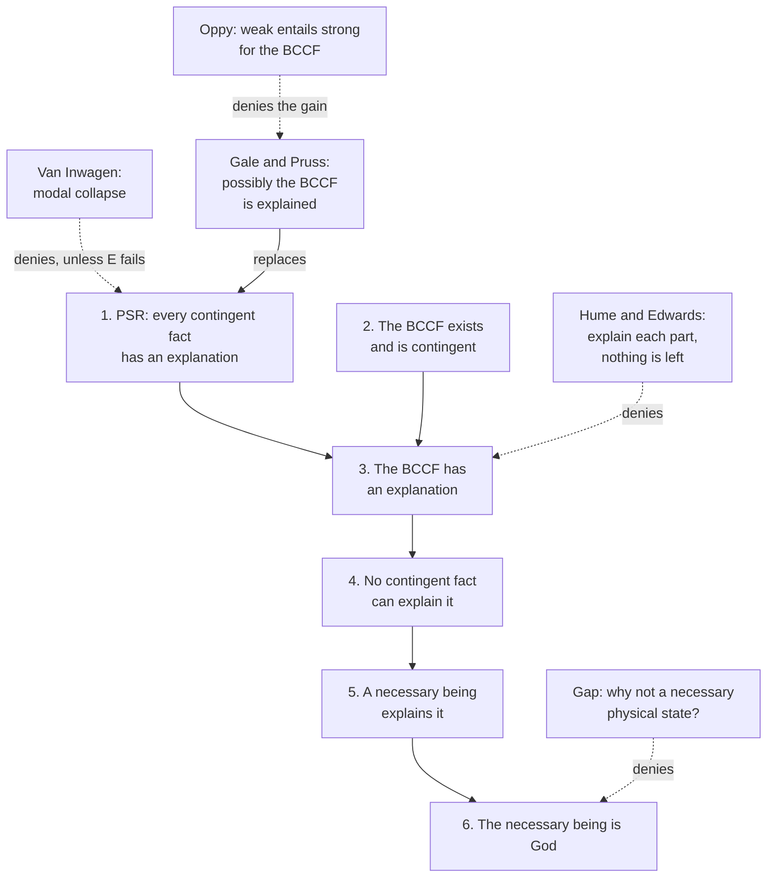

# Philosophy of Religion · Lesson 2.4: Cosmological arguments II: sufficient reason

> ⏱ ~15 min · Module 2: Ontological and cosmological arguments · Builds on: [2.3 The per se regress](02-03-cosmological-arguments-the-per-se-regress.md), [2.2 The modal ontological argument](02-02-the-modal-ontological-argument.md), [`metaphysics` 3.3](../../metaphysics/lessons/03-03-brute-facts-and-necessary-existence.md) · Unlocks: [2.5 The kalam](02-05-cosmological-arguments-the-kalam.md)

## Why this matters

The per se regress of [2.3](02-03-cosmological-arguments-the-per-se-regress.md) asks what keeps things going *now*. The argument in this lesson asks something larger: why is there any world at all, and why this one? It grants that the world might be eternal, so no cosmology refutes it. Its whole weight rests on the PSR, and its strongest objection comes from that principle: at full strength, the PSR seems to prove that nothing could have been otherwise.

## The idea

[`metaphysics` 3.3](../../metaphysics/lessons/03-03-brute-facts-and-necessary-existence.md) stated the **[principle of sufficient reason](../reference.md#principle-of-sufficient-reason)** in its strengths, from "every truth has an explanation" down to "every fact possibly has one", and stopped there. Here we put it to work.

The Leibnizian move: explain each contingent thing by an earlier one, as far back as you like, even forever. You have still not explained why there is a chain of contingent things at all, since every explanation inside it hands the question back to another member. So if the whole has a reason, the reason lies outside the chain, in something that is not contingent. A necessary being is the only candidate.

The reason sought is not a cause in time. An eternal world has no first moment for a cause to occupy. It is an explanation of *why the whole obtains*, closer to the grounding explanation of [`metaphysics` 2.4](../../metaphysics/lessons/02-04-essence-and-grounding.md) than to the causal kind.

## Source

Leibniz, "On the Ultimate Origination of Things" (1697), in Latta's translation (1898):

> The sufficient reason of existence cannot be found either in any particular thing or in the whole aggregate and series of things. Let us suppose that a book of the elements of geometry existed from all eternity and that in succession one copy of it was made from another, it is evident that although we can account for the present book by the book from which it was copied, nevertheless, going back through as many books as we like, we could never reach a complete reason for it, because we can always ask why such books have at all times existed, that is to say, why books at all and why written in this way.

He then applies this to the world: each state of the world is, in some sort, a copy of the one before it. The *Monadology* (1714) gives the same argument in a few lines, concluding that the reason "must be outside of the sequence or series of particular contingent things, however infinite this series may be" (§37). Notice that Leibniz grants the infinite past, and that he asks two questions: *why books at all* (existence) and *why written in this way* (specification). A good reply must answer both.

## The argument

Samuel Clarke ran a closely parallel argument in *A Demonstration of the Being and Attributes of God* (1705, from his Boyle lectures). Something has always existed. Whatever has existed is either independent, having the reason of its existence in itself, or dependent. An infinite succession of dependent beings has no reason for its existence, neither from within nor from outside. So an independent being exists. Here is the shared skeleton, in Leibniz's terms:

1. **Every contingent fact has an explanation.** (the PSR, contingency row)
2. **There is a big conjunctive contingent fact (BCCF): the conjunction of all contingent truths.** *In words:* the whole story of the contingent world, as one fact.
3. **The BCCF is contingent, so by 1 it has an explanation.**
4. **No contingent fact can explain the BCCF.** Any such fact is already one of its conjuncts, so the BCCF would be partly explaining itself.
5. **So the BCCF is explained by a necessary fact, namely the existence or activity of a necessary being.**
6. **That necessary being is God.**

Premise 1's case for and against is [`metaphysics` 3.3](../../metaphysics/lessons/03-03-brute-facts-and-necessary-existence.md)'s; the objections owned here attack what follows.

**The [Hume–Edwards objection](../reference.md#hume-edwards-objection)** targets 3 and 4. Hume's Cleanthes, in *Dialogues* Part IX, argues that once you have explained each particle in a collection, you have explained the collection. Paul Edwards ("The Cosmological Argument", 1959) sharpened this. Five Inuit are standing on a New York street corner. Explain why each one is there: one came for the climate, one followed his wife, and so on. Then "why is the *group* there?" asks for nothing more. On this view the BCCF is not a further fact over and above its conjuncts, so explaining each conjunct by another leaves no residue. The defender's reply, as William Rowe put it (*The Cosmological Argument*, 1975), is that explaining why each dependent being exists is different from explaining why there are dependent beings at all. Notice the asymmetry with Edwards's case. Each Inuit's explanation reaches *outside* the group (the climate, a job). In Leibniz's library, every explanation stays inside the series. The defender says the residue is exactly the existence question, *why books at all*. The critic says that question is well-posed only if premise 1 already covers totalities.

**The [modal-collapse objection](../reference.md#modal-collapse)** (Peter van Inwagen, *An Essay on Free Will*, 1983). It targets premise 5, and through it premise 1 at full strength. Let $p$ be the BCCF and $q$ its explanation. Read "possible worlds" as in [`metaphysics` 3.2](../../metaphysics/lessons/03-02-what-possible-worlds-are.md); $\Box$ is "true in every world".

| Line | Claim | Rule |
|---|---|---|
| 1 | Every contingent truth has an explanation | strong PSR |
| 2 | $p$ is true and contingent: $p \wedge \Diamond \neg p$ | definition of the BCCF |
| 3 | Some true $q$ explains $p$ | 1, 2 |
| 4 | If $q$ explains $p$, then $\Box(q \to p)$ | premise E: explanation entails |
| 5 | $q$ is necessary or $q$ is contingent | excluded middle, since $q$ is true |
| 6 | If $\Box q$: with 4, $\Box p$, contradicting 2 | from $\Box(q \to p)$ and $\Box q$, infer $\Box p$ |
| 7 | If $q$ is contingent: $q$ is a conjunct of $p$, so $q$ helps explain itself | definition of the BCCF; nothing contingent explains itself |
| 8 | Contradiction either way, so reject 1 or E, or deny there is any contingent truth | 5, 6, 7 |

*In words:* a necessary explanation that entails the world makes the world necessary, and a contingent explanation is part of what needed explaining. Van Inwagen rejects line 1. Spinoza, in effect, accepted the collapse: every truth is necessary. Most defenders of the argument deny **E**. Leibniz had already said that the reasons for contingent things lie "not in necessitating reasons, that is to say, reasons of an absolute and metaphysical necessity, the opposite of which involves a contradiction, but in inclining reasons." Alexander Pruss (*The Principle of Sufficient Reason: A Reassessment*, 2006) develops this. A libertarian free choice explains its outcome without entailing it. So the BCCF can be explained by a necessary being's free choice, and the choice does not make the world necessary.

**The [weak-PSR](../reference.md#weak-psr) version.** Richard Gale and Pruss ("A New Cosmological Argument", *Religious Studies*, 1999) replace line 1 with a modest principle:

- **W1.** Possibly, the actual BCCF $p$ has an explanation.
- **W2.** In a world where it does, the explanation cannot draw on contingent beings, since they belong to what is explained. So it is the intentional act of a necessary being.
- **W3.** So possibly a necessary being exists. By the S5 step of [2.2](02-02-the-modal-ontological-argument.md), a being that possibly exists necessarily exists necessarily, and so actually.

Graham Oppy ("On 'A New Cosmological Argument'", 2000) argues that, applied to a fact as total as the BCCF, the weak principle entails the strong one. If so, the advantage disappears.

**The [gap](../reference.md#the-gap-problem).** Premise 6 is a separate argument ([1.1](01-01-which-god-and-what-an-argument-must-do.md)). Leibniz moves fast: since everything is connected, one sufficient reason serves for all of it, so there is only one God, and that one suffices (§39, paraphrased). Clarke derived independence, eternity, immutability, infinity and omnipresence from necessity alone. He then argued separately, from features of the world, for intelligence, wisdom and goodness. A naturalist such as Oppy replies that if a necessary foundation is needed, a necessary physical initial state, or necessary laws, would serve as well. The theist's rejoinder ties the gap to the collapse objection. Only a free agent explains without necessitating, so whatever escapes the collapse is already personal. (A related route traces all possibility back to the powers of a necessary being: Pruss's powers modality, from [`metaphysics` 3.2](../../metaphysics/lessons/03-02-what-possible-worlds-are.md).)

**Where the argument is weakest.** The critic attacks premise 1 at the strength the argument needs. It must apply to the BCCF, the one fact whose explanation is in dispute, and it must survive modal collapse. The critic says it cannot do both without denying E. Once E is denied, a "sufficient" reason no longer guarantees its outcome, so the reason may not answer Leibniz's *why written in this way*. The defender thinks the objection itself rests on E. Explanations by free choice are everyday ones, and E would rule them all out, not just the cosmic one.

## The argument map

Alt text: an argument map from the PSR through the big conjunctive contingent fact to a necessary being and God, with three objections and a weak-PSR branch.

## Worked examples

**Example 1 (clean case: whose explanations leave the group?).** Run Hume–Edwards on two collections. First, Edwards's five Inuit. Every individual explanation cites something outside the five, so once each is explained, nothing about the group's presence is left over. Second, Leibniz's eternal library. Each book is explained by the book it was copied from, and nothing else. Explain every member and you have still not said why there are geometry books rather than none. The test: *do the members' explanations ever cite anything outside the collection?* If they do, Edwards's verdict is hard to resist; if never, the defender has a residue to point at. Whether that residue is a genuine fact needing explanation is what premise 1 decides.

**Example 2 (hard case: does a free choice give a sufficient reason?).** Invented case. Ilse, a libertarian-free agent, chooses tea over coffee because she wants warmth. Her wanting warmth explains the choice. Yet in a world just like this one up to the moment of choice, she chooses coffee instead, because she wants the caffeine. Does "she wanted warmth" give a sufficient reason?

- *With the defender (denying E):* yes. Everyday life accepts it as a full explanation; demanding entailment would make every free action inexplicable.
- *With the critic:* it explains why tea was an option worth choosing, not why tea *rather than* coffee. The contrastive question, Leibniz's "why this rather than another", is left unanswered. A reason that leaves the contrast open is not *sufficient* in the sense premise 1 needed.

The crux is narrow: does a strong PSR demand contrastive explanation? If it does, denying E costs the argument its strength. If it does not, the collapse is avoided.

## Watch out

- **You might think the argument needs a beginning, but** Leibniz and Clarke both allow an eternal series. The need for a beginning belongs to the kalam ([2.5](02-05-cosmological-arguments-the-kalam.md)), which can fail or succeed independently.
- **You might think Hume–Edwards is only a fallacy-of-composition charge, but** it is a claim about what facts there are: if the BCCF is a genuine fact, the PSR already applies to it.
- **You might think modal collapse refutes the argument, but** it refutes the PSR *together with* E. Which of the two to give up is the live dispute.

## One-liner

> Explaining every link leaves "why a chain at all?", unless the chain is nothing over and above its links; and a reason strong enough to answer that question threatens to make everything necessary, unless reasons can explain without entailing.

## Problems

**P1 (🟢) *(Exegetical (a) · Evaluative (b))*** Clarke's argument, as paraphrased in this lesson: something has always existed; whatever exists is either independent, with the reason of its existence in itself, or dependent; an infinite succession of dependent beings has no reason for its existence from within or from outside; so an independent being exists. (a) Put it in numbered premises (P1… ∴ C). Make explicit the premise Clarke leaves implicit, the one that says what is wrong with "no reason". (b) Name the premise of your reconstruction that the Hume–Edwards objection attacks, and say in two sentences or fewer what a defender says that objection itself assumes.

**P2 (🟡) *(Exegetical (a) · Evaluative (b))*** Invented case. The Abbey of Saint Ivo has, we stipulate, had a choir singing the night office for an infinite past. Every chorister was trained by an earlier chorister, and each joined for a personal reason: one for a vocation, one for the bursary, one because his brother was already there. (a) Sort the explanations in the case into those that stay inside the series of choristers and those that reach outside it, and say which question about the choir neither kind answers. Two or three sentences. (b) Does the choir as a whole need an explanation beyond those of its members? Any verdict, 150 words or fewer, but you must engage both Edwards's claim and Rowe's distinction.

**P3 (🔴, optional) *(Formal (a)–(b) · Exegetical (c))*** Use the eight-line modal-collapse derivation in this lesson, and the weak-PSR argument W1–W3. (a) Which line of the derivation does the weak-PSR argument never assert, and what replaces it? (b) Suppose E (line 4) holds in the world $w$ where $p$ is explained by $q$. Show, in numbered steps with the rule used, that the argument meets the same dilemma in $w$, so it must deny E just as the strong-PSR defender does. Assume that $p$ is the conjunction of *all* the actual contingent truths, and that worlds agreeing on every contingent truth are the same world. (c) In one sentence, say how your result in (b) bears on Oppy's objection.

Solutions

**P1** *(Exegetical (a) · Evaluative (b))*

**Must hit, strict (a):**

- A premise that something exists, or has always existed.
- The exhaustive split: every being is independent (has the reason of its existence in itself) or dependent (has it in another).
- The premise that an infinite succession of dependent beings, taken as a whole, has its reason neither in itself nor in anything outside it.
- The implicit premise made explicit: everything that exists has a reason for its existence (a PSR).
- The conclusion: at least one independent being exists.

**Must hit, any verdict (b):**

- Hume–Edwards attacks the premise that the succession *as a whole* lacks a reason: on that view, explaining each member by its predecessor explains the whole, because the whole is nothing over and above its members.
- The defender's diagnosis: the objection assumes that the totality is not a further fact, or that explaining each member explains why there are any members at all. Rowe's distinction denies exactly this.

**Wrong turns:** leaving the PSR out, so that "has no reason" carries no force; saying Hume–Edwards attacks "something has always existed", which Clarke and his critics both grant.

**Model answer (a):** P1. Something has always existed. P2. Every being is either independent (the reason of its existence is in itself) or dependent (the reason is in another). P3. Every being that exists has a reason for its existence. P4. If only dependent beings had ever existed, there would be an infinite succession of dependent beings. P5. An infinite succession of dependent beings has its reason neither in itself, since each member is dependent, nor outside itself, since by hypothesis there is nothing else. P6. So not only dependent beings have existed (P3, P4, P5). ∴ C. At least one independent being exists (P1, P2, P6). (b) Hume–Edwards attacks P5: once each member is explained by its predecessor, the series is explained. The defender replies that this assumes that explaining each member explains why there are dependent members at all, which is the very point at issue.

---

**P2** *(Exegetical (a) · Evaluative (b))*

**Must hit, strict (a):**

- *Internal:* each chorister's training by an earlier chorister.
- *External:* vocation, bursary, a brother (reasons that cite things outside the series of choristers, though a brother already in the choir partly stays inside).
- *Unanswered:* why there is, or ever was, a choir at all. Every explanation presupposes an existing choir to join or be trained by.

**Must hit, any verdict (b):**

- State Edwards's claim: once each member's presence is explained, asking about the group asks for nothing more.
- State Rowe's distinction: explaining each dependent member is not explaining why there are such members at all.
- Apply the test of Example 1. The external reasons explain why *these people* joined, but each presupposes the choir. So say whether the residue ("why a choir at all?") is a genuine further fact or nothing over and above the members.
- A verdict either way, with the premise it commits you to.

**Wrong turns:** treating the external reasons (vocation, bursary) as answering the existence question, when each one presupposes an existing choir; objecting that an infinite past is impossible, which changes the subject to 2.5.

**Model answer (b), one of several:** Edwards says that once every chorister is explained, "why the choir?" is a request for nothing. Rowe answers that the explanations here explain why each person is in a choir, and every one of them presupposes a choir already there. The bursary explains a joining, not a choir. That is the asymmetry with Edwards's Inuit, whose reasons never presupposed the group. So there is a residue: why this practice exists at all rather than not. On the defender's side, that residue is a contingent fact, so a PSR applies to it. A critic can accept the residue and still deny that anything explains it. The choir may just be an eternal brute fact, which is the critic's option of denying premise 1, not of Hume–Edwards. My verdict: Hume–Edwards fails here, and the debate moves to the PSR.

---

**P3** *(Formal (a)–(b) · Exegetical (c))*

(a) It never asserts **line 3** (or the strong PSR of line 1 that yields it): that the actual BCCF actually has an explanation. **W1** replaces it: possibly, $p$ has an explanation.

(b) Work in $w$, where $p$ is true and $q$ explains $p$.

1. $p$ is true at $w$. (W1)
2. $p$ is a conjunction of every actual contingent truth, so $w$ agrees with the actual world on every contingent truth, so $w$ is the actual world. (both stipulations)
3. $q$ is necessary or contingent. (excluded middle)
4. Case 1, $\Box q$. With E, $\Box(q \to p)$, so $\Box p$. But $p$ is contingent ($\Diamond \neg p$), which is a contradiction. (as in line 6; in S5, a contingency holding at the actual world holds at every world)
5. Case 2, $q$ contingent and true at $w$. By step 2, $q$ is an actual contingent truth, so it is a conjunct of $p$ and helps explain itself. (as in line 7)
6. Both cases fail while E holds. So the weak-PSR argument must deny E and allow non-entailing explanation, here an intentional act, exactly as the strong-PSR defender does. (3, 4, 5)

(c) Step 2 shows that a world in which $p$ is explained just is the actual world. So "possibly, $p$ is explained" yields "$p$ is actually explained". That is one route to Oppy's claim that the weak principle, applied to the BCCF, entails the strong one.

**Wrong turns:** saying the weak version avoids the collapse because it denies E (it must deny E, but so must the strong version, so that is not the difference); and in Case 2, assuming $q$ could be a contingent truth of some *other* world without using the stipulation that $p$ fixes the world.

## Flashback

**From Lesson [2.2](02-02-the-modal-ontological-argument.md) (The modal ontological argument):** *(Formal (a)–(b) · Exegetical (c).)* An invented forum post: "God is possible. In S5, anything possible is possibly necessary. So God is possibly necessary, and in S5 that makes God necessary." Let $p$ be any proposition. (a) The post uses the general principle $\Diamond p \to \Diamond\Box p$. Refute it with an S5 countermodel: two worlds, $w_0$ (actual) and $w_1$, each seeing both, with $p$ true only at $w_1$. Evaluate $\Diamond p$ and $\Diamond\Box p$ at $w_0$. (b) In the same model, evaluate $p \to \Box p$ at each world, and so $\Box(p \to \Box p)$. (c) Which premise of Plantinga's argument makes the step from $\Diamond G$ to $\Diamond\Box G$ legitimate for $G$, and where does that premise come from? One sentence.

Solution

(a) At $w_0$: $\Diamond p$ is true, because $p$ holds at $w_1$, which $w_0$ sees. $\Box p$ is false at both worlds, because $p$ fails at $w_0$. So $\Diamond\Box p$ is false at $w_0$. The antecedent is true and the consequent false, so the principle fails in an S5 model.

(b) At $w_0$, $p$ is false, so $p \to \Box p$ is true. At $w_1$, $p$ is true and $\Box p$ is false, so $p \to \Box p$ is false. So $\Box(p \to \Box p)$ is false. The model breaks exactly Plantinga's P2, and leaves S5 intact. (Both checked by enumerating the model.)

**Must hit, strict (c):**

- It is P2, $\Box(G \to \Box G)$, which with $\Diamond G$ gives $\Diamond\Box G$ by K.
- P2 comes from the definition of maximal greatness: a maximally great being is maximally excellent at every world, so if it exists anywhere it exists everywhere.

**Wrong turns:** blaming S5 for the post's error, when the countermodel is itself an S5 model; saying the post's conclusion is false, when (a) shows only that its general principle is invalid and says nothing either way about $G$.

**Model answer (c):** The step is licensed by P2, $\Box(G \to \Box G)$, which the definition of maximal greatness supplies and which an ordinary contingent $p$ lacks; that is why the post's general principle fails while Plantinga's specific step is valid.

## Connections

- **Backward:** [`metaphysics` 3.3](../../metaphysics/lessons/03-03-brute-facts-and-necessary-existence.md) supplied the PSR table and the brute-fact alternative. [`metaphysics` 3.2](../../metaphysics/lessons/03-02-what-possible-worlds-are.md) supplied the worlds used to state the collapse, and the powers modality that traces possibility to a necessary being. [2.2](02-02-the-modal-ontological-argument.md) supplied the S5 step in W3. [2.3](02-03-cosmological-arguments-the-per-se-regress.md) ran the regress form, which needs no PSR about totalities. [1.1](01-01-which-god-and-what-an-argument-must-do.md) set up the gap problem that premise 6 faces. [1.4](01-04-eternity-immutability-and-simplicity.md)'s modal-collapse objection to divine simplicity has the same shape: a necessary ground that entails its effects makes them necessary.
- **Forward:** [2.5](02-05-cosmological-arguments-the-kalam.md) drops the PSR and the eternal series, and argues from a beginning instead. The free-choice reply to modal collapse returns in Module 4 whenever a theodicy appeals to free will.
- **Sideways:** the Third Way's contingency argument inside Thomist metaphysics is [`thomistic-synthesis` 3.3](../../thomistic-synthesis/lessons/03-03-the-third-fourth-and-fifth-ways.md). Leibniz's system as a whole is [`modern-philosophy`](../../modern-philosophy/syllabus.md)'s. The quantifier-shift worry, "each thing has a reason, so there is one reason for everything", is the scope slip of [`philosophical-method` 1.4](../../philosophical-method/lessons/01-04-argument-forms-and-formal-fallacies.md), and premise 6 must not commit it.
