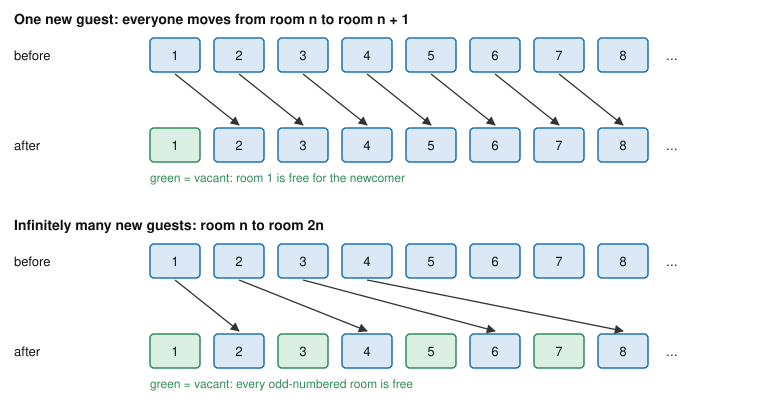

# Philosophy of Religion · Lesson 2.5: Cosmological arguments III: the kalam

> ⏱ ~15 min · Module 2: Ontological and cosmological arguments · Builds on: [2.3 The per se regress](02-03-cosmological-arguments-the-per-se-regress.md), [2.4 Sufficient reason](02-04-cosmological-arguments-sufficient-reason.md) · Unlocks: [3.1 From design to fine-tuning](03-01-from-design-to-fine-tuning.md)

## Why this matters

The per se regress (2.3) and the Leibnizian argument (2.4) both work even if the world never began. The kalam takes the opposite bet: it argues that the past is finite, and that whatever begins needs a cause. It is the most debated cosmological argument today. It is also the only one whose key premise can be checked against physics, and against the mathematics of infinity.

## The idea

The name comes from *kalām*, the tradition of Islamic dialectical theology. Its best-known medieval champion is al-Ghazali (d. 1111). In the First Discussion of *The Incoherence of the Philosophers* he denies that the philosophers had demonstrated the world's eternity; [ancient-medieval-philosophy 6.3](../../ancient-medieval-philosophy/lessons/06-03-averroes-and-maimonides.md) tells the history. One of his puzzles is still the clearest entry point. The sun's sphere turns once a year, Jupiter's once in twelve, Saturn's once in thirty. So Saturn has always completed $\tfrac{1}{30}$ as many turns as the sun: after 3,600 years, 120 against 3,600. Yet if the past were beginningless, both totals would be infinite, and in that sense equal. He also asks whether the infinite total is odd or even. Either answer seems wrong, since one more turn would flip it, and "neither" seems absurd.

William Lane Craig revived the argument in *The Kalām Cosmological Argument* (1979). His version is stated below. Its first premise is far weaker than the PSR of [2.4](02-04-cosmological-arguments-sufficient-reason.md), since it asks only that *beginnings* have causes. All the weight then falls on showing that there was a beginning.

## The argument

The [kalam cosmological argument](../reference.md#kalam-cosmological-argument):

> **P1.** Whatever begins to exist has a cause.
> **P2.** The universe began to exist.
> **∴ C1.** The universe has a cause.

P2 gets two kinds of support, one philosophical and one scientific.

**P2, philosophical (a): no actual infinite.** Craig distinguishes an [actual from a potential infinite](../reference.md#actual-and-potential-infinite). An actual infinite is a completed totality with infinitely many members. A potential infinite is a collection that can always grow but is finite at every stage. The future, on Craig's view, is only potential.

> **P2a.** An actual infinite cannot exist in reality.
> **P2b.** A beginningless series of past events would be an actual infinite.
> **∴** The series of past events had a first member.

The case for P2a is [Hilbert's Hotel](../reference.md#hilberts-hotel). Hilbert used it in a lecture in January 1924 but never published it; George Gamow made it famous in 1947 (Kragh 2014). The hotel has a room for every positive integer, and every room is full. A new guest arrives. Move each guest from room $n$ to room $n+1$, and room 1 is free. Infinitely many new guests arrive. Move each guest from room $n$ to room $2n$, and every odd-numbered room is free. Nobody has left, and the hotel takes in infinitely many more people. Set theory has no complaint here. A set is infinite exactly when it can be put in one-to-one correspondence with a proper part of itself, and $\aleph_0 + \aleph_0 = \aleph_0$ ([mathematical-logic 4.3](../../mathematical-logic/lessons/04-03-cardinals-cantors-theorem.md), [4.4](../../mathematical-logic/lessons/04-04-continuum-cardinal-arithmetic.md)). Craig accepts the mathematics. His claim is that a *real* hotel, or a real past, that behaved this way would be absurd.

**P2, philosophical (b): the [traversal argument](../reference.md#traversal-argument).** Grant that an actual infinite could exist. It still could not be *formed by successive addition*, one event after another, because adding finite steps never completes an infinity. A beginningless past would require that an infinite series had in fact been completed by now. That is like a man who finishes counting down to zero from minus infinity: why does he finish today and not yesterday, when infinitely many numbers had already been counted by any earlier day? Craig also uses Russell's Tristram Shandy (*The Principles of Mathematics*, 1903). Shandy takes a year to write up each day of his life. After 20 years he has written up 20 days and lived about 7,305, so he falls further behind every year he lives.

**P2, scientific.** Big Bang cosmology says the universe expanded from a hot, dense state about 13.8 billion years ago ([cosmology 2.1](../../cosmology/lessons/02-01-hot-big-bang-thermal-equilibrium.md), [1.5](../../cosmology/lessons/01-05-cosmic-energy-budget-lambda-cdm.md)). Run classical general relativity backward and you reach a singularity. But the run-back passes through an epoch where quantum gravity should take over and classical theory is not trusted. So "hot dense state" is established, and whether that state was an *absolute* beginning is a further question on which cosmologists disagree. Defenders cite the [Borde–Guth–Vilenkin theorem](../reference.md#borde-guth-vilenkin-theorem) (*Physical Review Letters*, 2003). It shows that any spacetime whose average expansion rate along a past-directed path is greater than zero cannot be extended indefinitely into the past along that path. The authors conclude that inflation needs some other physics to describe its past boundary. Vilenkin reads this as evidence that the universe had a beginning. Critics, among them Sean Carroll, say the theorem is classical and reaches no verdict on quantum-gravity models. They add that "the region where expansion holds has a past boundary" is not the same as "nothing existed before". Models whose past was not on average expanding, such as Ellis and Maartens's emergent universe (2004), fall outside its premises.

**P1, the [causal principle](../reference.md#causal-principle).** Craig treats P1 as a metaphysical intuition: things do not pop into being from nothing. There are three objections. (i) *Hume*: we can conceive of a beginning without a cause, since the two ideas are separable (*Treatise* 1.3.3), so P1 is not a necessary truth. (ii) *Quantum events*: vacuum fluctuations and radioactive decays seem to happen without sufficient causes. Craig replies that a quantum vacuum is a physical state with structure and energy, not nothing, so these are not beginnings from nothing. Morriston asks what makes a set of merely necessary conditions count as a cause. (iii) *Induction*: everything we know to have begun began *within* the universe, so we cannot generalize to the universe as a whole. That is the point the Hume–Edwards objection makes in [2.4](02-04-cosmological-arguments-sufficient-reason.md).

**From cause to personal cause.** C1 is not God, so the argument faces the [gap problem](../reference.md#the-gap-problem). Craig's bridge goes like this:

> **P3.** The cause of all space, time and matter is not itself in time, at least "before" creation.
> **P4.** A timeless cause whose conditions were sufficient would produce its effect timelessly, so the effect would be as old as the cause. (If it has always been below freezing, any water there has always been ice.)
> **P5.** The effect is not eternal, by P2.
> **∴ C2.** The cause is an agent that freely chose to bring about an effect with a beginning.

Morriston (*Faith and Philosophy*, 2000) replies that a timeless intention to create is just as sufficient as any timeless condition. A timeless agent cannot delay, so the personal cause does no better than the impersonal one at producing a temporal effect. Craig answers that besides intending, the agent must exercise its causal power. Morriston replies that exercising a power is an act in time.

**Which theory of time.** Craig states the argument on a tensed [A-theory](../../metaphysics/lessons/05-01-the-a-theory-and-the-b-theory.md), where becoming is real and the past has actually been run through. On a B-theory, a universe with a first moment is a four-dimensional block with an edge. Critics (Grünbaum) doubt that such a block "comes into being" in a sense that calls for a cause. Loke argues that the traversal argument works on either theory.

**Where the argument is weakest.** P2's philosophical support turns on P2a, the move from "counterintuitive" to "impossible". Oppy and Morriston say the hotel only shows that infinite collections fail the rules of thumb we learned from finite ones. They also note a symmetry: an endless future of discrete events, such as two angels taking turns praising God forever, generates the same puzzles, yet most theists think that future is possible. The defender replies that the objection assumes mathematical consistency guarantees real possibility. Being consistent in set theory, the defender says, does not show that something could exist in the concrete world, any more than the root $x = -2$ means minus two people carried the box. The A-theory is what lets Craig treat the past as actual and the future as merely potential. The scientific support turns on whether BGV's classical premises reach the quantum era.

## The picture

Nobody leaves and nobody shares a room, yet room appears. The kalam needs this to be impossible for real things, though it is consistent for sets.

## Worked examples

**Ex 1 (the checkout case, run cleanly).** The hotel is full. First the guests in odd-numbered rooms check out. Infinitely many leave, and infinitely many stay (all the even rooms). Start again, and this time the guests in rooms 4 and up check out. Infinitely many leave, and exactly 3 stay. The same number left both times, $\aleph_0$, but different numbers remain. So $\aleph_0 - \aleph_0$ has no single value. *Craig's reading:* in reality, removing identical quantities from identical quantities leaves identical quantities, so a real actual infinite would break that rule, and that is absurd. *The critic's reading:* this is why cardinal subtraction is left undefined for infinite cardinals. Nothing contradicts anything, and a concrete infinite would simply behave this way. Notice what the dispute is about: not the arithmetic, which both accept, but whether the part–whole intuitions that hold for finite collections are necessary truths about concrete ones.

**Ex 2 (where it strains: an invented quiet past).** Suppose a cosmologist proposes a universe that sat in a static, unchanging state for an infinite past and then began expanding 13.8 billion years ago. BGV does not apply, because the average expansion along a past path is zero, not positive. So the scientific support for P2 is gone, and the argument must fall back on (a) and (b). But (b) is about successive addition of *events*. If nothing changed, is there a series of events to be traversed at all? The defender presses a different point: why did a state that had been static forever start expanding when it did, and not earlier? That is a question about sufficient reason, so the kalam has to borrow some of 2.4's PSR. The critic says that borrowing gives up the kalam's selling point, its weaker first premise.

## Watch out

- **You might think the Big Bang settles P2.** It establishes expansion from a hot, dense state. Whether that state was an absolute beginning depends on physics nobody has yet: a working theory of quantum gravity, and which models survive.
- **You might think the kalam is a per se regress argument.** It is the reverse. The series of past events is per accidens, the kind [2.3](02-03-cosmological-arguments-the-per-se-regress.md) allows to be infinite. The kalam says even that series must be finite. Aquinas held that a beginning can be neither demonstrated nor refuted ([thomistic-synthesis 5.1](../../thomistic-synthesis/lessons/05-01-creation-and-conservation.md)).
- **You might think a refutation of P2a refutes P2.** It removes argument (a) only. The traversal argument and the physics are independent supports.

## One-liner

> The kalam needs only that beginnings have causes, so everything rests on whether the past had a beginning, and on whether an actual infinite is impossible or just strange.

## Problems

**P1 (🟢) *(Formal (a)–(b) · Evaluative (c))*** Hilbert's Hotel is full. Two buses arrive, A and B, each carrying infinitely many passengers numbered 1, 2, 3, …. (a) Give one rule that sends every current guest $n$, every bus-A passenger $k$ and every bus-B passenger $k$ to a room, so that no two people share a room and no room is empty. Where do guest 5, A-passenger 5 and B-passenger 5 go? Who ends up in room 101? (b) Show in one or two lines that your rule leaves no room empty and doubles up no one. (c) A kalam defender says: "The hotel was full; now it holds three times as many people, still full, and nobody left. That is a contradiction." In two sentences, say whether it is a contradiction in the strict, logical sense, and what claim the defender needs instead to keep P2a.

**P2 (🟡) *(Exegetical (a) · Evaluative (b))*** An invented debate transcript:

> **Affirmative:** "Physics has proved P2. The Borde–Guth–Vilenkin theorem shows that every expanding universe came from absolutely nothing at a first moment. That is a scientific fact."
> **Negative:** "And quantum physics has refuted P1. Particles pop into existence out of nothing, uncaused, all the time."

(a) Say exactly what each speaker claims beyond what the cited physics shows. One sentence each. (b) For each speaker, give the strongest true claim in the neighbourhood, and the premise of the kalam it bears on. 120 words or fewer for (b).

**P3 (🔴, optional) *(Evaluative.)*** Steelman and reply. (a) State Craig's argument from a timeless first cause to a *personal* cause at full strength, in numbered premises. (b) Give the strongest objection to it. (c) Give the defender's best rejoinder, in one or two sentences. Any verdict. 150 words or fewer in total.

Solutions

**P1** *(Formal (a)–(b) · Evaluative (c))*

(a) One rule: current guest $n \mapsto 3n$; A-passenger $k \mapsto 3k-2$; B-passenger $k \mapsto 3k-1$. Guest 5 goes to room 15, A-passenger 5 to room 13, B-passenger 5 to room 14. Room 101: $101 = 3 \cdot 34 - 1$, so B-passenger 34.

(b) Every positive integer $r$ has exactly one remainder when divided by 3. If $r = 3n$ it belongs to current guest $n$; if $r = 3k-2$ (remainder 1), to A-passenger $k$; if $r = 3k-1$ (remainder 2), to B-passenger $k$. Each $r$ has exactly one remainder, so each room gets exactly one person (no doubling up), and every room gets someone (none empty). In cardinal terms, $\aleph_0 + \aleph_0 + \aleph_0 = \aleph_0$.

**Accept:** any bijection from the three groups onto the positive integers, for instance by interleaving, with (b) showing it is one-to-one and onto.

**Must hit, any verdict (c):**

- It is not a logical contradiction. "Three times as many" mixes up being a proper part with having a smaller cardinality. Cardinally the hotel holds $\aleph_0$ people before and after, and nothing is both asserted and denied.
- The defender must move from logical to *metaphysical* impossibility: for concrete collections, a whole must have more members than any proper part (a principle as old as Euclid's "the whole is greater than the part"), and real collections must obey it even though sets need not. A strong answer says that this principle is exactly what the critic denies.

**Wrong turns:** answering (c) by saying the arithmetic is wrong (it is fine); or treating (c) as settled by (b), when (b) shows consistency and (c) asks about real possibility.

**Model answer (c), one of several:** Strictly, no: the hotel's cardinality is $\aleph_0$ throughout, and "three times as many" smuggles in a finite rule that a proper part is smaller. To keep P2a, the defender must claim that concrete collections, unlike sets, must obey the part–whole principle, so that what is consistent in set theory is still impossible in reality.

---

**P2** *(Exegetical (a) · Evaluative (b))*

**Must hit, strict (a):**

- *Affirmative:* BGV shows only that a spacetime whose average expansion rate along a past path is positive cannot be extended indefinitely into the past along that path. It is a classical result. It does not say "from absolutely nothing", or that the universe as a whole had a first moment, or that every expanding model is covered (models not expanding on average in the past fall outside it).
- *Negative:* quantum events arise within a quantum vacuum or field, a physical state with structure and laws, not from nothing. Whether they are uncaused or only indeterministically caused is disputed.

**Must hit, any verdict (b):**

- Affirmative's best version: inflating or on-average-expanding spacetimes need some other physics at their past boundary. This supports P2, but only probabilistically and only for models within the theorem's premises.
- Negative's best version: if indeterministic quantum events lack sufficient causes, then "whatever begins has a cause" is not obviously necessary, or needs to be weakened to "has necessary conditions". This bears on P1. A strong answer notes the defender's reply (the vacuum is not nothing) and the critic's rejoinder (what makes necessary conditions a cause?).

**Wrong turns:** treating either speaker as simply right or simply wrong; aiming the quantum point at P2.

**Model answer (b), one of several:** The affirmative can say that BGV shows an on-average-expanding spacetime has a past boundary where classical inflation stops describing it. That supports P2 to the extent that our universe's past falls under the theorem and quantum gravity does not undo it. The negative can say that quantum events seem to occur without sufficient causes, so P1 is not a self-evident necessity, unless "cause" is loosened to "necessary conditions". In that case the defender owes an account of what those conditions are for the universe as a whole.

---

**P3** *(Evaluative)*

**Must hit, any verdict:**

- (a) A skeleton with the timelessness premise, the premise that a timeless set of sufficient conditions yields an effect as old as itself, the finitude of the effect, and the conclusion that the cause is an agent who freely chooses.
- (b) Morriston's symmetry: a timeless *intention* is also a timeless sufficient condition. Either it yields an eternal effect too, or the "choice" does no work the impersonal cause could not do.
- (c) A rejoinder that names what an agent adds, such as exercising a power as distinct from merely intending, or libertarian agent causation, which does not require prior sufficient conditions. Credit also for noting the cost: exercising a power seems to be an act in time.

**Wrong turns:** stating the objection as "God doesn't exist" (it targets the step, not the conclusion); arguing for a verdict in place of steelmanning.

**Model answer, one of several:** (a) P1. The cause of space, time and matter is timeless (sans creation). P2. If its conditions were sufficient and timeless, its effect would be timeless too, as water is always ice if it has always been below freezing. P3. The universe began. ∴ The cause is an agent that freely chose a temporal effect. (b) A timeless intention to create a universe that begins is just as sufficient and just as timeless. An agent with no time cannot "wait", so personhood does not explain the beginning any better than a mechanism does. (c) Agent causation is not a matter of sufficient conditions: the agent's free exercise of power is the cause, and there are no prior conditions that "wait". The cost is explaining how that exercise can be timeless.

## Flashback

**From Lesson [2.3](02-03-cosmological-arguments-the-per-se-regress.md) (Cosmological arguments I: the per se regress):** *(Formal (a) · Exegetical (b).)* An invented vigil: a chapel keeps a flame through a six-hour night. Flame A burns during hours 1–3. At hour 3 a second candle is lit from it, and flame B burns during hours 3–5. At hour 5 a third is lit from B, and flame C burns during hours 5–6. Let $E(x,t)$ mean "flame $x$ exists at hour $t$", with $x$ ranging over A, B, C and $t$ over hours 1–6. (a) Show that this model makes $\forall x\, \exists t\; \neg E(x,t)$ true and $\exists t\, \forall x\; \neg E(x,t)$ false, and say in one sentence what that shows about the first half of the Third Way. (b) Is the series A, B, C per se or per accidens? Name the mark that decides it, and say whether Aquinas held that a series of this kind could run back without end. Two sentences.

Solution

**Worked (a):**

| Hour | 1 | 2 | 3 | 4 | 5 | 6 |
|---|---|---|---|---|---|---|
| Flames existing | A | A | A, B | B | B, C | C |

- Each flame fails to exist at some hour: A at hours 4–6, B at hours 1, 2 and 6, C at hours 1–4. So $\forall x\, \exists t\; \neg E(x,t)$ is true.
- Every hour has at least one flame, so no hour has none, and $\exists t\, \forall x\; \neg E(x,t)$ is false.
- True premise, false conclusion: the move from "each corruptible thing at some time is not" to "at some time nothing was" is invalid as logic. The first half of the Third Way needs a premise the text does not state (an infinite past, or a restricted domain). The modern Thomist argument K drops that half, so the countermodel leaves K untouched.

**Must hit, strict (b):**

- **Per accidens.** After hour 3, B keeps burning when A goes out (hour 4), so B's flame is its own, not power held only while A exercises its power. In a per se series, stopping the member above would stop everything below at once.
- Aquinas held that an infinite per accidens series is not impossible (*ST* I q.46 a.2 ad 7). Only per se series cannot go to infinity, so arguing that a series like this must have a first member is the kalam's job, not the per se regress argument's.

**Wrong turns:** in (a), building a model with an hour at which nothing exists, which makes the conclusion true and refutes nothing. In (b), calling the series per se because B was lit *from* A: having one's origin in an earlier member is the per accidens pattern (one man begetting another). The test is whether B's burning *now* depends on A's burning *now*.

## Connections

- **Backward:** [2.3](02-03-cosmological-arguments-the-per-se-regress.md) needed a series that cannot be infinite even if time is; the kalam says the temporal series itself cannot be. The A-/B-theory fork is [metaphysics 5.1](../../metaphysics/lessons/05-01-the-a-theory-and-the-b-theory.md). Al-Ghazali's dispute with Averroes is [ancient-medieval-philosophy 6.3](../../ancient-medieval-philosophy/lessons/06-03-averroes-and-maimonides.md), and Bonaventure-versus-Aquinas on traversing the past is the problem in [ancient-medieval-philosophy 7.3](../../ancient-medieval-philosophy/lessons/07-03-the-five-ways-as-text.md).
- **Forward:** [3.1](03-01-from-design-to-fine-tuning.md) and [3.2](03-02-fine-tuning-the-objections.md) use the same cosmology for a different argument, from what the universe is like rather than that it began. `apologetics-foundations` ([syllabus](../../apologetics-foundations/syllabus.md)) builds an argued case for theism partly on this skeleton.
- **Sideways:** the cardinal arithmetic is [mathematical-logic 4.4](../../mathematical-logic/lessons/04-04-continuum-cardinal-arithmetic.md). Inflation itself is [cosmology 4.2](../../cosmology/lessons/04-02-inflationary-mechanism.md). Whether singularity theorems describe a beginning of time, and what time is in quantum gravity, belong to [`philosophy-of-physics`](../../philosophy-of-physics/syllabus.md). Creation as dependence at every moment, which the kalam's first-moment framing leaves untouched, is [thomistic-synthesis 5.1](../../thomistic-synthesis/lessons/05-01-creation-and-conservation.md).
