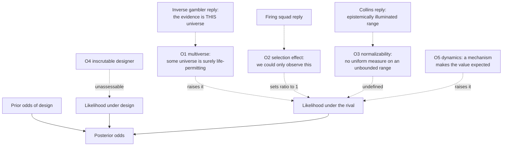

# Philosophy of Religion · Lesson 3.2: Fine-tuning: the objections

> ⏱ ~15 min · Module 3: Arguments from design, morality, experience, and miracles · Builds on: [3.1 From design to fine-tuning](03-01-from-design-to-fine-tuning.md), [`philosophical-method` 2.4](../../philosophical-method/lessons/02-04-weighing-evidence-in-odds-form.md) · Unlocks: [3.3 Moral arguments](03-03-moral-arguments.md)

## Why this matters

[3.1](03-01-from-design-to-fine-tuning.md) built the [fine-tuning argument](../reference.md#fine-tuning-argument): some constants of physics sit in narrow life-permitting windows, and that is far more expected if a designer set them than if they fell out by chance. The replies are many, and in debate they arrive as a pile: "multiverse", "of course we see a life-friendly universe", "you can't put probabilities on constants", "who knows what God would want". This lesson sorts the pile. Each objection attacks **one term** of the odds form. Once you know which term, you know what the objection must establish and what its opponent will say back.

## The idea

Reload the odds form from [`philosophical-method` 2.4](../../philosophical-method/lessons/02-04-weighing-evidence-in-odds-form.md): where you end is where you started times the strength of the evidence. A fine-tuning argument has three numbers to attack: the prior, the likelihood under design, and the likelihood under the rival. An objection that says "the evidence is not surprising after all" is attacking the rival's likelihood. One that says "we cannot tell what a designer would do" is attacking the design likelihood. One that says "design was improbable anyway" is attacking the prior, and leaves the evidence's strength untouched.

That last case is worth noticing because it is rare. Almost every objection in this literature goes after the **likelihoods**, which is where the argument claims its force.

## The argument

Write $E$ for "the constants take life-permitting values" (3.1's $E_{\mathrm{ft}}$), $D$ for design, and $C$ for a single universe whose constants are set by chance, with no designer.

$$\frac{P(D \mid E)}{P(C \mid E)} = \frac{P(D)}{P(C)} \times \frac{P(E \mid D)}{P(E \mid C)}$$

In words: the [likelihood principle](../reference.md#likelihood-principle) says $E$ favours $D$ over $C$ exactly when the ratio on the right exceeds 1. The skeleton both sides accept:

1. **P1.** $E$: the constants take life-permitting values.
2. **P2.** $P(E \mid D)$ is not very small.
3. **P3.** $P(E \mid C)$ is extremely small.
4. **P4.** So $E$ strongly favours $D$ over $C$ (likelihood principle).
5. **C.** So $E$ raises the odds of design over single-universe chance by a large factor. *In words:* not a proof; the posterior still depends on the prior.

Five objections, each at the strength its defenders give it, with its best reply.

**O1. The multiverse** (attacks the rival). Replace $C$ with $M$: very many universes with varied constants, as some inflationary and string-landscape models suggest. Then that *some* universe is life-permitting is close to certain, and only life-permitting ones contain observers. This is the [multiverse objection](../reference.md#multiverse-objection). The reply is the [inverse gambler's fallacy](../reference.md#inverse-gamblers-fallacy). Ian Hacking ("The Inverse Gambler's Fallacy", *Mind*, 1987) named the error of seeing a double six and inferring that many rolls have been made, and charged Wheeler's universes, which succeed one another in time, with it. Roger White ("Fine-Tuning and Multiple Universes", *Noûs*, 2000) extended the charge to multiverses generally. Our evidence is that **this** universe is life-permitting, and other universes do not make this one likelier to be so. The rebuttal (P. J. McGrath and John Leslie, both *Mind*, 1988; Darren Bradley, 2009) is that we are *selected*: we could only have found ourselves in a life-permitting universe, so the evidence is properly "some universe is life-permitting", and $M$ does raise its probability. The dispute is over which description of the evidence is correct.

**O2. [Observation selection effects](../reference.md#observation-selection-effect)** (attacks the rival). Elliott Sober ("The Design Argument", 2003) argues that once we include the fact that we exist to observe, $E$ was certain on *any* hypothesis: $P(E \mid C, \text{we observe}) = P(E \mid D, \text{we observe}) = 1$, so the ratio is 1. The reply is Leslie's [firing squad](../reference.md#firing-squad-case) (*Universes*, 1989). A prisoner survives an execution in which every marksman missed. "Of course I observe that they missed, or I would not be observing" is true, and it does not stop him from rationally suspecting that the misses were arranged. If the selection effect cancels the inference here, it cancels it in the prisoner's case too, and few will accept that.

**O3. The [normalizability problem](../reference.md#normalizability-problem)** (attacks the rival). Timothy McGrew, Lydia McGrew and Eric Vestrup ("Probabilities and the Fine-Tuning Argument: A Sceptical View", *Mind*, 2001). If a constant could take any value in an unbounded range, indifference recommends a uniform distribution. A window of width 1 in a range of width $W$ gets probability $1/W$, and as $W \to \infty$ this goes to 0 for **every** finite window. Worse, no uniform probability distribution over an unbounded range exists at all. So $P(E \mid C)$ is undefined rather than small, and a window of width $10^{100}$ would score exactly as well as one of width $10^{-100}$: "coarse-tuning" would be as impressive as fine-tuning. The reply (Robin Collins, in the *Blackwell Companion to Natural Theology*, 2009) restricts the range to the **epistemically illuminated range**: the values for which current physics lets us say whether life is possible. That range is finite, so the probability is defined. The cost is a probability relative to what we can calculate, and critics ask why the universe should care about that.

**O4. The [inscrutable designer](../reference.md#inscrutable-designer-objection)** (attacks the design likelihood). Sober (2003) again: we estimate what designers do from human designers. We have no comparable access to the goals of a divine designer, so $P(E \mid D)$ has no assessable value. And an omnipotent God need not have worked through finely balanced physics at all. The reply (Swinburne, *The Existence of God*, 2nd ed., 2004) argues from the concept: a perfectly good God has reason to create embodied, finite agents who can make choices that matter. A world containing such agents needs physics that permits them, so $P(E \mid D)$ is not small, even if it is not precise.

**O5. Dynamics** (attacks the rival, by redescribing the evidence). Past "coincidences" have been explained by mechanism. The flatness of the early universe once looked tuned to about sixty decimal places ([`cosmology` 4.1](../../cosmology/lessons/04-01-horizon-flatness-problems.md)), and inflation drives the universe toward flatness from a wide range of starting conditions ([`cosmology` 4.2](../../cosmology/lessons/04-02-inflationary-mechanism.md)). Where a mechanism exists, $P(E \mid \text{no design})$ is no longer small. The reply is that a mechanism may relocate the tuning instead of removing it: the inflaton's potential must itself have the right shape. Some cases also remain unexplained, such as the cosmological-constant problem, about $10^{120}$ ([`cosmology` 4.4](../../cosmology/lessons/04-04-dark-energy-cosmic-acceleration.md)). Steven Weinberg ("Anthropic Bound on the Cosmological Constant", 1987) showed how O1 and O2 enter physics itself: he bounded that constant by asking which values allow galaxies, and so observers, to form.

**Where the argument is weakest.** P3. Three of the five objections attack it, from opposite sides. O3 says the number is undefined, O1 says it was computed for the wrong hypothesis, and O5 says better physics will raise it. Each critic needs P3 to fail only once. The defender says each objection rests on something it would not accept elsewhere. O3 would also wreck physicists' ordinary judgments that an unexplained precise value is "unnatural". O2 would wreck the firing squad. And O1 needs a multiverse whose prior is itself in dispute and whose own generating mechanism may be tuned. The second weak point is P2, where O4 sits. A theist who accepts skeptical theism about evil ([4.4](04-04-skeptical-theism.md)), holding that we cannot tell what God would allow, will find that same modesty used against P2 here.

## The argument map

Solid arrows are the odds form. Dashed arrows run from an objection to the term it attacks, or from a reply to the objection it answers. Notice how many land on one node, and that none lands on the prior.

## Worked examples

**Example 1 (clean case: the multiverse in numbers).** Invented model. In each universe the constants are drawn independently, and each universe is life-permitting with probability $p = 1/10{,}000$. Compare a single universe ($C$) with $N = 50{,}000$ universes ($M$).

- Probability that **some** universe is life-permitting: under $C$ it is $10^{-4}$. Under $M$ it is $1 - (1 - 10^{-4})^{50{,}000} \approx 1 - e^{-5} \approx 0.993$. Likelihood ratio $M : C$ about $9{,}933$.
- Probability that **this** universe, picked out in advance, is life-permitting: $10^{-4}$ under both. Likelihood ratio 1.

The whole multiverse dispute is which line describes our evidence. White says the second, because "this universe" is ours however the draws went. Bradley says the first, because which universe gets to be "ours" depends on the outcome: we exist only where the draw came out life-permitting. The arithmetic is not in dispute. The description is.

**Example 2 (hard case: the firing squad).** Twelve marksmen, each of whom misses with probability $1/20$ when aiming to kill. If they aim to kill, all twelve missing has probability $(1/20)^{12} \approx 2.4 \times 10^{-16}$. If they were told to miss, say $0.9$. The likelihood ratio favouring "arranged" is about $3.7 \times 10^{15}$.

Now run O2 as Sober does. Condition on the survivor being alive to observe: on both hypotheses he observes that all missed, so the ratio is 1. Sober accepts this for the prisoner too. Without independent evidence, he says, the survivor should not suspect the misses were arranged, since that would ignore the selection effect he faces. This is where the case strains. Leslie and other critics find that verdict very implausible: an outcome with odds of about 1 in $4 \times 10^{15}$ cannot become unsurprising just because the one who sees it survived it. Sober's side can answer that the intuition borrows background knowledge the formal case leaves out, such as how executions are usually staged. Whoever is right about the prisoner is right about the universe, since the two cases have the same structure.

## Watch out

- **You might think the multiverse objection says there is no evidence of design, but** it concedes that $E$ is improbable on a single chance universe. It changes the rival hypothesis, and it must then pay for the multiverse's own prior.
- **You might think the selection effect and the inverse gambler's fallacy are the same point, but** they pull in opposite directions. The selection effect is what the multiverse *defender* uses to escape the fallacy charge, and it is what Sober uses against design.
- **You might think normalizability is a quibble about infinity, but** it is a dilemma. Either the constants get a defined probability, which needs a restricted range someone must justify, or $P(E \mid C)$ is not small: it is not a number at all.

## One-liner

> Every serious objection to fine-tuning attacks a likelihood rather than the prior, and most attack the same one: how surprising a life-permitting universe is without a designer.

## Problems

**P1 (🟢)** *(Formal (a) · Exegetical (b).)* **Formal model.** An invented lottery machine produces a jackpot on any single draw with probability $1/500$, independently. Two hypotheses about today: the machine ran **one** draw, or it ran **1,000** draws. Your prior odds (1,000 draws : one draw) are $1:9$.

- **Case A.** Tomás walks into the hall at a time he chose in advance and watches the next draw. It is a jackpot.
- **Case B.** Ilse is a contestant who is paged to the hall if and only if some draw today produces a jackpot. She is paged.

(a) For each case, compute the likelihood ratio (1,000 draws : one draw) and the posterior odds. (b) In two sentences: which case matches the evidence as White describes our evidence about our universe, and which as Bradley describes it?

**P2 (🟡)** *(Exegetical (a) · Evaluative (b).)* **Diagnose.** An invented podcast transcript, a guest replying to the fine-tuning argument:

> "(i) Of course we find ourselves in a life-friendly universe; if it weren't, nobody would be here to notice. (ii) And there's no fact about how probable a constant is when it could have been any real number at all. (iii) Even if there were, who knows whether a God would want carbon chemistry rather than spirits with no bodies? (iv) Every 'coincidence' in the history of physics eventually got a mechanism; give it time. (v) Besides, a being like God was wildly improbable to begin with."

(a) For each of (i)–(v), name the objection from this lesson and the term of the odds form it attacks. (b) Pick the one you think strongest and give the best reply on the defender's behalf in 80 words or fewer. Any choice passes.

**P3 (🔴, optional)** *(Evaluative.)* **Steelman and reply.** (a) State the normalizability objection at the strength its defenders would recognize, including the coarse-tuning point. (b) Give the best reply on the fine-tuning defender's behalf, and say what that reply has to assume. **150 words or fewer in total.**

Solutions

**P1** *(Formal (a) · Exegetical (b))*

(a) **Case A.** Tomás's draw was fixed in advance, and it is a jackpot with probability $1/500$ on either hypothesis. Likelihood ratio:

$$L_A = \frac{1/500}{1/500} = 1$$

Posterior odds stay at $1:9$.

**Case B.** Ilse is paged if at least one draw is a jackpot.

$$P(\text{paged} \mid \text{one}) = \frac{1}{500} = 0.002$$

$$P(\text{paged} \mid 1{,}000) = 1 - \left(\tfrac{499}{500}\right)^{1000} \approx 0.865$$

(Check: $1 - e^{-2} \approx 0.865$.) So $L_B \approx 0.865 / 0.002 \approx 432$, and the posterior odds are $\tfrac{1}{9} \times 432 \approx 48 : 1$ in favour of 1,000 draws.

(b) **Must hit, strict:**

- White's description matches **Case A**: the evidence concerns an item, "this universe", fixed independently of how the draws came out, so many draws do not raise its probability.
- Bradley's matches **Case B**: the observer's presence is selected by the outcome, so many draws raise the probability of the evidence.

**Wrong turns:** treating Case A's jackpot as evidence for many draws, which is exactly the inverse gambler's fallacy; computing $1/500$ for Case B, which ignores that Ilse is paged by *any* jackpot.

---

**P2** *(Exegetical (a) · Evaluative (b))*

**Must hit, strict (a):**

- (i) Observation selection effect (O2). Attacks the likelihood under the rival, claiming that given observers it is 1, so the ratio is 1.
- (ii) Normalizability (O3). Attacks the likelihood under the rival, claiming it is undefined.
- (iii) Inscrutable designer (O4). Attacks the likelihood under design, claiming it cannot be assessed.
- (iv) Dynamics (O5). Attacks the likelihood under the rival, predicting that a mechanism will make the value expected.
- (v) Attacks the **prior**, the only one of the five that does. It leaves the strength of the evidence untouched.

**Must hit, any verdict (b):** name the claim; give the reply this lesson attributes to the defender (firing squad; epistemically illuminated range; a good God's reason to create embodied agents; relocated tuning and unexplained cases such as the cosmological constant; or, for (v), that a low prior does not lower the likelihood ratio); say what the reply needs in order to work.

**Wrong turns:** filing (i) as the multiverse objection, which the guest never posits; filing (v) as an objection to the evidence.

**Model answer (b), one of several:** (i) is strongest. Reply: the firing squad. A prisoner who survives twelve marksmen can say "I'd only observe this if they missed", and it still seems rational for him to suspect the misses were arranged. Conditioning on one's own survival cannot make an astonishing outcome unsurprising. The reply needs the cases to be parallel. Sober accepts the parallel and bites the bullet for the prisoner too, so the reply works only if that bullet is unacceptable.

---

**P3** *(Evaluative)*

**Must hit, any verdict:**

- (a) The range of possible values is unbounded; indifference recommends a uniform measure; no uniform probability measure exists on an unbounded range, and any finite window gets probability 0. So $P(E \mid C)$ is undefined, not small. Coarse-tuning: a window of any finite width would "count" exactly as much, which shows the arithmetic is not tracking narrowness.
- (b) A reply with its assumption named: for example, Collins's epistemically illuminated range, which assumes the restricted range is the right reference class. Or a non-uniform prior, which needs a justification against the charge of arbitrariness (the reparametrization trouble of [`epistemology` 5.4](../../epistemology/lessons/05-04-the-problem-of-priors.md)).

**Wrong turns:** stating the objection as "the range is very large, so the probability is very small", which is the argument's own premise; answering with "physicists use such probabilities all the time" without saying what licenses them.

**Model answer, one of several:** (a) A constant's possible values have no upper bound. With no reason to favour any value, we should spread probability evenly. But an even spread over an unbounded range is not a probability distribution: every finite window gets zero. Then a life-permitting window a googol wide would be exactly as improbable as one a googolth wide, so the argument's probabilities cannot be measuring fine-tuning. (b) Collins restricts the range to the values current physics lets us evaluate, the epistemically illuminated range, which is finite, and calls the window narrow relative to it. This assumes that probabilities relative to our epistemic range are the ones the likelihood principle needs. It is a defensible assumption, but it is a substantive one.

## Flashback

**From Lesson [2.5](02-05-cosmological-arguments-the-kalam.md) (Cosmological arguments III: the kalam):** *(Exegetical (a) · Evaluative (b)–(c).)* An invented exchange about a lighthouse that has flashed once every night, with no first night:

> **Defender:** "Tonight's flash completes a series of past flashes. If that series had no first member, an actual infinity of flashes would have been completed one at a time, and that can't be done. So the flashing had a beginning, and so did the past."
> **Critic:** "Pick any past flash you like. It happened finitely many nights ago, so only finitely many flashes lie between it and tonight. Nobody ever had to cross an infinite stretch."

(a) Reconstruct the defender's argument in two premises and a conclusion, and name it. (b) Which premise does the critic attack, and on what ground? One sentence. (c) Give the defender's best rejoinder in one sentence, and say whether refuting the Hilbert's Hotel argument would touch this argument at all. Any verdict.

Solution

**Must hit, strict (a):**

- **P1.** A collection formed by successive addition, one member after another, cannot be an actual infinite. **P2.** The series of past events (here, past flashes) was formed by successive addition. **C.** So the series of past events is finite: it had a first member.
- It is the **traversal argument**, the second philosophical support for the kalam's P2.

**Must hit, any verdict (b)–(c):**

- (b) The critic attacks **P1**, or rather the reason offered for it. "Completing an infinity" would be impossible only if there were an infinitely distant starting point to traverse *from*. On a beginningless past there is none: every past event is finitely far from now (the standard reply, pressed by Mackie among others).
- (c) A rejoinder that keeps the target on the whole series rather than any single interval. The defender says the trouble was never one infinite distance. It is that the totality of past events is infinite and was nonetheless built up one at a time, and the countdown question (why finish tonight, when infinitely many flashes already lay behind every earlier night?) still lacks an answer. A strong answer notes that this treats the past as having really been run through, which is the A-theory the kalam assumes.
- Hilbert's Hotel supports the *other* argument, against any actual infinite (P2a). The traversal argument grants that an actual infinite might exist and denies only that one can be formed by successive addition. Refuting the Hotel argument leaves it standing.

**Wrong turns:** reconstructing the Hotel argument ("an actual infinite cannot exist") in (a); calling the series per se because each flash follows the last (it is per accidens, the kind [2.3](02-03-cosmological-arguments-the-per-se-regress.md) allows to be infinite); arguing for a verdict on whether the past began in place of locating the dispute.

**Model answer:** (a) P1. Nothing formed by adding one member after another can be actually infinite. P2. The past flashes were formed that way. C. So there was a first flash. This is the traversal argument. (b) The critic attacks P1's rationale: an infinity would have to be "crossed" only from an infinitely distant start, and in a beginningless series every flash is a finite distance from tonight. (c) The defender replies that the series as a whole is still an infinite totality assembled one step at a time, so the question why it reached tonight and not earlier stands. The Hotel argument is independent: refuting it leaves this one untouched.

## Connections

- **Backward:** the skeleton and the likelihood principle are [3.1](03-01-from-design-to-fine-tuning.md)'s; the odds form is [`philosophical-method` 2.4](../../philosophical-method/lessons/02-04-weighing-evidence-in-odds-form.md)'s. The selection effect is the "deflationary rival" of [`philosophical-method` 2.1](../../philosophical-method/lessons/02-01-inference-to-the-best-explanation.md). Normalizability is the principle of indifference meeting an unbounded range, the trouble of [`epistemology` 5.4](../../epistemology/lessons/05-04-the-problem-of-priors.md).
- **Forward:** [3.3](03-03-moral-arguments.md) and [3.5](03-05-miracles.md) share this skeleton, and the same question returns: which likelihood is most disputed? The inscrutable-designer objection comes back with the sides reversed in [4.4](04-04-skeptical-theism.md), where the theist calls the likelihood of evil under theism inscrutable.
- **Sideways:** the physics is `cosmology` [4.1](../../cosmology/lessons/04-01-horizon-flatness-problems.md), [4.2](../../cosmology/lessons/04-02-inflationary-mechanism.md) and [4.4](../../cosmology/lessons/04-04-dark-energy-cosmic-acceleration.md). Selection effects are ordinary scientific method in [`planetary-science` 6.2](../../planetary-science/lessons/06-02-demographics-selection-effects.md), where transit surveys see only planets aligned to transit. [`philosophy-of-science`](../../philosophy-of-science/syllabus.md) takes observation selection effects as general confirmation theory, and [`apologetics-foundations`](../../apologetics-foundations/syllabus.md) argues one side of this debate.
