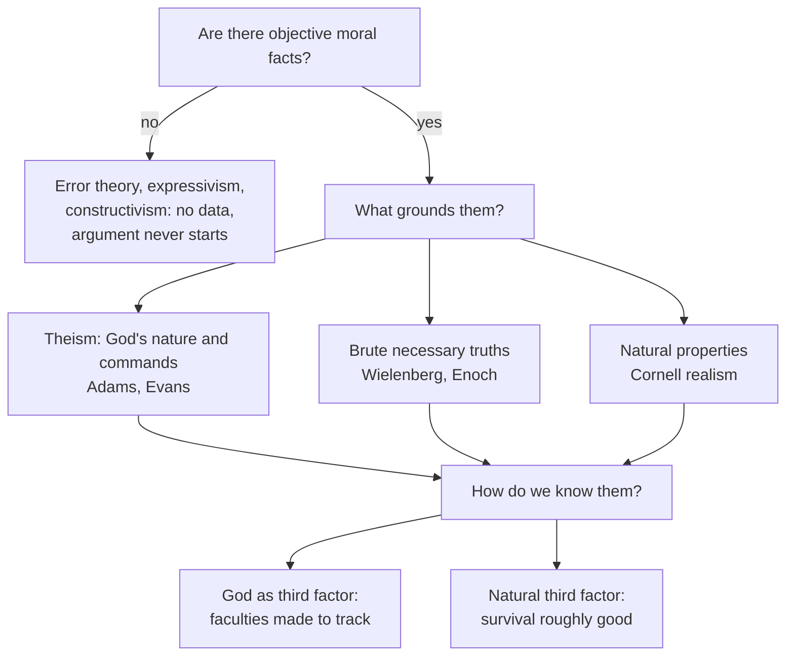

# Philosophy of Religion · Lesson 3.3: Moral arguments

> ⏱ ~15 min · Module 3: Arguments from design, morality, experience, and miracles · Builds on: [3.1 From design to fine-tuning](03-01-from-design-to-fine-tuning.md), [ethics 6.4](../../ethics/lessons/06-04-constructivism-and-debunking.md), [ethics 6.5](../../ethics/lessons/06-05-god-and-morality-the-euthyphro-dilemma.md) · Unlocks: [3.4 The argument from religious experience](03-04-the-argument-from-religious-experience.md)

## Why this matters

Fine-tuning ([3.1](03-01-from-design-to-fine-tuning.md)) starts from physics. The moral argument starts from something nearly everyone already believes: that torturing a child for fun is wrong, and wrong whatever anyone thinks. In the nineteenth and early twentieth centuries this was the theistic argument most philosophers took seriously (Newman, Sidgwick's worry, Rashdall, Sorley). It has come back since Robert Adams's "Moral Arguments for Theistic Belief" (1979). It has an unusual dialectical shape. Its best-known atheist critic, J. L. Mackie, accepted its central conditional and denied its data.

## The idea

Suppose you find, in an empty house, a list of house rules that are binding: break them and you have really done wrong, not merely broken a convention. A natural question is *who made the rules*. Rules seem to need a rule-giver, and binding demands seem to need someone with standing to make them.

That is the [moral argument](../reference.md#moral-argument)'s intuition, in two forms.

- **Kant's practical form:** morality commands us to pursue a goal that only God could make achievable, so a rational moral agent must *postulate* God.
- **The abductive form:** objective moral facts, especially obligations, and our knowledge of them are better explained if God exists than if naturalism is true. This is an inference to the best explanation ([philosophical-method 2.1](../../philosophical-method/lessons/02-01-inference-to-the-best-explanation.md)), so it goes into odds form.

One distinction governs the whole debate: **[grounding and knowing](../reference.md#grounding-and-knowing)**. The argument claims God is needed for what *makes* moral facts obtain. It does not claim atheists cannot *know* them or be good. Replying "I'm moral without believing in God" answers a claim no serious defender makes.

## The argument

**A. Kant's moral argument** (*Critique of Practical Reason*, 1788, paraphrased).

1. **We are rationally required to promote the highest good**: a world where happiness is proportioned to virtue. *In words:* morality aims at a world where the good are not ultimately losers.
2. **Ought implies can.** We cannot be required to promote what is impossible.
3. **Nature on its own shows no tie between virtue and happiness**, and finite agents cannot forge one.
4. **The highest good is possible only if nature is governed by a cause with moral intention and the power to proportion happiness to virtue.** *In words:* only a holy, omnipotent, omniscient author of nature could guarantee the match.
5. ∴ **A rational moral agent must postulate that God exists.**

Kant is explicit that this is a *[postulate of practical reason](../reference.md#postulate-of-practical-reason)*, not a theoretical proof: it shows what a moral agent must commit to, not that God exists ([proof and probability](../reference.md#proof-and-probability)). Sidgwick saw the same gap between duty and happiness (his "dualism of practical reason", *The Methods of Ethics*) and noted that theism would close it, without endorsing the argument.

**B. The abductive moral argument** (Adams 1979; C. Stephen Evans, *God and Moral Obligation*, 2013; Mark Linville in *The Blackwell Companion to Natural Theology*, 2009). Write $G$ for theism, $N$ for naturalism, $E$ for the moral evidence.

1. **There are objective moral facts, including obligations that bind regardless of desire or convention.** (The data.)
2. **$\Pr(E \mid G)$ is high**: a perfectly good God would create persons and stand to them in relations that ground obligations (for Adams, obligation is constituted by a good God's commands; [ethics 6.5](../../ethics/lessons/06-05-god-and-morality-the-euthyphro-dilemma.md)).
3. **$\Pr(E \mid N)$ is low**: in a world of particles and fields, objective, action-guiding demands are, in Mackie's word, "queer".
4. ∴ $E$ confirms $G$ over $N$.

In odds form ([philosophical-method 2.4](../../philosophical-method/lessons/02-04-weighing-evidence-in-odds-form.md)):

$$\frac{\Pr(G \mid E)}{\Pr(N \mid E)} = \frac{\Pr(G)}{\Pr(N)} \times \frac{\Pr(E \mid G)}{\Pr(E \mid N)}$$

In words: like fine-tuning, the moral argument at most multiplies the odds; it is a C-inductive argument in Swinburne's sense ([1.1](01-01-which-god-and-what-an-argument-must-do.md)). The **most disputed term is $\Pr(E \mid N)$**, and premise 1 is disputed by anti-realists.

**Mackie's concession.** Mackie, an error theorist ([ethics 6.3](../../ethics/lessons/06-03-error-theory.md)), granted premises 2–3 in substance: in *The Miracle of Theism* (1982) he said that objective values, if they existed, would make a god's existence more probable. He kept his atheism by denying premise 1. So the argument divides atheists: error theorists and constructivists deny the data, and robust realists deny premise 3.

**The non-theist realist's rival: [brute ethical facts](../reference.md#brute-ethical-facts).** Erik Wielenberg (*Robust Ethics*, 2014) and David Enoch (*Taking Morality Seriously*, 2011) hold that basic ethical truths are **brute and necessary**: that gratuitous cruelty is wrong is true in every possible world, needs no ground, and so needs no God. If so, $E$ is no more surprising on $N$ than a theorem of arithmetic is.

**Where the argument is weakest.** Premise 3. The non-naturalist realist denies that $\Pr(E \mid N)$ is low. If basic moral truths are necessary, they hold on any hypothesis, $\Pr(E \mid G) = \Pr(E \mid N) = 1$, and the likelihood ratio is 1. The defender replies that this proves too much: the probabilities here are *epistemic* credences of agents who do not know which necessities hold, as with an unproved conjecture, so a necessary truth can still be evidence. And the defender says the objection itself rests on a contestable premise: that a brute necessity is an acceptable stopping point for explanation, which a theist who extends a demand for explanation even to some necessary truths, as in debates over the [principle of sufficient reason](../reference.md#principle-of-sufficient-reason) ([2.4](02-04-cosmological-arguments-sufficient-reason.md)), denies. For Kant's version, the weak premise is 1: critics say morality requires us to *strive* for the good, not to believe it will be achieved.

**Could God be necessarily good?** The theist ground needs it. If God's goodness were contingent, moral facts would be contingent on God's character too, and the argument's opponent wins on necessity. But a necessarily good God raises two worries. One is praise: Nelson Pike argued that a being who *cannot* do wrong is not praiseworthy for refraining ([1.2](01-02-omnipotence-and-its-paradoxes.md), [impeccability](../reference.md#impeccability)). The other is parity: a necessarily good God whose goodness has no further explanation is itself a brute necessity, so the theist and Wielenberg both stop at an unexplained necessary fact. The theist answers that one necessary *person* explains goodness, obligation (a demand needs a demander) and the existence of moral agents together, while the realist's many brute truths explain only themselves. The atheist answers that God's nature is good *because* it is loving and just, and those features then do the grounding: the Euthyphro dilemma one level up ([ethics 6.5](../../ethics/lessons/06-05-god-and-morality-the-euthyphro-dilemma.md)).

## Map of positions

The argument is live only on the "yes" branch. On it, each grounding view owes an account of moral knowledge, which is where debunking enters.

## Worked examples

**Example 1 (clean case: the binding obligation).** A hiker sees a stranger fall into a gorge, has a phone with signal, and is tempted to walk on because calling would make her late. Nearly everyone judges she is *obligated* to call. Run the argument on that datum, with invented numbers.

- Prior odds $G : N = 1 : 3$.
- Theist's likelihoods: $\Pr(E \mid G) = 0.8$, $\Pr(E \mid N) = 0.2$, so $L = 4$.
- Posterior odds $\frac{1}{3} \times 4 = 4 : 3$, so $\Pr(G \mid E) = \frac{4}{7} \approx 0.57$.

Now the Wielenberg reading: the obligation is a necessary truth, both likelihoods are 1, $L = 1$, and the odds stay $1 : 3$ ($\Pr(G) = 0.25$). Same datum, opposite verdicts, and the whole difference is the value of one term. That is what "find the premise the argument turns on" means here.

**Example 2 (hard case: debunking cuts both ways).** Shift the evidence from moral *facts* to moral *knowledge*. Street's Darwinian dilemma ([ethics 6.4](../../ethics/lessons/06-04-constructivism-and-debunking.md)) says that if moral truths are independent of us, selection had no reason to make our moral judgments track them. Enoch answers with a third factor: survival is roughly good, so selection correlates with value. Ethics 6.4 left open the theist's version: God as the third factor, a creator who ensured that evolved judgments fit moral truth. Linville turns this into an argument: $\Pr(\text{reliable moral faculties} \mid G)$ is high, and on $N$ it is low.

Take a test conviction selection plausibly did not favour: that we must not bury waste that will poison people living five hundred years from now.

- *The theist's case:* Enoch's survival-based factor covers judgments that pay off for survival and is weak on this one; a God who intends us to know the good covers it without strain.
- *The naturalist's reply:* Wielenberg's own third factor is the cognitive capacities that both ground moral rights and produce our beliefs about them, and those capacities are not limited to what paid off for survival. And the theist's factor has its own unknown term: $\Pr(\text{God makes our faculties track} \mid G)$ depends on God's purposes, as inscrutable as $\Pr(\text{life} \mid G)$ was in fine-tuning ([3.2](03-02-fine-tuning-the-objections.md)). A skeptical theist ([4.4](04-04-skeptical-theism.md)) who says we cannot judge God's reasons has trouble saying this one is high.
- *Where it strains for both:* the theist must also say how we know which commands are God's, and the realist that the survival factor is not circular.

Neither side escapes debunking for free; each pays in a different term.

## Watch out

- **You might think the moral argument says atheists cannot be moral, but** it concerns grounding, not knowledge or behaviour. An argument that atheists cannot know right from wrong would be a different, much weaker argument.
- **You might think the argument presupposes divine command theory, but** it needs only that theism explains $E$ better than naturalism. Adams's DCT is one way to fill in $\Pr(E \mid G)$; a natural law theist fills it in through God's reason ([ethics 6.5](../../ethics/lessons/06-05-god-and-morality-the-euthyphro-dilemma.md)).
- **You might think Kant's argument is a weaker proof, but** it is not a theoretical argument at all. It concludes what a moral agent must postulate. A critic who shows God's existence is not *known* this way has agreed with Kant.

One sentence on a cousin: the **argument from desire** (Augustine's "restless heart", [patristics 4.3](../../patristics/lessons/04-03-augustine-confessions.md); C. S. Lewis) argues from human longing, not from moral facts, and is not treated here.

## One-liner

> The moral argument says objective obligations are likelier with God than without; atheist error theorists accept the conditional and deny the obligations, and atheist realists accept the obligations and say a necessary truth needs no God.

## Problems

**P1 (🟢) *(Exegetical.)*** From an invented debate transcript:

> **Theist:** Without God there is no foundation for morality. **Atheist:** Nonsense. I've never believed in God, and I know perfectly well that cruelty is wrong. I give to charity more than most churchgoers. **Theist:** Then you're borrowing from my worldview.

(a) Name the distinction the atheist's reply misses and say, in one sentence, why the reply leaves the theist's claim untouched. (b) Name the premise of the abductive argument that a *stronger* atheist reply would deny, and name a philosopher who denies it. 100 words or fewer in total.

**P2 (🟡) *(Formal (a) · Evaluative (b).)*** A theist sets prior odds $G : N = 1 : 4$. Evidence $E_1$: there are objective obligations, with $\Pr(E_1 \mid G) = 0.9$, $\Pr(E_1 \mid N) = 0.3$. Evidence $E_2$: our moral faculties are reliable, with $\Pr(E_2 \mid G, E_1) = 0.8$ and $\Pr(E_2 \mid N, E_1) = 0.2$.
(a) Compute the posterior odds and $\Pr(G)$. Then a critic says $E_1$ is necessary, so its ratio is 1, and a natural third factor raises $\Pr(E_2 \mid N, E_1)$ to $0.4$. Recompute.
(b) Steelman the theist: give the best reply to the critic's claim that a necessary $E_1$ cannot be evidence, in 80 words or fewer.

**P3 (🔴, optional) *(Evaluative.)*** Steelman and reply, atheist side. A theist says: "Wielenberg's brute ethical facts are just unexplained; theism explains them." (a) Give the strongest non-theist realist reply. (b) Give the best theist counter-reply, naming the premise it targets. (c) State in one sentence the crux the two disagree about. 150 words or fewer in total.

Solutions

**P1** *(Exegetical.)*

**Must hit, strict (a):**

- The distinction is **grounding vs knowing** (also behaviour): the theist's claim is about what makes moral facts obtain, and the atheist's reply is about knowing them and acting on them.
- One can know a fact, and act on it, without knowing what grounds it, so the reply leaves the grounding claim untouched.

**Must hit, strict (b):**

- Premise 3, that $\Pr(E \mid N)$ is low, or equivalently that objective obligations need a ground beyond themselves.
- Denied by Wielenberg or Enoch (basic ethical truths are brute and necessary). Also accept premise 1 denied by Mackie, the error theorist, if the answer names it as the anti-realist route.

**Wrong turns:** calling the atheist's charity irrelevant because it is "bragging" (true but not the point); saying the atheist should deny God's existence, which begs the question against the argument rather than answering it.

**Model answer:** (a) Grounding vs knowing: the theist claims God is what makes moral facts obtain; the atheist shows only that she knows them and acts on them, which the theist's argument grants. (b) Premise 3, that objective obligations are improbable on naturalism. Wielenberg denies it: basic moral truths are necessary and need no ground.

---

**P2** *(Formal (a) · Evaluative (b).)*

**(a) Worked arithmetic.**

- $L_1 = \frac{0.9}{0.3} = 3$, $L_2 = \frac{0.8}{0.2} = 4$ (computed given $E_1$, so they multiply).
- Posterior odds $= \frac{1}{4} \times 3 \times 4 = 3 : 1$, so $\Pr(G \mid E_1, E_2) = \frac{3}{4} = 0.75$.
- Critic: $L_1 = 1$, $L_2 = \frac{0.8}{0.4} = 2$. Posterior odds $= \frac{1}{4} \times 1 \times 2 = 1 : 2$, so $\Pr(G) = \frac{1}{3} \approx 0.33$.
- The case moves from P-inductive (above one half) to merely C-inductive (raised from 0.2 to 0.33).

**Must hit, any verdict (b):**

- State the critic's point accurately: a necessary truth has probability 1 on every hypothesis, so its likelihood ratio is 1.
- Give the reply: the relevant probabilities are epistemic, the credences of agents not logically or morally omniscient, so learning a necessary truth can still shift credence (as a proof of a conjecture can). Or: the evidence is not the bare moral truth but that there are *agents bound* by it, which is contingent.

**Wrong turns:** denying that basic moral truths are necessary (a theist who holds God necessarily good usually accepts it); multiplying $L_2$ as if computed unconditionally.

**Model answer (b), one of several:** The ratio is 1 only for a logically omniscient agent. Our credences are epistemic: before reflection we do not know which necessities hold, just as a mathematician's credence in an unproved conjecture is below 1. And part of the evidence is contingent: that there exist persons who are bound and who know it. On $N$ that conjunction remains surprising even if the moral truths are necessary.

---

**P3** *(Evaluative.)*

**Must hit, any verdict:**

- (a) A real realist reply, such as parity (God's necessary goodness is equally brute, so theism stops at an unexplained necessity too), or that necessary truths do not need explanation (as with logic), or the Euthyphro one level up.
- (b) A theist counter-reply that names its target: unification (one necessary person explains goodness, obligation and moral agents together), or that obligation is a demand and needs a person.
- (c) A crux both sides could accept as the point of disagreement: whether a single necessary personal being is a better stopping point for explanation than many brute moral necessities, or whether obligation needs a demander.

**Wrong turns:** answering (a) with "God doesn't exist", which is not a reply to an explanatory claim; giving a crux that is a verdict ("theism explains better").

**Model answer, one of several:** (a) Parity: the theist's God is good necessarily and for no further reason, so theism also ends in a brute necessity. Nothing is gained by placing the necessity in a person. (b) The theist targets parity: one necessary being explains why there is goodness, why it binds as a demand, and why there are agents to be bound; brute facts explain only themselves, so the stopping points differ in explanatory power. (c) Crux: whether a necessary truth gets an explanation of a better kind from being grounded in a necessary person, or whether all necessities are equally fit stopping points.

## Flashback

**From Lesson [3.1](03-01-from-design-to-fine-tuning.md) (From design to fine-tuning):** *(Exegetical.)* An invented office puzzle. For twelve months running, the shared coffee fund has closed the month on an exact multiple of 10 dollars. Maya proposes $D$: someone is secretly topping the fund up to round numbers. The rival is $C$: ordinary contributions and purchases, no one intervening. Three colleagues object:

- **Ravi:** "Nobody in this office would bother doing that in secret."
- **Lena:** "Every transaction is a 10-dollar note in or a 10-dollar bulk coffee order out, so the balance can't be anything but a multiple of 10."
- **Tom:** "We have no idea what a secret topper-upper would want. Why round numbers rather than any other target?"

(a) For each objection, name the term of posterior odds $= \frac{\Pr(D)}{\Pr(C)} \times \frac{\Pr(E \mid D)}{\Pr(E \mid C)}$ it attacks, and say which one is the lesson's Darwin move. (b) One objection concedes something the other two do not. Which, and what does it concede? Two sentences for (b).

Solution

**Must hit, strict (a):**

- **Ravi** attacks the prior odds $\Pr(D)/\Pr(C)$.
- **Lena** attacks $\Pr(E \mid C)$: on her facts it is 1, so the ratio is at most 1. This is the Darwin move: replace the rival with one that predicts the evidence, leaving the prior and $\Pr(E \mid D)$ untouched.
- **Tom** attacks $\Pr(E \mid D)$: the designer's aims are unknown, so the numerator is unassessable. This is Hume's objection as Sober recasts it.

**Must hit, strict (b):**

- Ravi's. It leaves the likelihood ratio alone, so it concedes that the evidence *favours* $D$ over $C$ and disputes only whether that is enough to believe $D$: the likelihood principle says which hypothesis evidence favours, not which to believe.

**Wrong turns:** filing Lena under the prior because she makes $D$ "unnecessary"; she changes no one's starting credence, she makes the evidence expected without $D$. Treating Tom as a prior objection ("a topper-upper is unlikely"), when his point is that nothing fixes what such a person would do.

**Model answer:** (a) Ravi: prior odds. Lena: $\Pr(E \mid C)$, raised to 1, which is the Darwin move. Tom: $\Pr(E \mid D)$, the inscrutable-aims objection. (b) Ravi's objection is the only one that grants the likelihood ratio, so he concedes that the twelve round balances favour a secret topper-upper over chance. He denies only that the favouring overcomes his low prior, which is the gap between favouring a hypothesis and believing it.

## Connections

- **Backward:** the odds form is [philosophical-method 2.4](../../philosophical-method/lessons/02-04-weighing-evidence-in-odds-form.md)'s, and the abductive form is [philosophical-method 2.1](../../philosophical-method/lessons/02-01-inference-to-the-best-explanation.md)'s. Realism, error theory and the Darwinian dilemma come from [ethics 6.1](../../ethics/lessons/06-01-moral-realism.md), [6.3](../../ethics/lessons/06-03-error-theory.md) and [6.4](../../ethics/lessons/06-04-constructivism-and-debunking.md); the Euthyphro dilemma from [ethics 6.5](../../ethics/lessons/06-05-god-and-morality-the-euthyphro-dilemma.md). Brute necessary facts were stated in [metaphysics 3.3](../../metaphysics/lessons/03-03-brute-facts-and-necessary-existence.md).
- **Forward:** [3.4](03-04-the-argument-from-religious-experience.md) runs the same contest between theism and a naturalist debunking rival, with experience as the evidence. The inscrutable likelihood returns as skeptical theism in [4.4](04-04-skeptical-theism.md). Boss 3(d) asks for this argument's most disputed term.
- **Sideways:** a necessary truth with likelihood ratio 1 is a cousin of the problem of old evidence and of logical learning, which [`philosophy-of-science`](../../philosophy-of-science/syllabus.md) 1.5 takes up; the credences themselves are [epistemology 5.1](../../epistemology/lessons/05-01-credences-and-probabilism.md)'s. The argued case for theism that uses this skeleton is in [`apologetics-foundations`](../../apologetics-foundations/syllabus.md).
