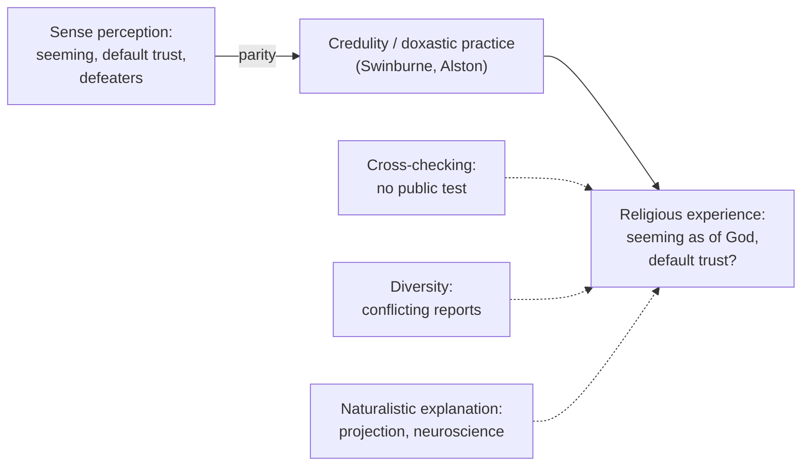

# Philosophy of Religion · Lesson 3.4: The argument from religious experience

> ⏱ ~15 min · Module 3: Arguments from design, morality, experience, and miracles · Builds on: [3.3 Moral arguments](03-03-moral-arguments.md), [epistemology 4.4](../../epistemology/lessons/04-04-testimony.md), [epistemology 2.2](../../epistemology/lessons/02-02-foundationalism.md) · Unlocks: [3.5 Miracles](03-05-miracles.md), [5.2 Reformed epistemology](05-02-reformed-epistemology.md), [5.5 Religious diversity](05-05-religious-diversity.md)

## Why this matters

Most religious believers do not believe because of the kalam or the fine-tuning constants. Many say they believe because they have, at some point, been aware of God: a presence in prayer, a conviction that came unbidden, a moment that felt like being seen. The question for this lesson is whether such an experience can justify belief in the way that seeing a tree justifies believing there is a tree. If it can, the experience is evidence for its subject and possibly, through testimony, for everyone else. If it cannot, we need to say what is different about it without also condemning ordinary perception.

## The idea

You trust your eyes without first proving that your eyes are reliable. You could not prove it anyway without using your eyes. So the default is: what seems to be there probably is, unless something specific gives you reason to doubt (you are drunk, the light is bad, you know the room has mirrors). Call that default the epistemology of perception. The argument from religious experience asks for *parity*: if someone has an experience as of God, apply the same default.

The opponent has two routes. One says religious experience is not relevantly like perception. It can't be checked, it comes to few people, and its reports conflict across traditions. The other grants the default and says a defeater is present: we can explain the experiences without God, so they are no more evidence for God than a mirage is evidence for water.

William James framed the field in *The Varieties of Religious Experience* (Gifford Lectures, 1901–1902; published 1902). The modern argument has two main forms: Richard Swinburne's *principle of credulity* and William Alston's *doxastic practices*.

## Source

James, *Varieties*, Lectures XVI–XVII, sets out the [marks of mystical experience](../reference.md#marks-of-mystical-experience): **ineffability**, **noetic quality**, **transiency**, **passivity**. On the second:

> "Although so similar to states of feeling, mystical states seem to those who experience them to be also states of knowledge. They are states of insight into depths of truth unplumbed by the discursive intellect. They are illuminations, revelations, full of significance and importance, all inarticulate though they remain; and as a rule they carry with them a curious sense of authority for after-time. These two characters will entitle any state to be called mystical, in the sense in which I use the word."

"These two" are ineffability and the noetic quality: James makes them sufficient for a state to count as mystical, while transiency and passivity are usually present but less sharply marked. The noetic mark is what gives the philosophical problem its force. The experience *presents itself* as knowledge, which is what makes the comparison with perception possible. Ineffability creates the difficulty: if the content cannot be put into words, it is hard to say what proposition the experience supports.

James's own verdict (end of the same lectures, paraphrased) has three parts. Such states are rightly authoritative for the people who have them. They create no duty for outsiders to accept them uncritically. And they show that sense-based consciousness is not the only kind there is. The gap between the first two parts is the subject of this lesson.

## The argument

**Swinburne's version** (*The Existence of God*, 1979; 2nd ed. 2004, ch. 13, paraphrased). The [principle of credulity](../reference.md#principle-of-credulity): in the absence of special considerations, if it seems to a subject that $x$ is present, then probably $x$ is present. The **special considerations** are four:

- (i) the subject or conditions are unreliable (drugs, exhaustion, a known history of hallucination);
- (ii) similar perceptual claims in similar circumstances have proved false;
- (iii) background evidence makes it very probable that $x$ was absent;
- (iv) whether or not $x$ was there, the experience was probably caused by something else.

A companion [principle of testimony](../reference.md#principle-of-testimony) says that, absent special considerations, other people's experiences are probably as they report them. That is the step that lets the argument reach James's outsiders, and it is the religious-experience counterpart of Reid's anti-reductionist default in [epistemology 4.4](../../epistemology/lessons/04-04-testimony.md). (Reid's own "principle of credulity" was about testimony. Swinburne's is about seemings, closer to phenomenal conservatism in [epistemology 2.2](../../epistemology/lessons/02-02-foundationalism.md).)

- **P1.** Principle of credulity (above).
- **P2.** Many people have had experiences in which it seemed to them that God was present.
- **P3.** For many of these experiences, special considerations (i) and (ii) do not apply. *In words:* sober, ordinary people in ordinary conditions, and with no test that has shown such reports to be false.
- **P4.** Considerations (iii) and (iv) apply only if there is strong independent evidence that God does not exist. *In words:* if God exists, God is everywhere and sustains everything, so God would be a cause of any such experience. The only way to rule God out as its cause is to rule God out altogether.
- **P5.** There is no such strong evidence. *In words:* the rest of the case against theism does not make it very improbable.
- **∴ C.** These experiences probably are of God, and (by the principle of testimony) others have reason to believe so too.

Swinburne puts this argument last in his [cumulative case](../reference.md#cumulative-case). On his view, unless the other evidence makes theism very improbable, religious experience makes it probable overall.

**Alston's version** (*Perceiving God*, 1991). A [doxastic practice](../reference.md#doxastic-practice) is a socially established way of forming beliefs from some input and testing them. Sense perception is one; so is what Alston calls Christian mystical practice. Nobody can show that sense perception is reliable without relying on sense perception, and Alston calls that epistemic circularity. So it is rational to take part in any established practice we lack sufficient reason to think unreliable. Mystical practice has its own overriders, such as fit with doctrine and the fruits in a person's life. Demanding that it also pass sense perception's tests is what Alston calls "epistemic imperialism", and a double standard.

**The odds form.** Let $G$ be "God exists" and $E$ be "many people across cultures have had experiences as of God." Using [philosophical-method 2.4](../../philosophical-method/lessons/02-04-weighing-evidence-in-odds-form.md):

$$\frac{P(G \mid E)}{P(\neg G \mid E)} = \frac{P(G)}{P(\neg G)} \times \frac{P(E \mid G)}{P(E \mid \neg G)}$$

The most disputed term is $P(E \mid \neg G)$. If naturalism also predicts such experiences, the likelihood ratio sits near 1.

**Where the argument is weakest.** Critics attack P4, together with the parity behind P1. Their main naturalist rival is the [projection theory](../reference.md#projection-theory). Ludwig Feuerbach (*The Essence of Christianity*, 1841) held that God is humanity's own essence, objectified and worshipped as if it were a separate being. "Projection" is the later label; Feuerbach's word was objectification. Marx turned the same diagnosis on the state ([history-of-political-thought 6.5](../../history-of-political-thought/lessons/06-05-marx-from-hegel-to-historical-materialism.md)). Later versions run through Freud (1927) and through cognitive accounts of agency detection. If any of these explains the experiences, consideration (iv) applies without anyone first proving atheism, and P4 fails. The defender replies that this cuts both ways. A causal story at the near end of the chain does not exclude God further back, just as the neural causes of seeing a tree do not exclude the tree (Alston's point). The defender also says the projection theory assumes the very premise, that there is no God to perceive, which P5 says has not been established.

## The parity map

Each dashed edge is an attempt to break the parity. The cross-checking and diversity objections say religious experience is unlike perception, so P1 does not carry over. The naturalist objection grants the parity and supplies a defeater, attacking P4.

## Worked examples

**Example 1 (clean case).** Ingrid, a nurse, is rested and sober. She has no psychiatric history. During evening prayer she has a vivid sense of being loved by a presence she takes to be God. Nothing like it has happened before.

- (i): no unreliable subject or conditions.
- (ii): there is no record of similar claims in similar circumstances being shown false. No test exists that could show them false, which is itself the critic's point.
- (iii) and (iv): on Swinburne's P4, these require strong evidence against God's existence.

So the principle delivers "probably God was present" for Ingrid, unless P5 is false. Notice where the dispute has gone. Whether the experience counts depends on the *rest* of the case for and against theism. That is why the argument works as the last step of a cumulative case and not as a free-standing proof ([proof vs probability](../reference.md#proof-and-probability)).

**Example 2 (hard case: cross-checking and conflict).** Ingrid's colleague Ravi has an equally vivid experience in meditation. It presents an impersonal ultimate reality in which the self dissolves. Ingrid's experience is of a personal God who loves her as a distinct self. The two cannot both be accurate as described.

- *The [cross-checking objection](../reference.md#cross-checking-objection)* (pressed by Evan Fales among others). If someone claims to see a tree, others can stand where she stood and look. No comparable test exists for Ingrid's or Ravi's experience, so neither earns perception's default.
- *Alston's reply.* Sense perception can be tested intersubjectively because the physical world shows regularities. A personal God who reveals himself at will would show no such regularities, so the absence of public tests is just what we would expect even if the practice were reliable. Requiring those tests is the imperialism charge.
- *The conflict.* The two traditions' practices produce incompatible outputs. Alston calls this his most serious difficulty. His answer is that a participant may rationally continue in her own undefeated practice while the conflict remains unresolved. Critics reply that this is the arbitrariness [5.5](05-05-religious-diversity.md) examines. A Swinburnean has a different option: count only the shared core (a presence of great goodness and power) and treat the conflicting details as interpretation. The cost is that the shared core supports a much thinner conclusion than theism.

## Watch out

- **You might think a brain correlate debunks an experience, but actually** every experience has one, including the atheist's. James made the point in 1902 against what he called "medical materialism": "Scientific theories are organically conditioned just as much as religious emotions are." Michael Persinger's magnetic "God helmet" reports are often cited here. A double-blind replication by Pehr Granqvist's group (2005) found that the experiences tracked suggestibility rather than the field. Either way, a neural mechanism bears on God only if theism and naturalism predict it differently.
- **You might think the principle of credulity says to believe whatever seems true, but actually** it is a defeasible default with four named defeaters. Arguing over consideration (iv) is arguing inside the principle, not refuting it.
- **You might think the argument is about mystical experience only, but actually** James's marks pick out one strong kind. Swinburne's and Alston's arguments cover any experience as of God, including quiet and ordinary ones.

## One-liner

> If seeming counts as evidence for perception, the believer asks for parity; the critic must show either that religious experience is unlike perception or that something other than God explains it.

## Problems

**P1 (🟢) *(Exegetical (a) · Evaluative (b))*** Selim, a member of a contemplative order, fasts for four days, following his tradition's rule, before a night vigil. Toward dawn he has an overwhelming sense that God is present and is calling him to a hospital mission. His superior accepts the call as genuine because it fits the order's teaching and because his life has been steadier and kinder since.

(a) Which of Swinburne's four special considerations is most plausibly in play, and why? Two sentences.

(b) Does the fast defeat the principle of credulity's verdict? Any verdict; 150 words or fewer.

**P2 (🟡) *(Evaluative)*** Build a case with invented people in which Swinburne's principle of credulity, applied with exactly its four special considerations, delivers a verdict that most theists *and* atheists would reject. Then say which consideration a defender would use to block it, and whether that response would also block the religious case. 150 words or fewer.

**P3 (🔴) *(Exegetical (a) · Formal (b))*** Read this invented newsletter paragraph.

> "A new study scanned 40 people while they reported sensing God's presence. In 30 of them, region R lit up. Religious experience turns out to be a pattern of neurons firing. Those who claim to perceive God are perceiving their own temporal lobes."

(a) Name the inference the paragraph makes, and the premise it needs but does not state. Two sentences.

(b) A reader's prior odds on theism are $1:4$. She judges that, given such reports, region R would light up with probability $0.75$ whether or not God exists, since a God who causes experiences would do so through the brain. Compute the likelihood ratio of the finding and her posterior odds. Then find the value $P(\text{finding} \mid G)$ would need to take, with $P(\text{finding} \mid \neg G)$ held at $0.75$, for the finding to move her to $1:8$. Say in one sentence what a theist would have to believe for that value to hold.

Solutions

**P1** *(Exegetical (a) · Evaluative (b))*

(a)

**Must hit, strict (a):**

- Consideration (i): the conditions may be unreliable, since severe fasting and sleeplessness are known to produce perceptual errors.
- Not (iii) or (iv) as the primary issue: the fast concerns the reliability of the conditions, not background evidence that God is absent.

**Wrong turns:** citing (ii) without any record of similar claims proven false; treating the superior's tests as one of Swinburne's considerations (they are Alston-style overriders internal to a practice).

(b)

**Must hit, any verdict (b):**

- State what would make the fast a defeater: a track record of fasting producing *false* perceptions of checkable things (or hallucinations generally).
- Address whether that track record transfers: the tradition holds that fasting removes distraction and prepares for real perception; the critic holds it impairs perception across the board. Say whose description of the conditions the principle should use.
- Note the superior's checks (fit with doctrine, fruits) and say whether they restore justification lost under (i), or only count within the practice.

**Wrong turns:** answering "yes, because it's religious" or "no, because his life improved" without engaging the reliability of the conditions; treating the fruits as proof of the source.

**Model answer (b), one of several:** The fast is a defeater only to the extent that we have evidence that conditions like Selim's yield false seemings. We do: prolonged fasting with sleep loss produces perceptual distortions of ordinary objects, which can be checked. That is enough for (i) to apply, and a defender cannot exempt religious seemings without the double standard Alston forbids from the other direction. The tradition's reply, that the fast prepares rather than impairs, needs evidence of its own, and the superior's tests (doctrinal fit, a steadier life) are evidence of the *right kind*, since they bear on the output's reliability. They show the call is not harmful or aberrant. They do not show that the fast left perception intact. So credulity's default is weakened, not destroyed: the experience counts for less than Ingrid's.

---

**P2** *(Evaluative)*

**Accept:** any invented case where (1) a sober, ordinary subject in normal conditions has a seeming as of $x$, (2) none of (i)–(ii) obviously applies, (3) most theists and atheists alike would deny $x$ was present, and (4) the answer names the blocking consideration and tests whether it carries over.

**Must hit, any verdict:**

- A case that meets the principle's letter, for example a sense of a dead relative's presence, a guardian spirit, or a seeming in another tradition's terms, with no drugs and no record of disproof.
- The defender's block, almost always (iii) or (iv): background evidence makes $x$'s presence very improbable, or a better explanation of the seeming exists.
- The parity test: does that block work only because of background evidence the theist must also face for God? If it works by citing a naturalistic explanation, say whether that explanation also covers the religious case.

**Wrong turns:** a case involving drugs or fatigue, which (i) already handles and so is not a counterexample; concluding that the principle is refuted without testing the defender's block.

**Model answer, one of several:** Hannah, rested and sober, has a vivid sense at her kitchen table of her late grandmother's presence, comforting her. Nothing like it has been shown false in such conditions, so (i) and (ii) are silent. Credulity says the grandmother probably was present, which many theists and atheists would doubt. The defender appeals to (iv): grief-related "sensed presence" is common and well explained psychologically. But a critic can run the same move on the religious case, and Swinburne's P4 says (iv) cannot be applied to God without strong evidence that God does not exist. So the defender must either accept a P4-style shield for the grandmother too, or explain why a God who is everywhere and sustains everything differs from a dead person, which is in fact Swinburne's ground for P4.

---

**P3** *(Exegetical (a) · Formal (b))*

(a)

**Must hit, strict (a):**

- The inference: from "the experience has a neural correlate or mechanism" to "the experience is not a perception of God" (James's medical materialism; a genetic-fallacy shape).
- The unstated premise: if God caused the experience, it would have no neural correlate, or a different one. Equivalently, the finding is less probable if God exists than if not.

**Wrong turns:** calling it an ad hominem; saying the premise is "neuroscience is reliable" (the reliability of the study is not what is missing).

(b)

**Worked arithmetic:**

$$L = \frac{P(\text{finding} \mid G)}{P(\text{finding} \mid \neg G)} = \frac{0.75}{0.75} = 1$$

$$\text{posterior odds} = \frac{1}{4} \times 1 = 1:4$$

To reach $1:8$ the likelihood ratio must be $\frac{1/8}{1/4} = \frac{1}{2}$, so

$$P(\text{finding} \mid G) = \frac{1}{2} \times 0.75 = 0.375$$

The theist would have to believe that, if God caused such experiences, region R would be involved only half as often as naturalism predicts: for instance, that God would typically act on the mind by some route that bypasses the usual neural pathways.

**Wrong turns:** computing the posterior from the frequency, as $\frac{1}{4} \times \frac{30}{40}$; treating the 30-of-40 rate itself as the likelihood ratio.

## Flashback

**From Lesson [3.2](03-02-fine-tuning-the-objections.md) (Fine-tuning: the objections):** *(Exegetical (a) · Formal (b).)* An invented case. Anouk, a climber, takes one hard fall onto a worn rope. She later learns that a rope that worn snaps under such a load 99 times in 100. It held. She wonders whether someone quietly swapped in a new rope. Her friend Pim says: "Of course it held, as far as you can tell. If it had snapped, you wouldn't be here wondering."

(a) Which objection from the lesson is Pim running, which term of the odds form (swap : no swap) does it attack, and what does it say the likelihood ratio becomes? Then give the lesson's reply, and Sober's response to that reply. Two sentences per part.

(b) A journalist collects stories from survivors of 400 separate falls onto equally worn ropes, each independent, and hears only from people who lived. Assuming no rope was ever swapped, compute the probability that she finds at least one survivor to interview. Then bound the likelihood ratio (swaps : no swaps) of "she found a survivor", and say in one sentence why her case is not disputed the way Anouk's is.

Solution

**Must hit, strict (a):**

- Pim runs the **observation selection effect** (O2). It attacks the likelihood under the rival ("no swap"): conditional on Anouk being there to observe, "the rope held" is certain on either hypothesis, so the ratio is 1.
- The reply is the **firing squad**: a lone survivor's "I'd only observe this if they missed" does not stop him rationally suspecting the misses were arranged, and Anouk's single fall has the same structure. Sober accepts the parallel and bites the bullet: absent independent evidence, the survivor should not suspect arrangement either.

**Worked (b):**

$$P(\text{at least one survivor} \mid \text{no swaps}) = 1 - 0.99^{400} \approx 1 - e^{-4.02} \approx 0.982$$

The probability under "swaps" is at most 1, so

$$L = \frac{P(\text{survivor} \mid \text{swaps})}{P(\text{survivor} \mid \text{no swaps})} \le \frac{1}{0.982} \approx 1.02$$

Finding a survivor is almost no evidence of swaps. Her case is undisputed because many falls happened and her sample was filtered by outcome: the evidence is "some survivor exists", which many trials make near-certain. That is the multiverse structure (O1 with selection), whereas Anouk's evidence concerns one fall, which is where the firing-squad intuition and Sober part ways.

**Wrong turns:** filing Pim's point as the multiverse objection, when he posits no other falls; computing $0.99^{400}$ (all ropes snap) or $0.01$ (one fixed fall) for (b); concluding from (b) that Pim is right about Anouk, when (b) works only because the journalist's evidence was selected from many trials.

## Connections

- **Backward:** the default-plus-defeaters structure is phenomenal conservatism and dogmatism ([epistemology 2.2](../../epistemology/lessons/02-02-foundationalism.md), [3.3](../../epistemology/lessons/03-03-moore-and-the-dogmatist.md)) applied to seemings as of God. The principle of testimony is Reid's anti-reductionism from [epistemology 4.4](../../epistemology/lessons/04-04-testimony.md). Alston's reliability constraint is [epistemology 2.4](../../epistemology/lessons/02-04-reliabilism.md). The odds form is [philosophical-method 2.4](../../philosophical-method/lessons/02-04-weighing-evidence-in-odds-form.md).
- **Forward:** [3.5](03-05-miracles.md) asks when testimony to an extraordinary event should be believed, which is the same question the principle of testimony raises. [4.5](04-05-divine-hiddenness.md) asks why, if God exists, such experiences are not given to every sincere seeker. Plantinga's [reformed epistemology](05-02-reformed-epistemology.md) makes belief in God basic without treating it as an inference from experience. [5.5](05-05-religious-diversity.md) takes up conflicting experiences as the general problem of religious disagreement, using [epistemology 4.5](../../epistemology/lessons/04-05-peer-disagreement.md).
- **Sideways:** the Feuerbachian projection theory, introduced in [history-of-political-thought 6.5](../../history-of-political-thought/lessons/06-05-marx-from-hegel-to-historical-materialism.md) as Marx's template for criticizing the state, is the naturalist rival in this lesson. Whether consciousness and its neural basis can be separated at all is a question for [`philosophy-of-mind`](../../philosophy-of-mind/syllabus.md).
