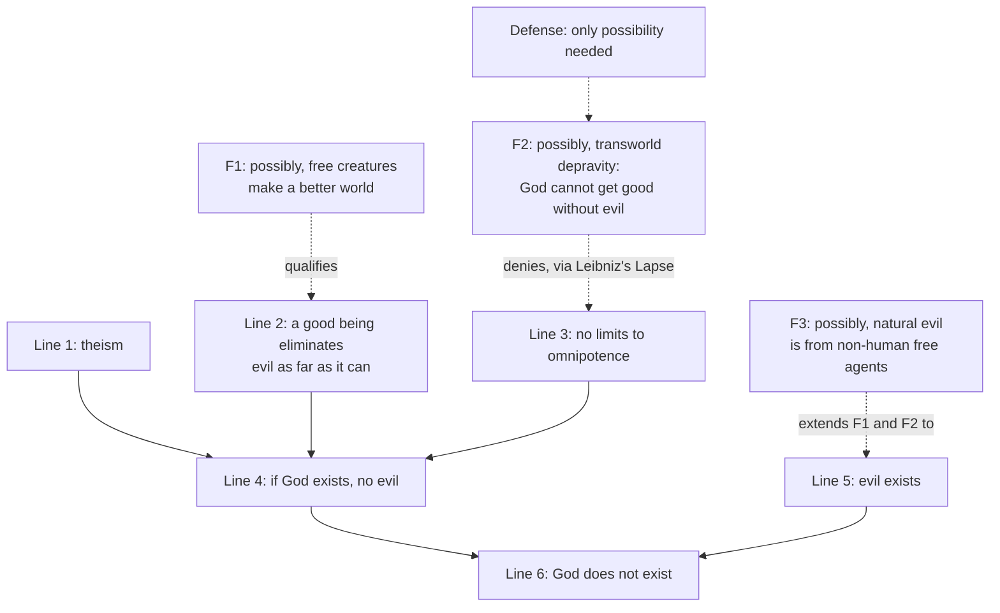

# Philosophy of Religion · Lesson 4.1: The logical problem of evil

> ⏱ ~15 min · Module 4: Evil and hiddenness · Builds on: [1.2 Omnipotence and its paradoxes](01-02-omnipotence-and-its-paradoxes.md), [1.3 Omniscience and human freedom](01-03-omniscience-and-human-freedom.md), [`metaphysics` 6.4 Libertarianism and its critics](../../metaphysics/lessons/06-04-libertarianism-and-its-critics.md), [`philosophical-method` 4.1 Objections and replies](../../philosophical-method/lessons/04-01-objections-and-replies.md) · Unlocks: [4.2 The evidential problem of evil](04-02-the-evidential-problem-of-evil.md), [4.3 Theodicies](04-03-theodicies.md)

## Why this matters

Every argument in Modules 2 and 3 tried to show that God exists or is probable. The [logical problem of evil](../reference.md#logical-problem-of-evil) aims higher in the other direction. It claims that the God of [perfect-being theology](../reference.md#perfect-being-theology) *cannot* exist in a world with evil, as a square circle cannot exist. If that is right, no cosmological or design argument could help, because no evidence supports a contradiction. This lesson states the incompatibility claim exactly, then examines the reply most philosophers now accept answers it, and what that reply does *not* claim.

## The idea

Hume's Philo puts the old dilemma in *Dialogues* Part X:

> Is he willing to prevent evil, but not able? then is he impotent. Is he able, but not willing? then is he malevolent. Is he both able and willing? whence then is evil?

Philo calls these "EPICURUS's old questions." The attribution is uncertain. Lactantius (*On the Anger of God*, ch. 13) is our source for crediting Epicurus, but no surviving Epicurean text contains the argument, and some scholars trace it to a sceptic such as Carneades.

The dilemma sounds like a proof, but it hides a step. "Able and willing, so no evil" assumes that a good being who *can* prevent an evil always *will*. Good parents allow a child's vaccination pain, and good surgeons cause pain. They do so for a reason: a good that cannot be had without it. So the real question is whether an *omnipotent* being could ever have such a reason. Omnipotence seems to remove every "cannot be had without it", and that is where the fight is.

This is a **reductio** in the sense of [`philosophical-method` 4.1](../../philosophical-method/lessons/04-01-objections-and-replies.md). It grants theism's own premises and derives "there is no evil" from them, which everyone rejects. That lesson promised the problem would meet all five standard replies, and it does:

- **R1, concede and restrict:** give up an attribute, as finite-God and process theists do.
- **R2, deny the objection's premise:** deny that a good being prevents every evil it can.
- **R3, draw a distinction:** omnipotence covers the logically possible only ([1.2](01-02-omnipotence-and-its-paradoxes.md)).
- **R4, bite the bullet:** deny that evil is real.
- **R5, grant and outweigh:** evil is real, but outweighed by goods that require permitting it.

R1 and R4 abandon the theism at issue or a datum almost no one denies. The live debate runs through R2, R3 and R5, and the free will defense combines R2 and R3.

## The argument

J. L. Mackie, "Evil and Omnipotence" (*Mind*, 1955), saw that the three core claims are not formally contradictory. A contradiction appears only with extra premises, which he presented as quasi-logical rules about "good," "evil" and "omnipotent."

1. God is omnipotent, omniscient and wholly good. *(Theism.)*
2. A wholly good being eliminates evil as far as it can. *(Mackie's first rule.)*
3. There are no limits to what an omnipotent being can do. *(Mackie's second rule, read by everyone since as: no logically possible limits.)*
4. So if God exists, there is no evil. *(1–3.)*
5. Evil exists. *(Datum.)*
6. ∴ God, so conceived, does not exist. *(4, 5.)*

In words: a God who can and would prevent all evil would leave none, and there is some.

Mackie anticipated the obvious R5 reply, that God allows evil for free will's sake. His counter is the strongest version of the argument. Mackie was a compatibilist, so for him God could simply have made people who always freely choose the good. Even for a libertarian there is a *possible world* where every free creature always does right. An omnipotent God can create any possible world, so why not that one?

**[Defense and theodicy](../reference.md#defense-and-theodicy).** Alvin Plantinga's reply (*The Nature of Necessity* and *God, Freedom, and Evil*, both 1974) changes what the theist has to show. A **theodicy** claims to give God's actual reason for permitting evil ([4.3](04-03-theodicies.md)). A **defense** need only describe a *possible* situation in which God and evil coexist. To show two propositions consistent, it is enough to find a third that is consistent with the first and, together with it, entails the second. Its truth, and even its plausibility, are not at issue.

**The [free will defense](../reference.md#free-will-defense).** It assumes libertarian freedom ([`metaphysics` 6.4](../../metaphysics/lessons/06-04-libertarianism-and-its-critics.md)): if God causes you to choose rightly, you do not choose freely. Then:

- **(F1)** It is possible that a world with significantly free creatures who do more good than evil is better than any world without free creatures.
- **(F2)** It is possible that it was not within God's power to create a world containing moral good but no moral evil.
- **(F3)** It is possible that every natural evil is caused by the free choices of non-human persons, Plantinga's suggestion following Augustine.

Together with theism, these make the existence of evil consistent, so line 3, or the inference from 2 and 3 to 4, fails.

F2 carries the weight. Its target is the assumption Plantinga calls **Leibniz's Lapse**: that an omnipotent God could actualize any possible world. Plantinga states his case using the counterfactuals of freedom from [Molinism](../reference.md#molinism) ([1.3](01-03-omniscience-and-human-freedom.md)). Suppose it is true that *if Curley were offered this bribe in these exact circumstances, he would freely take it*. Then God cannot actualize a world where Curley is in those circumstances and freely refuses. Whether Curley takes the bribe is up to Curley, and only the circumstances are up to God. A person suffers **"[transworld depravity](../reference.md#transworld-depravity)"** (Plantinga's term) if, for every world in which they are free and always do right, that world includes some situation in which, if God created it, they would freely go wrong. If it is *possible* that every creatable person, every "creaturely essence", suffers from it, then F2 is possible, and Mackie's world of perfect free agents, though possible, is not one God could have guaranteed.

**Where the argument is weakest.** Line 2 as Mackie stated it. The critic (Plantinga, and most theists) says no one should accept it unqualified. Even good finite agents permit evils for weightier goods, so the line must become *a wholly good being eliminates every evil it can, unless permitting it is needed for a greater good*. The defender of the argument replies that the qualification is harmless for an omnipotent being. God can get any good without its attendant evil unless the link is *logically* necessary. On that view the weight falls on line 3 and on whether F2's limit is real. The atheist defender thinks the free will defense rests on two contested premises of its own: libertarian freedom, and true counterfactuals of freedom with no grounds (the [grounding objection](01-03-omniscience-and-human-freedom.md)).

That said, the report on where opinion sits is accurate. Most philosophers, including many atheists, take the free will defense to answer the *logical* problem. Mackie himself, in *The Miracle of Theism* (1982), conceded that evil does not show theism's central doctrines to be logically inconsistent. The argument against theism moved to probability ([4.2](04-02-the-evidential-problem-of-evil.md)).

## The argument map

Solid arrows build Mackie's reductio; dashed arrows are the free will defense. Each dashed node claims only that something is *possible*.

## Worked examples

**Example 1 (clean case: a single bribe).** The prison guard Oren is offered a bribe to release a dangerous inmate. Mackie asks why God did not create Oren so that he freely refuses. Run the defense. Suppose the counterfactual *if Oren were offered this bribe in circumstances C, he would freely take it* is true. Then God has three options. He can leave Oren out of C, losing whatever good Oren's free refusal in other situations would bring. He can cause Oren to refuse, in which case the refusal is not free. Or he can place Oren in C, where Oren takes the bribe. No option yields *Oren freely refuses in C*. The defense needs only that this pattern is **possible** for Oren and for every person God could create. Note what the example does not say: that Oren exists, that the counterfactual is true, or that this is why bribery exists.

**Example 2 (hard case: an earthquake before anyone sins).** Suppose a fault ruptures long before any human exists and buries a valley of animals. No human freedom is involved, so F1 and F2 do not reach it. The defense must add F3: possibly, non-human free persons cause such evils. The objector calls this absurd. The defender's answer is structural. Against a *logical* problem, a defense needs consistency, not credibility, and the objector's mockery is a judgment of probability. The objector then sharpens the point. A defense must at least be something we have reason to think *possible*, and the conceivability tests of [`metaphysics` 3.1](../../metaphysics/lessons/03-01-kinds-of-necessity.md) are weak for hypotheses this remote. Here the logical and evidential problems come apart. F3 may win the consistency question while doing nothing against the claim that earthquakes make theism *less probable*, which is [4.2](04-02-the-evidential-problem-of-evil.md)'s argument. Philo already drew this line at the close of Part X, conceding compatibility and adding that "a mere possible compatibility is not sufficient."

## Watch out

- **You might think the free will defense says evil exists because humans are free, but** that is a free will *theodicy*. The defense asserts no actual reason, only that a reason of this shape is possible.
- **You might think answering the logical problem shows God exists, or that evil is no evidence against God, but** consistency is the weakest result there is. Both the evidential problem and the arguments for God remain open.
- **You might think compatibilists can simply reject the defense, but** that is its cost, not a refutation. The defense does assume libertarian freedom, and a compatibilist theist must find another answer to Mackie's "always freely choose the good."

## One-liner

> Mackie's reductio needs an omnipotent God to be able to get any good without evil; Plantinga's defense needs only that it is possible God could not get free creatures' goodness without their wrongdoing, and most philosophers grant that consistency, which moves the fight to probability.

## Problems

**P1 (🟢) *(Exegetical)*** From a parish newsletter, invented:

> Thanks to Alvin Plantinga, the problem of evil is solved. He proved that all evil comes from free will: we sin because we are free, and earthquakes are the work of fallen angels. Since evil has a cause other than God, atheists can no longer use it against faith, and God's existence is secure.

Name **three** claims in the paragraph that Plantinga's free will defense does not make, and for each say in one sentence what the defense claims instead.

**P2 (🟡) *(Evaluative)*** Steelman and reply, atheist side first. State Mackie's objection, "God could have made people who always freely choose the good", at full strength for an opponent who *accepts* libertarian freedom. Then give the best free-will-defense reply, and say which premise of the objection it denies. 150 words or fewer. Any verdict, or none.

**P3 (🔴, optional) *(Exegetical (a) · Evaluative (b))*** A debater, invented, says: "Grant the free will defense for murder. A child dying of a bone cancer that no one caused is a different matter. Free will is irrelevant to it, so the logical problem returns." (a) Which of F1–F3 does the defender need for this case, and what modal status must it have? One sentence. (b) The debater replies that F3 is "a desperate fantasy." Assess whether this reply touches the *logical* problem, and say what it does bear on. 100 words or fewer.

Solutions

**P1** *(Exegetical)*

**Must hit, strict:** any three of the following, each with its correction.

- "He proved that all evil comes from free will." The defense claims only that it is *possible* that God could not create a world with moral good and no moral evil (transworld depravity). It asserts no actual origin of evil; that would be a theodicy.
- "Earthquakes are the work of fallen angels." Plantinga claims only that it is *possible* that natural evil is caused by non-human free persons. That is enough for consistency, and he does not assert it as fact.
- "Atheists can no longer use evil against faith." The defense answers only the *logical* (incompatibility) problem. Evil as *evidence* against theism (4.2) is untouched.
- "God's existence is secure." Consistency shows God and evil *can* coexist, not that God exists. It is no argument for theism.
- (Also acceptable) "Since evil has a cause other than God, God is off the hook." The defense does not say God is not a cause of the conditions of evil. It says God may have a morally sufficient reason to permit it.

**Wrong turns:** objecting that "Plantinga didn't believe in fallen angels". The point is not his private belief but what the defense *asserts*. Calling the paragraph's errors "verdicts the newsletter is entitled to": the task is exegetical, and the paragraph misstates what the defense claims.

**Model answer:** (1) "All evil comes from free will" overstates it: the defense claims only that it is possible God could not get moral good without moral evil, not that this is why evil exists. (2) "Earthquakes are the work of fallen angels": Plantinga says only that this is possible, and possibility is all consistency needs. (3) "Atheists can no longer use evil against faith": the defense answers the logical problem only. The evidential problem, that evil lowers the probability of theism, is a separate argument it does not address.

---

**P2** *(Evaluative)*

**Must hit, any verdict:**

- The objection stated without compatibilism: there is a **possible world** in which every free creature always freely does right; an omnipotent being can actualize any possible world; so God could have created it.
- The reply names the premise it denies: *an omnipotent being can actualize any possible world* (Leibniz's Lapse). If counterfactuals of freedom are true and not up to God, then which free choices occur in given circumstances is not in God's control.
- Transworld depravity as a *possibility*: possibly every creatable person would go wrong somewhere in any world God could weakly actualize, so possibly no world of perfect free agents was available.
- Either a rejoinder or an acknowledgment of what the reply rests on (true counterfactuals of freedom; the grounding objection; or the critic's claim that God could create only non-depraved essences, met by "possibly all are depraved").

**Wrong turns:** stating Mackie's objection in its compatibilist form after the stem asks for the libertarian one; answering with "God wanted real love, which requires the risk of evil", which is a theodicy-style R5 claim and denies none of the objection's premises.

**Model answer, one of several:** *Objection:* Even granting that God cannot cause free right choices, there is surely a possible world in which every free creature always chooses rightly; nothing in freedom makes some wrongdoing necessary. An omnipotent being can bring about any possible world, so God could have made that one and had freedom without evil. *Reply:* The objection's second premise, that God can actualize any possible world, is Leibniz's Lapse. If it is true that a given person would freely go wrong in some circumstances, God cannot make it true that they freely go right there. It is possible that every person God could create is like this somewhere ("transworld depravity"), and possibility is all a defense needs. *What it rests on:* true counterfactuals of freedom, which the grounding objection challenges.

---

**P3** *(Exegetical (a) · Evaluative (b))*

**Must hit, strict (a):** F3, or a successor with the same job, that it is *possible* that such evils result from free non-human agency. It must be broadly logically possible (consistent), not true or probable.

**Must hit, any verdict (b):**

- Separate the charge: "desperate fantasy" is a judgment that F3 is improbable or ad hoc, and improbability does not bear on consistency.
- Say what it does bear on: the evidential problem (4.2), the credibility of a theodicy (4.3), or the epistemic question of whether we have any reason to think F3 possible.
- Either side may conclude. A critic can press that a defense must be at least reasonably believed possible; a defender can reply that F3 involves no contradiction and that the burden in a logical argument is on the person alleging inconsistency.

**Wrong turns:** answering (a) with F1 or F2 alone, which address moral evil; treating (b) as settled by saying "possible means not contradictory", without noting the epistemic-possibility worry.

**Model answer (b), one of several:** Calling F3 a fantasy says it is improbable, and against a claim of strict incompatibility probability is beside the point. The debater must show F3 contradicts theism or the cancer's existence, which "fantasy" does not do. The charge bears on the evidential problem, where the question is how probable such suffering is if God exists, and on whether anyone would offer F3 as a theodicy. Its strongest form is epistemic: if we have no grip on whether F3 is possible, the defense shows less than it claims.

## Flashback

**From Lesson [3.4](03-04-the-argument-from-religious-experience.md) (The argument from religious experience):** *(Formal (a)–(b) · Exegetical (c).)* Swinburne gives no numbers, so put invented ones on his structure. Let $E$ be the widespread reports of experiences as of God, and let all the *other* evidence leave a reader at prior odds $G : \neg G = 1 : 4$. A Swinburnean puts the likelihood ratio of $E$ at $L = \frac{P(E \mid G)}{P(E \mid \neg G)} = 20$. (a) Compute the posterior odds and $P(G \mid E)$. Then find the prior probability of $G$ below which $E$ fails to make theism more probable than not. (b) A projection theorist says naturalism predicts such reports nearly as well, and puts $L = 1.5$. Recompute the posterior odds, $P(G \mid E)$ and the threshold prior probability. (c) In one sentence each, say which premise of Swinburne's argument the threshold in (a) gives a number to, and which premise the critic's move in (b) attacks.

Solution

**Worked arithmetic (a):**

- Posterior odds $= \frac{1}{4} \times 20 = 5 : 1$, so $P(G \mid E) = \frac{5}{6} \approx 0.83$.
- The posterior odds exceed $1 : 1$ exactly when the prior odds exceed $\frac{1}{L} = 1 : 20$, that is, when $P(G) > \frac{1}{21} \approx 0.048$.

**Worked arithmetic (b):**

- Posterior odds $= \frac{1}{4} \times 1.5 = 3 : 8$, so $P(G \mid E) = \frac{3}{11} \approx 0.27$.
- Threshold prior odds $= \frac{1}{1.5} = 2 : 3$, so $P(G) > \frac{2}{5} = 0.4$ is now needed.

**Must hit, strict (c):**

- The threshold gives a number to **P5** (equivalently, to when consideration (iii) applies): "strong evidence that God does not exist" means other evidence that pushes $P(G)$ below about $0.048$, and on these numbers anything short of that leaves the experiences carrying theism past one half.
- The critic attacks **P4**: a naturalistic explanation of the experiences invokes consideration (iv) without first proving atheism, which shows up as a larger $P(E \mid \neg G)$ and so a smaller $L$.

**Wrong turns:** reading the threshold as $\frac{1}{20} = 0.05$; that is the threshold in *odds*, and the probability is $\frac{1}{21}$. Filing the projection theory under P5 or under the prior: it changes no one's starting credence, it changes how expected the evidence is without God.

**Model answer (c):** The threshold puts a number on P5: Swinburne's claim that experience makes theism probable unless the rest of the evidence makes it *very* improbable comes to "unless $P(G)$ falls below about one in twenty-one" on these figures. The projection theorist attacks P4, since an adequate natural cause of the reports brings consideration (iv) into play without strong evidence against God, and the cost to the argument is paid entirely in $L$.

## Connections

- **Backward:** the reductio and the five replies are [`philosophical-method` 4.1](../../philosophical-method/lessons/04-01-objections-and-replies.md); "no limits to omnipotence" read as "no *logical* limits" is [1.2](01-02-omnipotence-and-its-paradoxes.md)'s definition, and Mackie's 1955 paper also posed the paradox of omnipotence met there; counterfactuals of freedom and the grounding objection are [1.3](01-03-omniscience-and-human-freedom.md); libertarian freedom is [`metaphysics` 6.4](../../metaphysics/lessons/06-04-libertarianism-and-its-critics.md).
- **Forward:** [4.2](04-02-the-evidential-problem-of-evil.md) takes Philo's "mere possible compatibility is not sufficient" seriously, with Rowe's and Draper's arguments from evil as evidence. [4.3](04-03-theodicies.md) asks for actual reasons: privation, the best possible world, soul-making, natural law, and [natural evil](../reference.md#natural-evil) and animal suffering, which F3 handles only as a possibility. [4.4](04-04-skeptical-theism.md) asks whether we should expect to see God's reasons at all.
- **Sideways:** Augustine, whom Plantinga cites for F3, is read as history in [`ancient-medieval-philosophy` 5.2](../../ancient-medieval-philosophy/lessons/05-02-augustine-evil-and-the-will.md) (evil as privation and the will's turning); Job, whose suffering God admits is "without cause" (2:3), is [`old-testament` 5.3](../../old-testament/lessons/05-03-job.md). The defense/theodicy split is the logician's consistency proof by model: to show $\{p, q\}$ consistent, exhibit one possible situation where both hold, as countermodels did in [1.3](01-03-omniscience-and-human-freedom.md).
