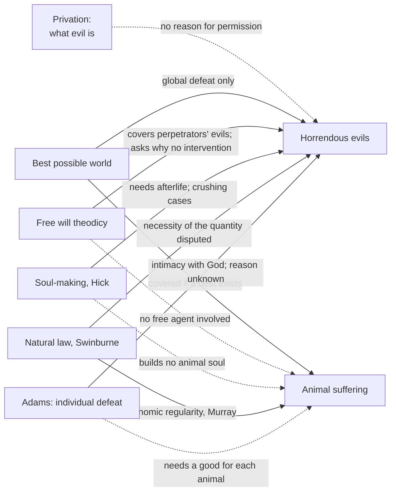

# Philosophy of Religion · Lesson 4.3: Theodicies

> ⏱ ~15 min · Module 4: Evil and hiddenness · Builds on: [4.1 The logical problem of evil](04-01-the-logical-problem-of-evil.md), [4.2 The evidential problem of evil](04-02-the-evidential-problem-of-evil.md) · Unlocks: [4.4 Skeptical theism](04-04-skeptical-theism.md)

## Why this matters

[4.1](04-01-the-logical-problem-of-evil.md) separated a **defense** from a **theodicy** ([defense and theodicy](../reference.md#defense-and-theodicy)). A defense needs only a *possible* reason God might have for permitting evil, which is enough to block a claim of logical incompatibility. A theodicy claims to give God's *actual*, or at least probably actual, reason. That is the bar the evidential argument of [4.2](04-02-the-evidential-problem-of-evil.md) sets: a theodicy that worked would name the good Rowe says is missing.

This lesson states six theodicies at the strength their defenders give them. It then runs every one through the same two hard tests: **horrendous evils** and **animal suffering**. Most theodicies handle ordinary hardship well; these two are where the debate is live.

## The idea

Think of a surgeon who causes a patient pain. To be blameless she must meet three conditions. The pain must be **needed**: no painless route to the same benefit. The benefit must be **worth it**: it outweighs the pain. And, many of us think, it must be **for the patient**: you may not cut one patient to train students who will help others. Most theodicies share that structure. They differ in the good they name, and that fixes which evils they **cover**.

The privation account is not a greater-good argument at all: it says what evil *is*, not why God permits it.

## Source

Leibniz, *Theodicy* (1710), Part One, §8 (Huggard translation, public domain). He has argued that God is supremely wise and good:

> if there were not the best (*optimum*) among all possible worlds, God would not have produced any.

Note the form. The claim that this world is the best is not read off the world. It is **deduced** from God's wisdom and goodness, so the evidence of evil cannot refute it by itself. In §9 he adds that the world is "all of one piece, like an ocean". Remove its smallest evil and you no longer have this world.

## The argument

**The common skeleton** of a greater-good theodicy, for any evil $E$ God permits:

1. **There is a good $G$ that God could not secure without permitting $E$ or some evil as bad.** *In words:* the evil is the price of the good, not a side effect God could have avoided. (The **necessity premise**.)
2. **$G$ outweighs $E$.** (The **outweighing premise**.)
3. **A perfectly good being may permit an evil that meets 1 and 2.**
4. **So God's permitting $E$ is consistent with perfect goodness, and a reason for it is in view.**

Marilyn McCord Adams adds a premise many theodicies cannot meet: **2′. $G$ defeats $E$ within the sufferer's own life**, not only in the world as a whole. The sections below fill in $G$.

**Privation** (Augustine; the texts are read in [`ancient-medieval-philosophy` 5.2](../../ancient-medieval-philosophy/lessons/05-02-augustine-evil-and-the-will.md), the doctrine in [`thomistic-synthesis` 2.4](../../thomistic-synthesis/lessons/02-04-the-transcendentals.md)). Evil is a lack of a good that a thing ought to have, not a substance ([privation theory of evil](../reference.md#privation-theory-of-evil)). As an argument it does real work: God need not have *created* evil as a thing, and no second, evil principle is needed. But it explains evil's **metaphysical status**, not its **existence**. Why does God permit the lack? That question survives untouched. Critics add that pain and cruelty seem positive, not lacks; defenders reply that the evil of pain is the disorder it signals, not the sensation. Either way, privation must be paired with a reason for permission.

**The best possible world** (Leibniz). This world is the best possible one, and its evils are bound into it by the connectedness quoted above ([best possible world](../reference.md#best-possible-world)). The critic attacks the presupposition that there is a best. William Rowe (*Can God Be Free?*, 2004) argues that if every world has a better one, God does less than the best whatever he creates. So God is surpassable in goodness. And if there is a best, God must create it, which seems to leave no room for divine freedom ([no-best-world objection](../reference.md#no-best-world-objection)). The defender's reply comes from Robert Adams ("Must God Create the Best?", 1972). A creator wrongs no one by creating a less than best world in which every creature's life is good on the whole, and choosing such a world may express grace.

**The free will theodicy.** The good is libertarian freedom ([`metaphysics` 6.4](../../metaphysics/lessons/06-04-libertarianism-and-its-critics.md)), significant enough that people can do serious harm. The 4.1 defense claimed only that this was possible. The theodicy claims that it is God's reason. It covers moral evil only. Against horrendous evil the critic asks why God does not intervene, as a good bystander would; the defender answers that systematic intervention would make freedom unreal.

**Soul-making** (John Hick, *Evil and the God of Love*, 1966; Hick called it Irenaean). God does not make finished saints. He makes persons who become good through struggle in a world with real dangers, a "vale of soul-making" ([soul-making theodicy](../reference.md#soul-making-theodicy)). Courage requires danger and compassion real suffering, and God must keep an **epistemic distance**, a world ambiguous enough that faith is free. The critic answers that a great deal of suffering crushes rather than builds: infants, people with dementia, people broken by torture. Hick's answer is twofold. He argued, roughly, that if suffering were visibly apportioned to its use, compassion could not form. And he held that soul-making continues after death until every person reaches God. The critic replies that the theodicy then rests on an eschatology the argument cannot independently support.

**Natural-law theodicy** (Richard Swinburne, *Providence and the Problem of Evil*, 1998) ([natural-law theodicy](../reference.md#natural-law-theodicy)). Responsible choice needs knowledge of how to cause and prevent harm, and that knowledge comes from regular laws whose workings sometimes harm: floods, disease, fire. The critic presses the necessity premise. Would a hundredth of this natural evil not teach the same lessons? And could God not reveal the knowledge directly? Swinburne answers that direct revelation would bring God so close that our choices would no longer be free, which is Hick's epistemic distance again.

**Horrendous evils** (Marilyn McCord Adams, *Horrendous Evils and the Goodness of God*, 1999). Horrendous evils are those whose doing or suffering gives prima facie reason to doubt that the participant's life could be a great good to them on the whole ([horrendous evils](../reference.md#horrendous-evils)). Adams argues that generic theodicies offer at best **global** defeat: the world as a whole is better for the evil. Divine love, she holds, requires **individual** defeat, with each life a great good to the one who lives it ([global and individual defeat](../reference.md#global-and-individual-defeat)). Her answer is that intimacy with God is an incommensurable good, one that can make the horror part of a life that is a great good on the whole. Notice the concession: she does not claim to know God's reason for particular horrors, only that their defeat is guaranteed, and she draws on specifically Christian resources. The critic replies that the added Christian content must earn its own probability.

**Animal suffering** (Michael J. Murray, *Nature Red in Tooth and Claw*, 2008) ([animal suffering](../reference.md#animal-suffering)). Animal pain predates humans by hundreds of millions of years and builds no soul. Murray surveys the options without endorsing one as sufficient. **Neo-Cartesian** views doubt that many animals are aware of pain in the morally relevant way. **Fall** views tie natural evil to a primordial rebellion. **Nomic regularity** views treat animal pain as the price of a law-governed world. **Chaos-to-order** views hold that a universe developing from chaos to order is itself a great good. The critic finds each either empirically doubtful or a natural-law theodicy with a larger bill; the defender replies that the case is cumulative.

**Divinely commanded violence.** [`old-testament` 3.1](../../old-testament/lessons/03-01-joshua-judges-and-the-land.md) left one question for this module: could God command the ban? *The critic:* (1) a perfectly good God would not command the killing of noncombatants; (2) the texts report that God did; so (3) either God is not perfectly good or the texts misreport him, and the second disjunct costs a theist who takes them as revelation. *The replies:* the **hyperbole** reading (Copan and Flannagan, *Did God Really Command Genocide?*, 2014, building on the conquest-report genre that 3.1 teaches) denies that (2) reports a literal command to kill everyone. The **divine authority** reply holds that God, as the lord of life, does not murder in taking life (Aquinas's version is read in [`ethics` 6.5](../../ethics/lessons/06-05-god-and-morality-the-euthyphro-dilemma.md)), and so it denies (1). The **skeptical-theist** reply ([4.4](04-04-skeptical-theism.md)) says that we cannot judge (1) for a being with reasons beyond our view. Each has its critic: hyperbole may still leave a command to kill some; divine authority seems to license anyone who sincerely hears such a command; skeptical theism invites 4.4's moral-paralysis worry.

**Where the argument is weakest.** For horrendous and animal suffering, the critic attacks the **necessity premise**. Granting the goods, could God not have had them with far less of this? Draper's comparison in 4.2 is the probabilistic form of that attack. The defender thinks the attack itself rests on a hidden premise: that if a necessitating connection existed, we would expect to see it. That premise is the noseeum inference, and denying it is skeptical theism ([4.4](04-04-skeptical-theism.md)). Adams attacks from inside theism. For her the weak point is premise 3, since global outweighing does not show love for the individual sufferer.

## The picture

Solid arrows: the theodicy claims to cover the case, and the label names the premise in dispute. Dashed arrows: the theodicy by itself does not reach the case.

## Worked examples

**Example 1 (clean case: a river town).** A river floods a town every few decades. This year three houses are lost and no one dies. Neighbours rebuild, raise the levee, and two feuding families work side by side.

- *Natural law:* the flood follows regular hydrology. Those regularities are how the town learned what levees do, and that knowledge lets them protect one another. Necessity and outweighing are both plausible.
- *Soul-making:* the rebuilding drew out courage and reconciliation, goods the struggle partly constitutes.
- *Adams:* nothing here is horrendous, so global defeat raises no special worry. Necessity is still claimed, but at this scale it is easy to grant.

**Example 2 (hard case: the wasp).** A parasitoid wasp lays its eggs in a living caterpillar. The larvae eat it from inside over days, sparing the vital organs until last. This went on long before humans.

- *Free will:* no free agent is involved, so it does not apply. *Soul-making:* there is no soul to make, and no human witness for most of the history.
- *Natural law:* the theodicy must claim that the laws producing this are part of a package worth having. The critic asks why the package needs this design, and not just some predation.
- *Neo-Cartesian:* the caterpillar's awareness of pain may be doubtful, an empirical claim that does not transfer to higher animals.
- *Where the theodicies strain:* defenders here typically combine nomic regularity and chaos-to-order with a skeptical-theist claim. The critic says that this combination is no longer a theodicy, since it concedes that the reason is not in view.

## Watch out

- **You might think the privation account answers the problem of evil, but** it answers "what is evil?" Even if it succeeds, "why does God permit this lack?" remains.
- **You might think a theodicy must justify every evil alone, but** defenders run a cumulative case, each theodicy covering a region; the fair test is whether the regions jointly cover the hard cases.
- **You might think Adams offers a theodicy, but** she denies knowing God's reasons for particular horrors. She argues that God can defeat them in each life, which is closer to a defense with Christian content.

## One-liner

> A theodicy names a good, claims God needs evil to secure it, and claims it outweighs the evil: horrendous and animal suffering test the necessity premise and Adams's demand that the good reach the sufferer.

## Problems

**P1 (🟢) *(Exegetical.)*** Diagnose. An invented parish newsletter says:

> "Why does the hospice down the road exist? Because a world with cancer is a world where love has room to grow. And remember, evil is only the absence of good; God made nothing evil. Whatever we suffer here, God will make each life a good beyond measure for the one who lived it."

(a) Name the theodicy or account each of the three sentences after the question draws on. (b) Say which sentence gives no reason for God's permitting evil, and why. Two sentences per part.

**P2 (🟡) *(Evaluative.)*** Steelman and reply. An infant dies of a painful illness at six weeks, before it can form any character. (a) Give the strongest soul-making reply. (b) Give the critic's strongest rejoinder. Any verdict; 150 words or fewer in total.

**P3 (🔴, optional) *(Exegetical (a) · Evaluative (b))*** Find the crux. A Swinburne-style theodicist says that a flood victim's suffering is justified because the regularity of the laws gives everyone the knowledge that responsible choice requires. An Adams-style theist says that this cannot be the whole story. (a) Name the single premise one asserts and the other denies. (b) Name one consideration that would move one side, and say which side. 150 words or fewer in total.

Solutions

**P1** *(Exegetical — strict.)*

(a) Sentence 1, the cancer and love: soul-making (Hick). Sentence 2, evil as absence: the privation account. Sentence 3, each life made good for the one who lived it: Adams's individual defeat of horrendous evils.

**Must hit, strict (a):**

- Soul-making for the first, privation for the second, Adams (individual defeat) for the third.

**Must hit, strict (b):**

- Sentence 2 (privation) gives no reason for permission. It says what evil is, so the question of why God permits the lack survives.
- A strong answer adds that sentence 3 promises defeat without naming God's reason, so it too stops short of a full theodicy.

**Wrong turns:** calling sentence 1 a free will theodicy, when no choice is involved in cancer; calling sentence 3 the best-possible-world view, which offers global, not individual, defeat.

**Model answer:** (a) Sentence 1 is soul-making: suffering is the occasion for compassion. Sentence 2 is the privation account. Sentence 3 is Adams's individual defeat. (b) Sentence 2 explains evil's status, not why God allows the lack, so it supplies no reason for permission. Sentence 3 assures defeat but likewise names no reason.

---

**P2** *(Evaluative — graded on moves, not verdict.)*

**Must hit, any verdict:**

- (a) A reply drawn from Hick's own resources, not a different theodicy dressed up. That means soul-making beyond death (the infant's growth continues after death), and/or the claim that suffering must not be visibly apportioned to its use if compassion and free trust are to form, so the infant's death is an occasion of soul-making for others.
- (b) A rejoinder that targets a named premise. Either necessity (a good God could have secured the afterlife growth without the six weeks of pain), or individual defeat (using the infant's suffering for others' compassion treats the infant as a means), or the dependence on an eschatology the argument cannot independently support.

**Wrong turns:** answering (a) with the free will theodicy; answering (b) with "God does not exist," which assumes the verdict.

**Model answer (one of several):** (a) Soul-making is not confined to this life: the infant's development continues beyond death, so its suffering is not the end of its story. And a world where suffering visibly tracked its usefulness would leave no room for compassion or trust that is not calculated; the infant's death calls out love in others. (b) The afterlife growth did not require the six weeks of pain, so the necessity premise fails for the infant itself. The appeal to others' compassion uses the infant for goods it never shares, which is what Adams says love forbids.

---

**P3** *(Exegetical (a) · Evaluative (b))*

**Must hit, strict (a):**

- The disputed premise: *a perfectly good, loving God may permit an individual's evil for goods realized in the world as a whole (global defeat), without ensuring that the good reaches that individual's own life.* Swinburne-style theodicy asserts it; Adams denies it.
- A strong answer notes that both may grant the necessity and outweighing premises at the global level, so those are not the crux.

**Must hit, any verdict (b):** a real mover with the side named. For example, a convincing analogy where permitting harm to one person for others' benefit is plainly compatible with love (a parent's rule that sometimes burdens one child for the household) moves Adams. A convincing case that a lover who sacrifices a beloved's well-being for third parties without consent fails as a lover moves Swinburne. A third option: showing that individual defeat is impossible without the specifically Christian goods Adams invokes moves the theodicist's view of what the generic argument can claim.

**Wrong turns:** naming "whether natural laws must be regular" as the crux, which Adams need not deny; naming "God exists."

**Model answer:** (a) Whether perfect love permits someone's suffering for global goods without guaranteeing that the good reaches that person. Swinburne-style theodicy says yes; Adams says no. (b) A persuasive case of a loving parent permitting one child's hardship for the family's good would move Adams toward accepting global defeat.

## Flashback

**From Lesson [4.1](04-01-the-logical-problem-of-evil.md) (The logical problem of evil):** *(Formal (a)–(b) · Exegetical (c).)* A toy model of transworld depravity. God is considering creating Ana, a significantly free person. Any life God could give her places her in circumstances C1 and in exactly one of C2 or C3. In each circumstance she makes one free choice, right (R) or wrong (W). Suppose these counterfactuals of freedom are true, and their truth is not up to God: in C1 she would freely do R; in C2 she would freely do W; in C3 she would freely do R. (a) List the two lives God can give Ana and what she would do in each. Is there a possible world in which Ana is free and always does right? Can God actualize one? Is Ana transworld depraved? (b) Now change one fact: in C3 she would freely do W. Answer the same four questions. (c) In one sentence each: what does the free will defense need to claim about cases like (b), and which assumption of Mackie's argument does (b) illustrate failing?

Solution

**Worked answer (a):**

- God can give Ana life $\{C1, C2\}$, where she does R then W, or life $\{C1, C3\}$, where she does R then R.
- Worlds in which she is free and always right are possible: in either life she *could* freely choose R throughout.
- God can actualize one: life $\{C1, C3\}$.
- So Ana is **not** transworld depraved. The world $\{C1, C3\}$ with R, R contains no circumstance in which she would go wrong.

**Worked answer (b):**

- Life $\{C1, C2\}$ gives R then W; life $\{C1, C3\}$ now gives R then W.
- Worlds in which she is free and always right are still **possible**: nothing about her freedom rules out choosing R in C2 or C3.
- God can actualize **none** of them. In each, the circumstance she is placed in is one where, if God created it, she would freely go wrong.
- So Ana **is** transworld depraved, even though there is a circumstance (C1) in which she would do right. Transworld depravity does not mean she would do wrong everywhere; it means every always-right world contains some situation where she would not.

**Must hit, strict (c):**

- The defense needs only that it is **possible** that every creaturely essence God could instantiate is like Ana in (b). It does not claim that any actual person is, or that these counterfactuals are true.
- (b) is a case of **Leibniz's Lapse** failing: an omnipotent God cannot actualize every possible world, so line 3 of Mackie's argument, read as "God can bring about any possible world", does not give him the always-right world.

**Wrong turns:** saying the always-right world in (b) is impossible, which confuses "not actualizable by God" with "not possible"; saying Ana in (b) is not depraved because she does right in C1; claiming the defense must show the (b) counterfactuals are true.

**Model answer (c):** The defense needs only the possibility that every person God could create is transworld depraved, as Ana is in (b). Then the always-right world is possible yet not one God could actualize, which is exactly the assumption, Leibniz's Lapse, that Mackie's "no limits to omnipotence" relied on.

## Connections

- **Backward:** [4.1](04-01-the-logical-problem-of-evil.md) set the free will *defense*; this lesson asks for the actual reason. [4.2](04-02-the-evidential-problem-of-evil.md) gave the evidential argument whose necessity premise every theodicy here contests. The privation account is read as history in [`ancient-medieval-philosophy` 5.2](../../ancient-medieval-philosophy/lessons/05-02-augustine-evil-and-the-will.md) and as doctrine in [`thomistic-synthesis` 2.4](../../thomistic-synthesis/lessons/02-04-the-transcendentals.md); here it is assessed as an argument.
- **Forward:** [4.4](04-04-skeptical-theism.md) takes up the reply that does not need a theodicy at all: we should not expect to see God's reasons. [4.5](04-05-divine-hiddenness.md) asks whether soul-making and epistemic distance also answer hiddenness.
- **Sideways:** Job's whirlwind speeches as text are in [`old-testament` 5.3](../../old-testament/lessons/05-03-job.md), and the ban in [`old-testament` 3.1](../../old-testament/lessons/03-01-joshua-judges-and-the-land.md). The Euthyphro and God's authority over life are in [`ethics` 6.5](../../ethics/lessons/06-05-god-and-morality-the-euthyphro-dilemma.md). Libertarian freedom, which the free will theodicy needs, is [`metaphysics` 6.4](../../metaphysics/lessons/06-04-libertarianism-and-its-critics.md). The argued theist case built on these replies belongs to [`apologetics-foundations`](../../apologetics-foundations/syllabus.md).
