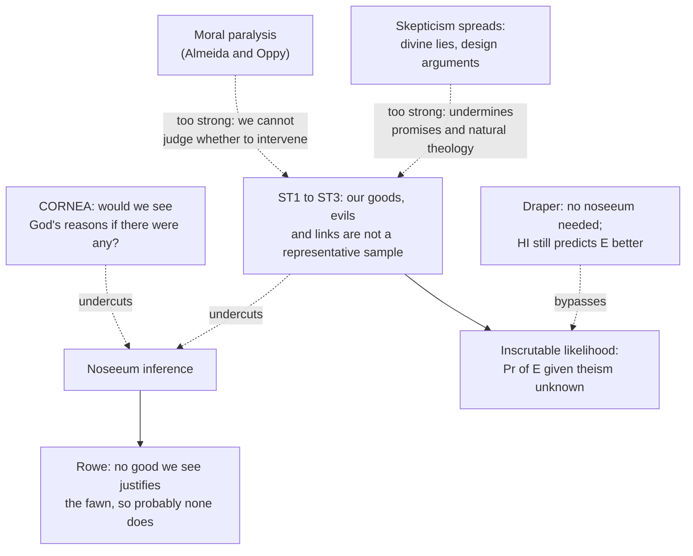

# Philosophy of Religion · Lesson 4.4: Skeptical theism

> ⏱ ~15 min · Module 4: Evil and hiddenness · Builds on: [4.2 The evidential problem of evil](04-02-the-evidential-problem-of-evil.md), [4.3 Theodicies](04-03-theodicies.md), [epistemology 1.2](../../epistemology/lessons/01-02-sensitivity-and-safety.md) · Unlocks: [4.5 Divine hiddenness](04-05-divine-hiddenness.md)

## Why this matters

[4.3](04-03-theodicies.md) tried to say *why* God permits evil. Skeptical theism declines the job. Its claim is that we are in no position to expect to see God's reasons, so failing to see them is no evidence that there are none. This is not a theodicy and not a defense in [4.1](04-01-the-logical-problem-of-evil.md)'s sense. It is an attack on one inference inside the evidential argument. It has become the main theist reply to Rowe, and its critics think its price is ruinous: if it works, they say, it also cuts us off from moral reasoning and from God's promises. Both claims deserve full strength.

## The idea

Stand at the door of your garage and look in. You see no dog, so you conclude there is no dog. Fine: if a dog were there, you would very likely see it. Now look again and conclude there is no flea. Not fine: a flea would almost certainly go unseen even if it were there. "I see no X, so there is no X" is good reasoning only when X is the kind of thing you would see.

Rowe's argument ([4.2](04-02-the-evidential-problem-of-evil.md)) rests on an inference of exactly that shape. We see no good that would justify God in permitting a fawn's slow death in a forest fire, so probably there is none. Stephen Wykstra later named this a [noseeum inference](../reference.md#noseeum-inference), after a biting insect too small to see. The skeptical theist asks whether God's reasons are dogs or fleas. If there is a God, the gap between God's mind and ours is at least the gap between a parent's and an infant's, and the infant at the vaccination clinic sees no reason for the needle either. On that picture, our not seeing God's reasons is just what we should expect *whether or not* they exist. Then it is evidence of nothing.

Notice what is and is not claimed. The skeptical theist does not say God's reasons are such-and-such (that would be theodicy). Nor does she claim that theism is true. Her claim is narrower and conditional: *if* there were a God, the goods and the connections between goods and evils would very likely outrun what we can survey.

## The argument

**Wykstra's [CORNEA](../reference.md#cornea)** (Stephen Wykstra, "The Humean Obstacle to Evidential Arguments from Suffering: On Avoiding the Evils of 'Appearance'", 1984): the **C**ondition **O**n **R**easo**N**able **E**pistemic **A**ccess.

- **CORNEA.** From "it appears there is no X" you are entitled to "there is no X" only if it is reasonable to believe that, were there an X, things would likely appear different to you.

*In words:* absence of evidence is evidence of absence only for things you could detect. This is a cousin of Nozick's sensitivity condition ([epistemology 1.2](../../epistemology/lessons/01-02-sensitivity-and-safety.md)): would the appearance have changed had the fact been different?

**Bergmann's [skeptical theses](../reference.md#skeptical-theses)** (Michael Bergmann, "Skeptical Theism and Rowe's New Evidential Argument from Evil", 2001, answering Rowe's revised argument of 1996). We have no good reason for thinking that:

- **ST1** the possible goods we know of are representative of the possible goods there are;
- **ST2** the possible evils we know of are representative of the possible evils there are;
- **ST3** the entailment relations we know of, between possible goods and the permission of possible evils, are representative of the entailment relations there are.

Bergmann's later work adds **ST4**: we have no good reason to think the total value we perceive in a complex state of affairs reflects the total value it really has. Note that each thesis is about *representativeness of a sample*, not about God. An atheist can accept them.

**The [skeptical theist](../reference.md#skeptical-theism) reply to Rowe.**

- **P1.** Rowe's premise that there is probably an evil God could have prevented without losing a greater good rests on a noseeum inference: we see no justifying good for the fawn's suffering.
- **P2.** A noseeum inference from "we see no good" to "there is probably no good" requires the goods we know of to be a representative sample of the goods there are.
- **P3.** We have no good reason to think they are (ST1–ST3).
- **∴ C.** Rowe's premise is not supported by the noseeum inference.

*In words:* the fawn shows only that we cannot see God's reason, and the theses say that is what we should expect either way. Note C is an *undercutting* conclusion. It removes Rowe's support for his premise. It does not show the premise false.

**The [inscrutable likelihood](../reference.md#inscrutable-likelihood).** In Draper's odds form ([4.2](04-02-the-evidential-problem-of-evil.md)), with $T$ for theism, $HI$ for Draper's [hypothesis of indifference](../reference.md#hypothesis-of-indifference) and $E$ for the observed pattern of suffering:

$$\frac{\Pr(T \mid E)}{\Pr(HI \mid E)} = \frac{\Pr(T)}{\Pr(HI)} \times \frac{\Pr(E \mid T)}{\Pr(E \mid HI)}$$

The skeptical theist's target is the numerator of the likelihood ratio. If ST1–ST3 hold, we cannot say how probable $E$ is on theism, so we cannot say whether the ratio is below 1.

**The objections.**

1. **[Moral paralysis](../reference.md#moral-paralysis-objection)** (Michael Almeida and Graham Oppy, "Sceptical Theism and Evidential Arguments from Evil", 2003). If I cannot judge that a child's suffering serves no unseen greater good, I cannot judge that I should stop it either. Skeptical theism seems to license standing by. Replies: our obligations depend on what *we* know and on our role, not on God's all-things-considered reasons. A parent may permit a hurt that a babysitter must prevent. And the theist has God's commands to prevent harm (Bergmann and Michael Rea, 2005).
2. **[Skepticism spreads](../reference.md#skepticism-spreads-objection).** If God's reasons are beyond us, God might have reasons to deceive us: about the afterlife, about what revelation means, about the external world (Erik Wielenberg, "Sceptical Theism and Divine Lies", 2010; Stephen Maitzen on divine commands; William Hasker, "All Too Skeptical Theism", 2010). It spreads to natural theology too. The fine-tuning argument ([3.1](03-01-from-design-to-fine-tuning.md)) assumes we *can* judge what God would likely do, so its theist likelihood faces the same inscrutability as the "inscrutable divine preferences" objection of [3.2](03-02-fine-tuning-the-objections.md). Bergmann replies that the theses concern only God's reasons for permitting evil, and that knowledge of the external world rests on externalist grounds the theses don't touch. Critics reply that limiting the skepticism to evil is ad hoc.
3. **Draper's reply** (Paul Draper, "The Skeptical Theist", 1996; "The Limitations of Pure Skeptical Theism", 2013). His argument never makes a noseeum inference. It does not claim that God has no reason. It compares how well two hypotheses predict the pattern of pain and pleasure. Inscrutability about $\Pr(E \mid T)$ does not *raise* that likelihood to match $\Pr(E \mid HI)$, which is well understood and high. On Draper's view, a "pure" skeptical theism, one without any positive account of God's reasons, leaves the comparison favouring indifference.

**Where the argument is weakest.** P3, at its scope. The critic grants that our grasp of goods is limited, but says the theses must be strong enough to block Rowe and weak enough to leave moral judgment, trust in God's promises, and theistic arguments standing, and nothing principled holds them there. The defender replies that the objection itself rests on a premise the theist denies: that moral obligation and ordinary inference depend on judging *God's* reasons. On the defender's view, ST1–ST3 are an instance of a general modesty about sampling that everyone accepts in other domains, and the scope worry is a demand for symmetry that fails because God's role and ours differ.

## The map

Solid arrows build; dashed arrows attack. The skeptical theses undercut the noseeum inference, and the objections claim that whatever undercuts it undercuts too much.

## Worked examples

**Example 1 (clean case: CORNEA on a hospital ward).** Priya, a first-week nursing student, watches a senior oncologist hold back a drug that seems to be helping a patient. She sees no medical reason for it and infers there is none. Apply CORNEA: if there were a reason, such as a drug interaction or a lab value she has not learned to read, would things likely appear different *to her*? No. Reasons in oncology are mostly invisible to a first-week student. So her noseeum inference fails CORNEA. Change one thing: a second senior oncologist reviews the chart and sees no reason. Now a reason, if there were one, would very likely appear to her, and the inference is strong.

The skeptical theist says we are Priya in the first scenario. The critic says the analogy misleads in two ways. Priya has independent grounds to trust the oncologist, while the question at issue is whether a good God exists at all. And the oncologist can *explain afterwards*, while God's silence about the fawn is itself part of the data (which is [4.5](04-05-divine-hiddenness.md)'s argument).

**Example 2 (hard case: what "inscrutable" does to the odds).** Invented numbers. Take prior odds of $1:1$ between theism and indifference, and $\Pr(E \mid HI) = 0.6$. A critic estimates $\Pr(E \mid T) = 0.15$:

$$\frac{0.15}{0.6} = \frac{1}{4}, \qquad \text{posterior odds} = 1 \times \frac{1}{4} = 1:4$$

A skeptical theist says $\Pr(E \mid T)$ could be anywhere from 0.1 to 0.9. Then the likelihood ratio lies anywhere between

$$\frac{0.1}{0.6} = \frac{1}{6} \quad \text{and} \quad \frac{0.9}{0.6} = \frac{3}{2}$$

and so do the posterior odds. The evidence can no longer be said to favour either side.

But suppose she spreads her credence evenly over that range instead of refusing a number. By the law of total probability, $\Pr(E \mid T)$ is then the average, 0.5, and

$$\frac{0.5}{0.6} = \frac{5}{6}, \qquad \text{posterior odds} = 5:6$$

$E$ still favours indifference, though weakly. This is the crux in miniature. If uncertainty about a likelihood should be *averaged*, inscrutability shrinks the evidence but does not usually cancel it. This is close to Draper's point that a well-understood rival can still out-predict. If it may be held as a set of values, an [imprecise credence](../../epistemology/lessons/05-01-credences-and-probabilism.md), then the evidence has no determinate direction at all, which is the skeptical theist's point. Which treatment ignorance deserves is the [problem of priors](../../epistemology/lessons/05-04-the-problem-of-priors.md) again, not a question about God.

## Watch out

- **You might think skeptical theism is skepticism about God, but** it is skepticism about *our sample of goods and evils*, held by theists. ST1–ST3 say nothing about whether God exists, and a skeptical theist may be quite confident God does.
- **You might think it shows Rowe's premise is false, but** its conclusion is undercutting, not rebutting. Rowe's premise might be true; the noseeum inference just doesn't show it.
- **You might think the moral-paralysis objection says skeptical theists are callous, but** it is a structural claim about inference. If "I can't see the good" is no evidence of "there is no good", then that holds for the bystander's judgment as much as for Rowe's. The reply has to break that parity, not deny the intent.

## One-liner

> Skeptical theism says that if God exists, not seeing God's reasons is what we should expect, so Rowe's noseeum inference fails; its critics say any skepticism strong enough to block Rowe also blocks moral judgment and trust in revelation, and that Draper's comparative argument never needed the noseeum inference.

## Problems

**P1 (🟢) *(Exegetical (a)–(b) · Evaluative (c))*** Tomas has played chess for two months. Watching a grandmaster game online, he sees White give up a rook for a pawn, finds no compensation after ten minutes, and concludes the sacrifice was a blunder. (a) Apply CORNEA: is Tomas entitled to his conclusion? Say what the principle requires and whether it is met. (b) Now the same move is made in a game between two players Tomas has beaten. Does the CORNEA verdict change? Why? (c) Name one disanalogy between Tomas watching the grandmaster and a person reflecting on the fawn, and say which side it helps. 120 words or fewer in total.

**P2 (🟡) *(Evaluative)*** (a) Steelman the moral-paralysis objection in standard form: numbered premises ending in a conclusion about what a skeptical theist bystander should believe about preventing a child's suffering. (b) Give the strongest skeptical theist reply, name the premise of (a) it denies, and say in one sentence whether the reply also protects Rowe's noseeum inference. 150 words or fewer in total.

**P3 (🔴, optional) *(Formal (a)–(b) · Exegetical (c))*** An invented forum post:

> Look, nobody can know how likely all this suffering is if God exists. Maybe God's reasons make it likely, maybe not. Unknowable means neutral. So the evidence from evil leaves the odds exactly where they were, end of story.

The poster's own view is that, given theism, the probability of the suffering is 0.1, 0.4 or 0.7, with credence $\tfrac{1}{3}$ in each. The probability of the suffering on the hypothesis of indifference is 0.5, and the poster's prior odds of theism to indifference are $2:1$. (a) Compute the poster's posterior odds. (b) If the poster revised only the lowest of the three values, what would it have to become for "neutral" to be right? (c) Name, in one sentence, the step in the post that does not follow, and the one reading of "unknowable" on which the post's conclusion could be defended.

Solutions

**P1** *(Exegetical (a)–(b) · Evaluative (c))*

**Must hit, strict (a):**

- CORNEA requires that, if there were compensation for the sacrifice, it would likely appear to Tomas.
- It is not met. Grandmaster compensation (long-term initiative, a mating net twenty moves out) is exactly what a two-month player would not see. So he is not entitled to "blunder".

**Must hit, strict (b):**

- Yes, the verdict changes. Players at Tomas's level rarely play deep sacrifices, and any compensation in their game is the kind he could likely see. So "I see none" now meets CORNEA and supports "it's a blunder".
- The point: CORNEA is relative to the gap between observer and agent, not to the move.

**Must hit, any verdict (c):** a real disanalogy with its beneficiary named. For example, Tomas has independent evidence that a grandmaster exists and is skilled, while the existence of the expert is what the fawn case is about (helps the critic). Or a grandmaster's skill is known to vastly exceed Tomas's, which is exactly the gap theism posits for God (helps the skeptical theist, if theism is granted for the conditional).

**Wrong turns:** treating (a) as showing the move was sound; CORNEA only blocks the inference. In (b), saying nothing changes because "the move is the same".

**Model answer (c), one of several:** Tomas knows the grandmaster is far stronger before he looks, so his humility is earned. The person reflecting on the fawn is asking whether there is any such expert at all. That helps the critic, since the skeptical theist's gap is conditional on the hypothesis under test.

---

**P2** *(Evaluative)*

**Must hit, any verdict (a):** a valid argument whose premises a critic like Almeida and Oppy would accept:

- If ST1–ST3 hold, then for any evil, we have no good reason to think there is no unseen good that its occurrence secures.
- If we have no such reason, we have no good reason to think preventing it is better, all things considered, than allowing it.
- A bystander should prevent an evil only if she has good reason to think preventing it is better all things considered.
- ∴ A skeptical theist bystander lacks reason to prevent the child's suffering.

**Must hit, any verdict (b):**

- A named premise denied. Usually the third: obligation depends on the agent's own role and evidence, or on God's commands, not on God's all-things-considered reasons. Alternatively the second: ST concerns goods *God* would secure by *permitting* evil, which need not be lost if *we* intervene.
- A one-sentence answer on whether the reply protects Rowe. It does not, since it concerns our obligations, not what our not-seeing shows about God. Or it does, if the claim is that God's permitting and our preventing can both be right.

**Wrong turns:** writing the objection as "skeptical theists don't care about suffering" (a motive, not an argument); answering (b) by restating ST1, which is the premise under attack.

**Model answer (b), one of several:** Deny P3. A bystander's duty to rescue rests on her own role and evidence, and on God's command to prevent harm, not on a verdict about the total value of the universe. A lifeguard is bound to rescue whether or not the drowning serves some larger plan. This reply leaves Rowe's inference blocked, because it only shows that our duties do not need the judgment ST withholds.

---

**P3** *(Formal (a)–(b) · Exegetical (c))*

(a) Law of total probability over the three values:

$$\Pr(E \mid T) = \tfrac{1}{3}(0.1 + 0.4 + 0.7) = 0.4$$

$$\text{LR} = \frac{0.4}{0.5} = \frac{4}{5}, \qquad \text{posterior odds} = 2 \times \frac{4}{5} = \frac{8}{5}, \text{ i.e. } 8:5$$

The odds move from 2:1 to 8:5: the evidence favours indifference, modestly.

(b) Neutral needs $\Pr(E \mid T) = 0.5$, so $\tfrac{1}{3}(x + 0.4 + 0.7) = 0.5$, giving $x = 1.5 - 1.1 = 0.4$. The lowest value would have to rise from 0.1 to 0.4.

**Must hit, strict (c):**

- The step "unknowable means neutral" fails. Uncertainty spread over values of a likelihood averages to a definite likelihood, which is neutral only if the average equals $\Pr(E \mid HI)$.
- The defensible reading: "unknowable" as an imprecise credence, a set of likelihoods the poster refuses to average. Then the evidence has no determinate direction, so it can't be said to move the odds either way. That is not the same as leaving them "exactly where they were".

**Wrong turns:** treating "unknowable" as a likelihood ratio of 1 without argument; answering (b) by changing the probability on indifference, which the question holds fixed.

## Flashback

**From Lesson [4.2](04-02-the-evidential-problem-of-evil.md) (The evidential problem of evil):** *(Formal (a) · Exegetical (b).)* Counterexample. Draper concludes that theism $T$ is more probably false than true from the premise that $T$ is less probable than his hypothesis of indifference, HI. (a) That step works only because of how HI is built. Show it fails for a rival not so built: give a hypothesis $H$ and a probability assignment with $\Pr(T) < \Pr(H)$ but $\Pr(T) > \frac{1}{2}$, and say what $H$ must have in common with $T$ for this to be possible. (b) An invented critic says Draper should have pitted $T$ against **naturalism**, read here as: no supernatural persons exist, and no nonhuman persons shaped life on earth. Does naturalism entail HI, or the reverse? Say what the swap does to D3, the premise that $T$ is not intrinsically much more probable than the rival. Two sentences for (b).

Solution

**(a)** Let $H$ be "life on earth arose by natural selection", and assign $\Pr(T \wedge H) = 0.5$, $\Pr(T \wedge \neg H) = 0.1$, $\Pr(\neg T \wedge H) = 0.3$, $\Pr(\neg T \wedge \neg H) = 0.1$ (sum 1). Then $\Pr(T) = 0.6 < \Pr(H) = 0.8$, yet $\Pr(T) > \frac{1}{2}$. Any counterexample must make $H$ **compatible with $T$**: $\Pr(T) + \Pr(H) > 1$ forces $\Pr(T \wedge H) > 0$. Draper's step goes through because HI entails $\neg T$, so $\Pr(T) + \Pr(\text{HI}) \le 1$, and $\Pr(T) < \Pr(\text{HI})$ then gives $2\Pr(T) < 1$.

**Must hit, strict (b):**

- Naturalism so read entails HI, not the reverse: if no nonhuman persons shaped life on earth, its condition is not the result of their benevolent or malevolent actions; but HI also allows an indifferent creator, which naturalism excludes.
- So $\Pr(\text{naturalism}) \le \Pr(\text{HI})$. The narrower rival starts with a lower prior, and D3's prior parity becomes harder for the critic to claim, not easier. Draper's broader HI is the stronger choice for his side.

**Wrong turns:** in (a), choosing an $H$ that entails $\neg T$ (then no assignment works, which is the point); treating HI as naturalism, which the lesson flags it is not; in (b), discussing only the likelihood and missing that the swap's sure effect is on the prior.

**Model answer (b):** Naturalism entails HI but not conversely, since HI leaves room for a creator who does not care. So naturalism can be no more probable than HI, and replacing HI with it makes D3, the claim that $T$ has no large prior lead, harder for the critic to defend.

## Connections

- **Backward:** the noseeum inference and Draper's odds form are [4.2](04-02-the-evidential-problem-of-evil.md)'s. Skeptical theism is the theist's alternative to the theodicies of [4.3](04-03-theodicies.md) and to the defense of [4.1](04-01-the-logical-problem-of-evil.md): it names no reason at all. CORNEA's counterfactual test is a cousin of [sensitivity](../../epistemology/lessons/01-02-sensitivity-and-safety.md). The inscrutable likelihood, flagged in [3.3](03-03-moral-arguments.md), arrives here.
- **Forward:** [4.5](04-05-divine-hiddenness.md) asks whether God's silence is itself evidence, which a skeptical theist must also answer. Boss 4 sets the full formal treatment of the inscrutable likelihood and the question whether skeptical theism blocks Rowe without blocking ordinary moral reasoning. `apologetics-foundations` uses this lesson's statement of the reply ([syllabus](../../apologetics-foundations/syllabus.md)).
- **Sideways:** whether ignorance should be averaged or held as a set of probabilities is [epistemology 5.4](../../epistemology/lessons/05-04-the-problem-of-priors.md) and [5.1](../../epistemology/lessons/05-01-credences-and-probabilism.md); as a decision model it is [decision-theory 3.2](../../decision-theory/lessons/03-02-models-of-ambiguity.md). The same move, "God's aims are beyond us", is what [3.2](03-02-fine-tuning-the-objections.md) uses against the fine-tuning argument, so a theist who uses both owes an account of why God's aims are guessable in one case and not the other.
