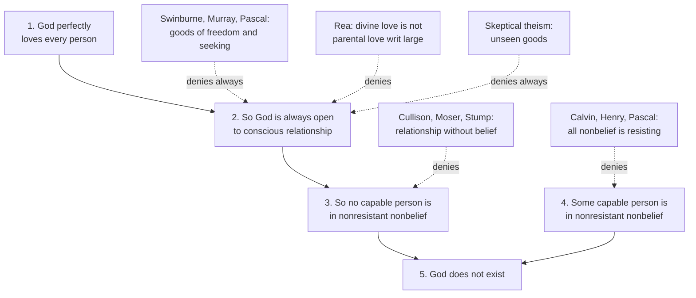

# Philosophy of Religion · Lesson 4.5: Divine hiddenness

> ⏱ ~15 min · Module 4: Evil and hiddenness · Builds on: [4.3 Theodicies](04-03-theodicies.md), [4.4 Skeptical theism](04-04-skeptical-theism.md), [1.1 Which God](01-01-which-god-and-what-an-argument-must-do.md) · Unlocks: [5.1 Evidentialism and the ethics of belief](05-01-evidentialism-and-the-ethics-of-belief.md), [5.2 Reformed epistemology](05-02-reformed-epistemology.md)

## Why this matters

The problem of evil asks why God allows suffering. This argument asks something that sounds gentler and may be harder to answer: why does God allow people to *not believe in God at all*, including people who are looking? Some sincere seekers, after honest inquiry, simply do not find God. J. L. Schellenberg, in *Divine Hiddenness and Human Reason* (1993) and *The Hiddenness Argument* (2015), turned that fact into one of the most discussed atheistic arguments of recent decades. It needs no premise about pain. Its premise is a claim about what love is.

## The idea

Picture a child who wants to know whether her parent exists and would welcome contact. A loving parent, we think, does not stay out of sight indefinitely while the child searches. The parent might hold back for a while, for the child's sake. But a parent who *could* make their presence known, and whom the child is not avoiding, and who still leaves the child in honest doubt for a lifetime, does not seem to be acting from love.

Now replace the parent with a God who, on [perfect-being theology](../reference.md#perfect-being-theology) ([1.1](01-01-which-god-and-what-an-argument-must-do.md)), is *perfectly* loving. The argument is that such a God would always leave the door open to a conscious relationship with each person capable of one. But a relationship like that requires you to believe the other party exists. So nobody who is not resisting God would ever lack belief in God. Yet some people do.

Everything turns on the qualifier. **[Nonresistant nonbelief](../reference.md#nonresistant-nonbelief)** is failing to believe that God exists without having brought this about yourself: no self-deception, no avoidance of the evidence, no wish that God not exist. In 1993 Schellenberg spoke of *reasonable* or *inculpable* nonbelief. By 2015 he had replaced blame with *resistance* as the test, so the question is no longer whether the nonbeliever is at fault, only whether they shut the door.

## Source

Pascal saw the problem three centuries before Schellenberg. In *Pensées* fragment 430 (Trotter's numbering), the Wisdom of God speaks:

> It was not then right that He should appear in a manner manifestly divine, and completely capable of convincing all men; but it was also not right that He should come in so hidden a manner that He could not be known by those who should sincerely seek Him. [...] He so regulates the knowledge of Himself that He has given signs of Himself, visible to those who seek Him, and not to those who seek Him not. There is enough light for those who only desire to see, and enough obscurity for those who have a contrary disposition.

Notice two claims. First, a *calibration* claim: God is neither fully evident nor fully hidden, and on purpose. Second, a *distribution* claim: the light reaches those who seek, and the obscurity those of "a contrary disposition". Read strictly, the second claim says that all nonbelief tracks resistance. That denies the argument's factual premise long before anyone stated the argument. Elsewhere (fragment 555) Pascal sums up the world's appearance as "the presence of a God who hides Himself."

## The argument

Schellenberg's 2015 formulation of the [hiddenness argument](../reference.md#divine-hiddenness-argument), lightly compressed:

1. **Necessarily, if God exists, God perfectly loves every finite person.** *In words:* love belongs to the concept, not as an optional extra.
2. **Necessarily, if God perfectly loves finite persons, God is always open to a meaningful conscious relationship with each one capable of it.** "Open" means God never does anything, or fails to do anything, that would put such a relationship out of reach. Schellenberg's slogan: the light stays on unless we close our eyes.
3. **Necessarily, if God is always so open, no capable person is ever in nonresistant nonbelief.** *In words:* a conscious relationship is one you know you are in, and that requires believing the other party exists. God could always supply evidence enough for that.
4. **At least one capable finite person is, or was, in nonresistant nonbelief.**
5. **So God does not exist.**

The form is valid: modus tollens through a chain of necessary conditionals. Like the [logical problem of evil](04-01-the-logical-problem-of-evil.md), it is deductive, so one false premise sinks it. Premise 1 is close to definitional for the God of [1.1](01-01-which-god-and-what-an-argument-must-do.md). The responses distribute over premises 2 to 4.

**Against premise 2: love may hold back for a time, for a good.** This is the free will theodicy of [4.3](04-03-theodicies.md) carried over to belief. Richard Swinburne (*The Existence of God*, 1979; *Providence and the Problem of Evil*, 1998, ch. 11) argues that evident divinity would shrink the room for morally serious choice. It would also remove our responsibility for helping one another find God. Michael Murray ("Deus Absconditus", in Howard-Snyder and Moser, eds., *Divine Hiddenness: New Essays*, 2002) argues that a clear view of a God who rewards and punishes would *coerce* compliance. The free choice of the good would become something closer to obeying a threat. Pascal adds the [soul-making](../reference.md#soul-making-theodicy) note: seeking, and learning what we are without God, has its own value. Michael Rea (*The Hiddenness of God*, 2018) goes further. Divine love need not look like ideal human parental love, because God's transcendence and personality shape how God relates to creatures.

**Against premise 3: relationship without belief.** Some theists deny that a relationship with God requires the belief *that* God exists. Andrew Cullison ("Two Solutions to the Problem of Divine Hiddenness", 2010), Paul Moser and Eleonore Stump suggest that someone can be responsive to God, say by loving goodness or acting on a call of conscience, while doubting or lacking the proposition. On this view, hope, trust or acceptance can carry the relationship. A related idea in Catholic teaching, that someone invincibly ignorant of God may still stand in a saving relation to God, is taught in [`ecclesiology-and-mariology`](../../ecclesiology-and-mariology/syllabus.md) 5.1; this course cites it, neither asserting nor denying it. Schellenberg replies that a *conscious* relationship is one you recognize yourself to be in. Without belief, what remains may be valuable, but it is not the relationship premise 2 is about.

**Against premise 4: there is no nonresistant nonbelief.** Some in the Reformed tradition, following Calvin's [*sensus divinitatis*](../reference.md#sensus-divinitatis) and Romans 1, hold that everyone has some knowledge of God and that nonbelief always involves suppressing it ([5.2](05-02-reformed-epistemology.md)). Douglas Henry ("Does Reasonable Nonbelief Exist?", *Faith and Philosophy*, 2001) presses the epistemic side: can we ever be sure that someone's inquiry was free of resistance? Pascal's distribution claim belongs here too.

**The [skeptical theist](../reference.md#skeptical-theism)** of [4.4](04-04-skeptical-theism.md) attacks the "always" in premise 2. Perhaps there are goods we cannot see for which love would wait. Daniel Howard-Snyder has run this line.

**An evidential version.** Like the [evidential problem of evil](../reference.md#evidential-problem-of-evil), the argument can be put in odds form ([`philosophical-method` 2.4](../../philosophical-method/lessons/02-04-weighing-evidence-in-odds-form.md)): let $E$ be the observed pattern of nonbelief, $T$ theism and $N$ naturalism.

$$\frac{P(T \mid E)}{P(N \mid E)} = \frac{P(T)}{P(N)} \times \frac{P(E \mid T)}{P(E \mid N)}$$

Stephen Maitzen ("Divine Hiddenness and the Demographics of Theism", 2006) takes $E$ to be the clustering of belief by country and culture, and argues it is far likelier on naturalism. Theists dispute $P(E \mid T)$. Greater-good responses raise it, and skeptical theism declines to estimate it. Kevin Baker-Hytch (2016) argues that our dependence on testimony produces cultural clustering whichever hypothesis is true.

**Is hiddenness a species of the problem of evil?** On one view, yes: nonbelief is a deprivation, an evil to be added to the list, and the theodicies of [4.3](04-03-theodicies.md) apply to it. Schellenberg ("The Hiddenness Problem and the Problem of Evil", *Faith and Philosophy*, 2010) and Peter van Inwagen treat it as independent. Imagine a world without pain or wrongdoing, van Inwagen suggests. No one there could argue from evil, but someone could still argue from nonbelief. Premises 1 to 4 never say nonbelief is *bad*; they say what love would *do*. Theists reply that the two problems still share their best answers: whatever reason God has to allow evil, the suffering itself is often what defeats people's belief.

**Where the argument is weakest.** Critics attack premise 2. They say love is compatible with temporary, purposeful distance, and that "always open" equates God's love with one human ideal of it. The argument's defender thinks the reply rests on an assumption of its own: that the goods of hiddenness are not available *inside* a relationship. A believer still faces hard moral choices, Schellenberg argues. And to withhold the relationship for the sake of goods the relationship itself would supply is not what a perfect lover does. The second battleground is premise 4, which is empirical but hard to settle: was any given seeker free of all resistance?

## The argument map

Alt text: a premise map from perfect love to constant openness to no nonresistant nonbelief, which with the observed nonresistant nonbelief yields the conclusion that God does not exist. Dashed arrows show greater-good, Rea's and skeptical theist responses denying premise 2, relationship without belief denying premise 3, and the Reformed and Pascalian response denying premise 4.

## Worked examples

**Example 1 (clean case: Ines).** Invented case. Ines grew up in a secular family and was not hostile to religion. At thirty she spent two years reading the arguments of Modules 2 and 3, attending services and praying, "if you are there, let me know." She ends unconvinced and sorry about it. Run the responses.

- *Premise-4 denial:* the theist must locate resistance in Ines, perhaps a suppressed reluctance she cannot see. That is possible, but nothing in the case supports it, and the response must say something unflattering and unverifiable about every such case.
- *Greater goods:* the theist says God waits for Ines's sake, so that her eventual response is free and not coerced. The critic asks what coercion threatens a woman who is *asking* to be met.
- *Relationship without belief:* if Ines's love of goodness and her honest seeking are already a response to God, she is not outside a relationship. The critic says that if she cannot recognize it, the relationship is not conscious, and premise 3 survives.

**Example 2 (hard case: before anyone believed).** Jason Marsh ("Darwin and the Problem of Natural Nonbelief", 2013) points to early humans. Many of them, plausibly, had no concept of a single God to believe or resist. That nonbelief strains two responses at once. Resistance needs a concept to resist, so premise-4 denial has nothing to work on. And freedom-based goods need a person who could have chosen differently. The theist's best moves change. Perhaps early humans were not yet *capable* persons in premise 2's sense. Or a God who works across the whole of a life, and beyond it, may not need belief at every moment. Both turn on whether "always open" means open *at every time*, which is exactly where Example 1 left the dispute.

## Watch out

- **You might think the argument says God should give everyone overwhelming proof, but** it asks only for evidence enough for belief, offered to those not resisting. "Why no writing in the sky?" is a different and weaker complaint.
- **You might think "nonresistant" means "has tried hard," but** effort is not the test. A person who never thought about God, through no avoidance of their own, counts too. That is why Example 2's early humans matter.
- **You might think any reply that works for suffering works here, but** greater-good replies must now show that a good requires withholding the *relationship itself*, not merely allowing pain within it.

## One-liner

> Schellenberg argues that a perfectly loving God would always keep the door to relationship open, so nobody would fail to believe without shutting it; each theist reply denies one step: love's constant openness, belief as a condition of relationship, or the existence of nonbelief that is not resistance.

## Problems

**P1 (🟢) *(Exegetical (a) · Evaluative (b))*** Pascal, *Pensées* fragment 585 (Trotter):

> If there were no obscurity, man would not be sensible of his corruption; if there were no light, man would not hope for a remedy. Thus, it is not only fair, but advantageous to us, that God be partly hidden and partly revealed; since it is equally dangerous to man to know God without knowing his own wretchedness, and to know his own wretchedness without knowing God.

(a) Which premise of Schellenberg's argument does this fragment deny, and which words decide it? Contrast it with the distribution claim in fragment 430 (the Source). (b) Give Schellenberg's best reply in two sentences. 120 words or fewer in total.

**P2 (🟡) *(Formal (a)–(b) · Evaluative (c))*** An invented analyst, Teodor, sets his prior odds of theism ($T$) to naturalism ($N$) at 2:1. Let $E$ be "some capable persons have been in nonresistant nonbelief". He sets $P(E \mid N) = 0.9$ and $P(E \mid T) = 0.3$. (a) Compute the likelihood ratio, the posterior odds and $P(T \mid E)$, assuming $T$ and $N$ exhaust the options. (b) Teodor reads Murray's coercion argument and raises $P(E \mid T)$ to $0.6$. Recompute, and say what value of $P(E \mid T)$ would make $E$ no evidence either way. (c) A Reformed critic says Teodor's whole calculation goes wrong earlier. Which part of the odds-form update does the critic attack, and how does that differ from what Murray's argument changed? Two sentences.

**P3 (🔴, optional) *(Evaluative.)*** Steelman the relationship-without-belief response to premise 3, then give Schellenberg's strongest reply, then say in one sentence what the dispute between them finally turns on. Any verdict, or none. 150 words or fewer.

Solutions

**P1** *(Exegetical (a) · Evaluative (b))*

**Must hit, strict (a):**

- Premise 2 (that a loving God is *always* open to relationship). The fragment gives a reason why partial hiddenness is good *for us*. That makes it a greater-good claim that God's withholding full light serves the person.
- The deciding words: "advantageous to us", and the reason "equally dangerous to man to know God without knowing his own wretchedness".
- Contrast: fragment 430's claim that light reaches "those who seek" and obscurity those of "a contrary disposition" bears on premise 4 (all nonbelief tracks resistance). Fragment 585 makes no claim about who receives the light.

**Must hit, any verdict (b):**

- The reply must engage the specific good: knowing one's wretchedness. Either it can be had *within* relationship with God, or withholding the relationship to secure it is not what perfect love does.

**Wrong turns:** reading 585 as denying premise 4. It says nothing about the nonbeliever's disposition. Also: treating "partly revealed" as conceding premise 2, when "partly" is exactly what denies *always open*.

**Model answer (a):** It denies premise 2. Hiddenness is "advantageous to us" because full knowledge of God without knowledge of our "wretchedness" is dangerous. So love might withhold full light for the person's good. Fragment 430 instead claims that light reaches every seeker, which denies premise 4.

**Model answer (b), one of several:** A believer can learn their own wretchedness, perhaps best of all, inside a relationship with a holy God. So the good does not require nonbelief. A love that withholds itself to teach a lesson the relationship itself would teach is not perfect love.

---

**P2** *(Formal (a)–(b) · Evaluative (c))*

(a) Likelihood ratio $= 0.3 / 0.9 = 1/3$.

$$\text{posterior odds} = \tfrac{2}{1} \times \tfrac{1}{3} = \tfrac{2}{3}$$

So $P(T \mid E) = \frac{2/3}{1 + 2/3} = \frac{2}{5} = 0.40$, down from a prior of $2/3 \approx 0.67$.

(b) Likelihood ratio $= 0.6 / 0.9 = 2/3$.

$$\text{posterior odds} = \tfrac{2}{1} \times \tfrac{2}{3} = \tfrac{4}{3}$$

So $P(T \mid E) = \frac{4/3}{7/3} = \frac{4}{7} \approx 0.57$. $E$ is neutral when the likelihood ratio is 1, that is when $P(E \mid T) = P(E \mid N) = 0.9$.

**Must hit, any verdict (c):**

- The Reformed critic denies that $E$ is *true*, or that Teodor is entitled to treat it as known. They do not dispute a likelihood. Nonbelief always involves resistance, so there is no nonresistant nonbelief to update on.
- Murray instead accepts $E$ and raises $P(E \mid T)$, a likelihood term.

**Wrong turns:** saying the critic lowers the prior. Their quarrel is with the evidence statement, not with $P(T)$. Also: computing $P(T \mid E)$ as the posterior odds themselves (0.67 and 1.33 are odds, not probabilities).

**Model answer (c):** The Reformed critic rejects the input: there is no nonresistant nonbelief, so $E$ should not be conditionalized on at all. Murray grants $E$ and argues it is less surprising on theism, which changes the likelihood ratio, not the evidence.

---

**P3** *(Evaluative)*

**Must hit, any verdict:**

- Steelman: state the response at strength. A relationship with a person can be partly constituted by responding to them without propositional belief, through trust, hope, acceptance or love of the goods the person embodies. Cite at least one defender (Cullison, Moser, Stump).
- Reply: Schellenberg's point that a *conscious, reciprocal* relationship is one you recognize yourself to be in, which needs the belief.
- Crux: name a single question, e.g. whether the relationship that perfect love seeks must be one the creature can *recognize*, or whether a responsive but unrecognized relationship satisfies premise 2's openness.

**Wrong turns:** making the steelman a mere assertion that "God accepts nonbelievers" without saying what the relationship consists in. Treating the crux as "whether God exists".

**Model answer, one of several:** Steelman: we relate to persons in more ways than believing propositions about them. Someone who answers the call of conscience, loves goodness and hopes there is a God may be responding to God without the belief. If so, God can be open to her and she can be in a real, if unrecognized, relationship. Reply: premise 2 concerns *conscious* relationship, one you know you are in and can return. Unrecognized responsiveness is valuable, but a perfect lover would not settle for a relationship the beloved cannot know she has. Crux: whether the good of relationship with God depends on its being recognized by the creature, or can be fully present before recognition.

## Flashback

**From Lesson [4.3](04-03-theodicies.md) (Theodicies):** *(Exegetical.)* Apply to a new case. An invented landlord, Corin, knowingly disconnects his building's fire alarms to save on maintenance. A fire breaks out at night. His tenant Hester, who lives alone, survives with severe burns and years of chronic pain and isolation, and says her life has been ruined. (a) Which theodicy from 4.3 bears most directly on this case, which premise of the common skeleton does the critic press against it here, and what does its defender answer? Two sentences. (b) Suppose a defender establishes premises 1–3 of the skeleton for this case at the level of the world as a whole. Why does Marilyn McCord Adams say that is still not enough, what does she offer instead, and what does she concede? Three sentences or fewer.

Solution

**Must hit, strict (a):**

- The free will theodicy: this is moral evil, flowing from Corin's free choice, and the good named is significant libertarian freedom, freedom real enough that people can do serious harm.
- The critic presses the necessity premise (premise 1): God could have stopped this one fire, as any good bystander would, without giving up freedom. The defender answers that systematic intervention whenever a choice would cause serious harm would make freedom unreal.

**Must hit, strict (b):**

- Adams demands individual defeat (premise 2′): the good must defeat the evil within Hester's own life, so that her life is a great good to her on the whole. Global defeat, where the world is better for containing free choices like Corin's, does not show love for Hester.
- The case is horrendous in her sense: suffering it gives prima facie reason to doubt that Hester's life could be a great good to her on the whole.
- Her offer: intimacy with God is an incommensurable good that can make even the horror part of a life that is a great good on the whole.
- Her concession: she does not claim to know God's reason for this particular horror, only that its defeat is guaranteed, and she draws on specifically Christian resources.

**Wrong turns:** naming the natural-law theodicy as primary because fire obeys regular laws. The regularity is in the background, but what needs justifying is Corin's choice and God's not preventing it. Also: in (b), saying Adams rejects the outweighing premise. She can grant that the good outweighs the evil globally, and denies that this is enough. In 4.3's terms her weak point is premise 3.

**Model answer:** (a) This is moral evil, so the free will theodicy applies: the good is the significant freedom Corin misused. The critic presses the necessity premise, since a good bystander would have stopped this one fire at no cost to freedom; the defender replies that systematic intervention would make freedom unreal. (b) For Adams, global defeat is not enough: perfect love requires that the evil be defeated within Hester's own life, so that it is a great good to her on the whole, and that is just what a horrendous evil gives reason to doubt. She offers intimacy with God as an incommensurable good that can make even this horror part of such a life. She concedes that she cannot say why God permitted this particular horror, only that its defeat is guaranteed, and that the account relies on specifically Christian resources.

## Connections

- **Backward:** the structure of a deductive argument from an observed fact to atheism comes from [4.1](04-01-the-logical-problem-of-evil.md), and the odds-form version from [4.2](04-02-the-evidential-problem-of-evil.md). The freedom and soul-making replies are the theodicies of [4.3](04-03-theodicies.md) transposed to belief. The unseen-goods reply is [4.4](04-04-skeptical-theism.md)'s. Premise 1 rests on the perfect-being concept of [1.1](01-01-which-god-and-what-an-argument-must-do.md).
- **Forward:** the premise-4 denial needs the Reformed epistemology of [5.2](05-02-reformed-epistemology.md), the *sensus divinitatis* and what defeats it. Maitzen's demographic version returns as the problem of religious diversity in [5.5](05-05-religious-diversity.md). Kierkegaard, whom the hiddenness literature cites for the value of a faith that must strive, is read in [5.4](05-04-fideism.md).
- **Sideways:** the odds-form step reuses the priors machinery of [`epistemology` 5.4](../../epistemology/lessons/05-04-the-problem-of-priors.md). Catholic teaching on invincible ignorance is [`ecclesiology-and-mariology`](../../ecclesiology-and-mariology/syllabus.md)'s; [`creation-grace-last-things`](../../creation-grace-last-things/syllabus.md) cites this lesson for hiddenness and argues no theodicy of its own.
