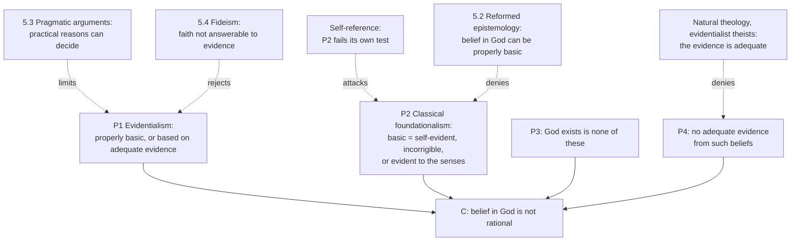

# Philosophy of Religion · Lesson 5.1: Evidentialism and the ethics of belief

> ⏱ ~15 min · Module 5: Faith, evidence, and the many religions · Builds on: [1.1 Which God, and what an argument must do](01-01-which-god-and-what-an-argument-must-do.md), [epistemology 2.2 Foundationalism](../../epistemology/lessons/02-02-foundationalism.md) · Unlocks: [5.2 Reformed epistemology](05-02-reformed-epistemology.md), [5.3 Pragmatic arguments](05-03-pragmatic-arguments-the-wager-and-the-will-to-believe.md)

## Why this matters

Modules 2–4 asked whether the arguments make theism true or probable. Module 5 asks a prior question: does belief in God *need* arguments at all? One answer, that it does, and that believing without them is a failure, has a slogan behind it older than any argument in this course. Asked what he would say if he met God after death, Bertrand Russell is reported to have said that God had not given him enough evidence (Leo Rosten's memoir, 1974; the punchy wording usually quoted is not Rosten's). This lesson states that demand exactly, finds the theory of evidence behind it, and shows where the replies of 5.2–5.4 will attack.

## The idea

**[Evidentialism](../reference.md#evidentialism)** is the view that a belief is justified only if it fits the believer's evidence, in proportion to the evidence. Hume gives the rule its classic form in *Enquiry* §10:

> A wise man, therefore, proportions his belief to the evidence.

W. K. Clifford's "The Ethics of Belief" (*Contemporary Review*, 1877; reprinted in his *Lectures and Essays*, 1879) turned the rule into a *moral* duty. His opening case is a shipowner who has doubts about an old ship, talks himself out of them, sends the emigrants to sea, and collects the insurance when she sinks. Clifford's verdict: the owner is guilty of their deaths, and would be just as guilty had she come home safe, because the wrong lies in *how* he came to believe, by stifling doubt instead of investigating, not in whether the belief was true. From cases like this Clifford generalizes to **[Clifford's principle](../reference.md#cliffords-principle)**: believing anything on insufficient evidence is wrong for everyone, everywhere, always (quoted in [philosophical-method 4.4](../../philosophical-method/lessons/04-04-arguing-within-a-tradition-the-disputed-question.md), P3). He adds a duty of inquiry:

> It is never lawful to stifle a doubt; for either it can be honestly answered by means of the inquiry already made, or else it proves that the inquiry was not complete.

Why is belief a *moral* matter? Clifford gives two reasons. Beliefs guide action, and a belief stored up now can be acted on later, so nobody's belief concerns only themselves. And every careless belief trains a credulous character, in the believer and in the society that trusts them. He is unmoved by the busy person who has no time to study the question: then, he says, they have no time to believe it either.

Two versions need keeping apart. **Clifford's evidentialism** is a claim about *duty and blame*: you wrong others by believing badly. **Contemporary evidentialism**, the view Earl Conee and Richard Feldman defend ("Evidentialism", 1985; *Evidentialism*, 2004), is a claim about *epistemic justification*: a belief is justified for you at a time just when it fits the evidence you have then. It says nothing about blame or about how much inquiry you owe, and it counts experiences, not just beliefs, as evidence. Most of the work in this lesson is seeing which version a given objection needs.

## The argument

Clifford's principle is neutral: it condemns careless atheists as readily as careless believers. It becomes an argument against theistic belief only when joined to a claim about the evidence. That pairing is what Alvin Plantinga named the **[evidentialist objection](../reference.md#evidentialist-objection)** ("Reason and Belief in God", in *Faith and Rationality*, 1983). Michael Scriven (*Primary Philosophy*, 1966) and Antony Flew ("The Presumption of Atheism", 1972; the burden-of-proof side is [philosophical-method 4.2](../../philosophical-method/lessons/04-02-steelmanning-and-the-burden-of-proof.md)) are representative. Plantinga argued that the objection draws its force from **[classical foundationalism](../reference.md#classical-foundationalism)** ([epistemology 2.2](../../epistemology/lessons/02-02-foundationalism.md)). Stated with that theory made explicit:

1. **P1 (evidentialism).** S's belief that p is rational only if p is properly basic for S, or S believes p on the basis of adequate evidence from S's properly basic beliefs.
2. **P2 (classical foundationalism).** p is properly basic for S only if p is self-evident to S, incorrigible for S, or evident to S's senses.
3. **P3.** "God exists" is not self-evident, incorrigible or evident to the senses for S.
4. **P4.** There is no adequate evidence for "God exists" from beliefs of those three kinds.
5. **∴ C.** S's belief in God is not rational.

*In words:* if belief in God is not on the ground floor, it must be held up by argument; the ground floor is very narrow, and the arguments do not hold it up.

The argument is valid, and each premise has a different opponent. **Evidentialist theists** accept P1–P3 and deny P4. Richard Swinburne (*The Existence of God*, 2nd ed., 2004) argues that the total evidence makes theism more probable than not, the [cumulative case](../reference.md#cumulative-case) of 1.1. The Catholic claim that the one true God can be known with certainty by natural reason from created things (*Dei Filius*, canon 1; see [fundamental-theology 1.2](../../fundamental-theology/lessons/01-02-natural-knowledge-of-god.md)) is also a denial of P4, made about a *capacity* of reason, not about any person's argument. The fit is only partial. The same council holds that faith itself assents on God's authority, with evidence bearing on the *credibility* of revelation ([fundamental-theology 2.2](../../fundamental-theology/lessons/02-02-credibility-and-the-preambles-of-faith.md)). This course cites that position and neither asserts nor denies it. **Evidentialist atheists**, such as J. L. Mackie (*The Miracle of Theism*, 1982), defend P4. That was the debate of Modules 2–4.

**Reformed epistemologists** (5.2) deny P2, so that belief in God may be a **[properly basic belief](../reference.md#properly-basic-belief)**. **Pragmatists** (5.3) deny that P1 governs every belief: for some options, practical reasons may decide. **Fideists** (5.4) deny that faith answers to P1 at all.

**The self-referential problem.** Plantinga's sharpest move is aimed at P2. Classical foundationalism is itself a proposition the evidentialist believes. Is it self-evident, incorrigible or evident to the senses? No: many careful philosophers reject it, it is about justification rather than one's own mental states, and nobody sees it. Is there adequate evidence for it from propositions that are? Nobody has produced any. So by its own standard it is not rationally believed. *In words:* the criterion fails itself. Plantinga pressed the same point against evidentialism generally: what, he asked, is the evidence for it? [Epistemology 2.2](../../epistemology/lessons/02-02-foundationalism.md) noted the problem; its use here is to show the objection's best-known form standing on a premise it cannot itself support.

**Where the argument is weakest.** The critic attacks P2, by self-reference and by the older complaint that it cannot ground ordinary beliefs about other minds, the past or the external world. The evidentialist's reply is that the objection never needed P2. Replace it with modest foundationalism, or with Conee–Feldman fit, where experiences and seemings count as evidence. Then P1 survives, and the objection becomes: *on your total evidence, experiences included, belief in God does not fit.* That relocates the dispute to P4, and to whether religious experience is evidence ([3.4](03-04-the-argument-from-religious-experience.md)). The reformed epistemologist replies that the relocated objection has given up the claim that theistic belief needs *argument*, which is all 5.2 asserts.

## The argument map

Solid arrows build the objection; dashed arrows are the replies, each aimed at one premise. The weak point is visible here: drop P2 and the self-reference attack has no target, while the replies aimed at P1 and P4 are untouched.

## Worked examples

**Example 1 (clean case: two avoiders).** Petra was raised a believer and reads nothing that might unsettle her faith. Her colleague Anders was raised an atheist and likewise avoids every serious book of theistic argument. Run Clifford.

- *Clifford's principle:* both believe on evidence they have taken care not to test, and both stifle doubt. Clifford condemns both equally; his duty of inquiry never mentions the content of the belief.
- *The evidentialist objection:* condemns only Petra, and only by adding P4, a claim about the state of the evidence that Anders has not examined either.

So the evidentialist principle is not by itself an atheist argument. Its anti-theistic force comes entirely from P4 (and, in Plantinga's reconstruction, P2).

**Example 2 (hard case: Nadia's experience).** Nadia, on a night walk after her father's death, has a vivid experience *as of* being held in the presence of a loving God. She has never studied any theistic argument and believes God exists.

- *With P2:* the belief is neither self-evident nor incorrigible nor evident to the senses, and she has no argument. Verdict: irrational.
- *With Conee–Feldman fit:* her experience is part of her evidence. If, as phenomenal conservatism says ([epistemology 2.2](../../epistemology/lessons/02-02-foundationalism.md)), a seeming gives some justification absent defeaters, the belief may fit her evidence. Then the verdict turns on defeaters: grief as an alternative explanation, the existence of conflicting experiences in other traditions ([5.5](05-05-religious-diversity.md)).

The case strains the objection because the two theories of evidence give opposite verdicts. And on the modest theory, evidentialism and reformed epistemology start to give the *same* verdict for different reasons. Whether anything still separates them is a question 5.2 must answer.

## Watch out

- **You might think evidentialism is an atheist doctrine, but actually** it is a norm of belief that many theists accept. Locke held it, Swinburne holds it, and the natural theology of Module 2 is an attempt to meet it. What is contested is P4.
- **You might think the self-referential problem refutes evidentialism, but actually** it refutes *classical foundationalism* as a criterion of proper basicality. Conee–Feldman evidentialism does not claim that only self-evident, incorrigible or sensory beliefs are basic, so the argument does not touch it directly.
- **You might think Clifford's case is about believing something false, but actually** his verdict holds even if the ship comes home safe. His target is how the belief was formed, not whether it was true. That is why the principle applies to true religious beliefs, and to true atheist ones.

## One-liner

> Evidentialism says belief must fit the evidence; it becomes an objection to theism only by adding that the evidence is lacking, and its classic version adds a theory of evidence that fails its own test.

## Problems

**P1 (🟢) *(Exegetical (a) · Evaluative (b))*** Odile, a geologist, believes a remote valley contains an untouched fossil bed because her late mentor, a careful field scientist, told her so. She has never checked. Last month a survey disputing the claim was published; she has declined to read it, saying she does not want her confidence shaken. (a) Give the verdict on her present belief of (i) Clifford's ethics of belief and (ii) Conee–Feldman evidentialism, and say what her refusal to read the survey does under each. Two sentences each. (b) Which verdict better captures what is wrong, if anything, with Odile? Any verdict; three sentences or fewer.

**P2 (🟡) *(Exegetical (a) · Evaluative (b))*** Close reading. From the second part of Clifford's essay, "The Weight of Authority" (1877):

> We are led, then, to these judgments following. The goodness and greatness of a man do not justify us in accepting a belief upon the warrant of his authority, unless there are reasonable grounds for supposing that he knew the truth of what he was saying. And there can be no grounds for supposing that a man knows that which we, without ceasing to be men, could not be supposed to verify.

(a) State the two judgments in your own words, and name the words that make the second far stronger than the first. Two or three sentences. (b) Steelman: using these judgments, state the evidentialist objection to a belief in God that rests on the testimony of a religious tradition, in the form its best defender would sign. 100 words or fewer. Then name, in one sentence, the premise a theist would most likely deny.

**P3 (🔴, optional) *(Exegetical (a) · Evaluative (b))*** An invented exchange from a campus debate:

> **Evidentialist:** "Belief in God is irrational. Without argument you may believe only what is self-evident, incorrigible or evident to the senses, and no argument from such things gets you to God."
> **Respondent:** "Your rule is none of those three things, and you have no argument for it from things that are. By your own rule, you shouldn't believe it."
> **Evidentialist:** "Fine, I drop the list. My claim is only that a belief is justified when it fits your total evidence, experiences included, and belief in God doesn't fit anyone's total evidence."

(a) Which premise of the lesson's argument did the respondent refute, and which premise of the lesson's argument has the evidentialist now abandoned? Is the new position open to the same self-referential charge? Three sentences or fewer. (b) Find the crux: name the single claim on which the two now disagree, and one consideration that would move each side. 120 words or fewer.

Solutions

**P1** *(Exegetical (a) · Evaluative (b))*

(a)

**Must hit, strict (a):**

- (i) Clifford: wrong. Her refusal is exactly what he condemns, keeping out evidence and stifling doubt to protect a conviction. On the Weight of Authority test, her mentor's honesty is not enough; she also needs grounds that he *knew*. A careful field scientist reporting a verifiable fact plausibly passes that test, so the authority is not the main fault. The refusal is.
- (ii) Conee–Feldman: justification is fit with the evidence she *has* now. Expert testimony from a reliable source can be good evidence, so the belief may well be justified now. The refusal does not change her present evidence, so it does not by itself make the belief unjustified. It may make her blameworthy or a poor inquirer, which is a separate question their view sets aside.

**Must hit, any verdict (b):**

- Separate what is wrong with the *belief* from what is wrong with the *believer's conduct*.
- Say whether one of the two theories mislocates the fault, and why.

**Wrong turns:** saying Conee–Feldman condemns the belief because better evidence exists somewhere (it is about evidence she has); saying Clifford condemns her for believing on testimony as such (he explicitly allows testimony that meets his conditions, like the chemist's).

**Model answer (b), one of several:** Conee–Feldman get the belief right: on her current evidence, a careful expert's word, it is reasonable. But they are silent on what is plainly wrong, her deliberate avoidance of evidence, which Clifford's duty of inquiry names exactly. So the best account uses both: a justified belief, held by someone who is failing an inquiry duty.

---

**P2** *(Exegetical (a) · Evaluative (b))*

(a)

**Must hit, strict (a):**

- First judgment: a witness's moral goodness and greatness are not enough. You also need reasonable grounds that the witness *knew* what they asserted. (Honesty is one condition, knowledge another.)
- Second judgment: there can be *no* such grounds where the claim is something humans, "without ceasing to be men", could not be supposed to verify.
- The strengthening words: "there can be no grounds" together with "without ceasing to be men, could not be supposed to verify". The first judgment adds a condition to each case; the second rules out a whole subject matter in advance.

**Must hit, any verdict (b):**

- The steelman must keep the honesty/knowledge distinction (a sincere, admirable founder is granted) and use the verifiability restriction, not merely "testimony is unreliable."
- It should reach the conclusion that testimony alone cannot make belief in God adequately evidenced, while allowing that other evidence might.
- The named premise is a real one: most naturally the verifiability restriction itself (the theist argues that witnesses could have grounds, such as public signs or miracles, for claims not directly checkable), or the claim that the tradition's testimony is the belief's only support.

**Wrong turns:** having the steelman call religious founders liars or fools (Clifford grants their goodness); treating the passage as rejecting all testimony (his chemist example accepts testimony that could in principle be checked).

**Model answer (b), one of several:** Testimony transmits belief only as well as its source knew. A witness's sincerity and moral greatness show that they reported what they believed, not that they had any means of knowing it. Claims about God, an afterlife or a divine commission are not verifiable by any human procedure, so no witness could have had the grounds that would make their word evidence. A tradition multiplies witnesses but not means of knowing. So testimony alone cannot give adequate evidence for belief in God, though arguments or experience might. *Denied premise:* that nothing about God could be known or credibly signalled to a witness, the theist pointing to public signs that bear on a messenger's credibility.

---

**P3** *(Exegetical (a) · Evaluative (b))*

(a)

**Must hit, strict (a):**

- The respondent refuted P2 (classical foundationalism), by self-reference: P2 is neither self-evident, incorrigible nor evident to the senses, and is not supported by what is.
- The evidentialist abandoned P2 (and with it P3's role), keeping a version of P1 and restating P4 as a claim about total evidence.
- The new position is not open to the same charge in the same way: total-evidence fit does not restrict evidence to a narrow class, so one can claim support for it from intuitions about cases (Clifford's own method). Credit for noting that one may still ask what evidence supports it, but the knockdown version no longer applies.

**Must hit, any verdict (b):**

- The crux: whether belief in God fits the total evidence, which now turns mainly on whether theistic experiences or seemings count as evidence and are undefeated.
- One mover for each side, e.g. for the evidentialist: an account of religious experience as reliable perception that survives cross-checking ([3.4](03-04-the-argument-from-religious-experience.md)); for the respondent: a debunking explanation of such experiences, or the fact of conflicting experiences across traditions ([5.5](05-05-religious-diversity.md)).

**Wrong turns:** saying the respondent refuted evidentialism (only P2); naming "whether God exists" as the crux, when the dispute is over what the evidence supports.

**Model answer (b), one of several:** They now agree that belief must fit total evidence and disagree about whether belief in God does. Since the evidentialist concedes experiences count, the crux is whether experiences as of God's presence are undefeated evidence. A Swinburne-style case that such experiences deserve the credit we give perception, with no good debunking story, should move the evidentialist. A well-supported naturalistic explanation of those experiences, or evidence that they conflict systematically across religions, should move the respondent.

## Flashback

**From Lesson [4.4](04-04-skeptical-theism.md) (Skeptical theism):** *(Exegetical.)* An invented case: a heron tangled in discarded fishing line starves slowly on a mudflat over a week. A critic says she can see no good that would justify God in permitting it, so probably there is none. Four invented replies:

> (i) "For all we know, there are kinds of value as foreign to us as colour is to someone born blind."
>
> (ii) "Even among the goods we can name, we cannot be confident we know which of them require that suffering like this be permitted."
>
> (iii) "The heron's death kept a parasite from spreading through the whole colony, which would have been far worse."
>
> (iv) "Unless we have reason to think a divine reason, if there were one, would show up to creatures like us, our not finding one tells us nothing."

(a) Classify each as one of Bergmann's skeptical theses (say which: ST1, ST2 or ST3), Wykstra's CORNEA, or not skeptical theism at all. (b) For each, say whether it *undercuts* the critic's inference or *rebuts* her conclusion. (c) Which of the four could an atheist accept without inconsistency? One sentence per part.

Solution

**Must hit, strict (a):**

- (i) ST1: the goods we know of may not be representative of the goods there are.
- (ii) ST3: the entailment relations we know of, between goods and the permission of evils, may not be representative of those there are.
- (iii) Not skeptical theism: it names a specific good, which is the theodicist's move ([4.3](04-03-theodicies.md)).
- (iv) CORNEA: "it appears there is no reason" supports "there is no reason" only if a reason, were there one, would likely appear to us.

**Must hit, strict (b):**

- (i), (ii), (iv) undercut: they remove the support the noseeum inference gives the critic's claim without showing that claim false.
- (iii) rebuts: if true, it shows this suffering is not gratuitous.

**Must hit, strict (c):**

- (i), (ii) and (iv): the theses and CORNEA are claims about the representativeness of our sample and about our epistemic access, not about whether God exists. An atheist could also accept (iii) as a fact about parasites; what would make it a reply is the further claim that it is God's reason.

**Wrong turns:** calling (iii) skeptical theism because it appeals to a good the critic overlooked (skeptical theism declines to name goods); calling (ii) ST1 because it mentions goods (its subject is the *link* between goods and permitted evils); saying the undercutting replies show the heron's suffering served a purpose.

**Model answer:** (a) ST1, ST3, a theodicy-style named good, CORNEA. (b) (i), (ii) and (iv) undercut the step from "I see no good" to "there is none"; (iii) rebuts the claim that this suffering is pointless. (c) An atheist can accept (i), (ii) and (iv), since none says anything about God's existence, and can grant (iii)'s fact about parasites while denying it is anyone's reason.

## Connections

- **Backward:** [epistemology 2.2](../../epistemology/lessons/02-02-foundationalism.md) gives classical and modest foundationalism and flagged the self-referential problem for this lesson; testimony in general is [epistemology 4.4](../../epistemology/lessons/04-04-testimony.md). The presumption-of-atheism dispute is [philosophical-method 4.2](../../philosophical-method/lessons/04-02-steelmanning-and-the-burden-of-proof.md), and [1.1](01-01-which-god-and-what-an-argument-must-do.md) set the success standards that P4 measures the arguments of Modules 2–4 against.
- **Forward:** [5.2](05-02-reformed-epistemology.md) denies P2 and builds the case that belief in God can be properly basic. [5.3](05-03-pragmatic-arguments-the-wager-and-the-will-to-believe.md) reads William James's reply to Clifford and asks whether belief is voluntary enough for Clifford's *duty* to make sense. [5.4](05-04-fideism.md) rejects the evidential demand for faith outright, and [5.5](05-05-religious-diversity.md) asks what disagreement does to every position on the map.
- **Sideways:** Clifford's split between a witness's honesty and a witness's knowledge is a close cousin of the Catholic distinction between evidence about the **messenger** and evidence about the **message** in [fundamental-theology 2.2](../../fundamental-theology/lessons/02-02-credibility-and-the-preambles-of-faith.md); the two disagree on whether a messenger's knowledge of the unverifiable can be credentialed. Clifford's principle as an objection to arguing from authority is [philosophical-method 4.4](../../philosophical-method/lessons/04-04-arguing-within-a-tradition-the-disputed-question.md) P3.
