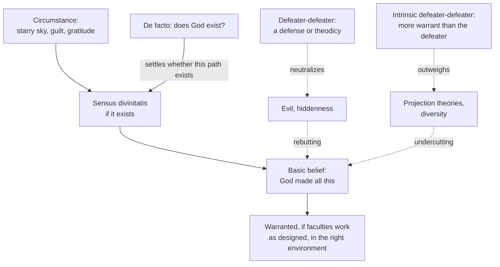

# Philosophy of Religion · Lesson 5.2: Reformed epistemology

> ⏱ ~15 min · Module 5: Faith, evidence, and the many religions · Builds on: [5.1 Evidentialism and the ethics of belief](05-01-evidentialism-and-the-ethics-of-belief.md), [`epistemology` 2.2](../../epistemology/lessons/02-02-foundationalism.md), [`epistemology` 2.4](../../epistemology/lessons/02-04-reliabilism.md) · Unlocks: [5.3 Pragmatic arguments](05-03-pragmatic-arguments-the-wager-and-the-will-to-believe.md), [5.4 Fideism](05-04-fideism.md), [5.5 Religious diversity](05-05-religious-diversity.md)

## Why this matters

The [evidentialist objection](../reference.md#evidentialist-objection) of [5.1](05-01-evidentialism-and-the-ethics-of-belief.md) says belief in God is rational only if it is supported by good arguments. Modules 2–3 asked whether any argument is good enough. Reformed epistemology asks a prior question: why think belief in God needs an argument at all? You believe that you had coffee this morning and that your friend is in pain without arguing for either. Alvin Plantinga, Nicholas Wolterstorff and William Alston argued that belief in God can be held the same way: rationally, without inference, and open to defeat. Whether it actually is held that way is not something the epistemology alone can settle, and that turns out to be the most interesting result of all.

## The idea

Every foundationalist ([`epistemology` 2.2](../../epistemology/lessons/02-02-foundationalism.md)) has a stock of **basic** beliefs: held without being inferred from other beliefs. A belief is **[properly basic](../reference.md#properly-basic-belief)** (Plantinga's term) when it is basic *and* rational to hold that way. Classical foundationalism admitted only the self-evident, the incorrigible and the evident to the senses. On that list, belief in God must be argued for. But 5.1 showed that the classical criterion fails its own test, and that most of what we believe (memories, other minds, a world that existed five minutes ago) is not on the list either.

So Plantinga's move is to widen the base, and to ask why God should be kept out. Basic does not mean **groundless**. A memory belief is not inferred from your experience of seeming to remember, but it is *occasioned* by that experience, and would be irrational without it. Plantinga says belief in God is grounded the same way. Gazing at a vast night sky, someone finds herself believing *God made all this*. After wronging a friend, she believes *God disapproves of what I did*. These beliefs are not conclusions from the sky or the guilt. They arise in those circumstances, as *there is a tree* arises when she sees one.

The name comes from the Reformed (Calvinist) tradition. John Calvin held (*Institutes* I.iii, paraphrased) that every human being has a natural awareness of God, a **[sensus divinitatis](../reference.md#sensus-divinitatis)**, a sense of the divine that experience triggers and sin can dull.

## The argument

Three arguments, from three stages of Plantinga's work.

**1. The [parity argument](../reference.md#parity-argument)** (*God and Other Minds*, 1967). Plantinga argued that the analogical argument for other minds and the design argument have the same structure and the same weak point. Neither is strong enough to *prove* its conclusion. Yet nobody thinks belief in other minds is irrational. So, he concluded, if belief in other minds is rational, belief in God is too. The 1980s work broadened the parity class to memory and perception.

**2. Proper basicality** ("Is Belief in God Properly Basic?", *Noûs*, 1981; "Reason and Belief in God", in *Faith and Rationality*, 1983, edited with Wolterstorff).

- **P1.** A belief may be rational without inferential support, provided it is formed in appropriate circumstances and there are no undefeated defeaters. (modest foundationalism)
- **P2.** Beliefs like *God made all this* or *God disapproves of what I did*, formed in the circumstances above, are of this kind.
- **P3.** These beliefs self-evidently entail that God exists.
- **∴ C.** Belief in God can be rational without arguments.

*In words:* the believer is in the position of someone who remembers breakfast, not someone guessing. P2 carries the weight, and the critic asks what makes it true.

**3. Warrant and proper function** (*Warranted Christian Belief*, 2000). Plantinga's account of **[warrant](../reference.md#warrant-and-proper-function)**, the property that turns true belief into knowledge, is the proper functionalism of [`epistemology` 2.4](../../epistemology/lessons/02-04-reliabilism.md): a belief is warranted if it comes from faculties functioning properly, in the environment they were designed for, according to a design plan aimed at truth. The **Aquinas/Calvin (A/C) model** adds: God created humans with a *sensus divinitatis* that produces belief in God in the right circumstances. *If* the model is true, belief in God formed that way is warranted, and could be knowledge, without any argument. (An "extended" model adds the Holy Spirit's work for specifically Christian belief; that is beyond this course.)

From this follows the claim that defines the position: **[the de jure question depends on the de facto question](../reference.md#de-jure-and-de-facto-objections).** A *de facto* objection says belief in God is false. A *de jure* objection says it is irrational or unwarranted *whether or not* God exists. Plantinga argues there is no viable de jure objection that is independent of the de facto one. If God exists, the A/C model (or something like it) is probably true, so belief in God is probably warranted. If God does not exist, the belief probably has no warrant, since it would come from wishful thinking or a mistake in an otherwise good faculty. So the critic who wants to show that theistic belief is unwarranted must first argue that God does not exist. On this view, the tactic of saying "I won't argue God's nonexistence, only that believers are irrational" has nowhere to stand.

**The [Great Pumpkin objection](../reference.md#great-pumpkin-objection).** Plantinga raised it against himself (1981): if belief in God can be properly basic, why not Linus's belief that the Great Pumpkin returns every Halloween? Doesn't rejecting classical foundationalism let anything in? His reply has two parts. First, the criteria for proper basicality must be reached **bottom up**, from examples. We begin with clear cases of rational basic belief (*I see a tree*) and clear cases of irrational basic belief (the Great Pumpkin), and frame hypotheses that fit them. Second, nothing about a missing criterion makes every belief basic: the Pumpkin belief has no grounding circumstance of the right kind. The objection's sharper form is Michael Martin's (*Atheism: A Philosophical Justification*, 1990), usually called the **son of Great Pumpkin**. It concedes that Plantinga's own belief need not be arbitrary, but says the *method* is too permissive. If each community lists its own paradigm cases, any community, however odd its beliefs, could certify them as properly basic by the same steps. In *Warranted Christian Belief* Plantinga replied that warrant, unlike rationality as he used the word in 1983, depends on truth: a community whose belief is false gets no warrant from following the method, however carefully. The critic answers that this makes the theist's warrant depend on exactly what was in dispute.

**[Defeaters](../reference.md#defeaters)**. Proper basicality is *prima facie*: other beliefs can take it away. A **rebutting** defeater is a reason to think the belief false; an **undercutting** defeater is a reason to distrust its source (John Pollock's distinction). The candidates for theism are evil (Module 4), hiddenness ([4.5](04-05-divine-hiddenness.md)), projection theories that explain belief without God ([3.4](03-04-the-argument-from-religious-experience.md)), and religious diversity ([5.5](05-05-religious-diversity.md)). The believer's options are a **defeater-defeater**: a defense or theodicy that neutralizes the defeater, or, in Plantinga's phrase, an "intrinsic defeater-defeater", where the basic belief has more warrant than the putative defeater does and so beats it directly, as a vivid memory of being somewhere beats someone else's evidence that you were not.

**Where the argument is weakest.** P2, and its warrant-theoretic successor, the conditional "if God exists, the belief is probably warranted". The critic says P2 is exactly what the Great Pumpkin and its son press: the believer's grounding experiences are real, but so are those of every other basic believer. Without an independent check on which faculties are reliable, "properly" basic does no work that "basic" does not. The defender thinks this objection assumes a requirement it cannot meet itself. No one has a non-circular check on memory or perception either ([`epistemology` 2.4](../../epistemology/lessons/02-04-reliabilism.md) on bootstrapping), and demanding one for religious belief alone looks like a double standard, the parity argument again.

## The picture

Alt text: a flow from a triggering circumstance through the sensus divinitatis to a basic belief and warrant, with rebutting and undercutting defeaters, the two kinds of defeater-defeater, and the de facto question deciding whether the faculty exists at all.

## Worked examples

**Example 1 (clean case: running the model).** Invented case. Oriane, a shepherd, has never met an argument for God. Caught in a mountain storm, she believes *God is keeping me safe*, and then *God is to be thanked* when she reaches the hut.

- *Basic?* Yes: she inferred nothing.
- *Grounded?* Yes, in the circumstances, as her belief that the storm is fierce is grounded in what she sees and hears.
- *Warranted?* On the A/C model, if a sensus divinitatis exists and was working properly, yes. If not, the belief came from a mechanism not aimed at truth (fear, comfort-seeking) and lacks warrant even if it happens to be true.
- *Rational in the 1983 sense?* Yes, unless she has a defeater, and nothing in her situation supplies one.

Notice what the model does *not* deliver: a reason for anyone else to believe. Oriane's warrant, if she has it, is not transferable by argument. That is the point of a basic belief, and it is why the model is not a proof of God's existence. It is an answer to the de jure question only.

**Example 2 (hard case: a projection theory as defeater).** Oriane later reads a Feuerbach-style account: belief in God is the projection of human ideals and human needs, produced by fear and longing. Is that a defeater?

- *As an undercutter:* it offers a source for her belief that does not aim at truth. If she accepts it, she has reason to distrust the faculty, and her basic belief is defeated unless she has a defeater-defeater.
- *Plantinga's reply:* the projection account is a good undercutter only if it is true that the belief comes from wish-fulfilment *rather than* from a sensus divinitatis. But if God exists, God could use fear and longing as the triggering circumstances, as a designer could use light to trigger vision. So the projection theory defeats the belief only on the assumption that God does not exist. The de jure objection has turned back into a de facto one.
- *The critic's reply:* a naturalistic account that explains the whole pattern of religious belief, its variety and its tracking of believers' needs, is evidence that God does not exist. So it can be an undercutter that also bears on the de facto question, not one that presupposes its answer.

The case strains the model where it matters: what counts as an "independent" de jure objection is itself disputed.

## Watch out

- **You might think "properly basic" means "held without reasons", but actually** Plantinga says basic beliefs have **grounds**, the experiences that occasion them, and are open to defeat. The dispute is about whether these grounds are good enough, not about whether there are any.
- **You might think reformed epistemology argues that God exists, but actually** it argues only that *if* God exists, belief in God can be warranted without argument. Plantinga himself presents the A/C model as possibly true and denies that philosophy can show it is true. Whether this concedes too much to the believer or too little is a question for [5.4](05-04-fideism.md).
- **You might think the Great Pumpkin objection says the belief is arbitrary, but actually** its strongest form, the son of Great Pumpkin, concedes that the believer's own belief need not be arbitrary and attacks the *method* as unable to rule out other communities' paradigms.

## One-liner

> Belief in God may be like memory, rational without argument and open to defeat; but whether it is warranted turns, by Plantinga's own account, on whether God exists, which is the question the arguments were supposed to settle.

## Problems

**P1 (🟢) *(Exegetical (a) · Evaluative (b))*** Invented case. Ines sees a man laughing as he kicks a tethered dog, and at once believes *that is wrong*. She infers it from nothing. (a) Apply the 1983 notion of proper basicality: say whether her belief is basic, what grounds it, and what would defeat it. Give one possible rebutting and one possible undercutting defeater. Three sentences or fewer. (b) A reformed epistemologist says: "Ines's moral belief and Oriane's *God is to be thanked* are in the same position." Name the one respect in which the parity is strongest and the one in which a critic would say it is weakest. 100 words or fewer.

**P2 (🟡) *(Exegetical (a) · Evaluative (b))*** An invented forum post:

> "Plantinga says belief in God needs no evidence. Fine: I now hold, as properly basic, that the Great Pumpkin rises every Halloween. If he can't stop me without bringing back the classical foundationalism he rejected, his position is just permission to believe whatever you like."

(a) State the two points in Plantinga's 1981 reply that the post gets wrong. Two sentences. (b) Steelman the objection: restate it in its strongest form, as an attack on the *method* rather than on the poster's own belief. Then give the reformed epistemologist's best reply. Do not appeal to disagreement between religions, which is [5.5](05-05-religious-diversity.md)'s question. Any verdict. 150 words or fewer.

**P3 (🔴, optional) *(Exegetical (a) · Evaluative (b))*** From an invented newsletter:

> "We need not settle whether God exists, which no one can do. The modest question is whether believing in God is rational. And plainly it is not, since believers have no evidence that would convince a neutral observer."

(a) What does Plantinga's thesis about de jure and de facto objections say about the newsletter's strategy? And which premise of the newsletter would a reformed epistemologist reject, with the reason? Three sentences or fewer. (b) The dependence thesis also implies that if God does not exist, belief in God probably lacks warrant. Does the thesis then help the theist, the atheist, or neither in the debate? Any verdict, but you must state both conditionals and say what each side has to argue next. 150 words or fewer.

Solutions

**P1** *(Exegetical (a) · Evaluative (b))*

**Must hit, strict (a):**

- Basic: not inferred from any other belief.
- Grounded in her experience of the scene (seeing the kick and the laughing), as a perceptual belief is grounded in seeing; not groundless.
- Defeasible: a rebutting defeater, e.g. learning the "dog" is a robot prop in a film; an undercutting defeater, e.g. learning she had taken a drug that causes vivid false outrage, or that she cannot tell play from cruelty in this setting.

**Must hit, any verdict (b):**

- A strongest respect, e.g. both are non-inferential, occasioned by a circumstance, and defeasible; neither can be checked without circularity (moral seemings are checked only by other moral seemings, as theistic ones are).
- A weakest respect, stated as the critic states it, e.g. moral seemings are near-universal and mostly convergent across cultures while theistic seemings are not; or the moral belief is about the seen act, while the theistic belief concerns an unseen being.

**Wrong turns:** calling the belief unjustified because Ines cannot argue for it (that is the classical foundationalist's verdict, not the 1983 view); giving as a "defeater" something that merely fails to support the belief.

**Model answer (b), one of several:** Strongest: both beliefs arise immediately from a circumstance, are not inferred from it, and could be checked only by more beliefs of the same kind. Weakest, the critic says: moral seemings like Ines's are shared by almost everyone who sees such a scene, so their reliability has broad cross-checking, while Oriane's storm prompts very different beliefs in different people.

---

**P2** *(Exegetical (a) · Evaluative (b))*

**Must hit, strict (a):**

- Properly basic beliefs are not groundless: they are occasioned by circumstances (the Pumpkin belief has no grounding circumstance of the right sort), so "needs no evidence" in the sense of "needs no grounds" is wrong.
- Rejecting the classical criterion does not leave no criterion: criteria are to be reached bottom up, from paradigm cases of rational and irrational basic belief, and the Pumpkin belief is a paradigm of the irrational kind. Lacking a general criterion does not make every belief basic.

**Must hit, any verdict (b):**

- The steelman: Martin's son of Great Pumpkin, granting that the theist's own belief is not arbitrary but arguing that the particularist method lets any community certify its own paradigms, so the method cannot discriminate.
- The reply stated precisely: e.g. Plantinga's later move that warrant depends on truth, so a false belief gets no warrant from the method; or the parity reply that every particularist epistemology, including the critic's, has this feature.
- What that reply costs (e.g. warrant now turns on the disputed de facto question).

**Wrong turns:** treating the son of Great Pumpkin as the claim that Pumpkin belief is properly basic (it is a claim about the method); answering with the reasons why God exists, which concedes that the belief is not basic.

**Model answer (b), one of several:** At full strength the objection is not that Plantinga's belief is arbitrary. It is that his method lets any community start from its own paradigm cases and certify its own beliefs as basic, so the method cannot tell rational basic beliefs from irrational ones. The reformed epistemologist's best reply is that *rationality* in this sense is cheap for everyone, but *warrant* is not: it requires that the belief come from a faculty functioning properly in an environment aimed at truth, and a false belief cannot get it this way. The cost is that the reply cannot be used to show anyone that the theist has warrant and the other community does not. That depends on which belief is true. I think this is a fair reply to the objection, but it moves rather than ends the dispute.

---

**P3** *(Exegetical (a) · Evaluative (b))*

**Must hit, strict (a):**

- Plantinga's thesis: there is no viable de jure objection independent of the de facto question, because whether the belief is warranted depends on whether God exists. So the newsletter's strategy of setting the de facto question aside cannot work.
- The premise rejected: that rational belief requires evidence that would convince a neutral observer. This is the evidentialist premise, and properly basic beliefs (memory, other minds) do not meet it either.

**Must hit, any verdict (b):**

- Both conditionals: if God exists, belief in God is probably warranted; if God does not exist, it probably is not.
- What each side must do next: the atheist must argue the de facto question (that God does not exist); the theist cannot claim warrant without the de facto question going her way, though she is no longer required to produce an argument in order to be warranted.
- A verdict on whom the thesis helps.

**Wrong turns:** reading the thesis as "if God exists, God exists, so the belief is warranted", which is the conditional misread as a proof; saying it shows that belief in God is warranted.

**Model answer (b), one of several:** If God exists, the belief is probably warranted; if not, it probably is not. Neither side wins by the thesis alone. What changes is the burden. The atheist loses a shortcut: she can no longer convict believers of irrationality while staying neutral on God's existence, and must argue the de facto question, using evil, hiddenness or a debunking account. The theist gains a defensive position: she need not produce an argument to be warranted. But she gains no offensive one, since she cannot show she is warranted without the de facto question being settled her way. So the thesis helps the theist against the de jure critic and helps no one in the de facto debate, which it sends back to Modules 2–4.

## Flashback

**From Lesson [4.5](04-05-divine-hiddenness.md) (Divine hiddenness):** *(Exegetical.)* Apply the nonresistance test. Four invented capable adults:

- **Kaito** grew up in a remote community whose religion honours spirits and ancestors. He has never met the idea of a single creator God, so he has never believed in one, and never avoided the question either.
- **Mirela** does not believe in God. She refuses to read any argument for God's existence, because if God existed she would have to give up a way of life she prefers, and she would rather not find out.
- **Dov** believes God exists but feels no closeness to God at all, and is angry at God.
- **Tomasz** lost his belief after his daughter died. He did not want to lose it, still grieves for it, and would welcome it back.

(a) For each person, say in one sentence whether they are in nonresistant nonbelief in Schellenberg's 2015 sense, and why. (b) A theist says Tomasz shows that the hiddenness argument is just the problem of evil over again. Give the reply 4.5 attributes to Schellenberg and van Inwagen, and the theist rejoinder the lesson records. Two sentences.

Solution

**Must hit, strict (a):**

- Kaito: yes. He lacks the belief and did nothing to bring that about: no avoidance, no wish that God not exist. Effort is not the test, so never having inquired does not disqualify him.
- Mirela: no. She is a nonbeliever, but a resistant one: she avoids the evidence because she wishes God not to make demands on her.
- Dov: no, because he is not a nonbeliever at all. He believes that God exists; anger and felt distance do not touch premise 4.
- Tomasz: yes. Evidence, his daughter's death, took the belief away; he neither avoided anything nor wished God away, and he wants the belief back.

**Must hit, strict (b):**

- The independence reply: imagine a world with no pain or wrongdoing; no one there could argue from evil, but someone could still argue from nonbelief. The argument's premises never say nonbelief is bad, only what love would do.
- The rejoinder: the two problems still share their best answers, since whatever reason God has to allow evil, suffering is often exactly what defeats belief, as it did for Tomasz.

**Wrong turns:** ruling Kaito out because he never sought God, which confuses nonresistance with effort (4.5's second Watch out). Counting Dov because he lacks a felt relationship, when premise 4 concerns belief that God exists. Ruling Tomasz out because his nonbelief has a cause: resistance is a matter of shutting the door, not of having a cause.

**Model answer:** (a) Kaito, yes: he lacks the belief through no avoidance or wish of his own, and effort is not required. Mirela, no: she avoids the evidence because she would rather God not exist and make demands on her, which is resistance. Dov, no: he believes, so he is not a nonbeliever at all. Tomasz, yes: grief took his belief against his will, and nothing in him shuts the door. (b) Schellenberg and van Inwagen reply that in a world without pain or wrongdoing someone could still argue from nonbelief, because the premises concern what love would do, not that nonbelief is an evil. The theist rejoins that the problems share their best answers anyway, since suffering such as Tomasz's is often what defeats belief.

## Connections

- **Backward:** [5.1](05-01-evidentialism-and-the-ethics-of-belief.md) set up the evidentialist objection and the self-referential problem of classical foundationalism; this lesson is the reply that rejects the objection's foundationalism rather than meeting its demand for evidence. Proper functionalism as a general theory, with Swampman and the brain lesion, is [`epistemology` 2.4](../../epistemology/lessons/02-04-reliabilism.md); modest foundationalism and defeat as negative dependence are [`epistemology` 2.2](../../epistemology/lessons/02-02-foundationalism.md). [`philosophical-method` 4.2](../../philosophical-method/lessons/04-02-steelmanning-and-the-burden-of-proof.md) first met proper basicality as a reply to Flew's presumption of atheism.
- **Forward:** [5.3](05-03-pragmatic-arguments-the-wager-and-the-will-to-believe.md) gives a different non-evidential route, practical reasons. [5.4](05-04-fideism.md) asks whether reformed epistemology is a form of fideism. [5.5](05-05-religious-diversity.md) asks whether awareness of other religions' basic beliefs is a defeater. [`apologetics-foundations`](../../apologetics-foundations/syllabus.md) builds on both this lesson and the arguments of Modules 2–3.
- **Sideways:** Alston's *Perceiving God* (1991) runs a parallel case for religious experience as perception, the doxastic-practice approach of [3.4](03-04-the-argument-from-religious-experience.md). Reid's anti-reductionism about testimony ([`epistemology` 4.4](../../epistemology/lessons/04-04-testimony.md)) has the same shape: trust by default, defeasible by reasons. The Catholic claim that God can be known by natural reason ([`fundamental-theology` 1.2](../../fundamental-theology/lessons/01-02-natural-knowledge-of-god.md)) is held by many Catholic philosophers to be compatible with proper basicality, since a belief can be both basic for one person and inferable for another; Plantinga's Reformed tradition was historically more suspicious of natural theology.
