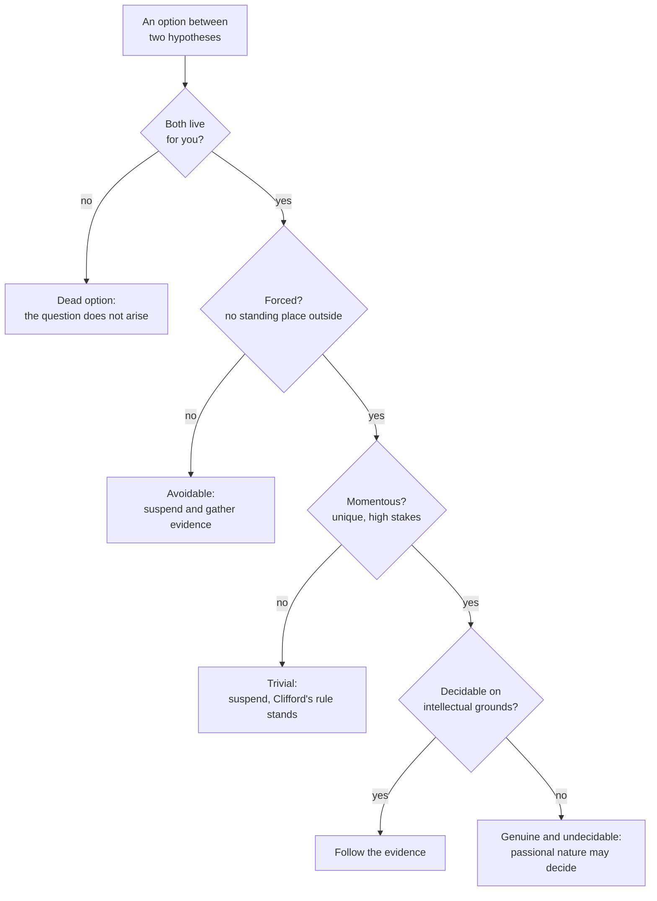

# Philosophy of Religion · Lesson 5.3: Pragmatic arguments: the wager and the will to believe

> ⏱ ~15 min · Module 5: Faith, evidence, and the many religions · Builds on: [5.1 Evidentialism and the ethics of belief](05-01-evidentialism-and-the-ethics-of-belief.md), [5.2 Reformed epistemology](05-02-reformed-epistemology.md), [`decision-theory` 6.1](../../decision-theory/lessons/06-01-pascals-wager-as-a-decision-problem.md) · Unlocks: [5.4 Fideism](05-04-fideism.md)

## Why this matters

The evidentialist of [5.1](05-01-evidentialism-and-the-ethics-of-belief.md) says belief must answer to evidence. Reformed epistemology ([5.2](05-02-reformed-epistemology.md)) replied that some belief is rightly held without arguments. Pragmatic arguments make a different reply: even if the evidence is balanced, there can be *practical* reasons to believe. Pascal gives a prudential argument from the stakes. William James gives a permission: in a narrow class of cases our desires and hopes may settle what we believe. [`decision-theory` 6.1](../../decision-theory/lessons/06-01-pascals-wager-as-a-decision-problem.md) has already built the wager's matrices and tested them against many gods, mixed strategies and infinite utility. Take all of that as given. This lesson asks the questions that lesson handed on: can belief be chosen at all, and is a belief acquired by wagering the belief that would be rewarded?

## The idea

Suppose an eccentric offers you a fortune if, by noon tomorrow, you believe that the number of grains of sand on some beach is even. You now have an overwhelming reason to believe it, and no evidence either way. Try it. You can say the sentence and you can act on it, but you cannot simply believe it.

The case pulls apart two kinds of reason. An **epistemic reason** bears on whether a belief is true. A **practical reason** bears on whether having the belief is good for you. The fortune is a practical reason. It also exposes two separate questions. Can practical reasons make a belief *rational*? And even if they can, can they *produce* it?

Pascal answers the first question yes, for a prudential sense of "rational", and has an indirect answer to the second: you cannot will belief, but you can take up a way of life that will bring it. James answers more narrowly. Practical considerations, which he calls our "passional nature", may decide only where the evidence cannot decide and the choice cannot be dodged. Everywhere else he sides with the evidentialist.

## The argument

**W: the wager as an argument for believing.** A skeleton that wagerers and their critics both recognize:

1. **W1.** Reason cannot settle whether God exists. *In words:* the evidence leaves the question open.
2. **W2.** One must live either as a believer or as an unbeliever. Not choosing is one of the options.
3. **W3.** Given the stakes, wagering for God maximizes expected utility. *In words:* this is the conclusion of [`decision-theory` 6.1](../../decision-theory/lessons/06-01-pascals-wager-as-a-decision-problem.md), granted here with its objections.
4. **W4.** Wagering for God means coming to believe, or at least working to believe.
5. **W5.** One can do what W4 describes.
6. **W6.** The belief so produced is the kind that the payoff in W3 rewards.
7. **∴ C.** One has a prudential reason to cultivate belief in God.

W5 and W6 belong to this lesson.

**W5 and doxastic involuntarism.** [Doxastic involuntarism](../reference.md#doxastic-involuntarism) is the thesis that we cannot believe at will, the way we can raise an arm at will. Bernard Williams ("Deciding to Believe", 1970) argued that this is no accident of psychology. Belief aims at truth, so a state I knew I had produced by willing, regardless of truth, would not be something I could regard as a belief. William Alston (*Epistemic Justification*, 1989) argued at length that we lack the voluntary control over belief that talk of epistemic duty seems to presuppose.

Pascal concedes the point. In *Pensées* §233 (Trotter's numbering) his interlocutor accepts the calculation and then protests that he is so made that he cannot believe. Pascal does not say "then choose to." He says the obstacle is the passions, not a shortage of proofs, and he prescribes a route:

> by acting as if they believed, taking the holy water, having masses said, etc. Even this will naturally make you believe, and deaden your acuteness.

This is [indirect voluntarism](../reference.md#indirect-voluntarism): you cannot choose a belief, but you can choose actions that will reliably cause it, just as you cannot choose to be fit but can choose to train. (Trotter's "deaden your acuteness" renders *vous abêtira*, which is blunter: roughly, it will make you dull.)

**W6 and the mercenary-belief objection.** Suppose the regimen works. The [mercenary-belief objection](../reference.md#mercenary-belief-objection) says that a belief adopted to win a prize is not faith, and that a God worth the name would see through it. James himself put it this way. He said a faith in holy water and masses

> adopted wilfully after such a mechanical calculation would lack the inner soul of faith's reality

and that a God in our place might take particular pleasure in excluding such believers. The wagerer's reply goes back to Pascal's text. The calculation is where the journey starts, not what it ends with. The practices are meant to reduce the passions, and the passage closes with the virtues the wagerer will acquire. The belief that results need not be held *for* the prize, any more than a friendship begun for advantage must stay a friendship of advantage.

**J: the will to believe.** James's 1896 address, "The Will to Believe", is a reply to Clifford's universal principle ([Clifford's principle](../reference.md#cliffords-principle), reloaded from [5.1](05-01-evidentialism-and-the-ethics-of-belief.md)). It starts with definitions. A hypothesis is **live** for you if it appeals to you as a real possibility. That is a relation to a thinker, not a property of the hypothesis. A choice between two hypotheses is an *option*, and options are

- **living or dead**: both hypotheses are live for you, or not;
- **forced or avoidable**: a complete disjunction with no place to stand outside it, or one you can escape by declining to choose;
- **momentous or trivial**: a unique opportunity with real stakes, or one that is cheap, repeatable or reversible.

A [genuine option](../reference.md#genuine-option) is living, forced and momentous. Then comes [the thesis](../reference.md#will-to-believe-thesis):

> Our passional nature not only lawfully may, but must, decide an option between propositions, whenever it is a genuine option that cannot by its nature be decided on intellectual grounds

The argument behind it, in standard form:

1. **J1.** There are two distinct duties, to believe truth and to shun error, and no rule of the intellect fixes how to weigh them.
2. **J2.** Clifford's rule weighs avoiding error above everything. That weighting is itself a passional preference, a horror of being duped.
3. **J3.** In a forced option, suspending judgment loses the good of the true belief just as surely as rejecting it does. So suspension is not neutral. It is a choice to risk losing truth rather than risk error.
4. **J4.** So in a genuine option the intellect cannot decide, and declining to decide is itself a passional decision. *In words:* the evidentialist is betting too, only on the other side.
5. **∴ J.** In such an option we may let hope rather than fear decide.

James adds two strands. In some cases belief helps make itself true: whether someone comes to like you can depend on whether you meet them half-way. And the religious hypothesis may be one where evidence is withheld from anyone who refuses to meet it half-way. Then a rule forbidding belief before the evidence arrives would, he argues, be an irrational rule, because it could block acknowledging a truth that is really there.

James is not a wagerer. He calls Pascal's option dead for anyone with no prior leaning toward masses and holy water. For someone already leaning that way, he concedes, the argument works as a clincher.

**Where the argument is weakest.** For W, the critic attacks W6. A belief caused by habituation for the sake of a reward is either not the faith that is rewarded, or not rationally held, since its cause is the regimen rather than evidence. The defender says the objection assumes that a belief's history fixes its character for good, and Pascal's point is that the motive changes along the way. For J, the critic attacks the "forced" premise J3. One can practise a religion, hope, and act on the hypothesis without believing it, so the good may not require belief at all. And if J licenses belief here, it seems to license wishful thinking wherever evidence runs out. The defender replies that the critic's own rule rests on J2's preference for avoiding error, which is no more intellectually required than James's.

## The map

Only one leaf licenses believing beyond the evidence. Every other route ends where Clifford would end it.

## Worked examples

**Example 1 (clean): a catalyst in the lab.** Dana, a chemist, thinks a new catalyst may double a reaction's yield. Run the tests. *Live:* yes, both "it works" and "it doesn't" appeal to her. *Forced:* no, since she can suspend judgment and run the trials. *Momentous:* no, since a wrong guess costs a year of work and can be reversed. So James's thesis does not apply, and on his own account she should suspend judgment and test. James says explicitly that such trivial options are the normal case in science. The example shows that James's permission is narrow, and that in the laboratory he and Clifford agree.

**Example 2 (where it strains): the agnostic in the choir.** Ruth finds [`decision-theory` 6.1](../../decision-theory/lessons/06-01-pascals-wager-as-a-decision-problem.md)'s matrices persuasive and cannot believe. She joins a church choir, attends services and prays for two years, and at the end she believes. Three questions come apart.

- *Was the belief chosen?* Not directly. She chose actions, and the actions caused the belief. W5 holds in its indirect form, and Williams's argument is not touched, since at no moment did she believe by fiat.
- *Is it the rewarded belief?* Her motive at the start was prudential. Her motive at the end may not be: she may now believe because the hymns and prayers seem to her to put her in touch with God. If what is rewarded is the belief and trust she ends with, W6 may hold. If the start contaminates the whole history, it does not.
- *Is it rational?* The evidentialist says the belief's cause is habituation, so it is unjustified even if it is true. The reformed epistemologist of [5.2](05-02-reformed-epistemology.md) has another reading available. The regimen removed obstacles, as Pascal claimed, so that a belief-forming capacity could work. On that reading the practices did not replace evidence; they let her respond to it.

The case does not settle which reading is correct. It shows that the answer turns on whether the regimen *caused* the belief or *cleared the way* for grounds the belief now rests on.

## Watch out

- **You might think doxastic involuntarism refutes the wager, but actually** Pascal grants it in the text and answers with an indirect route. The live questions are W6 and whether the belief that results is rational. Whether one can will belief is not the issue.
- **You might think James licenses believing whatever you like, but actually** his thesis needs an option that is living, forced, momentous *and* undecidable on intellectual grounds. Most options fail at least one test, and there he defers to the evidence.
- **You might think James's argument is a wager, but actually** it is a claim about permission, not maximizing. He rejects Pascal's calculation. His argument is that the preference for avoiding error over gaining truth is itself a passional choice, so no neutral rule forbids believing.

## One-liner

> Pascal says belief cannot be willed but can be cultivated, which leaves the question of whether cultivated belief is the faith that counts; James says that when an option is live, forced, momentous and beyond the evidence, refusing to believe is itself a bet.

## Problems

**P1 (🟢)** *(Exegetical (a) · Evaluative (b).)* **Apply to a hard case.** Mateo has been offered a partnership in a small two-person firm. The offer lapses on Friday. The other partner, Ines, has a mixed record: some former colleagues praise her and some do not, and nothing more can be learned by Friday. Mateo knows that the partnership will work only if each of them trusts the other from the start, because a partner who holds back gets held back from.

(a) Is "Ines will be a trustworthy partner" versus "she will not" a genuine option for Mateo in James's sense? Run each of the three tests, and say whether the case also falls under James's faith-that-helps-create-the-fact strand. (b) Say whether James's thesis permits Mateo to believe Ines is trustworthy, and name one feature of the case that would make an evidentialist call the permission unnecessary. **150 words or fewer for (b).**

**P2 (🟡)** *(Exegetical.)* **Diagnose.** An invented sermon excerpt:

> "Nobody can prove God doesn't exist. William James showed that when you can't disprove something, you have the right to believe it. And Pascal showed it's the safe bet, so you'd be foolish not to. So don't wait for proof. Decide, right now in this pew, to believe."

Name three distinct mistakes about what Pascal or James actually says. For each, say which text it misreads and what the text says. **Two sentences per mistake.**

**P3 (🔴, optional)** *(Evaluative.)* **Steelman and reply.** (a) State the mercenary-belief objection to the wager at the strength its best defenders would recognize, and name the premise of W it denies. (b) Give the best reply on the wagerer's behalf, and say what that reply has to assume. **150 words or fewer in total.**

Solutions

**P1** *(Exegetical (a) · Evaluative (b))*

(a)

**Must hit, strict (a):**

- *Live:* yes. Both hypotheses are real possibilities for him, since the record is mixed.
- *Forced:* yes for practical purposes. Since the offer lapses Friday, declining to decide is declining the partnership, which has the same practical effect as deciding against her.
- *Momentous:* plausibly yes. The opportunity is unique and the stakes are real, though whether it is reversible (could he leave the firm later?) bears on this.
- *Faith creating the fact:* yes. Ines's trustworthiness *as a partner* partly depends on Mateo's trust, which is James's "meet them half-way" structure.

**Must hit, any verdict (b):**

- A verdict on whether the thesis applies, tied to the tests in (a), including whether the question "cannot by its nature be decided on intellectual grounds".
- A feature that makes the permission unnecessary for an evidentialist. Because his trust raises the chance that she will be trustworthy, believing may be what the evidence supports once his own contribution is counted. Or: he can *act* trustingly (sign, cooperate) without believing, so the good does not need belief.

**Wrong turns:** calling the option avoidable because Mateo "could just not join". On James's test, an option is avoidable only if declining does not forfeit the good, and declining here forfeits it. Treating the faith-creating strand as a separate genuine-option condition; it is an additional argument, not a fourth test.

**Model answer (b), one of several:** If he can learn nothing more by Friday, the option is genuine and undecidable, so James permits trust, and he would add that Mateo's trust helps make itself true. An evidentialist can grant that he should *sign* while denying that he needs to *believe*. Trusting action plus a credence of about one half may secure the partnership's benefits. And since his trust raises the odds of her trustworthiness, the evidence he will have once he commits may already favour belief. The permission does real work only if the good requires full belief beyond what that self-supporting evidence allows.

---

**P2** *(Exegetical)*

**Must hit, strict:** any three of these four, each with the text named.

- **James's conditions misstated.** James does not license belief whenever something cannot be disproved. The option must be living, forced and momentous, *and* undecidable on intellectual grounds. Undisprovable but trivial or avoidable hypotheses get no permission.
- **"Decide, right now" is direct voluntarism.** Pascal's text grants that his interlocutor cannot believe at will. It prescribes an indirect route instead, acting as believers do (holy water, masses) until belief comes.
- **Pascal and James run together.** James rejects the wager. He says faith adopted after such a calculation would lack faith's inner soul, and he calls the wager's option dead for those without a prior leaning.
- **Permission versus prudence.** James's thesis says passional nature *may* decide, not that refusing to believe is foolish. The "you'd be foolish not to" is Pascal's prudential claim, which needs the matrix of [`decision-theory` 6.1](../../decision-theory/lessons/06-01-pascals-wager-as-a-decision-problem.md) and its contested premises.

**Wrong turns:** objecting that the sermon is wrong because God does not exist, or because the evidence favours theism. Both are verdicts, and the task is exegesis. Saying James's condition is only that God cannot be disproved. He requires that the question cannot be decided either way on intellectual grounds.

**Model answer, one of several:** (1) James does not say that being unable to disprove something gives a right to believe it. His permission covers only options that are living, forced, momentous and beyond the evidence. (2) Pascal never tells anyone to believe on the spot. His unbeliever says he cannot, and Pascal agrees and prescribes acting as believers do until belief follows. (3) The sermon treats James as backing the wager, but James attacks it. He says faith reached by that calculation would lack faith's inner soul.

---

**P3** *(Evaluative)*

**Accept:** any statement of the objection that targets W6 and gives a reason a careful critic would endorse, plus a reply that engages that reason. The verdict is free.

**Must hit, any verdict:**

- The objection stated at strength: the payoff in W3 is for faith, meaning trust and love of God; a belief cultivated as a means to a reward is self-interested, and so either is not that faith or would not be rewarded by a good God. Premise denied: **W6**. A strong answer notes that James made this objection himself.
- The reply stated at strength: the motive that starts the process need not be the motive of the belief that results. Pascal's regimen aims to change the motive by reducing the passions.
- What the reply assumes: that the regimen in fact transforms motive, and that a good God judges the belief one ends with rather than the reason one began.

**Wrong turns:** attacking W5 (whether belief can be chosen) instead of W6. That is involuntarism, a different objection. Replying that infinite utility outweighs the risk. That is W3 again, and it ignores whether the reward is available at all.

**Model answer, one of several:** (a) What W3's payoff rewards is faith: trust in and love of God. A belief one cultivates in order to collect a reward is, at its root, self-interest. Either it is not faith at all, or a God who reads hearts would not reward it. This denies W6. (b) The motive that starts a practice need not be the motive it ends with. People take up music for status and come to love it. Pascal's regimen is designed to work like that: by reducing the passions, it aims to leave a belief that is held for its own sake. This assumes that habituation really does change motive, and that God judges what the believer has become rather than how she started.

## Flashback

**From Lesson [5.1](05-01-evidentialism-and-the-ethics-of-belief.md) (Evidentialism and the ethics of belief):** *(Exegetical.)* **Counterexample.** An invented memo from a research director to her staff:

> "From now on, hold no belief unless it has been confirmed by a controlled experiment or proved as a theorem. Anything else is guesswork, and guesswork has no place in this institute, or in a rational life."

(a) Show that the memo's rule fails its own test, in the way the lesson's self-referential problem shows P2 failing. Two sentences. (b) A staff member, Kofi, believes his sister will repay a loan, on the strength of thirty years of her keeping her word. Under pressure the director retreats to: "Hold a belief only if it fits your total evidence." Give the verdict on Kofi's belief under the original rule and under the retreat, and say what question the dispute over his belief now turns on. Three sentences or fewer.

Solution

**Must hit, strict (a):**

- The rule is itself a belief the director holds, and it is neither confirmed by a controlled experiment nor proved as a theorem.
- Nor is it supported by evidence of either permitted kind, so by its own standard she should not hold it. The parallel is exact: P2 is neither self-evident, incorrigible nor evident to the senses, and has no adequate support from beliefs that are.

**Must hit, strict (b):**

- Original rule: Kofi's belief is condemned. A track record of kept promises is neither an experiment nor a proof.
- Retreat: the belief can pass, since thirty years of observed reliability is evidence and the belief plausibly fits it.
- The dispute now turns on whether his evidence is **adequate and undefeated** (for instance, whether her circumstances have changed), not on whether the evidence is of an approved *kind*. This is the lesson's relocation from P2 to P4.

**Wrong turns:** saying the self-referential problem refutes evidentialism as such, when it refutes only the narrow criterion of what may count as evidence; saying the retreat is open to the same charge in the same way, when total-evidence fit restricts no class of evidence; treating Kofi's case as one for Clifford's duty of inquiry, which the stem does not raise.

**Model answer:** (a) The rule is a belief, yet no experiment confirms it and no proof establishes it, so by its own lights the director should not believe it, just as classical foundationalism fails its own criterion of proper basicality. (b) The original rule condemns Kofi's belief, since a track record is neither experiment nor proof. The retreat permits it, since thirty years of kept promises is evidence it fits. The question is no longer what *kind* of evidence counts but whether his evidence is adequate and undefeated, which is where the lesson says the dispute over belief in God relocates too.

## Connections

- **Backward:** the matrices, the many-gods partition and the infinite-utility objections are [`decision-theory` 6.1](../../decision-theory/lessons/06-01-pascals-wager-as-a-decision-problem.md)'s, and that lesson's fourth premise ("wagering must be something you can do") is the W5 examined here. Clifford's principle and the evidentialist objection come from [5.1](05-01-evidentialism-and-the-ethics-of-belief.md). Clifford's principle is also quoted in [`philosophical-method` 4.4](../../philosophical-method/lessons/04-04-arguing-within-a-tradition-the-disputed-question.md). The reading of Ruth's case where the regimen clears the way for grounds the belief comes to rest on is [5.2](05-02-reformed-epistemology.md)'s proper-function picture.
- **Forward:** [5.4](05-04-fideism.md) turns to fideism, the view that faith need not answer to rational evaluation at all; James's narrow permission is the useful contrast. The diversity problem of [5.5](05-05-religious-diversity.md) can be put in James's vocabulary: which hypotheses are live for you depends largely on where you were raised.
- **Sideways:** Catholic teaching treats faith as an assent of the intellect commanded by the will under grace (*ST* II-II q.2 a.9, quoted in [`fundamental-theology` 2.1](../../fundamental-theology/lessons/02-01-the-act-of-faith.md)). That is one position on how will and belief interact, and this course neither asserts nor denies it. James's faith-that-creates-the-fact cases, such as the passengers who would resist robbers only if each trusted the others to rise, have the structure of a coordination problem.
