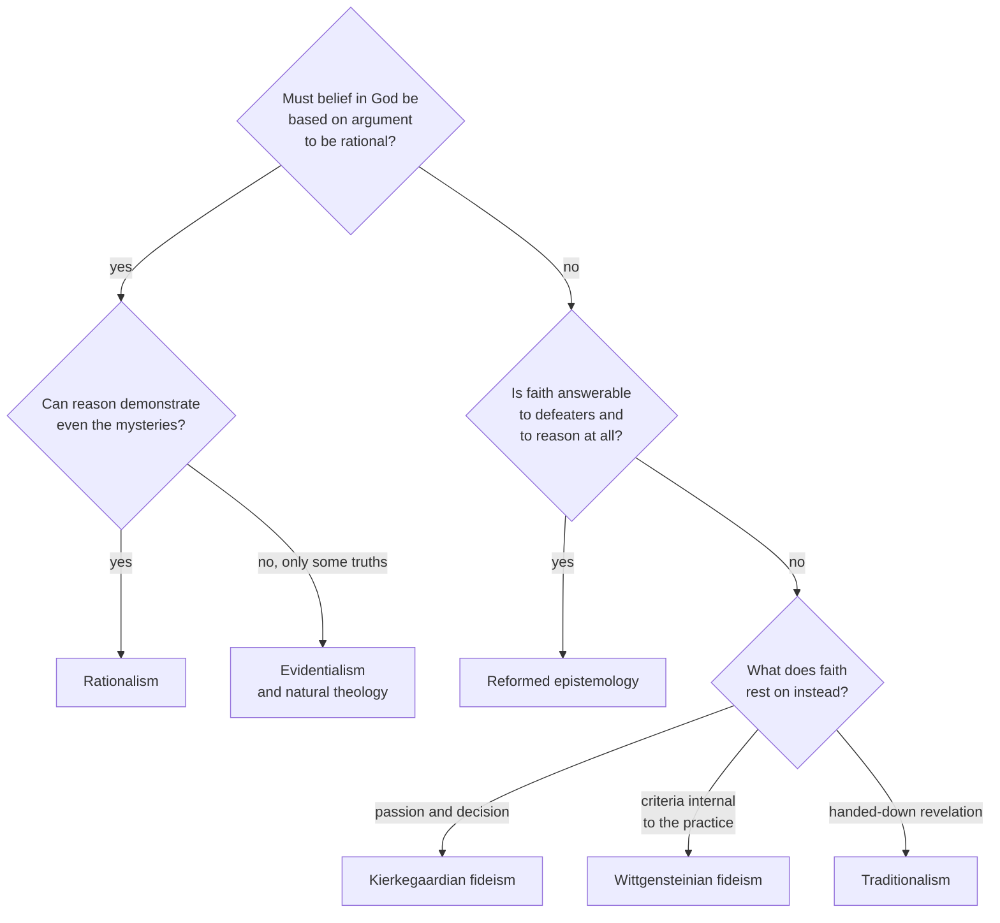

# Philosophy of Religion · Lesson 5.4: Fideism

> ⏱ ~15 min · Module 5: Faith, evidence, and the many religions · Builds on: [5.1 Evidentialism and the ethics of belief](05-01-evidentialism-and-the-ethics-of-belief.md), [5.2 Reformed epistemology](05-02-reformed-epistemology.md), [5.3 Pragmatic arguments](05-03-pragmatic-arguments-the-wager-and-the-will-to-believe.md) · Unlocks: [5.5 Religious diversity](05-05-religious-diversity.md)

## Why this matters

Evidentialism says religious belief must answer to evidence ([5.1](05-01-evidentialism-and-the-ethics-of-belief.md)). Reformed epistemology says it need not be *based* on argument ([5.2](05-02-reformed-epistemology.md)). The wager says it can be *prudent* without being proved ([5.3](05-03-pragmatic-arguments-the-wager-and-the-will-to-believe.md)). Fideism says something more radical: faith is not the kind of thing reason gets to judge at all. "Fideist" is also the label most often thrown at the other two views, by secular critics and by religious ones. So you need to know exactly what it claims, and which views really earn it.

## The idea

**[Fideism](../reference.md#fideism)** is the view that religious faith is not answerable to rational evaluation: its authority does not depend on evidence or argument, and evidence or argument cannot properly overturn it. Alvin Plantinga's definition, which the SEP adopts, makes it exclusive or basic reliance on faith alone, with reason disparaged as a result ("Reason and Belief in God", 1983).

Two questions sort the forms.

- **Above reason or against it?** *Suprarational* fideism says faith concerns what reason cannot reach. *Contrarational* fideism says faith embraces what reason judges false or absurd, and is the greater for it.
- **What does faith rest on instead?** The passion and decision of the individual (Kierkegaard). The internal criteria of a religious practice (Wittgensteinian fideism). Or, in the nineteenth-century French form called traditionalism, a primitive revelation handed down through society ([`fundamental-theology` 2.3](../../fundamental-theology/lessons/02-03-fideism-and-rationalism.md)).

Keep fideism apart from two nearby claims that are *not* fideist. "Faith goes beyond what reason can prove" is held by nearly every theist, including those who think natural theology succeeds. "Belief in God need not be inferred from arguments" is reformed epistemology. Fideism starts only where faith is declared **immune**: no evidence could count against it, and reason has no standing to try.

One tag needs clearing first. Tertullian never wrote *credo quia absurdum*, "I believe because it is absurd." [`patristics` 2.3](../../patristics/lessons/02-03-tertullian.md) traces the real clauses in *On the Flesh of Christ* 5 and their anti-Marcionite context. Do not cite him as the founder of fideism.

## The argument

Two arguments for fideism carry real weight. Neither defender used the label; Phillips explicitly rejected it.

**The [Kierkegaardian argument](../reference.md#kierkegaards-leap).** Søren Kierkegaard wrote it under the pseudonym Johannes Climacus, in *Philosophical Fragments* (1844) and *Concluding Unscientific Postscript* (1846). Interpreters warn against reading Climacus straight as Kierkegaard. In paraphrase:

1. **Objective inquiry, historical or philosophical, yields at best approximation:** a probability that further evidence could always revise.
2. **Faith is an unconditional commitment:** an absolute relation to the absolute, with one's eternal happiness at stake.
3. **An unconditional commitment cannot be proportioned to, or wait upon, an approximation.** *In words:* if your faith is 0.9 because the evidence is 0.9, it is a hedged bet, not faith; and if it waits for the scholarship to finish, it never starts.
4. **The object of Christian faith, the god in time (the Incarnation), is the "absolute paradox":** reason meets it and either takes offense or yields.
5. **So faith cannot rest on objective reasoning.** It is a leap: passionate commitment held fast in objective uncertainty, where the uncertainty is part of what makes it faith.

**The Wittgensteinian argument.** Kai Nielsen coined "[Wittgensteinian fideism](../reference.md#wittgensteinian-fideism)" as a criticism, in an article of that name (*Philosophy*, 1967). The view's leading exponent was D. Z. Phillips (*Faith and Philosophical Enquiry*, 1970; *Religion Without Explanation*, 1976).

1. **The meaning of an expression is fixed by its use within a practice, a "form of life".**
2. **The standards for what counts as evidence, reason or mistake are internal to practices.**
3. **"God exists", prayer, "eternal life" have their use within religious practice, not as explanatory hypotheses about the world.** On readings like Phillips's, a petitionary prayer expresses dependence; it is not a bid to influence a cause.
4. **So criticism that treats religious belief as a hypothesis, to be confirmed or refuted by outside evidence, misunderstands its object.** Religion is neither supported nor threatened by such evidence.

**Is reformed epistemology fideist?** Recall [5.2](05-02-reformed-epistemology.md): a [properly basic belief](../reference.md#properly-basic-belief) in God can be rational without being inferred from arguments. Plantinga denies the charge. Proper basicality is a claim *within* epistemology: the belief comes from a cognitive faculty and is warranted or not by the same standards as memory. It is defeasible, and the reformed epistemologist answers [defeaters](../reference.md#defeaters), such as the problem of evil, with arguments. Critics say the effect is the same. If no argument is *needed*, and the believer judges for himself which defeaters succeed, then faith is insulated in practice. The [Great Pumpkin objection](../reference.md#great-pumpkin-objection) presses this: any community could declare its own belief properly basic. The crux is narrow. Reformed epistemology is not fideist if its beliefs are genuinely answerable to defeaters, and it collapses into fideism if the answerability is idle.

**The critics, stated at strength.**

- *Secular:* Insulation. A belief no evidence could count against cannot count as tracking the truth. And if faith needs no reasons, then rival faiths, each held by leap or by practice, cannot be ranked: the choice among them is arbitrary. Hume turned the point into irony at the end of his essay on miracles: "Our most holy religion is founded on Faith, not on reason" (*Enquiry* §10, Part II). He meant that this foundation would not bear examination.
- *Religious:* Faith that reason cannot assess cannot be distinguished from credulity or delusion. It cannot be commended to anyone, and it slides into relativism. Catholic teaching rejects fideism as an error. [`fundamental-theology` 2.3](../../fundamental-theology/lessons/02-03-fideism-and-rationalism.md) reads Vatican I's *Dei Filius* (1870), which defines that God *can* be known with certainty by natural reason. Vatican I defined a capacity, not a proof: it does not say any argument of Module 2 succeeds, which is this course's open question. *Dei Filius* does not use the word "fideism"; its target was traditionalism. This course cites that position as one among others; it neither asserts nor denies it.

**Where the argument is weakest.** In the Kierkegaardian argument the critic attacks premise 3. Proportioning commitment to evidence is what responsible belief is. And an unconditional commitment to a proposition you rate as merely probable, or as paradoxical, is just what Clifford condemned ([5.1](05-01-evidentialism-and-the-ethics-of-belief.md)). The defender replies that the objection assumes all commitment is belief-as-estimate. Marriage, vocation and loyalty are unconditional commitments made under uncertainty, and we do not call them irrational. In the Wittgensteinian argument the critic attacks premise 2. Practice-internal criteria would equally protect astrology or witchcraft. Worse, most believers mean "God exists" as true whether or not anyone practises anything. So premise 3 may be a reinterpretation of religion, not a defense of it. The defender replies that this treats grammar as hypothesis. On Phillips's view, practices are not sealed off: religion can be confused, superstitious or shaken by life. What it cannot be is refuted as a failed theory.

## Map of positions

Alt text: a decision tree sorting positions on faith and reason. Those who require argument split into rationalism and evidentialism; those who do not split into reformed epistemology, if faith answers to defeaters, and three forms of fideism, if it does not.

The question that separates fideism from reformed epistemology is the third box, not the first. Both answer "no" to the first.

## Worked examples

**Example 1 (clean case: classify by the immunity test).** An invented convert says: "I never came to faith by argument. It just became obvious, the way other minds are obvious. But if someone showed me the world contains pointless horrors that a good God could not permit, I would have to think hard, and I might lose it." Run the map. Box 1: no argument required. Box 3: the speaker grants that a defeater could succeed. That is reformed epistemology, not fideism, whatever the tone.

**Example 2 (hard case: a commitment no finding could move).** An invented Christian says: "If archaeologists proved that Jesus's body stayed in the tomb, I would go on praying and hoping exactly as I do." Is this fideism?

- *If "resurrection" for her names a historical event:* she is holding a historical claim immune to historical evidence. That is fideism by the immunity test, and of the contrarational kind.
- *If she reads it as Phillips might:* the resurrection hope is a way of facing death, not a report about a body. Then archaeology was never relevant to it. Her position is not immune to evidence; it simply makes no claim evidence could bear on.
- *What decides it:* what her words *mean*, which is premise 3 of the Wittgensteinian argument. Note the cost each way. On the first reading she is a fideist. On the second she may no longer believe what most Christians, including Paul, have meant by the claim (1 Corinthians 15:14).

## Watch out

- **You might think fideism means believing without arguments, but** belief without arguments is reformed epistemology's claim. Fideism is belief **immune** to rational assessment. The test is answerability to defeaters, not the presence of arguments.
- **You might think "faith exceeds reason" is fideist, but** it is shared by Aquinas, Vatican I and most natural theologians. Fideism denies reason's competence, not its completeness.
- **You might think Kierkegaard and Phillips called themselves fideists, but** the label was applied by critics. Phillips rejected it, and many readers, such as C. Stephen Evans, argue that Kierkegaard holds at most a "responsible" fideism: reason recognizing its own limits.

## One-liner

> Fideism is not "faith goes beyond reason" or "faith needs no argument" but "faith is not answerable to reason": its defenders say that is what makes it faith, and its critics, secular and religious, say that is what makes it arbitrary.

## Problems

**P1 (🟢) *(Exegetical)*** Classify each invented position as evidentialist, reformed, Kierkegaardian fideist, Wittgensteinian fideist, or rationalist. Give one sentence each naming the words that decide it.

(a) "I believe in God the way I believe the past is real: not by inference. But I take the problem of evil seriously, and I have read the replies because my belief could, in principle, be defeated."
(b) "Asking for evidence that God exists is like asking for evidence that chess has a king. Within the life of prayer the question does not arise, and outside it the word means nothing."
(c) "I have weighed the case and give theism about 0.7. I hold my belief with exactly that confidence, and I would revise it on new arguments."
(d) "The more the scholars cast doubt on the Gospels, the more my commitment stands out as mine. A faith secured by evidence would be no faith at all."

**P2 (🟡) *(Evaluative)*** Steelman Wittgensteinian fideism against Nielsen's objection that practice-internal criteria would equally protect astrology. Then give the best reply to your steelman. 150 words or fewer in total.

**P3 (🔴) *(Exegetical (a) · Evaluative (b))*** An invented sermon excerpt:

> "Brothers and sisters, the world wants proofs. But as Tertullian said, *credo quia absurdum*: I believe because it is absurd. The arguments of the philosophers cannot touch our faith, and they cannot help it either. God is known by faith alone, never by reason. When the doubter brings his evidence, we need not listen."

(a) Identify two errors of attribution or classification in the excerpt, and say which form of fideism its final two sentences express. Three sentences or fewer. (b) A critic says: "This sermon shows that religious faith as such is fideist." Assess that inference in 100 words or fewer; any verdict.

Solutions

**P1** *(Exegetical)*

**Must hit, strict:**

- (a) **Reformed.** "Not by inference" denies the need for argument; "could, in principle, be defeated" grants answerability. Basic but defeasible.
- (b) **Wittgensteinian fideist.** The criteria are internal to "the life of prayer", and the question is meaningless outside it: premises 2 and 3.
- (c) **Evidentialist.** Confidence is "exactly" proportioned to the weighed case and revisable.
- (d) **Kierkegaardian fideist.** Faith gains from objective uncertainty, and evidence would corrupt it: premise 5's leap, with uncertainty as a merit.

**Wrong turns:** calling (a) fideist because it has no argument (the immunity test, not the absence of arguments, decides); calling (c) rationalist (rationalism claims demonstration, here even of mysteries, not a 0.7 credence); calling (d) Wittgensteinian because it dismisses scholarship (the ground is passion, not a practice's criteria).

---

**P2** *(Evaluative)*

**Must hit, any verdict:**

- State the objection at strength: if criteria are internal to practices, any practice, including astrology, is shielded, so the view cannot tell religion from superstition.
- Steelman: astrology makes predictions and so is itself an empirical hypothesis, judged by the standards it invokes. Religious language, on Phillips's reading, makes no such claims. And Phillips allows that a practice can be confused or superstitious by its own lights, so it is not immune to every criticism.
- Reply: either religion makes no claims about how things are, which most believers deny, or it does, and those claims answer to outside evidence. The defense works only at the cost of reinterpreting belief.

**Wrong turns:** steelmanning by asserting that religion is true or that astrology is false (verdicts, not moves); replying only that the view is relativist without saying what claim it would have to deny.

**Model answer, one of several:** Steelman: astrology is a bad comparison because astrologers predict events, so they submit to the standards of prediction and fail by them. Religious language, on Phillips's reading, does not predict or explain. "God's will be done" expresses acceptance; it does not forecast. A practice can still be criticized from inside: prayer as magic is a corruption by religion's own lights. So the view is not a shield for everything. Reply: the steelman holds only if believers' words mean what Phillips says. Most believers take "God exists" to be true whether or not anyone prays. If they are right about their own meaning, the belief is a claim about reality and outside evidence bears on it. If Phillips is right, he has protected a belief few hold.

---

**P3** *(Exegetical (a) · Evaluative (b))*

**Must hit, strict (a):**

- Tertullian did not write *credo quia absurdum*; *On the Flesh of Christ* 5 has two impersonal clauses inside an argument against Marcion ([`patristics` 2.3](../../patristics/lessons/02-03-tertullian.md)).
- "Never by reason" is presented as Christian teaching, but Catholic teaching, for one, holds the opposite: Vatican I defined that God can be known by natural reason ([`fundamental-theology` 2.3](../../fundamental-theology/lessons/02-03-fideism-and-rationalism.md)). The sermon's position is a rejected one, not the tradition's.
- The last two sentences express **contrarational, immunity-style fideism**: reason can neither help nor harm, and contrary evidence need not be heard. With no stated ground beyond faith itself, it is closest to the Kierkegaardian form, minus Kierkegaard's argument.

**Must hit, any verdict (b):**

- Name the inference: from one fideist believer (or sermon) to all faith.
- Test it against the positions that reject fideism: evidentialist theists, natural theology, reformed epistemology, Catholic teaching.
- Verdict either way, saying what further premise the critic would need (e.g. that non-fideist believers are in practice insulated too).

**Wrong turns:** treating "God is known by faith" as itself the error (faith as a way of knowing is orthodox; "never by reason" is the error); arguing about whether the sermon's faith is true.

**Model answer (b), one of several:** The inference generalizes from one sermon to "faith as such". Evidentialist theists, natural theologians, reformed epistemologists and Vatican I all reject the sermon's claim that reason can neither help nor harm faith, so the conclusion does not follow. The critic could rescue it only with a further premise: that even believers who profess answerability to evidence never actually revise. That is an empirical claim about believers, not a point about faith's nature, and it needs its own evidence.

## Flashback

**From Lesson [5.2](05-02-reformed-epistemology.md) (Reformed epistemology):** *(Exegetical.)* Invented case. Tomasz, a hospice nurse, sits with a dying patient through the night and finds himself believing, without inference, *God is with us here*. Over the next year four things happen. Classify each as a **rebutting defeater**, an **undercutting defeater**, a **defeater-defeater** (a defense or theodicy), or an **intrinsic defeater-defeater**, with one line of reason each.

(i) He reads a neuroscience study arguing that a felt presence is produced by a brain mechanism that fires under exhaustion and stress whether or not anyone is there.

(ii) He nurses a child through a long, agonizing illness and comes to judge that a perfectly good God would not have permitted it.

(iii) He studies a theodicy and judges that it gives a good reason God might permit suffering like the child's.

(iv) He judges that his awareness that night was so steady and vivid that he is more sure of it than he is that the study's mechanism was what produced it in him.

Solution

**Must hit, strict:**

- (i) **Undercutting.** It gives a source for the belief that would operate whether or not God is present, so it is a reason to distrust the source, not a reason to think God absent.
- (ii) **Rebutting.** It is a reason to think the belief itself false: if a good God would not permit this, and it happened, there is no such God with him.
- (iii) **Defeater-defeater.** The theodicy neutralizes (ii) by argument, by removing the reason to think a good God would not permit it.
- (iv) **Intrinsic defeater-defeater.** It does not answer (i) with an argument. The basic belief is claimed to have more warrant than the putative defeater and so beats it directly, as a vivid memory beats someone's evidence that you were elsewhere.

**Wrong turns:** calling (i) rebutting because it "explains God away": a mechanism that fires either way says the source is unreliable, not that the belief is false. Calling (iv) an ordinary defeater-defeater: it supplies no defense or theodicy, only the belief's own greater warrant.

**Model answer:** (i) Undercutting: the study says the experience would occur whether or not God was there, which impugns the source. (ii) Rebutting: it is a reason to think the belief false. (iii) Defeater-defeater: the theodicy disarms (ii) by giving a possible reason for the permission. (iv) Intrinsic defeater-defeater: the belief's own warrant is taken to outweigh (i), with no argument against the study.

## Connections

- **Backward:** [5.1](05-01-evidentialism-and-the-ethics-of-belief.md) set the evidentialist demand fideism rejects; [5.2](05-02-reformed-epistemology.md) supplied proper basicality and the Great Pumpkin objection, whose fideism charge is weighed here; [5.3](05-03-pragmatic-arguments-the-wager-and-the-will-to-believe.md)'s James also lets the passions decide, but only on a genuine option that evidence cannot settle, which is narrower than Kierkegaard's leap.
- **Forward:** [5.5](05-05-religious-diversity.md) presses the arbitrariness charge with real rival traditions: if faith needs no reasons, what makes one leap better than another?
- **Sideways:** fideism and traditionalism as errors defined against by Vatican I are [`fundamental-theology` 2.3](../../fundamental-theology/lessons/02-03-fideism-and-rationalism.md); the absurdity tag and Tertullian's real view are [`patristics` 2.3](../../patristics/lessons/02-03-tertullian.md). Meaning as use belongs to [`philosophy-of-language-and-logic`](../../philosophy-of-language-and-logic/syllabus.md). Kierkegaard's commitment under uncertainty is a choice no expected-value matrix of [`decision-theory` 6.1](../../decision-theory/lessons/06-01-pascals-wager-as-a-decision-problem.md) can represent, since he refuses to weight faith by its probability.
