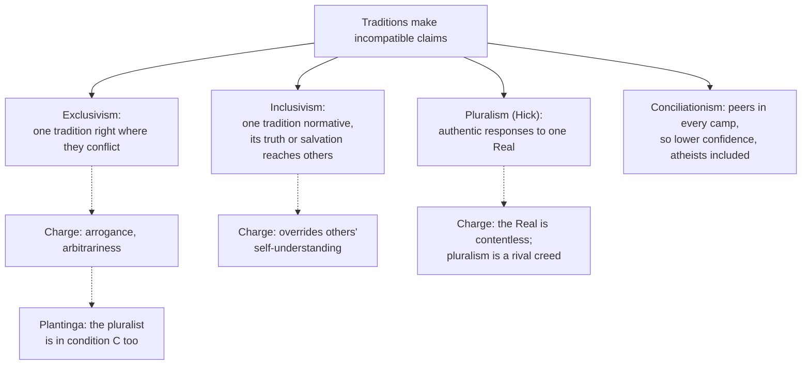

# Philosophy of Religion · Lesson 5.5: Religious diversity

> ⏱ ~15 min · Module 5: Faith, evidence, and the many religions · Builds on: [3.4 The argument from religious experience](03-04-the-argument-from-religious-experience.md), [5.2 Reformed epistemology](05-02-reformed-epistemology.md), [epistemology 4.5 Peer disagreement](../../epistemology/lessons/04-05-peer-disagreement.md) · Unlocks: [`apologetics-foundations`](../../apologetics-foundations/syllabus.md) 8.1–8.2

## Why this matters

The course has so far asked the question two-sidedly: God or no God. But nobody believes in "God" in general. A believer is a Christian, a Muslim, a Vaishnava, and equally intelligent, sincere and informed people in other traditions believe things incompatible with what she believes. [Ethics 6.6](../../ethics/lessons/06-06-moral-knowledge-and-disagreement.md) promised that religious diversity raises the same peer-disagreement question that moral diversity does. This lesson keeps that promise. It asks two things. What should one say about the other religions, and what does knowing about them do to the rationality of one's own belief?

## The idea

Alan Race (*Christians and Religious Pluralism*, 1983) gave the standard three-way [typology](../reference.md#exclusivism-inclusivism-pluralism). It was written for Christian theology, but it now serves every tradition.

- **Exclusivism.** One tradition is correct where the traditions conflict, and the others are mistaken on those points. In a salvation version, only that tradition's path saves.
- **Inclusivism.** One tradition is normative, but its truth or saving power reaches people in other traditions, often without their knowing it. Karl Rahner's "anonymous Christian" ("Christianity and the Non-Christian Religions", *Theological Investigations* 5, 1966) is the classic Christian form. Catholic teaching is one inclusivist position among others, cited here and not asserted. The Second Vatican Council says the Church rejects nothing true and holy in other religions (*Nostra Aetate* 2, 1965). It also says that those who, through no fault of their own, do not know the Gospel but seek God sincerely can attain salvation (*Lumen Gentium* 16, 1964). How those texts are weighed and squared with older formulas is [`apologetics-foundations`](../../apologetics-foundations/syllabus.md) [8.2](../../apologetics-foundations/lessons/08-02-salvation-outside-the-visible-church.md)'s work.
- **Pluralism.** No tradition is privileged. The major religions are roughly equally valid responses to one ultimate reality.

Keep two axes apart: **truth** (whose claims are correct) and **salvation** (who reaches the goal). Plantinga's exclusivism is about truth alone, so it is compatible with inclusivism about salvation. Logic forces some truth-exclusivism on almost everyone. Whether God is triune, whether there is a personal God at all, whether there is an enduring self: two contradictory answers cannot both be true. The live question is epistemic: how may someone who knows all this keep believing?

## The argument

**Hick's pluralist hypothesis** (John Hick, *An Interpretation of Religion*, 1989; the "Copernican revolution" image is from *God and the Universe of Faiths*, 1973). Stated at his strength:

> **H1.** The great traditions produce, at roughly equal rates, the same transformation: from self-centredness to "Reality-centredness" (compassion, love, detachment).
> **H2.** If one tradition alone were in contact with the ultimate, that parity would be inexplicable. It would also be morally troubling, since which tradition a person holds depends mostly on where she was born.
> **H3.** A Kantian-type distinction explains the parity. There is [the Real](../reference.md#the-real) *an sich*, and there is the Real as humanly experienced. The second is filtered through each culture's concepts as "personae" (Yahweh, the Trinity, Allah, Vishnu) and "impersonae" (Brahman, the Dharmakaya, Nirvana).
> **∴ C.** The traditions are culturally different, authentic responses to one Real that none describes literally.

*In words:* what Kant said of the world, Hick says of the divine. We meet it only as our categories shape it. Hick applies the distinction to religious experience, which Kant himself never did. The conflicting doctrines are then mostly "mythologically" true: they are false read literally, but they evoke the right response to the Real.

**Two objections.** (1) *Contentlessness.* If none of our substantive concepts (personal, good, one) applies to the Real *an sich*, nothing explains why the personae should be good, or why these responses count as responses to it at all. Plantinga pressed a version of this in reply to Hick ("Ad Hick", *Faith and Philosophy*, 1997). Hick's answer is that the Real has only formal properties, such as being able to be referred to. (2) *Pluralism is a rival religion.* Christians think the resurrection literally happened. Theravada Buddhists think there is literally no enduring self. Hick's thesis says both are wrong on those points, so it disagrees with each tradition as sharply as the traditions disagree with one another. Gavin D'Costa argued that pluralism is therefore a covert exclusivism, and Hick answered him (*Religious Studies*, 1997).

**Plantinga's defense of exclusivism** ("Pluralism: A Defense of Religious Exclusivism", in Senor (ed.), *The Rationality of Belief and the Plurality of Faith*, 1995). Picture an exclusivist in Plantinga's "condition C". She knows the other traditions and their saints well, and she knows of no argument that would convince their thoughtful adherents. Two charges are made against her.

- *Moral: arrogance.* In condition C she has three options. She can keep believing, withhold belief, or adopt pluralism. Each puts her at odds with thoughtful people she cannot convince. The pluralist is in condition C too. If believing what others reject without a knock-down argument is arrogant, the charge convicts the pluralist as well. This is the **self-referential reply**.
- *Epistemic: the [arbitrariness charge](../reference.md#arbitrariness-charge).* She treats similar cases unequally, favouring her own beliefs for no relevant reason. Plantinga replies that, after reflection, she does *not* think the cases similar: the belief seems true to her, and its rival seems false. He compares a person who is sure that racial bigotry is wrong despite disagreement. He also turns the birthplace argument around. Had the pluralist been born in a devout village, he would probably not be a pluralist either. He concedes something real: awareness of diversity *can* lower the degree of belief, and with it whatever warrant the belief has.

**The conciliationist argument from diversity.** The general theory is [epistemology 4.5](../../epistemology/lessons/04-05-peer-disagreement.md). Richard Feldman ("Reasonable Religious Disagreements", 2007) applied it to religion. Rephrased:

> **D1.** Many adherents of incompatible traditions are [epistemic peers](../reference.md#religious-disagreement) on the religious question. They share the relevant evidence and are equally competent.
> **D2.** Conciliationism with Independence. If you knowingly disagree with a peer and have no reason, independent of the dispute, to think she erred, you should substantially lower your confidence.
> **D3.** The believer typically has no such dispute-independent reason.
> **∴ D4.** She should substantially lower her confidence. Feldman's own verdict is that she should suspend judgment.

*In words:* if a Muslim philosopher as careful as you, who knows your arguments, ends up elsewhere, her verdict is evidence that you slipped.

**Where the argument is weakest.** D1, specifically the "shared evidence" clause. Plantinga, Alston and others deny that religious evidence is fully shared. Experience, and in Plantinga's model the internal witness of the Spirit ([5.2](05-02-reformed-epistemology.md)), are not on the table for both parties. The critic replies that every party can say this of its own private evidence. If it licenses everyone to hold firm, the arbitrariness charge is back. The defender of D1 says that objection assumes something it has not shown: that evidence one cannot hand over cannot be weighed from the inside. D2 is also contested. Steadfast and total-evidence views reject it, and conciliationism faces the self-undermining problem. One thing is symmetric, and both sides should note it. D1–D4 apply equally to the confident atheist, who disagrees with theist peers.

## Map of positions

Solid arrows are positions or responses to the fact of diversity. Dashed arrows are the main objection to each, and Plantinga's reply. Conciliationism is not a fourth position on the typology. It is a claim about how confidently any of the three may be held.

## Worked examples

**Ex 1 (clean case: the Trinity).** Two invented philosophers, Daniel (Christian) and Amira (Muslim), have read the same scriptures, councils and *kalam* texts and the same analytic literature. Daniel holds that God is triune; Amira holds that this compromises God's oneness (*tawhid*).

- *Typology:* each is a truth-exclusivist on this point. Daniel may be a salvific inclusivist about Amira, and Amira may be one about Daniel.
- *Conciliationism:* if they are peers and neither has a dispute-independent reason to think the other erred, D2 tells both to lower confidence substantially.
- *Plantinga's reply:* each may find, on reflection, that the other's view seems false. The cost is that the reply works for both of them equally, which is why critics call it arbitrary.
- *Hick:* both doctrines are personae of the Real, and neither is literally true. Both philosophers will say that this rejects, rather than reconciles, what each believes.

**Ex 2 (where it strains: diversity as a defeater for experience).** [3.4](03-04-the-argument-from-religious-experience.md) defended experiential belief on the model of perception. Alston's [doxastic practices](../reference.md#doxastic-practice) apply that model to Christian mystical experience. Now take an invented case. A Carmelite nun experiences a loving, personal presence. A Zen practitioner, equally disciplined, experiences the emptiness of any enduring self or substance. Alston (*Perceiving God*, 1991, ch. VII; also *Faith and Philosophy*, 1988) called this the most severe difficulty for his view. Perceptual practice has no rivals that yield contradictory outputs, but mystical practice is split into rival practices that do. He argued in the worst case, granting that no neutral test picks the most reliable practice. Even then, he held, it is rational to keep engaging in one's own undefeated practice and hope the conflicts are sorted out later. The critic presses the disanalogy. If two visual practices in neighbouring villages contradicted each other systematically, we would trust neither until one was checked. The defender answers that we have no way of checking at all here, and that suspending every practice that lacks a neutral check would also sink our trust in memory and introspection.

## Watch out

- **You might think exclusivism is a claim about who is damned.** Plantinga's exclusivism is about truth. It is compatible with inclusivism, or with hope, about salvation. The Catholic texts cited above combine the two.
- **You might think pluralism is the neutral, humble default.** It is a first-order thesis about the ultimate, and most adherents of every tradition reject it. So it faces the same disagreement objection as everyone else.
- **You might think conciliationism only threatens religious belief.** It applies equally to atheism, to agnosticism (a credence that theists and atheists both reject), and to conciliationism itself.

## One-liner

> Logic makes nearly everyone an exclusivist about truth. The real question is how anyone may hold a contested view among equally careful dissenters, and every answer (Hick's, Plantinga's, Feldman's) faces that same question about itself.

## Problems

**P1 (🟢) *(Exegetical.)*** Classify each invented statement as exclusivist, inclusivist or pluralist. Classify on the truth axis and the salvation axis separately where they differ. One statement is not a position in Race's typology at all: say which, and what it is instead. One line each.

(i) "Every teaching contrary to the creed is false, and only those who confess Christ explicitly in this life are saved."

(ii) "The Buddha's path is the true one, but a selfless Christian is walking it without knowing it, and may reach liberation."

(iii) "Krishna, Allah and the Trinity are different human faces of one ultimate that none of them describes literally, and each tradition makes saints equally well."

(iv) "Where the traditions contradict each other at most one is right, I can't tell which, so I hold my own tradition's distinctive doctrines with much less confidence than before."

**P2 (🟡) *(Exegetical (a) · Evaluative (b))*** From an invented student newspaper:

> "Born in Riyadh, you would be Muslim; in Chennai, Hindu; in Ohio, Methodist. Your faith is an accident of geography. To insist that your accident is the truth and everyone else's is error is irrational, and frankly arrogant. The only honest view is that all religions are equally valid paths to the same divine reality."

(a) Name the two charges Plantinga distinguishes, give the words in the op-ed that carry each, and say which of Race's positions the conclusion is. Three sentences.

(b) Apply Plantinga's self-referential reply to the author. Does it answer the epistemic charge, or only the moral one? Any verdict, 120 words or fewer.

**P3 (🔴, optional) *(Exegetical (a) · Evaluative (b))*** From an invented debate transcript. An agnostic says: "Billions of sincere, intelligent people disagree about God. Conciliationism tells you to split the difference with your peers. So the only rational stance is mine: suspend judgment."

(a) Name two premises she needs besides conciliationism itself, and say whether conciliationism, applied consistently, exempts her agnosticism. Three sentences.

(b) Steelman the reply that the disagreement involves evidence the parties do not share, so they are not peers in the sense D1 needs. Then reply to that steelman. You may write the steelman for a theist or an atheist. 150 words or fewer.

Solutions

**P1** *(Exegetical.)*

**Must hit, strict:**

- (i) Exclusivist on both axes.
- (ii) Exclusivist on truth (one path normative) and inclusivist on salvation (others reach the goal through that path, unknowingly). This is Rahner's structure with the traditions swapped.
- (iii) Pluralist, Hick's hypothesis: personae of one ultimate, none literally true, parity of transformation.
- (iv) Not a position in the typology. The typology says which tradition is right or who is saved; (iv) is an epistemic response to disagreement, conciliationism applied (D2–D4). Its first clause is ordinary truth-exclusivism, which nearly everyone accepts.

**Wrong turns:** calling (ii) pluralist because it is generous to Christians (it still makes one tradition normative); calling (iv) pluralist or agnostic about God (the speaker keeps the belief and lowers confidence only in distinctive doctrines).

---

**P2** *(Exegetical (a) · Evaluative (b))*

**Must hit, strict (a):**

- Epistemic (arbitrariness) charge: "an accident of geography", "irrational", that is, believing for reasons with no bearing on truth and favouring one's own case without a relevant difference.
- Moral charge: "frankly arrogant".
- The conclusion, "all religions are equally valid paths to the same divine reality", is pluralism (Hick's form).

**Must hit, any verdict (b):**

- State the reply: the author also believes, without an argument that convinces thoughtful dissenters, something most religious people reject. So if that is arrogant, the author is arrogant too. The birthplace premise also applies, since pluralism is far more common in some places and times than others.
- Say what it does to each charge. It answers the moral charge by parity. Against the epistemic charge it shows only that pluralism is no better off, which leaves open that *everyone* should lower confidence.
- A verdict.

**Wrong turns:** treating the tu quoque as proof that exclusivism is rational (it shows only that the pluralist cannot press the charge without convicting himself); missing that the birthplace argument is genetic and needs a further premise to bear on truth.

**Model answer (b), one of several:** Plantinga's reply: the author knows that thoughtful Muslims, Hindus and Methodists reject the claim that all paths are equally valid, and the author has no argument that convinces them. So by the op-ed's standard the author is arrogant too, and the geography point applies to pluralists as well. That disposes of the moral charge. The epistemic charge survives in a changed form. The parity shows the pluralist has no special standing, not that the exclusivist is rational. A critic can drop pluralism and keep the conclusion that both should lower their confidence. So the reply defends exclusivism against pluralism, but not against conciliationism.

---

**P3** *(Exegetical (a) · Evaluative (b))*

**Must hit, strict (a):**

- Peerhood: the billions must be her peers in the strict sense of shared evidence and equal competence. Conciliationism is a claim about idealized peers, not about head-counts.
- Aggregation: conciliating among many people with incompatible views must yield suspension. On a head-count, equal weight could just as easily push toward the majority view, and most people are religious.
- No exemption: agnosticism is a credence that theist and atheist peers both reject, so consistent conciliationism tells her to lower confidence in it as well.

**Must hit, any verdict (b):**

- Steelman: name the unshared evidence (religious experience, an internal witness, for an atheist the felt force of evil or of an absence), and say why it breaks peerhood: shared evidence is the D1 condition, and evidence one cannot hand over is not shared.
- Reply: the symmetry or arbitrariness point (every party can claim private evidence, so it licenses everyone or no one), or Independence (appealing to one's evidence to discount a peer uses the disputed matter).
- Say what the reply costs, or what the steelman can say back.

**Wrong turns:** treating "private evidence" as only a theist's move (atheists also report experiences of absence); assuming that a peer-disagreement argument settles which side is right.

**Model answer (b), one of several:** Steelman (theist): my belief rests partly on years of experienced presence in prayer. My atheist colleague has heard my reports, but a report is not the experience, any more than describing a pain shares it. So we do not share the evidence, D1 fails, and conciliationism does not apply. Reply: my colleague can say the same of her long, honest experience of silence. If unshared evidence exempts me, it exempts her, and also the Zen practitioner and the Vedantin. The exemption then excuses everyone and decides nothing between us. The theist can answer that a symmetric permission is still a permission, so each may rationally hold firm. If so, diversity leaves rationality intact but makes it local, and that is a real concession.

## Flashback

**From Lesson [5.3](05-03-pragmatic-arguments-the-wager-and-the-will-to-believe.md) (Pragmatic arguments: the wager and the will to believe):** *(Exegetical.)* **Apply to a new case.** Oskar, an invented translator, is unsure whether a disputed medieval letter is authentic. Four considerations bear on him:

- (i) His book contract pays out only if he presents the letter as authentic in good conscience.
- (ii) Ink analysis dates the parchment to the right century.
- (iii) Believing it authentic would make the year's work far more enjoyable.
- (iv) A palaeographer he trusts says a forger of that period could not have known one dialect form the letter uses.

(a) Classify each consideration as an epistemic or a practical reason. One line. (b) The night before his deadline Oskar resolves, by an act of will, to believe the letter is authentic. Give Williams's reason why this cannot work. Two sentences. (c) Instead he spends the weekend studying the letter's dialect closely, hoping it will bring him to believe, and by Monday he does. Using the lesson's distinction, say what question decides whether the weekend *caused* his belief or *cleared the way* for grounds it now rests on, and give one test that would bear on it. Two sentences.

Solution

**Must hit, strict:**

- (a) Practical: (i) and (iii), since they bear on whether *having* the belief is good for him. Epistemic: (ii) and (iv), since they bear on whether it is *true* ((iv) is testimony).
- (b) Belief aims at truth. A state Oskar knew he had produced by willing, regardless of whether the letter is authentic, is not something he could regard as a belief that it is authentic. So the failure is conceptual, not a quirk of his psychology.
- (c) The question is what the belief now rests on: the dialect evidence of (iv), now appreciated, or the contract and the pleasure of (i) and (iii) that motivated the weekend. A fair test: would he keep the belief if the contract were cancelled and the work became tedious? If it survives on the dialect evidence alone, the weekend cleared the way; if it lapses, the weekend caused it.

**Wrong turns:** classifying (i) as epistemic because it mentions "good conscience" (the contract's condition is a payoff, not evidence about the letter); answering (b) with "belief is psychologically hard to control" rather than Williams's truth-aim argument; in (c), saying the weekend's *motive* settles the matter, when the lesson's point is that a belief begun for practical reasons can come to rest on evidence.

**Model answer:** (a) Practical: (i), (iii). Epistemic: (ii), (iv). (b) Belief aims at truth, so a state Oskar knowingly produced by willing, without regard to whether the letter is authentic, could not be one he regarded as believing it authentic. The obstacle is in the concept of belief, not in his willpower. (c) What decides is whether his belief now rests on the dialect evidence he has come to appreciate or still on the payoffs that sent him to study it. Ask whether the belief would survive cancelling the contract: if it would, the weekend cleared the way for grounds; if not, it merely caused the belief.

## Connections

- **Backward:** the general theory of peer disagreement, Independence and the total evidence view are [epistemology 4.5](../../epistemology/lessons/04-05-peer-disagreement.md), with pooling and higher-order evidence in [5.5](../../epistemology/lessons/05-05-bayesian-disagreement-and-higher-order-evidence.md). The moral parallel is [ethics 6.6](../../ethics/lessons/06-06-moral-knowledge-and-disagreement.md). Alston's practices and the principle of credulity are [3.4](03-04-the-argument-from-religious-experience.md). [Properly basic belief](../reference.md#properly-basic-belief) and [defeaters](../reference.md#defeaters) are [5.2](05-02-reformed-epistemology.md). Clifford's demand ([5.1](05-01-evidentialism-and-the-ethics-of-belief.md)) is the evidentialist form of D2. James ([5.3](05-03-pragmatic-arguments-the-wager-and-the-will-to-believe.md)) is one way to keep believing without settling the dispute, and the fideist ([5.4](05-04-fideism.md)) is another.
- **Forward:** [`apologetics-foundations`](../../apologetics-foundations/syllabus.md) [8.1](../../apologetics-foundations/lessons/08-01-pluralism-and-its-price.md) states Hick at full strength and argues against him. 8.2 gives the Catholic doctrinal account of salvation outside the visible Church, the account this lesson cites but does not assess. Module 5's boss problem asks whether reformed epistemology survives diversity ([syllabus](../syllabus.md)).
- **Sideways:** Rawls's burdens of judgment, which treat reasonable disagreement among fully rational people as a fact a liberal state must live with, are in [political-philosophy 4.1](../../political-philosophy/lessons/04-01-political-liberalism.md). Whether religious reasons may be offered in public argument is [4.2](../../political-philosophy/lessons/04-02-public-reason-and-religious-argument.md).

## Closing the course

You began in [1.1](01-01-which-god-and-what-an-argument-must-do.md) by fixing which God is in question and what an argument would have to do. Since then you have run every major argument on both sides as numbered premises, found the premise each turns on, and put the probabilistic arguments in odds form, where the disputed term is visible. Three courses build on this. [`apologetics-foundations`](../../apologetics-foundations/syllabus.md) takes these skeletons and argues openly for theism, against the strongest replies stated here. [`thomistic-synthesis`](../../thomistic-synthesis/syllabus.md) puts the per se regress and simplicity back inside act and potency. [`philosophy-of-science`](../../philosophy-of-science/syllabus.md) generalizes the likelihood principle and observation selection effects.

Where things stand, neutrally. Most philosophers, atheists included, take the free will defense to answer the *logical* problem of evil. The evidential problem, the inscrutability of the likelihoods in fine-tuning and evil, the PSR, and the epistemology of disagreement remain open. In each of them, what you think about one premise does most of the work.
