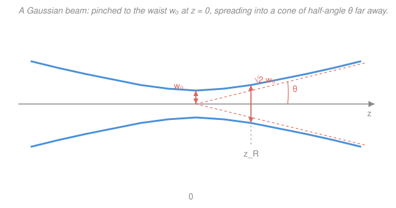

# Quantum Optics & Photonics · Lesson 1.1: Classical EM waves & Gaussian beams

> ⏱ ~15 min · Module 1: Light–matter interaction & lasers · Builds on: [`em-refresher`](../../em-refresher/syllabus.md), [`waves-optics`](../../waves-optics/syllabus.md) · Unlocks: [1.2 The two-level atom & Rabi oscillations](01-02-two-level-atom-rabi-oscillations.md)

## Why this matters

Before we quantize light into photons, we need to know what a *real* laser beam looks like classically — because the quantum states of light (Modules 3–4) live inside exactly these spatial modes. A textbook plane wave fills all of space with infinite energy; a laser instead ships its power in a tight, glowing pencil that focuses to a spot and then, stubbornly, spreads. That spreading isn't sloppy engineering — it's diffraction, and it sets a hard floor on how small you can make a focus. Understanding the **Gaussian beam** tells you how tightly you can trap an atom, how far a beam stays collimated, and why you can't cheat the trade-off between a tiny waist and a non-spreading beam. That last fact is a Fourier uncertainty relation in disguise, and we'll meet its quantum cousin later.

## The idea

Light is a self-propagating ripple in the electromagnetic field: a wiggling electric field makes a wiggling magnetic field makes a wiggling electric field, marching forward at speed $c$. The simplest such ripple is a **plane wave** — flat sheets of field, all in step, filling space. It's the hydrogen atom of optics: exactly solvable, and never quite real.

A laser beam is the next honest step up. Take a plane wave and give it a smooth bulge in brightness across its width — brightest on the axis, fading to the edges like a bell curve. That transverse bell curve is the **Gaussian beam**. Because it's confined sideways, it *cannot* stay perfectly parallel: sideways confinement forces sideways spreading, exactly as squeezing a wave into a narrow slit fans it out behind (diffraction, from your [`waves-optics`](../../waves-optics/syllabus.md) work). So the beam pinches down to a narrowest point — the **waist** — and flares out on either side into a cone. The tighter you pinch it, the harder it flares. You get to choose *tight-and-flaring* or *loose-and-collimated*, but never both. Nature keeps the product fixed.

## The formal version

**Plane wave recap.** A monochromatic plane wave has electric field

$$\mathbf{E}(\mathbf r,t)=\mathbf E_0\cos(\mathbf k\cdot\mathbf r-\omega t),$$

where $\mathbf E_0$ is the amplitude vector (V/m), $\mathbf k$ the **wavevector** pointing along propagation with magnitude $k=2\pi/\lambda$ (rad/m, $\lambda$ = wavelength), and $\omega$ the angular frequency (rad/s). *In words: the field oscillates in space and time, with crests spaced $\lambda$ apart marching at speed $\omega/k$.* In vacuum the **dispersion relation** is

$$\omega = ck,$$

with $c$ the speed of light — so all frequencies travel at the same speed. Maxwell's equations force the wave to be **transverse**: $\mathbf E\perp\mathbf k$ (and $\mathbf B\perp\mathbf E,\mathbf k$). The direction of $\mathbf E_0$ is the **polarization** — fixed for linear polarization, rotating in a circle for circular polarization (two linear components a quarter-cycle out of phase). The **time-averaged intensity** (power per unit area, W/m²) is

$$I=\tfrac12 c\varepsilon_0 |\mathbf E_0|^2,$$

with $\varepsilon_0$ the vacuum permittivity; the $\tfrac12$ is the average of $\cos^2$ over a cycle. *In words: brightness goes as the square of the field amplitude.*

**The Gaussian beam.** Solve Maxwell's equations for a beam traveling along $z$ but confined near the axis (the **paraxial approximation** — rays make small angles with $z$) and the lowest-order solution has intensity

$$I(r,z)=I_0\left(\frac{w_0}{w(z)}\right)^2 \exp\!\left(-\frac{2r^2}{w(z)^2}\right),$$

where $r$ is distance from the axis, $z$ distance along it, and $I_0$ the peak intensity at the waist. *In words: at each cross-section the beam is a Gaussian bell in $r$; as it widens the peak drops to conserve total power.* The width function is

$$w(z)=w_0\sqrt{1+\left(\frac{z}{z_R}\right)^2},$$

where $w_0$ is the **beam waist** — the $1/e^2$-intensity radius at the focus $z=0$, i.e. where the intensity has fallen to $1/e^2\approx13.5\%$ of $I_0$. The scale that governs the spreading is the **Rayleigh range**

$$z_R=\frac{\pi w_0^2}{\lambda}.$$

*In words: $z_R$ is how far you travel from the waist before the beam noticeably widens.* At $z=z_R$ the width has grown to $w(z_R)=\sqrt2\,w_0$ (area doubled). Far from the waist ($z\gg z_R$) the envelope becomes a straight cone with **far-field divergence half-angle**

$$\theta=\frac{\lambda}{\pi w_0}.$$

Two more quantities describe the wavefront's shape. Its **radius of curvature** is

$$R(z)=z\left[1+\left(\frac{z_R}{z}\right)^2\right],$$

flat at the waist ($R\to\infty$ as $z\to0$), tightest curvature at $z=z_R$, and $R\approx z$ far away (spherical waves from a point source). And the on-axis phase carries an extra **Gouy phase** $\zeta(z)=\arctan(z/z_R)$, a slow $\pi$ slip through the focus that shifts a focused beam's phase relative to a plane wave — it will matter for resonator mode frequencies in [1.5](01-05-optical-cavities-laser-modes.md).

**The key relation.** Multiply the waist by the divergence:

$$\boxed{\,w_0\,\theta=\frac{\lambda}{\pi}\,}$$

*In words: waist times spreading angle is a fixed constant set only by the wavelength.* Squeeze the waist $w_0$ down and $\theta$ blows up in exact proportion; there is no free lunch. This is the **diffraction limit**.

## Picture

The blue curves are the $1/e^2$ envelope $\pm w(z)$: a hyperbola pinched to $w_0$ at the waist and asymptotic to the dashed coral cone of half-angle $\theta$. At $z=z_R$ the beam has fattened to $\sqrt2\,w_0$ — that's the natural dividing line between "focused" and "diverging."

## Worked examples

**Example 1 (mechanical — a HeNe beam).** A helium–neon laser, $\lambda=633\ \mathrm{nm}$, has waist $w_0=0.5\ \mathrm{mm}$. Its Rayleigh range is

$$z_R=\frac{\pi w_0^2}{\lambda}=\frac{\pi(5\times10^{-4})^2}{6.33\times10^{-7}}=\frac{\pi(2.5\times10^{-7})}{6.33\times10^{-7}}\approx1.24\ \mathrm{m}.$$

So the beam stays roughly collimated over a couple of meters — good for a lab bench. Its divergence half-angle is

$$\theta=\frac{\lambda}{\pi w_0}=\frac{6.33\times10^{-7}}{\pi(5\times10^{-4})}\approx4.0\times10^{-4}\ \mathrm{rad}=0.40\ \mathrm{mrad},$$

about $0.4\ \mathrm{mm}$ of spread per meter — you'd fill a $\sim1\ \mathrm{m}$ spot at the Moon's distance if not for the atmosphere. And the width $2\ \mathrm m$ downstream is

$$w(2)=w_0\sqrt{1+(2/1.24)^2}=0.5\sqrt{1+2.60}\approx0.5(1.90)=0.95\ \mathrm{mm}.$$

**Example 2 (why you'd care — trapping an atom).** To hold a single atom in an optical tweezer you focus a beam to as tight a waist as possible, because the trap depth grows with peak intensity $I_0\propto1/w_0^2$. Say you want $w_0=1\ \mathrm{\mu m}$ at $\lambda=800\ \mathrm{nm}$. Then

$$z_R=\frac{\pi(10^{-6})^2}{8\times10^{-7}}\approx3.9\ \mathrm{\mu m},$$

so the trap is only a few microns long along the beam — you've bought brightness by giving up axial reach, and you'll need a very short depth of focus and a high-quality lens. The divergence is $\theta=\lambda/(\pi w_0)=800/(\pi\cdot1000)\approx0.25\ \mathrm{rad}\approx15^\circ$ — a wide-open cone, which is why tight tweezers need high-numerical-aperture optics to *capture* that cone. This is the same $w_0$-vs-reach trade the diffraction limit forces on every microscope.

## Watch out

- **You might think you can make a beam both tightly focused and non-spreading by engineering it cleverly.** You can't: $w_0\theta=\lambda/\pi$ is fixed by the wavelength alone. A smaller waist *always* means a bigger divergence and a shorter Rayleigh range ($z_R\propto w_0^2$). The only knob that helps both at once is using a shorter $\lambda$.
- **You might read $w_0$ as the point where the field vanishes.** It's the $1/e^2$ *intensity* radius (equivalently $1/e$ in *field* amplitude), not a hard edge — the Gaussian tail runs to infinity. About $86\%$ of the power lies inside $r<w$.
- **You might confuse the divergence half-angle with the full cone angle.** $\theta=\lambda/(\pi w_0)$ is measured from the axis; the full opening angle of the cone is $2\theta$. Likewise the axial "depth of focus" is the full $2z_R$, not $z_R$.

## One-liner

> A Gaussian beam pinches to a waist $w_0$ and flares into a cone of half-angle $\theta$, with $w_0\theta=\lambda/\pi$ locked by diffraction — you may choose tight or collimated, never both.

## Problems

**P1 (🟢)** A HeNe laser ($\lambda=633\ \mathrm{nm}$) has waist $w_0=0.5\ \mathrm{mm}$. Compute (a) the Rayleigh range $z_R$, (b) the far-field divergence half-angle $\theta$, and (c) the beam radius $w(z)$ at $z=3\ \mathrm{m}$.

**P2 (🟡)** A lens focuses a $\lambda=633\ \mathrm{nm}$ beam to a waist $w_0=20\ \mathrm{\mu m}$. (a) Find the **depth of focus** $2z_R$ (the axial length over which the beam stays within $\sqrt2$ of its waist). (b) You now want to halve the spot to $w_0=10\ \mathrm{\mu m}$. What happens to the depth of focus, and what have you traded away?

**P3 (🔴)** Show that the far-field spot radius a distance $L\gg z_R$ downstream is $w(L)\approx\theta L=\lambda L/(\pi w_0)$, so that a *smaller* waist makes a *bigger* far-field spot. Then argue that $w_0\theta=\lambda/\pi$ is a spatial-frequency bandwidth limit: relate the transverse field width $w_0$ to the spread of transverse wavevectors $\Delta k_\perp$ carried by the beam.

Solutions

**P1** (a) $z_R=\dfrac{\pi w_0^2}{\lambda}=\dfrac{\pi(5\times10^{-4})^2}{6.33\times10^{-7}}=\dfrac{\pi(2.5\times10^{-7})}{6.33\times10^{-7}}\approx1.24\ \mathrm{m}.$

(b) $\theta=\dfrac{\lambda}{\pi w_0}=\dfrac{6.33\times10^{-7}}{\pi(5\times10^{-4})}\approx4.03\times10^{-4}\ \mathrm{rad}=0.40\ \mathrm{mrad}.$

(c) $w(3)=w_0\sqrt{1+(3/z_R)^2}=0.5\sqrt{1+(3/1.24)^2}=0.5\sqrt{1+5.85}=0.5\sqrt{6.85}\approx0.5(2.62)=1.31\ \mathrm{mm}.$

*Check.* At $z=3\ \mathrm m\gg z_R$ we're in the far field, so we'd expect $w\approx\theta z=4.03\times10^{-4}\cdot3=1.21\ \mathrm{mm}$; the exact $1.31\ \mathrm{mm}$ is a touch larger because $3\ \mathrm m$ is only $\sim2.4\,z_R$, not yet deep far-field. ✓ Units: $z_R=\mathrm{m^2/m}=\mathrm m$ ✓, $\theta=\mathrm{m/m}=$ rad ✓.

**P2** (a) $z_R=\dfrac{\pi(20\times10^{-6})^2}{6.33\times10^{-7}}=\dfrac{\pi(4\times10^{-10})}{6.33\times10^{-7}}\approx1.99\times10^{-3}\ \mathrm m\approx2.0\ \mathrm{mm}$, so the depth of focus is $2z_R\approx4.0\ \mathrm{mm}$.

(b) Since $z_R=\pi w_0^2/\lambda\propto w_0^2$, halving $w_0$ *quarters* the depth of focus: $2z_R$ drops from $\approx4.0\ \mathrm{mm}$ to $\approx1.0\ \mathrm{mm}$. You've traded axial reach for a smaller, brighter spot — you gain peak intensity ($I_0\propto1/w_0^2$, up $4\times$) and lateral resolution but the beam now stays focused over a much shorter distance, and it diverges twice as fast ($\theta\propto1/w_0$). This is the microscopy trade-off: higher resolution costs depth of field.

*Check.* $z_R\propto w_0^2$ and $\theta\propto 1/w_0$, consistent with $z_R=w_0/\theta\cdot\ldots$; halving $w_0$ gives $\theta$ up $2\times$ and $z_R$ down $4\times$. ✓

**P3** For $L\gg z_R$, $w(L)=w_0\sqrt{1+(L/z_R)^2}\approx w_0\cdot\dfrac{L}{z_R}=w_0\cdot\dfrac{L\lambda}{\pi w_0^2}=\dfrac{\lambda L}{\pi w_0}=\theta L.$ So the far-field radius is inversely proportional to $w_0$: shrink the waist and the distant spot *grows*. This is the anti-intuitive heart of diffraction.

Now the bandwidth argument. At the waist the transverse field is a Gaussian of width $\sim w_0$: $E(x)\propto e^{-x^2/w_0^2}$. Its **angular spectrum** — the decomposition into transverse spatial frequencies $k_\perp$ — is the Fourier transform of that Gaussian, itself a Gaussian of width $\Delta k_\perp\sim 2/w_0$ (a narrow beam is built from a *wide* range of transverse wavevectors — this is exactly the Fourier reciprocal-width relation from [`fourier-analysis`](../../fourier-analysis/syllabus.md), $\Delta x\,\Delta k\sim1$). Each transverse component $k_\perp$ propagates at angle $\alpha\approx k_\perp/k$ to the axis, so the beam spreads over angular range $\theta\sim\Delta k_\perp/k=(2/w_0)/(2\pi/\lambda)=\lambda/(\pi w_0)$ — recovering $w_0\theta=\lambda/\pi$. So the diffraction limit is a position–momentum bandwidth relation for the transverse field: you cannot localize a beam ($\text{small }w_0$) without giving it a wide spread of directions ($\text{large }\theta$), just as a short pulse needs a wide frequency spectrum. It's the same uncertainty relation that governs single-slit diffraction in [`waves-optics`](../../waves-optics/syllabus.md), and a preview of the photon's position–momentum uncertainty to come.

## Connections

- **Backward:** the plane-wave, polarization, and intensity relations come straight from Maxwell's equations in [`em-refresher`](../../em-refresher/syllabus.md); the beam's spreading is the diffraction you studied in [`waves-optics`](../../waves-optics/syllabus.md), now written as a smooth Gaussian mode instead of a slit pattern.
- **Forward:** these spatial modes are the stage for everything ahead — [1.2 The two-level atom & Rabi oscillations](01-02-two-level-atom-rabi-oscillations.md) drives an atom with this beam's field, [1.5 Optical cavities & laser modes](01-05-optical-cavities-laser-modes.md) traps Gaussian modes between mirrors (where the Gouy phase sets the resonance frequencies), and when we quantize the field in Module 3 it is *these* modes that get promoted to photon-carrying oscillators.
- **Sideways (Fourier optics):** the waist–divergence product $w_0\theta=\lambda/\pi$ is a Fourier reciprocal-width relation between the beam's transverse profile and its angular spectrum — the same $\Delta x\,\Delta k\sim1$ from [`fourier-analysis`](../../fourier-analysis/syllabus.md) that later reappears as the photon's Heisenberg uncertainty.
