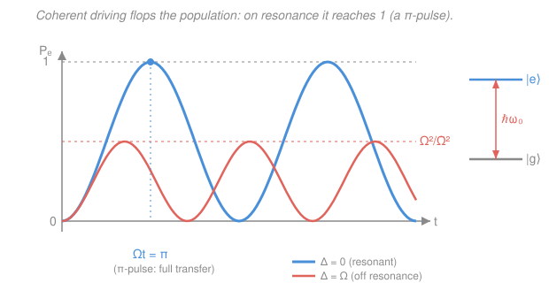

# Quantum Optics & Photonics · Lesson 1.2: The two-level atom & Rabi oscillations

> ⏱ ~15 min · Module 1: Light–matter interaction & lasers · Builds on: [1.1 Classical EM waves & Gaussian beams](01-01-classical-em-waves-gaussian-beams.md), [quantum-mechanics](../../quantum-mechanics/syllabus.md) (two-level systems, time-dependent perturbation theory) · Unlocks: [1.3 Absorption, spontaneous & stimulated emission](01-03-absorption-spontaneous-stimulated-emission.md)

## Why this matters

Shine a laser tuned to an atom's transition and something remarkable happens: the atom doesn't just absorb and stay excited — it climbs to the excited state, then *comes back down*, then climbs again, cycling as long as the light is on. This coherent flopping, **Rabi oscillation**, is the beating heart of atomic clocks, qubit gates, magnetic resonance (MRI), and every "$\pi$-pulse" you'll ever fire at a quantum system. It's also the cleanest place to see the difference between *reversible* coherent driving (this lesson) and the *irreversible* emission of [1.3](01-03-absorption-spontaneous-stimulated-emission.md). Master the two-level atom in a classical field and you own the most-reused model in all of quantum optics.

## The idea

Strip an atom down to just two energy levels: a ground state $|g\rangle$ and an excited state $|e\rangle$, separated by energy $\hbar\omega_0$. Everything else — the other 99 levels — we ignore, because a laser tuned near the $g\to e$ transition barely touches them. The atom's quantum state is a blend of the two, $|\psi\rangle = c_g|g\rangle + c_e|e\rangle$, and the whole game is watching how the light shuffles amplitude between $c_g$ and $c_e$.

Here's the picture that matters. The light's electric field grabs the atom's electric dipole and shakes it. When the field oscillates at *just the right frequency* — resonance with $\omega_0$ — each push lands in phase with the atom's own rhythm, like timing your shoves to a child on a swing. Amplitude piles coherently from $|g\rangle$ into $|e\rangle$ until the atom is fully excited. But the driving doesn't stop there: keep pushing and it coherently pulls the amplitude *back down* to $|g\rangle$. Up, down, up, down — a smooth sinusoidal sloshing whose tempo, the **Rabi frequency** $\Omega$, is set by how hard you drive (field strength $\times$ dipole size).

This is fundamentally unlike the "rate equation" picture where an atom just randomly absorbs a photon and sits excited. Coherent driving is *deterministic and reversible*: at exactly the right moment you can catch the atom fully in $|e\rangle$ (a "$\pi$-pulse") or exactly halfway (a "$\pi/2$-pulse", an equal superposition). The irreversible part — spontaneous decay — is a separate effect we bolt on in 1.3.

## The formal version

**The model.** Two levels, energies $0$ and $\hbar\omega_0$, so the free Hamiltonian is $\hat H_0 = \hbar\omega_0\,|e\rangle\langle e|$. Here $\hbar$ is the reduced Planck constant and $\omega_0$ (rad/s) is the **transition frequency**. The state
$$|\psi(t)\rangle = c_g(t)\,|g\rangle + c_e(t)\,|e\rangle, \qquad |c_g|^2 + |c_e|^2 = 1,$$
has complex amplitudes $c_g, c_e$; $|c_e(t)|^2 \equiv P_e(t)$ is the **excited-state probability**. *In words: the atom is a superposition of down and up, and $P_e$ is the chance a measurement finds it up.*

**The drive.** From [1.1](01-01-classical-em-waves-gaussian-beams.md), a monochromatic field is $\mathbf E(t) = E_0\cos(\omega t)$ with amplitude $E_0$ and laser frequency $\omega$. It couples to the atom's dipole operator $\hat{\mathbf d}$ through the **semiclassical dipole interaction**
$$\hat H_{\text{int}} = -\hat{\mathbf d}\cdot\mathbf E(t).$$
*In words: the energy of a dipole in a field is $-\mathbf d\cdot\mathbf E$ — the field tilts the atom's energy up or down depending on how its dipole is aligned.* ("Semiclassical" = quantum atom, classical field; we quantize the field in Module 3.) The dipole has no diagonal elements (an atom in a definite level has no static dipole, by parity), only the off-diagonal **dipole matrix element**
$$d \equiv \langle e|\hat d|g\rangle,$$
which we take real. So $\hat H_{\text{int}} = -d\,E(t)\big(|e\rangle\langle g| + |g\rangle\langle e|\big)$ — it can only *flip* the atom between levels, never leave it put.

**The Rabi frequency.** Define
$$\boxed{\;\Omega \equiv \dfrac{d\,E_0}{\hbar}\;}\qquad(\text{rad/s}),$$
the coupling strength in frequency units — bigger dipole or brighter field means faster flopping.

**Equations of motion.** Plugging $|\psi\rangle$ into the Schrödinger equation $i\hbar\,|\dot\psi\rangle = (\hat H_0 + \hat H_{\text{int}})|\psi\rangle$ gives two coupled equations for the amplitudes. Move to the "rotating frame" $c_e = b_e\,e^{-i\omega_0 t}$ (factor out the atom's natural spin so only the *slow* driving remains), and $E(t)=E_0\cos\omega t$ splits into two counter-rotating pieces, $e^{\pm i\omega t}$. One beats slowly against the atom, the other beats at the huge frequency $\omega+\omega_0$.

**Rotating-wave approximation (RWA).** Drop the fast $e^{\pm i(\omega+\omega_0)t}$ term — over any relevant timescale it averages to zero — and keep the near-resonant one. Introduce the **detuning**
$$\Delta \equiv \omega - \omega_0,$$
the mismatch between laser and atom. *In words: only the part of the field that rotates *with* the atom does lasting work; the counter-rotating part just jitters.* The equations collapse to the clean pair
$$i\,\dot b_e = -\tfrac{\Omega}{2}\,b_g\,e^{-i\Delta t}, \qquad i\,\dot b_g = -\tfrac{\Omega}{2}\,b_e\,e^{+i\Delta t}.$$

**Solution.** Starting in the ground state ($b_g(0)=1,\,b_e(0)=0$), these give the **Rabi formula**
$$\boxed{\;P_e(t) = \dfrac{\Omega^2}{\tilde\Omega^2}\,\sin^2\!\Big(\dfrac{\tilde\Omega\,t}{2}\Big),\qquad \tilde\Omega \equiv \sqrt{\Omega^2 + \Delta^2}\;}$$
where $\tilde\Omega$ is the **generalized Rabi frequency**.

- **On resonance** ($\Delta=0$, so $\tilde\Omega=\Omega$): $P_e(t) = \sin^2(\Omega t/2)$. The atom flops fully, $0\to1\to0$. At $\Omega t = \pi$ it is *entirely* excited — a **$\pi$-pulse**. At $\Omega t=\pi/2$ it's an equal superposition ($P_e=\tfrac12$) — a **$\pi/2$-pulse**. *In words: on resonance you can drive the atom anywhere you like, deterministically, just by timing the pulse.*
- **Off resonance** ($\Delta\neq0$): two things change. The oscillation is *faster* ($\tilde\Omega>\Omega$) and its amplitude is *capped* at $\Omega^2/\tilde\Omega^2 < 1$ — the atom can never fully invert. *In words: mistune the laser and the atom refuses to climb all the way, and it fidgets more quickly.*

## Picture

Blue is resonance: a full-swing $\sin^2$ that touches 1 at the $\pi$-pulse. Coral is detuned ($\Delta=\Omega$): it never reaches even $\tfrac12$, and it wobbles faster. Same drive strength $\Omega$ — detuning alone steals the amplitude.

## Worked examples

**Example 1 (mechanical — timing a pulse).** A laser drives an atom on resonance with $\Omega = 2\pi\times 1\ \mathrm{MHz} = 2\pi\times10^6\ \mathrm{rad/s}$. How long is a $\pi$-pulse?

The $\pi$-pulse condition is $\Omega t_\pi = \pi$, so
$$t_\pi = \frac{\pi}{\Omega} = \frac{\pi}{2\pi\times10^6\ \mathrm{s^{-1}}} = \frac{1}{2\times10^6\ \mathrm{s^{-1}}} = 500\ \mathrm{ns}.$$
After 500 ns the atom is fully in $|e\rangle$; at 250 ns it's a 50/50 superposition. Turn the laser off at the right instant and you've *set* the atom's state — that's a single-qubit gate.

**Example 2 (why you'd care — detuning as a knob).** Take $\Omega$ fixed but detune to $\Delta = \Omega$. Then
$$\tilde\Omega = \sqrt{\Omega^2 + \Omega^2} = \sqrt2\,\Omega, \qquad P_e^{\max} = \frac{\Omega^2}{\tilde\Omega^2} = \frac{\Omega^2}{2\Omega^2} = \frac12.$$
The best the atom ever does is half-excited (that's the coral curve). This is why atomic clocks and precision spectroscopy live and die by hitting resonance: the height of the Rabi peak is a razor-sharp function of $\Delta$, so measuring "how high does it flop?" tells you exactly how far off you are. The same $\Omega^2/(\Omega^2+\Delta^2)$ Lorentzian shape reappears as the absorption lineshape in [1.3](01-03-absorption-spontaneous-stimulated-emission.md).

## Watch out

- **You might think driving harder pushes the atom higher off-resonance.** Cranking $\Omega$ *does* raise the cap $\Omega^2/(\Omega^2+\Delta^2)$ toward 1 — "power broadening." But at *fixed* $\Omega$, detuning can only lower the ceiling and speed up the wobble; you can't out-time a detuning to reach $P_e=1$. Only $\Delta=0$ gives a true full inversion.
- **You might picture the atom absorbing one photon and stopping.** That's the rate-equation intuition, and it's wrong for coherent driving. With a coherent field the population is a *reversible* sinusoid — keep driving past the $\pi$-pulse and the atom gives its energy *back* to the field (stimulated emission, 1.3). Irreversibility only enters when spontaneous decay breaks the coherence.
- **You might drop the counter-rotating term without noticing you've made an approximation.** The RWA is excellent when $\Omega,|\Delta| \ll \omega_0$ (nearly always true in optics, where $\omega_0\sim10^{15}$ rad/s). It fails for ultra-strong or ultra-fast driving, where the discarded $e^{i(\omega+\omega_0)t}$ term produces small "Bloch–Siegert" shifts.

**Bloch-sphere aside.** Write the state as a point on a sphere ($|g\rangle$ = south pole, $|e\rangle$ = north pole, superpositions on the equator). Then Rabi driving is just *rotation*: the resonant drive tips the state steadily from south to north and back, tracing a great circle at rate $\Omega$. Detuning tilts the rotation axis off the equator, so the state precesses around a slanted axis at rate $\tilde\Omega$ and never quite reaches the north pole — exactly the capped, faster flop. You'll meet this geometry again in quantum computing as the qubit "rotation gate."

## One-liner

> A resonant field flops a two-level atom's population as $\sin^2(\Omega t/2)$ — fully invertible at a $\pi$-pulse; detuning speeds it up to $\tilde\Omega=\sqrt{\Omega^2+\Delta^2}$ and caps it at $\Omega^2/\tilde\Omega^2$.

## Problems

**P1 (🟢)** An atom is driven on resonance with Rabi frequency $\Omega = 2\pi\times 5\ \mathrm{MHz}$. Find the duration of a $\pi$-pulse and of a $\pi/2$-pulse, and state $P_e$ at the end of each.

**P2 (🟡)** The same drive strength $\Omega$ is now detuned so that $\Delta = \tfrac{4}{3}\,\Omega$. Compute the generalized Rabi frequency $\tilde\Omega$ (in units of $\Omega$) and the maximum excited-state probability the atom can reach.

**P3 (🔴)** Show that for very short times the resonant Rabi solution reproduces first-order time-dependent perturbation theory: the excited-state *amplitude* grows *linearly* in $t$ (so $P_e \propto t^2$), independent of detuning. Explain in one sentence how this quadratic-in-$t$ growth is the seed of the decay *rate* in [1.3](01-03-absorption-spontaneous-stimulated-emission.md).

Solutions

**P1** A $\pi$-pulse needs $\Omega t_\pi = \pi$:
$$t_\pi = \frac{\pi}{\Omega} = \frac{\pi}{2\pi\times5\times10^{6}\ \mathrm{s^{-1}}} = \frac{1}{10^{7}\ \mathrm{s^{-1}}} = 100\ \mathrm{ns},\qquad P_e = \sin^2\!\Big(\tfrac{\pi}{2}\Big) = 1.$$
A $\pi/2$-pulse needs $\Omega t = \pi/2$, i.e. half as long:
$$t_{\pi/2} = \frac{\pi}{2\Omega} = 50\ \mathrm{ns},\qquad P_e = \sin^2\!\Big(\tfrac{\pi}{4}\Big) = \Big(\tfrac{1}{\sqrt2}\Big)^2 = \tfrac12.$$
*Check.* The $\pi$-pulse fully inverts; the $\pi/2$-pulse makes the equal superposition $\tfrac{1}{\sqrt2}(|g\rangle \pm |e\rangle)$, exactly the "half-flip" used to open a Ramsey interferometer. ✓

**P2** With $\Delta = \tfrac43\Omega$,
$$\tilde\Omega = \sqrt{\Omega^2 + \Delta^2} = \sqrt{\Omega^2 + \tfrac{16}{9}\Omega^2} = \sqrt{\tfrac{25}{9}}\,\Omega = \tfrac{5}{3}\,\Omega.$$
(A 3-4-5 triangle: $\Omega:\Delta:\tilde\Omega = 3:4:5$.) The maximum is
$$P_e^{\max} = \frac{\Omega^2}{\tilde\Omega^2} = \frac{\Omega^2}{(5/3)^2\Omega^2} = \frac{9}{25} = 0.36.$$
*Check.* Detuning by more than $\Omega$ pulls the ceiling well below $\tfrac12$, as it must ($P_e^{\max}<1$ for any $\Delta\neq0$). The peak is first reached when $\tilde\Omega t/2 = \pi/2$, i.e. $t = \pi/\tilde\Omega = 3\pi/(5\Omega)$ — sooner than the resonant $\pi$-pulse time $\pi/\Omega$, confirming "faster but smaller." ✓

**P3** Start from the exact resonant result $P_e(t) = \sin^2(\Omega t/2)$, or more sharply from the amplitude $b_e(t) = i\sin(\Omega t/2)$. For $\Omega t \ll 1$ use $\sin x \approx x$:
$$b_e(t) \approx i\,\frac{\Omega t}{2} = -\,i\,\frac{d E_0}{2\hbar}\,t,$$
which is **linear in $t$** — the amplitude accumulates at a constant rate. Squaring,
$$P_e(t) \approx \Big(\frac{\Omega t}{2}\Big)^2 = \frac{\Omega^2 t^2}{4}\ \propto\ t^2.$$
This is precisely first-order time-dependent perturbation theory: to lowest order $b_e(t) = \tfrac{1}{i\hbar}\int_0^t \langle e|\hat H_{\text{int}}|g\rangle\,e^{i\omega_0 t'}\,dt'$, and near resonance the integrand is roughly constant ($\approx -\tfrac{\hbar\Omega}{2}$), so the integral $\propto t$ and $|b_e|^2\propto t^2$ — the short-time limit is detuning-independent because the $\tilde\Omega$-vs-$\Omega$ distinction hasn't had time to matter yet.

*One-sentence connection:* when the single excited level is replaced by a continuum of final states (the electromagnetic vacuum modes), summing this $t^2$ growth over all near-resonant channels turns the *reversible* $t^2$ climb into a *constant transition rate* — that's Fermi's golden rule and the origin of the irreversible decay in [1.3](01-03-absorption-spontaneous-stimulated-emission.md). ✓

## Connections

- **Backward:** the classical drive $E(t)=E_0\cos\omega t$ and its frequency $\omega$ come straight from [1.1](01-01-classical-em-waves-gaussian-beams.md); the two-level state, the Schrödinger equation, and time-dependent perturbation theory are the [quantum-mechanics](../../quantum-mechanics/syllabus.md) machinery this lesson specializes to light. Notice $b_e$ obeys $\ddot b_e = -(\Omega/2)^2 b_e$ on resonance — the same harmonic-oscillator equation that governs a mass on a spring, which is why the population *rings*.
- **Forward:** [1.3](01-03-absorption-spontaneous-stimulated-emission.md) adds the missing ingredient — coupling to the infinitely many vacuum modes — turning the reversible Rabi flop into irreversible spontaneous and stimulated emission (via the golden-rule limit of P3). Population inversion built by driving is what feeds laser gain in [1.4](01-04-gain-population-inversion-laser-threshold.md).
- **Sideways (quantum computing):** the $\pi$- and $\pi/2$-pulses and the Bloch-sphere rotation picture are *identical* to single-qubit gates — an X-gate is a $\pi$-pulse, a Hadamard-like operation is a $\pi/2$-pulse. The same Rabi physics runs NMR/MRI spin flips and the atomic-clock Ramsey sequence.
