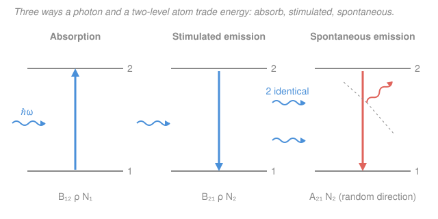

# Quantum Optics & Photonics · Lesson 1.3: Absorption, spontaneous & stimulated emission

> ⏱ ~15 min · Module 1: Light–matter interaction & lasers · Builds on: [1.2 The two-level atom & Rabi oscillations](01-02-two-level-atom-rabi-oscillations.md) · Unlocks: [1.4 Gain, population inversion & laser threshold](01-04-gain-population-inversion-laser-threshold.md)

## Why this matters

A laser works because one photon can talk an excited atom into emitting a *second photon exactly like it* — same direction, same frequency, same phase. That process, **stimulated emission**, was pure theory when Einstein wrote it down in 1917, decades before anyone built a laser. What makes his argument breathtaking is the third process he was *forced* to include: **spontaneous emission**. Einstein proved, using nothing but thermodynamics, that if absorption exists then spontaneous emission *must* exist too — and he fixed its rate exactly, without any quantum field theory. This lesson is that argument. It gives you the three rate constants ($A_{21}$, $B_{12}$, $B_{21}$) that every laser, LED, and atomic clock is built on, and it tells you which process wins at which frequency — the reason optical lasers are easy but X-ray lasers are brutal.

## The idea

Put an atom with two energy levels — a lower one (**level 1**, energy $E_1$) and an upper one (**level 2**, energy $E_2$) — inside a bath of light. The energy gap matches a photon: $E_2 - E_1 = \hbar\omega$. Three things can happen:

1. **Absorption.** A passing photon is swallowed; the atom jumps $1 \to 2$. No light, no absorption — it needs a photon to eat.
2. **Stimulated emission.** A passing photon tickles an *already-excited* atom into dropping $2 \to 1$ and emitting a *clone* of the passing photon. Now there are two identical photons where there was one. This is amplification — the "A" and "SE" in "LASER."
3. **Spontaneous emission.** An excited atom drops $2 \to 1$ *on its own*, with no photon around to trigger it, spitting out a photon in a random direction at a random phase. This is why a hot filament or a lone excited atom glows in the dark.

Here's the miracle. Absorption and stimulated emission both need light to be present, so their rates scale with how much light there is. Spontaneous emission happens even in the dark. You'd think these are independent knobs. **They are not.** Einstein showed that demanding thermal equilibrium look right — the atoms following Boltzmann, the light following Planck's blackbody law — locks all three rates together. Spontaneous emission is not an optional extra you bolt on; it is *demanded* by the same physics that gives absorption.

## The formal version

Let $N_1$ and $N_2$ be the number of atoms (per unit volume) in levels 1 and 2. Let $\rho(\omega)$ be the **spectral energy density** of the light — energy per unit volume per unit angular frequency, in $\text{J}\,\text{s}/\text{m}^3$ — at the transition frequency $\omega = (E_2-E_1)/\hbar$. Einstein posited three rates (transitions per unit volume per unit time):

$$
\underbrace{B_{12}\,\rho(\omega)\,N_1}_{\text{absorption}}, \qquad
\underbrace{B_{21}\,\rho(\omega)\,N_2}_{\text{stimulated emission}}, \qquad
\underbrace{A_{21}\,N_2}_{\text{spontaneous emission}}.
$$

*In words: the two light-driven processes are proportional to how much light $\rho$ is present and how many atoms are in the starting level; spontaneous emission depends only on how many atoms are up top.* The constants $B_{12}, B_{21}$ (units $\text{m}^3/(\text{J}\,\text{s}^2)$) and $A_{21}$ (units $1/\text{s}$) are the **Einstein coefficients** — intrinsic properties of the atom.

**Detailed balance.** In thermal equilibrium the upper population is steady, $\dfrac{dN_2}{dt}=0$. Every atom leaving level 2 (by both emissions) is replaced by one arriving (by absorption):

$$
B_{12}\rho N_1 = B_{21}\rho N_2 + A_{21}N_2.
$$

*In words: up-rate equals down-rate.* Solve for the light:

$$
\rho(\omega) = \frac{A_{21}N_2}{B_{12}N_1 - B_{21}N_2}
= \frac{A_{21}/B_{21}}{\dfrac{B_{12}}{B_{21}}\dfrac{N_1}{N_2} - 1}.
$$

Now bring in the two laws thermal equilibrium *must* obey. The atoms follow **Boltzmann**:

$$
\frac{N_2}{N_1} = e^{-\hbar\omega/k_BT} \quad\Longrightarrow\quad \frac{N_1}{N_2} = e^{\hbar\omega/k_BT},
$$

with $k_B$ Boltzmann's constant and $T$ the temperature. Substituting,

$$
\rho(\omega) = \frac{A_{21}/B_{21}}{\dfrac{B_{12}}{B_{21}}\,e^{\hbar\omega/k_BT} - 1}.
$$

But we *already know* $\rho(\omega)$ in thermal equilibrium — it is the **Planck blackbody law**:

$$
\rho(\omega) = \frac{\hbar\omega^3}{\pi^2 c^3}\,\frac{1}{e^{\hbar\omega/k_BT} - 1}.
$$

For our formula to equal Planck's *at every temperature $T$*, two things must match, term by term:

$$
\boxed{\,B_{12} = B_{21}\,} \qquad\text{and}\qquad \boxed{\,\frac{A_{21}}{B_{21}} = \frac{\hbar\omega^3}{\pi^2 c^3}\,}.
$$

*In words: absorption and stimulated emission are equally strong ($B_{12}=B_{21}$), and the spontaneous rate is rigidly fixed by the stimulated one — you cannot have one without the other.* (If the levels are degenerate with multiplicities $g_1, g_2$, the first relation generalizes to $g_1 B_{12} = g_2 B_{21}$; the $A/B$ relation is unchanged. We take $g_1=g_2$ here.)

**The punchline.** Spontaneous emission was not assumed — it fell out. Set $A_{21}=0$ and there is *no* way to reproduce the "$-1$" in Planck's denominator; equilibrium breaks. Physically, $A_{21}$ is stimulated emission triggered by the **vacuum** — the zero-point fluctuations of the electromagnetic field, which we quantize in [3.1](03-01-quantizing-em-field.md) and [3.2](03-02-fock-states-vacuum-zero-point.md). The atom is never truly in the dark. And the ratio scales as

$$
\frac{A_{21}}{B_{21}} \propto \omega^3,
$$

so spontaneous emission grows *fast* with frequency: negligible at microwave, dominant at optical, catastrophic at X-ray.

## Picture

## Worked examples

**Example 1 (the three rates side by side).** An excited atom sits in a light field. Compare its chance of dropping by stimulated vs spontaneous emission. Per excited atom, stimulated rate is $B_{21}\rho$ and spontaneous rate is $A_{21}$, so

$$
\frac{\text{stimulated}}{\text{spontaneous}} = \frac{B_{21}\rho}{A_{21}} = \frac{\rho}{A_{21}/B_{21}} = \frac{\pi^2 c^3}{\hbar\omega^3}\,\rho(\omega).
$$

For *thermal* light, plug in Planck's $\rho$: the $\hbar\omega^3/\pi^2c^3$ factors cancel and you get the beautifully simple

$$
\frac{\text{stimulated}}{\text{spontaneous}} = \frac{1}{e^{\hbar\omega/k_BT}-1} = \bar n,
$$

the **mean number of photons per mode**. *Stimulated emission beats spontaneous exactly when there's more than one photon per mode.* At optical frequencies in any thermal source $\bar n \ll 1$, so spontaneous wins — thermal light can't lase. A laser cheats by cramming $\bar n \sim 10^{10}$ photons into one mode.

**Example 2 (why microwaves went first).** The maser (microwave laser) was built in 1954, six years before the optical laser — not an accident. Because $A/B \propto \omega^3$, drop from optical ($\omega \sim 3\times10^{15}\,\text{rad/s}$) to microwave ($\omega \sim 1\times10^{11}\,\text{rad/s}$), a factor $\sim 3\times10^4$ down in frequency, and spontaneous emission plummets by $(3\times10^4)^3 \sim 3\times10^{13}$. At microwave frequencies even a room-temperature thermal field already has $\bar n \gg 1$, so stimulated emission dominates *for free*. Push the other way toward X-rays and $A_{21}$ explodes: excited atoms dump their energy spontaneously before you can stimulate them, which is exactly why coherent X-ray sources are so hard to build.

## Watch out

- **You might think spontaneous emission is a separate, "classical" decay you add by hand.** Actually it is forced by the same detailed-balance argument that gives absorption — and it *is* emission stimulated by vacuum fluctuations. There is no consistent world with absorption but no spontaneous emission.
- **You might think a stimulated photon just goes "somewhere."** No — it is emitted into the *same mode* as the photon that triggered it: identical direction, frequency, polarization, and phase. That cloning is the entire basis of laser coherence and gain ([1.4](01-04-gain-population-inversion-laser-threshold.md)). Spontaneous photons, by contrast, come out in random directions and phases.
- **You might read $B_{12}=B_{21}$ as "absorption and emission always balance."** They don't — the *coefficients* are equal, but the *rates* are $B\rho N_1$ vs $B\rho N_2$. Which wins depends entirely on the populations. In thermal equilibrium $N_1 > N_2$ so absorption wins; flip that (population **inversion**, $N_2 > N_1$) and stimulated emission wins and light gets amplified. That flip is the whole game of the next lesson.

## One-liner

> Thermodynamics alone forces three processes with locked-together rates — $B_{12}=B_{21}$ and $A_{21}/B_{21}=\hbar\omega^3/\pi^2c^3$ — so spontaneous emission is mandatory, it's vacuum-stimulated emission, and its $\omega^3$ growth is why lasing is easy in the microwave and murder in the X-ray.

## Problems

**P1 (🟢)** An atom's upper level has lifetime $\tau = 10\ \text{ns}$, so $A_{21} = 1/\tau = 10^8\ \text{s}^{-1}$, at optical frequency $\omega = 3\times10^{15}\ \text{rad/s}$. It sits in a light field with spectral energy density $\rho(\omega) = 1\times10^{-15}\ \text{J}\,\text{s}/\text{m}^3$. Using $A_{21}/B_{21}=\hbar\omega^3/\pi^2c^3$ (with $\hbar = 1.05\times10^{-34}\ \text{J}\,\text{s}$, $c = 3\times10^8\ \text{m/s}$), find the stimulated-emission rate per excited atom and compare it to the spontaneous rate. Which dominates?

**P2 (🟡)** Reproduce Einstein's matching. Starting from detailed balance $B_{12}\rho N_1 = B_{21}\rho N_2 + A_{21}N_2$, substitute the Boltzmann ratio $N_1/N_2 = e^{\hbar\omega/k_BT}$, solve for $\rho(\omega)$, and by comparing with the Planck law derive both $B_{12}=B_{21}$ and $A_{21}/B_{21}=\hbar\omega^3/\pi^2c^3$. State clearly *why* the match must hold at all $T$.

**P3 (🔴)** In broad daylight, sunlight is roughly thermal at $T = 5800\ \text{K}$. For an optical transition at $\omega = 3\times10^{15}\ \text{rad/s}$, estimate the ratio of *spontaneous* to *stimulated* emission for an atom bathed in sunlight. Then say what changes inside a laser cavity, and use the $\omega^3$ scaling to explain in one line why a microwave maser sees the opposite balance. (Use $k_B = 1.38\times10^{-23}\ \text{J/K}$, $\hbar = 1.05\times10^{-34}\ \text{J}\,\text{s}$.)

Solutions

**P1** First the ratio $A_{21}/B_{21}$:

$$
\frac{A_{21}}{B_{21}} = \frac{\hbar\omega^3}{\pi^2 c^3}
= \frac{(1.05\times10^{-34})(3\times10^{15})^3}{\pi^2 (3\times10^8)^3}
= \frac{(1.05\times10^{-34})(2.7\times10^{46})}{(9.87)(2.7\times10^{25})}
\approx 1.06\times10^{-14}\ \text{J}\,\text{s}/\text{m}^3.
$$

The stimulated rate per excited atom is $B_{21}\rho$, and dividing by $A_{21}$ gives

$$
\frac{\text{stimulated}}{\text{spontaneous}} = \frac{B_{21}\rho}{A_{21}} = \frac{\rho}{A_{21}/B_{21}}
= \frac{1\times10^{-15}}{1.06\times10^{-14}} \approx 0.094.
$$

So the stimulated rate is $0.094 \times A_{21} = 0.094\times10^8 \approx 9.4\times10^{6}\ \text{s}^{-1}$, versus a spontaneous rate of $10^{8}\ \text{s}^{-1}$. **Spontaneous emission dominates by about 11-to-1** — this field is far too weak to lase.

*Check.* $\rho/(A/B)$ is dimensionless (both are $\text{J}\,\text{s}/\text{m}^3$) ✓, and equals $\bar n$, the photons per mode — well below 1, exactly where spontaneous should win. ✓

**P2** Divide detailed balance by $N_2$ and use $N_1/N_2 = e^{\hbar\omega/k_BT}$:

$$
B_{12}\rho\,e^{\hbar\omega/k_BT} = B_{21}\rho + A_{21}
\;\Longrightarrow\;
\rho = \frac{A_{21}}{B_{12}e^{\hbar\omega/k_BT} - B_{21}}
= \frac{A_{21}/B_{21}}{\dfrac{B_{12}}{B_{21}}e^{\hbar\omega/k_BT} - 1}.
$$

Set this equal to Planck, $\rho = \dfrac{\hbar\omega^3}{\pi^2c^3}\dfrac{1}{e^{\hbar\omega/k_BT}-1}$. The two expressions are functions of $T$ through the variable $x \equiv e^{\hbar\omega/k_BT}$, which sweeps over all values in $(1,\infty)$ as $T$ runs over all temperatures. Two rational functions of $x$ that agree for a whole interval of $x$ must have matching numerators and denominators:

- **Denominators:** $\frac{B_{12}}{B_{21}}x - 1$ must equal $x - 1$, forcing $\dfrac{B_{12}}{B_{21}} = 1$, i.e. $B_{12} = B_{21}$.
- **Numerators:** with the denominators matched, $\dfrac{A_{21}}{B_{21}} = \dfrac{\hbar\omega^3}{\pi^2c^3}$.

The match *must* hold at every $T$ because a single fixed atom (fixed $A_{21}, B_{12}, B_{21}$) has to be in equilibrium with blackbody radiation at *any* temperature — the coefficients are properties of the atom, not of the bath, so one identity has to cover all $T$. That universality is what pins the coefficients down. ∎

**P3** For a thermal field, Example 1 gives $\dfrac{\text{spontaneous}}{\text{stimulated}} = e^{\hbar\omega/k_BT} - 1$. Compute the exponent:

$$
\frac{\hbar\omega}{k_BT} = \frac{(1.05\times10^{-34})(3\times10^{15})}{(1.38\times10^{-23})(5800)}
= \frac{3.15\times10^{-19}}{8.0\times10^{-20}} \approx 3.9.
$$

So

$$
\frac{\text{spontaneous}}{\text{stimulated}} = e^{3.9} - 1 \approx 49 - 1 \approx 48.
$$

Even in full sunlight, spontaneous emission outpaces stimulated emission by roughly **50-to-1** at optical frequencies (equivalently $\bar n \approx 1/48 \approx 0.02$ photons per mode). Thermal light — sunlight included — cannot amplify itself; you can't build a laser out of a hot lamp.

Inside a **laser cavity** two things change: (i) a mirror cavity funnels essentially all the light into a *single* mode, and (ii) population inversion pumps $N_2 > N_1$. The mode fills with $\bar n \sim 10^{9}$–$10^{12}$ photons, so stimulated/spontaneous $= \bar n \gg 1$ and stimulated emission overwhelmingly wins — coherent amplification.

**Microwave one-liner:** because $A/B \propto \omega^3$, at maser frequencies ($\omega \sim 10^{11}$, some $10^{4}\times$ lower) spontaneous emission is down by $\sim 10^{12}$, and $\hbar\omega/k_BT \ll 1$ makes $\bar n = 1/(e^{\hbar\omega/k_BT}-1) \gg 1$ even at room temperature — so stimulated emission dominates *for free*, which is why the maser beat the laser to the lab.

## Flashback

**From Lesson 1.2 (The two-level atom & Rabi oscillations):** A two-level atom is driven off-resonance with Rabi frequency $\Omega = 3\times10^{7}\ \text{rad/s}$ and detuning $\Delta = 4\times10^{7}\ \text{rad/s}$, starting in the ground state. (a) Find the generalized Rabi frequency $\Omega' = \sqrt{\Omega^2 + \Delta^2}$. (b) Find the *maximum* excited-state probability the drive can ever produce. (c) Find how long it takes to first reach that maximum. (Fresh variant — different numbers, tidy 3-4-5 triangle.)

Solution

The off-resonant Rabi formula from 1.2 is

$$
P_e(t) = \frac{\Omega^2}{\Omega^2 + \Delta^2}\,\sin^2\!\left(\frac{\Omega' t}{2}\right), \qquad \Omega' = \sqrt{\Omega^2 + \Delta^2}.
$$

**(a)** $\Omega' = \sqrt{(3\times10^7)^2 + (4\times10^7)^2} = \sqrt{(9+16)\times10^{14}} = \sqrt{25\times10^{14}} = 5\times10^{7}\ \text{rad/s}.$

**(b)** The $\sin^2$ maxes at 1, so the peak excitation is the prefactor:

$$
P_e^{\max} = \frac{\Omega^2}{\Omega^2+\Delta^2} = \frac{9}{25} = 0.36.
$$

Detuning caps the transfer at 36% — you can never fully invert an off-resonant atom.

**(c)** The first maximum is when $\dfrac{\Omega' t}{2} = \dfrac{\pi}{2}$, i.e. $t = \dfrac{\pi}{\Omega'} = \dfrac{\pi}{5\times10^{7}} \approx 6.3\times10^{-8}\ \text{s} \approx 63\ \text{ns}.$

*Check.* On resonance ($\Delta=0$) the prefactor would be 1 (full inversion) and $\Omega'=\Omega$, recovering the pure Rabi flopping of 1.2. Nonzero detuning both speeds the flopping ($\Omega'>\Omega$) and shrinks its amplitude — exactly what we found. ✓

## Connections

- **Backward:** the $B$ coefficients are the coarse-grained, rate-equation face of the coherent $1\leftrightarrow2$ dynamics from [1.2](01-02-two-level-atom-rabi-oscillations.md) — average Rabi flopping over many atoms with random phases and dephasing, and smooth oscillation becomes a steady transition *rate* $B\rho$. The blackbody spectrum $\rho(\omega)$ is the many-mode version of the single classical field in [1.1](01-01-classical-em-waves-gaussian-beams.md).
- **Forward:** [1.4](01-04-gain-population-inversion-laser-threshold.md) turns these three rates into a net gain: light is amplified only when stimulated emission beats absorption, i.e. when $N_2 > N_1$ (population inversion), and threshold is where that gain overcomes cavity loss. The photon-cloning property of stimulated emission is what makes the amplified light coherent.
- **Sideways:** $A_{21}$ as *vacuum-stimulated* emission is a first glimpse of a quantized field — the same zero-point fluctuations become the vacuum Fock state $|0\rangle$ in [3.2](03-02-fock-states-vacuum-zero-point.md), and its harmonic-oscillator origin comes from quantum mechanics. The Boltzmann factor and the Planck law that drive the whole argument are the thermal-equilibrium and blackbody results from statistical mechanics — see the [stat-mech](../../stat-mech/syllabus.md) syllabus; the $\bar n = 1/(e^{\hbar\omega/k_BT}-1)$ that emerged in Example 1 is precisely the Bose–Einstein occupation of a mode.
