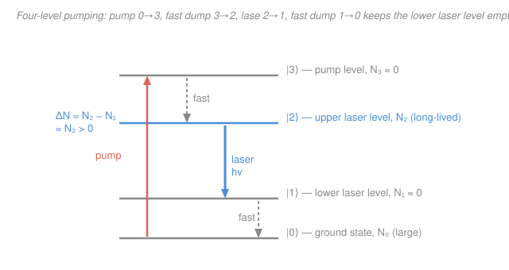

# Quantum Optics & Photonics · Lesson 1.4: Gain, population inversion & laser threshold

> ⏱ ~15 min · Module 1: Light–matter interaction & lasers · Builds on: [1.3 Absorption, spontaneous & stimulated emission](01-03-absorption-spontaneous-stimulated-emission.md) · Unlocks: [1.5 Optical cavities & laser modes](01-05-optical-cavities-laser-modes.md)

## Why this matters

In [1.3](01-03-absorption-spontaneous-stimulated-emission.md) you met the three ways light and atoms trade energy: absorption, spontaneous emission, and *stimulated* emission — the one where an incoming photon clones itself. A laser is a machine built to make that cloning win. But there's a catch baked into thermodynamics: left alone, matter always *absorbs* more than it amplifies. This lesson is the turning point where a medium flips from eating light to multiplying it — the single condition (**population inversion**) that makes a laser possible, why nature refuses to give it to you for free, and how much amplification you need before the whole thing lases. It's the payoff of the module: compute a laser threshold.

## The idea

Send a beam into a slab of atoms. Every atom in the lower state that meets a photon *absorbs* it (one photon gone); every atom in the upper state that meets a photon is *stimulated* to emit a twin (one photon gained). The two processes have the **same** per-atom rate (that was the Einstein symmetry $B_{12}=B_{21}$ from 1.3), so the beam's fate is decided by a headcount: are there more atoms up top or down below?

- More in the lower state → net absorption → the beam dies exponentially (Beer's law).
- Equal numbers → the gains and losses cancel → the medium is **transparent**.
- More in the *upper* state → net stimulated emission → the beam *grows* exponentially. This upside-down population is called a **population inversion**, and it is the whole secret of the laser.

Here's the rub. A population is "inverted" only if the high-energy level is more crowded than the low-energy one — which never happens on its own, because thermal equilibrium always packs atoms into the *lowest* available states (Boltzmann). So you must actively **pump** energy in to lift atoms upward faster than they fall. And — this is the subtle part — you cannot pump a plain two-level atom into inversion with light, no matter how hard you shine: the same beam that lifts atoms up also stimulates them straight back down, so the best you ever reach is a tie (transparency). The escape is to give the atom *more levels* to work with.

## The formal version

**Gain and the exponential beam.** Let $N_2$ and $N_1$ be the number densities (atoms per m³, units m⁻³) in the upper and lower states of the lasing transition, and let $\sigma$ be the **stimulated-emission cross section** (m²) — an effective "target area" each atom presents to a resonant photon (it packages the Einstein $B$ coefficient and the lineshape from 1.3). A beam of intensity $I$ (W/m²) travelling a distance $z$ through the medium obeys

$$\frac{dI}{dz} = \gamma\, I, \qquad \gamma \equiv \sigma\,(N_2 - N_1).$$

*In words: the beam grows (or shrinks) at a fractional rate $\gamma$ per metre, and $\gamma$ just counts the population difference times the per-atom cross section.* The quantity $\gamma$ (m⁻¹) is the **gain coefficient**. Integrating gives

$$I(z) = I_0\, e^{\gamma z}.$$

Two regimes fall straight out of the sign of $N_2-N_1$:

- **Absorption** ($N_2 < N_1$): write $\gamma = -\alpha$ with $\alpha = \sigma(N_1-N_2) > 0$, and this is exactly **Beer's law** $I = I_0 e^{-\alpha z}$ — the beam decays. This is the everyday case.
- **Amplification** ($N_2 > N_1$): $\gamma > 0$, the beam grows. Define the **population inversion**

$$\Delta N \equiv N_2 - N_1 > 0, \qquad \gamma = \sigma\,\Delta N.$$

*In words: positive inversion means more atoms upstairs than down, and only then does the medium amplify.*

**Why inversion is unnatural.** In thermal equilibrium at temperature $T$, the Boltzmann factor fixes the ratio (see [`stat-mech`](../../stat-mech/syllabus.md)):

$$\frac{N_2}{N_1} = e^{-(E_2-E_1)/k_BT} = e^{-h\nu/k_BT} < 1,$$

with $k_B$ Boltzmann's constant, $E_2-E_1 = h\nu$ the transition energy, and $\nu$ its frequency. Since the exponent is negative, $N_2 < N_1$ *always* — equilibrium matter absorbs. Even $T\to\infty$ only gives $N_2/N_1\to 1$ (a tie). **To get $\Delta N>0$ you must drive the system out of equilibrium — you must pump.** And a bare two-level atom can't be pumped there by light: the pump beam stimulates emission as readily as absorption, so the populations can at best equalise ($N_2=N_1$, transparency). You need extra levels.

**Three-level vs four-level.** The trick is to pump into one level and lase out of another.

- **Three-level (e.g. ruby):** pump $0\to 3$, atoms decay fast $3\to 2$, and lase on $2\to 0$ — the lower laser level *is* the ground state. To invert, you must lift **more than half of all the atoms** out of a normally-crammed ground state. Costly: high threshold.
- **Four-level (e.g. Nd:YAG):** pump $0\to 3$, fast decay $3\to 2$, lase on $2\to 1$, then a fast decay $1\to 0$ empties the lower laser level almost as soon as it fills. Because $N_1\approx 0$ at all times, *any* $N_2>0$ already means $\Delta N>0$. Inversion is nearly free: low threshold.

**Gain saturation.** As $I$ grows it stimulates emission faster and faster, draining $N_2$ back toward $N_1$ — so the inversion, and therefore the gain, *shrinks* as the beam brightens. The steady-state result is

$$\gamma(I) = \frac{\gamma_0}{1 + I/I_\text{sat}},$$

where $\gamma_0$ is the **small-signal (unsaturated) gain** at low intensity and $I_\text{sat}$ (W/m²) is the **saturation intensity** — the intensity at which the gain drops to half. *In words: the medium can only supply so much power; push harder and each metre gives proportionally less amplification.* This self-limiting is exactly what pins a running laser to a steady output instead of blowing up.

**Threshold — gain equals loss.** A laser isn't just an amplifier; it's an amplifier inside a mirrored box (that's [1.5](01-05-optical-cavities-laser-modes.md)). For now, the key idea: light makes passes through the gain medium of length $\ell$, picking up a single-pass gain factor

$$G = e^{\gamma\ell},$$

but loses a fraction each round trip to mirror transmission and scattering. **Threshold** is the break-even point where amplification exactly refills what's lost:

$$\text{round-trip gain} = \text{round-trip loss}.$$

Below it the light dies; above it, it builds until saturation clamps it. Setting the required $\gamma$ at threshold, $\gamma_\text{th}$, gives the **threshold inversion**

$$\Delta N_\text{th} = \frac{\gamma_\text{th}}{\sigma}.$$

*In words: to lase, you must pump the inversion up to at least the point where each pass's gain covers the round-trip losses.* The full mirror-and-cavity version arrives in 1.5.

## Picture

## Worked examples

**Example 1 (mechanical — gain from an inversion).** An Nd:YAG rod has cross section $\sigma = 3\times10^{-23}\ \mathrm{m^2}$ and length $\ell = 0.10\ \mathrm{m}$, pumped to an inversion $\Delta N = 1.0\times10^{22}\ \mathrm{m^{-3}}$. The gain coefficient is

$$\gamma = \sigma\,\Delta N = (3\times10^{-23})(1.0\times10^{22}) = 0.30\ \mathrm{m^{-1}},$$

so a single pass multiplies the beam by

$$G = e^{\gamma\ell} = e^{0.30\times0.10} = e^{0.030} \approx 1.030.$$

About 3% amplification per pass — modest, which is exactly why you need a cavity to make the light pass through many times.

**Example 2 (why you'd care — reading a threshold).** Suppose that rod's mirrors and internal losses eat 5% of the intensity per single pass, so to break even each pass must *supply* 5%: $G_\text{th} = e^{\gamma_\text{th}\ell} = 1.05$. Then

$$\gamma_\text{th}\ell = \ln 1.05 = 0.0488 \;\Rightarrow\; \gamma_\text{th} = \frac{0.0488}{0.10} = 0.488\ \mathrm{m^{-1}},$$

$$\Delta N_\text{th} = \frac{\gamma_\text{th}}{\sigma} = \frac{0.488}{3\times10^{-23}} \approx 1.6\times10^{22}\ \mathrm{m^{-3}}.$$

Pump the inversion past $1.6\times10^{22}\ \mathrm{m^{-3}}$ and the rod lases; below it, no beam. Everything downstream — how hard to pump, how bright the output — hangs off this number.

## Watch out

- **You might think a strong enough light beam can invert a two-level atom.** It can't. Because $B_{12}=B_{21}$, the beam drives up and down at equal per-atom rates, so it can at best equalise the populations ($N_2=N_1$) — transparency, never gain. The extra pump levels aren't a convenience; they're mandatory.
- **You might think "the upper level is more populated" is a weird special case.** It's not weird — it's *forbidden* in equilibrium. $N_2>N_1$ corresponds to a formally *negative* temperature in the Boltzmann formula; you are holding the medium out of equilibrium by force. Cut the pump and it collapses back to absorbing in nanoseconds.
- **You might expect more pump always means more gain.** Only until saturation. As $I$ climbs, $\gamma = \gamma_0/(1+I/I_\text{sat})$ falls — the beam eats its own inversion. A running laser sits exactly where the saturated gain has dropped to equal the loss.
- **Don't conflate $\alpha$ and $\gamma$.** They're the *same coefficient* with opposite sign: $\gamma = -\alpha$. Absorption ($\alpha>0$) and gain ($\gamma>0$) are two readings of the one quantity $\sigma(N_2-N_1)$.

## One-liner

> A medium amplifies only when the upper state outnumbers the lower ($\Delta N = N_2-N_1>0$), a state nature forbids in equilibrium and you must pump for — and it lases once the pumped gain $\gamma=\sigma\Delta N$ finally covers the round-trip loss.

## Problems

**P1 (🟢)** A four-level laser crystal has $\sigma = 2.0\times10^{-23}\ \mathrm{m^2}$ and length $\ell = 5.0\ \mathrm{cm}$. (a) If it is pumped to $\Delta N = 4.0\times10^{22}\ \mathrm{m^{-3}}$, find the gain coefficient $\gamma$ and the single-pass gain $G$. (b) If reaching threshold requires a single-pass gain of $G_\text{th}=1.04$, find the threshold inversion $\Delta N_\text{th}$.

**P2 (🟡)** A gain medium has small-signal gain $\gamma_0 = 0.50\ \mathrm{m^{-1}}$ and saturation intensity $I_\text{sat} = 1.2\times10^{7}\ \mathrm{W/m^2}$. (a) What is the gain coefficient when the beam intensity is $I = 3\,I_\text{sat}$? (b) At what intensity $I$ has the gain fallen to *half* its small-signal value?

**P3 (🔴)** A ruby (three-level) medium and a Nd:YAG (four-level) medium each contain a total active-ion density $N_\text{tot} = 1.0\times10^{25}\ \mathrm{m^{-3}}$, and each needs the *same* threshold inversion $\Delta N_\text{th} = 1.6\times10^{22}\ \mathrm{m^{-3}}$ to lase. For the three-level case the lower laser level is the ground state (so $N_1 + N_2 \approx N_\text{tot}$); for the four-level case the lower laser level stays empty ($N_1\approx0$). Find the upper-level population $N_2$ each design must reach at threshold, take the ratio, and explain in one sentence — tying back to the Boltzmann result from [1.3](01-03-absorption-spontaneous-stimulated-emission.md) — why the four-level laser has a far lower pump threshold.

Solutions

**P1** With $\ell = 5.0\ \mathrm{cm} = 0.050\ \mathrm{m}$.

(a) Gain coefficient:
$$\gamma = \sigma\,\Delta N = (2.0\times10^{-23})(4.0\times10^{22}) = 0.80\ \mathrm{m^{-1}}.$$
Single-pass gain:
$$G = e^{\gamma\ell} = e^{0.80\times0.050} = e^{0.040} \approx 1.041,$$
i.e. about 4.1% amplification per pass.

(b) Threshold requires $e^{\gamma_\text{th}\ell} = 1.04$, so
$$\gamma_\text{th} = \frac{\ln 1.04}{\ell} = \frac{0.0392}{0.050} = 0.784\ \mathrm{m^{-1}},$$
$$\Delta N_\text{th} = \frac{\gamma_\text{th}}{\sigma} = \frac{0.784}{2.0\times10^{-23}} \approx 3.9\times10^{22}\ \mathrm{m^{-3}}.$$
*Check.* This is just below the $4.0\times10^{22}$ of part (a), consistent with (a)'s single-pass gain $1.041$ sitting just above the $1.04$ threshold — the medium in (a) is barely lasing. ✓

**P2** (a) Saturated gain with $I/I_\text{sat} = 3$:
$$\gamma = \frac{\gamma_0}{1 + I/I_\text{sat}} = \frac{0.50}{1+3} = \frac{0.50}{4} = 0.125\ \mathrm{m^{-1}}.$$
(b) Half gain means $\gamma = \gamma_0/2$, so
$$\frac{\gamma_0}{1+I/I_\text{sat}} = \frac{\gamma_0}{2} \;\Rightarrow\; 1 + I/I_\text{sat} = 2 \;\Rightarrow\; I = I_\text{sat} = 1.2\times10^{7}\ \mathrm{W/m^2}.$$
*Check.* This is the definition of the saturation intensity: the gain halves precisely at $I = I_\text{sat}$. ✓

**P3** Set $\Delta N = N_2 - N_1 = \Delta N_\text{th}$ in each case.

*Three-level* ($N_1+N_2\approx N_\text{tot}$): solve the pair $N_2 - N_1 = \Delta N_\text{th}$, $N_2 + N_1 = N_\text{tot}$:
$$N_2 = \frac{N_\text{tot} + \Delta N_\text{th}}{2} = \frac{1.0\times10^{25} + 1.6\times10^{22}}{2} \approx 5.0\times10^{24}\ \mathrm{m^{-3}}.$$
You must lift **more than half of all the ions** into the upper state — the tiny $\Delta N_\text{th}$ is a rounding error next to $N_\text{tot}/2$.

*Four-level* ($N_1\approx0$): then $N_2 = \Delta N_\text{th} = 1.6\times10^{22}\ \mathrm{m^{-3}}$ directly.

Ratio of required upper-state populations:
$$\frac{N_2^{\,(3\text{-lvl})}}{N_2^{\,(4\text{-lvl})}} = \frac{5.0\times10^{24}}{1.6\times10^{22}} \approx 3.1\times10^{2} \approx 310.$$

The three-level design must excite roughly **300 times more atoms** to reach the same net gain — because it has to overpower a ground state that Boltzmann keeps heavily populated (from 1.3, equilibrium forces $N_2/N_1 = e^{-h\nu/k_BT}\ll1$, so essentially every ion starts in the ground state). The four-level scheme sidesteps that fight entirely by draining its lower laser level, so almost no pump power is "wasted" just reaching transparency.

## Flashback

**From Lesson 1.3 (Absorption, spontaneous & stimulated emission):** For thermal (blackbody) radiation at temperature $T$, the ratio of the *spontaneous* to the *stimulated* emission rate on a transition of frequency $\nu$ is $A/(B\rho) = e^{h\nu/k_BT}-1$. Estimate this ratio for a visible transition at wavelength $\lambda = 550\ \mathrm{nm}$ at room temperature $T = 300\ \mathrm{K}$, and say in one line why the answer explains the need for everything in *this* lesson. (Use $h = 6.63\times10^{-34}\ \mathrm{J\,s}$, $c = 3.0\times10^{8}\ \mathrm{m/s}$, $k_B = 1.38\times10^{-23}\ \mathrm{J/K}$.)

Solution

The photon energy is
$$h\nu = \frac{hc}{\lambda} = \frac{(6.63\times10^{-34})(3.0\times10^{8})}{5.5\times10^{-7}} \approx 3.6\times10^{-19}\ \mathrm{J},$$
and the thermal energy scale is
$$k_BT = (1.38\times10^{-23})(300) = 4.14\times10^{-21}\ \mathrm{J}.$$
So
$$\frac{h\nu}{k_BT} = \frac{3.6\times10^{-19}}{4.14\times10^{-21}} \approx 87,$$
$$\frac{A}{B\rho} = e^{87}-1 \approx e^{87} \approx 6\times10^{37}.$$

*Interpretation.* At optical frequencies and ordinary temperatures, spontaneous emission outruns thermally-stimulated emission by roughly **38 orders of magnitude** — random, incoherent decay utterly swamps the coherent, beam-cloning process. That is exactly why a laser can't rely on ambient thermal light: you must both build a huge non-thermal inversion (pump) *and* trap the light in a cavity so stimulated emission gets enough passes to dominate. The whole apparatus of this lesson exists to beat that $e^{87}$. ✓

## Connections

- **Backward:** the equal stimulated up/down rates ($B_{12}=B_{21}$) and the Boltzmann population ratio from [1.3](01-03-absorption-spontaneous-stimulated-emission.md) are what force $N_2<N_1$ in equilibrium — the very obstacle this lesson overcomes. The cross section $\sigma$ repackages that lesson's Einstein $B$ coefficient and lineshape into one "target area."
- **Forward:** [1.5 Optical cavities & laser modes](01-05-optical-cavities-laser-modes.md) supplies the mirrors that turn single-pass gain $G=e^{\gamma\ell}$ into the true round-trip threshold condition, and the saturated gain $\gamma_0/(1+I/I_\text{sat})$ here is what fixes the laser's steady output power there.
- **Sideways (statistical mechanics):** an inverted population is a system at *negative* absolute temperature in the Boltzmann sense — a vivid non-equilibrium state that ties directly to the ensembles of [`stat-mech`](../../stat-mech/syllabus.md). And the exponential Beer/gain law $I=I_0e^{\gamma z}$ is the same linear-growth ODE that governs simple harmonic and relaxation systems — here with a real (not imaginary) exponent.
