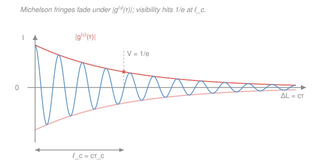

# Quantum Optics & Photonics · Lesson 2.1: Temporal coherence & $g^{(1)}(\tau)$

> ⏱ ~15 min · Module 2: Coherence & the classical-to-quantum bridge · Builds on: [1.5 Optical cavities & laser modes](01-05-optical-cavities-laser-modes.md), [fourier-analysis](../../fourier-analysis/syllabus.md) · Unlocks: [2.2 Spatial coherence](02-02-spatial-coherence.md)

## Why this matters

Split a light beam in two, delay one copy, and recombine them. If the wave still "remembers" its own phase across that delay, the two copies interfere and you see crisp fringes; if it has forgotten, the fringes wash out to uniform grey. *How long light stays in phase with a delayed copy of itself* is **temporal coherence**, and it is the single number that separates a laser (fringes over kilometres) from a lightbulb (fringes over microns). It sets how far apart you can split the arms of an interferometer, how sharp a hologram can be, and — the deep punchline of this lesson — it is nothing but the Fourier transform of the source's spectrum. Narrow colour, long memory.

## The idea

Think of the light wave as a musician trying to hold a steady note. An ideal laser holds one pure pitch forever: sample its phase now and again a microsecond later, and you can predict the second from the first exactly. A thermal source (a lamp, a star) is more like static — its phase gets randomly kicked by every collision and every atom radiating independently, so after a short while the phase is anybody's guess.

The **field correlation function** $g^{(1)}(\tau)$ is a scorecard for that memory. Feed it a delay $\tau$ and it answers: "on average, how well does the field at time $t+\tau$ still line up with the field at time $t$?" At zero delay you are comparing the wave with itself, so the answer is a perfect $1$. As $\tau$ grows, the phase memory leaks away and the score decays toward $0$. The delay at which memory is essentially gone is the **coherence time** $\tau_c$; multiply by the speed of light and you get the physical distance the wave stays correlated over, the **coherence length** $\ell_c = c\tau_c$.

The beautiful part: you never measure phase directly. You just recombine the beam with a delayed copy in a Michelson interferometer and watch how *sharp* the fringes are. Sharp fringes mean high correlation; faded fringes mean low. The fringe **visibility** literally *equals* $|g^{(1)}(\tau)|$.

## The formal version

Write the light as a complex (analytic) field $E(t)$ at one point in space, where $|E(t)|^2$ is proportional to intensity. The **first-order correlation function** is

$$g^{(1)}(\tau) = \frac{\langle E^*(t)\,E(t+\tau)\rangle}{\langle |E(t)|^2\rangle},$$

where $\tau$ (seconds) is the time delay, $E^*$ is the complex conjugate, and $\langle\cdot\rangle$ denotes a long-time average over $t$ (assuming a stationary source, so the average depends only on the gap $\tau$, not on when you start). *In words: overlap the field with a copy of itself shifted by $\tau$, average, and normalize so that zero delay scores $1$.*

Two facts fall out immediately:

- $|g^{(1)}(0)| = 1$ **always** — the field is perfectly correlated with itself. This is normalization, true for *any* light.
- $|g^{(1)}(\tau)| \to 0$ as $\tau$ grows past $\tau_c$ — the phase memory is lost. In general $0 \le |g^{(1)}(\tau)| \le 1$.

The **coherence time** $\tau_c$ is the width of $|g^{(1)}(\tau)|$ (roughly, where it falls to $1/e$), and the **coherence length** is $\ell_c = c\tau_c$.

**Michelson interferometer.** Send $E(t)$ into a beamsplitter, reflect the two halves off mirrors at different distances, recombine. One arm is longer by $\Delta L$, so that copy is delayed by $\tau = \Delta L / c$. The recombined intensity is

$$I(\tau) = I_0\Big[\,1 + |g^{(1)}(\tau)|\cos\big(\omega_0\tau + \varphi\big)\Big],$$

where $\omega_0$ is the mean optical angular frequency and $\varphi$ a fixed phase. Scanning $\Delta L$ produces bright/dark fringes riding on a baseline, and their contrast is the **visibility**

$$V \equiv \frac{I_{\max}-I_{\min}}{I_{\max}+I_{\min}} = \big|g^{(1)}(\tau)\big|,\qquad \tau = \frac{\Delta L}{c}.$$

*In words: measuring how fringe contrast fades as you lengthen one arm is a direct, phase-free measurement of $|g^{(1)}|$.* This is the experiment the figure shows.

**Wiener–Khinchin theorem.** Here is the bridge. The correlation function and the **power spectrum** $S(\omega)$ (how the light's power is distributed over frequency) are a Fourier-transform pair:

$$g^{(1)}(\tau) = \frac{\displaystyle\int_0^\infty S(\omega)\,e^{-i\omega\tau}\,d\omega}{\displaystyle\int_0^\infty S(\omega)\,d\omega}.$$

*In words: the field's phase memory in time is the Fourier transform of its colour content in frequency.* A source's lineshape and its coherence are two views of the same object — exactly the time↔frequency duality of [fourier-analysis](../../fourier-analysis/syllabus.md). Two lineshapes matter in practice, both with mean frequency $\nu_0$ and full width at half maximum (FWHM) $\Delta\nu$ (in Hz):

- **Lorentzian line** (collision- or lifetime-broadened, e.g. a single-mode laser or a pressure-broadened lamp): its Fourier transform is a decaying exponential,
$$\big|g^{(1)}(\tau)\big| = e^{-|\tau|/\tau_c},\qquad \tau_c = \frac{1}{\pi\,\Delta\nu}.$$

- **Gaussian line** (Doppler-broadened gas, atoms with a spread of velocities): the transform of a Gaussian is a Gaussian,
$$\big|g^{(1)}(\tau)\big| = \exp\!\left[-\frac{(\pi\,\Delta\nu\,\tau)^2}{4\ln 2}\right],\qquad \Delta\nu\,\tau_c \approx 0.66,$$
using the standard coherence-time definition $\tau_c = \int_{-\infty}^{\infty}|g^{(1)}(\tau)|^2\,d\tau$.

Both say the same thing: $\tau_c \sim 1/\Delta\nu$. **A narrow spectrum means a long coherence time** — a Fourier uncertainty relation between linewidth and memory.

## Picture

## Worked examples

**Example 1 (mechanical — from spectrum to memory).** A single-mode HeNe laser has a Lorentzian linewidth of $\Delta\nu = 1$ MHz. Its coherence time is

$$\tau_c = \frac{1}{\pi\,\Delta\nu} = \frac{1}{\pi\times 10^6\ \text{Hz}} \approx 3.18\times 10^{-7}\ \text{s},$$

so its coherence length is $\ell_c = c\tau_c = (3\times 10^8)(3.18\times 10^{-7}) \approx 95\ \text{m}$. You could split a Michelson's arms by tens of metres and still see fringes. Now contrast a white lamp with $\Delta\nu \sim 10^{15}$ Hz (the whole visible band): $\tau_c \sim 1/\Delta\nu \sim 10^{-15}$ s and $\ell_c \sim 0.3\ \mu\text{m}$ — under a wavelength. That five-hundred-million-fold gap in coherence is *entirely* a statement about spectral width.

**Example 2 (why you'd care — reading the fringes backwards).** You don't know a source's spectrum, so you put it in a Michelson and measure visibility versus arm difference. You find $V$ drops smoothly as $e^{-\Delta L/\ell_c}$ and hits $1/e$ at $\Delta L = 12$ cm. The exponential shape tells you the line is **Lorentzian**; the $1/e$ point gives $\ell_c = 12$ cm, hence $\tau_c = \ell_c/c = 0.4$ ns and a linewidth $\Delta\nu = 1/(\pi\tau_c) \approx 800$ MHz. You just measured a spectrum with a ruler and a mirror — no grating, no prism. This is Fourier-transform spectroscopy: the interferogram $I(\tau)$ is the Fourier transform of the spectrum, so transforming it back *gives you the spectrum*.

## Watch out

- **You might think $|g^{(1)}(0)|=1$ says something special about your light.** It doesn't — *every* field is perfectly correlated with itself at zero delay, laser or lamp. The information lives entirely in *how fast* $|g^{(1)}(\tau)|$ falls off, i.e. in $\tau_c$, not in its value at $\tau=0$.
- **You might conflate the delay $\tau$ with the arm difference $\Delta L$.** They differ by a factor of $c$: $\tau = \Delta L/c$. Feed $\Delta L$ into the exponential directly and your coherence time will be off by $3\times 10^8$. Keep units straight — and note $\Delta L$ here means the *optical path difference* between the recombining beams.
- **You might expect $g^{(1)}$ to distinguish a laser from a lamp of the same linewidth.** It cannot. $g^{(1)}$ only sees the spectrum, and a filtered thermal source and a laser with identical lineshapes have identical $g^{(1)}(\tau)$. Telling *chaotic* light from *coherent* light needs the **intensity** correlation $g^{(2)}(\tau)$ — that is the whole point of [2.3](02-03-photon-statistics-g2.md).

## One-liner

> $g^{(1)}(\tau)$ measures how long light remembers its own phase; by Wiener–Khinchin it is the Fourier transform of the spectrum, so a narrow line means a long coherence length — and fringe visibility in a Michelson reads it straight off.

## Problems

**P1 (🟢)** A single-mode laser has a Lorentzian linewidth $\Delta\nu = 1$ GHz. Find its coherence time $\tau_c$ and coherence length $\ell_c$.

**P2 (🟡)** Put that same $\Delta\nu = 1$ GHz Lorentzian source into a Michelson interferometer and set the optical path difference to $\Delta L = 5$ cm. Predict the fringe visibility $V$.

**P3 (🔴)** A source emits **two** sharp, equal-intensity spectral lines (a doublet) at frequencies $\nu_0 \pm \tfrac{1}{2}\Delta\nu_s$, i.e. a spectrum of two delta functions separated by $\Delta\nu_s$. Compute $g^{(1)}(\tau)$ from the Wiener–Khinchin theorem, show that the visibility *beats* (periodically collapses and revives) as you scan the delay, and find the first arm difference $\Delta L$ at which the fringes vanish for $\Delta\nu_s = 500$ MHz.

Solutions

**P1** Lorentzian line, so $\tau_c = 1/(\pi\,\Delta\nu)$:

$$\tau_c = \frac{1}{\pi\times 10^9\ \text{Hz}} \approx 3.18\times 10^{-10}\ \text{s} = 0.318\ \text{ns}.$$

$$\ell_c = c\,\tau_c = (3\times 10^8\ \text{m/s})(3.18\times 10^{-10}\ \text{s}) \approx 0.095\ \text{m} \approx 9.5\ \text{cm}.$$

*Check.* Units: $[1/\text{Hz}] = \text{s}$ ✓, $[\text{m/s}\cdot\text{s}] = \text{m}$ ✓. A GHz line (a thousand times broader than Example 1's MHz laser) gives a thousand-times-shorter coherence length: 9.5 cm versus 95 m. ✓

**P2** Visibility is $V = |g^{(1)}(\tau)| = e^{-|\tau|/\tau_c}$ with $\tau = \Delta L/c$. Since $\tau/\tau_c = (\Delta L/c)/(\ell_c/c) = \Delta L/\ell_c$, just use P1's $\ell_c = 9.5$ cm:

$$V = \exp\!\left(-\frac{\Delta L}{\ell_c}\right) = \exp\!\left(-\frac{5\ \text{cm}}{9.5\ \text{cm}}\right) = e^{-0.524} \approx 0.59.$$

So the fringes are still clearly visible, at about 59% contrast. (Push to $\Delta L = \ell_c = 9.5$ cm and you'd get $V = e^{-1} \approx 0.37$, the $1/e$ point marked in the figure.)

*Check.* $\Delta L < \ell_c$, so we expect $V$ between $1/e$ and $1$ — and $0.59$ sits there. ✓

**P3** Two equal-intensity delta lines: $S(\omega) = \tfrac12\delta(\omega-\omega_1) + \tfrac12\delta(\omega-\omega_2)$ with $\omega_{1,2} = \omega_0 \mp \pi\Delta\nu_s$ (recall $\omega = 2\pi\nu$, so half the splitting in $\nu$ is $\pi\Delta\nu_s$ in $\omega$). Wiener–Khinchin (the integral just samples each delta):

$$g^{(1)}(\tau) = \tfrac12 e^{-i\omega_1\tau} + \tfrac12 e^{-i\omega_2\tau} = e^{-i\omega_0\tau}\cdot\tfrac12\big(e^{+i\pi\Delta\nu_s\tau} + e^{-i\pi\Delta\nu_s\tau}\big) = e^{-i\omega_0\tau}\cos(\pi\,\Delta\nu_s\,\tau).$$

The fast factor $e^{-i\omega_0\tau}$ is the carrier that makes the fringes; the envelope is

$$V(\tau) = \big|g^{(1)}(\tau)\big| = \big|\cos(\pi\,\Delta\nu_s\,\tau)\big|.$$

This is the "**beat**": visibility rides from full contrast ($V=1$ at $\tau = n/\Delta\nu_s$) down to *zero* and back, rather than decaying monotonically. Physically the two colours drift in and out of step as you delay one copy — when they are exactly out of phase, one line's bright fringe sits on the other's dark fringe and the pattern erases. The Fourier logic: a two-delta spectrum transforms to a cosine, and two closely spaced lines make a *low*-frequency envelope on the delay axis.

First zero: $\cos(\pi\Delta\nu_s\tau) = 0 \Rightarrow \pi\Delta\nu_s\tau = \pi/2 \Rightarrow \tau = 1/(2\Delta\nu_s)$. For $\Delta\nu_s = 500$ MHz,

$$\tau = \frac{1}{2(5\times 10^8)} = 1\ \text{ns},\qquad \Delta L = c\tau = (3\times 10^8)(10^{-9}) = 0.30\ \text{m} = 30\ \text{cm}.$$

*Check.* Closer lines (smaller $\Delta\nu_s$) push the first collapse to larger $\Delta L$ — a tighter doublet beats more slowly, exactly as $\tau = 1/(2\Delta\nu_s)$ says. This is literally how Michelson measured the sodium D-doublet splitting in the 1890s: he watched the arm differences where fringes vanished. ✓

## Flashback

**From Lesson 1.5 (Optical cavities & laser modes):** A linear (standing-wave) laser cavity has length $L = 15$ cm and finesse $\mathcal{F} = 1000$. Find its free spectral range (mode spacing) $\Delta\nu_{\text{FSR}}$ and the linewidth $\delta\nu$ of a single cavity mode.

Solution

The free spectral range of a linear cavity is $\Delta\nu_{\text{FSR}} = c/(2L)$:

$$\Delta\nu_{\text{FSR}} = \frac{3\times 10^8\ \text{m/s}}{2(0.15\ \text{m})} = \frac{3\times 10^8}{0.30} = 1\times 10^9\ \text{Hz} = 1\ \text{GHz}.$$

The finesse is the ratio of mode spacing to mode width, $\mathcal{F} = \Delta\nu_{\text{FSR}}/\delta\nu$, so

$$\delta\nu = \frac{\Delta\nu_{\text{FSR}}}{\mathcal{F}} = \frac{10^9\ \text{Hz}}{1000} = 1\times 10^6\ \text{Hz} = 1\ \text{MHz}.$$

*Tie-in to this lesson:* that $\delta\nu = 1$ MHz mode linewidth is exactly the Lorentzian $\Delta\nu$ of Example 1 — so this cavity's output has $\tau_c \approx 1/(\pi\cdot10^6) \approx 0.32\ \mu$s and $\ell_c \approx 95$ m. A high-finesse cavity is a coherence factory: it narrows the line, and a narrow line *is* long coherence. ✓

## Connections

- **Backward:** the linewidth that sets $\tau_c$ is the cavity-mode width from [1.5](01-05-optical-cavities-laser-modes.md) — finesse narrows the line, and Wiener–Khinchin turns that narrow line into a long coherence length. Every source's $g^{(1)}$ inherits its shape from the emission spectrum built up across Module 1.
- **Forward:** [2.2 Spatial coherence](02-02-spatial-coherence.md) asks the parallel question across *space* rather than *time* (correlation between two points on a wavefront, with the van Cittert–Zernike theorem playing Wiener–Khinchin's role). And $g^{(1)}$ is only half the story: [2.3 Photon statistics & $g^{(2)}$](02-03-photon-statistics-g2.md) shows that intensity correlations, not field correlations, are what finally reveal the quantum nature of light.
- **Sideways (Fourier analysis):** $g^{(1)}(\tau)\leftrightarrow S(\omega)$ is a Fourier-transform pair, so "narrow spectrum ⇔ long coherence" is the same time–bandwidth uncertainty relation you meet for pulses and wavepackets in [fourier-analysis](../../fourier-analysis/syllabus.md). A short pulse needs a broad spectrum for the identical reason a broadband lamp has a short coherence time.
