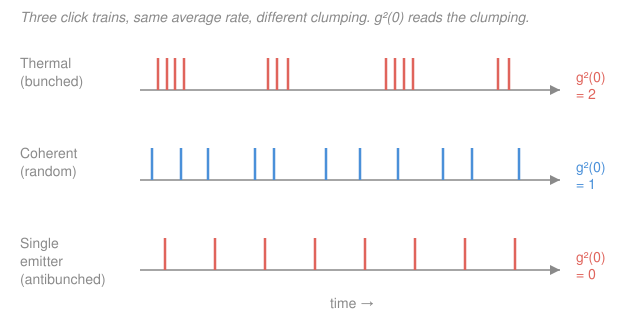

# Quantum Optics & Photonics · Lesson 2.3: Photon statistics & $g^{(2)}(0)$

> ⏱ ~15 min · Module 2: Coherence & the classical-to-quantum bridge · Builds on: [2.1 Temporal coherence & $g^{(1)}$](02-01-temporal-coherence-g1.md) · Unlocks: [2.4 The Hanbury Brown–Twiss experiment](02-04-hanbury-brown-twiss.md)

## Why this matters

Point two detectors at a light source and ask a blunt question: *when one clicks, is the other more or less likely to click at the same instant?* The answer sorts all light into three bins — laser, thermal glow, and single-photon emitter — and, remarkably, one of those bins **cannot be produced by any classical wave whatsoever**. Where [2.1 The first-order correlation $g^{(1)}$](02-01-temporal-coherence-g1.md) measured how the field's *phase* stays in step with itself, this lesson measures how its *intensity* clumps in time. That single number, $g^{(2)}(0)$, is the first hard experimental wedge that forces us to quantize light — it's the crux the rest of the course is built on, and it feeds directly into the Hanbury Brown–Twiss setup of [2.4](02-04-hanbury-brown-twiss.md).

## The idea

Imagine rain on a tin roof. Three different skies give three different drumming patterns, even at the *same average* rate:

- **Laser (coherent):** drops fall completely independently, like a fair coin flipped every instant. Clicks are *random* — knowing one arrived tells you nothing about the next.
- **Thermal glow (a bulb, a star):** drops come in **bursts**. The light's intensity flickers, and where the flicker peaks you get a flurry of photons, where it dips you get a lull. Photons **bunch** — a click makes a second click *more* likely.
- **Single atom (or quantum dot):** a lone emitter has to absorb, then re-emit *one* photon, then reload before it can fire again. It physically cannot spit out two photons at the same instant. Clicks come **anti**bunched — regularly spaced, a click makes an immediate second click *less* likely.

$g^{(2)}(0)$ is just the number that measures this clumping: it's the probability of a *simultaneous* pair of clicks, divided by what you'd expect if clicks were independent. Bigger than 1 = bunched (clumpy). Equal to 1 = random. Less than 1 = antibunched — and that last case is the fingerprint of a genuinely quantum light.

## The formal version

Let $I(t)$ be the light's intensity at a detector. The **second-order (intensity) correlation function** is

$$g^{(2)}(\tau) = \frac{\langle I(t)\,I(t+\tau)\rangle}{\langle I(t)\rangle^2},$$

where $\langle\cdot\rangle$ is a time (or ensemble) average and $\tau$ is the delay between the two intensity samples. *In words: how correlated is the brightness now with the brightness a time $\tau$ later, normalized so that "no correlation" reads exactly 1.* At **zero delay** the two samples are the same instant:

$$g^{(2)}(0) = \frac{\langle I(t)^2\rangle}{\langle I(t)\rangle^2}.$$

**The quantum version.** Photodetection annihilates photons, so the correct quantum operator ordering is **normal ordering** (all creation operators $\hat a^\dagger$ to the left, all annihilation operators $\hat a$ to the right):

$$g^{(2)}(0) = \frac{\langle \hat a^\dagger \hat a^\dagger \hat a \hat a\rangle}{\langle \hat a^\dagger \hat a\rangle^2} = \frac{\langle \hat n(\hat n - 1)\rangle}{\langle \hat n\rangle^2},$$

where $\hat a,\hat a^\dagger$ are the mode's annihilation/creation operators and $\hat n = \hat a^\dagger \hat a$ is the photon-number operator (the ladder operators of [`quantum-mechanics`](../../quantum-mechanics/syllabus.md)'s harmonic oscillator, reused for light). *In words: it's the average number of distinct ordered photon **pairs** you can draw, $n(n-1)$, divided by the mean number squared* — the chance of detecting two photons at once. The identity $\hat a^\dagger\hat a^\dagger\hat a\hat a = \hat n^2 - \hat n = \hat n(\hat n-1)$ follows from $[\hat a,\hat a^\dagger]=1$.

Writing $g^{(2)}(0)$ in terms of the number distribution's mean and variance is the key move:

$$g^{(2)}(0) = \frac{\langle n^2\rangle - \langle n\rangle}{\langle n\rangle^2} = 1 + \frac{\operatorname{Var}(n) - \langle n\rangle}{\langle n\rangle^2}.$$

So the sign of $\operatorname{Var}(n) - \langle n\rangle$ decides everything. The **three canonical cases**:

| Light | Number statistics | $\operatorname{Var}(n)$ vs $\langle n\rangle$ | $g^{(2)}(0)$ |
|---|---|---|---|
| Coherent (laser) | Poissonian | $\operatorname{Var}=\langle n\rangle$ | $1$ |
| Thermal / chaotic | super-Poissonian | $\operatorname{Var}>\langle n\rangle$ | $2$ |
| Single photon $\lvert 1\rangle$ | sub-Poissonian | $\operatorname{Var}<\langle n\rangle$ | $0$ |

For **chaotic light** the full delay dependence collapses onto $g^{(1)}$ via the **Siegert relation**

$$g^{(2)}(\tau) = 1 + \bigl|g^{(1)}(\tau)\bigr|^2,$$

so $g^{(2)}$ decays from $2$ at $\tau=0$ down to $1$ over the coherence time $\tau_c$ of [2.1](02-01-temporal-coherence-g1.md) — bunching is a *coherence-time* effect. *In words: thermal photons clump precisely within one coherence time, then forget each other.*

**The nonclassicality witness.** Any classical field has a real, non-negative intensity $I(t)$, so $\operatorname{Var}(I)=\langle I^2\rangle-\langle I\rangle^2 \ge 0$, which forces

$$\boxed{\,g^{(2)}(0) \ge 1\quad\text{and}\quad g^{(2)}(0)\ge g^{(2)}(\tau)\,}\qquad(\text{classical light}).$$

*In words: classical light can only be bunched or random, never antibunched, and it is never clumpier at any delay than at zero delay.* Therefore **$g^{(2)}(0) < 1$ is impossible for any classical wave** — measuring it is a rigorous proof that the light field is quantized. A compact scalar that flags this is the **Mandel $Q$ parameter** (a rescaled Fano factor):

$$Q = \frac{\operatorname{Var}(n) - \langle n\rangle}{\langle n\rangle} = \langle n\rangle\bigl(g^{(2)}(0) - 1\bigr).$$

$Q<0 \iff$ sub-Poissonian $\iff g^{(2)}(0)<1 \iff$ nonclassical.

## Picture

Same average click rate in all three rows — only the *clumping* differs, and that is exactly what $g^{(2)}(0)$ reports.

## Worked examples

**Example 1 (mechanical — from mean and variance).** A source is measured to have mean photon number $\langle n\rangle = 4$ with variance $\operatorname{Var}(n) = 12$. Then

$$g^{(2)}(0) = 1 + \frac{\operatorname{Var}(n) - \langle n\rangle}{\langle n\rangle^2} = 1 + \frac{12 - 4}{16} = 1 + 0.5 = 1.5.$$

Since $g^{(2)}(0) > 1$ (equivalently $Q = (12-4)/4 = 2 > 0$), the light is **super-Poissonian and bunched** — consistent with a classical, thermal-like field. Nothing here demands quantization.

**Example 2 (why you'd care — antibunching as a witness).** A candidate single-photon source emits either **1 or 3** photons per window, each with probability $\tfrac12$, and never 0 or 2. Is it nonclassical? Compute directly with $\langle n(n-1)\rangle = \sum_n P(n)\,n(n-1)$:

$$\langle n\rangle = \tfrac12(1) + \tfrac12(3) = 2, \qquad \langle n(n-1)\rangle = \tfrac12\underbrace{(1\cdot 0)}_{n=1} + \tfrac12\underbrace{(3\cdot 2)}_{n=3} = 3.$$

$$g^{(2)}(0) = \frac{\langle n(n-1)\rangle}{\langle n\rangle^2} = \frac{3}{4} = 0.75 < 1.$$

Below 1, so **antibunched and nonclassical** — no classical field can reproduce it. (Check via variance: $\langle n^2\rangle = \tfrac12(1)+\tfrac12(9)=5$, $\operatorname{Var}=5-4=1 < 2 = \langle n\rangle$, sub-Poissonian ✓.) This is the quantity you actually measure in [2.4](02-04-hanbury-brown-twiss.md) to certify a single-photon source — the dip of $g^{(2)}(0)$ below $\tfrac12$ proving "no two-photon events" is the industry benchmark.

## Watch out

- **You might think $g^{(2)}(0)$ measures phase coherence like $g^{(1)}$ — it doesn't.** $g^{(1)}$ is about the *field amplitude and phase* (interference, linewidth); $g^{(2)}$ is about *intensity clumping* (photon counting). A perfectly coherent laser and a chaotic source can share the same $g^{(1)}$ decay yet have utterly different $g^{(2)}(0)$ (1 vs 2). They're independent windows on the light.
- **You might think bunching ($g^{(2)}(0)=2$) means the photons attract each other.** They don't interact at all. The bunching is entirely a statistical shadow of the source's intensity *fluctuating*: brighter instants deliver more pairs. A laser doesn't bunch because its intensity is steady, not because its photons repel.
- **You might drop the $-1$ and write $g^{(2)}(0)=\langle \hat n^2\rangle/\langle \hat n\rangle^2$.** The normal ordering gives $\hat a^\dagger\hat a^\dagger\hat a\hat a = \hat n(\hat n-1)$, not $\hat n^2$. Forgetting the $-1$ is exactly what makes the Fock state look classical: with $\hat n^2$ you'd get $g^{(2)}(0)=1$ for $\lvert 1\rangle$ instead of the correct $0$, erasing the whole quantum effect.

## One-liner

> $g^{(2)}(0)=\langle n(n-1)\rangle/\langle n\rangle^2$ counts simultaneous photon pairs: 2 for thermal (bunched), 1 for a laser (random), 0 for a single emitter (antibunched) — and anything below 1 is a wave-theory-proof stamp of quantized light.

## Problems

**P1 (🟢)** A detector records mean photon number $\langle n\rangle = 10$ with variance $\operatorname{Var}(n) = 30$. Compute $g^{(2)}(0)$ and the Mandel $Q$ parameter, and classify the light (Poissonian / super- / sub-Poissonian; bunched / random / antibunched; classical or not).

**P2 (🟡)** Verify the two canonical values by direct computation. (a) For a single-mode **thermal** field the photon number is Bose–Einstein distributed, $P(n) = \dfrac{\bar n^{\,n}}{(1+\bar n)^{n+1}}$ (a geometric distribution with mean $\bar n$ and variance $\bar n(1+\bar n)$). Show $g^{(2)}(0)=2$. (b) For a **coherent** field, $P(n)=e^{-\lambda}\lambda^n/n!$ (Poisson, mean $\lambda$). Show $g^{(2)}(0)=1$.

**P3 (🔴)** Take the single-photon Fock state $\lvert 1\rangle$, with $\hat a\lvert 1\rangle = \lvert 0\rangle$ and $\hat a\lvert 0\rangle = 0$. Compute $g^{(2)}(0)$ from the normally ordered definition, and then explain in one or two sentences why no classical field — no choice of a real intensity $I(t)\ge 0$ — can reproduce that value.

Solutions

**P1** Using $g^{(2)}(0) = 1 + \dfrac{\operatorname{Var}(n) - \langle n\rangle}{\langle n\rangle^2}$:

$$g^{(2)}(0) = 1 + \frac{30 - 10}{10^2} = 1 + \frac{20}{100} = 1.2.$$

Mandel parameter: $Q = \dfrac{\operatorname{Var}(n)-\langle n\rangle}{\langle n\rangle} = \dfrac{30-10}{10} = 2$. (Consistent: $Q = \langle n\rangle(g^{(2)}(0)-1) = 10\times 0.2 = 2$ ✓.)

Since $\operatorname{Var}(n)=30 > 10 = \langle n\rangle$, the light is **super-Poissonian**; $g^{(2)}(0)>1$ means **bunched**; $Q>0$ and $g^{(2)}(0)\ge 1$ mean it is **classically allowed** (it looks partially thermal — pure thermal would give $g^{(2)}(0)=2$, so this is somewhere between laser and thermal).

**P2 (a) Thermal.** Use $g^{(2)}(0) = \dfrac{\langle n(n-1)\rangle}{\langle n\rangle^2}$ with $\langle n(n-1)\rangle = \langle n^2\rangle - \langle n\rangle = \operatorname{Var}(n) + \langle n\rangle^2 - \langle n\rangle$. For the geometric distribution $\langle n\rangle = \bar n$ and $\operatorname{Var}(n) = \bar n(1+\bar n) = \bar n + \bar n^2$, so

$$\langle n(n-1)\rangle = (\bar n + \bar n^2) + \bar n^2 - \bar n = 2\bar n^2 \;\Longrightarrow\; g^{(2)}(0) = \frac{2\bar n^2}{\bar n^2} = 2.$$

Note it is **independent of $\bar n$** — every thermal source bunches with $g^{(2)}(0)=2$.

**(b) Coherent.** For Poisson, the clean fact is $\langle n(n-1)\rangle = \lambda^2$ (and $\langle n\rangle = \lambda$). Directly:

$$\langle n(n-1)\rangle = \sum_{n=0}^\infty n(n-1)\,e^{-\lambda}\frac{\lambda^n}{n!} = e^{-\lambda}\lambda^2\sum_{n=2}^\infty \frac{\lambda^{n-2}}{(n-2)!} = e^{-\lambda}\lambda^2 e^{\lambda} = \lambda^2,$$

where the $n=0,1$ terms vanish. Hence $g^{(2)}(0) = \lambda^2/\lambda^2 = 1$. (Equivalently: Poisson has $\operatorname{Var}(n)=\langle n\rangle$, so $g^{(2)}(0)=1+0=1$.)

**P3 Fock state $\lvert 1\rangle$.** Apply two annihilations: $\hat a\hat a\lvert 1\rangle = \hat a\lvert 0\rangle = 0$. Therefore the normally ordered numerator vanishes,

$$\langle 1\rvert \hat a^\dagger\hat a^\dagger\hat a\hat a\lvert 1\rangle = \|\hat a\hat a\lvert 1\rangle\|^2 = 0,$$

while the denominator $\langle 1\rvert\hat a^\dagger\hat a\lvert 1\rangle^2 = \langle n\rangle^2 = 1 \neq 0$. So

$$g^{(2)}(0) = \frac{0}{1} = 0.$$

(Same result from $\langle n(n-1)\rangle$: with $n=1$ exactly, $n(n-1)=1\cdot 0 = 0$.) **Why no classical field can match it:** a classical intensity satisfies $g^{(2)}(0)=\langle I^2\rangle/\langle I\rangle^2 = 1 + \operatorname{Var}(I)/\langle I\rangle^2 \ge 1$, because $\operatorname{Var}(I)\ge 0$ for any real quantity. Getting $g^{(2)}(0)=0$ would require $\operatorname{Var}(I) = -\langle I\rangle^2 < 0$, which is impossible. The single photon simply has no description as a fluctuating classical intensity — it is irreducibly quantum.

## Flashback

**From Lesson 2.1 (Temporal coherence & $g^{(1)}$):** A chaotic (thermal) source has a Gaussian first-order coherence function $g^{(1)}(\tau) = \exp\!\big[-(\tau/\tau_c)^2\big]$ with coherence time $\tau_c = 2\ \mathrm{ns}$. (a) Evaluate the magnitude $\lvert g^{(1)}(\tau)\rvert$ at $\tau = \tau_c$. (b) Using the Siegert relation, find $g^{(2)}$ at that same delay, and confirm the $\tau\to 0$ limit gives the expected thermal value.

Solution

**(a)** At $\tau=\tau_c$, $\lvert g^{(1)}(\tau_c)\rvert = e^{-(1)^2} = e^{-1} \approx 0.368$. The field's phase memory has decayed to $1/e$ after one coherence time — the defining property of $\tau_c$ from 2.1.

**(b)** Siegert: $g^{(2)}(\tau) = 1 + \lvert g^{(1)}(\tau)\rvert^2$, so

$$g^{(2)}(\tau_c) = 1 + (e^{-1})^2 = 1 + e^{-2} \approx 1 + 0.135 = 1.135.$$

As $\tau\to 0$: $\lvert g^{(1)}(0)\rvert = 1$, giving $g^{(2)}(0) = 1 + 1 = 2$ ✓ — the canonical thermal bunching value from this lesson. So $g^{(2)}$ falls from $2$ toward $1$ on the *same* timescale $\tau_c$ over which $g^{(1)}$ decays: intensity bunching and phase coherence are two faces of one coherence time.

## Connections

- **Backward:** this is the intensity-correlation partner of [2.1](02-01-temporal-coherence-g1.md)'s field-correlation $g^{(1)}$. The Siegert relation $g^{(2)}=1+|g^{(1)}|^2$ ties them together for chaotic light, and $g^{(1)}$ is itself a Fourier-transform pair with the power spectrum (the Wiener–Khinchin theorem from [`fourier-analysis`](../../fourier-analysis/syllabus.md)).
- **Forward:** [2.4 The Hanbury Brown–Twiss experiment](02-04-hanbury-brown-twiss.md) is the beam-splitter-plus-two-detectors apparatus that actually *measures* $g^{(2)}(0)$ by coincidence counting, and the antibunching dip below 1 becomes the certificate for the single-photon sources of Module 3.
- **Sideways (quantum mechanics):** the operators $\hat a,\hat a^\dagger,\hat n$ here are exactly the harmonic-oscillator ladder operators of [`quantum-mechanics`](../../quantum-mechanics/syllabus.md); a light mode *is* a quantum oscillator, and $g^{(2)}(0)=0$ for $\lvert 1\rangle$ is a direct consequence of $\hat a\hat a\lvert 1\rangle = 0$ — the same lowering algebra, now witnessing the quantization of light itself.
