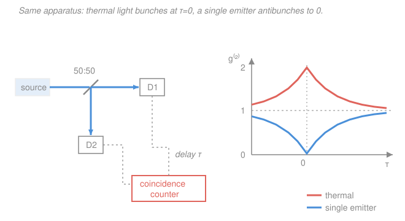

# Quantum Optics & Photonics · Lesson 2.4: Hanbury Brown–Twiss & the crack in the classical picture

> ⏱ ~15 min · Module 2: Coherence & the classical-to-quantum bridge · Builds on: [2.3 Photon statistics and $g^{(2)}$](02-03-photon-statistics-g2.md) · Unlocks: [3.1 Quantizing the EM field](03-01-quantizing-em-field.md)

## Why this matters

Everything in Module 2 — coherence, $g^{(1)}$, $g^{(2)}$, photon statistics — has so far been *describable* by a classical wave with a randomly fluctuating amplitude. No photons required. This lesson is where that story finally breaks. A single experiment, the **Hanbury Brown–Twiss (HBT)** intensity correlator, produces a result — *antibunching* — that **no classical field can ever give**. It is the cleanest experimental proof that light is quantized, and it is the reason the next module has to throw out the classical field and build photons from scratch. This is the hinge of the whole course.

## The idea

Take a beam of light, send it onto a 50:50 beam splitter, and put a photodetector on each of the two outputs. Now watch *coincidences*: when detector D1 clicks, does D2 tend to click at the same moment, or not? Sweep a variable delay $\tau$ between the two channels and plot how the coincidence rate depends on $\tau$. That plot **is** the second-order coherence $g^{(2)}(\tau)$ — you are measuring intensity–intensity correlations directly, one arm's brightness against the other's.

Here is the punchline in three pictures:

- **Thermal / chaotic light** (a bulb, a star, filtered lamplight): coincidences *peak* at $\tau=0$. Photons arrive in clumps — bright speckle moments and dark ones — so both detectors tend to fire together. This is **bunching**, $g^{(2)}(0)=2$.
- **Coherent light** (an ideal laser): flat. $g^{(2)}(\tau)=1$ everywhere — clicks are independent, like raindrops.
- **A single emitter** (one atom, one molecule, one quantum dot): coincidences *dip* to zero at $\tau=0$. This is **antibunching**, $g^{(2)}(0)<1$, ideally $\to 0$.

The first two a classical wave can fake. The third it cannot. A lone atom emits *one* photon at a time; that photon hits the beam splitter and goes to **either** D1 **or** D2 — never both. So the two detectors *can't* click together, and the coincidence rate at $\tau=0$ falls to zero. A classical wave, by contrast, is a field that splits smoothly in two at the beam splitter, always feeding *both* detectors at once. It has no way to produce zero simultaneous coincidences. The dip is the fingerprint of indivisible quanta.

## The formal version

**The HBT measurement.** Let $I_1(t)$ and $I_2(t)$ be the intensities at the two beam-splitter outputs. The correlator measures the normalized intensity–intensity correlation

$$g^{(2)}(\tau) = \frac{\langle I_1(t)\, I_2(t+\tau)\rangle}{\langle I_1(t)\rangle\,\langle I_2(t+\tau)\rangle},$$

where $\langle\cdot\rangle$ is a time (or ensemble) average and $\tau$ is the delay between the channels. *In words: how much brighter than average is arm 2 a time $\tau$ after arm 1 was bright.* Because a 50:50 splitter sends copies of the same field into both arms, this is exactly the $g^{(2)}(\tau)$ of the source from [2.3](02-03-photon-statistics-g2.md) — HBT is simply *how you build a $g^{(2)}$ meter in the lab*. Note it is **intensity** ($\propto|E|^2$) correlated with intensity, not field amplitude with amplitude: HBT measures $g^{(2)}$, **not** $g^{(1)}$.

**Historical shock (HBT, 1956).** Hanbury Brown and Twiss pointed two separated detectors at a *star* and correlated their intensity fluctuations — no mirrors, no combined wavefront. From the way the correlation fell off as they moved the detectors apart, they extracted the star's **angular diameter**. This stunned people because amplitude interferometry (Michelson stellar interferometer) needs the *phase* of the wavefront preserved across the baseline, which the atmosphere scrambles. Intensity correlations don't care about that scrambled phase — $g^{(2)}$ survives where $g^{(1)}$ dies. It was the first demonstration that intensity correlations carry real coherence information.

**Bunching for thermal light.** For chaotic/thermal light the two correlation orders are tied together by the **Siegert relation**

$$g^{(2)}(\tau) = 1 + \big|g^{(1)}(\tau)\big|^2 .$$

*In words: the excess coincidence bump is the square of the first-order coherence.* At $\tau=0$, $|g^{(1)}(0)|=1$, so $g^{(2)}(0)=2$: the peak. And the bump's *width* in $\tau$ is the coherence time $\tau_c$ — so HBT also measures $\tau_c$. Crucially, $g^{(2)}(0)=2$ **is reproducible by a classical field**: a wave whose intensity randomly flickers has $\langle I^2\rangle > \langle I\rangle^2$, giving a peak. Bunching alone does *not* require photons.

**The crack: antibunching.** Any classical field obeys (proof in P3)

$$\boxed{\,g^{(2)}(0)\ \ge\ 1\quad\text{for every classical field.}\,}$$

*In words: classically, simultaneous intensity can never be less correlated than random — the value at zero delay is the largest it can be, and it is at least 1.* A single quantum emitter measured in HBT gives $g^{(2)}(0)<1$ — a **violation of a classical theorem**. There is no fluctuating classical intensity $I(t)\ge 0$ that produces it. The only description that works is a *quantized* field: the emitter releases one photon, a single indivisible excitation that the beam splitter routes to one detector or the other. In the photon-number language of the next module, $g^{(2)}(0)=\langle \hat n(\hat n-1)\rangle/\langle \hat n\rangle^2$, and a one-photon state $|1\rangle$ has $\hat n(\hat n-1)|1\rangle = 0$, so $g^{(2)}(0)=0$ exactly. **Antibunching is the experimental proof that light is quantized.**

## Picture

## Worked examples

**Example 1 (mechanical — read the trace).** You run HBT on three unknown sources and read off $g^{(2)}(0)$: source A gives $2.0$ with a bump that narrows as you widen the optical filter; source B gives $1.00$ flat at every $\tau$; source C gives $0.05$, a sharp dip at $\tau=0$ that recovers to $1$ within a few nanoseconds. Identify them. Source A: $g^{(2)}(0)=2$, a $\tau$-dependent bump — **thermal/chaotic** light, with the bump width set by its coherence time. Source B: $g^{(2)}\equiv 1$ — **coherent** light, an ideal laser, Poissonian and memoryless. Source C: $g^{(2)}(0)<1$ — **single-photon** (antibunched) source; the recovery time is how long the emitter takes to get re-excited before it can emit again.

**Example 2 (why you'd care — a single-photon source certificate).** You are building a quantum key distribution link and need a source that emits *one* photon per pulse, never two (two photons is a security hole an eavesdropper exploits). How do you certify it? Put it in an HBT setup and measure $g^{(2)}(0)$. A perfect single-photon source gives $g^{(2)}(0)=0$; the standard field threshold for "genuinely single-photon" is $g^{(2)}(0)<0.5$, which guarantees the two-photon probability is below half that of a coherent pulse of the same brightness. The HBT dip isn't just physics folklore — it's the acceptance test on the datasheet of every real single-photon emitter. That number is *impossible* to reach with any laser, no matter how attenuated: attenuating a laser lowers the rate but keeps $g^{(2)}(0)=1$.

## Watch out

- **You might think HBT measures $g^{(1)}$** because it involves a beam splitter and "interference." It does not — there is no recombination and no fringe. The two detectors measure *intensities* separately and a counter multiplies them, so the observable is $\langle I_1 I_2\rangle$, i.e. $g^{(2)}$. Amplitude (Michelson) interferometry measures $g^{(1)}$; HBT measures $g^{(2)}$.
- **You might think the bunching peak proves photons are "sticky."** It doesn't prove anything quantum at all — a classical wave with flickering intensity gives $g^{(2)}(0)=2$. Only the *dip below 1* is nonclassical. Bunching is consistent with both pictures; antibunching rules the classical one out.
- **You might expect an attenuated laser to antibunch.** Turning a laser way down makes photons rare, but they still arrive as an independent (Poisson) stream: $g^{(2)}(0)=1$, not $<1$. Rarity is not antibunching. You need a source that is physically incapable of emitting two at once.

## One-liner

> HBT correlates the two outputs of a beam splitter to read $g^{(2)}(\tau)$ directly; thermal light bunches to 2, but a single emitter dips below the classical floor of 1 — and that impossible dip is the proof that light comes in photons.

## Problems

**P1 (🟢)** Three HBT traces cross your desk. Trace 1: $g^{(2)}(\tau)=1$ for all $\tau$. Trace 2: a symmetric peak with $g^{(2)}(0)=2$ decaying to $1$ over $\sim\!10\ \mathrm{ns}$. Trace 3: a dip with $g^{(2)}(0)=0.08$ recovering to $1$ over $\sim\!5\ \mathrm{ns}$. For each, name the light (coherent / thermal / single-photon) and say whether a classical field could produce it.

**P2 (🟡)** Chaotic light from a Lorentzian spectral line has $g^{(1)}(\tau)=e^{-|\tau|/\tau_c}$, where $\tau_c$ is the coherence time. Use the Siegert relation to write $g^{(2)}(\tau)$, confirm the $\tau=0$ value, and find the full width at half maximum (FWHM) of the *excess* coincidence bump $g^{(2)}(\tau)-1$ in terms of $\tau_c$.

**P3 (🔴)** Prove the classical bound $g^{(2)}(0)\ge 1$. Model the light as a real, non-negative fluctuating intensity $I(t)\ge 0$ with $g^{(2)}(0)=\langle I^2\rangle/\langle I\rangle^2$. Use the Cauchy–Schwarz inequality (or, equivalently, that a variance can't be negative) to derive the bound, and state when equality holds. Then explain in one sentence why a measured $g^{(2)}(0)<1$ is a *theorem-violating* nonclassical signature.

Solutions

**P1** Trace 1: $g^{(2)}\equiv 1$ — **coherent** light (ideal laser). Classical: yes (a steady wave). Trace 2: $g^{(2)}(0)=2$ decaying to 1 — **thermal/chaotic** light, the decay time being $\tau_c\approx 10\ \mathrm{ns}$. Classical: yes (an intensity that flickers gives exactly this bunching peak). Trace 3: $g^{(2)}(0)=0.08<1$ — a **single-photon** (antibunched) source, the $\sim\!5\ \mathrm{ns}$ recovery being the re-excitation time. Classical: **no** — it violates $g^{(2)}(0)\ge 1$, so no classical field can produce it.

**P2** Siegert: $g^{(2)}(\tau)=1+|g^{(1)}(\tau)|^2 = 1 + \left(e^{-|\tau|/\tau_c}\right)^2 = 1 + e^{-2|\tau|/\tau_c}$.

At $\tau=0$: $g^{(2)}(0)=1+1=2$ ✓ (the bunching peak). The excess bump is $b(\tau)=g^{(2)}(\tau)-1=e^{-2|\tau|/\tau_c}$, with maximum $b(0)=1$. Half maximum $b=\tfrac12$ occurs where

$$e^{-2|\tau|/\tau_c}=\tfrac12 \;\Longrightarrow\; \frac{2|\tau|}{\tau_c}=\ln 2 \;\Longrightarrow\; |\tau|=\frac{\tau_c\ln 2}{2}.$$

The bump straddles $\pm|\tau|$, so

$$\text{FWHM} = 2|\tau| = \tau_c\ln 2 \approx 0.69\,\tau_c.$$

*In words: the width of the HBT bunching peak is set by — and is of order — the coherence time.* This is why HBT doubles as a coherence-time meter: measure the peak width, read off $\tau_c$.

**P3** Cauchy–Schwarz for real functions says $\langle fg\rangle^2 \le \langle f^2\rangle\langle g^2\rangle$. Take $f=I(t)$ and $g=1$ (the constant function):

$$\langle I\rangle^2 = \langle I\cdot 1\rangle^2 \le \langle I^2\rangle\,\langle 1^2\rangle = \langle I^2\rangle .$$

Dividing by $\langle I\rangle^2 > 0$,

$$g^{(2)}(0)=\frac{\langle I^2\rangle}{\langle I\rangle^2} \ge 1.$$

Equivalently: $\langle I^2\rangle - \langle I\rangle^2 = \mathrm{Var}(I) \ge 0$ since a variance of a real quantity can't be negative, and dividing by $\langle I\rangle^2$ gives the same result. Equality ($g^{(2)}(0)=1$) holds **iff** $\mathrm{Var}(I)=0$, i.e. $I(t)$ is constant — perfectly steady (coherent) light. Any *fluctuation* pushes $g^{(2)}(0)$ strictly above 1. So classically $g^{(2)}(0)=1$ is the floor and $2$ (thermal) is typical, but the value can never drop below 1.

Why a dip below 1 is theorem-violating: the derivation assumed only that $I(t)$ is a real, non-negative number at every instant — the defining property of *any* classical field intensity. A measured $g^{(2)}(0)<1$ contradicts a bound that follows from that assumption alone, so no non-negative classical intensity exists that reproduces it; the light must be described by a quantized field where $\hat I$ is an operator that need not obey the inequality.

## Flashback

**From Lesson 2.3 (Photon statistics and $g^{(2)}$):** A source emits light whose photon-number distribution per detection window is $P(1)=\tfrac34$ and $P(3)=\tfrac14$ (and $P(n)=0$ otherwise). Compute $g^{(2)}(0)=\dfrac{\langle n(n-1)\rangle}{\langle n\rangle^2}$ and classify the light as bunched, coherent, or antibunched.

Solution

Mean photon number:

$$\langle n\rangle = 1\cdot\tfrac34 + 3\cdot\tfrac14 = \tfrac34 + \tfrac34 = \tfrac32 .$$

Factorial moment $\langle n(n-1)\rangle$, using $n(n-1)=0$ for $n=1$ and $=6$ for $n=3$:

$$\langle n(n-1)\rangle = 0\cdot\tfrac34 + 6\cdot\tfrac14 = \tfrac32 .$$

Therefore

$$g^{(2)}(0) = \frac{\langle n(n-1)\rangle}{\langle n\rangle^2} = \frac{3/2}{(3/2)^2} = \frac{3/2}{9/4} = \frac{2}{3} \approx 0.67 .$$

Since $g^{(2)}(0)<1$, the light is **antibunched** (sub-Poissonian): the number distribution is narrower than a Poisson of the same mean, and — by exactly the argument of this lesson — such light is nonclassical. This is precisely the kind of statistic a single-emitter HBT dip reports.

## Connections

- **Backward:** the correlator reads out the $g^{(2)}(\tau)$ defined in [2.3](02-03-photon-statistics-g2.md), and the bunching-peak width is the coherence time $\tau_c$ from [2.1](02-01-temporal-coherence-g1.md). The Siegert relation glues $g^{(2)}$ to the $g^{(1)}$ of [2.1](02-01-temporal-coherence-g1.md) — and since $g^{(1)}(\tau)$ and the power spectrum are a Fourier-transform pair (the Wiener–Khinchin theorem), HBT's bump width is set by the source's spectral linewidth.
- **Forward:** the classically-impossible $g^{(2)}(0)<1$ is the motivation for [3.1 Quantizing the EM field](03-01-quantizing-em-field.md): to even *write down* a state with $g^{(2)}(0)=0$ we need photon-number (Fock) states, where $g^{(2)}(0)=\langle\hat n(\hat n-1)\rangle/\langle\hat n\rangle^2$ and $|1\rangle$ kills the numerator. This lesson closes Module 2 and hands Module 2's Boss Problem — and the whole quantization program — its central puzzle.
- **Sideways:** the "one photon takes one path, so no coincidence" logic is the same indivisibility that, run through a beam splitter with *two* input photons, produces the Hong–Ou–Mandel dip in [4.1](04-01-quantum-beam-splitter-hong-ou-mandel.md); and the $g^{(2)}(0)<0.5$ single-photon certificate is a hard requirement for the quantum key distribution of [4.5](04-05-quantum-information-taste.md).
