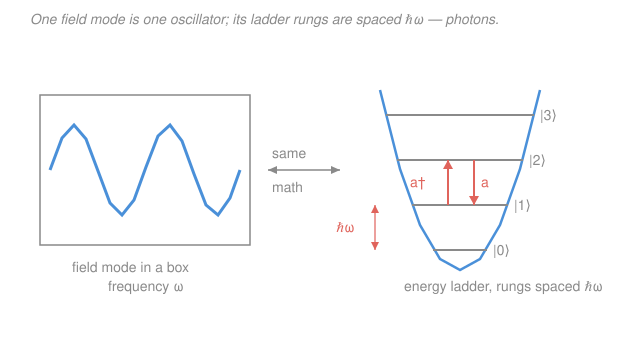

# Quantum Optics & Photonics · Lesson 3.1: Quantizing the electromagnetic field

> ⏱ ~15 min · Module 3: Field quantization & photon states · Builds on: [2.4 The Hanbury Brown–Twiss experiment](02-04-hanbury-brown-twiss.md), harmonic-oscillator ladder operators from [`quantum-mechanics`](../../quantum-mechanics/syllabus.md) · Unlocks: [3.2 Fock states, the vacuum & zero-point energy](03-02-fock-states-vacuum-zero-point.md)

## Why this matters

Everything so far has treated light as a classical wave — even the photon-*counting* of Module 2 measured intensities and let statistics do the talking. But the $g^{(2)}(0) < 1$ antibunching of a single-photon source (Lesson [2.4](02-04-hanbury-brown-twiss.md)) has no classical explanation: you cannot make a classical wave "click once and then go silent." To say what a *photon* actually is, you have to quantize the field itself. The astonishing payoff is that you already know how — a light field is nothing but a collection of harmonic oscillators, and you quantized one of those in quantum mechanics. This lesson is the bridge; every state in the rest of the course (Fock, coherent, squeezed) lives on the ladder we build here.

## The idea

Take the electromagnetic field inside a box (a cavity). Maxwell's equations only allow certain **standing-wave patterns** to fit — the normal modes, each with its own wavevector $\mathbf k$, polarization, and frequency $\omega$. Any field in the box is a sum over these modes, and here is the magic: the amplitude of each mode wobbles in time as a **sine wave**, with an energy that is quadratic in "how far it's stretched" plus "how fast it's moving." That is *exactly* a mass on a spring. One field mode = one harmonic oscillator, full stop.

So quantizing light needs no new machinery. We just take each oscillator and quantize it the way quantum mechanics quantizes a spring: replace the classical amplitude by an operator, and out pops an evenly-spaced energy ladder. Climbing one rung of a mode's ladder costs exactly $\hbar\omega$ of energy — and *that quantum of excitation is what we call a photon*. "$n$ photons in this mode" just means "this mode's oscillator is on rung $n$." A light field is a bag of harmonic oscillators, and photons are the rungs.

## The formal version

**One mode.** Isolate a single mode of frequency $\omega$. Its classical energy has the harmonic-oscillator form $H = \tfrac12(p^2 + \omega^2 q^2)$, where $q$ is the mode amplitude (playing the role of position) and $p$ its conjugate momentum (the rate of change) — both just real numbers labeling the mode's state. *In words: a field mode stores energy exactly like a spring, split between a "stretch" part and a "motion" part.*

Quantize by promoting $q, p$ to operators $\hat q, \hat p$ with $[\hat q, \hat p] = i\hbar$, and — the key move you saw in quantum mechanics — package them into **ladder operators**:

$$\hat a = \frac{1}{\sqrt{2\hbar\omega}}\left(\omega\hat q + i\hat p\right), \qquad \hat a^\dagger = \frac{1}{\sqrt{2\hbar\omega}}\left(\omega\hat q - i\hat p\right).$$

Here $\hat a$ is the **annihilation (lowering) operator** and $\hat a^\dagger$ its Hermitian conjugate, the **creation (raising) operator**. They obey the single defining relation

$$\boxed{[\hat a, \hat a^\dagger] = 1,}$$

and the Hamiltonian collapses to

$$\boxed{\hat H = \hbar\omega\left(\hat a^\dagger \hat a + \tfrac12\right) = \hbar\omega\left(\hat n + \tfrac12\right),} \qquad \hat n \equiv \hat a^\dagger \hat a.$$

*In words: the energy is $\hbar\omega$ times (the number of photons plus one half).* The **number operator** $\hat n = \hat a^\dagger\hat a$ has non-negative integer eigenvalues $n = 0, 1, 2, \dots$, and its eigenstate $|n\rangle$ (the state on rung $n$) has energy $E_n = \hbar\omega(n + \tfrac12)$. This is the identical spectrum you derived for a mechanical oscillator in quantum mechanics — reused *verbatim*, only now "$n$" counts photons instead of vibrational quanta. The operators shuffle you along the ladder:

$$\hat a\,|n\rangle = \sqrt{n}\,|n-1\rangle, \qquad \hat a^\dagger\,|n\rangle = \sqrt{n+1}\,|n+1\rangle.$$

*In words: $\hat a$ destroys one photon (drops one rung, lowering the mode's energy by $\hbar\omega$); $\hat a^\dagger$ creates one (climbs a rung).*

**The field is now an operator.** Repeating the classical mode expansion but with $\hat a, \hat a^\dagger$ in place of the amplitudes, the electric field of one mode becomes

$$\hat{\mathbf E}(\mathbf r, t) = \mathcal E_0\left[\hat a\,e^{i(\mathbf k\cdot\mathbf r - \omega t)} + \hat a^\dagger\,e^{-i(\mathbf k\cdot\mathbf r - \omega t)}\right]\boldsymbol\epsilon, \qquad \mathcal E_0 = \sqrt{\frac{\hbar\omega}{2\varepsilon_0 V}}.$$

Here $\boldsymbol\epsilon$ is the unit polarization vector, $\varepsilon_0$ the vacuum permittivity, $V$ the **quantization volume** (the box), and $\mathcal E_0$ the **"electric field per photon"** — the field scale a single quantum brings. *In words: the electric field is no longer a number you measure but an operator that adds and removes photons — measuring $\hat{\mathbf E}$ is entangled with changing the photon count.* This single fact is the root of all quantum-optical noise.

**Many modes.** A real field has all the modes at once. They're independent oscillators, so their energies simply add:

$$\hat H = \sum_{\mathbf k, s}\hbar\omega_k\left(\hat a^\dagger_{\mathbf k, s}\hat a_{\mathbf k, s} + \tfrac12\right),$$

with modes labeled by wavevector $\mathbf k$ and polarization $s \in \{1, 2\}$, and $[\hat a_{\mathbf k, s}, \hat a^\dagger_{\mathbf k', s'}] = \delta_{\mathbf k\mathbf k'}\delta_{ss'}$ (different modes commute — they don't talk). *In words: the quantum field is a giant warehouse of independent ladders, one per mode.*

**A loose thread.** Each mode contributes $\tfrac12\hbar\omega$ even with *zero* photons. Sum over infinitely many modes and the empty vacuum appears to hold infinite energy — the zero-point problem. We set it aside deliberately; [3.2](03-02-fock-states-vacuum-zero-point.md) confronts it and shows the vacuum's fluctuations are physically real.

## Picture

## Worked examples

**Example 1 (the ladder in action — energy of removing a photon).** A mode of frequency $\omega$ sits in state $|3\rangle$ (three photons). What is its energy, and what happens when $\hat a$ acts?

Energy: $E_3 = \hbar\omega(3 + \tfrac12) = \tfrac72\hbar\omega$. Applying the annihilation operator, $\hat a\,|3\rangle = \sqrt{3}\,|2\rangle$ — the state drops to $|2\rangle$ with energy $E_2 = \tfrac52\hbar\omega$. The energy fell by exactly $E_3 - E_2 = \hbar\omega$: **one photon's worth**, no matter which rung you started on, because the ladder is evenly spaced. The $\sqrt{3}$ prefactor isn't energy — it's an amplitude that will matter for probabilities in [3.3](03-03-coherent-states.md).

**Example 2 (why you'd care — the field per photon is tiny).** Put a single photon of visible light, $\omega \approx 3\times10^{15}\ \mathrm{rad/s}$, into a cavity of volume $V = 1\ \mathrm{cm^3} = 10^{-6}\ \mathrm{m^3}$. The characteristic field is

$$\mathcal E_0 = \sqrt{\frac{\hbar\omega}{2\varepsilon_0 V}} = \sqrt{\frac{(1.05\times10^{-34})(3\times10^{15})}{2(8.85\times10^{-12})(10^{-6})}} \approx \sqrt{1.8\times10^{-2}} \approx 0.13\ \mathrm{V/m}.$$

A tenth of a volt per meter — feeble next to a laser pointer's kilovolts per meter. That smallness is exactly why single-photon effects need cryogenics, high-finesse cavities (Lesson [1.5](01-05-optical-cavities-laser-modes.md)), and quiet detectors to see. Note the $V^{-1/2}$: shrink the cavity and each photon's field grows — the physical principle behind cavity QED ([4.2](04-02-cavity-qed-jaynes-cummings.md)), where a tiny mode volume makes one photon shove one atom around.

## Watch out

- **You might think $\hat a$ and $\hat a^\dagger$ are observables you can measure.** They're not Hermitian ($\hat a^\dagger \neq \hat a$), so neither is measurable on its own. Real measurable quantities — the field $\hat{\mathbf E}$, the quadratures of [3.4](03-04-quadratures-phase-space-shot-noise.md) — are Hermitian *combinations* like $\hat a + \hat a^\dagger$.
- **You might read "$n$ photons" as $n$ little balls sitting in the box.** A photon is a *unit of excitation of a mode*, not a localized particle. The state $|n\rangle$ is one delocalized standing wave carrying energy $n\hbar\omega$; asking "where is the third photon?" is as meaningless as "which part of the spring is the third vibrational quantum?"
- **You might expect the order of $\hat a$ and $\hat a^\dagger$ not to matter.** It matters completely: $\hat a^\dagger\hat a = \hat n$ but $\hat a\hat a^\dagger = \hat n + 1$ (from $[\hat a,\hat a^\dagger]=1$). That stray $+1$ *is* the zero-point energy — swap the order carelessly and you lose the vacuum's physics.

## One-liner

> Expand light into modes, notice each mode is a harmonic oscillator, quantize it — and a photon is one rung of a ladder spaced $\hbar\omega$, climbed by $\hat a^\dagger$ and descended by $\hat a$.

## Problems

**P1 (🟢)** Using only $[\hat a, \hat a^\dagger] = 1$ and $\hat n = \hat a^\dagger\hat a$: (a) express $\hat a\hat a^\dagger$ in terms of $\hat n$; (b) compute the commutators $[\hat n, \hat a]$ and $[\hat n, \hat a^\dagger]$.

**P2 (🟡)** Compute the field-per-photon $\mathcal E_0 = \sqrt{\hbar\omega/2\varepsilon_0 V}$ for a near-infrared cavity mode with $\omega = 1.2\times10^{15}\ \mathrm{rad/s}$ and mode volume $V = 10^{-15}\ \mathrm{m^3}$ (a micro-cavity). Compare with Example 2's $0.13\ \mathrm{V/m}$ and explain the difference in one sentence.

**P3 (🔴)** Show that $\hat H = \tfrac12(\hat p^2 + \omega^2\hat q^2)$ becomes $\hbar\omega(\hat a^\dagger\hat a + \tfrac12)$. Guided: invert the definitions to get $\hat q = \sqrt{\hbar/2\omega}\,(\hat a + \hat a^\dagger)$ and $\hat p = -i\sqrt{\hbar\omega/2}\,(\hat a - \hat a^\dagger)$, substitute, and use $[\hat a,\hat a^\dagger]=1$ to fix the ordering.

Solutions

**P1** (a) The commutator says $\hat a\hat a^\dagger - \hat a^\dagger\hat a = 1$, so directly

$$\hat a\hat a^\dagger = \hat a^\dagger\hat a + 1 = \hat n + 1.$$

The two orderings differ by exactly one — the seed of the zero-point energy.

(b) Use $[\hat n, \hat a] = [\hat a^\dagger\hat a, \hat a]$. Since $\hat a$ commutes with itself, only the $\hat a^\dagger$ factor contributes: $[\hat a^\dagger\hat a, \hat a] = [\hat a^\dagger, \hat a]\hat a = (-1)\hat a = -\hat a$. Likewise

$$[\hat n, \hat a^\dagger] = [\hat a^\dagger\hat a, \hat a^\dagger] = \hat a^\dagger[\hat a, \hat a^\dagger] = \hat a^\dagger.$$

So $[\hat n, \hat a] = -\hat a$ and $[\hat n, \hat a^\dagger] = +\hat a^\dagger$. *Check:* these are precisely what forces $\hat a$ to lower and $\hat a^\dagger$ to raise the eigenvalue of $\hat n$ by one — e.g. $\hat n(\hat a^\dagger|n\rangle) = (\hat a^\dagger\hat n + \hat a^\dagger)|n\rangle = (n+1)\hat a^\dagger|n\rangle$. ✓

**P2** Plug in, with $\hbar = 1.05\times10^{-34}\ \mathrm{J\,s}$, $\varepsilon_0 = 8.85\times10^{-12}\ \mathrm{F/m}$:

$$\mathcal E_0 = \sqrt{\frac{(1.05\times10^{-34})(1.2\times10^{15})}{2(8.85\times10^{-12})(10^{-15})}} = \sqrt{\frac{1.26\times10^{-19}}{1.77\times10^{-26}}} = \sqrt{7.1\times10^{6}} \approx 2.7\times10^{3}\ \mathrm{V/m}.$$

About $2{,}700\ \mathrm{V/m}$ — roughly $2\times10^4$ times larger than Example 2's $0.13\ \mathrm{V/m}$. One sentence: the frequency is slightly *lower* (which alone would shrink $\mathcal E_0$), but the mode volume is $10^9$ times *smaller*, and since $\mathcal E_0 \propto V^{-1/2}$ that shrinks the volume factor by $\sim\!3\times10^4$ — packing one photon into a tiny box concentrates its field enormously. *Check:* $\sqrt{10^{-15}/10^{-6}} = \sqrt{10^{-9}} \approx 3\times10^{-5}$, and $0.13/(3\times10^{-5}) \approx 4\times10^3$, then trimmed by the lower frequency $\sqrt{1.2/3}\approx0.63$ to $\approx 2.7\times10^3\ \mathrm{V/m}$. ✓ This concentration is why micro-cavities reach strong coupling.

**P3** Substitute the inverted definitions. First the two pieces:

$$\hat q^2 = \frac{\hbar}{2\omega}(\hat a + \hat a^\dagger)^2 = \frac{\hbar}{2\omega}\left(\hat a^2 + \hat a\hat a^\dagger + \hat a^\dagger\hat a + \hat a^{\dagger 2}\right),$$
$$\hat p^2 = -\frac{\hbar\omega}{2}(\hat a - \hat a^\dagger)^2 = -\frac{\hbar\omega}{2}\left(\hat a^2 - \hat a\hat a^\dagger - \hat a^\dagger\hat a + \hat a^{\dagger 2}\right).$$

Now form $\hat H = \tfrac12\hat p^2 + \tfrac12\omega^2\hat q^2$. The $\omega^2\hat q^2$ term carries a factor $\omega^2\cdot\tfrac{\hbar}{2\omega} = \tfrac{\hbar\omega}{2}$, matching the $\hat p^2$ prefactor. Adding them, the $\hat a^2$ and $\hat a^{\dagger 2}$ terms have opposite signs and **cancel**:

$$\hat H = \frac{\hbar\omega}{4}\Big[-(\hat a^2 - \hat a\hat a^\dagger - \hat a^\dagger\hat a + \hat a^{\dagger 2}) + (\hat a^2 + \hat a\hat a^\dagger + \hat a^\dagger\hat a + \hat a^{\dagger 2})\Big] = \frac{\hbar\omega}{4}\big[2\hat a\hat a^\dagger + 2\hat a^\dagger\hat a\big].$$

So $\hat H = \tfrac{\hbar\omega}{2}(\hat a\hat a^\dagger + \hat a^\dagger\hat a)$. Finally use $\hat a\hat a^\dagger = \hat a^\dagger\hat a + 1$ (from P1a):

$$\hat H = \frac{\hbar\omega}{2}\big(2\hat a^\dagger\hat a + 1\big) = \hbar\omega\left(\hat a^\dagger\hat a + \tfrac12\right).$$

*Check:* the ordering step is where the $\tfrac12$ is born — treat $\hat a, \hat a^\dagger$ as ordinary commuting numbers and you'd get $\hbar\omega\,\hat a^\dagger\hat a$ with no zero-point term. The non-commutativity is physical. ✓

## Flashback

**From Lesson 2.4 (Hanbury Brown–Twiss / single-photon statistics):** A source emits states containing *exactly one* photon at a time into an HBT setup (a 50:50 beam splitter feeding two detectors). Using the definition $g^{(2)}(0) = \dfrac{\langle \hat n(\hat n - 1)\rangle}{\langle \hat n\rangle^2}$, evaluate $g^{(2)}(0)$ for the single-photon state $|1\rangle$, and say in one line why this is impossible for any classical light.

Solution

For the number state $|1\rangle$, the number operator gives $\hat n\,|1\rangle = 1\cdot|1\rangle$, so $\langle \hat n\rangle = 1$ and $\langle \hat n^2\rangle = 1$. Then

$$\langle \hat n(\hat n - 1)\rangle = \langle \hat n^2\rangle - \langle \hat n\rangle = 1 - 1 = 0 \quad\Longrightarrow\quad g^{(2)}(0) = \frac{0}{1^2} = 0.$$

Perfect antibunching. In words: with only one photon there is nothing to split, so the two detectors *never* fire together — the numerator $\langle\hat n(\hat n-1)\rangle$ vanishes because you can't remove two photons from a one-photon state ($\hat a^2|1\rangle = 0$). No classical field can do this: for any classical intensity distribution the Cauchy–Schwarz inequality forces $g^{(2)}(0) \geq 1$, so $g^{(2)}(0) = 0$ is a smoking gun for the quantized field we just built. This is exactly the loose end from Module 2 that field quantization now explains, and it foreshadows the single-photon sources of [3.6](03-06-single-photon-sources-photodetection.md). ✓

## Connections

- **Backward:** this reuses the harmonic-oscillator ladder $\hat a, \hat a^\dagger, \hat n$ wholesale from [`quantum-mechanics`](../../quantum-mechanics/syllabus.md) — the spectrum $E_n = \hbar\omega(n+\tfrac12)$ is identical; only the *interpretation* of $n$ (photons, not vibrational quanta) is new. The classical mode structure comes from the standing waves of [1.5](01-05-optical-cavities-laser-modes.md).
- **Forward:** [3.2](03-02-fock-states-vacuum-zero-point.md) studies the ladder's rungs — the Fock states $|n\rangle$ — and takes seriously the $\tfrac12\hbar\omega$ vacuum energy we shelved. Everything downstream (coherent states [3.3](03-03-coherent-states.md), quadratures [3.4](03-04-quadratures-phase-space-shot-noise.md), squeezing [3.5](03-05-squeezed-states.md)) is built from these operators.
- **Sideways:** the field-per-photon $\mathcal E_0 \propto V^{-1/2}$ is the design knob of cavity QED ([4.2](04-02-cavity-qed-jaynes-cummings.md)) — shrinking the mode volume $V$ makes a single photon's field strong enough to coherently drive one atom, the same $\hat a, \hat a^\dagger$ now coupled to the two-level atom of [1.2](01-02-two-level-atom-rabi-oscillations.md).
