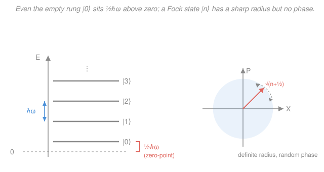

# Quantum Optics & Photonics · Lesson 3.2: Fock states, the vacuum & zero-point energy

> ⏱ ~15 min · Module 3: Field quantization & photon states · Builds on: [3.1 Quantizing the EM field](03-01-quantizing-em-field.md) · Unlocks: [3.3 Coherent states](03-03-coherent-states.md)

## Why this matters

In [3.1](03-01-quantizing-em-field.md) you turned a single mode of light into a quantum harmonic oscillator: a Hamiltonian $\hat H = \hbar\omega(\hat a^\dagger\hat a + \tfrac12)$ built from ladder operators. That machinery is inert until you ask *what states does the field actually live in?* The most fundamental answer is the **Fock states** $|n\rangle$ — states with a perfectly definite number of photons. They are the alphabet of quantum optics: every other state of light (coherent, thermal, squeezed) is a superposition of them. And the very bottom of the ladder, $|0\rangle$, is not "nothing" — it carries energy $\tfrac12\hbar\omega$ and a jittering field that never switches off. That vacuum jitter is what kicks excited atoms into emitting ([1.3](01-03-absorption-spontaneous-stimulated-emission.md)'s spontaneous emission) and what pushes two mirrors together in the Casimir effect. This lesson is where "the electromagnetic field is quantized" stops being a slogan and starts making numbers.

## The idea

Think of the mode as a ladder of energy rungs, evenly spaced by $\hbar\omega$. A **Fock state** (or **number state**) $|n\rangle$ is the state sitting exactly on rung $n$: it contains precisely $n$ photons — not on average, *exactly*. Count the photons and you always get $n$, with zero spread.

That certainty comes at a price the classical picture never warned you about. A classical light wave has a well-defined amplitude *and* a well-defined phase — you can point to where the crest is. A Fock state throws the phase away entirely. Knowing the photon number exactly means knowing nothing about the phase (a number-phase trade-off, cousin to position-momentum uncertainty). So $|n\rangle$ is the polar opposite of a classical wave: rock-solid intensity, totally undefined "where the wave is." Its *average* electric field is flat zero, even though its energy is large.

And the ground rung, $|0\rangle$, is the strangest of all. Classically, "no photons" should mean "no field, no energy." Quantumly, the oscillator can't sit still at the bottom of its well — the uncertainty principle forbids simultaneously zero field and zero rate-of-change of field. So the vacuum keeps $\tfrac12\hbar\omega$ of **zero-point energy** and a genuinely fluctuating field whose *average* is zero but whose *variance* is not. Empty space hums.

## The formal version

**Number operator and its eigenstates.** Define $\hat n = \hat a^\dagger\hat a$ from the ladder operators of [3.1](03-01-quantizing-em-field.md) (with $[\hat a,\hat a^\dagger]=1$). The Fock states are its eigenstates:

$$\hat n\,|n\rangle = n\,|n\rangle, \qquad n = 0,1,2,\dots$$

*In words: $|n\rangle$ is the state in which the photon count is definitely $n$.* Since $\hat H = \hbar\omega(\hat n + \tfrac12)$, they are also energy eigenstates with

$$E_n = \hbar\omega\left(n + \tfrac12\right).$$

*In words: each added photon costs one quantum $\hbar\omega$, but the ladder starts half a quantum above zero.* Here $\hbar$ is the reduced Planck constant and $\omega$ the mode's angular frequency (rad/s).

**Ladder actions — mind the square roots.** The operators step between rungs with $n$-dependent weights:

$$\hat a\,|n\rangle = \sqrt{n}\,|n-1\rangle, \qquad \hat a^\dagger\,|n\rangle = \sqrt{n+1}\,|n+1\rangle.$$

*In words: $\hat a$ destroys a photon, $\hat a^\dagger$ creates one — but each carries a $\sqrt{\text{count}}$ factor, so the steps are not uniform.* The floor of the ladder is fixed by

$$\hat a\,|0\rangle = 0,$$

*In words: you can't remove a photon from the vacuum — that's what defines $|0\rangle$.* Applying $\hat a^\dagger$ repeatedly builds every rung from the floor:

$$|n\rangle = \frac{(\hat a^\dagger)^n}{\sqrt{n!}}\,|0\rangle.$$

The $\sqrt{n!}$ keeps $|n\rangle$ normalized. (This is *exactly* the harmonic-oscillator ladder from [quantum mechanics](../../quantum-mechanics/syllabus.md), relabeled for photons.)

**No mean field, but real fluctuations.** The single-mode field operator has the form $\hat E \propto (\hat a + \hat a^\dagger)$ (a quadrature; the constant is the "field per photon" of [3.1](03-01-quantizing-em-field.md)). Since $\hat a$ and $\hat a^\dagger$ each shift the rung, $\langle n|\hat a|n\rangle = \langle n|\hat a^\dagger|n\rangle = 0$, so

$$\langle n|\hat E|n\rangle = 0 \quad\text{for every } n, \qquad\text{but}\qquad \langle n|\hat E^2|n\rangle \propto \langle n|(\hat a\hat a^\dagger + \hat a^\dagger\hat a)|n\rangle = 2n+1 \neq 0.$$

*In words: the average field vanishes, yet its spread does not — and at $n=0$ the spread is still $\propto 1$.* That nonzero $\langle 0|\hat E^2|0\rangle$ is the **vacuum fluctuation**.

**Zero-point energy and Casimir.** Every mode contributes $\tfrac12\hbar\omega$ even when empty. Sum over the infinitely many modes of free space and the total is formally infinite — usually harmless because only energy *differences* matter. But if you insert boundaries (two conducting plates a distance $d$ apart), you cull the modes that don't fit between them, and the allowed zero-point sum now *depends on $d$*. A $d$-dependent energy is a force: the plates are pushed together. On dimensional grounds the only combination of $\hbar$, $c$, and $d$ with units of pressure is $\hbar c/d^4$, so the **Casimir** force per unit area scales as $\sim \hbar c/d^4$ (see Problem 3). Nothing is between the plates but vacuum, and it pushes.

**Number statistics.** In $|n\rangle$ the photon count has zero variance, $\mathrm{Var}(n)=0$ — as far below the Poisson level $\mathrm{Var}=\bar n$ as you can get (**sub-Poissonian**). Its second-order coherence (from [2.3](02-03-photon-statistics-g2.md)) is

$$g^{(2)}(0) = \frac{\langle\hat a^\dagger\hat a^\dagger\hat a\hat a\rangle}{\langle\hat a^\dagger\hat a\rangle^2} = \frac{n(n-1)}{n^2} = 1 - \frac1n.$$

*In words: Fock states are antibunched — a single-photon state $|1\rangle$ gives $g^{(2)}(0)=0$, the perfect "one at a time" light of [2.4](02-04-hanbury-brown-twiss.md).* This is manifestly nonclassical (no classical field can reach below 1), which is exactly why high-$n$ Fock states are so hard to make.

## Picture

## Worked examples

**Example 1 (the ladder in action).** Act on $|2\rangle$ with each operator, keeping the roots straight.

$$\hat a\,|2\rangle = \sqrt{2}\,|1\rangle, \qquad \hat a^\dagger\,|2\rangle = \sqrt{3}\,|3\rangle.$$

Now apply $\hat a^\dagger\hat a$ (the number operator) and check consistency:

$$\hat a^\dagger\hat a\,|2\rangle = \hat a^\dagger\big(\sqrt2\,|1\rangle\big) = \sqrt2\,\big(\sqrt2\,|2\rangle\big) = 2\,|2\rangle \;\checkmark$$

— eigenvalue $2$, as $\hat n|2\rangle = 2|2\rangle$ demands. Notice $\hat a\hat a^\dagger|2\rangle = \hat a(\sqrt3\,|3\rangle) = \sqrt3\cdot\sqrt3\,|2\rangle = 3|2\rangle$; the two orderings differ by exactly $1$, which *is* the commutator $[\hat a,\hat a^\dagger]=1$.

**Example 2 (the vacuum is not empty).** Take the ground state $|0\rangle$. Its energy is $E_0 = \tfrac12\hbar\omega \neq 0$. Its mean field is $\langle 0|\hat E|0\rangle = 0$ (no crest to point at), yet $\langle 0|\hat E^2|0\rangle \propto 2(0)+1 = 1 \neq 0$: the field jitters about zero with a fixed variance. That jitter is physical. An excited atom in "empty" space is not actually left alone — it is bathed in these vacuum fluctuations, which stimulate it to decay. That is the microscopic origin of **spontaneous emission** and Einstein's $A$ coefficient from [1.3](01-03-absorption-spontaneous-stimulated-emission.md): spontaneous emission is *stimulated emission driven by the vacuum*. No vacuum fluctuations, no spontaneous decay, no starlight.

## Watch out

- **You might think $\hat a^\dagger|n\rangle = |n+1\rangle$.** It isn't — it's $\sqrt{n+1}\,|n+1\rangle$. Drop the root and your states stop being normalized and your $g^{(2)}$ comes out wrong. The lone exception people misremember: $\hat a|0\rangle = 0$ (the number zero, not the state $|0\rangle$).
- **You might read "$\langle\hat E\rangle = 0$" as "no field / no light."** A Fock state can carry huge energy; it's the *average* field that's zero because the phase is random, so the field is equally likely to point either way. Energy lives in $\langle\hat E^2\rangle$, which is large. Zero mean, nonzero power.
- **You might expect a bright Fock state to look classical.** The opposite: raising $n$ makes $g^{(2)}(0)=1-1/n$ creep *up toward* 1, but every $|n\rangle$ stays sub-Poissonian and phaseless — never a wave with a definite crest. Classical-looking light is the *coherent* state of [3.3](03-03-coherent-states.md), not a Fock state.

## One-liner

> A Fock state $|n\rangle$ is light with an exact photon count and no phase at all — and its ground rung $|0\rangle$ still holds $\tfrac12\hbar\omega$ of jittering vacuum energy that empties atoms and pushes plates.

## Problems

**P1 (🟢)** For the Fock state $|3\rangle$: (a) evaluate $\hat a\,|3\rangle$ and $\hat a^\dagger\,|3\rangle$ with the correct numerical factors; (b) give the energy $E_3$ in terms of $\hbar\omega$; (c) what is $\hat a^\dagger\hat a\,|3\rangle$?

**P2 (🟡)** Compute $g^{(2)}(0)$ for a general Fock state $|n\rangle$ using $g^{(2)}(0) = \langle\hat a^\dagger\hat a^\dagger\hat a\hat a\rangle/\langle\hat a^\dagger\hat a\rangle^2$. Evaluate it for $n=1$ and $n=2$, and say in one sentence what the $n=1$ value means physically.

**P3 (🔴)** Without computing the exact prefactor, use dimensional analysis to argue that the Casimir force per unit area between two plates separated by $d$ scales as $\hbar c/d^4$. (Hint: the plates are perfect conductors and the gap is vacuum, so the *only* dimensionful ingredients are $\hbar$, $c$, and $d$. Build a pressure from them; then relate force-per-area to $-\,d(\text{energy-per-area})/dd$.)

Solutions

**P1** (a) Apply the ladder rules with $n=3$:

$$\hat a\,|3\rangle = \sqrt3\,|2\rangle, \qquad \hat a^\dagger\,|3\rangle = \sqrt{3+1}\,|4\rangle = 2\,|4\rangle.$$

(b) $E_n = \hbar\omega(n+\tfrac12)$, so $E_3 = \hbar\omega(3+\tfrac12) = \tfrac72\hbar\omega$.

(c) $\hat a^\dagger\hat a = \hat n$, and $|3\rangle$ is its eigenstate: $\hat a^\dagger\hat a\,|3\rangle = 3\,|3\rangle$. (Check via composition: $\hat a|3\rangle=\sqrt3|2\rangle$, then $\hat a^\dagger(\sqrt3|2\rangle)=\sqrt3\cdot\sqrt3|3\rangle=3|3\rangle$ ✓.)

**P2** Work numerator and denominator on $|n\rangle$.

*Denominator:* $\langle\hat a^\dagger\hat a\rangle = \langle n|\hat n|n\rangle = n$, so $\langle\hat a^\dagger\hat a\rangle^2 = n^2$.

*Numerator:* apply the two annihilations first. $\hat a|n\rangle=\sqrt n\,|n-1\rangle$, then $\hat a\,\sqrt n|n-1\rangle = \sqrt n\,\sqrt{n-1}\,|n-2\rangle = \sqrt{n(n-1)}\,|n-2\rangle$. The creations mirror this, so

$$\langle n|\hat a^\dagger\hat a^\dagger\hat a\hat a|n\rangle = \big\|\hat a\hat a|n\rangle\big\|^2 = \big(\sqrt{n(n-1)}\big)^2 = n(n-1).$$

Therefore

$$g^{(2)}(0) = \frac{n(n-1)}{n^2} = 1 - \frac1n.$$

For $n=1$: $g^{(2)}(0) = 1 - 1 = 0$. For $n=2$: $g^{(2)}(0) = 1 - \tfrac12 = \tfrac12$. The $n=1$ value $g^{(2)}(0)=0$ means **perfect antibunching**: a single-photon state can never trigger two detectors at once (there's only one photon to go around), the hallmark of a true single-photon source. (Note $g^{(2)}(0)<1$ for all finite $n$ — impossible for any classical field, confirming Fock states are nonclassical.)

**P3** A *pressure* (force per unit area) has SI units $\mathrm{Pa} = \mathrm{N/m^2} = \mathrm{J/m^3}$ — an energy density. The available ingredients are $\hbar$ ($[\mathrm{J\,s}]$), $c$ ($[\mathrm{m/s}]$), and the gap $d$ ($[\mathrm{m}]$). Seek an energy density

$$P \sim \hbar^{a} c^{b} d^{e}, \qquad [\hbar^a c^b d^e] = \mathrm{J\,m^{-3}}.$$

$\hbar^a c^b$ has units $\mathrm{J^a\,s^{a}}\cdot\mathrm{m^b\,s^{-b}}$. To get a single power of Joules, $a=1$. To cancel the seconds, $b - a = 0 \Rightarrow b = 1$. So far $\hbar c$ has units $\mathrm{J\cdot m}$; to reach $\mathrm{J\,m^{-3}}$ we need $d^{e}$ with $e = -4$. Hence

$$P \sim \frac{\hbar c}{d^4}.$$

*Consistency via energy.* The zero-point energy per unit *area* between the plates must, by the same counting, scale as $\mathcal{E}/A \sim \hbar c/d^3$ (units $\mathrm{J\,m^{-2}}$: only $d^{-3}$ works with $\hbar c$). The pressure is $P = -\,\dfrac{d}{dd}\!\left(\dfrac{\mathcal E}{A}\right) \sim -\,\dfrac{d}{dd}\big(\hbar c\,d^{-3}\big) = +3\,\hbar c\,d^{-4}$, confirming $P \sim \hbar c/d^4$ — attractive (energy falls as the plates close, so the force pulls them together). The exact QED result is $P = \pi^2\hbar c/(240\,d^4)$; dimensional analysis nails everything but the pure number.

## Flashback

**From Lesson 3.1 (Quantizing the EM field):** Starting only from the canonical commutator $[\hat a,\hat a^\dagger]=1$, show that $[\hat n,\hat a^\dagger] = \hat a^\dagger$ where $\hat n=\hat a^\dagger\hat a$. Then explain in one line why this identity forces $\hat a^\dagger$ to raise the photon number by exactly one.

Solution

Expand using the linearity of the commutator and the product rule $[\hat A\hat B,\hat C]=\hat A[\hat B,\hat C]+[\hat A,\hat C]\hat B$:

$$[\hat n,\hat a^\dagger] = [\hat a^\dagger\hat a,\,\hat a^\dagger] = \hat a^\dagger\underbrace{[\hat a,\hat a^\dagger]}_{=\,1} + \underbrace{[\hat a^\dagger,\hat a^\dagger]}_{=\,0}\,\hat a = \hat a^\dagger.$$

*Why it forces a step of $+1$:* rearranged, $\hat n\,\hat a^\dagger = \hat a^\dagger\hat n + \hat a^\dagger = \hat a^\dagger(\hat n+1)$. Acting on $|n\rangle$,

$$\hat n\big(\hat a^\dagger|n\rangle\big) = \hat a^\dagger(\hat n+1)|n\rangle = (n+1)\,\hat a^\dagger|n\rangle,$$

so $\hat a^\dagger|n\rangle$ is an eigenstate of $\hat n$ with eigenvalue $n+1$ — it *must* be proportional to $|n+1\rangle$. (Normalization then fixes the coefficient to $\sqrt{n+1}$.) The commutator is the whole reason the ladder has evenly spaced rungs.

## Connections

- **Backward:** this is the state-space companion to [3.1](03-01-quantizing-em-field.md)'s operators — the Fock states are the eigenbasis of the $\hat H=\hbar\omega(\hat n+\tfrac12)$ you built there, and they *are* the harmonic-oscillator number states of [quantum mechanics](../../quantum-mechanics/syllabus.md) wearing a photon label. The $g^{(2)}(0)$ formula is the one from [2.3](02-03-photon-statistics-g2.md), now evaluated on a genuine quantum state.
- **Forward:** [3.3 Coherent states](03-03-coherent-states.md) builds the *opposite* extreme — superpositions of Fock states with a sharp phase and Poissonian number spread, the closest quantum light gets to a classical wave. Squeezed states ([3.5](03-05-squeezed-states.md)) then trade number-noise against phase-noise around the vacuum you met here.
- **Sideways:** the vacuum fluctuations of $|0\rangle$ are the same object that drives spontaneous emission in [1.3](01-03-absorption-spontaneous-stimulated-emission.md) (Einstein's $A$ coefficient) and produces the Casimir force — both are the [quantum field theory](../../qft/syllabus.md) statement that the ground state of a field is dynamically alive, not empty.
