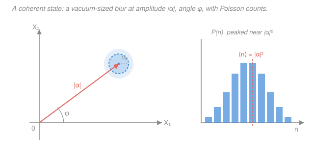

# Quantum Optics & Photonics · Lesson 3.3: Coherent states — the most classical light

> ⏱ ~15 min · Module 3: Field quantization & photon states · Builds on: [3.2 Fock states, the vacuum & zero-point energy](03-02-fock-states-vacuum-zero-point.md) · Unlocks: [3.4 Quadratures, phase space & shot noise](03-04-quadratures-phase-space-shot-noise.md)

## Why this matters

Last lesson we built the Fock states $|n\rangle$ — states of *exactly* $n$ photons. They are the energy eigenstates, mathematically clean, and about as far from a classical light beam as you can get: a single-photon Fock state clicks a detector at strictly regular-ish intervals, has zero average field, and is a laboratory rarity. So here's the question that should be nagging you: **what state does an ordinary laser actually emit?** A laser pointer produces a beam that behaves like Maxwell's classical wave — a definite oscillating field, an amplitude, a phase. None of the $|n\rangle$ do that. The answer is the **coherent state** $|\alpha\rangle$, and it is the bridge from the quantum ladder back to the classical wave you started this course with. Nail it and squeezing (3.5), shot noise (3.4), and homodyne detection all fall into place.

## The idea

Think of the quantized field mode as the quantum harmonic oscillator it is (from [3.1](03-01-quantizing-em-field.md)): a "position" and "momentum" that are really the two quadratures of the field. The vacuum $|0\rangle$ is the ground state — a fuzzy blob of zero-point jitter sitting at the origin of that phase space, with no average field. Now imagine grabbing that blob and *sliding it* out to some point a distance $|\alpha|$ from the origin, without squishing or spreading it. What you get is a little disk of vacuum-sized fuzz, parked away from center. Its middle traces out a classical circular orbit as time runs — exactly a classical oscillating field — while the fuzz around it is the irreducible quantum uncertainty you can never remove.

That displaced blob **is** the coherent state. It's the closest a quantum state can come to a classical wave of definite amplitude and phase: the center of the blob gives you the classical amplitude $|\alpha|$ and phase $\arg\alpha$, and the blob's finite size is the quantum noise you're stuck with. Crank $|\alpha|$ up — a brighter beam — and the blob sits farther out while staying the same tiny size, so the noise *relative* to the signal shrinks. That is precisely why bright laser light looks so convincingly classical, and why faint light does not.

## The formal version

There are two equivalent definitions; each teaches something different.

**Definition 1 — eigenstate of the annihilation operator.**

$$\hat a\,|\alpha\rangle = \alpha\,|\alpha\rangle, \qquad \alpha \in \mathbb{C}.$$

*In words: a coherent state is unchanged (up to a number) when you remove a photon.* The complex number $\alpha = |\alpha|e^{i\phi}$ carries both the amplitude $|\alpha|$ and the phase $\phi = \arg\alpha$ of the classical field it mimics. This is startling — removing a photon from $|n\rangle$ drops you to $|n-1\rangle$, a *different* state, but a coherent state is so photon-rich and phase-definite that plucking one out leaves it statistically identical. The eigenvalue's modulus fixes the mean photon number, $\langle\hat n\rangle = \langle\alpha|\hat a^\dagger\hat a|\alpha\rangle = |\alpha|^2$ (derived in Example 1).

**Definition 2 — displaced vacuum.** Define the **displacement operator**

$$\hat D(\alpha) = e^{\alpha\hat a^\dagger - \alpha^*\hat a}, \qquad |\alpha\rangle = \hat D(\alpha)\,|0\rangle.$$

*In words: take the vacuum and shift it by $\alpha$ in phase space.* $\hat D(\alpha)$ is unitary ($\hat D^\dagger\hat D = 1$), so it moves the vacuum blob rigidly — no spreading, no squeezing — which is the picture from "The idea" made exact. This is the definition that says "most classical": you did the gentlest possible thing to the vacuum.

**The Fock expansion.** Writing $|\alpha\rangle$ in the number basis (Problem 3 derives this from Definition 1):

$$|\alpha\rangle = e^{-|\alpha|^2/2}\sum_{n=0}^{\infty}\frac{\alpha^n}{\sqrt{n!}}\,|n\rangle.$$

*In words: a coherent state is a specific superposition of all photon numbers at once, weighted by $\alpha^n/\sqrt{n!}$.* It is emphatically **not** a state of definite photon number.

**Photon statistics — Poissonian.** The probability of finding exactly $n$ photons is the squared amplitude, $P(n) = |\langle n|\alpha\rangle|^2$:

$$P(n) = e^{-|\alpha|^2}\,\frac{|\alpha|^{2n}}{n!}.$$

This is a **Poisson distribution** with mean $\lambda = |\alpha|^2$. Its defining signature (Problems 1–2):

$$\langle n\rangle = |\alpha|^2, \qquad \operatorname{Var}(n) = |\alpha|^2 \quad\Longrightarrow\quad \Delta n = |\alpha| = \sqrt{\langle n\rangle}.$$

*In words: for coherent light the variance of the photon count equals its mean — the hallmark of independent, random arrivals.* Hence the **relative** fluctuation

$$\frac{\Delta n}{\langle n\rangle} = \frac{|\alpha|}{|\alpha|^2} = \frac{1}{|\alpha|} = \frac{1}{\sqrt{\langle n\rangle}} \xrightarrow{\ |\alpha|\to\infty\ } 0.$$

A brighter beam is *proportionally* quieter — the classical limit. And because the photons arrive independently, the second-order coherence from [2.3](02-03-photon-statistics-g2.md) is $g^{(2)}(0) = 1$ exactly: coherent light is neither bunched nor antibunched, just random. This single number, $g^{(2)}(0)=1$, is the operational fingerprint of an ideal laser.

**Near-classical dynamics.** Introduce the two **field quadratures** — the "position" and "momentum" of the mode (the stars of the next lesson):

$$\hat X_1 = \frac{\hat a + \hat a^\dagger}{2}, \qquad \hat X_2 = \frac{\hat a - \hat a^\dagger}{2i}.$$

In a coherent state $\langle\hat X_1\rangle = \operatorname{Re}\alpha$ and $\langle\hat X_2\rangle = \operatorname{Im}\alpha$ — the blob sits at the point $\alpha$ in the $(X_1,X_2)$ plane. Both quadratures carry the *same* minimal, vacuum-sized uncertainty $\Delta X_1 = \Delta X_2 = \tfrac12$, saturating the uncertainty bound $\Delta X_1\,\Delta X_2 = \tfrac14$: a coherent state is a **minimum-uncertainty wavepacket**. Under free evolution ($\hat H = \hbar\omega(\hat n + \tfrac12)$) it stays coherent — the label just rotates, $|\alpha(t)\rangle = e^{-i\omega t/2}|\alpha e^{-i\omega t}\rangle$, so the blob circles the origin at frequency $\omega$ without spreading. The measurable field expectation then oscillates like a textbook classical wave,

$$\langle\hat E(t)\rangle \propto |\alpha|\cos(\omega t - \phi),$$

with amplitude set by $|\alpha|$ and phase by $\phi = \arg\alpha$. That is the whole point: the *center* of the coherent blob obeys Maxwell, and the fuzz around it is the quantum noise floor.

One caveat for bookkeeping: coherent states are **not orthogonal** ($\langle\beta|\alpha\rangle = e^{-|\alpha|^2/2 - |\beta|^2/2 + \beta^*\alpha} \neq 0$) and form an **overcomplete** set — there are "more" of them than an orthonormal basis needs, which is why they overlap.

## Picture

The left panel is the phase-space snapshot: the classical amplitude is the coral arrow of length $|\alpha|$ at angle $\phi$, and the blue blob (radius $\sim\tfrac12$, the vacuum spread) is the quantum uncertainty that rides along. Free evolution spins this blob around the origin. The right panel is the photon-number histogram — a Poisson distribution peaked near $\langle n\rangle = |\alpha|^2$, whose width $\Delta n = |\alpha|$ grows only as the *square root* of the mean.

## Worked examples

**Example 1 (mechanical — mean photon number from the eigenvalue equation).** Compute $\langle\hat n\rangle = \langle\alpha|\hat a^\dagger\hat a|\alpha\rangle$ directly. Act $\hat a$ to the right using $\hat a|\alpha\rangle = \alpha|\alpha\rangle$, and take the adjoint of that same equation, $\langle\alpha|\hat a^\dagger = \alpha^*\langle\alpha|$, to act $\hat a^\dagger$ to the left:

$$\langle\hat n\rangle = \big(\langle\alpha|\hat a^\dagger\big)\big(\hat a|\alpha\rangle\big) = (\alpha^*\langle\alpha|)(\alpha|\alpha\rangle) = |\alpha|^2\,\langle\alpha|\alpha\rangle = |\alpha|^2,$$

using the normalization $\langle\alpha|\alpha\rangle = 1$. So $|\alpha|^2$ is literally the average number of photons — the beam's intensity. A milliwatt of red laser light has $|\alpha|^2 \sim 10^{15}$ photons per second through a detector; with $|\alpha|$ that enormous, the relative noise $1/|\alpha| \sim 10^{-8}$ is why you never *see* the graininess.

**Example 2 (why you'd care — a coherent state is not a Fock state).** A common trap: "a laser beam of average power $\langle n\rangle = 4$ photons is just the state $|4\rangle$." It is not. Compare their photon statistics. The Fock state $|4\rangle$ gives $P(4) = 1$ and $\operatorname{Var}(n) = 0$ — perfectly repeatable counts. The coherent state with $|\alpha|^2 = 4$ gives a *spread* of outcomes:

$$P(n) = e^{-4}\frac{4^n}{n!}:\quad P(2)\approx 0.147,\ \ P(4)\approx 0.195,\ \ P(6)\approx 0.104,$$

with $\operatorname{Var}(n) = 4$, so $\Delta n = 2$. Same mean, completely different fluctuations — and different $g^{(2)}(0)$: the Fock state has $g^{(2)}(0) = 1 - 1/n = 3/4$ (antibunched), the coherent state has $g^{(2)}(0) = 1$ (random). Photon statistics, not mean intensity, is what distinguishes a laser from a single-photon source.

## Watch out

- **You might think $|\alpha\rangle$ has a definite number of photons.** It has a definite *complex amplitude*, which is the opposite trade: sharp phase, fuzzy photon number. Definite photon number ($|n\rangle$) means *completely random phase*. You cannot have both — they are the number–phase uncertainty pair.
- **You might read $\alpha$ as a photon count.** It's a complex amplitude; the count is its modulus squared, $\langle n\rangle = |\alpha|^2$. So $\alpha = 10$ means $\langle n\rangle = 100$, and $\Delta n = 10$ — not $\Delta n = \sqrt{10}$.
- **You might expect coherent states to be orthogonal like $|n\rangle$.** They aren't: $|\langle\beta|\alpha\rangle|^2 = e^{-|\alpha-\beta|^2}$, which is only small when $\alpha$ and $\beta$ are far apart in phase space. Two nearby coherent states genuinely overlap — the price of being an overcomplete, classical-like set.
- **You might think "coherent" means "coherent superposition of number states."** The name is older; it refers to the *classical coherence* of the field (definite phase, first-order coherent). It is a superposition of number states, but that's not where the name comes from.

## One-liner

> A coherent state $|\alpha\rangle$ is the vacuum slid out to amplitude $\alpha$ — a minimum-uncertainty blob with Poissonian photon counts ($\Delta n = \sqrt{\langle n\rangle}$, $g^{(2)}=1$) whose center obeys Maxwell: the quantum state of laser light.

## Problems

**P1 (🟢)** A laser is in a coherent state with mean photon number $\langle n\rangle = |\alpha|^2 = 100$. Find the photon-number uncertainty $\Delta n$ and the relative fluctuation $\Delta n/\langle n\rangle$. Then repeat for $\langle n\rangle = 10^{6}$ and comment on the trend.

**P2 (🟡)** Starting from the Poisson distribution $P(n) = e^{-\lambda}\lambda^n/n!$ with $\lambda = |\alpha|^2$, verify directly that $\langle n\rangle = \lambda$ and $\operatorname{Var}(n) = \lambda$. (Hint: compute $\langle n\rangle$ and the factorial moment $\langle n(n-1)\rangle$.)

**P3 (🔴)** Show that the annihilation-operator eigenvalue equation $\hat a|\alpha\rangle = \alpha|\alpha\rangle$ *forces* the Poissonian statistics. Expand $|\alpha\rangle = \sum_n c_n|n\rangle$, use $\hat a|n\rangle = \sqrt{n}\,|n-1\rangle$ to get a recursion for the $c_n$, solve it, normalize, and read off $P(n) = |c_n|^2$. (This is the core move in Boss Problem 3.)

Solutions

**P1** For a coherent state $\operatorname{Var}(n) = \langle n\rangle$, so $\Delta n = \sqrt{\langle n\rangle}$.

For $\langle n\rangle = 100$: $\ \Delta n = \sqrt{100} = 10$, and $\dfrac{\Delta n}{\langle n\rangle} = \dfrac{10}{100} = 0.1 = \dfrac{1}{|\alpha|}$ (here $|\alpha| = 10$).

For $\langle n\rangle = 10^{6}$: $\ \Delta n = \sqrt{10^6} = 10^3$, and $\dfrac{\Delta n}{\langle n\rangle} = \dfrac{10^3}{10^6} = 10^{-3}$.

**Trend.** The *absolute* spread $\Delta n$ grows (10 → 1000), but the *relative* spread falls as $1/\sqrt{\langle n\rangle} = 1/|\alpha|$ (0.1 → 0.001). Brighter light is proportionally quieter, which is exactly why macroscopic laser beams look like smooth classical waves and single-photon-level light does not.

**P2** Let $\lambda = |\alpha|^2$.

*Mean.* Drop the $n=0$ term (it contributes $0$), cancel one factor of $n$, and shift the index $m = n-1$:

$$\langle n\rangle = \sum_{n=0}^\infty n\,e^{-\lambda}\frac{\lambda^n}{n!} = e^{-\lambda}\lambda\sum_{n=1}^\infty\frac{\lambda^{n-1}}{(n-1)!} = e^{-\lambda}\lambda\sum_{m=0}^\infty\frac{\lambda^m}{m!} = e^{-\lambda}\lambda\,e^{\lambda} = \lambda.$$

*Factorial moment.* Same trick, now cancelling $n(n-1)$ and shifting $m = n-2$:

$$\langle n(n-1)\rangle = \sum_{n=2}^\infty n(n-1)\,e^{-\lambda}\frac{\lambda^n}{n!} = e^{-\lambda}\lambda^2\sum_{n=2}^\infty\frac{\lambda^{n-2}}{(n-2)!} = e^{-\lambda}\lambda^2 e^{\lambda} = \lambda^2.$$

*Variance.* Since $\langle n^2\rangle = \langle n(n-1)\rangle + \langle n\rangle = \lambda^2 + \lambda$,

$$\operatorname{Var}(n) = \langle n^2\rangle - \langle n\rangle^2 = (\lambda^2 + \lambda) - \lambda^2 = \lambda.$$

So $\langle n\rangle = \operatorname{Var}(n) = \lambda = |\alpha|^2$. Mean equals variance — the Poisson signature. ✓

**P3** Expand in the number basis, $|\alpha\rangle = \sum_{n=0}^\infty c_n|n\rangle$. Apply $\hat a$, using $\hat a|n\rangle = \sqrt{n}\,|n-1\rangle$ (the $n=0$ term dies), then relabel $m = n-1$:

$$\hat a|\alpha\rangle = \sum_{n=1}^\infty c_n\sqrt{n}\,|n-1\rangle = \sum_{m=0}^\infty c_{m+1}\sqrt{m+1}\,|m\rangle.$$

Set this equal to $\alpha|\alpha\rangle = \sum_m \alpha\,c_m|m\rangle$. Matching the coefficient of each $|m\rangle$ gives the recursion

$$c_{m+1}\sqrt{m+1} = \alpha\,c_m \quad\Longrightarrow\quad c_{m+1} = \frac{\alpha}{\sqrt{m+1}}\,c_m.$$

Iterating from $c_0$:

$$c_n = \frac{\alpha^n}{\sqrt{n!}}\,c_0.$$

Normalize: $1 = \sum_n |c_n|^2 = |c_0|^2\sum_n\frac{|\alpha|^{2n}}{n!} = |c_0|^2\,e^{|\alpha|^2}$, so (choosing $c_0$ real and positive) $c_0 = e^{-|\alpha|^2/2}$. Therefore

$$c_n = e^{-|\alpha|^2/2}\frac{\alpha^n}{\sqrt{n!}}, \qquad P(n) = |c_n|^2 = e^{-|\alpha|^2}\frac{|\alpha|^{2n}}{n!},$$

which is exactly the Poisson distribution with mean $|\alpha|^2$. The eigenvalue equation alone — no extra assumptions — pins down both the Fock expansion and the photon statistics. (Bonus, the same $c_n$ give the overlap $\langle\beta|\alpha\rangle = \sum_n \frac{(\beta^*)^n\alpha^n}{n!}e^{-|\alpha|^2/2-|\beta|^2/2} = e^{\beta^*\alpha - |\alpha|^2/2 - |\beta|^2/2}$, whose modulus squared is $e^{-|\alpha-\beta|^2}$ — the non-orthogonality quoted above.)

## Flashback

**From Lesson 3.2 (Fock states):** A single-mode field is prepared in the Fock state $|n=5\rangle$. Using the result that a Fock state has second-order coherence $g^{(2)}(0) = 1 - \tfrac{1}{n}$, compute $g^{(2)}(0)$ for $n=5$, and state whether the light is bunched, antibunched, or random. How does this compare with the coherent state from today?

Solution

For a Fock state, $g^{(2)}(0) = 1 - \dfrac{1}{n}$. With $n = 5$:

$$g^{(2)}(0) = 1 - \frac{1}{5} = \frac{4}{5} = 0.8.$$

Since $g^{(2)}(0) < 1$, the light is **antibunched** — the photons avoid arriving together (having exactly 5 photons, once one is detected there are provably fewer left, suppressing coincidences). This is a strictly nonclassical value.

Contrast with today's coherent state, which has $g^{(2)}(0) = 1$ exactly (random, Poissonian arrivals — the classical boundary). As $n\to\infty$ the Fock value $1 - 1/n \to 1$ creeps up toward the coherent result, but for any finite $n$ it sits below 1: Fock states are always more ordered (quieter in $g^{(2)}$) than the "most classical" coherent state. The two families sit on opposite sides of the classical line — antibunched Fock light below, and (as we'll see in 3.5) bunched thermal/squeezed light above.

## Connections

- **Backward:** the displaced-vacuum picture is the [3.1](03-01-quantizing-em-field.md) harmonic-oscillator mode with its ground state shifted; the Poisson counts and $g^{(2)}(0)=1$ are the coherent-light entries of the photon-statistics table from [2.3](02-03-photon-statistics-g2.md). The quantized mode being an oscillator ladder is the same ladder you met in quantum mechanics — see [`quantum-mechanics`](../../quantum-mechanics/syllabus.md).
- **Forward:** [3.4 Quadratures, phase space & shot noise](03-04-quadratures-phase-space-shot-noise.md) takes the $(\hat X_1,\hat X_2)$ blob literally — the vacuum-sized uncertainty of a coherent state *is* the shot-noise limit of a laser measurement. [3.5 Squeezed states](03-05-squeezed-states.md) then asks: what if we squash the blob in one quadrature (below the coherent floor) at the cost of fattening the other? Coherent states are the reference everything is squeezed *relative to*.
- **Sideways:** the near-classical field $\langle\hat E\rangle \propto |\alpha|\cos(\omega t - \phi)$ is exactly the classical traveling wave from Module 1 and the classical EM you'd find in [`em-refresher`](../../em-refresher/syllabus.md) — coherent states are the precise sense in which "quantize the field, take $|\alpha|$ large" reproduces Maxwell. The minimum-uncertainty, non-spreading blob is the field-mode cousin of the Gaussian coherent state of a mechanical oscillator.
