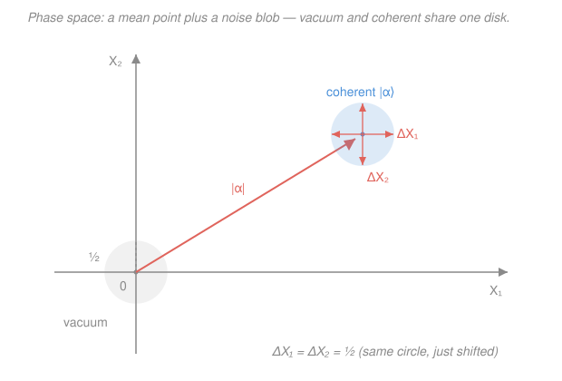

# Quantum Optics & Photonics · Lesson 3.4: Quadratures, phase space & shot noise

> ⏱ ~15 min · Module 3: Field quantization & photon states · Builds on: [3.3 Coherent states](03-03-coherent-states.md) · Unlocks: [3.5 Squeezed states](03-05-squeezed-states.md)

## Why this matters

A laser beam is not a perfectly sharp arrow of light. Aim it at a photodetector and the current jitters; try to read its phase in an interferometer and the phase blurs. That jitter — **shot noise** — is not sloppy electronics you can engineer away. It is the vacuum itself, leaking into every measurement, and it sets the **standard quantum limit (SQL)**: the best precision ordinary light allows. LIGO, atomic clocks, and gravitational-wave detectors all live at this floor. To beat it you first have to *see* it clearly, and the cleanest picture is **phase space** — the field drawn as a point with a fuzzy halo. This lesson builds that picture and names its axes; [3.5](03-05-squeezed-states.md) then shows how to cheat the halo into an ellipse.

## The idea

A classical light wave of one frequency is $E(t) = X_1\cos\omega t + X_2\sin\omega t$: two knobs, the **cosine amplitude** $X_1$ and the **sine amplitude** $X_2$, set its size and phase. Together $(X_1, X_2)$ is a single point on a 2-D plane — draw the field as an arrow of length $\sqrt{X_1^2+X_2^2}$ (amplitude) at angle $\arctan(X_2/X_1)$ (phase). That plane is **phase space**.

Quantize the field and those two amplitudes become **operators** $\hat X_1, \hat X_2$ — the field's "position" and "momentum." And like position and momentum, they **refuse to be pinned down together**: fix the cosine amplitude precisely and the sine amplitude goes fuzzy. So a quantum state is no longer a sharp point. It is a *point plus a blur* — a mean location $(\langle X_1\rangle, \langle X_2\rangle)$ surrounded by an unavoidable noise blob whose size is set by the uncertainty relation.

The vacuum is the humblest such state: it sits at the origin (zero mean field) but still carries a blob of radius $\tfrac12$ — it can't shrink to a point. A coherent state (a laser, [3.3](03-03-coherent-states.md)) is *that exact same blob slid out* to a point $|\alpha|$ away from the origin. Same fuzz, new address. That leftover fuzz, riding along on your bright beam, is shot noise.

## The formal version

**Quadrature operators.** From the annihilation/creation operators $\hat a, \hat a^\dagger$ (the ladder of [3.1](03-01-quantizing-em-field.md), obeying $[\hat a,\hat a^\dagger]=1$) define

$$\hat X_1 = \tfrac12\left(\hat a + \hat a^\dagger\right), \qquad \hat X_2 = \tfrac{1}{2i}\left(\hat a - \hat a^\dagger\right).$$

*In words: $\hat X_1$ and $\hat X_2$ are the Hermitian "real and imaginary parts" of the field operator — its cosine and sine amplitudes.* The quantized single-mode field is $\hat E \propto \hat X_1\cos\omega t + \hat X_2\sin\omega t$, so these are exactly the two amplitudes from *The idea*, now operators. **Convention alert:** we use the $\tfrac12$ normalization; many texts use $\tfrac{1}{\sqrt2}(\hat a\pm\ldots)$, which rescales every number below (the $\tfrac12$'s become $\tfrac{1}{\sqrt2}$, the $\tfrac14$ becomes $\tfrac12$). The *physics* — equal, minimum, isotropic noise — is convention-free; the digits are not.

**They don't commute.** Using $[\hat a,\hat a^\dagger]=1$ (done in P1),

$$[\hat X_1, \hat X_2] = \tfrac{i}{2} \quad\Longrightarrow\quad \Delta X_1\,\Delta X_2 \ge \tfrac14 .$$

*In words: the cosine and sine amplitudes are conjugate variables, like $x$ and $p$ — you cannot sharpen both at once.* The bound follows from the Robertson relation $\Delta A\,\Delta B \ge \tfrac12|\langle[\hat A,\hat B]\rangle|$ with $\Delta A \equiv \sqrt{\langle \hat A^2\rangle - \langle \hat A\rangle^2}$ the standard deviation.

**Vacuum and coherent states saturate it, isotropically.** For the vacuum $|0\rangle$ and for *any* coherent state $|\alpha\rangle$ (P2),

$$\Delta X_1 = \Delta X_2 = \tfrac12, \qquad \Delta X_1\,\Delta X_2 = \tfrac14 .$$

*In words: these states are minimum-uncertainty AND split their noise equally between the two quadratures* — a round blob, the smallest the uncertainty relation permits. The coherent state adds only a displacement: $\langle X_1\rangle = \operatorname{Re}\alpha$, $\langle X_2\rangle = \operatorname{Im}\alpha$, so its blob sits at distance $|\alpha|$ from the origin with the *same radius* $\tfrac12$ as the vacuum. This isotropic minimum blob is the **standard quantum limit**.

**Shot noise.** Measure the photon number of a coherent beam with mean $\langle n\rangle = |\alpha|^2$. Its number fluctuation is Poissonian (P3, and [3.3](03-03-coherent-states.md)):

$$\Delta n = \sqrt{\langle n\rangle}.$$

*In words: brighter beams have larger absolute number noise, growing as the square root of the mean.* Since photocurrent $\propto$ power $\propto \langle n\rangle$, the current noise $\propto \sqrt{\langle n\rangle} \propto \sqrt{\text{power}}$, and the signal-to-noise ratio is

$$\text{SNR} = \frac{\langle n\rangle}{\Delta n} = \sqrt{\langle n\rangle}.$$

This $\sqrt{\langle n\rangle}$ scaling is the SQL floor. Nothing classical beats it — only redistributing the blob's noise (squeezing, [3.5](03-05-squeezed-states.md)) can.

## Picture

The vacuum blob (grey) and the coherent-state blob (blue) are the *same circle* of radius $\tfrac12$ — the coherent state is just the vacuum shoved out by the amplitude arrow $|\alpha|$. Round blob = equal, minimum noise = the SQL. In [3.5](03-05-squeezed-states.md) that circle gets squashed into an ellipse.

## Worked examples

**Example 1 (mechanical — the vacuum's irreducible blob).** Take $|0\rangle$, with $\hat a|0\rangle = 0$. The mean field vanishes: $\langle 0|\hat X_1|0\rangle = \tfrac12\langle 0|(\hat a + \hat a^\dagger)|0\rangle = 0$, and likewise $\langle X_2\rangle = 0$ — the vacuum sits at the origin. But the *spread* does not vanish. Since $\hat a^\dagger|0\rangle$ has no overlap with $|0\rangle$ except through $\hat a\hat a^\dagger = \hat a^\dagger\hat a + 1$,

$$\langle X_1^2\rangle = \tfrac14\langle 0|(\hat a+\hat a^\dagger)^2|0\rangle = \tfrac14\langle 0|\hat a\hat a^\dagger|0\rangle = \tfrac14\langle 0|(\hat a^\dagger\hat a + 1)|0\rangle = \tfrac14,$$

so $\Delta X_1 = \tfrac12$, and by symmetry $\Delta X_2 = \tfrac12$. The mean field is exactly zero yet $\langle \hat E^2\rangle \ne 0$: **zero-point fluctuations**. That is the halo every beam carries.

**Example 2 (why you'd care — phase noise in an interferometer).** Put a coherent state with large real amplitude $\alpha = |\alpha|$ on the $X_1$ axis (Fig. blue blob). Its amplitude is $|\alpha| = \sqrt{\langle n\rangle}$; its blob has transverse spread $\Delta X_2 = \tfrac12$. A phase shift rotates the arrow, so the transverse blur *is* phase uncertainty: the blob of half-width $\tfrac12$ at radius $|\alpha|$ subtends an angle

$$\Delta\phi \approx \frac{\Delta X_2}{|\alpha|} = \frac{1}{2|\alpha|} = \frac{1}{2\sqrt{\langle n\rangle}}.$$

*In words: reading a beam's phase gets sharper only as $1/\sqrt{\langle n\rangle}$* — which is exactly why gravitational-wave detectors pump in enormous laser power. To sharpen $\Delta\phi$ *without* more photons you must shrink $\Delta X_2$ below $\tfrac12$ — squeeze the blob thin along $X_2$ (at the cost of a fatter $X_1$). That is [3.5](03-05-squeezed-states.md), and it is how LIGO now runs below the SQL.

## Watch out

- **You might think a coherent state (being "the most classical" light) has zero noise.** It doesn't — it carries the full vacuum blob, radius $\tfrac12$. "Classical" here means *minimum and isotropic* noise, not *no* noise. Shot noise is the price of admission.
- **You might read "$\Delta n = \sqrt{\langle n\rangle}$ grows with brightness" as bad news.** Absolute noise grows, but *relative* noise $\Delta n/\langle n\rangle = 1/\sqrt{\langle n\rangle}$ *shrinks*, and SNR $=\sqrt{\langle n\rangle}$ improves. Brighter is cleaner — just not as fast as you'd hope.
- **You might trust the specific numbers $\tfrac12$ and $\tfrac14$ across textbooks.** They are tied to our $\hat X = \tfrac12(\hat a \pm \ldots)$ convention. With the $\tfrac{1}{\sqrt2}$ convention the bound reads $\Delta X_1\Delta X_2 \ge \tfrac12$ with $\Delta X = \tfrac{1}{\sqrt2}$. Always check which normalization a source uses before trusting a digit.

## One-liner

> The vacuum is a fuzzy disk of radius $\tfrac12$ in phase space; a coherent state just slides that disk out to $|\alpha|$ — the leftover isotropic blur is shot noise, the $\sqrt{\langle n\rangle}$ floor squeezing sets out to beat.

## Problems

**P1 (🟢)** Starting only from $[\hat a, \hat a^\dagger] = 1$, show that $[\hat X_1, \hat X_2] = \tfrac{i}{2}$, and state the uncertainty bound this forces on $\Delta X_1\,\Delta X_2$.

**P2 (🟡)** For a coherent state $|\alpha\rangle$ (with $\hat a|\alpha\rangle = \alpha|\alpha\rangle$), compute $\langle X_1\rangle, \langle X_2\rangle$ and $\Delta X_1, \Delta X_2$. Show it is minimum-uncertainty and isotropic.

**P3 (🔴)** For a coherent beam with $\langle n\rangle = |\alpha|^2$, show $\Delta n = \sqrt{\langle n\rangle}$ and hence $\text{SNR} \propto \sqrt{\langle n\rangle}$. As a bridge, take $\alpha$ real and confirm the amplitude-quadrature noise reproduces this: $\Delta n \approx 2|\alpha|\,\Delta X_1$. What kind of state would push $\Delta n$ below $\sqrt{\langle n\rangle}$? *(Boss Problem 3 rehearsal.)*

Solutions

**P1** Expand using bilinearity of the commutator:

$$[\hat X_1, \hat X_2] = \left[\tfrac12(\hat a + \hat a^\dagger),\ \tfrac{1}{2i}(\hat a - \hat a^\dagger)\right] = \frac{1}{4i}\,[\hat a + \hat a^\dagger,\ \hat a - \hat a^\dagger].$$

The inner commutator splits into four terms; $[\hat a,\hat a] = [\hat a^\dagger,\hat a^\dagger] = 0$, leaving

$$[\hat a + \hat a^\dagger,\ \hat a - \hat a^\dagger] = -[\hat a,\hat a^\dagger] + [\hat a^\dagger,\hat a] = -1 + (-1) = -2.$$

So $[\hat X_1,\hat X_2] = \dfrac{-2}{4i} = \dfrac{-1}{2i} = \dfrac{i}{2}$ (using $1/i = -i$). Robertson's relation $\Delta X_1\,\Delta X_2 \ge \tfrac12|\langle[\hat X_1,\hat X_2]\rangle|$ then gives

$$\Delta X_1\,\Delta X_2 \ge \tfrac12\cdot\tfrac12 = \tfrac14.$$

*Check.* The commutator is a pure imaginary c-number, as it must be for two Hermitian operators (their commutator is anti-Hermitian). ✓

**P2** Means, using $\hat a|\alpha\rangle = \alpha|\alpha\rangle$ and $\langle\alpha|\hat a^\dagger = \langle\alpha|\alpha^*$:

$$\langle X_1\rangle = \tfrac12(\alpha + \alpha^*) = \operatorname{Re}\alpha, \qquad \langle X_2\rangle = \tfrac{1}{2i}(\alpha - \alpha^*) = \operatorname{Im}\alpha.$$

So the blob sits at $(\operatorname{Re}\alpha, \operatorname{Im}\alpha)$, distance $|\alpha|$ from the origin. For the spread, use $\hat a\hat a^\dagger = \hat a^\dagger\hat a + 1$ and $\langle \hat a^\dagger\hat a\rangle = |\alpha|^2$:

$$\langle X_1^2\rangle = \tfrac14\langle(\hat a + \hat a^\dagger)^2\rangle = \tfrac14\big(\alpha^2 + \alpha^{*2} + \underbrace{\langle \hat a\hat a^\dagger + \hat a^\dagger\hat a\rangle}_{2|\alpha|^2 + 1}\big) = \tfrac14\big(\alpha^2 + \alpha^{*2} + 2|\alpha|^2 + 1\big).$$

Subtract $\langle X_1\rangle^2 = \tfrac14(\alpha^2 + 2|\alpha|^2 + \alpha^{*2})$:

$$(\Delta X_1)^2 = \langle X_1^2\rangle - \langle X_1\rangle^2 = \tfrac14 \quad\Longrightarrow\quad \Delta X_1 = \tfrac12.$$

The identical computation for $\hat X_2 = \tfrac{1}{2i}(\hat a - \hat a^\dagger)$ gives $(\Delta X_2)^2 = \tfrac14$, so $\Delta X_2 = \tfrac12$. Hence $\Delta X_1\,\Delta X_2 = \tfrac14$ — the bound is **saturated** (minimum-uncertainty) — and $\Delta X_1 = \Delta X_2$ (**isotropic**). Note nothing depends on $\alpha$: every coherent state, and the vacuum ($\alpha = 0$), carries the identical round blob.

*Check.* Setting $\alpha = 0$ recovers Example 1's vacuum result. ✓

**P3** With $\hat n = \hat a^\dagger\hat a$ and the coherent state $|\alpha\rangle$, normal-order $\hat n^2$: $\hat a^\dagger\hat a\hat a^\dagger\hat a = \hat a^\dagger(\hat a^\dagger\hat a + 1)\hat a = \hat a^{\dagger2}\hat a^2 + \hat a^\dagger\hat a$, so

$$\langle \hat n^2\rangle = |\alpha|^4 + |\alpha|^2, \qquad (\Delta n)^2 = \langle \hat n^2\rangle - \langle \hat n\rangle^2 = |\alpha|^4 + |\alpha|^2 - |\alpha|^4 = |\alpha|^2 = \langle n\rangle.$$

Thus $\Delta n = \sqrt{\langle n\rangle}$ (Poisson), and $\text{SNR} = \langle n\rangle/\Delta n = \sqrt{\langle n\rangle}$.

*Quadrature bridge.* Take $\alpha$ real $> 0$, so the blob sits on the $X_1$ axis and $X_1$ is the *radial* (amplitude) direction. The photon number is the squared radius, $n = X_1^2 + X_2^2$, so near the mean $\partial n/\partial X_1 = 2X_1 = 2\alpha$ and a fluctuation $\delta X_1$ produces $\delta n \approx 2\alpha\,\delta X_1$ (the $X_2$ term is second-order). Hence

$$\Delta n \approx 2\alpha\,\Delta X_1 = 2\alpha\cdot\tfrac12 = \alpha = \sqrt{\langle n\rangle}. \checkmark$$

The Poisson shot noise *is* the amplitude-quadrature blob, viewed radially. To beat it you shrink the radial spread below $\tfrac12$ — an **amplitude-squeezed** (sub-Poissonian) state, giving $\Delta n < \sqrt{\langle n\rangle}$. That is [3.5](03-05-squeezed-states.md).

*Check.* Poisson always has variance = mean, so $\Delta n = \sqrt{\langle n\rangle}$ is forced; both routes agree. ✓

## Flashback

**From Lesson 3.3 (Coherent states):** A single-mode laser is prepared in a coherent state with mean photon number $\langle n\rangle = 100$. Find $\Delta n$, the relative number fluctuation $\Delta n/\langle n\rangle$, and — as a sanity check on the Poisson law — the probability of detecting exactly zero photons in a measurement window. If you crank the power up to $\langle n\rangle = 10{,}000$, what happens to the relative fluctuation?

Solution

Coherent-state photon number is Poissonian, $P(n) = e^{-\langle n\rangle}\langle n\rangle^n/n!$, so the variance equals the mean:

$$\Delta n = \sqrt{\langle n\rangle} = \sqrt{100} = 10, \qquad \frac{\Delta n}{\langle n\rangle} = \frac{10}{100} = \frac{1}{10} = \frac{1}{\sqrt{\langle n\rangle}}.$$

Probability of zero counts: $P(0) = e^{-\langle n\rangle} = e^{-100} \approx 4\times10^{-44}$ — utterly negligible for a bright beam (you would essentially never see a dark window). At $\langle n\rangle = 10{,}000$ the relative fluctuation drops to $1/\sqrt{10{,}000} = 1/100$: a $100\times$ brighter beam is $10\times$ quieter *in relative terms*, the same $\text{SNR}\propto\sqrt{\langle n\rangle}$ scaling that runs through this whole lesson.

*Check.* Relative noise $1/\sqrt{\langle n\rangle}$ falls as brightness rises, while absolute noise $\sqrt{\langle n\rangle}$ grows — exactly the "Watch out" point. ✓

## Connections

- **Backward:** the coherent state's blob is the *displaced vacuum* of [3.3](03-03-coherent-states.md), and its Poisson statistics are the $\Delta n = \sqrt{\langle n\rangle}$ result from that lesson, re-read geometrically. The zero-point spread of the blob is the vacuum energy of [3.2](03-02-fock-states-vacuum-zero-point.md).
- **Forward:** [3.5 Squeezed states](03-05-squeezed-states.md) squashes the round blob into an ellipse — sub-SQL noise in one quadrature (or sub-Poissonian $\Delta n$) at the price of the other. This lesson's SQL floor is exactly what those states beat, and it feeds **Boss Problem 3**. [3.6](03-06-single-photon-sources-photodetection.md) then measures these quadratures with real detectors (homodyne).
- **Sideways:** $\hat X_1, \hat X_2$ are literally the *position and momentum* of a harmonic oscillator (the quantized-field oscillator of [3.1](03-01-quantizing-em-field.md)) — the whole phase-space picture is borrowed from the quantum-mechanics harmonic oscillator and its Wigner function. The two quadratures are also the cosine/sine (real/imaginary) Fourier amplitudes of the field, and the phase-precision argument of Example 2 is the quantum limit behind laser interferometry in waves and optics.
