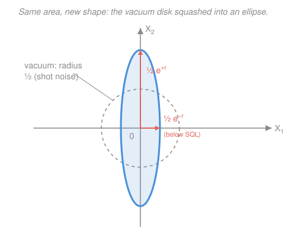

# Quantum Optics & Photonics · Lesson 3.5: Squeezed states

> ⏱ ~15 min · Module 3: Field quantization & photon states · Builds on: [3.4 Quadratures, phase space & shot noise](03-04-quadratures-phase-space-shot-noise.md) · Unlocks: [3.6 Single-photon sources & photodetection](03-06-single-photon-sources-photodetection.md)

## Why this matters

In [3.4](03-04-quadratures-phase-space-shot-noise.md) you met the vacuum's fuzz: even with the lights off, every optical measurement carries an irreducible shot-noise floor, and coherent (laser) light sits *exactly* at it — a round disk of noise in phase space. That floor is what limits how faintly you can see, how precisely you can time, how small a mirror wobble a gravitational-wave detector can register. The startling fact is that the floor is not a hard wall. You can push the noise of *one* quadrature **below** the vacuum level — as long as you pay for it in the other. That trick, **squeezing**, is how LIGO now hears black-hole mergers it otherwise couldn't. This lesson is the payoff of the whole quantization arc.

## The idea

The uncertainty principle for the two field quadratures $X_1, X_2$ (the cosine and sine amplitudes of the mode) reads $\Delta X_1\,\Delta X_2 \ge \tfrac14$. Read it carefully: it constrains the **product**, not each factor on its own. The vacuum spends its uncertainty *democratically* — $\Delta X_1 = \Delta X_2 = \tfrac12$, so the product is exactly $\tfrac14$ and the noise blob is a round disk of radius $\tfrac12$.

But democracy isn't required. Nothing stops you from taking a state that is *lopsided*: make $\Delta X_1$ smaller than $\tfrac12$ — quieter than the vacuum — and let $\Delta X_2$ grow by exactly the compensating amount so the product stays pinned at its minimum $\tfrac14$. The round disk gets **squeezed** into an ellipse: skinny along $X_1$, fat along $X_2$. You haven't beaten Heisenberg; you've *redistributed* his tax. One quadrature is now below the shot-noise floor, and if your measurement only listens to that quadrature, you win.

The catch — and the reason this was a decades-long experimental quest — is that no laser, no lamp, no classical light source can do this. A squeezed state is genuinely **nonclassical**: it has no description as a classical field with random noise. You have to *build* it, with a nonlinear crystal that creates photons two at a time (Module 4's parametric down-conversion).

## The formal version

Recall from [3.4](03-04-quadratures-phase-space-shot-noise.md) the quadratures built from the mode's annihilation/creation operators $\hat a, \hat a^\dagger$ (with $[\hat a, \hat a^\dagger]=1$):

$$\hat X_1 = \frac{\hat a + \hat a^\dagger}{2}, \qquad \hat X_2 = \frac{\hat a - \hat a^\dagger}{2i}, \qquad [\hat X_1, \hat X_2] = \frac{i}{2},$$

which forces $\Delta X_1\,\Delta X_2 \ge \tfrac14$. *In words: $X_1$ and $X_2$ are the two amplitudes you'd read off with a phase reference; like position and momentum, they can't both be sharp.* The vacuum $|0\rangle$ saturates this with equal shares, $\Delta X_1 = \Delta X_2 = \tfrac12$.

**The squeeze operator.** To make a lopsided minimum-uncertainty state, apply

$$\hat S(\xi) = \exp\!\Big[\tfrac12\big(\xi^* \hat a^2 - \xi\,\hat a^{\dagger 2}\big)\Big], \qquad \xi = r\,e^{i\theta}.$$

Here $r \ge 0$ is the **squeeze parameter** (how hard you squeeze) and $\theta$ (the **squeeze angle**) sets *which* quadrature gets quieted. *In words: the generator contains $\hat a^2$ and $\hat a^{\dagger 2}$ — it destroys and creates photons in **pairs**, which is the fingerprint of squeezing.* The **squeezed vacuum** is

$$|\xi\rangle = \hat S(\xi)\,|0\rangle.$$

The workhorse identity is how $\hat S$ transforms the ladder operators (a Bogoliubov transformation); for $\theta = 0$ (squeezing aligned with the axes),

$$\hat S^\dagger(\xi)\,\hat a\,\hat S(\xi) = \hat a\cosh r - \hat a^\dagger \sinh r.$$

*In words: squeezing mixes $\hat a$ with a bit of $\hat a^\dagger$.* Feed this through the quadrature definitions and the variances come out

$$\boxed{\;\Delta X_1^2 = \tfrac14\,e^{-2r}, \qquad \Delta X_2^2 = \tfrac14\,e^{+2r}\;}$$

so the product is $\Delta X_1^2\,\Delta X_2^2 = \tfrac{1}{16}$, i.e. $\Delta X_1\,\Delta X_2 = \tfrac14$ — still exactly the minimum. *In words: one quadrature's variance shrinks by $e^{-2r}$, the other's grows by $e^{+2r}$, and the two factors cancel.* At $r=0$ you recover the vacuum disk; as $r$ grows the ellipse gets more extreme.

**Decibels of squeezing.** Experimentalists quote the noise-power reduction of the quiet quadrature in dB:

$$\text{squeezing (dB)} = 10\log_{10}\!\big(e^{-2r}\big) = -\frac{20\,r}{\ln 10}.$$

A modest $r = 0.35$ gives $e^{-2r}\approx 0.5$, about $-3$ dB (half the shot-noise power). State-of-the-art sources reach $\approx -10$ to $-15$ dB, i.e. $r \approx 1.15$–$1.7$.

**Bright vs. vacuum squeezing.** $|\xi\rangle$ has $\langle \hat X_1\rangle = \langle \hat X_2\rangle = 0$ — its ellipse is centered on the origin (a "squeezed vacuum," dark on average but *not* empty). Displace it with the coherent displacement operator $\hat D(\alpha)$ from [3.3](03-03-coherent-states.md) and you get a **bright squeezed state** $\hat D(\alpha)\hat S(\xi)|0\rangle$: the same skinny ellipse, now parked out at amplitude $\alpha$ — squeezed light you can actually see on a detector.

## Picture

The disk and the ellipse enclose the **same area** — that's the minimum-uncertainty constraint made visual. Squeezing doesn't remove noise; it reshapes the disk into an ellipse, trading the short axis against the long one.

## Worked examples

**Example 1 (the numbers for 3 dB).** Take $r = 0.35$. Then

$$\Delta X_1^2 = \tfrac14 e^{-0.70} = \tfrac14(0.497) = 0.124, \qquad \Delta X_2^2 = \tfrac14 e^{+0.70} = \tfrac14(2.014) = 0.503.$$

Product: $0.124 \times 0.503 = 0.0625 = \tfrac{1}{16}$ ✓ — minimum uncertainty preserved. The quiet quadrature's noise power is $e^{-2r} = 0.497$ of vacuum, i.e. $10\log_{10}(0.497) \approx -3.0$ dB. So $r=0.35$ is "3 dB of squeezing": half the shot-noise *power*, or a factor $e^{-r} = 0.70$ in *amplitude* noise.

**Example 2 (why LIGO cares).** A gravitational wave stretches one arm of a kilometer-scale interferometer by a strain of order $10^{-21}$; the mirror displacement is read out as a phase shift $\phi$ of the returning light. The phase uncertainty is set by the quadrature noise entering the interferometer's normally-dark output port — and that port sees the **vacuum**, giving the standard quantum limit $\Delta\phi_{\text{SQL}} \propto \tfrac12/\sqrt{N}$ for $N$ detected photons. Inject **squeezed vacuum** into that dark port, oriented so its quiet quadrature aligns with the phase readout, and the noise drops to $\Delta\phi \propto \tfrac12 e^{-r}/\sqrt{N}$ — an improvement by the factor $e^{r}$, *without adding a single extra photon of laser power*. LIGO and Virgo have run frequency-dependent squeezed light since 2019, buying tens of percent more detection range — extra black-hole mergers per year, straight from Heisenberg bookkeeping. This is the concrete cash value of a nonclassical state.

## Watch out

- **You might think squeezing reduces total noise. It doesn't.** The uncertainty *product* is unchanged (still $\tfrac14$); you've only moved noise from one quadrature to the other. The win exists only because your measurement listens to a single quadrature — get the squeeze angle $\theta$ wrong and you inject *extra* noise into your signal instead.
- **You might think a squeezed vacuum is empty.** "Vacuum" refers to zero mean amplitude ($\langle \hat a\rangle = 0$), not zero photons. Squeezing pumps in photons — in pairs — so $\langle \hat n\rangle = \sinh^2 r > 0$. The state is dark on average but crawling with correlated photon pairs.
- **You might expect any Gaussian ellipse to be a legal state.** Only ellipses with area $\ge$ the vacuum disk are allowed. Shrinking *both* axes below $\tfrac12$ would beat the uncertainty product — forbidden. And an ellipse with the *minimum* area but a sub-vacuum axis is necessarily nonclassical: no classical field can do it.

## One-liner

> The uncertainty bound taxes the *product* of the two quadratures, not each one — so you can squeeze one below the shot-noise floor by paying interest on the other, and that's how you measure beneath the standard quantum limit.

## Problems

**P1 (🟢)** A squeezed vacuum has squeeze parameter $r = 0.6$ (with $\theta = 0$). Compute $\Delta X_1^2$ and $\Delta X_2^2$, verify their product equals $\tfrac{1}{16}$, and state how many dB of squeezing this represents.

**P2 (🟡)** You want $-10$ dB of noise reduction in the quiet quadrature. (a) What squeeze parameter $r$ is required? (b) By what factor does the phase sensitivity $\Delta\phi$ of a squeezed-light interferometer improve relative to the shot-noise (standard quantum) limit?

**P3 (🔴)** Show that the squeezed vacuum $|\xi\rangle = \hat S(\xi)|0\rangle$ is a superposition of **only even** photon-number states, and compute its mean photon number $\langle \hat n\rangle$. Then argue in one sentence why a state with $\Delta X_1 < \tfrac12$ cannot be classical. *(This is a Boss Problem 3 rehearsal.)*

Solutions

**P1** With $r = 0.6$, so $2r = 1.2$:

$$\Delta X_1^2 = \tfrac14 e^{-1.2} = \tfrac14(0.3012) = 0.0753, \qquad \Delta X_2^2 = \tfrac14 e^{+1.2} = \tfrac14(3.320) = 0.8300.$$

Product: $0.0753 \times 0.8300 = 0.0625 = \tfrac{1}{16}$ ✓ (as it must be — the $e^{-2r}$ and $e^{+2r}$ cancel). Squeezing in dB:

$$10\log_{10}(e^{-1.2}) = 10 \times \frac{-1.2}{\ln 10} = 10 \times \frac{-1.2}{2.3026} = -5.2\ \text{dB}.$$

So $r = 0.6$ is about **5 dB** of squeezing.

**P2** (a) $-10$ dB means the quiet-quadrature noise *power* is $e^{-2r} = 10^{-10/10} = 10^{-1} = 0.1$. Hence

$$-2r = \ln(0.1) = -2.303 \;\Longrightarrow\; r = 1.15.$$

(b) Phase sensitivity scales with the *amplitude* (standard deviation) of the quiet quadrature, $\Delta X_1 = \tfrac12 e^{-r}$, versus the vacuum's $\tfrac12$. The improvement factor is

$$\frac{\Delta\phi_{\text{SQL}}}{\Delta\phi_{\text{sq}}} = e^{r} = e^{1.15} = 3.16 = \sqrt{10}.$$

So 10 dB of noise-power squeezing improves phase sensitivity by $\sqrt{10}\approx 3.2\times$ (power-in-dB is $2\times$ the amplitude-in-dB, so a 10 dB power drop is only a factor $\sqrt{10}$ in the measured phase noise).

**P3** *Even photons.* Write $\hat S(\xi) = \exp[\tfrac12(\xi^*\hat a^2 - \xi\hat a^{\dagger 2})]$. Expanding the exponential in a power series, every term is a product of $\hat a^2$ and $\hat a^{\dagger 2}$ operators — each changes the photon number by $\pm 2$. Acting on $|0\rangle$ (which $\hat a^2$ annihilates), only the creation part $\hat a^{\dagger 2}$ survives to build population, and it can only produce $|0\rangle, |2\rangle, |4\rangle,\dots$ — never an odd number. Explicitly, for $\xi = r$ real,

$$|\xi\rangle = \frac{1}{\sqrt{\cosh r}}\sum_{n=0}^{\infty} \frac{\sqrt{(2n)!}}{2^n\,n!}\,(-\tanh r)^{n}\,|2n\rangle,$$

manifestly a superposition of even Fock states only — photons are born in pairs.

*Mean photon number.* Use $\langle \hat n\rangle = \langle 0|\hat S^\dagger \hat a^\dagger\hat a\,\hat S|0\rangle = \langle 0|(\hat S^\dagger\hat a^\dagger\hat S)(\hat S^\dagger\hat a\hat S)|0\rangle$. With $\hat S^\dagger\hat a\hat S = \hat a\cosh r - \hat a^\dagger\sinh r$ (and its conjugate $\hat S^\dagger\hat a^\dagger\hat S = \hat a^\dagger\cosh r - \hat a\sinh r$),

$$\hat S^\dagger\hat a^\dagger\hat a\,\hat S = (\hat a^\dagger\cosh r - \hat a\sinh r)(\hat a\cosh r - \hat a^\dagger\sinh r).$$

Take the vacuum expectation. Only the $\hat a\,\hat a^\dagger$ term contributes, since $\langle 0|\hat a^\dagger\cdots = 0$ and $\cdots\hat a|0\rangle = 0$ kill the rest:

$$\langle \hat n\rangle = \sinh^2 r\;\langle 0|\hat a\hat a^\dagger|0\rangle = \sinh^2 r.$$

(For $r = 1.15$ that's $\sinh^2(1.15) \approx 1.9$ photons — a "dark" state carrying nearly two photons on average.)

*Nonclassicality.* A classical field is a statistical mixture of coherent states, and every coherent state has isotropic noise $\Delta X_1 = \Delta X_2 = \tfrac12$; mixing (averaging over classical randomness) can only *add* variance, never subtract it, so no classical state can have $\Delta X_1 < \tfrac12$. A sub-vacuum quadrature therefore has no classical (positive Glauber–Sudarshan $P$) description — squeezed light is genuinely nonclassical.

## Flashback

**From Lesson 3.4 (Quadratures, phase space & shot noise):** Starting only from $[\hat a, \hat a^\dagger] = 1$ and the definitions $\hat X_1 = (\hat a + \hat a^\dagger)/2$, $\hat X_2 = (\hat a - \hat a^\dagger)/2i$, derive the commutator $[\hat X_1, \hat X_2]$ and the resulting uncertainty bound. Then state the variance of each quadrature for a coherent state $|\alpha\rangle$, and describe the shape of its phase-space noise. *(Fresh variant — you're deriving the bound this lesson rests on, not quoting it.)*

Solution

Expand the commutator, pulling out the constant $1/(2i\cdot 2) = 1/(4i)$:

$$[\hat X_1, \hat X_2] = \frac{1}{4i}\,[\hat a + \hat a^\dagger,\ \hat a - \hat a^\dagger].$$

Distribute: $[\hat a,\hat a] - [\hat a,\hat a^\dagger] + [\hat a^\dagger,\hat a] - [\hat a^\dagger,\hat a^\dagger] = 0 - 1 + (-1) - 0 = -2.$ Hence

$$[\hat X_1,\hat X_2] = \frac{-2}{4i} = \frac{-1}{2i} = \frac{i}{2}.$$

The Robertson uncertainty relation $\Delta A\,\Delta B \ge \tfrac12|\langle[\hat A,\hat B]\rangle|$ then gives

$$\Delta X_1\,\Delta X_2 \ge \tfrac12\left|\tfrac{i}{2}\right| = \tfrac14.$$

A coherent state $|\alpha\rangle$ (including the vacuum, $\alpha = 0$) is a minimum-uncertainty state that saturates this **equally**: $\Delta X_1 = \Delta X_2 = \tfrac12$, so $\Delta X_1\Delta X_2 = \tfrac14$. Its phase-space noise is an **isotropic disk** of radius $\tfrac12$ centered at the point $(\mathrm{Re}\,\alpha, \mathrm{Im}\,\alpha)$ — the round blob a squeezed state deforms into an ellipse.

## Connections

- **Backward:** this is the quadrature picture of [3.4](03-04-quadratures-phase-space-shot-noise.md) pushed to its limit — the isotropic coherent-state disk of [3.3](03-03-coherent-states.md) deformed by $\hat S(\xi)$ into an ellipse, with the shot-noise floor of 3.4 now something you can dip *below*.
- **Forward:** the pair-creation generator $\hat a^{\dagger 2}$ is realized physically by **parametric down-conversion** in [4.3](04-03-nonlinear-optics-parametric-down-conversion.md) — a nonlinear crystal that splits one pump photon into two, which is *how* squeezed light is actually made. Boss Problem 3 ties these together.
- **Sideways:** the tradeoff is the same minimum-uncertainty Gaussian story as position–momentum squeezing in the harmonic oscillator (see the quantum-mechanics course [syllabus](../../quantum-mechanics/syllabus.md)); and the sub-SQL metrology here is the quantum-limited cousin of the estimation bounds that show up in information theory — squeezing is a physical way to beat the $1/\sqrt{N}$ shot-noise scaling toward the Heisenberg limit.
