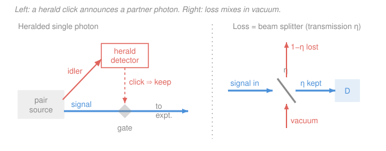

# Quantum Optics & Photonics · Lesson 3.6: Single-photon sources & photodetection

> ⏱ ~15 min · Module 3: Field quantization & photon states · Builds on: [3.5 Squeezed states](03-05-squeezed-states.md), [3.2 Fock states, the vacuum & zero-point energy](03-02-fock-states-vacuum-zero-point.md), [2.3 Photon statistics & $g^{(2)}$](02-03-photon-statistics-g2.md) · Unlocks: [4.1 The quantum beam splitter & Hong–Ou–Mandel](04-01-quantum-beam-splitter-hong-ou-mandel.md)

## Why this matters

We spent all of Module 3 building exotic states of light — the vacuum, Fock states, coherent states, squeezed states. But none of that is real until a **detector converts it into clicks you can count**. Every measurement in this whole course — the $g^{(2)}$ of Lesson [2.3](02-03-photon-statistics-g2.md), the Hanbury Brown–Twiss experiment, the squeezing you just learned to make, the Hong–Ou–Mandel dip coming in [4.1](04-01-quantum-beam-splitter-hong-ou-mandel.md) — is ultimately a photon count. This lesson closes the loop: it says exactly how the abstract field operators become clicks, why the vacuum's zero-point energy does *not* set off your detector, and the two brutal hardware facts that limit every experiment — detectors miss photons (efficiency $\eta < 1$), and making light that emits *exactly one* photon at a time is hard. Get these, and you can read any quantum-optics paper's methods section.

## The idea

A photodetector runs on the photoelectric effect: a photon is **absorbed**, its energy liberates an electron, and that one electron is amplified into a macroscopic current pulse — a **"click."** The key move is what absorption means quantum-mechanically. Removing one quantum from a field mode is precisely applying the annihilation operator $\hat a$ (Lesson [3.1](03-01-quantizing-em-field.md)). So the click rate isn't just "the energy in the field" — it's the field with $\hat a$ acting *first*, on the right. That ordering (creation operators on the left, annihilation on the right — **normal ordering**) has a beautiful consequence: since $\hat a|0\rangle = 0$, the **vacuum never clicks**. A detector counts photons, not the $\tfrac12\hbar\omega$ of zero-point energy sloshing in the mode.

Real detectors are worse than ideal in two ways you must budget for. First, **efficiency**: a photon arrives but with probability $1-\eta$ produces no click at all — it was lost, or absorbed silently. We model that loss as a **beam splitter** that transmits a fraction $\eta$ of the light and mixes vacuum in through the open port. That single picture explains why loss is so corrosive to quantum light: it dilutes your carefully prepared state with plain vacuum. Second, you need a **source that emits one photon at a time** — no laser does that (a laser is coherent, Poissonian). The operational proof that you have single photons is an old friend: $g^{(2)}(0) < 0.5$.

## The formal version

**Glauber photodetection — the click rate.** For a single mode with annihilation operator $\hat a$, an ideal detector's photon-count rate is proportional to the **normally-ordered intensity**:

$$R \;=\; \eta\,\langle \hat a^\dagger \hat a\rangle \;=\; \eta\,\langle \hat n\rangle,$$

where $\hat n = \hat a^\dagger\hat a$ is the number operator and $\eta$ (dimensionless, $0\le\eta\le1$) is the **quantum efficiency** — the probability an incident photon produces a click. For a general field the rate is $R(t) \propto \langle \hat E^{(-)}(t)\,\hat E^{(+)}(t)\rangle$, where $\hat E^{(+)}\!\sim\!\hat a$ (the annihilation, "positive-frequency" part) sits on the right and $\hat E^{(-)}\!\sim\!\hat a^\dagger$ on the left. *In words: a click is the act of the field annihilating one photon, so $\hat a$ hits the state first; because $\hat a|0\rangle=0$, the vacuum gives exactly zero rate.* Normal ordering is doing the physical bookkeeping of "subtract the zero-point energy" for you.

**Coincidences and $g^{(2)}$, now from operators.** Two detectors clicking a delay $\tau$ apart have a joint rate set by the normally-ordered *second-order* correlation. At $\tau=0$:

$$g^{(2)}(0) \;=\; \frac{\langle \hat a^\dagger \hat a^\dagger \hat a\,\hat a\rangle}{\langle \hat a^\dagger\hat a\rangle^2} \;=\; \frac{\langle \hat n(\hat n-1)\rangle}{\langle \hat n\rangle^2}.$$

*In words: the probability of detecting two photons at once, normalized by what you'd expect from the rate alone.* This is exactly the $g^{(2)}$ you defined empirically in [2.3](02-03-photon-statistics-g2.md) — now grounded in field operators. Read off the three canonical cases:

- **Fock state $|n\rangle$:** $\langle\hat n(\hat n-1)\rangle = n(n-1)$, so $g^{(2)}(0) = 1 - \tfrac1n$. In particular a single photon $|1\rangle$ gives $g^{(2)}(0)=0$ — **perfect antibunching**, since one photon cannot be split to fire two detectors.
- **Coherent state $|\alpha\rangle$** (the laser, [3.3](03-03-coherent-states.md)): $g^{(2)}(0)=1$.
- **Thermal light:** $g^{(2)}(0)=2$ — bunched.

**Detector hardware (one line each).** A **photomultiplier tube (PMT)** ejects a photoelectron from a photocathode and multiplies it down a dynode chain. A **single-photon avalanche diode (SPAD/APD in Geiger mode)** is reverse-biased past breakdown so one photon triggers a self-sustaining avalanche → a macroscopic pulse. A **superconducting nanowire single-photon detector (SNSPD)** is the modern high-end option: a biased nanowire that goes briefly normal when a photon lands, reaching $\eta \gtrsim 90\%$ with very low timing jitter.

**Figures of merit.** Beyond efficiency $\eta$: **dark counts** (clicks with no photon present, from thermal or tunneling events — an additive background rate $d$), **dead time** (recovery time after a click, capping the maximum count rate), and **timing jitter** (spread in the click's arrival-time stamp, which blurs $g^{(2)}(\tau)$ and coincidence windows).

**Loss as a beam splitter.** Model efficiency/loss by sending the signal mode $\hat a$ through a beam splitter of intensity transmission $\eta$, with a **vacuum mode** $\hat v$ entering the unused port:

$$\hat a_{\text{out}} \;=\; \sqrt{\eta}\,\hat a \;+\; \sqrt{1-\eta}\,\hat v, \qquad \langle \hat v^\dagger \hat v\rangle = 0.$$

The mean count scales simply, $\langle \hat n_{\text{out}}\rangle = \eta\,\langle \hat n\rangle$. The crucial and non-obvious fact: **$g^{(2)}(0)$ is invariant under pure loss.** All normally-ordered moments pick up the same power of $\eta$ — $\langle \hat n(\hat n-1)\rangle \to \eta^2\langle \hat n(\hat n-1)\rangle$ and $\langle\hat n\rangle^2 \to \eta^2\langle\hat n\rangle^2$ — so the ratio is unchanged. *In words: antibunching survives loss — you just collect fewer photons, but a single photon stays a single photon.*

Squeezing is **not** so lucky. A quadrature variance passes through the same beam splitter as a weighted average with the vacuum it mixes in:

$$V_{\text{out}} \;=\; \eta\,V_{\text{sig}} \;+\; (1-\eta)\,V_{\text{vac}}.$$

*In words: a variance squeezed below the vacuum level $V_{\text{vac}}$ gets pulled back up toward it, because a fraction $1-\eta$ of what the detector sees is just vacuum noise.* This is why detector and coupling efficiency is the make-or-break number for squeezing and for gravitational-wave detectors ([3.5](03-05-squeezed-states.md)): loss can't be squeezed away.

**What a single-photon source needs, and heralding.** A true single-emitter — a single atom or ion, an NV center in diamond, or a semiconductor quantum dot — can hold only one excitation, so it re-emits one photon at a time and shows $g^{(2)}(0)\to 0$. The operational witness is $g^{(2)}(0) < 0.5$: below that you have ruled out two independent emitters and proven sub-single-photon character. The other route is **heralding**: use a source of photon *pairs* (spontaneous parametric down-conversion, previewed in [4.3](04-03-nonlinear-optics-parametric-down-conversion.md)) that emits a **signal** and an **idler** together. Detecting the idler *announces* — heralds — that its partner signal photon exists right now. You get a single photon on demand-ish: not on a clock, but flagged the instant it appears.

## Picture

## Worked examples

**Example 1 (mechanical — clicks and dark counts).** A faint coherent beam delivers a mean flux of $\Phi = 2.0\times10^{6}$ photons per second onto a SPAD with efficiency $\eta = 0.75$ and a dark-count rate $d = 500\ \mathrm{s^{-1}}$. The photon-driven click rate is

$$R_{\text{light}} = \eta\,\Phi = 0.75 \times 2.0\times10^{6} = 1.5\times10^{6}\ \mathrm{s^{-1}}.$$

Dark counts are physically independent events, so they **add** to the total rate:

$$R_{\text{total}} = \eta\,\Phi + d = 1.5\times10^{6} + 500 = 1{,}500{,}500\ \mathrm{s^{-1}}.$$

The dark-count fraction of your data is $d/R_{\text{total}} \approx 500/1.5\times10^{6} \approx 3.3\times10^{-4}$ — negligible here, but at very low flux (single-photon experiments) that same fixed 500/s can dominate, which is why detector cooling to suppress dark counts matters.

**Example 2 (why you'd care — loss spares antibunching but kills squeezing).** Send an ideal single photon $|1\rangle$ into a detector chain of overall efficiency $\eta = 0.4$. You detect it with probability $\eta = 0.4$ (60% of the time it's simply lost) — your count *rate* drops to 40%. But the detected $g^{(2)}(0)$? Since $\langle\hat n(\hat n-1)\rangle = 0$ for $|1\rangle$ and $g^{(2)}$ is loss-invariant, it stays **exactly 0**: every photon you *do* catch is still a lone photon that can't fire two detectors. Now contrast a state squeezed 3 dB below shot noise, i.e. $V_{\text{sig}} = 10^{-0.3}\,V_{\text{vac}} = 0.50\,V_{\text{vac}}$, measured at the same $\eta=0.4$:

$$V_{\text{out}} = 0.4\,(0.50\,V_{\text{vac}}) + 0.6\,V_{\text{vac}} = 0.80\,V_{\text{vac}}.$$

That's only $-10\log_{10}(0.80) \approx 0.97$ dB of squeezing surviving — a 3 dB resource gutted to under 1 dB by realistic loss. Same $\eta$, opposite verdict: **antibunching is robust, squeezing is fragile.**

## Watch out

- **You might think the vacuum's $\tfrac12\hbar\omega$ energy should trip the detector.** It can't: absorption applies $\hat a$, and $\hat a|0\rangle = 0$. The zero-point energy is real (it does other things — Casimir, [3.2](03-02-fock-states-vacuum-zero-point.md)) but it carries no *photons to absorb*. Normal ordering is exactly this statement.
- **You might think low efficiency raises your measured $g^{(2)}(0)$ (makes antibunching look worse).** It doesn't — pure loss leaves $g^{(2)}(0)$ unchanged; it only lowers your count rate. What *degrades* a measured $g^{(2)}(0)$ away from 0 is a genuine physical two-photon admixture (background light, multi-pair emission), not detector inefficiency. Squeezing is the opposite case: there, efficiency is everything.
- **You might expect a laser attenuated to "one photon on average" to be a single-photon source.** No — an attenuated laser is still a (dim) coherent state with $g^{(2)}(0)=1$; each pulse's photon number is Poisson, so it regularly delivers 0 or 2. You need a real single emitter or a herald to get $g^{(2)}(0)<0.5$.

## One-liner

> A click is the field annihilating a photon, so the rate is the normally-ordered $\eta\langle\hat a^\dagger\hat a\rangle$ (vacuum can't click); model loss as a beam splitter mixing in vacuum — it spares antibunching but drags squeezing back toward shot noise.

## Problems

**P1 (🟢)** A single-photon detector has quantum efficiency $\eta = 0.60$ and a dark-count rate $d = 200\ \mathrm{s^{-1}}$. A weak coherent source illuminates it with a mean flux of $\Phi = 5.0\times10^{5}$ photons per second. (a) What is the expected click rate from the light alone? (b) What is the total measured click rate once dark counts are included? (c) What fraction of the clicks are dark counts?

**P2 (🟡)** An ideal single-photon source emits $|1\rangle$ into a channel-plus-detector of overall efficiency $\eta = 0.5$. (a) With what probability is each photon detected? (b) What is the *detected* $g^{(2)}(0)$, and why? (c) A squeezed state carrying 6 dB of squeezing (variance $10^{-0.6}\,V_{\text{vac}}$) is sent through the same $\eta=0.5$. Find the detected variance in units of $V_{\text{vac}}$ and the surviving squeezing in dB. Contrast the fate of the two nonclassical signatures.

**P3 (🔴)** A down-conversion source fires at $f = 1.0\times10^{6}$ pulses per second and produces a signal–idler pair with probability $p = 0.05$ per pulse. The idler ("herald") detector has efficiency $\eta_i = 0.30$; the signal channel plus its detector has overall efficiency $\eta_s = 0.40$. (a) Estimate the herald rate (heralds per second). (b) Estimate the rate of heralded signal detections (coincidences per second). (c) What is the heralding efficiency (detected signals per herald)? (d) If you double the pump to raise $p$, what goes wrong with the *quality* of the heralded single photon, and roughly at what $p$?

Solutions

**P1** (a) The light-driven rate is the efficiency times the incident flux:

$$R_{\text{light}} = \eta\,\Phi = 0.60 \times 5.0\times10^{5} = 3.0\times10^{5}\ \mathrm{s^{-1}}.$$

(b) Dark counts are independent events and add linearly:

$$R_{\text{total}} = \eta\,\Phi + d = 3.0\times10^{5} + 200 = 300{,}200\ \mathrm{s^{-1}}.$$

(c) Dark-count fraction:

$$\frac{d}{R_{\text{total}}} = \frac{200}{300{,}200} \approx 6.7\times10^{-4}.$$

*Check.* Units: $\eta$ is dimensionless, $\Phi$ and $d$ are both $\mathrm{s^{-1}}$, so rates add cleanly. The fraction is tiny because the source is bright; drop $\Phi$ by a factor $10^3$ and the same 200/s dark rate would be a large fraction — the reason dark counts are the enemy at true single-photon flux. ✓

**P2** (a) An ideal single photon is detected with probability equal to the efficiency: $P_{\text{detect}} = \eta = 0.5$. Half the photons are simply lost.

(b) For $|1\rangle$, $\langle\hat n(\hat n-1)\rangle = 1\cdot 0 = 0$, so $g^{(2)}(0) = 0$ before loss. Pure loss is a beam splitter mixing in vacuum, under which $g^{(2)}(0)$ is invariant (numerator and denominator both scale as $\eta^2$). So the **detected $g^{(2)}(0)$ is still 0** — antibunching survives. Intuitively: losing photons can't manufacture a two-photon coincidence out of a state that never had two photons.

(c) Squeezing: $V_{\text{sig}} = 10^{-0.6}\,V_{\text{vac}} = 0.251\,V_{\text{vac}}$. Through $\eta = 0.5$,

$$V_{\text{out}} = \eta\,V_{\text{sig}} + (1-\eta)\,V_{\text{vac}} = 0.5(0.251) + 0.5(1)\,V_{\text{vac}} = 0.626\,V_{\text{vac}}.$$

Surviving squeezing: $-10\log_{10}(0.626) \approx 2.0$ dB. So 6 dB in, ~2 dB out.

*Contrast.* Same $\eta = 0.5$: the single photon's antibunching is **untouched** (still $g^{(2)}=0$, only the rate halves), while the squeezing collapses from 6 dB to ~2 dB. Loss adds vacuum, which has no photon pairs to spoil antibunching but plenty of noise to spoil squeezing. ✓

**P3** (a) A herald requires a pair *and* the idler detector firing:

$$R_{\text{herald}} = f\,p\,\eta_i = 10^{6}\times 0.05\times 0.30 = 1.5\times10^{4}\ \mathrm{heralds/s}.$$

(b) A heralded detection needs the pair, the idler click, *and* the signal to survive its channel and fire:

$$R_{\text{coinc}} = f\,p\,\eta_i\,\eta_s = 10^{6}\times 0.05\times 0.30\times 0.40 = 6.0\times10^{3}\ \mathrm{s^{-1}}.$$

(c) Heralding efficiency = detected signals per herald:

$$\frac{R_{\text{coinc}}}{R_{\text{herald}}} = \frac{f\,p\,\eta_i\,\eta_s}{f\,p\,\eta_i} = \eta_s = 0.40.$$

(This is the Klyshko efficiency — the herald rate cancels $p$ and $\eta_i$, leaving just the signal-arm efficiency.)

(d) Raising $p$ raises the herald and coincidence rates linearly, but the probability of **two pairs in one pulse** grows like $p^2$. A double-pair passes the herald test yet delivers *two* signal photons, contaminating your "single" photon — the heralded $g^{(2)}(0)$ climbs above 0 (roughly $\sim 2p$ for a thermal-mode source). So there's a rate-versus-purity trade-off: to keep the heralded state genuinely single-photon you hold $p$ small, typically $p \lesssim 0.05$–$0.1$; here $p=0.05$ already implies a few-percent multi-pair contamination, and doubling the pump doubles it.

*Check.* Every rate is $f$ times a product of probabilities (each $\le 1$), so all rates are $\le f$ ✓. Heralding efficiency depends only on the *signal* arm — improving the herald detector $\eta_i$ raises how many heralds you get but not the fraction that pay off, which matches intuition. ✓

## Flashback

**From Lesson 3.5 (Squeezed states):** A squeezed-vacuum state is measured to sit **6 dB below** the shot-noise (vacuum) level in its squeezed quadrature. (a) What is the squeezed-quadrature variance $V_-$ in units of the vacuum variance $V_{\text{vac}}$? (b) For a minimum-uncertainty squeezed state, what is the anti-squeezed variance $V_+$, in dB relative to vacuum? (Fresh variant — different dB value, and it asks for the partner quadrature.)

Solution

(a) Squeezing in dB is $-10\log_{10}(V_-/V_{\text{vac}})$, so $6\ \mathrm{dB} \Rightarrow V_-/V_{\text{vac}} = 10^{-0.6} = 0.251$. Equivalently $V_- = e^{-2r}V_{\text{vac}}$, giving $2r = \ln(1/0.251) = 1.38$, i.e. squeeze parameter $r \approx 0.69$.

(b) A minimum-uncertainty state saturates $V_- V_+ = V_{\text{vac}}^2$, so the anti-squeezed quadrature is stretched by the reciprocal factor:

$$V_+ = \frac{V_{\text{vac}}^2}{V_-} = e^{+2r}V_{\text{vac}} = \frac{1}{0.251}V_{\text{vac}} = 3.98\,V_{\text{vac}},$$

which is $+10\log_{10}(3.98) \approx +6$ dB. *In words: squeeze one quadrature 6 dB below vacuum and its partner is pushed exactly 6 dB above — the uncertainty product is conserved, you only redistribute the noise.* This is why loss (which admixes vacuum, previous section) is so damaging: it refills the squeezed quadrature back toward $V_{\text{vac}}$ without a matching benefit. ✓

## Connections

- **Backward:** the click rate is built from the ladder operators of [3.1](03-01-quantizing-em-field.md); normal ordering is why the vacuum energy of [3.2](03-02-fock-states-vacuum-zero-point.md) stays silent; the $g^{(2)}$ here is the operator-level version of the empirical one from [2.3](02-03-photon-statistics-g2.md) and the quantity the Hanbury Brown–Twiss setup of [2.4](02-04-hanbury-brown-twiss.md) actually measures; the loss-vs-squeezing story completes [3.5](03-05-squeezed-states.md). Together this ties the module's bow: $|1\rangle$ ([3.2](03-02-fock-states-vacuum-zero-point.md)) is the ideal, the coherent state ([3.3](03-03-coherent-states.md)) is the laser, the squeezed state ([3.5](03-05-squeezed-states.md)) beats shot noise, and detectors turn any of them into clicks with efficiency $\eta$.
- **Forward:** [4.1 The quantum beam splitter & Hong–Ou–Mandel](04-01-quantum-beam-splitter-hong-ou-mandel.md) uses this exact beam-splitter transformation — but with *photons*, not vacuum, entering both ports; the coincidence rate you compute there is the two-detector $\langle\hat a^\dagger\hat a^\dagger\hat a\hat a\rangle$ of this lesson. Heralded single photons from [4.3](04-03-nonlinear-optics-parametric-down-conversion.md) are the input to essentially every photonic quantum-information demo in Module 4.
- **Sideways:** the operator $\hat a$ "counting" a photon by lowering the state is the same annihilation operator that lowers the harmonic-oscillator energy ladder in [quantum-mechanics](../../quantum-mechanics/syllabus.md) — a photodetector is, at bottom, a device that reads out one rung of that ladder and amplifies the drop into a current you can see.
