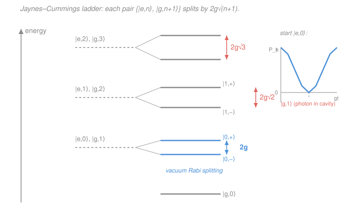

# Quantum Optics & Photonics · Lesson 4.2: Cavity QED & the Jaynes–Cummings model

> ⏱ ~15 min · Module 4: Cavity QED, entanglement & applications · Builds on: [4.1 The quantum beam splitter & Hong–Ou–Mandel](04-01-quantum-beam-splitter-hong-ou-mandel.md), [1.2 The two-level atom & Rabi oscillations](01-02-two-level-atom-rabi-oscillations.md), [3.1 Quantizing the EM field](03-01-quantizing-em-field.md) · Unlocks: [4.3 Nonlinear optics & parametric down-conversion](04-03-nonlinear-optics-parametric-down-conversion.md)

## Why this matters

Two threads of this course have run in parallel. In [1.2](01-02-two-level-atom-rabi-oscillations.md) an atom flopped under a *classical* field you dialed in by hand. In [3.1](03-01-quantizing-em-field.md) the field itself became quantum — a harmonic-oscillator ladder with photons for rungs. This lesson ties them together: **one two-level atom coupled to one quantized cavity mode**, the **Jaynes–Cummings (JC) model**. The payoff is a genuinely new prediction: because the field is now quantum, even the *empty* cavity — the vacuum — can grab the atom and make it flop. That reversible, one-quantum-at-a-time exchange between a single atom and a single mode is **cavity quantum electrodynamics (cavity QED)**, the physics behind atom–photon quantum gates, photon blockade, and the strong-coupling experiments that won the 2012 Nobel Prize.

## The idea

Put a single atom inside a tiny high-quality mirror box tuned to its transition. The atom can be excited or not; the cavity can hold $0,1,2,\dots$ photons. They talk through one simple move: the atom drops from $|e\rangle$ to $|g\rangle$ and *emits* a photon into the mode, or the atom climbs from $|g\rangle$ to $|e\rangle$ by *absorbing* one. Energy just sloshes between "atom is up" and "there's an extra photon in the box."

Here's the twist that classical optics can't give you. Start with the atom excited and the cavity **empty**. Classically an empty cavity is nothing — zero field, nothing to drive the atom, so it should just sit there (or decay to free space). Quantum-mechanically the atom emits its photon into the mode, but that photon has nowhere to go — the mirrors trap it — so the atom promptly *reabsorbs* it, re-emits it, reabsorbs it... The excitation bounces between atom and cavity forever (until something leaks). This is a **vacuum Rabi oscillation**: Rabi flopping ([1.2](01-02-two-level-atom-rabi-oscillations.md)) driven by *no photons at all*.

The rate of that flop is a single number, the **coupling** $g$ — the single-photon Rabi frequency, set by the atom's dipole times the electric field of *one* photon. When $g$ is faster than every leakage rate (photon escaping, atom decaying sideways into free space), the exchange is reversible and coherent — the hallmark of **strong coupling**. That's the opposite regime from the *irreversible* free-space decay of 1.3: there the photon flies away and never comes back; here the mirror hands it straight back.

## The formal version

**The Hamiltonian.** Let $\hat a,\hat a^\dagger$ be the mode's annihilation/creation operators (frequency $\omega$, from [3.1](03-01-quantizing-em-field.md)), and describe the atom (transition frequency $\omega_0$) with Pauli-like operators: $\hat\sigma_z = |e\rangle\langle e| - |g\rangle\langle g|$ (the atomic inversion), $\hat\sigma_+ = |e\rangle\langle g|$ (raise the atom), $\hat\sigma_- = |g\rangle\langle e|$ (lower it). The **Jaynes–Cummings Hamiltonian**, in the rotating-wave approximation, is

$$\boxed{\;\hat H = \hbar\omega\,\hat a^\dagger\hat a \;+\; \tfrac12\hbar\omega_0\,\hat\sigma_z \;+\; \hbar g\big(\hat a\,\hat\sigma_+ + \hat a^\dagger\,\hat\sigma_-\big)\;}$$

*In words: energy in the field, plus energy in the atom, plus a coupling that trades one photon for one atomic excitation.* Read the interaction term by term: $\hat a\,\hat\sigma_+$ **absorbs a photon and excites the atom**; its conjugate $\hat a^\dagger\,\hat\sigma_-$ **emits a photon and de-excites the atom**. The coupling constant

$$g = \frac{d\,\mathcal E_0}{\hbar}, \qquad \mathcal E_0 = \sqrt{\frac{\hbar\omega}{2\varepsilon_0 V}},$$

is the dipole matrix element $d = \langle e|\hat d|g\rangle$ times $\mathcal E_0$, the electric field *per photon* in a mode of volume $V$ (with $\varepsilon_0$ the vacuum permittivity). This is exactly the classical Rabi frequency $\Omega = dE_0/\hbar$ of [1.2](01-02-two-level-atom-rabi-oscillations.md), but with the classical amplitude $E_0$ replaced by the **single-photon field** $\mathcal E_0$ — that's why $g$ is called the *single-photon Rabi frequency*. The RWA drops the fast counter-rotating terms $\hat a\hat\sigma_-$ and $\hat a^\dagger\hat\sigma_+$ (which would create or destroy *two* excitations at once), just as in 1.2.

**Conserved excitation number.** Define $\hat N_{\text{exc}} = \hat a^\dagger\hat a + |e\rangle\langle e|$, the total number of quanta (photons plus atomic excitation). Every term in $\hat H$ conserves it: $\hat a\hat\sigma_+$ removes a photon but adds an atomic excitation, net zero. So $[\hat H,\hat N_{\text{exc}}]=0$, and $\hat H$ **block-diagonalizes**: it only ever mixes the two states with the same total excitation,

$$\{\,|e,n\rangle,\ |g,n+1\rangle\,\}\qquad (n = 0,1,2,\dots),$$

("atom up with $n$ photons" vs. "atom down with $n{+}1$ photons"). *In words: the giant Hilbert space falls apart into independent $2\times2$ blocks, one per rung of excitation — and a $2\times2$ we can diagonalize by hand.*

**Diagonalizing one block.** In the basis $\{|e,n\rangle, |g,n+1\rangle\}$, using $\hat a^\dagger\hat a|n\rangle = n|n\rangle$ and $\hat a^\dagger\hat a|n{+}1\rangle=(n{+}1)|n\rangle$, and $\langle e,n|\hat H|g,n{+}1\rangle = \hbar g\sqrt{n+1}$ (the $\sqrt{n+1}$ is the ladder factor from [3.1](03-01-quantizing-em-field.md)), the block is

$$\hat H_n = \hbar\omega\!\left(n+\tfrac12\right)\mathbb{1} \;+\; \frac{\hbar}{2}\begin{pmatrix} \Delta & 2g\sqrt{n+1} \\[2pt] 2g\sqrt{n+1} & -\Delta \end{pmatrix},\qquad \Delta \equiv \omega_0 - \omega,$$

where $\Delta$ is the **atom–cavity detuning**. Diagonalizing the $2\times2$ traceless part gives eigenvalues $\pm\frac{\hbar}{2}\sqrt{\Delta^2 + 4g^2(n+1)}$, so the **dressed states** $|n,\pm\rangle$ have energies

$$\boxed{\;E_{n,\pm} = \hbar\omega\!\left(n+\tfrac12\right) \;\pm\; \frac{\hbar}{2}\sqrt{\Delta^2 + 4g^2(n+1)}\;}$$

*In words: the atom and photon "repel" each other in energy — the more they overlap, the more the pair splits apart.* The splitting within the doublet is

$$E_{n,+} - E_{n,-} = \hbar\sqrt{\Delta^2 + 4g^2(n+1)}.$$

**On resonance ($\Delta = 0$).** The splitting collapses to $2\hbar g\sqrt{n+1}$ and the dressed states become the maximally-mixed superpositions

$$|n,\pm\rangle = \tfrac{1}{\sqrt2}\big(|e,n\rangle \pm |g,n+1\rangle\big).$$

For the lowest rung $n=0$ this is the **vacuum Rabi splitting** $2\hbar g$: the *empty* cavity (zero photons) already splits the joint atom–cavity levels apart by $2\hbar g$, because $\sqrt{n+1}=\sqrt{1}=1$ even when $n=0$. *In words: the atom and an empty mode share a quantum, and that shared quantum splits their levels — a purely quantum effect the classical field ($E_0=0$) cannot produce.*

**Collapse and revival.** Drive the mode instead with a **coherent state** $|\alpha\rangle$ ([3.3 coherent states](03-03-coherent-states.md)) — a spread of photon numbers with mean $\bar n=|\alpha|^2$. Each Fock component $n$ flops at *its own* frequency $2g\sqrt{n+1}$, and because $\sqrt{n+1}$ is unevenly spaced the many oscillations dephase: the net atomic flop **collapses** to a flat line after a time $\sim 1/g$. But those frequencies are discrete, so they eventually re-align and the oscillation **revives** near $t_{\text{rev}}\sim 2\pi\sqrt{\bar n}/g$, then collapses again. *In words: a classical drive would ring at one clean frequency forever; the granular quantum field rings at a comb of $\sqrt{n+1}$ frequencies that beat in and out.* These collapse-and-revival sequences have no classical-field analogue and are a direct signature that the field is made of countable photons.

## Picture

Grey dashed lines are the bare (uncoupled) degenerate pairs; each fans out into a dressed doublet whose gap grows as $\sqrt{n+1}$. The blue $n=0$ rung is the vacuum Rabi splitting $2g$. Inset: starting in $|e,0\rangle$, the excited-state probability rings as $\cos^2(gt)$ — the atom and empty cavity trade one quantum.

## Worked examples

**Example 1 (mechanical — read the ladder).** A cavity is on resonance ($\Delta=0$) with coupling $g$. What is the level splitting on the $n=2$ rung, and how does it compare to the vacuum rung?

On rung $n$ the splitting is $2\hbar g\sqrt{n+1}$. For $n=2$: $2\hbar g\sqrt{3} \approx 3.46\,\hbar g$. The vacuum rung ($n=0$) splits by $2\hbar g$. So the ratio is $\sqrt{3}\approx 1.73$ — the doublets fan *wider* as you climb, because a brighter field ($n+1$ shared quanta) drives the exchange harder. That growing-with-$\sqrt{n+1}$ ladder is the fingerprint that lets experiments count photons by spectroscopy.

**Example 2 (why you'd care — vacuum Rabi flop).** Prepare the atom excited in an empty resonant cavity: $|\psi(0)\rangle = |e,0\rangle$. This lives entirely in the $n=0$ block, spanned by $|e,0\rangle$ and $|g,1\rangle$, with dressed states $|0,\pm\rangle=\tfrac1{\sqrt2}(|e,0\rangle\pm|g,1\rangle)$ at energies $\bar E \pm \hbar g$ (with $\bar E = \tfrac12\hbar\omega$). Expanding $|e,0\rangle = \tfrac1{\sqrt2}(|0,+\rangle+|0,-\rangle)$ and evolving,

$$|\psi(t)\rangle = \tfrac{1}{\sqrt2}e^{-i\bar E t/\hbar}\big(e^{-igt}|0,+\rangle + e^{+igt}|0,-\rangle\big),$$

so the amplitude to still be excited is $\langle e,0|\psi(t)\rangle = e^{-i\bar E t/\hbar}\cos(gt)$, giving

$$P_e(t) = \cos^2(gt), \qquad P_{g,1}(t) = \sin^2(gt).$$

The atom fully hands its energy to the empty cavity at $gt=\pi/2$ (photon now in the box), takes it back at $gt=\pi$, and repeats. **No photons were supplied** — the vacuum did the driving. Contrast [1.2](01-02-two-level-atom-rabi-oscillations.md): there, killing the field ($E_0\to0$, so $\Omega\to0$) freezes the atom; here the same limit of *zero photons* still flops it at rate $2g$.

## Watch out

- **You might think an empty cavity does nothing to the atom.** The classical intuition (no field ⇒ no drive) fails because the coupling scales as $\sqrt{n+1}$, and the "$+1$" survives at $n=0$. That vacuum term is the same one responsible for *spontaneous* emission in 1.3 — but a good cavity makes it **reversible** instead of a one-way loss.
- **You might expect $P_e$ to oscillate at frequency $g$.** It oscillates at $2g$: $\cos^2(gt) = \tfrac12(1+\cos 2gt)$ has period $\pi/g$. The population beats at the *full* vacuum Rabi splitting $2g$, while the individual amplitude carries $gt$ — exactly the "population at $\Omega$, amplitude at $\Omega/2$" bookkeeping from classical Rabi, with $\Omega\to 2g$.
- **You might read "strong coupling" as just "large $g$."** It means $g \gg \kappa,\gamma$: the coupling beats the cavity photon-leak rate $\kappa$ and the atom's free-space decay $\gamma$, so the exchange completes many cycles before anything escapes. If $g\ll\kappa,\gamma$ you are back in the irreversible (weak-coupling / Purcell) regime — no oscillations, just modified decay.

## One-liner

> One atom plus one quantized mode is the Jaynes–Cummings model: excitation number blocks it into $2\times2$ dressed doublets split by $\hbar\sqrt{\Delta^2+4g^2(n+1)}$, and even the empty cavity ($n=0$) splits by $2\hbar g$ and flops the atom as $P_e=\cos^2(gt)$.

## Problems

**P1 (🟢)** A single atom is on resonance with a cavity whose coupling is $g = 2\pi\times 5\ \mathrm{MHz}$. (a) What is the vacuum Rabi splitting, in frequency units (Hz)? (b) Starting from $|e,0\rangle$, what is the period of the vacuum Rabi oscillation $P_e(t)=\cos^2(gt)$? (c) At what earliest time is the photon *fully* in the cavity?

**P2 (🟡)** For general detuning $\Delta=\omega_0-\omega$, diagonalize the block $\dfrac{\hbar}{2}\begin{pmatrix}\Delta & 2g\sqrt{n+1}\\ 2g\sqrt{n+1} & -\Delta\end{pmatrix}$: find the dressed-state energies (relative to the mean $\hbar\omega(n+\tfrac12)$), the splitting, and the mixing angle $\theta_n$ that writes $|n,+\rangle=\cos\theta_n|e,n\rangle+\sin\theta_n|g,n+1\rangle$. Check the resonant limit.

**P3 (🔴)** Start in $|e,0\rangle$ on resonance and derive $P_e(t)=\cos^2(gt)$ from scratch (diagonalize the $n=0$ block, evolve, project). Then contrast, in two sentences, with the classical-drive Rabi flopping $P_e=\sin^2(\Omega t/2)$ of [1.2](01-02-two-level-atom-rabi-oscillations.md): what plays the role of $\Omega$, and why is the vacuum result *cosine* rather than *sine*? *(This is the rehearsal for Boss Problem 4(b).)*

Solutions

**P1** (a) The vacuum ($n=0$) splitting is $2\hbar g$; in frequency units divide by $h=2\pi\hbar$, giving $2g/(2\pi) = 2\times 5\ \mathrm{MHz} = 10\ \mathrm{MHz}$. (b) $P_e=\cos^2(gt)=\tfrac12(1+\cos 2gt)$ returns to $1$ after one full cycle at $gt=\pi$, so the period is
$$T = \frac{\pi}{g} = \frac{\pi}{2\pi\times 5\times 10^{6}\ \mathrm{s^{-1}}} = \frac{1}{10^{7}\ \mathrm{s^{-1}}} = 100\ \mathrm{ns}.$$
(c) The photon is fully in the cavity when $P_e=\cos^2(gt)=0$, first at $gt=\pi/2$:
$$t = \frac{\pi}{2g} = 50\ \mathrm{ns} = \tfrac12 T.$$
*Check.* Halfway through a period the excitation has completely migrated to the field ($P_{g,1}=\sin^2(\pi/2)=1$); it returns to the atom at $T=100$ ns. ✓

**P2** Write the traceless matrix as $\tfrac{\hbar}{2}(\Delta\,\sigma_z + 2g\sqrt{n+1}\,\sigma_x)$. Its eigenvalues are $\pm\tfrac{\hbar}{2}\sqrt{\Delta^2 + (2g\sqrt{n+1})^2}$, so relative to the mean energy the dressed states sit at
$$\varepsilon_{n,\pm} = \pm\frac{\hbar}{2}\sqrt{\Delta^2 + 4g^2(n+1)},\qquad \text{splitting } E_{n,+}-E_{n,-} = \hbar\sqrt{\Delta^2 + 4g^2(n+1)}.$$
For a matrix $\tfrac{\hbar}{2}(\Delta\,\sigma_z + \Omega_n\,\sigma_x)$ with $\Omega_n\equiv 2g\sqrt{n+1}$, the upper eigenvector makes mixing angle
$$\tan(2\theta_n) = \frac{\Omega_n}{\Delta} = \frac{2g\sqrt{n+1}}{\Delta},\qquad 0\le 2\theta_n<\pi.$$
*Check (resonance).* As $\Delta\to0$, $\tan(2\theta_n)\to\infty$ so $2\theta_n\to\pi/2$, $\theta_n\to\pi/4$: $|n,+\rangle\to\tfrac1{\sqrt2}(|e,n\rangle+|g,n+1\rangle)$ and the splitting $\to 2\hbar g\sqrt{n+1}$, matching the boxed resonant result. In the far-detuned limit $|\Delta|\gg g\sqrt{n+1}$, $\theta_n\to0$ (states barely mix) and the splitting $\to\hbar|\Delta|$ (just the bare gap) — as it must. ✓

**P3** The $n=0$ block spans $|e,0\rangle,|g,1\rangle$ with (on resonance, dropping the common $\hbar\omega/2$)
$$H_0 = \hbar g\begin{pmatrix}0&1\\1&0\end{pmatrix},$$
eigenstates $|0,\pm\rangle=\tfrac1{\sqrt2}(|e,0\rangle\pm|g,1\rangle)$ with eigenvalues $\pm\hbar g$. Decompose the initial state $|e,0\rangle=\tfrac1{\sqrt2}(|0,+\rangle+|0,-\rangle)$ and evolve each dressed state by its phase $e^{\mp i g t}$:
$$|\psi(t)\rangle = \tfrac1{\sqrt2}\big(e^{-igt}|0,+\rangle + e^{+igt}|0,-\rangle\big).$$
Project back onto $|e,0\rangle=\tfrac1{\sqrt2}(|0,+\rangle+|0,-\rangle)$:
$$\langle e,0|\psi(t)\rangle = \tfrac12\big(e^{-igt}+e^{+igt}\big) = \cos(gt)\ \Longrightarrow\ P_e(t)=\cos^2(gt).$$
*Contrast with 1.2.* The single-photon Rabi frequency $2g$ plays the role of the classical resonant Rabi frequency $\Omega=dE_0/\hbar$ — indeed both come from dipole $\times$ field, but here the field is one photon's worth, $\mathcal E_0$, not a classical amplitude $E_0$. The result is a *cosine* (not the *sine* of 1.2) purely because we started in the **excited** state $|e,0\rangle$ rather than the ground state: $\cos^2(gt)$ begins at $1$ and falls, while $\sin^2(\Omega t/2)$ begins at $0$ and rises — same oscillation, complementary initial condition. The deep point: set the driving field to zero and 1.2's flop dies ($\Omega\to0$), but the JC flop persists at $2g$ because the *vacuum* is doing the driving. ✓

## Flashback

**From Lesson 1.2 (The two-level atom & Rabi oscillations):** An atom is driven by a *classical* resonant field with Rabi frequency $\Omega = 2\pi\times 2\ \mathrm{MHz}$, starting in $|g\rangle$. (a) Write $P_e(t)$ and find the $\pi$-pulse duration. (b) Evaluate $P_e$ at $t = 0.30\ \mu\mathrm{s}$. (c) In one sentence: contrast this classical drive with the cavity-QED vacuum flop of this lesson.

Solution

(a) On resonance from the ground state, $P_e(t)=\sin^2(\Omega t/2)$. The $\pi$-pulse fully inverts the atom at $\Omega t=\pi$:
$$t_\pi = \frac{\pi}{\Omega} = \frac{\pi}{2\pi\times 2\times 10^{6}\ \mathrm{s^{-1}}} = \frac{1}{4\times 10^{6}\ \mathrm{s^{-1}}} = 250\ \mathrm{ns}.$$
(b) At $t=0.30\ \mu\mathrm{s}=300\ \mathrm{ns}$: $\Omega t = 2\pi\times 2\times 10^{6}\times 3\times10^{-7} = 1.2\pi$, so $\Omega t/2 = 0.6\pi$ and
$$P_e = \sin^2(0.6\pi) = \sin^2(108^\circ) = (0.951)^2 \approx 0.90.$$
(c) In 1.2 a *classical* field of amplitude $E_0$ drives the flop at $\Omega=dE_0/\hbar$, so switching the field off ($E_0=0$) freezes the atom; in cavity QED the atom flops at $2g$ even with **zero photons**, because the quantized vacuum, not a classical amplitude, supplies the coupling — and starting from $|e\rangle$ turns the $\sin^2$ into $\cos^2$.

*Check.* At the $\pi$-pulse time $t=250$ ns, $\Omega t/2=\pi/2$ and $P_e=1$ ✓; $t=300$ ns is just past the peak, so $P_e$ has dropped slightly below 1, consistent with $0.90$. ✓

## Connections

- **Backward:** this lesson *is* [1.2](01-02-two-level-atom-rabi-oscillations.md) and [3.1](03-01-quantizing-em-field.md) fused — the two-level atom and its $\hat\sigma_\pm$ from 1.2, driven now by the quantized ladder $\hat a,\hat a^\dagger$ (with its telltale $\sqrt{n+1}$) from field quantization. Replace the classical amplitude $E_0$ by the single-photon field $\mathcal E_0$ and the classical Rabi frequency $\Omega$ becomes the coupling $g$.
- **Forward:** [4.3](04-03-nonlinear-optics-parametric-down-conversion.md) builds nonlinear optics, where the atom-induced nonlinearity of a strongly-coupled cavity (photon blockade — the $\sqrt{n+1}$ anharmonic ladder) lets one photon control another. The reversible atom–photon exchange here is the physical resource for atom–photon quantum gates and quantum networks in the [quantum-computing](../../quantum-computing/syllabus.md) track.
- **Sideways (level repulsion):** the JC $2\times2$ block is the universal avoided-crossing / coupled-mode problem — two levels with an off-diagonal coupling repel and mix, exactly like the detuned Rabi diagonalization of 1.2 and any two-state degenerate perturbation problem in quantum mechanics. Vacuum Rabi splitting is nothing but level repulsion between "atom excited" and "one photon in the box."
