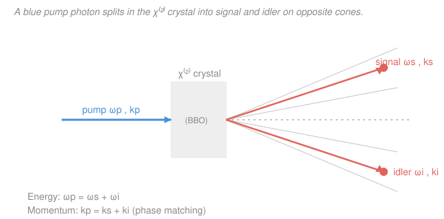

# Quantum Optics &amp; Photonics · Lesson 4.3: Nonlinear optics &amp; parametric down-conversion

> ⏱ ~15 min · Module 4: Cavity QED, entanglement &amp; applications · Builds on: [4.2 Cavity QED &amp; the Jaynes–Cummings model](04-02-cavity-qed-jaynes-cummings.md), [3.6 Single-photon sources &amp; photodetection](03-06-single-photon-sources-photodetection.md) · Unlocks: [4.4 Entangled photons &amp; Bell tests](04-04-entangled-photons-bell-tests.md)

## Why this matters

Almost every table-top quantum-optics experiment of the last forty years — Bell tests, quantum teleportation, boson sampling, heralded single-photon sources — starts with the same trick: shine a strong laser at a special crystal and, once in a while, one photon splits into two. That process, **spontaneous parametric down-conversion (SPDC)**, is the workhorse that turns an ordinary laser into a factory for *photon pairs*. The pairs come out born at the same instant and locked together in energy, momentum, and polarization — exactly the correlations you need to herald single photons (the [3.6](03-06-single-photon-sources-photodetection.md) idea) and, in [4.4](04-04-entangled-photons-bell-tests.md), to build entanglement. This lesson is where the nonlinear optics that makes it possible meets the quantum picture that makes it useful.

## The idea

So far every medium we have met is **linear**: the light's electric field $E$ pushes the electrons, they wiggle, and the resulting polarization (dipole-per-volume) $P$ is simply proportional to $E$. Double the field, double the response. A linear medium can bend, delay, or absorb light, but it can **never change its frequency** — the wiggle happens at exactly the driving frequency.

Now crank the field way up, as a focused laser does. The electrons are pushed so hard that the "restoring spring" holding them stops being a perfect spring — the response bends. $P$ picks up a piece proportional to $E^2$, another to $E^3$, and so on. And here is the magic: an $E^2$ term, fed two oscillations, produces *sum and difference* frequencies (just like $\cos a\cos b$ produces $\cos(a{+}b)$ and $\cos(a{-}b)$). So a nonlinear medium is a **frequency mixer**. Run the mixer forward and one beam at $\omega$ makes a beam at $2\omega$ (second-harmonic generation — green laser pointers). Run the same $E^2$ coupling *in reverse* and one high-frequency **pump** photon can spontaneously fall apart into two lower-frequency photons. That reverse process is SPDC, and the two children are traditionally called **signal** and **idler**.

Two bookkeeping rules decide which children are allowed, and they are just conservation laws for the photons: their energies must add up to the parent's, and so must their momenta. The momentum rule is fussy — dispersion usually spoils it — and getting it satisfied is the whole art of "phase matching."

## The formal version

**Nonlinear polarization.** In a medium the polarization expands as a power series in the field:

$$P = \varepsilon_0\left(\chi^{(1)}E + \chi^{(2)}E^2 + \chi^{(3)}E^3 + \cdots\right),$$

where $\varepsilon_0$ is the vacuum permittivity, $E$ the electric field, and $\chi^{(n)}$ the $n$-th-order **susceptibility** (a material constant; $\chi^{(1)}$ gives the ordinary refractive index). *In words: the medium's response is the linear term plus small corrections that grow with higher powers of the field.* The mixing lives in $\chi^{(2)}$: if $E = E_1\cos\omega_1 t + E_2\cos\omega_2 t$, then $E^2$ contains cross terms $\cos(\omega_1{\pm}\omega_2)t$ — new frequencies. This gives second-harmonic generation ($\omega+\omega\to2\omega$), sum- and difference-frequency generation, and, in reverse, down-conversion.

**Only some crystals have $\chi^{(2)}$.** If the crystal looks the same under $E\to-E$ (a **centrosymmetric** medium, like glass), then $P$ must flip sign when $E$ does — but $E^2$ doesn't flip, so its coefficient must vanish: $\chi^{(2)}=0$. *In words: only crystals without a center of symmetry can down-convert.* The standard choices are **BBO** ($\beta$-barium borate) and **KDP** — birefringent, non-centrosymmetric crystals.

**Phase matching = conservation laws.** In SPDC one pump photon $(\omega_p,\mathbf k_p)$ becomes signal $(\omega_s,\mathbf k_s)$ plus idler $(\omega_i,\mathbf k_i)$, and the pair must conserve energy and momentum:

$$\boxed{\;\omega_p=\omega_s+\omega_i\;}\qquad\boxed{\;\mathbf k_p=\mathbf k_s+\mathbf k_i\;}$$

*In words: the two photons' energies add up to the pump's (energy conservation), and their momenta add up vectorially to the pump's (the "phase-matching" condition).* Multiplying $\mathbf k=n(\omega)\,\omega/c\,\hat{\mathbf k}$ shows momentum conservation ties together the refractive indices at all three frequencies — and **normal dispersion makes it hard to satisfy** (Problem 2). Two fixes:

- **Birefringence (angle tuning).** Put the pump on the crystal axis whose index is *lower*, and rotate the crystal so that lower index exactly compensates dispersion. The emission angle set by $\mathbf k_p=\mathbf k_s+\mathbf k_i$ then carves out **cones** of allowed directions — the rings you see on an SPDC camera.
- **Quasi-phase-matching (periodic poling).** Flip the sign of $\chi^{(2)}$ every so often (a periodically poled crystal, e.g. PPKTP) so the mismatch is reset before it can cancel the output — no exact index matching required.

**Type-I vs Type-II** refers to the polarizations of the pair. *Type-I:* signal and idler share one polarization (both ordinary), emitted on **nested cones**. *Type-II:* signal and idler are **orthogonally** polarized, emitted on two cones that intersect — and the two crossing directions, where you cannot tell which cone a photon came from, are exactly where polarization **entanglement** is born ([4.4](04-04-entangled-photons-bell-tests.md)).

**The quantum picture.** Quantize the three modes (pump $p$, signal $s$, idler $i$) as harmonic-oscillator ladders — the same $\hat a,\hat a^\dagger$ operators from [3.1](03-01-quantizing-em-field.md). The $\chi^{(2)}$ coupling becomes the interaction Hamiltonian

$$\hat H_{\text{int}} \;\propto\; \hat a_p\,\hat a_s^\dagger\,\hat a_i^\dagger \;+\; \hat a_p^\dagger\,\hat a_s\,\hat a_i,$$

where $\hat a^\dagger$ creates a photon in a mode and $\hat a$ destroys one; "+ h.c." (Hermitian conjugate) is the second term. *In words: the first term annihilates one pump photon and creates one signal photon **and** one idler photon — SPDC in a single operator; the second term is the reverse.* Treating the strong pump as a fixed classical amplitude leaves $\hat H_{\text{int}}\propto \hat a_s^\dagger\hat a_i^\dagger + \hat a_s\hat a_i$ — the **two-mode squeezing** interaction, which acting on vacuum produces the state $|0\rangle_s|0\rangle_i + \lambda\,|1\rangle_s|1\rangle_i + \lambda^2|2\rangle_s|2\rangle_i+\cdots$ with $\lambda\ll1$: overwhelmingly nothing, occasionally **exactly one pair**, rarely two. Because the two photons are created by a single operator at a single instant, they are **born together** — tightly correlated in time (coincident within nanoseconds) and perfectly number-correlated (an idler exists iff a signal does).

That last fact is the payoff: detect the idler and you **herald** the signal — you know a lone photon is on its way, without having disturbed it (straight back to [3.6](03-06-single-photon-sources-photodetection.md)). The pairs' correlations are also stronger than any classical light source allows — they violate classical coincidence bounds — which is why the very same pairs become the raw entanglement resource in [4.4](04-04-entangled-photons-bell-tests.md).

## Picture

## Worked examples

**Example 1 (degenerate splitting — read off the wavelengths).** A $405\,\text{nm}$ violet pump drives SPDC. In the **degenerate** case the pump energy splits evenly, $\omega_s=\omega_i=\omega_p/2$. Since $\omega=2\pi c/\lambda$, halving the frequency doubles the wavelength:

$$\lambda_s=\lambda_i=2\lambda_p=810\,\text{nm}.$$

Both children land in the near-infrared — one blue grandparent, two red twins. That is why a violet diode laser is the standard pump for near-IR pair sources.

**Example 2 (why you'd care — heralding a single photon).** Point the idler arm at a detector and the signal arm at your experiment. Every "click" in the idler arm announces, in real time, that a *single* signal photon is entering the experiment — an on-demand-ish single-photon source built from nothing but a laser and a crystal. This is the workhorse behind linear-optics quantum computing and the [4.1](04-01-quantum-beam-splitter-hong-ou-mandel.md) Hong–Ou–Mandel interference that certifies two heralded photons are truly identical. The catch, quantified in Problem 3, is that "click" only heralds a photon that your optics actually collect — so collection efficiency, not brightness, is the figure of merit.

## Watch out

- **You might think down-conversion is just the pump "losing energy" to the crystal.** It isn't dissipation — it is *coherent* splitting: the pump photon is replaced by two photons whose energies **and** momenta add back up to it. Nothing is absorbed; the crystal is only a catalyst (hence "parametric").
- **You might think a brighter pump always gives a better single-photon source.** Pumping harder does raise the pair rate, but it raises the *two-pair* rate faster (the $\lambda^2|2,2\rangle$ term). Those doubles are the dominant impurity of a heralded source — you want $\lambda\ll1$, trading rate for purity (Problem 3).
- **You might expect energy conservation alone to fix the output.** Energy conservation only pins $\omega_s+\omega_i$; it allows a whole continuum of splits. It is the **momentum** condition $\mathbf k_p=\mathbf k_s+\mathbf k_i$ — phase matching — that selects which frequencies come out in which direction (the cones). Change the crystal angle and you retune the whole spectrum.
- **You might think any transparent crystal will do.** Centrosymmetric materials (glass, water, most cubic crystals) have $\chi^{(2)}=0$ by symmetry — no $\chi^{(2)}$ mixing at all. You need a non-centrosymmetric crystal like BBO or KDP.

## One-liner

> A $\chi^{(2)}$ crystal is a photon splitter: energy plus phase-matched momentum let one pump photon become a signal–idler pair, born together in time — heralding fodder and the seed of entanglement.

## Problems

**P1 (🟢)** A pump laser at $\lambda_p = 390\,\text{nm}$ drives SPDC in BBO. (a) Find the signal and idler wavelengths in the degenerate case $\omega_s=\omega_i=\omega_p/2$. (b) In a non-degenerate run the signal is detected at $\lambda_s = 650\,\text{nm}$. Find the idler wavelength $\lambda_i$.

**P2 (🟡)** Consider **collinear, degenerate** SPDC ($\omega_s=\omega_i=\omega_p/2$, all wavevectors parallel). Writing $k=n(\omega)\,\omega/c$, show that momentum conservation reduces to a condition on refractive indices, and explain why ordinary (normal) dispersion — where $n$ increases with frequency — makes it impossible to satisfy with a single polarization. Then state in one line how birefringence rescues it.

**P3 (🔴)** A source emits $R = 1.0\times10^6$ photon **pairs** per second into your optics. The idler ("herald") arm has overall efficiency $\eta_i = 0.25$ (collection × detection) and the signal arm $\eta_s = 0.40$. (a) At what rate do heralds fire? (b) At what rate do you get a *heralded* signal detection (a signal–idler coincidence)? (c) Define the **heralding efficiency** as the fraction of heralds that come with a detected signal, and compute it. (d) In one sentence, explain why pumping harder to raise $R$ eventually *hurts* the source, connecting to [3.6](03-06-single-photon-sources-photodetection.md).

Solutions

**P1** Energy conservation $\omega_p=\omega_s+\omega_i$ with $\omega=2\pi c/\lambda$ becomes $\tfrac1{\lambda_p}=\tfrac1{\lambda_s}+\tfrac1{\lambda_i}$.

(a) Degenerate: $\omega_s=\omega_i=\omega_p/2 \Rightarrow \lambda_s=\lambda_i=2\lambda_p = 2(390) = 780\,\text{nm}$.

(b) Solve for the idler:
$$\frac1{\lambda_i}=\frac1{\lambda_p}-\frac1{\lambda_s}=\frac1{390}-\frac1{650}=0.0025641-0.0015385=0.0010256\ \text{nm}^{-1},$$
so $\lambda_i = 1/0.0010256 \approx 975\,\text{nm}$.

*Check.* $1/390 = 1/650 + 1/975$? Right side $=0.0015385+0.0010256=0.0025641=1/390$ ✓. The bluer signal ($650<780$) forces a redder idler ($975>780$) — energy has to balance. ✓

**P2** With all three $\mathbf k$ parallel, momentum conservation is scalar: $k_p=k_s+k_i$. Insert $k=n\omega/c$ and divide by $c$:
$$n_p\,\omega_p = n_s\,\omega_s + n_i\,\omega_i.$$
Degenerate case $\omega_s=\omega_i=\omega_p/2$ gives $n_p\,\omega_p = (n_s+n_i)\tfrac{\omega_p}{2}$, i.e.
$$n_p = \frac{n_s+n_i}{2}.$$
*In words: the pump index must equal the average of the signal and idler indices.* But with a **single** polarization and normal dispersion, $n(\omega)$ increases with frequency, and the pump is the highest frequency ($\omega_p>\omega_s,\omega_i$), so
$$n_p=n(\omega_p) > n(\omega_p/2)=n_s=n_i = \frac{n_s+n_i}{2}.$$
The required equality $n_p=(n_s+n_i)/2$ is violated — $n_p$ is strictly **too large**. Phase matching fails.

**Birefringence fix (one line):** put the pump on the crystal's *extraordinary* axis, whose index $n_e(\theta)<n_o$, and tune the propagation angle $\theta$ until $n_p^{\,e}(\theta)=(n_s+n_i)/2$, so the crystal's birefringence exactly cancels the dispersion gap (this is Type-I phase matching).

**P3**
(a) A herald is an idler detection; idlers arrive at rate $R$ and are detected with efficiency $\eta_i$:
$$R_{\text{herald}} = R\,\eta_i = 10^6 \times 0.25 = 2.5\times10^5\ \text{s}^{-1}.$$
(b) A heralded (coincident) detection needs *both* photons detected. The two arms are independent, so
$$R_{\text{coinc}} = R\,\eta_s\,\eta_i = 10^6\times0.40\times0.25 = 1.0\times10^5\ \text{s}^{-1}.$$
(c) Heralding efficiency = coincidences ÷ heralds:
$$\eta_H=\frac{R_{\text{coinc}}}{R_{\text{herald}}}=\frac{R\,\eta_s\eta_i}{R\,\eta_i}=\eta_s = 0.40.$$
So the heralding efficiency is just the **signal-arm** efficiency — the probability that, given a herald, the promised photon is actually detected. (This is the Klyshko efficiency; it's independent of the pair rate $R$.)

(d) SPDC is a squeezing process, so the chance of emitting *two* pairs in one detection window grows as the square of the mean pair number — pumping harder to raise $R$ raises the double-pair (multi-photon) fraction faster than the singles, contaminating the herald with two-photon events and spoiling the single-photon purity ($g^{(2)}$ of the heralded state rises above $0$; cf. [3.6](03-06-single-photon-sources-photodetection.md)). Brightness and purity trade off — you keep $\lambda\ll1$.

*Check.* $\eta_H=\eta_s$ makes sense: given a herald fired, whether you *also* see the signal depends only on the signal arm. And raising $R$ never improves $\eta_H$ (it cancels) — only better optics do. ✓

## Flashback

**From Lesson 4.1 (Hong–Ou–Mandel interference):** Two indistinguishable single photons arrive simultaneously at a 50:50 beam splitter, one at each input port. (a) What is the probability they leave through *different* output ports (a coincidence click at both detectors)? (b) Now delay one photon by much more than its coherence time before it reaches the splitter. What is the coincidence probability now, and what has changed?

Solution

(a) **Zero.** When the two photons are perfectly indistinguishable, the two "split" amplitudes — both transmit vs. both reflect — carry opposite signs and cancel exactly. The photons **bunch**: they always leave through the *same* port, so the coincidence rate drops to zero. This dip is the Hong–Ou–Mandel effect.

(b) With a delay far longer than the coherence time the photons are **distinguishable** (they no longer overlap at the splitter), so there is nothing to interfere. Each photon independently transmits or reflects with probability $\tfrac12$, and the four equally likely outcomes (TT, TR, RT, RR) give coincidences in the two "different-port" cases:
$$P_{\text{coinc}} = \tfrac12.$$
*Check.* Sweeping the delay traces the HOM dip from $\tfrac12$ (distinguishable) down to $0$ (perfectly overlapped) and back; the depth of the dip measures how indistinguishable the two photons are — which is exactly what a heralded SPDC pair source (this lesson) must deliver to be useful. ✓

## Connections

- **Backward:** the three-mode coupling $\hat a_p\hat a_s^\dagger\hat a_i^\dagger$ is built from the ladder operators of [3.1](03-01-quantizing-em-field.md), and the resulting $\hat a_s^\dagger\hat a_i^\dagger+\hat a_s\hat a_i$ is the **two-mode squeezing** interaction of [3.5](03-05-squeezed-states.md). The "detect one, herald the other" logic is [3.6](03-06-single-photon-sources-photodetection.md)'s heralding, and the pair correlations echo the sub-Poissonian, nonclassical statistics of [2.3](02-03-photon-statistics-g2.md).
- **Forward:** [4.4 Entangled photons &amp; Bell tests](04-04-entangled-photons-bell-tests.md) takes Type-II SPDC's crossed cones — where signal and idler polarizations are indistinguishable — and turns the pairs into polarization-**entangled** states that violate a Bell inequality. Those entangled pairs are then the currency of [4.5](04-05-quantum-information-taste.md)'s teleportation and quantum-key-distribution.
- **Sideways (Fourier / dispersion):** phase matching is a resonance condition in $\mathbf k$-space, and it fails precisely because of **dispersion** $n(\omega)$ — the same frequency-dependent index that governs pulse spreading and group velocity in the waves and optics track (see the [`waves-optics`](../../waves-optics/syllabus.md) course). Birefringent angle tuning is the geometric fix; periodic poling is the Fourier-space fix (adding a grating momentum $2\pi/\Lambda$ to close the gap).
