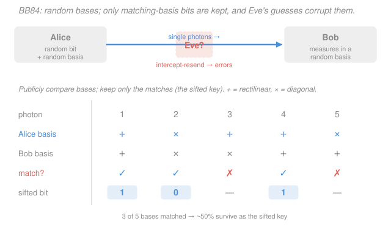

# Quantum Optics & Photonics · Lesson 4.5: A taste of quantum information

> ⏱ ~15 min · Module 4: Cavity QED, entanglement & applications · Builds on: [4.4 Entangled photons & Bell tests](04-04-entangled-photons-bell-tests.md), [3.6 Single-photon sources & detection](03-06-single-photon-sources-photodetection.md) · Unlocks: further study — [information-theory](../../information-theory/syllabus.md), [quantum-computing](../../quantum-computing/syllabus.md)

## Why this matters

Every technology in this course was a step toward a single payoff: using light not just to *carry* energy but to *carry information the laws of physics protect*. A single photon is the smallest possible messenger — and because you cannot measure it without disturbing it (Module 3) and cannot copy it at all (this lesson), that fragility becomes a security guarantee. This is the idea behind **quantum key distribution**, already deployed on real fiber networks: two strangers share a secret key whose secrecy rests on quantum mechanics, not on any assumption about how clever an eavesdropper's computer is. This lesson turns the whole course into a working piece of quantum information, and points to where the story continues.

## The idea

Encode one bit in one photon. Call horizontal polarization $|H\rangle$ the bit "0" and vertical $|V\rangle$ the bit "1". A single photon can also sit in a *superposition* of the two — that is a **qubit**, a bit that can be $0$, $1$, or a weighted blend until you measure it.

Here is the twist that makes everything work. There is a second, equally good way to encode a bit: **diagonal** $|+\rangle$ (polarized at $45^\circ$) for "0" and **anti-diagonal** $|-\rangle$ (at $-45^\circ$) for "1". These two encodings — the **rectilinear** basis $\{|H\rangle,|V\rangle\}$ and the **diagonal** basis $\{|+\rangle,|-\rangle\}$ — are *conjugate*: a photon that is a crisp, definite bit in one basis is a perfect coin-flip in the other. Measure a $|H\rangle$ photon with a diagonal analyzer and you get $|+\rangle$ or $|-\rangle$ with 50/50 odds, and the original $H$-ness is *gone*. Ask the wrong question and you not only get a random answer — you destroy the state.

Two more facts stack on top. **No-cloning:** you cannot duplicate an unknown qubit, so an eavesdropper can't just photocopy the photon and study the copy at leisure. **Measurement disturbance:** any attempt to read the photon in the wrong basis scrambles it, leaving fingerprints. Put these together and you get a channel where *listening in is physically detectable*. That is BB84.

## The formal version

**A qubit.** A general pure qubit is
$$|\psi\rangle = \alpha\,|0\rangle + \beta\,|1\rangle, \qquad |\alpha|^2 + |\beta|^2 = 1,$$
where $\alpha,\beta\in\mathbb{C}$ are **probability amplitudes** and $|\alpha|^2$ is the chance of measuring "0" in the computational basis. *In words: a qubit is a unit-length complex vector in a 2D space; the two coordinates are the amplitudes for the two classical outcomes.* Up to an irrelevant overall phase it can be written $|\psi\rangle=\cos\tfrac{\theta}{2}|0\rangle+e^{i\varphi}\sin\tfrac{\theta}{2}|1\rangle$, so every qubit is a point $(\theta,\varphi)$ on a sphere — the **Bloch sphere**, with $|0\rangle$ and $|1\rangle$ at the poles.

**The two conjugate bases.** With $|0\rangle=|H\rangle$, $|1\rangle=|V\rangle$,
$$|+\rangle = \tfrac{1}{\sqrt2}\big(|H\rangle + |V\rangle\big), \qquad |-\rangle = \tfrac{1}{\sqrt2}\big(|H\rangle - |V\rangle\big).$$
*In words: the diagonal states are equal superpositions of horizontal and vertical.* Their defining property: $|\langle H|+\rangle|^2 = \tfrac12$. Measuring a rectilinear state in the diagonal basis (or vice-versa) gives each outcome with probability $\tfrac12$ — maximal randomness.

**No-cloning theorem.** *There is no unitary $U$ with $U\big(|\psi\rangle|0\rangle\big) = |\psi\rangle|\psi\rangle$ for every $|\psi\rangle$.* Two-line proof: suppose such a $U$ existed and apply it to two states $|\psi\rangle,|\phi\rangle$. Unitaries preserve inner products, so equating the input and output overlaps,
$$\underbrace{\langle\psi|\phi\rangle\,\langle 0|0\rangle}_{\text{inputs}} = \underbrace{\langle\psi|\phi\rangle\,\langle\psi|\phi\rangle}_{\text{outputs}} \;\;\Longrightarrow\;\; \langle\psi|\phi\rangle = \langle\psi|\phi\rangle^2.$$
Writing $x=\langle\psi|\phi\rangle$, the equation $x=x^2$ forces $x=0$ or $x=1$ — the states are either orthogonal or identical. *In words: a machine could clone a fixed known set of orthogonal states, but no single machine clones arbitrary unknown qubits.* An eavesdropper handed one mystery photon is stuck.

**BB84 (Bennett–Brassard, 1984).** The protocol:
1. For each photon, **Alice** picks a random bit and a random basis (rectilinear or diagonal) and sends the matching state: e.g. bit 1 in the diagonal basis $\to |-\rangle$.
2. **Bob** measures each photon in a *randomly* chosen basis, independent of Alice.
3. Over a public (authenticated but not secret) channel they announce only their **bases**, never their bits, and discard every photon where the bases disagreed. The surviving bits are the **sifted key**. Since bases match with probability $\tfrac12$, about half the photons survive.
4. Where bases matched *and* nobody interfered, Bob's bit equals Alice's exactly. They sacrifice a random sample of sifted bits, compare them publicly, and estimate the **quantum bit error rate (QBER)**. Low QBER $\Rightarrow$ the rest is secret; high QBER $\Rightarrow$ abort.

*In words: agree on a shared random string by keeping only the photons you happened to read the right way, then use a few of them as tripwires.* An eavesdropper (Eve) who intercepts a photon must guess its basis with no information; half the time she guesses wrong, and by no-cloning she cannot dodge the choice. A wrong-basis measurement resends a scrambled state, so **her presence shows up as errors** — the security rests on physics, not on the hardness of factoring.

## Picture

## Worked examples

**Example 1 (mechanical — sifting a key).** Alice sends 6 photons; below are her bases and Bob's, with R = rectilinear, D = diagonal.

| # | 1 | 2 | 3 | 4 | 5 | 6 |
|---|---|---|---|---|---|---|
| Alice | R | R | D | R | D | D |
| Bob | R | D | D | D | D | R |
| Keep? | ✓ | ✗ | ✓ | ✗ | ✓ | ✗ |

Bases match at photons 1, 3, 5 — three of six, right on the expected $50\%$. Only those three bits enter the sifted key; the mismatched photons are thrown away *even though a bit was sent and received*, because a wrong-basis outcome is uncorrelated with what Alice meant.

**Example 2 (why you'd care — Eve leaves fingerprints).** Take one *sifted* photon (Alice and Bob used the same basis, say R, and Alice sent $|H\rangle$). Suppose Eve intercepts it, measures in a random basis, and resends what she found.
- With probability $\tfrac12$ Eve also picks R: she reads $|H\rangle$ correctly, resends $|H\rangle$, and Bob (measuring R) gets $H$ = the right bit. No error.
- With probability $\tfrac12$ Eve picks D: her outcome is $|+\rangle$ or $|-\rangle$ at random, and she resends that. Bob now measures a *diagonal* state in the R basis, so he gets $H$ or $V$ with 50/50 odds — a $\tfrac12$ chance of the **wrong** bit.

Net error rate Eve injects into the sifted key: $\tfrac12 \times \tfrac12 = \tfrac14$. A clean channel has QBER near $0$; a full intercept-resend Eve pushes it to $\approx 25\%$, and comparing a modest sample of sifted bits exposes her almost immediately (Problem 3).

## Watch out

- **You might think Alice and Bob compare their bits to check for Eve — they don't, at least not the key bits.** They publicly compare **bases** to sift, and compare only a *sacrificial sample* of bits to estimate the error rate. The kept key is never announced. Revealing a bit spends it.
- **You might think no-cloning forbids all copying.** It forbids copying *unknown* qubits. You can perfectly clone a state you already know how to prepare (just prepare another), and you can copy orthogonal states that you're promised come from a known set — that's ordinary classical bit-copying. What's impossible is a *universal* copier for arbitrary unknown inputs.
- **You might think measuring "does nothing" if you pick the right basis.** In the matching basis the outcome is deterministic and the state survives — but Eve doesn't *know* the right basis, and that's the whole point. The disturbance comes precisely from being forced to guess.
- **You might conflate quantum and classical security.** RSA is safe *if* factoring is hard (an unproven computational bet). BB84 is safe because cloning is impossible and measurement disturbs — a *physical* guarantee that no faster computer can erode.

## One-liner

> You can't copy an unknown photon and you can't measure it in the wrong basis without scrambling it — so two strangers can forge a shared secret whose eavesdropper is guaranteed to leave fingerprints.

## Problems

**P1 (🟢)** Alice and Bob run BB84 over 10 photons. Alice's bits are `1 0 1 1 0 0 1 0 1 1`; her bases and Bob's are:

| # | 1 | 2 | 3 | 4 | 5 | 6 | 7 | 8 | 9 | 10 |
|---|---|---|---|---|---|---|---|---|---|----|
| Alice | R | R | D | D | R | D | R | D | D | R |
| Bob | R | D | D | R | R | D | R | R | R | D |

Which photons enter the sifted key, what is the sifted key, and what fraction of photons survived? What sifted-key rate would you expect on average, and why?

**P2 (🟡)** Finish the *linearity* form of the no-cloning proof. Suppose a cloner works on the two basis states, $U|0\rangle|0\rangle = |0\rangle|0\rangle$ and $U|1\rangle|0\rangle = |1\rangle|1\rangle$. Apply $U$ to the superposition $|+\rangle = \tfrac{1}{\sqrt2}(|0\rangle+|1\rangle)$ using linearity, compare with what perfect cloning of $|+\rangle$ would require, and exhibit the contradiction.

**P3 (🔴)** An intercept-resend Eve measures **every** photon in a random basis and resends her result. (a) Confirm she injects a $25\%$ error rate into the sifted key. (b) Alice and Bob publicly compare $n$ sifted bits as a test. If Eve is present, what's the probability that *all $n$ agree anyway* (she goes undetected on this sample)? How large must $n$ be to catch her with probability at least $99\%$? At least $1-10^{-6}$?

Solutions

**P1** Compare bases photon by photon; keep where they match:

| # | 1 | 2 | 3 | 4 | 5 | 6 | 7 | 8 | 9 | 10 |
|---|---|---|---|---|---|---|---|---|---|----|
| Alice | R | R | D | D | R | D | R | D | D | R |
| Bob | R | D | D | R | R | D | R | R | R | D |
| Match | ✓ | ✗ | ✓ | ✗ | ✓ | ✓ | ✓ | ✗ | ✗ | ✗ |

Matches at photons **1, 3, 5, 6, 7** — five survive out of ten, a $50\%$ yield. Reading Alice's bits at those positions (`1`, `1`, `0`, `0`, `1`) gives the sifted key
$$\boxed{11001}.$$
*Expected rate.* Alice and Bob choose bases independently and uniformly, so $P(\text{match}) = \tfrac12$ per photon regardless of the bits. On average half the photons survive; this run landing on exactly $5/10$ is the mean outcome (individual runs fluctuate around it).

**P2** By linearity of $U$,
$$U|+\rangle|0\rangle = \tfrac{1}{\sqrt2}\big(U|0\rangle|0\rangle + U|1\rangle|0\rangle\big) = \tfrac{1}{\sqrt2}\big(|0\rangle|0\rangle + |1\rangle|1\rangle\big).$$
That output is a maximally *entangled* Bell state of the two photons. But genuine cloning of $|+\rangle$ demands two independent copies:
$$|+\rangle|+\rangle = \tfrac12\big(|0\rangle+|1\rangle\big)\big(|0\rangle+|1\rangle\big) = \tfrac12\big(|0\rangle|0\rangle + |0\rangle|1\rangle + |1\rangle|0\rangle + |1\rangle|1\rangle\big).$$
The two results disagree — the entangled state has no $|0\rangle|1\rangle$ or $|1\rangle|0\rangle$ terms, while the true clone has all four with weight $\tfrac12$. A single $U$ cannot both copy $|0\rangle$ and $|1\rangle$ *and* copy their superposition. Contradiction, so no universal cloner exists. (This is the same theorem as the inner-product proof in the lesson, viewed through linearity: cloning is a nonlinear demand, and quantum evolution is linear.)

**P3** *(a)* Take a sifted photon, so Alice's and Bob's bases agree; call it R and say Alice sent $|H\rangle$. Eve's random basis is R or D each with probability $\tfrac12$:
- Eve picks R ($\tfrac12$): reads $H$, resends $|H\rangle$, Bob gets $H$. Correct.
- Eve picks D ($\tfrac12$): resends $|+\rangle$ or $|-\rangle$; Bob measuring R then gets the wrong bit with probability $\tfrac12$.

Error probability $= \tfrac12\cdot 0 + \tfrac12\cdot\tfrac12 = \tfrac14 = 25\%$. (By symmetry the same holds for any sent state and either sifting basis.)

*(b)* Each compared bit independently agrees despite Eve with probability $1-\tfrac14 = \tfrac34$. So the chance all $n$ agree — Eve slips past this sample — is
$$P_{\text{miss}} = \left(\tfrac34\right)^{n},$$
and the detection probability is $1-(3/4)^n$. Require $1-(3/4)^n \ge 0.99$, i.e. $(3/4)^n \le 0.01$:
$$n \ge \frac{\ln 0.01}{\ln 0.75} = \frac{-4.605}{-0.2877} \approx 16.0 \;\Rightarrow\; n = 16.$$
For confidence $1-10^{-6}$, require $(3/4)^n \le 10^{-6}$:
$$n \ge \frac{\ln 10^{-6}}{\ln 0.75} = \frac{-13.816}{-0.2877} \approx 48.0 \;\Rightarrow\; n = 48.$$
*Check.* Just a couple dozen sacrificed bits expose a full-intercept Eve with overwhelming odds — a tiny price against a huge sifted key. Real protocols don't demand *zero* errors (fibers and detectors add noise); they estimate the QBER and abort above a threshold near $11\%$, comfortably below Eve's $25\%$.

## Flashback

**From Lesson 4.4 (Entangled photons & Bell tests):** A polarization-entangled photon pair gives correlation $E(\alpha,\beta) = \cos\big(2(\alpha-\beta)\big)$ between Alice's polarizer at angle $\alpha$ and Bob's at $\beta$. Evaluate the CHSH quantity
$$S = E(a,b) + E(a,b') + E(a',b) - E(a',b')$$
for $a=0^\circ,\ a'=45^\circ,\ b=22.5^\circ,\ b'=-22.5^\circ$, and state whether it beats the classical bound $|S|\le 2$. (Fresh angle set — not the ones from 4.4.)

Solution

Compute each correlation from $E(\alpha,\beta)=\cos(2(\alpha-\beta))$:
$$E(a,b) = \cos\big(2(0-22.5^\circ)\big) = \cos(-45^\circ) = \tfrac{1}{\sqrt2},$$
$$E(a,b') = \cos\big(2(0+22.5^\circ)\big) = \cos(45^\circ) = \tfrac{1}{\sqrt2},$$
$$E(a',b) = \cos\big(2(45^\circ-22.5^\circ)\big) = \cos(45^\circ) = \tfrac{1}{\sqrt2},$$
$$E(a',b') = \cos\big(2(45^\circ+22.5^\circ)\big) = \cos(135^\circ) = -\tfrac{1}{\sqrt2}.$$
Then
$$S = \tfrac{1}{\sqrt2} + \tfrac{1}{\sqrt2} + \tfrac{1}{\sqrt2} - \left(-\tfrac{1}{\sqrt2}\right) = \frac{4}{\sqrt2} = 2\sqrt2 \approx 2.83.$$
Since $2\sqrt2 > 2$, the pair **violates** the CHSH inequality by the maximum quantum amount — no local-hidden-variable model can reproduce these correlations. *Check.* $2\sqrt2$ is Tsirelson's bound, the largest $S$ quantum mechanics allows; the chosen angles hit it exactly, as the optimal $45^\circ/22.5^\circ$ spacing should.

## Connections

- **Backward:** the "flying qubit" *is* the single photon from [3.6](03-06-single-photon-sources-photodetection.md) — BB84 needs true one-photon pulses so no leftover copy leaks to Eve. Conjugate bases are the polarization version of the complementary quadratures in [3.4](03-04-quadratures-phase-space-shot-noise.md), and measurement disturbance is the same back-action that sets the shot-noise floor. Entanglement as a resource is exactly the Bell pairs of [4.4](04-04-entangled-photons-bell-tests.md): **teleportation** sends an unknown qubit using one shared Bell pair plus two classical bits — moving quantum information without violating no-cloning, since the original is destroyed in the process.
- **Forward:** this is the doorway to two full subjects. In information-theory, the sifted key, QBER, and privacy amplification are quantified with Shannon entropy and its quantum cousin, the von Neumann entropy — see the [information-theory](../../information-theory/syllabus.md) syllabus. In quantum-computing, the qubit, the Bloch sphere, and unitary gates you met here become the whole computational model, with photons as one hardware platform for quantum networks — see the [quantum-computing](../../quantum-computing/syllabus.md) syllabus.
- **Course wrap-up.** We started with a classical light wave — a Gaussian beam obeying Maxwell's equations ([1.1](01-01-classical-em-waves-gaussian-beams.md)) — and asked what light *is* when you look closely. Coherence ([Module 2](02-01-temporal-coherence-g1.md)) exposed the graininess classical optics couldn't explain; quantizing the field ([Module 3](03-01-quantizing-em-field.md)) revealed photons as excitations of a harmonic-oscillator ladder, with a vacuum that fluctuates, coherent states that mimic lasers, and squeezed states that outwit shot noise. Then single photons and entangled pairs ([Module 4](04-01-quantum-beam-splitter-hong-ou-mandel.md)) stopped being curiosities and became *carriers of information* — bits you can't clone, correlations no classical world can fake. The arc is one idea seen at ever finer grain: **light is the most practical quantum system we have, and quantum information is what it was for all along.**
