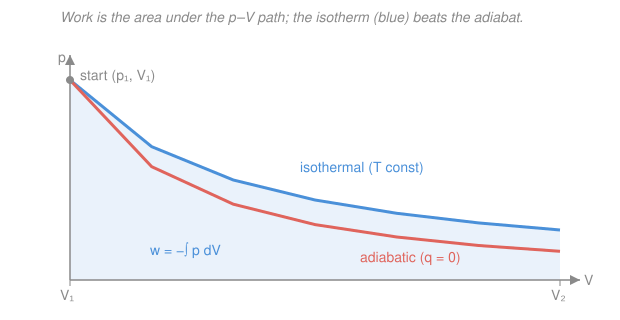

# Physical Chemistry · Lesson 1.1: The first law and enthalpy

> ⏱ ~15 min · Module 1: Chemical thermodynamics · Builds on: [general-chemistry 3.2 Thermochemistry & calorimetry](../../general-chemistry/lessons/03-02-thermochemistry-enthalpy-calorimetry.md), [thermodynamics-physics](../../thermodynamics-physics/syllabus.md) · Unlocks: [1.2 Entropy and the second law](01-02-entropy-second-law.md)

## Why this matters

In general chemistry you memorized that "$\Delta H$ is the heat of reaction" and added up formation enthalpies. That worked, but it hid a question: *why* is $H$ the right bookkeeping quantity, and when is it **not**? This lesson answers that. The first law is just energy conservation with heat and work on equal footing — and enthalpy is the specific combination of energy and $pV$ that turns out to equal the heat you actually measure in an open beaker. Get the state-vs-path distinction right here and the entire rest of thermodynamics (entropy, Gibbs energy, equilibrium constants, the whole edifice of Module 1) is built on solid ground.

## The idea

Draw a box around whatever you care about — a reacting mixture, a gas in a cylinder. Inside is the **system**; everything else is the **surroundings**; together they're the **universe**. Energy crosses the boundary in exactly two currencies: **heat** $q$ (flow driven by a temperature difference) and **work** $w$ (organized push, e.g. a gas shoving a piston). The first law says the system's internal energy only changes by what crosses that boundary — energy is neither created nor destroyed, just moved and re-labeled.

The deep move is distinguishing **state functions** from **path functions**. Internal energy $U$, temperature $T$, pressure $p$, volume $V$, enthalpy $H$ — these depend only on *where the system is now*, not on how it got there. Like altitude on a mountain: it doesn't matter which trail you hiked, your elevation is your elevation. But heat $q$ and work $w$ are **path functions** — like the distance you walked. Two trails to the same summit gain the same altitude ($\Delta U$ fixed) but can differ wildly in miles hiked (different $q$, different $w$). This is why $q$ and $w$ each depend on the process, yet their *sum* $\Delta U$ does not. Enthalpy's whole reason for existing is that under one common lab condition — constant pressure — it makes a path-dependent heat behave like a state function.

## The formal version

**The system and the first law.** Let $U$ be the **internal energy** (joules, J) — the total kinetic and potential energy of all the molecules inside the boundary. The **first law of thermodynamics**:

$$\boxed{\;\Delta U = q + w\;}$$

where $q$ is heat and $w$ is work, both in joules. *In words: the change in a system's internal energy equals the heat added to it plus the work done on it.* Sign convention (the physical-chemistry / IUPAC convention — energy *into the system* is positive):

- $q > 0$: heat flows **into** the system; $q < 0$: heat leaves.
- $w > 0$: work is done **on** the system (compression); $w < 0$: the system does work on the surroundings (expansion).

$\Delta U$ is a **state function**: for any process, $\Delta U = U_\text{final} - U_\text{initial}$, independent of path. $q$ and $w$ individually are **path functions** — write $\Delta q$ for them and you've made an error; there is no "$q$ of a state," only heat *transferred along a process*.

**Pressure–volume work.** When a gas expands and pushes its boundary outward against an external pressure $p_\text{ext}$, the work done *on the system* is

$$w = -\int_{V_1}^{V_2} p_\text{ext}\,dV.$$

*In words: the system loses energy (negative $w$) when it expands ($dV>0$) against a resisting pressure.* The minus sign encodes the sign convention: expansion spends the system's energy.

Two important special cases for an ideal gas:

- **Irreversible expansion against constant external pressure** $p_\text{ext}$: it comes straight out of the integral, $w = -p_\text{ext}(V_2 - V_1)$.
- **Reversible isothermal expansion.** "Reversible" means the expansion is so gentle that the gas is always in balance with its surroundings, $p_\text{ext} = p$ at every instant. Then substitute the ideal-gas law $p = nRT/V$ (with $n$ mol, $R = 8.314\ \mathrm{J\,K^{-1}\,mol^{-1}}$, $T$ held constant):

$$w = -\int_{V_1}^{V_2} \frac{nRT}{V}\,dV = -nRT\int_{V_1}^{V_2}\frac{dV}{V} = \boxed{\,-nRT\ln\frac{V_2}{V_1}\,}.$$

*In words: a gas expanding reversibly and isothermally does the maximum possible work, set by the log of the volume ratio.* (We'll see in P3 why "reversible = maximum" is a theorem, not an accident.)

**Heat capacities.** How much does $U$ (or $H$) rise per degree of heating? Define

$$C_V = \left(\frac{\partial U}{\partial T}\right)_V, \qquad C_p = \left(\frac{\partial H}{\partial T}\right)_p.$$

*In words: $C_V$ is the heat needed to warm the system by one kelvin at fixed volume; $C_p$ the same at fixed pressure.* They differ because at constant $p$ some of the heat leaks out as expansion work instead of raising $U$. For an ideal gas this correction is exactly

$$\boxed{\,C_p - C_V = nR\,}.$$

(Monatomic ideal gas: $C_V = \tfrac32 nR$, $C_p = \tfrac52 nR$. Diatomic near room temperature: $C_V = \tfrac52 nR$, $C_p = \tfrac72 nR$ — the extra $nR$ is the rotational modes, a fact stat-mech will hand you from the [partition function](../../stat-mech/syllabus.md).)

**Enthalpy — the chemist's heat.** Define **enthalpy**

$$H \equiv U + pV.$$

*In words: enthalpy is internal energy plus the $pV$ "room-making" term the system carries by occupying space at pressure $p$.* Why bother? Run a process at constant pressure with only $pV$ work. Then $w = -p\,\Delta V$ and $\Delta U = q_p - p\,\Delta V$, so

$$q_p = \Delta U + p\,\Delta V = \Delta(U + pV) = \Delta H.$$

$$\boxed{\;\Delta H = q_p \quad (\text{constant } p)\;}$$

*In words: at constant pressure, the heat you measure is exactly the enthalpy change.* This is why chemists live in $H$: reactions in open flasks happen at atmospheric (constant) pressure, so a calorimeter reading of "heat released" *is* $\Delta H$. It refines the gen-chem slogan "$\Delta H$ is the heat of reaction" into a precise conditional: it's the heat *only when $p$ is constant and the only work is $pV$*. At constant volume instead, $w = 0$ and $q_V = \Delta U$.

**Thermochemistry recap (from gen-chem, now with a reason).** Because $H$ is a state function, $\Delta_r H$ for a reaction depends only on reactants and products, not the route — that's **Hess's law**, which is nothing more than "state function, path-independent." So you can compute any reaction's enthalpy from tabulated **standard enthalpies of formation** $\Delta_f H^\circ$ via $\Delta_r H^\circ = \sum \nu\,\Delta_f H^\circ(\text{products}) - \sum \nu\,\Delta_f H^\circ(\text{reactants})$, exactly as in [general-chemistry 3.2](../../general-chemistry/lessons/03-02-thermochemistry-enthalpy-calorimetry.md). Everything you did there was secretly exploiting the state-function property of $H$.

**Adiabatic vs isothermal (ideal gas).** Two clean ways to expand a gas:

- **Isothermal** ($T$ constant): heat flows in to hold $T$ fixed. Since ideal-gas $U$ depends *only* on $T$, $\Delta U = 0$, so $q = -w$ — every joule of work done by the gas is replaced by heat drawn from the surroundings.
- **Adiabatic** ($q = 0$): no heat crosses the boundary (insulated, or fast). Then $\Delta U = w$, and an expanding gas ($w<0$) must *cool* — it spends its own internal energy to do the work. This is why compressed air cans get cold and why rising air masses cool. On a $p$–$V$ plot the adiabat falls off *more steeply* than the isotherm (next figure).

## Picture

The two paths leave the same starting state $(p_1, V_1)$ and reach the same final volume $V_2$. Work is the area under the curve, $w = -\int p\,dV$. The isotherm stays higher (heat is fed in to hold $T$), so it encloses more area and does more work; the adiabat drops faster because the gas cools as it expends its own energy.

## Worked examples

**Example 1 (isothermal, ideal gas — the log formula in action).** 1.00 mol of ideal gas expands reversibly and isothermally at $T = 300\ \mathrm{K}$ from $V_1 = 2.0\ \mathrm{L}$ to $V_2 = 6.0\ \mathrm{L}$.

$$w = -nRT\ln\frac{V_2}{V_1} = -(1.00)(8.314)(300)\ln 3 = -(2494)(1.0986) = -2740\ \mathrm{J}.$$

Because $T$ is constant and the gas is ideal, $\Delta U = 0$, hence $q = -w = +2740\ \mathrm{J}$: the gas absorbs 2.74 kJ of heat and converts all of it to work. And $\Delta H = \Delta U + \Delta(pV) = 0 + 0 = 0$ (for an ideal gas at constant $T$, $pV = nRT$ is constant).

**Example 2 (why $\Delta H \neq \Delta U$ for a reaction that changes moles of gas).** Consider $\ce{N2(g) + 3H2(g) -> 2NH3(g)}$ at constant $T$ and $p$. Four moles of gas become two, so $\Delta n_\text{gas} = 2 - 4 = -2$. Using $H = U + pV$ and $pV = n_\text{gas}RT$ for the gaseous species,

$$\Delta H = \Delta U + \Delta(pV) = \Delta U + \Delta n_\text{gas}\,RT.$$

At $T = 298\ \mathrm{K}$, the correction is $\Delta n_\text{gas}RT = (-2)(8.314)(298) = -4955\ \mathrm{J} = -4.96\ \mathrm{kJ}$. So $\Delta H$ is about 5 kJ *more negative* than $\Delta U$ here — the surroundings do compression work on the shrinking gas, and that shows up as extra heat released. This is the exact bridge between the constant-volume $\Delta U$ (a bomb calorimeter) and the constant-pressure $\Delta H$ (an open flask).

## Watch out

- **You might think heat is a property a system "has."** It isn't — a system has $U$ (and $T$, $p$, $V$, $H$), but $q$ and $w$ exist only *during a process*. "The heat of the gas" is a category error; "the heat added to the gas along this path" is correct. Never write $\Delta q$ or $\Delta w$.
- **You might use $\Delta H = q$ unconditionally.** It only holds at **constant pressure** with only $pV$ work. At constant volume the right statement is $\Delta U = q_V$. Two different heats, two different conditions.
- **You might think reversible and irreversible expansions between the same endpoints do the same work.** They don't — work is a path function, and the reversible path extracts strictly *more* (P3). Only the state functions $\Delta U$ and $\Delta H$ come out identical.
- **Sign traps.** In this course $w>0$ means work done *on* the system. Some physics texts define $w$ as work done *by* the system and write $\Delta U = q - w$. Same physics, flipped bookkeeping — always check which convention a source uses.

## One-liner

> Energy is conserved as $\Delta U = q + w$ with $U$ path-independent but $q,w$ not; enthalpy $H = U + pV$ exists so that the constant-pressure heat every chemist measures, $q_p = \Delta H$, is itself a state function.

## Problems

**P1 (🟢)** 2.00 mol of an ideal gas expands reversibly and isothermally at $T = 298\ \mathrm{K}$ from $V_1 = 5.0\ \mathrm{L}$ to $V_2 = 15.0\ \mathrm{L}$. Find $q$, $w$, $\Delta U$, and $\Delta H$.

**P2 (🟡)** 1.00 mol of an ideal *diatomic* gas ($C_V = \tfrac52 nR$) is heated from 300 K to 400 K. Compute $\Delta U$ and $\Delta H$, and verify that $\Delta H - \Delta U = nR\,\Delta T$. Which is larger, and why?

**P3 (🔴)** The gas of P1 is expanded between the *same* two states ($V_1=5.0\to V_2=15.0\ \mathrm{L}$, $T=298\ \mathrm{K}$), but now **irreversibly** against a constant external pressure equal to the final pressure $p_2 = nRT/V_2$. Compute this $w_\text{irrev}$ and compare it to the reversible $w$ from P1. Show algebraically that the reversible expansion always extracts more work, and confirm $\Delta U$ is unchanged.

Solutions

**P1** Ideal gas, isothermal $\Rightarrow$ $U$ depends only on $T$, so $\Delta U = 0$. Likewise $\Delta H = \Delta U + \Delta(pV) = 0 + \Delta(nRT) = 0$ since $T$ is constant.

$$w = -nRT\ln\frac{V_2}{V_1} = -(2.00)(8.314)(298)\ln 3 = -(4955.1)(1.0986) = -5445\ \mathrm{J} \approx -5.44\ \mathrm{kJ}.$$

From the first law, $q = \Delta U - w = 0 - (-5445) = +5445\ \mathrm{J} \approx +5.44\ \mathrm{kJ}$.

*Answers:* $\Delta U = 0$, $\Delta H = 0$, $w = -5.44\ \mathrm{kJ}$ (gas does work), $q = +5.44\ \mathrm{kJ}$ (heat absorbed). All the absorbed heat becomes expansion work. ✓

**P2** At constant amount, $\Delta U = nC_{V,\text{m}}\Delta T$ and $\Delta H = nC_{p,\text{m}}\Delta T$ with $C_{p,\text{m}} = C_{V,\text{m}} + R$.

$$\Delta U = (1.00)\left(\tfrac52\times 8.314\right)(100) = (1.00)(20.785)(100) = 2079\ \mathrm{J} \approx 2.08\ \mathrm{kJ}.$$
$$\Delta H = (1.00)\left(\tfrac72\times 8.314\right)(100) = (1.00)(29.099)(100) = 2910\ \mathrm{J} \approx 2.91\ \mathrm{kJ}.$$

Difference: $\Delta H - \Delta U = 2910 - 2079 = 831\ \mathrm{J}$, and $nR\,\Delta T = (1.00)(8.314)(100) = 831\ \mathrm{J}$ ✓. $\Delta H$ is larger because at constant $p$ the gas also expands as it warms, and $H$ books both the internal-energy rise *and* the $pV$ work of that expansion, whereas $\Delta U$ counts only the internal-energy rise.

**P3** Irreversible against constant $p_\text{ext} = p_2 = nRT/V_2$:

$$w_\text{irrev} = -p_\text{ext}(V_2 - V_1) = -\frac{nRT}{V_2}(V_2 - V_1) = -nRT\left(1 - \frac{V_1}{V_2}\right).$$

Numerically, $w_\text{irrev} = -(2.00)(8.314)(298)\left(1 - \tfrac{5}{15}\right) = -(4955.1)(0.6667) = -3303\ \mathrm{J} \approx -3.30\ \mathrm{kJ}.$

Compare magnitudes: reversible $5.44\ \mathrm{kJ}$ vs irreversible $3.30\ \mathrm{kJ}$ — the gas does more work reversibly.

*General proof.* Let $x = V_2/V_1 > 1$. Then $|w_\text{rev}| = nRT\ln x$ and $|w_\text{irrev}| = nRT(1 - 1/x)$. Since $\ln x > 1 - 1/x$ for all $x > 1$ (both are $0$ at $x=1$, and $\frac{d}{dx}\ln x = 1/x$ exceeds $\frac{d}{dx}(1-1/x) = 1/x^2$ whenever $x>1$), we get $|w_\text{rev}| > |w_\text{irrev}|$ always. The reversible path pushes against the *highest* opposing pressure at every step, so it wins the most work — reversible work is the theoretical maximum.

$\Delta U$: both processes share the same endpoints at the same $T$, and $U$ is a state function, so $\Delta U = 0$ for both. (Consequently $q_\text{irrev} = -w_\text{irrev} = +3.30\ \mathrm{kJ}$, less heat absorbed than the reversible $+5.44\ \mathrm{kJ}$ — the path functions differ, the state function does not.) ✓

## Connections

- **Backward:** this puts the gen-chem thermochemistry of [general-chemistry 3.2](../../general-chemistry/lessons/03-02-thermochemistry-enthalpy-calorimetry.md) on its foundation — Hess's law *is* the state-function property of $H$, and $\Delta_f H^\circ$ tables work because path doesn't matter. The ideal-gas law $p = nRT/V$ from [general-chemistry 3.1](../../general-chemistry/lessons/03-01-gases-ideal-gas-law-kinetic-theory.md) is what makes the reversible-work integral doable.
- **Forward:** [1.2 Entropy and the second law](01-02-entropy-second-law.md) asks the question the first law can't: energy is conserved either way, so *why* does heat flow hot→cold and never back? The reversible/irreversible split you met in P3 is exactly where entropy will separate "possible" from "spontaneous." Enthalpy then teams with entropy to build the Gibbs energy of [1.3](01-03-gibbs-helmholtz-energies.md).
- **Sideways (physics & stat-mech):** $\Delta U = q + w$ is the same conservation law as in [thermodynamics-physics](../../thermodynamics-physics/syllabus.md), just with the chemist's sign convention. The heat capacities $C_V, C_p$ and the $\tfrac32 nR$, $\tfrac52 nR$ values are handed to you molecule-by-molecule by the [statistical-mechanics](../../stat-mech/syllabus.md) partition function — the microscopic origin of the macroscopic $U(T)$ you used here.
