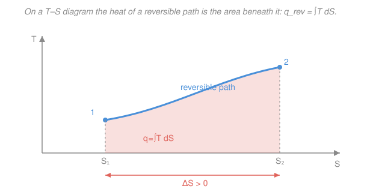

# Physical Chemistry · Lesson 1.2: Entropy and the second law

> ⏱ ~15 min · Module 1: Chemical thermodynamics · Builds on: [1.1 First law and enthalpy](01-01-first-law-enthalpy.md) · Unlocks: [1.3 Gibbs and Helmholtz energies](01-03-gibbs-helmholtz-energies.md)

## Why this matters

The first law ([1.1](01-01-first-law-enthalpy.md)) is a strict accountant: energy is conserved, nothing is created or destroyed. But it is silent on the one question chemistry actually cares about — *which way will things go?* A hot cup cools, gases mix, a battery discharges; none of the reverses violate energy conservation, yet none happen. The second law supplies the missing arrow of time, and it does so through a single new state function, **entropy** $S$. Get entropy right and you can predict spontaneity, the direction of every reaction, and — via [1.3](01-03-gibbs-helmholtz-energies.md)'s free energies — exactly how far a reaction will run before it stops.

## The idea

Drop a spoonful of dye in water and it spreads; it never spontaneously gathers back into a spoonful. Energy is unchanged either way — what changed is *how many ways the molecules can be arranged*. There are astronomically more arrangements with the dye spread out than clumped, so "spread out" is where the system drifts, simply by counting. Entropy is the bookkeeping for that count: **higher entropy = more accessible microscopic arrangements = the overwhelmingly likelier macrostate.**

The second law says this drift is relentless *for the universe as a whole*. A system can absolutely lower its own entropy (water freezes into orderly ice) — but only by dumping enough disorder into its surroundings that the **total** goes up. The universe never runs its entropy backward. To turn this into arithmetic we need a way to *measure* $\Delta S$, and the trick is heat: flowing heat into a system at temperature $T$ raises its entropy by $q/T$ — but only if you add the heat *gently* (reversibly). That one caveat is the whole subtlety of this lesson.

## The formal version

**Thermodynamic entropy.** For an infinitesimal step, entropy is defined by the heat exchanged along a **reversible** path divided by the temperature at which it flows:

$$dS = \frac{dq_\text{rev}}{T}.$$

*In words: entropy change is reversible heat per unit temperature.* Here $q_\text{rev}$ is heat (joules) added along a path slow enough to stay at equilibrium throughout, and $T$ is the absolute temperature (kelvin). The unit of $S$ is $\mathrm{J\,K^{-1}}$ (per mole, $\mathrm{J\,K^{-1}\,mol^{-1}}$).

The crucial payoff: **$S$ is a state function.** Its value depends only on the state (given by, say, $T$ and $V$), not on how you got there. So even for a violently irreversible real process, you compute $\Delta S$ by inventing *any convenient reversible path* between the same two endpoints and integrating $dq_\text{rev}/T$ along it.

**Clausius inequality.** For *any* real step, the actual heat obeys

$$dS \ge \frac{dq}{T}, \qquad \text{(equality only for a reversible step).}$$

*In words: a real process always generates at least as much entropy as its heat/temperature would suggest — and strictly more if it is irreversible.* Irreversibility (friction, finite temperature gaps, free expansion) manufactures extra entropy for free.

**The second law, in usable form.** Split the world into system + surroundings. The surroundings are a huge reservoir at fixed $T_\text{surr}$; any heat $q$ leaving the system enters them reversibly, so

$$\Delta S_\text{surr} = -\frac{q}{T_\text{surr}},$$

where $q$ is the heat *absorbed by the system* (so $-q$ is absorbed by the surroundings). The total entropy change is then

$$\boxed{\;\Delta S_\text{univ} = \Delta S_\text{sys} + \Delta S_\text{surr} \ge 0\;}$$

with equality for a reversible process and strict inequality ($>0$) for a spontaneous, irreversible one. *In words: a process is allowed only if it does not lower the entropy of the universe; if it strictly raises it, it happens on its own.*

**Three computations you must own.** Each uses a reversible path (see [1.1](01-01-first-law-enthalpy.md) for the underlying $dq$ expressions):

- **Isothermal ideal-gas expansion** ($T$ fixed, $V_1 \to V_2$). At constant $T$, $\Delta U = 0$, so $q_\text{rev} = -w_\text{rev} = \int_{V_1}^{V_2} \frac{nRT}{V}\,dV = nRT\ln\frac{V_2}{V_1}$, hence

$$\Delta S = \frac{q_\text{rev}}{T} = nR\ln\frac{V_2}{V_1}.$$

- **Heating at constant pressure** ($T_1 \to T_2$). Reversible heat is $dq_\text{rev} = nC_p\,dT$, so $\Delta S = \int_{T_1}^{T_2}\frac{nC_p}{T}\,dT$, and if $C_p$ (molar heat capacity, $\mathrm{J\,K^{-1}\,mol^{-1}}$) is roughly constant,

$$\Delta S = nC_p\ln\frac{T_2}{T_1}.$$

- **Phase change at the transition temperature** $T_\text{trs}$. The transition (melting, boiling) runs reversibly at constant $T$ and $p$, where $q_\text{rev} = \Delta H_\text{trs}$, so

$$\Delta S_\text{trs} = \frac{\Delta H_\text{trs}}{T_\text{trs}}.$$

**The microscopic bridge (Boltzmann).** All of the above is macroscopic — no atoms in sight. Statistical mechanics reveals what entropy *is*:

$$S = k_B\ln W,$$

with $k_B = 1.381\times10^{-23}\ \mathrm{J/K}$ the Boltzmann constant and $W$ the number of microstates (microscopic arrangements) consistent with the macrostate. *In words: entropy literally counts the accessible microscopic arrangements — a logarithm so that independent systems' counts multiply while their entropies add.* This is the entry point to the whole statistical-thermodynamics half of the course; see the [stat-mech](../../stat-mech/syllabus.md) course, and Module 4 here, where the partition function turns this count into every thermodynamic quantity.

**Third law.** As $T\to0$, a perfect crystal has exactly one accessible arrangement, $W=1$, so $S = k_B\ln 1 = 0$:

$$S \to 0 \quad\text{as}\quad T\to 0 \ \ (\text{perfect crystal}).$$

*In words: at absolute zero a perfectly ordered solid has zero entropy.* This fixes an absolute zero point for entropy — unlike energy, entropy has no arbitrary reference — so we can tabulate genuine **absolute entropies** $S^\circ$, not just differences.

## Picture

## Worked examples

**Example 1 (mechanical — a phase change).** How much does entropy rise when 1.00 mol of ice melts at its melting point? Fusion of water has $\Delta_\text{fus}H = 6.01\ \mathrm{kJ/mol}$ at $T_\text{fus} = 273.15\ \mathrm{K}$. Melting is reversible at that temperature, so

$$\Delta_\text{fus}S = \frac{\Delta_\text{fus}H}{T_\text{fus}} = \frac{6010\ \mathrm{J/mol}}{273.15\ \mathrm{K}} = 22.0\ \mathrm{J\,K^{-1}\,mol^{-1}}.$$

Positive, as it must be — liquid water has vastly more accessible arrangements than the locked-in ice lattice. The number is modest because melting only partly unfreezes the structure; boiling (Example in P3) liberates far more.

**Example 2 (why you'd care — the arrow of time).** A hot block at $400\ \mathrm{K}$ passes $1000\ \mathrm{J}$ of heat to a cold block at $300\ \mathrm{K}$ (both big enough that their temperatures barely change). Which way is allowed?

$$\Delta S_\text{hot} = \frac{-1000}{400} = -2.50\ \mathrm{J/K}, \qquad \Delta S_\text{cold} = \frac{+1000}{300} = +3.33\ \mathrm{J/K},$$
$$\Delta S_\text{univ} = -2.50 + 3.33 = +0.83\ \mathrm{J/K} > 0. \ \checkmark$$

The same joule of heat buys *more* entropy in the cold block (small $T$ in the denominator) than it costs in the hot one, so heat flowing hot→cold raises the universe's entropy — it happens. Run the movie backward (cold→hot) and every sign flips: $\Delta S_\text{univ} = -0.83\ \mathrm{J/K} < 0$, forbidden. The second law *is* the reason heat never spontaneously flows uphill.

## Watch out

- **You might think $\Delta S = q/T$ for any process.** It doesn't — the definition uses $q_\text{rev}$. For an irreversible step the *actual* $q$ gives only a lower bound (Clausius: $\Delta S \ge q/T$). Always compute $\Delta S_\text{sys}$ along an *invented reversible path* between the same endpoints, then get $\Delta S_\text{surr}$ from the *actual* heat exchanged.
- **You might think a system's entropy can never decrease.** It can, and routinely does (freezing, condensation, a cell building a protein). Only $\Delta S_\text{univ}$ is forbidden from decreasing — the *system's* drop is paid for by a larger *surroundings'* rise.
- **You might treat "disorder" too literally.** Entropy counts *accessible microstates*, which correlates with disorder but is really about spreading energy and matter over more available states — that's why raising $T$ (opening more energy levels) or expanding $V$ (opening more positions) raises $S$.

## One-liner

> Entropy is reversible heat over temperature — a state function counting microstates ($S=k_B\ln W$) — and the second law lets a process run only if it doesn't lower the entropy of the universe.

## Problems

**P1 (🟢)** (a) 2.00 mol of an ideal gas expands isothermally and reversibly to three times its initial volume. Find $\Delta S$. (b) Separately, 1.00 mol of liquid water ($C_{p,m} = 75.3\ \mathrm{J\,K^{-1}\,mol^{-1}}$) is heated at constant pressure from $25\,^\circ\mathrm{C}$ to $75\,^\circ\mathrm{C}$. Find $\Delta S$.

**P2 (🟡)** 2.00 mol of an ideal gas at $298\ \mathrm{K}$ undergoes a **free expansion** into a vacuum, doubling its volume, inside a rigid insulated container. Compute $\Delta S_\text{sys}$, $\Delta S_\text{surr}$, and $\Delta S_\text{univ}$, and confirm the process is irreversible.

**P3 (🔴)** Benzene boils at $T_b = 353.2\ \mathrm{K}$ with $\Delta_\text{vap}H = 30.8\ \mathrm{kJ/mol}$. Compute its entropy of vaporization $\Delta_\text{vap}S = \Delta_\text{vap}H/T_b$ and compare with **Trouton's rule** ($\Delta_\text{vap}S \approx 85\ \mathrm{J\,K^{-1}\,mol^{-1}}$ for most liquids). Water has $\Delta_\text{vap}S = 109\ \mathrm{J\,K^{-1}\,mol^{-1}}$ — why the deviation?

Solutions

**P1** (a) Isothermal ideal-gas expansion, $V_2/V_1 = 3$:
$$\Delta S = nR\ln\frac{V_2}{V_1} = (2.00)(8.314)\ln 3 = (16.63)(1.0986) = 18.3\ \mathrm{J/K}.$$
Positive — the gas spreads over more positional states.

(b) Constant-pressure heating, $T_1 = 298.15\ \mathrm{K}$, $T_2 = 348.15\ \mathrm{K}$:
$$\Delta S = nC_{p,m}\ln\frac{T_2}{T_1} = (1.00)(75.3)\ln\frac{348.15}{298.15} = (75.3)(0.1551) = 11.7\ \mathrm{J/K}.$$

*Check.* Both positive; units $\mathrm{J\,K^{-1}}$ throughout (the logs are dimensionless). ✓

**P2** Free expansion: the gas pushes against nothing, so $w = 0$; the container is insulated, so $q = 0$; hence $\Delta U = 0$ and (ideal gas) $T$ stays at $298\ \mathrm{K}$. The endpoints are therefore the *same* as an isothermal doubling, so use the reversible-path formula for the **system**:
$$\Delta S_\text{sys} = nR\ln\frac{V_2}{V_1} = (2.00)(8.314)\ln 2 = (16.63)(0.6931) = 11.5\ \mathrm{J/K}.$$
The **surroundings** exchange the *actual* heat, which is $q = 0$:
$$\Delta S_\text{surr} = -\frac{q}{T_\text{surr}} = -\frac{0}{298} = 0.$$
Therefore
$$\Delta S_\text{univ} = 11.5 + 0 = +11.5\ \mathrm{J/K} > 0.$$
Since $\Delta S_\text{univ} > 0$, the free expansion is irreversible (spontaneous and not undoable without outside work) — exactly what intuition says: gas never sucks itself back into half the box.

*Check.* Note the trap avoided: you must **not** write $\Delta S_\text{sys} = q/T = 0$. The actual heat is zero, but $S$ is a state function, so $\Delta S_\text{sys}$ is the reversible value $nR\ln 2$. The Clausius inequality is satisfied strictly: $\Delta S_\text{sys} = 11.5 > q/T = 0$. ✓

**P3** For benzene:
$$\Delta_\text{vap}S = \frac{\Delta_\text{vap}H}{T_b} = \frac{30\,800\ \mathrm{J/mol}}{353.2\ \mathrm{K}} = 87.2\ \mathrm{J\,K^{-1}\,mol^{-1}}.$$
This sits right at Trouton's $\approx 85\ \mathrm{J\,K^{-1}\,mol^{-1}}$. **Trouton's rule** works because most liquids gain about the same amount of disorder on boiling: a mole of any gas at its boiling point occupies a similar increase in accessible volume/states relative to the disordered liquid, so $\Delta_\text{vap}S$ is nearly universal.

Water's larger value ($109\ \mathrm{J\,K^{-1}\,mol^{-1}}$) signals that liquid water is *unusually ordered* — its hydrogen-bond network holds molecules in a more structured arrangement than a typical liquid. Boiling must destroy that extra order on top of the normal liquid→gas expansion, so the entropy jump is bigger. (Liquids with strong intermolecular structuring — water, alcohols — are the classic Trouton exceptions.)

*Check.* Units: $\mathrm{J/mol}\div\mathrm{K} = \mathrm{J\,K^{-1}\,mol^{-1}}$ ✓, and $\Delta_\text{vap}S \gg \Delta_\text{fus}S$ (22 J/K/mol in Example 1) as expected — vaporizing frees far more states than melting. ✓

## Connections

- **Backward:** this rests entirely on [1.1](01-01-first-law-enthalpy.md)'s heat and work — every $q_\text{rev}$ here is a first-law quantity, and the phase-change formula reuses $\Delta H_\text{trs}$ from enthalpy. The second law is the *complement* to the first: the first says how much energy, the second says which direction.
- **Forward:** [1.3 Gibbs and Helmholtz energies](01-03-gibbs-helmholtz-energies.md) folds $\Delta S_\text{univ}\ge0$ into a *system-only* criterion — $G = H - TS$ falls, sparing you from ever tracking the surroundings again — which then drives all of Module 2's phase and reaction equilibria.
- **Sideways (statistical mechanics):** $S = k_B\ln W$ is the bridge to the microscopic world. The [stat-mech](../../stat-mech/syllabus.md) course and this course's Module 4 turn that microstate count into the partition function, from which the macroscopic $\Delta S = nR\ln(V_2/V_1)$ you computed here drops out by counting positional states directly.
