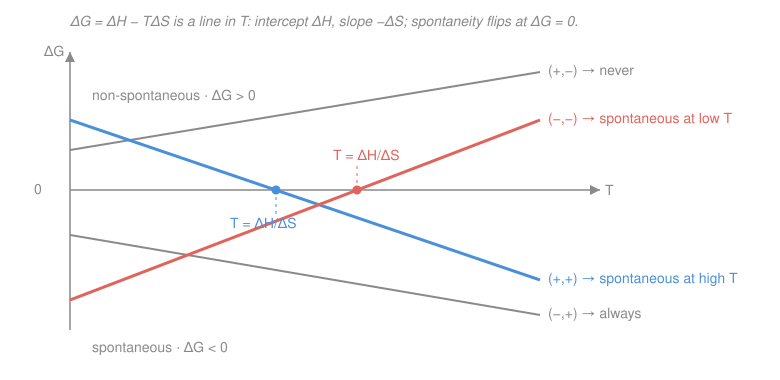

# Physical Chemistry · Lesson 1.3: Gibbs and Helmholtz energies

> ⏱ ~15 min · Module 1: Chemical thermodynamics · Builds on: [1.2 Entropy and the second law](01-02-entropy-second-law.md) · Unlocks: [1.4 Fundamental equations and Maxwell relations](01-04-fundamental-equations-maxwell-relations.md)

## Why this matters

The second law from [1.2](01-02-entropy-second-law.md) tells you a process runs on its own exactly when $\Delta S_\text{univ} \ge 0$ — but "universe" means *system plus surroundings*, and no chemist wants to track the entropy of the entire cosmos to predict whether a beaker will react. This lesson buys the ultimate convenience: a spontaneity test written **entirely in system-only quantities you can measure in that beaker**. That test is the Gibbs energy $G$, and its sign is the single most-used number in all of chemistry — it decides which way reactions go, sets equilibrium constants ([2.6](02-06-chemical-equilibrium-constant.md)), and caps the useful work a battery or fuel cell can deliver.

## The idea

Here's the move. The surroundings are a giant thermal reservoir at temperature $T$. When your system dumps heat $\Delta H$ into them at constant pressure, *their* entropy changes by $-\Delta H/T$ (they gain the heat the system loses). So the second law, $\Delta S_\text{univ} = \Delta S_\text{sys} + \Delta S_\text{surr}\ge 0$, becomes

$$\Delta S - \frac{\Delta H}{T} \ge 0.$$

Every symbol here is now a property of the **system alone**. Multiply by $-T$ (a negative, so the inequality flips) and you get $\Delta H - T\Delta S \le 0$. That combination — enthalpy minus temperature-times-entropy — is worth a name. Call it the change in **Gibbs energy**, and spontaneity is simply "$\Delta G$ is negative."

The intuition: a process is favorable if it either **releases energy** (lowers $H$) or **increases disorder** (raises $S$) — and $\Delta G = \Delta H - T\Delta S$ is exactly the scorecard that weighs those two urges against each other, with temperature $T$ setting how much the entropy term counts. Cold systems barely care about entropy; hot systems are ruled by it.

## The formal version

At **constant temperature and pressure**, define the **Gibbs energy** (units: joules, or J/mol for a molar quantity)

$$\boxed{\,G \equiv H - TS\,}, \qquad \Delta G = \Delta H - T\Delta S \quad(\text{at constant }T).$$

Here $H$ is enthalpy (J), $S$ is entropy (J/K), $T$ is absolute temperature (K). *In words: Gibbs energy is the enthalpy discounted by the amount of "entropy times temperature" the system carries.* The derivation above gives the **spontaneity criterion**:

$$\Delta G < 0 \;\Rightarrow\; \text{spontaneous (forward)}, \qquad \Delta G = 0 \;\Rightarrow\; \text{equilibrium}, \qquad \Delta G > 0 \;\Rightarrow\; \text{non-spontaneous (the reverse is spontaneous)}.$$

*In words: at constant $T,p$, systems slide "downhill" in $G$ and stop at the bottom* — the minimum of $G$ is equilibrium. Note $\Delta G \le 0$ is not a new law; it **is** $\Delta S_\text{univ}\ge 0$ in disguise, since $\Delta G = -T\,\Delta S_\text{univ}$ at constant $T,p$.

**The Helmholtz energy.** If instead you hold **temperature and volume** fixed (the natural choice for gas-phase reactions in a rigid vessel, or for theory), the heat exchanged is $\Delta U$, not $\Delta H$, and the same argument gives the **Helmholtz energy**

$$A \equiv U - TS, \qquad \Delta A = \Delta U - T\Delta S \le 0 \quad(\text{spontaneous at constant }T,V),$$

with $U$ the internal energy from [1.1](01-01-first-law-enthalpy.md). *In words: same idea, different constraint — $A$ is the constant-volume workhorse, $G$ the constant-pressure one.* Chemists live at constant pressure (open flasks), so $G$ dominates; $A$ resurfaces in statistical mechanics, where it links directly to the partition function (see [4.2](04-02-partition-functions-to-thermodynamics.md)).

**Enthalpy–entropy competition.** Because $\Delta G = \Delta H - T\Delta S$ is linear in $T$, its sign depends on the signs of $\Delta H$ and $\Delta S$:

| $\Delta H$ | $\Delta S$ | $\Delta G = \Delta H - T\Delta S$ | Spontaneous? |
|:---:|:---:|:---|:---|
| $-$ | $+$ | always $< 0$ | at **all** $T$ |
| $+$ | $-$ | always $> 0$ | at **no** $T$ |
| $-$ | $-$ | $<0$ only for small $T$ | at **low** $T$ (below $T=\Delta H/\Delta S$) |
| $+$ | $+$ | $<0$ only for large $T$ | at **high** $T$ (above $T=\Delta H/\Delta S$) |

The two mixed cases have a **crossover temperature** where $\Delta G=0$:

$$T_\text{cross} = \frac{\Delta H}{\Delta S}.$$

*In words: below/above this temperature the entropy term flips from loser to winner, and spontaneity switches.*

**Maximum non-expansion work.** There's a second, physical reading of $\Delta G$. The first law lets a process do two kinds of work: ordinary $p\Delta V$ expansion against the atmosphere, and *everything else* — electrical, mechanical, chemical (call it "non-expansion" work $w_\text{add}$). A careful accounting (constant $T,p$, reversible) gives

$$w_\text{add, max} = \Delta G.$$

*In words: the fall in Gibbs energy is the maximum useful work — beyond just pushing back the atmosphere — that a spontaneous change can deliver.* This is why a fuel cell's electrical output is set by $\Delta G$, not $\Delta H$: the electrical work per reaction extent ties to cell voltage through $w_\text{add,max} = -nFE$ (the electrochemistry link from general chemistry, [see gen-chem](../../general-chemistry/syllabus.md)).

**Standard reaction Gibbs energy.** Just as for enthalpy in [1.1](01-01-first-law-enthalpy.md), tabulate a **standard Gibbs energy of formation** $\Delta_f G^\circ$ for each compound (its $\Delta G$ of formation from elements in standard states; zero for elements), then

$$\Delta_r G^\circ = \sum_\text{products}\nu\,\Delta_f G^\circ - \sum_\text{reactants}\nu\,\Delta_f G^\circ,$$

with $\nu$ the stoichiometric coefficients. *In words: products minus reactants, weighted by how many of each.* Its sign predicts the direction at standard conditions, and next module it becomes $\Delta_r G^\circ = -RT\ln K$ — the bridge to equilibrium ([2.6](02-06-chemical-equilibrium-constant.md)).

## Picture

Each line is $\Delta G$ vs $T$: it starts at $\Delta H$ when $T=0$ and tilts with slope $-\Delta S$. The blue $(+,+)$ line starts non-spontaneous and dives below zero once $T$ is high enough; the coral $(-,-)$ line does the reverse. The two grey lines never cross — one is always favorable, one never.

## Worked examples

**Example 1 (the temperature switch).** Consider ice melting, $\ce{H2O(s) -> H2O(l)}$, with $\Delta H = +6.01\ \mathrm{kJ/mol}$ (melting absorbs heat) and $\Delta S = +22.0\ \mathrm{J\,K^{-1}\,mol^{-1}}$ (liquid is more disordered). This is the $(+,+)$ case — spontaneous only at high $T$. The crossover:

$$T_\text{cross} = \frac{\Delta H}{\Delta S} = \frac{6010\ \mathrm{J/mol}}{22.0\ \mathrm{J\,K^{-1}\,mol^{-1}}} = 273\ \mathrm{K} = 0\,^\circ\mathrm{C}.$$

The math *derives the melting point*: above $273\ \mathrm{K}$, $\Delta G<0$ and ice melts; below, $\Delta G>0$ and water freezes; exactly at $273\ \mathrm{K}$, $\Delta G=0$ and the two phases coexist. Everyday physics falling straight out of two tabulated numbers.

**Example 2 (why $\Delta G$, not $\Delta H$).** A reaction has $\Delta H = -20\ \mathrm{kJ/mol}$ (exothermic — you might guess "definitely spontaneous") but $\Delta S = -100\ \mathrm{J\,K^{-1}\,mol^{-1}}$ (it orders the system). At $T = 298\ \mathrm{K}$:

$$\Delta G = -20{,}000 - (298)(-100) = -20{,}000 + 29{,}800 = +9800\ \mathrm{J/mol} = +9.8\ \mathrm{kJ/mol}.$$

Positive — **not** spontaneous, despite releasing heat. The entropy penalty ($-T\Delta S = +29.8\ \mathrm{kJ/mol}$) outweighs the enthalpy gain. Being exothermic is neither necessary nor sufficient; only $\Delta G$ decides.

## Watch out

- **You might think "exothermic = spontaneous."** Not so — Example 2 is exothermic and non-spontaneous. That reflex confuses $\Delta H$ with $\Delta G$. Enthalpy is only *half* the scorecard; the $-T\Delta S$ term can override it, especially at high $T$.
- **You might forget the unit mismatch.** $\Delta H$ is tabulated in kJ/mol but $\Delta S$ in **J**$\,\mathrm{K^{-1}\,mol^{-1}}$. Convert one before combining, or your $\Delta G$ is off by 1000×. (In Example 2, $\Delta S = -0.100\ \mathrm{kJ\,K^{-1}\,mol^{-1}}$.)
- **You might read $\Delta G>0$ as "nothing happens."** It means the forward reaction is non-spontaneous — but the **reverse** is spontaneous ($\Delta G_\text{rev} = -\Delta G < 0$). A positive $\Delta G$ is a green light pointing backward.
- **$\Delta G$ is the *maximum* work, only reached reversibly.** Any real (irreversible) process delivers *less* than $|\Delta G|$; the shortfall is lost as extra heat. $\Delta G$ is a ceiling, not a guarantee.

## One-liner

> $\Delta G = \Delta H - T\Delta S$ repackages "the universe's entropy must rise" into a system-only test — negative means go, zero means equilibrium — and its magnitude is the most useful work you can extract.

## Problems

**P1 (🟢)** For the thermal decomposition $\ce{CaCO3(s) -> CaO(s) + CO2(g)}$, $\Delta H^\circ = +178.3\ \mathrm{kJ/mol}$ and $\Delta S^\circ = +160.2\ \mathrm{J\,K^{-1}\,mol^{-1}}$. (a) Compute $\Delta G^\circ$ at $298\ \mathrm{K}$ and state whether it is spontaneous. (b) Find the crossover temperature above which it becomes spontaneous.

**P2 (🟡)** For $\ce{N2O4(g) <=> 2NO2(g)}$, the standard Gibbs energies of formation are $\Delta_f G^\circ(\ce{NO2}) = +51.3\ \mathrm{kJ/mol}$ and $\Delta_f G^\circ(\ce{N2O4}) = +97.9\ \mathrm{kJ/mol}$. Compute $\Delta_r G^\circ$ and predict which direction is favored at standard conditions.

**P3 (🔴)** The fuel-cell reaction $\ce{H2(g) + 1/2 O2(g) -> H2O(l)}$ has $\Delta H^\circ = -285.8\ \mathrm{kJ/mol}$ and $\Delta G^\circ = -237.1\ \mathrm{kJ/mol}$ at $298\ \mathrm{K}$. (a) What is the maximum electrical (non-expansion) work per mole of $\ce{H2}$? (b) It runs a cell with $n=2$ electrons transferred; find the standard cell voltage from $w_\text{add,max} = -nFE$, with $F = 96485\ \mathrm{C/mol}$. (c) Why is the extractable work $237.1$ and not $285.8\ \mathrm{kJ/mol}$ — and what does that say about using $\Delta G$ rather than $\Delta H$ to judge spontaneity?

Solutions

**P1** (a) Convert $\Delta S^\circ = 0.1602\ \mathrm{kJ\,K^{-1}\,mol^{-1}}$, then at $298\ \mathrm{K}$:

$$\Delta G^\circ = \Delta H^\circ - T\Delta S^\circ = 178.3 - (298)(0.1602) = 178.3 - 47.7 = +130.6\ \mathrm{kJ/mol}.$$

Positive, so decomposition is **non-spontaneous** at room temperature — limestone is stable, as observed. (b) The crossover is where $\Delta G^\circ = 0$:

$$T_\text{cross} = \frac{\Delta H^\circ}{\Delta S^\circ} = \frac{178{,}300\ \mathrm{J/mol}}{160.2\ \mathrm{J\,K^{-1}\,mol^{-1}}} = 1113\ \mathrm{K} \approx 840\,^\circ\mathrm{C}.$$

Above $\approx 1113\ \mathrm{K}$ the $(+,+)$ line drops below zero and calcining runs — matching the real kiln temperatures used to make lime. *Check:* $(+,+)$ signs ⇒ spontaneous at high $T$, consistent. ✓

**P2** Using $\Delta_r G^\circ = \sum\nu\,\Delta_f G^\circ$ (products minus reactants), with 2 mol $\ce{NO2}$ produced from 1 mol $\ce{N2O4}$:

$$\Delta_r G^\circ = 2\,\Delta_f G^\circ(\ce{NO2}) - \Delta_f G^\circ(\ce{N2O4}) = 2(51.3) - 97.9 = 102.6 - 97.9 = +4.7\ \mathrm{kJ/mol}.$$

$\Delta_r G^\circ > 0$, so the **forward** reaction (dissociation to $\ce{NO2}$) is non-spontaneous at standard conditions; the **reverse** (dimerization to $\ce{N2O4}$) is favored. *Check:* it's a close call ($+4.7\ \mathrm{kJ/mol}$), which is why this equilibrium sits in the middle and shifts visibly with temperature — foreshadowing van 't Hoff in [2.7](02-07-shifting-equilibria-van-t-hoff.md). ✓

**P3** (a) At constant $T,p$ the maximum non-expansion work equals $\Delta G^\circ$:

$$w_\text{add,max} = \Delta G^\circ = -237.1\ \mathrm{kJ/mol},$$

i.e. the cell can deliver up to $237.1\ \mathrm{kJ}$ of electrical work per mole of $\ce{H2}$ (the sign says energy leaves the system).

(b) From $w_\text{add,max} = -nFE$, so $\Delta G^\circ = -nFE$ and

$$E = -\frac{\Delta G^\circ}{nF} = -\frac{-237{,}100\ \mathrm{J/mol}}{(2)(96485\ \mathrm{C/mol})} = \frac{237{,}100}{192{,}970} = 1.23\ \mathrm{V}.$$

That's the textbook standard hydrogen fuel-cell potential. *Check:* $\mathrm{J/C = V}$ ✓.

(c) The enthalpy $285.8\ \mathrm{kJ/mol}$ is the *total* energy released, but the reaction's entropy drops ($\Delta S^\circ = (\Delta H^\circ-\Delta G^\circ)/T = (-285.8+237.1)/298 = -0.163\ \mathrm{kJ\,K^{-1}\,mol^{-1}} = -163\ \mathrm{J\,K^{-1}\,mol^{-1}}$, since 1.5 mol of gas becomes 1 mol of liquid). Feeding the surroundings the entropy this order-up demands costs $T|\Delta S^\circ| = 48.7\ \mathrm{kJ/mol}$, which **must** leave as waste heat and can never be captured as work. Only the remaining $237.1\ \mathrm{kJ/mol}$ — the Gibbs energy — is *free* to do work. Spontaneity and useful work track $\Delta G$ because it already bundles in the entropy cost ($\Delta G = -T\Delta S_\text{univ}$); $\Delta H$ ignores it and so can point the wrong way. ✓

## Flashback

**From Lesson 1.2 (Entropy and the second law):** 2.00 mol of an ideal gas expands **isothermally and reversibly** at $300\ \mathrm{K}$ from $5.00\ \mathrm{L}$ to $15.00\ \mathrm{L}$. Compute the entropy change of the gas, $\Delta S$. (Fresh variant — new numbers, same isothermal-expansion idea.)

Solution

For an isothermal ideal-gas volume change, $\Delta S = nR\ln(V_2/V_1)$ (temperature-independent term drops out; only the volume ratio matters):

$$\Delta S = (2.00)(8.314)\ln\!\frac{15.00}{5.00} = (16.63)\ln 3 = (16.63)(1.0986) = +18.3\ \mathrm{J/K}.$$

*Check:* the gas spreads into more volume, so its entropy **rises** ($\Delta S>0$) ✓, and units are $\mathrm{mol}\cdot\mathrm{J\,K^{-1}\,mol^{-1}} = \mathrm{J/K}$ ✓. Because the process is reversible and isothermal, this also equals $q_\text{rev}/T$ — the definition of entropy change you'd use in the $\Delta S - \Delta H/T$ bookkeeping that opened this lesson.

## Connections

- **Backward:** this lesson is nothing but [1.2](01-02-entropy-second-law.md)'s $\Delta S_\text{univ}\ge 0$ rewritten in system variables via $\Delta S_\text{surr} = -\Delta H/T$; the enthalpy $\Delta H$ comes from [1.1](01-01-first-law-enthalpy.md), and $A = U - TS$ reuses the internal energy $U$ from that same lesson.
- **Forward:** [1.4](01-04-fundamental-equations-maxwell-relations.md) turns $G$ and $A$ into the differentials $dG = -S\,dT + V\,dp$ and $dA = -S\,dT - p\,dV$, unlocking the Maxwell relations; [1.5](01-05-chemical-potential.md) makes $G$ a function of composition (the chemical potential $\mu$); and [2.6](02-06-chemical-equilibrium-constant.md) turns $\Delta_r G^\circ$ into the equilibrium constant through $\Delta_r G^\circ = -RT\ln K$.
- **Sideways:** the "$\Delta G$ caps the useful work" idea is the thermodynamics behind electrochemical cells ($\Delta G = -nFE$) — the same free-energy accounting a physicist meets as the Helmholtz free energy from the partition function ([4.2](04-02-partition-functions-to-thermodynamics.md)) and as [thermodynamics](../../thermodynamics-physics/syllabus.md)'s free-energy potentials.
