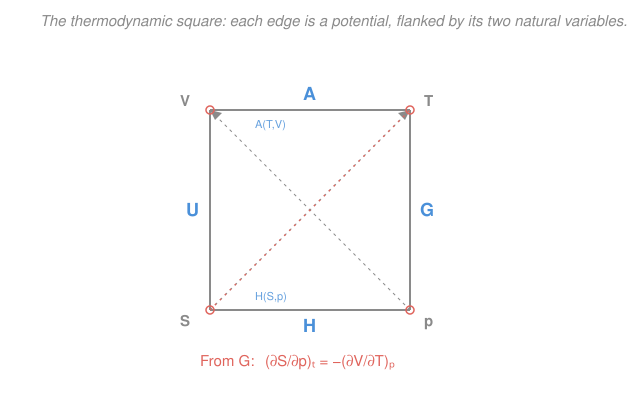

# Physical Chemistry · Lesson 1.4: Fundamental equations and Maxwell relations

> ⏱ ~15 min · Module 1: Chemical thermodynamics · Builds on: [1.3 Gibbs and Helmholtz energies](01-03-gibbs-helmholtz-energies.md) · Unlocks: [1.5 The chemical potential](01-05-chemical-potential.md)

## Why this matters

Some things you want to know about a substance you simply *cannot put a probe on*. How does entropy change when you squeeze a gas at constant temperature? There is no "entropy meter." But there **is** a device that measures how much a substance expands when you warm it — a thermometer and a ruler. The magic of this lesson is a set of exact identities, the **Maxwell relations**, that let you trade the derivative you can't measure for one you can. They fall out, for free, from a single fact: the thermodynamic potentials $U$, $H$, $A$, $G$ are *state functions*, so their differentials are exact. This is the machinery behind half of [Boss Problem 1](../syllabus.md) and behind why an ideal gas's energy doesn't care about its volume.

## The idea

In [1.3](01-03-gibbs-helmholtz-energies.md) we met four energies. Each one has a "natural" pair of variables it likes to be written in — the pair that makes its differential clean. $U$ likes entropy and volume; $G$ likes temperature and pressure. Write a potential in its natural variables and its differential has a beautiful form: the coefficients sitting in front of the two $d$'s are *exactly* the properties $T$, $p$, $S$, $V$. So the first derivatives of the potentials just hand you the state of the system — no work required.

Now the second idea. A well-behaved surface doesn't care which way you walk across it: climb east-then-north or north-then-east, you end at the same height. In calculus this is "mixed partial derivatives are equal." Apply it to a potential's differential and you get a startling identity linking *four different* thermodynamic quantities. That's a Maxwell relation. It says the way $S$ responds to pressure is locked to the way $V$ responds to temperature — two things that sound unrelated but are secretly the same number. The whole point is conversion: turn an unmeasurable slope into measurable ones.

## The formal version

**The fundamental relation.** Combine the first law $dU = \delta q + \delta w$ with, for a *reversible* change, $\delta q_{\text{rev}} = T\,dS$ (the entropy definition from [1.2](01-02-entropy-second-law.md)) and $\delta w_{\text{rev}} = -p\,dV$:

$$\boxed{\,dU = T\,dS - p\,dV\,}$$

*In words: the internal energy of a closed system changes by a heat-like term $T\,dS$ and a work-like term $-p\,dV$.* Although we built it from a reversible path, every term is a state function, so **the identity holds for any change** between the same endpoints — that is its power.

**Natural variables and the other three potentials.** The form of $dU$ shows $U$ is naturally a function of $S$ and $V$: $U(S,V)$. The other potentials are **Legendre transforms** — you add back a $pV$ or subtract a $TS$ to swap which variable is "natural." Each one just re-shuffles $dU$:

| Potential | Definition | Differential | Natural variables |
|---|---|---|---|
| Internal energy $U$ | — | $dU = T\,dS - p\,dV$ | $U(S,V)$ |
| Enthalpy $H$ | $H = U + pV$ | $dH = T\,dS + V\,dp$ | $H(S,p)$ |
| Helmholtz $A$ | $A = U - TS$ | $dA = -S\,dT - p\,dV$ | $A(T,V)$ |
| Gibbs $G$ | $G = U + pV - TS$ | $dG = -S\,dT + V\,dp$ | $G(T,p)$ |

Each differential is one line of algebra — e.g. $dG = dU + p\,dV + V\,dp - T\,dS - S\,dT = (T\,dS - p\,dV) + p\,dV + V\,dp - T\,dS - S\,dT = -S\,dT + V\,dp$. *In words: pick the variables you actually control — for a beaker on a bench that's $T$ and $p$, so $G$ is your potential.*

**First derivatives, read straight off.** Because (say) $dG = -S\,dT + V\,dp$ and also $dG = \left(\frac{\partial G}{\partial T}\right)_p dT + \left(\frac{\partial G}{\partial p}\right)_T dp$, matching coefficients gives

$$\left(\frac{\partial G}{\partial T}\right)_p = -S, \qquad \left(\frac{\partial G}{\partial p}\right)_T = V.$$

*In words: the slope of the Gibbs energy along temperature is minus the entropy; along pressure it is the volume.* The same coefficient-matching on the other rows gives $\left(\tfrac{\partial U}{\partial S}\right)_V = T$, $\left(\tfrac{\partial U}{\partial V}\right)_S = -p$, $\left(\tfrac{\partial A}{\partial T}\right)_V = -S$, $\left(\tfrac{\partial A}{\partial V}\right)_T = -p$, and so on.

**Maxwell relations.** For any exact differential $df = M\,dx + N\,dy$, the mixed second partials of $f$ are equal, so $\left(\frac{\partial M}{\partial y}\right)_x = \left(\frac{\partial N}{\partial x}\right)_y$. Apply this to each potential:

$$\text{(from } U\text{)}\quad \left(\frac{\partial T}{\partial V}\right)_S = -\left(\frac{\partial p}{\partial S}\right)_V, \qquad \text{(from } H\text{)}\quad \left(\frac{\partial T}{\partial p}\right)_S = \left(\frac{\partial V}{\partial S}\right)_p,$$

$$\text{(from } A\text{)}\quad \boxed{\left(\frac{\partial S}{\partial V}\right)_T = \left(\frac{\partial p}{\partial T}\right)_V}, \qquad \text{(from } G\text{)}\quad \boxed{\left(\frac{\partial S}{\partial p}\right)_T = -\left(\frac{\partial V}{\partial T}\right)_p}.$$

*In words on the last one: however entropy responds to squeezing (left, unmeasurable) equals minus however volume responds to warming (right, a thermometer-and-ruler experiment).* The two boxed relations are the workhorses because their left sides contain $S$ — the quantity you can never probe directly — and their right sides are pure mechanical (p–V–T) measurements.

**Thermodynamic equation of state.** Start from $dU = T\,dS - p\,dV$, hold $T$ fixed, and divide by $dV$: $\left(\frac{\partial U}{\partial V}\right)_T = T\left(\frac{\partial S}{\partial V}\right)_T - p$. Now substitute the $A$-Maxwell relation $\left(\frac{\partial S}{\partial V}\right)_T = \left(\frac{\partial p}{\partial T}\right)_V$:

$$\boxed{\left(\frac{\partial U}{\partial V}\right)_T = T\left(\frac{\partial p}{\partial T}\right)_V - p}$$

*In words: the "internal pressure" — how energy changes as you pull molecules apart at fixed $T$ — is computable from the equation of state alone.* For an ideal gas $p = nRT/V$, so $\left(\tfrac{\partial p}{\partial T}\right)_V = nR/V = p/T$, and the right side is $T(p/T) - p = 0$. The ideal-gas energy is **volume-independent** — a purely mechanical fact, no calorimetry needed.

## Picture

The square is a memory aid: write the four variables at the corners ($V,T,S,p$) and each potential sits on the edge between *its* two natural variables — $A$ between $V$ and $T$, $G$ between $T$ and $p$, and so on. The corners then read out the Maxwell relations; the coral diagonal shows the $G$ one pairing the bottom edge's $(S,p)$ slope against the top edge's $(V,T)$ slope.

## Worked examples

**Example 1 (read off a differential).** Given $dH = T\,dS + V\,dp$, find $\left(\frac{\partial H}{\partial S}\right)_p$ and the enthalpy's Maxwell relation. Coefficient-matching against $dH = \left(\tfrac{\partial H}{\partial S}\right)_p dS + \left(\tfrac{\partial H}{\partial p}\right)_S dp$ gives $\left(\frac{\partial H}{\partial S}\right)_p = T$ and $\left(\frac{\partial H}{\partial p}\right)_S = V$. Here $M = T$ (partner of $S$) and $N = V$ (partner of $p$), so exactness gives $\left(\frac{\partial T}{\partial p}\right)_S = \left(\frac{\partial V}{\partial S}\right)_p$. Every step is bookkeeping.

**Example 2 (why you'd care — the isothermal entropy of compression).** You want $\Delta S$ when 1 mol of a gas is compressed isothermally, but you can't measure $\left(\frac{\partial S}{\partial p}\right)_T$. Use the $G$-Maxwell relation to convert it: $\left(\frac{\partial S}{\partial p}\right)_T = -\left(\frac{\partial V}{\partial T}\right)_p$. For an ideal gas $V = RT/p$, so $\left(\frac{\partial V}{\partial T}\right)_p = R/p$, giving $\left(\frac{\partial S}{\partial p}\right)_T = -R/p$. Integrating from $p_1$ to $p_2$ at constant $T$:

$$\Delta S = \int_{p_1}^{p_2} \left(-\frac{R}{p}\right) dp = -R\ln\frac{p_2}{p_1}.$$

Compress from 1 to 10 bar: $\Delta S = -R\ln 10 = -(8.314)(2.303) = -19.1\ \mathrm{J\,K^{-1}\,mol^{-1}}$. Entropy drops — squeezing orders the gas — and we got it from a ruler-and-thermometer quantity, never touching an "entropy meter." (This is the $\Delta S$ piece of Boss Problem 1.)

## Watch out

- **You might think $dU = T\,dS - p\,dV$ only holds for reversible changes** because we derived it that way. But every symbol is a state function, so it holds for *any* path between the endpoints — you just can't identify $T\,dS$ with the actual heat unless the path is reversible.
- **You might drop the subscript on a partial derivative.** $\left(\frac{\partial G}{\partial T}\right)_p$ and $\left(\frac{\partial G}{\partial T}\right)_V$ are different numbers. The held-constant variable is part of the definition — always the *other* natural variable.
- **You might lose the minus sign in the $G$-Maxwell relation.** It comes from the $-S$ in $dG = -S\,dT + V\,dp$: the coefficient of $dT$ is $-S$, so the cross-derivative carries that sign. The $A$-relation has no sign because its two coefficients ($-S$ and $-p$) share it and it cancels.

## One-liner

> Write a potential in its natural variables; its first derivatives *are* the state properties, and equality of its mixed second partials *is* a Maxwell relation that trades an unmeasurable entropy slope for a measurable p–V–T one.

## Problems

**P1 (🟢)** From the Helmholtz differential $dA = -S\,dT - p\,dV$, read off the two first-derivative relations for $A$.

**P2 (🟡)** Derive the Maxwell relation that comes from the Helmholtz energy $A$ by equating its mixed second partial derivatives. State which unmeasurable quantity it makes measurable.

**P3 (🔴, Boss-1 rehearsal)** Starting from $G$, prove $\left(\frac{\partial S}{\partial p}\right)_T = -\left(\frac{\partial V}{\partial T}\right)_p$. Then, using $dH = T\,dS + V\,dp$ and the ideal-gas law, show that $\left(\frac{\partial H}{\partial p}\right)_T = 0$ for an ideal gas.

Solutions

**P1** Compare $dA = -S\,dT - p\,dV$ with the chain-rule form $dA = \left(\tfrac{\partial A}{\partial T}\right)_V dT + \left(\tfrac{\partial A}{\partial V}\right)_T dV$. Matching the coefficients of $dT$ and $dV$:

$$\left(\frac{\partial A}{\partial T}\right)_V = -S, \qquad \left(\frac{\partial A}{\partial V}\right)_T = -p.$$

*Check.* Both have the right units and signs: $A$ falls as $T$ rises (entropy term) and as $V$ rises against pressure. ✓

**P2** Write $dA = M\,dT + N\,dV$ with $M = -S$ (partner of $T$) and $N = -p$ (partner of $V$). Because $A$ is a state function its differential is exact, so the mixed second partials are equal:

$$\frac{\partial}{\partial V}\left(\frac{\partial A}{\partial T}\right) = \frac{\partial}{\partial T}\left(\frac{\partial A}{\partial V}\right) \;\Longrightarrow\; \left(\frac{\partial M}{\partial V}\right)_T = \left(\frac{\partial N}{\partial T}\right)_V \;\Longrightarrow\; \left(\frac{\partial(-S)}{\partial V}\right)_T = \left(\frac{\partial(-p)}{\partial T}\right)_V.$$

The two minus signs cancel:

$$\boxed{\left(\frac{\partial S}{\partial V}\right)_T = \left(\frac{\partial p}{\partial T}\right)_V.}$$

It converts the **unmeasurable** $\left(\tfrac{\partial S}{\partial V}\right)_T$ (how entropy responds to expansion at fixed $T$) into $\left(\tfrac{\partial p}{\partial T}\right)_V$, which is pure p–V–T data (the isochoric pressure–temperature slope). *Check.* For an ideal gas the right side is $nR/V > 0$: expanding a gas raises its entropy, as it must. ✓

**P3** *Part 1 — the Maxwell relation.* From $dG = -S\,dT + V\,dp$, identify $M = -S$ (partner of $T$) and $N = V$ (partner of $p$). Exactness of $dG$ gives

$$\left(\frac{\partial(-S)}{\partial p}\right)_T = \left(\frac{\partial V}{\partial T}\right)_p \;\Longrightarrow\; \left(\frac{\partial S}{\partial p}\right)_T = -\left(\frac{\partial V}{\partial T}\right)_p. \qquad\checkmark$$

*Part 2 — apply it to $H$.* Hold $T$ fixed in $dH = T\,dS + V\,dp$ and divide by $dp$:

$$\left(\frac{\partial H}{\partial p}\right)_T = T\left(\frac{\partial S}{\partial p}\right)_T + V.$$

Substitute the relation just proved, $\left(\tfrac{\partial S}{\partial p}\right)_T = -\left(\tfrac{\partial V}{\partial T}\right)_p$:

$$\left(\frac{\partial H}{\partial p}\right)_T = -T\left(\frac{\partial V}{\partial T}\right)_p + V.$$

For an ideal gas $V = nRT/p$, so $\left(\frac{\partial V}{\partial T}\right)_p = \frac{nR}{p} = \frac{V}{T}$. Then

$$\left(\frac{\partial H}{\partial p}\right)_T = -T\cdot\frac{V}{T} + V = -V + V = 0. \qquad\boxed{0}$$

*In words:* an ideal gas's enthalpy — like its internal energy — depends only on temperature, never on pressure. *Check.* Same structure as the thermodynamic equation of state for $U$, and both give exactly zero because the ideal gas has no intermolecular forces. ✓

## Flashback

**From Lesson 1.3 (Gibbs and Helmholtz energies):** A reaction has $\Delta H^\circ = +40.0\ \mathrm{kJ/mol}$ and $\Delta S^\circ = +120\ \mathrm{J\,K^{-1}\,mol^{-1}}$, both roughly temperature-independent. Is it spontaneous at $298\ \mathrm{K}$? Above what temperature does it become spontaneous? (Fresh variant — new numbers.)

Solution

Spontaneity at constant $T,p$ is governed by $\Delta G = \Delta H - T\Delta S < 0$. At $298\ \mathrm{K}$ (converting $\Delta S$ to kJ: $0.120\ \mathrm{kJ\,K^{-1}\,mol^{-1}}$):

$$\Delta G = 40.0 - (298)(0.120) = 40.0 - 35.76 = +4.24\ \mathrm{kJ/mol} > 0,$$

so it is **not** spontaneous at $298\ \mathrm{K}$. The crossover is where $\Delta G = 0$:

$$T = \frac{\Delta H}{\Delta S} = \frac{40\,000\ \mathrm{J/mol}}{120\ \mathrm{J\,K^{-1}\,mol^{-1}}} = 333\ \mathrm{K}.$$

Above $\approx 333\ \mathrm{K}$ the $-T\Delta S$ term wins and $\Delta G < 0$: entropy-driven and endothermic, so heating turns it on. *Check.* Both $\Delta H$ and $\Delta S$ positive is the classic "spontaneous only when hot" case (e.g. thermal decompositions). ✓

## Connections

- **Backward:** the four potentials and their Legendre-transform definitions come straight from [1.3](01-03-gibbs-helmholtz-energies.md); the $T\,dS$ term in the fundamental relation is the entropy definition $\delta q_{\text{rev}} = T\,dS$ from [1.2](01-02-entropy-second-law.md). The exactness argument is nothing but equality of mixed partials from multivariable calculus.
- **Forward:** [1.5](01-05-chemical-potential.md) adds a composition term $\sum_i \mu_i\,dn_i$ to $dG$, extending this whole framework to reacting mixtures; [2.2](02-02-clapeyron-clausius-clapeyron.md) applies $\left(\tfrac{\partial G}{\partial p}\right)_T = V$ and $\left(\tfrac{\partial G}{\partial T}\right)_p = -S$ across a phase boundary to derive the Clapeyron equation. This is also the toolkit for [Boss Problem 1](../syllabus.md).
- **Sideways:** the Legendre transform that swaps $U(S,V)$ for $G(T,p)$ is the *same* operation that turns the Lagrangian into the Hamiltonian in classical mechanics — see the [thermodynamics-physics](../../thermodynamics-physics/syllabus.md) treatment. In [Module 4](04-02-partition-functions-to-thermodynamics.md), statistical mechanics will *derive* $A = -k_BT\ln Q$ from the partition function, giving these potentials a microscopic origin.
