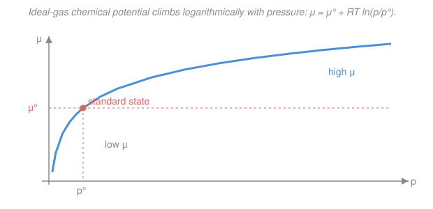

# Physical Chemistry · Lesson 1.5: The chemical potential

> ⏱ ~15 min · Module 1: Chemical thermodynamics · Builds on: [1.4 Fundamental equations and Maxwell relations](01-04-fundamental-equations-maxwell-relations.md) · Unlocks: [1.6 Fugacity and activity](01-06-fugacity-activity.md)

## Why this matters

Everything so far has treated a sample as a fixed lump of matter: heat it, squeeze it, watch $G$ change with $T$ and $p$. But chemistry is about matter *moving and reacting* — a drop evaporating, salt dissolving, $\ce{N2O4}$ cracking into $\ce{NO2}$. The moment the amount of a species can change, $dG = -S\,dT + V\,dp$ is missing a term. This lesson supplies it, and the coefficient of that new term — the **chemical potential** $\mu_i$ — turns out to be *the* master quantity of all of Module 2. Phase equilibrium, reaction equilibrium, colligative properties, and the whole equilibrium constant are one idea in disguise: **at equilibrium, $\mu_i$ is equal everywhere**.

## The idea

Temperature tells you which way *heat* flows: from hot to cold, until temperatures match. Chemical potential is the exact analogue for *matter*: it tells you which way a substance flows — from high $\mu$ to low $\mu$, until the potentials match. A gas rushes into a vacuum, water diffuses from fresh to salty across a membrane, a solute spreads from concentrated to dilute — every one of these is matter sliding "downhill" in $\mu$.

Where does $\mu_i$ come from? Think of building a solution one spoonful at a time. Add a mole of sugar to a nearly-pure water bath and the Gibbs energy changes by some amount; add a mole to an already-sweet syrup and it changes by a *different* amount. The chemical potential is that per-mole change in $G$ at the current composition — the "Gibbs price" of one more mole of species $i$, holding $T$, $p$, and every *other* species fixed. Because it depends on how much is already there, $\mu_i$ carries all the information about crowding, mixing, and concentration that a bulk quantity like total $G$ hides.

The magic is that "flows downhill in $\mu$" and "spontaneous means $dG < 0$ at constant $T,p$" (Lesson 1.3) are the *same statement*. Moving $dn$ of matter from a region of high $\mu$ to one of low $\mu$ lowers $G$ — so it happens on its own.

## The formal version

**The missing variable.** $G$ depends not just on $T$ and $p$ but on the amounts $n_1, n_2, \dots$ of each species. Writing the total differential with composition included:

$$dG = \left(\frac{\partial G}{\partial T}\right)_{p,n}dT + \left(\frac{\partial G}{\partial p}\right)_{T,n}dp + \sum_i \left(\frac{\partial G}{\partial n_i}\right)_{T,p,n_{j\neq i}}dn_i.$$

The first two coefficients are the old $-S$ and $V$ from [1.4](01-04-fundamental-equations-maxwell-relations.md). The new one gets a name.

**Chemical potential.** For species $i$,

$$\boxed{\;\mu_i \equiv \left(\frac{\partial G}{\partial n_i}\right)_{T,p,\,n_{j\neq i}}\;}$$

*In words: $\mu_i$ is the rate at which the Gibbs energy rises as you add species $i$, keeping temperature, pressure, and all other amounts fixed — the Gibbs energy per mole of $i$ added.* Its units are $\mathrm{J\,mol^{-1}}$.

This is one example of a **partial molar quantity**: for any extensive property $X$ (volume, enthalpy, entropy…), the partial molar $X$ of species $i$ is $\bar X_i = (\partial X/\partial n_i)_{T,p,n_{j\neq i}}$. The partial molar *volume* $\bar V_i$, for instance, is how much the total volume grows per mole of $i$ added — and it can even be *negative* (add $\ce{MgSO4}$ to water and the volume shrinks, because ions organize the water tightly around them). Chemical potential is simply the partial molar *Gibbs energy*, $\mu_i = \bar G_i$, and it is the one that governs spontaneity.

**The full fundamental equation.** Substituting the three coefficients back:

$$\boxed{\;dG = -S\,dT + V\,dp + \sum_i \mu_i\,dn_i\;}$$

*In words: the Gibbs energy changes when you heat it, squeeze it, or change what's in it.* At fixed $T$ and $p$ the first two terms vanish and $dG = \sum_i \mu_i\,dn_i$ — so the direction of spontaneous composition change ($dG<0$) is exactly "matter moves to lower $\mu$."

**Equilibrium condition.** If a species $i$ can move between two phases $\alpha$ and $\beta$ (say liquid and gas), transferring $dn$ moles changes $G$ by $(\mu_i^\beta - \mu_i^\alpha)\,dn$. Spontaneous transfer continues until this is zero for every possible move:

$$\mu_i^\alpha = \mu_i^\beta \quad(\text{for each species } i, \text{ across all phases}).$$

*In words: at equilibrium a species has the same chemical potential in every phase it can reach* — the flat-potential condition, just like equal temperature at thermal equilibrium. This one line is the engine of all of Module 2.

**Chemical potential of a pure ideal gas.** For a pure substance, $G = n\mu$, so $\mu = G/n = G_m$, the molar Gibbs energy. From the fundamental equation at constant $T$ (and $n$), $dG = V\,dp$, so per mole $(\partial \mu/\partial p)_T = V_m$. For an ideal gas $V_m = RT/p$:

$$\left(\frac{\partial \mu}{\partial p}\right)_T = \frac{RT}{p}.$$

Integrate from a **standard pressure** $p^\circ$ (by convention $1\ \mathrm{bar}$), where $\mu = \mu^\circ(T)$, up to pressure $p$:

$$\int_{\mu^\circ}^{\mu} d\mu = RT\int_{p^\circ}^{p}\frac{dp'}{p'} \;\Longrightarrow\; \boxed{\;\mu = \mu^\circ + RT\ln\frac{p}{p^\circ}\;}$$

*In words: an ideal gas's chemical potential is its standard value plus a logarithmic pressure correction* — compress it (raise $p$) and $\mu$ rises, so squeezed gas is "eager" to expand into anywhere at lower $\mu$. Here $\mu^\circ(T)$ is the chemical potential at $1\ \mathrm{bar}$; it depends on temperature but not pressure.

**A component in an ideal-gas mixture.** Each gas behaves as if the others weren't there, feeling only its own **partial pressure** $p_i = x_i p$ (with $x_i$ the mole fraction and $p$ the total pressure). So

$$\mu_i = \mu_i^\circ + RT\ln\frac{p_i}{p^\circ}.$$

*In words: each gas in a mixture keeps the same formula, using its own partial pressure.* Since $p_i < p$, mixing lowers each component's $\mu$ — which is exactly why gases mix spontaneously (Problem 3).

**Gibbs–Duhem relation (one line).** The $\mu_i$ aren't all independent. Because $G = \sum_i n_i\mu_i$ at constant $T,p$, differentiating and comparing with $dG=\sum_i\mu_i\,dn_i$ forces

$$\sum_i n_i\,d\mu_i = 0 \quad (\text{constant } T,p).$$

*In words: if one component's chemical potential goes up, another's must come down* — you can't tune all the $\mu_i$ freely at fixed $T,p$.

## Picture

The curve rises without bound but ever more slowly — a hallmark of the logarithm. It crosses the standard value $\mu^\circ$ exactly at $p=p^\circ$ (where $\ln 1 = 0$), and dips *below* $\mu^\circ$ for $p<p^\circ$. Matter always drifts toward the low-$\mu$ end.

## Worked examples

**Example 1 (mechanical — the pressure correction).** By how much does the chemical potential of an ideal gas change when it is compressed from $2\ \mathrm{bar}$ to $8\ \mathrm{bar}$ at $300\ \mathrm{K}$? The standard-state term cancels in a *difference*:

$$\Delta\mu = \mu(p_2)-\mu(p_1) = RT\ln\frac{p_2}{p_1} = (8.314)(300)\ln\frac{8}{2} = 2494.2 \times 1.3863 = 3458\ \mathrm{J\,mol^{-1}} \approx +3.46\ \mathrm{kJ/mol}.$$

Positive: compressing raises $\mu$, so the gas would flow (expand) toward any region at lower pressure. Note $p^\circ$ never appeared — only the *ratio* of pressures matters.

**Example 2 (why you'd care — which way does it evaporate?).** Liquid water sits under its own vapor at $298\ \mathrm{K}$. The two phases are in equilibrium only when $\mu_{\text{gas}} = \mu_{\text{liq}}$, which happens at the vapor pressure $p^* = 0.0317\ \mathrm{bar}$. Suppose instead the vapor is held at just $p = 0.010\ \mathrm{bar}$ (dry air). Which way does matter go? Since the liquid's $\mu$ equals the gas value *at* $p^*$, compare the gas at the two pressures:

$$\mu_{\text{gas}} - \mu_{\text{liq}} = RT\ln\frac{p}{p^*} = (8.314)(298)\ln\frac{0.010}{0.0317} = 2477.6\times(-1.154) = -2.86\ \mathrm{kJ/mol}.$$

The gas sits *lower* in $\mu$ than the liquid, so water flows liquid $\to$ gas: it **evaporates**, and keeps evaporating until the partial pressure climbs back to $p^*$ and the potentials match. Dry air drives evaporation — quantified.

## Watch out

- **You might think $\mu_i = G/n_i$.** Only for a *pure* substance, where $\mu = G_m$. In a mixture $\mu_i$ is a *partial* derivative at fixed other amounts, not a simple ratio — adding $i$ also rearranges everything else, and $\mu_i$ captures that.
- **You might take $\ln p$ of a pressure with units.** The argument is the dimensionless ratio $p/p^\circ$. Writing $RT\ln p$ is only shorthand valid when $p$ is already in units of $p^\circ=1\ \mathrm{bar}$; keep the ratio explicit or you'll misplace factors.
- **$\mu^\circ$ is not "$\mu$ at zero pressure."** It's $\mu$ at the *standard* pressure $1\ \mathrm{bar}$. As $p\to 0$, $\ln(p/p^\circ)\to-\infty$ and $\mu\to-\infty$ — an infinitely dilute gas has an infinitely favorable potential to expand into, which is why vacuums fill.

## One-liner

> Chemical potential $\mu_i=(\partial G/\partial n_i)_{T,p,n_{j\ne i}}$ is the Gibbs price of one more mole — matter flows from high $\mu$ to low $\mu$, and equilibrium is $\mu_i$ equal across every phase.

## Problems

**P1 (🟢)** One mole of an ideal gas is compressed isothermally from $1\ \mathrm{bar}$ to $10\ \mathrm{bar}$ at $298\ \mathrm{K}$. Find the change in its chemical potential $\Delta\mu$.

**P2 (🟡)** A pure liquid is in contact with its vapor. State the equilibrium condition relating $\mu_{\text{liq}}$ and $\mu_{\text{gas}}$. Then, if the vapor's chemical potential is measured to be *higher* than the liquid's, predict which way matter flows and name the process. Illustrate: for a substance with vapor pressure $p^*=0.50\ \mathrm{bar}$ at some $T=350\ \mathrm{K}$, is the vapor above or below $\mu_{\text{liq}}$ when the actual pressure is $p=1.2\ \mathrm{bar}$? Compute $\mu_{\text{gas}}-\mu_{\text{liq}}$.

**P3 (🔴)** Two ideal gases A and B, each initially pure at pressure $p$ and temperature $T$ with amounts $n_A$ and $n_B$, are allowed to mix at constant $T$ and total pressure $p$. Using chemical potentials, show that

$$\Delta_{\text{mix}}G = nRT\sum_i x_i\ln x_i < 0,$$

where $n=n_A+n_B$ and $x_i$ are mole fractions, and argue that $\Delta_{\text{mix}}S>0$. Evaluate both for equal amounts ($x_A=x_B=\tfrac12$) per mole of total gas at $298\ \mathrm{K}$.

Solutions

**P1** The standard-state term cancels in the difference, leaving the pressure ratio:

$$\Delta\mu = RT\ln\frac{p_2}{p_1} = (8.314)(298)\ln\frac{10}{1} = 2477.6 \times 2.3026 = 5705\ \mathrm{J\,mol^{-1}} \approx +5.71\ \mathrm{kJ/mol}.$$

*Check.* Positive, as compression must raise $\mu$; and a tenfold squeeze giving a few $\mathrm{kJ/mol}$ is the right size (comparable to $RT\approx 2.5\ \mathrm{kJ/mol}$ times $\ln 10$). ✓

**P2** Equilibrium requires the chemical potential be equal in the two phases the molecule can move between:

$$\mu_{\text{liq}} = \mu_{\text{gas}}.$$

If instead $\mu_{\text{gas}} > \mu_{\text{liq}}$, matter flows from high to low $\mu$, i.e. gas $\to$ liquid: the vapor **condenses**. For the numbers, the liquid's potential equals the gas value at the vapor pressure $p^*$, so

$$\mu_{\text{gas}}(p) - \mu_{\text{liq}} = \mu_{\text{gas}}(p) - \mu_{\text{gas}}(p^*) = RT\ln\frac{p}{p^*} = (8.314)(350)\ln\frac{1.2}{0.50}.$$

$$= 2909.9 \times \ln(2.4) = 2909.9 \times 0.8755 = +2548\ \mathrm{J\,mol^{-1}} \approx +2.55\ \mathrm{kJ/mol}.$$

Positive, so $\mu_{\text{gas}} > \mu_{\text{liq}}$: the vapor is *above* the liquid in potential and **condenses** — which makes sense, since $p=1.2\ \mathrm{bar}$ exceeds the vapor pressure $0.50\ \mathrm{bar}$, i.e. the gas is supersaturated. ✓

**P3** Before mixing, each gas is pure at pressure $p$:

$$\mu_i^{\text{before}} = \mu_i^\circ + RT\ln\frac{p}{p^\circ}.$$

After mixing at the same total pressure $p$, gas $i$ has partial pressure $p_i = x_i p$, so

$$\mu_i^{\text{after}} = \mu_i^\circ + RT\ln\frac{x_i p}{p^\circ} = \mu_i^\circ + RT\ln\frac{p}{p^\circ} + RT\ln x_i.$$

The change per mole of $i$ is therefore $\Delta\mu_i = RT\ln x_i$. Summing over all species with $n_i = x_i n$ moles each:

$$\Delta_{\text{mix}}G = \sum_i n_i\,\Delta\mu_i = \sum_i n_i RT\ln x_i = nRT\sum_i x_i\ln x_i.$$

Every $x_i$ satisfies $0<x_i<1$, so $\ln x_i<0$ and the whole sum is negative: $\Delta_{\text{mix}}G<0$, mixing is spontaneous at constant $T,p$. For the entropy, use $S = -(\partial G/\partial T)_p$ (Lesson [1.4](01-04-fundamental-equations-maxwell-relations.md)) applied to the mixing change; since the $x_i$ carry no $T$-dependence,

$$\Delta_{\text{mix}}S = -\left(\frac{\partial \Delta_{\text{mix}}G}{\partial T}\right)_{p} = -nR\sum_i x_i\ln x_i > 0.$$

Positive — mixing spreads each gas over more volume, raising entropy, and (with $\Delta_{\text{mix}}H=0$ for ideal gases) that entropy gain *is* the entire driving force.

For equal amounts, $x_A=x_B=\tfrac12$, per mole of total gas ($n=1$) at $298\ \mathrm{K}$:

$$\Delta_{\text{mix}}G = RT\left(\tfrac12\ln\tfrac12+\tfrac12\ln\tfrac12\right) = RT\ln\tfrac12 = (8.314)(298)(-0.6931) = -1717\ \mathrm{J\,mol^{-1}} \approx -1.72\ \mathrm{kJ/mol}.$$

$$\Delta_{\text{mix}}S = -R\ln\tfrac12 = +R\ln 2 = (8.314)(0.6931) = +5.76\ \mathrm{J\,K^{-1}\,mol^{-1}}.$$

*Check.* $\Delta_{\text{mix}}G = \Delta_{\text{mix}}H - T\Delta_{\text{mix}}S = 0 - (298)(5.76) = -1717\ \mathrm{J/mol}$ ✓ — the two computed numbers are consistent, and both point to spontaneous mixing. ✓

## Flashback

**From Lesson 1.4 (Fundamental equations and Maxwell relations):** Starting from the Gibbs fundamental equation $dG = -S\,dT + V\,dp$ (fixed composition), derive the Maxwell relation connecting $(\partial S/\partial p)_T$ to a volume derivative, and evaluate both sides for one mole of ideal gas. (Fresh variant — a different Maxwell relation than the $A$-based one.)

Solution

$dG$ is an exact differential, so its mixed second partials are equal (Euler / equality of cross-derivatives). Reading off $-S = (\partial G/\partial T)_p$ and $V = (\partial G/\partial p)_T$:

$$\left(\frac{\partial(-S)}{\partial p}\right)_T = \left(\frac{\partial V}{\partial T}\right)_p \;\Longrightarrow\; \boxed{\left(\frac{\partial S}{\partial p}\right)_T = -\left(\frac{\partial V}{\partial T}\right)_p.}$$

For one mole of ideal gas $V = RT/p$, so $(\partial V/\partial T)_p = R/p$, giving

$$\left(\frac{\partial S}{\partial p}\right)_T = -\frac{R}{p}.$$

*Check.* The sign is right: raising the pressure at fixed temperature compresses the gas into fewer accessible microstates, so entropy falls — $(\partial S/\partial p)_T<0$. Integrating, $\Delta S = -R\ln(p_2/p_1)$ for isothermal pressure change, the familiar ideal-gas result. ✓ This is the same machinery that turned $(\partial\mu/\partial p)_T = V_m$ into the $RT\ln(p/p^\circ)$ law in this lesson.

## Connections

- **Backward:** $\mu_i$ is the composition-term the fundamental equation of [1.4](01-04-fundamental-equations-maxwell-relations.md) was missing, and its "flows to lower $\mu$" rule is just [1.3](01-03-gibbs-helmholtz-energies.md)'s "$dG<0$ at constant $T,p$" specialized to matter transfer. The $\mu = \mu^\circ + RT\ln(p/p^\circ)$ law reuses the ideal-gas law from general chemistry ([gases and the ideal gas law](../../general-chemistry/lessons/03-01-gases-ideal-gas-law-kinetic-theory.md)).
- **Forward:** the flat-potential condition $\mu_i^\alpha=\mu_i^\beta$ drives *everything* in Module 2 — phase boundaries ([2.1](02-01-phase-stability-one-component-diagrams.md)), the Clapeyron equation ([2.2](02-02-clapeyron-clausius-clapeyron.md)), Raoult's law ([2.3](02-03-ideal-solutions-raoult-henry.md)), and the equilibrium constant ([2.6](02-06-chemical-equilibrium-constant.md)). Immediately next, [1.6](01-06-fugacity-activity.md) generalizes the logarithmic law to *real* gases and solutions by replacing $p/p^\circ$ with fugacity and activity, keeping the form $\mu = \mu^\circ + RT\ln a$.
- **Sideways:** the mixing result $\Delta_{\text{mix}}S = -nR\sum_i x_i\ln x_i$ is the thermodynamic face of the statistical [Boltzmann entropy](../../stat-mech/syllabus.md) — the $x_i\ln x_i$ sum is exactly the information-theoretic entropy of a probability distribution, the bridge from counting microstates to $\mu$.
