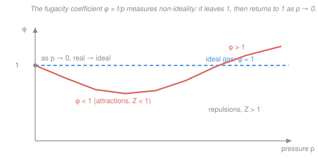

# Physical Chemistry · Lesson 1.6: Real substances — fugacity and activity

> ⏱ ~15 min · Module 1: Chemical thermodynamics · Builds on: [1.5 Chemical potential](01-05-chemical-potential.md) · Unlocks: [2.1 Phase stability and one-component diagrams](02-01-phase-stability-one-component-diagrams.md)

## Why this matters

In [1.5](01-05-chemical-potential.md) you got the workhorse formula for how a substance's chemical potential responds to pressure or dilution: $\mu = \mu^{\circ} + RT\ln(p/p^{\circ})$ for a gas, and the same log-of-composition shape for a solute. It's beautiful — but it's a lie you tell about ideal systems. Real gases attract each other; real solutions are crowded and interacting. The entire elegant apparatus of Module 2 — phase diagrams, boiling points, equilibrium constants — is built on $\mu$, so if the $\mu$ formula is wrong for real matter, everything downstream is wrong too. This lesson is the patch, and it's the last brick in Module 1's foundation. The trick is almost embarrassingly cheap: **keep the log, swap the variable.**

## The idea

Here's the move. The ideal formula says $\mu$ grows like the logarithm of pressure. Nature says: not quite — but *almost*, and the deviation is smooth and well-behaved. So instead of rewriting the physics, we invent a new **effective pressure** that makes the ideal formula come out exactly right. Call it the **fugacity** $f$ (Latin *fugere*, "to flee" — an "escaping tendency"). It's the pressure a real gas *pretends* to have so that the clean equation still holds:

$$\mu = \mu^{\circ} + RT\ln\!\frac{f}{p^{\circ}}.$$

If the gas is nearly ideal, $f$ is nearly the true pressure $p$. The ratio $\phi = f/p$ (the **fugacity coefficient**) is the entire fudge — one dimensionless number that packages all the non-ideality. When intermolecular attractions make the gas "less eager to escape" than an ideal gas would be, $\phi < 1$; when repulsions dominate at high pressure, $\phi > 1$. At low pressure the molecules are so far apart they barely notice each other, and $\phi \to 1$: real becomes ideal.

The identical idea rescues solutions. For a solute we'd like $\mu = \mu^{\circ} + RT\ln x$ (mole fraction $x$), but interactions spoil it. So we define the **activity** $a$ — the "effective concentration" — via

$$\mu = \mu^{\circ} + RT\ln a,$$

and measure the spoilage with the **activity coefficient** $\gamma = a/x$, which $\to 1$ in the ideal-dilute limit. Same philosophy, same payoff: one number absorbs reality, and the formula never changes shape.

## The formal version

**Fugacity.** For a real gas the chemical potential is *defined* by

$$\mu(T,p) = \mu^{\circ}(T) + RT\ln\!\frac{f}{p^{\circ}}, \qquad f = \phi\,p, \qquad \lim_{p\to 0}\phi = 1.$$

*In words: $f$ is whatever number makes the ideal-gas formula exact for a real gas; the fugacity coefficient $\phi$ is the ratio of that effective pressure to the true pressure, and it must approach 1 as the gas thins out.* Here $\mu^{\circ}$ is the standard chemical potential of the **ideal gas at the standard pressure** $p^{\circ} = 1\ \mathrm{bar}$ (a hypothetical ideal reference, not the real gas at 1 bar). The correction to the ideal chemical potential is exactly

$$\mu_{\text{real}} - \mu_{\text{ideal}} = RT\ln\frac{f}{p} = RT\ln\phi.$$

**Activity.** For any condensed phase or solution component,

$$\mu_i = \mu_i^{\circ} + RT\ln a_i, \qquad a_i = \gamma_i\,x_i \quad(\text{or } \gamma_i\, c_i/c^{\circ}), \qquad \gamma_i \to 1 \text{ in the ideal limit.}$$

*In words: activity is effective concentration, $\gamma$ is the correction factor, and $a$ replaces mole fraction (or concentration) everywhere the ideal theory used it.* The activity is **dimensionless** — always a ratio to a standard state — which is why $\ln a$ is legal.

**Standard states (the reference you measure from).** Because $\mu = \mu^{\circ} + RT\ln a$, the value of $a$ only means something once you fix $\mu^{\circ}$, i.e. the state where $a \equiv 1$:

| Phase | Standard state ($a = 1$) | $\gamma \to 1$ when… |
|---|---|---|
| Gas | ideal gas at $p^{\circ} = 1\ \mathrm{bar}$ | $p \to 0$ |
| Pure liquid/solid | the pure substance, $\mu_i^{*}$ | $x_i \to 1$ (**Raoult** reference) |
| Solvent | pure solvent | $x \to 1$ (**Raoult**) |
| Solute | hypothetical $1\ \mathrm{mol/L}$ (or $1\ \mathrm{molal}$) ideal solution | $x \to 0$ (**Henry** reference) |

*In words: a solvent is "ideal" when nearly pure; a solute is "ideal" when nearly infinitely dilute — two different reference points, Raoult's law vs Henry's law, which you'll meet head-on in [2.3](02-03-ideal-solutions-raoult-henry.md).*

**Where non-ideality comes from — the $Z$ bridge.** The fugacity coefficient is tied directly to the **compression factor** $Z = pV_m/RT$ (which measures how far $pV_m$ strays from the ideal $RT$; $Z=1$ is ideal):

$$\ln\phi = \int_0^{p}\frac{Z-1}{p'}\,\mathrm{d}p'.$$

*In words: $\phi$ is the running total of the gas's deviation from ideality, integrated up from zero pressure.* Attractions pull $Z$ below 1 and drag $\phi$ below 1; repulsions (crowding at high $p$) push both above 1. Same molecular physics — the intermolecular potential — surfaces in both $Z$ (from the equation of state) and $\phi$ (in the chemical potential).

## Picture

## Worked examples

**Example 1 (fugacity is just a corrected pressure).** Nitrogen at $T = 298\ \mathrm{K}$, $p = 100\ \mathrm{bar}$ has $\phi = 0.72$. Its fugacity is $f = \phi p = 0.72 \times 100 = 72\ \mathrm{bar}$ — it behaves, thermodynamically, like an ideal gas at 72 bar, not 100. The chemical potential correction relative to pretending it's ideal:

$$RT\ln\phi = (8.314)(298)\ln(0.72) = (2477.6)(-0.3285) = -814\ \mathrm{J/mol} \approx -0.81\ \mathrm{kJ/mol}.$$

Attractions make the real gas *more stable* (lower $\mu$) than the ideal formula predicts — exactly the sign you'd expect when molecules like each other.

**Example 2 (activity in a real solution).** A solute at mole fraction $x = 0.10$ has $\gamma = 0.85$. Its activity is $a = \gamma x = 0.85 \times 0.10 = 0.085$ — it acts like an ideal solute at "concentration" 0.085, slightly less than its actual 0.10. The chemical potential sits below the ideal prediction by

$$\mu_{\text{real}} - \mu_{\text{ideal}} = RT\ln\gamma = (2477.6)\ln(0.85) = -403\ \mathrm{J/mol} \approx -0.40\ \mathrm{kJ/mol}.$$

Whenever $\gamma < 1$ the species is "happier" (more stable) than ideal theory says — favorable interactions with its surroundings.

## Watch out

- **You might think $f$ and $a$ are new physics.** They aren't — they're *bookkeeping*. Every hard fact about a real substance lives in $\phi$ or $\gamma$; fugacity and activity just let you reuse the ideal equations verbatim. The physics is in the coefficient, not the effective variable.
- **You might think the gas standard state is "the real gas at 1 bar."** It's the *hypothetical ideal* gas at 1 bar. That's what lets $\mu^{\circ}$ stay a clean, pressure-free reference; the real gas's non-ideality is carried entirely by $\phi$, never smuggled into $\mu^{\circ}$.
- **You might think one $\gamma \to 1$ rule fits all.** Solvent and solute use *different* reference states (Raoult vs Henry). A solute's $\gamma \to 1$ as it gets **infinitely dilute**, not as it gets pure — mix these up and your activities come out referenced to the wrong zero.
- **Don't put units in a logarithm.** $a$, $\phi$, and $f/p^{\circ}$ are all dimensionless ratios by construction. If you ever find yourself taking $\ln$ of "72 bar," you dropped a $p^{\circ}$.

## One-liner

> Keep the elegant log formula; replace the ideal variable ($p$ or $x$) with an effective one ($f = \phi p$ or $a = \gamma x$) — where $\phi,\gamma \to 1$ recovers ideality and all the non-ideal physics hides in a single coefficient.

## Problems

**P1 (🟢)** Carbon dioxide at $T = 298\ \mathrm{K}$ and $p = 50\ \mathrm{bar}$ has a fugacity coefficient $\phi = 0.80$. Find its fugacity $f$, and compute the chemical-potential correction $RT\ln\phi$ (in kJ/mol) relative to treating it as ideal. Is the real gas more or less stable than the ideal prediction?

**P2 (🟡)** In a real liquid mixture a component has mole fraction $x = 0.30$ and activity coefficient $\gamma = 1.25$ at $298\ \mathrm{K}$. Compute its activity $a$, and the deviation $\mu_{\text{real}} - \mu_{\text{ideal}}$ (in kJ/mol). Does $\gamma > 1$ make this component more or less stable than ideal, and what does that say physically about its interactions?

**P3 (🔴)** (a) Using $\ln\phi = \int_0^{p}\frac{Z-1}{p'}\mathrm{d}p'$, argue that $\phi \to 1$ as $p \to 0$ for any real gas. (b) A gas has $\phi = 0.95$ at $T = 298\ \mathrm{K}$. Compute the fugacity correction $RT\ln\phi$. (c) If this gas sits at $p = 10\ \mathrm{bar}$ (with $p^{\circ} = 1\ \mathrm{bar}$), what percentage of the ideal pressure term $RT\ln(p/p^{\circ})$ is that correction? Comment on when the ideal-gas approximation is safe.

Solutions

**P1** Fugacity: $f = \phi p = 0.80 \times 50 = 40\ \mathrm{bar}$ — it acts like an ideal gas at 40 bar. Correction:

$$RT\ln\phi = (8.314)(298)\ln(0.80) = (2477.6)(-0.22314) = -553\ \mathrm{J/mol} \approx -0.55\ \mathrm{kJ/mol}.$$

The correction is **negative**, so the real gas is *more stable* (lower $\mu$) than the ideal formula predicts — consistent with $\phi<1$ signalling dominant intermolecular attractions.

*Check.* $\ln(0.80)<0$ and $RT>0$, so the sign is negative as claimed; magnitude ~0.5 kJ/mol is a modest but real correction at 50 bar. ✓

**P2** Activity: $a = \gamma x = 1.25 \times 0.30 = 0.375$. Deviation:

$$\mu_{\text{real}} - \mu_{\text{ideal}} = RT\ln\gamma = (2477.6)\ln(1.25) = (2477.6)(0.22314) = +553\ \mathrm{J/mol} \approx +0.55\ \mathrm{kJ/mol}.$$

Here $\gamma > 1$ gives a **positive** deviation, so the component is *less stable* (higher $\mu$) than ideal — it has a greater escaping tendency. Physically, $\gamma>1$ means unfavorable interactions with its neighbors: the component "would rather leave," a positive deviation from Raoult's law (think oil reluctantly mixed with water).

*Check.* $a = 0.375 > x = 0.30$ as required for $\gamma>1$; and $RT\ln\gamma$ has the same magnitude as P1's $RT\ln(0.80)$ but opposite sign, since $\ln 1.25 = -\ln 0.80$. ✓

**P3** (a) As $p \to 0$ the upper limit of the integral shrinks to zero, and the integrand $(Z-1)/p'$ stays finite (a real gas becomes ideal as it thins, so $Z\to 1$ and $Z-1\to 0$ smoothly). An integral over a vanishing interval of a finite integrand is 0, so $\ln\phi \to 0$, i.e. $\phi \to 1$. Every gas is ideal in the zero-pressure limit.

(b) $RT\ln\phi = (2477.6)\ln(0.95) = (2477.6)(-0.051293) = -127\ \mathrm{J/mol} \approx -0.13\ \mathrm{kJ/mol}.$

(c) Ideal pressure term at $p=10\ \mathrm{bar}$, $p^{\circ}=1\ \mathrm{bar}$:

$$RT\ln\frac{p}{p^{\circ}} = (2477.6)\ln(10) = (2477.6)(2.3026) = 5705\ \mathrm{J/mol}.$$

Fraction: $|{-127}|/5705 = 0.0223$, about **2.2%**. So a 5% deviation of $\phi$ from 1 shifts the pressure-dependent part of $\mu$ by only ~2%. The ideal-gas approximation is safe whenever $\phi$ is close to 1 — low pressure, high temperature, and gases far from condensation — and grows unreliable near high pressure or the critical region, where $Z$ (and $\phi$) depart strongly from 1.

*Check.* $\ln(0.95)\approx -0.0513$ and $\ln 10 \approx 2.303$; ratio $0.0513/2.303 \approx 0.022$, matching 2.2%. ✓

## Flashback

**From Lesson 1.5 (Chemical potential):** An ideal gas at $T = 298\ \mathrm{K}$ is compressed isothermally from $p_1 = 1\ \mathrm{bar}$ to $p_2 = 5\ \mathrm{bar}$. By how much does its molar chemical potential change? (Fresh variant — compute $\Delta\mu$ for a pressure change, treating the gas as ideal.)

Solution

For an ideal gas $\mu = \mu^{\circ} + RT\ln(p/p^{\circ})$, so the standard state and $p^{\circ}$ cancel in a difference:

$$\Delta\mu = RT\ln\frac{p_2}{p_1} = (8.314)(298)\ln\frac{5}{1} = (2477.6)(1.6094) = +3988\ \mathrm{J/mol} \approx +3.99\ \mathrm{kJ/mol}.$$

Compressing raises the chemical potential — squeezed into less volume, the gas's escaping tendency (and $\mu$) goes up. This is exactly the term fugacity refines: for a *real* gas you'd replace $p_2/p_1$ with $f_2/f_1 = (\phi_2 p_2)/(\phi_1 p_1)$.

*Check.* $\ln 5 \approx 1.609$; sign positive because $p_2>p_1$; magnitude a few kJ/mol is typical for a five-fold isothermal compression. ✓

## Connections

- **Backward:** this directly patches [1.5](01-05-chemical-potential.md)'s ideal $\mu = \mu^{\circ} + RT\ln(p/p^{\circ})$ — same equation, effective variable — and the compression-factor bridge reaches back to the real-gas equations of state from [general chemistry](../../general-chemistry/lessons/03-01-gases-ideal-gas-law-kinetic-theory.md) (where $Z \ne 1$ first signalled non-ideality).
- **Forward:** every formula in Module 2 is secretly written in activities. Phase equilibria ([2.1](02-01-phase-stability-one-component-diagrams.md)), Raoult vs Henry references ([2.3](02-03-ideal-solutions-raoult-henry.md)), and the "thermodynamic" equilibrium constant $K = \prod a_i^{\nu_i}$ ([2.6](02-06-chemical-equilibrium-constant.md)) all reduce to their familiar pressure/mole-fraction forms only when $\phi,\gamma \to 1$. This refines the gen-chem equilibrium constant from [3.4/equilibrium](../../general-chemistry/lessons/03-04-chemical-equilibrium-k-le-chatelier.md) with activities.
- **Sideways (stat mech):** the molecular origin of $\phi$ and $\gamma$ — the intermolecular potential — is exactly what the configurational partition function integrates over; the [stat-mech](../../stat-mech/syllabus.md) machinery derives equation-of-state deviations ($Z-1$) from first principles, closing the loop back to $\phi$.
