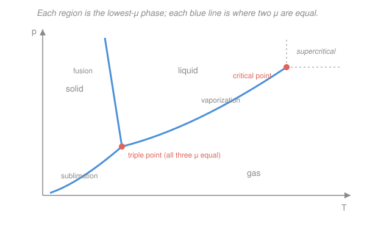

# Physical Chemistry · Lesson 2.1: Phase stability and one-component phase diagrams

> ⏱ ~15 min · Module 2: Phase equilibria, reactions, and solutions · Builds on: [1.5 Chemical potential](01-05-chemical-potential.md), [1.6 Fugacity and activity](01-06-fugacity-activity.md) · Unlocks: [2.2 Clapeyron and Clausius–Clapeyron](02-02-clapeyron-clausius-clapeyron.md)

## Why this matters

Water freezes at 0 °C, boils at 100 °C, and does neither at the top of Everest where it boils around 70 °C. Ice skates glide, dry ice sublimes without puddling, and CO₂ becomes a "supercritical fluid" that decaffeinates coffee. Every one of those facts is a single reading off one chart — the **phase diagram**. And the whole chart follows from one idea you already own from [1.5](01-05-chemical-potential.md): a system sits in whichever phase has the **lowest chemical potential** $\mu$. This lesson turns that one-line criterion into the familiar map of solid, liquid, and gas, and hands you the two derivatives that explain its every slope.

## The idea

Think of $\mu$ (the molar Gibbs energy of a pure substance — its "escaping tendency" per mole from [1.5](01-05-chemical-potential.md)) as an **altitude**: matter rolls downhill to the phase with the lowest $\mu$. At any given temperature $T$ and pressure $p$, all three phases *have* a chemical potential; you just see whichever one is lowest. Change $T$ or $p$ and the three altitudes shift by different amounts, so the winner can change — that's a phase transition.

A phase **boundary** is the special ridge where two phases are exactly tied, $\mu_\alpha = \mu_\beta$: neither wins, so both are present at once — **coexistence**. A p–T diagram is nothing more than a map colored by "which $\mu$ is lowest here," with the tie-lines drawn in. Two of these ties can meet at a single point where *three* phases are simultaneously tied — the **triple point**. And one boundary, the liquid–gas line, simply *ends*: past the **critical point** the liquid and gas become indistinguishable, and the concept of a boundary dissolves.

## The formal version

**Stability criterion.** At fixed $T$ and $p$, the stable phase is the one minimizing the molar Gibbs energy, i.e. the chemical potential $\mu$ (units $\mathrm{J/mol}$). *In words: of all the phases on offer, you observe the cheapest one.* A boundary between phases $\alpha$ and $\beta$ is the locus

$$\mu_\alpha(T,p) = \mu_\beta(T,p).$$

*In words: a coexistence line is the set of $(T,p)$ where two phases are exactly tied in escaping tendency.*

**How $\mu$ moves.** For a pure substance $\mu = G_m$, so the fundamental relation $dG = -S\,dT + V\,dp$ from [1.4](01-04-fundamental-equations-maxwell-relations.md), taken per mole, gives the two derivatives that drive everything:

$$\left(\frac{\partial \mu}{\partial T}\right)_p = -S_m, \qquad \left(\frac{\partial \mu}{\partial p}\right)_T = V_m.$$

Here $S_m$ is the molar entropy ($\mathrm{J\,K^{-1}\,mol^{-1}}$) and $V_m$ the molar volume ($\mathrm{m^3/mol}$). *In words: heating a phase lowers its $\mu$ at a rate set by its disorder; squeezing it raises its $\mu$ at a rate set by its bulk.* Two consequences do all the work:

- Since $S_m > 0$ always, **$\mu$ always falls as $T$ rises** — and it falls *fastest* for the most disordered phase, because $S_g > S_l > S_s$. So as you heat a substance the gas's $\mu$ plunges past the liquid's, which has already plunged past the solid's: the winning phase marches $\text{solid} \to \text{liquid} \to \text{gas}$. That single inequality is *why* heating melts then boils.
- Since $V_m > 0$, **$\mu$ always rises with $p$** — most steeply for the gas ($V_g \gg V_l \gtrsim V_s$). Squeezing therefore punishes the gas hardest and favors the condensed phases: pressure liquefies and solidifies.

**Gibbs phase rule.** The number of intensive variables you can tune freely while keeping the same set of phases present is

$$F = C - P + 2,$$

with $C$ the number of independent chemical **components**, $P$ the number of coexisting **phases**, and $F$ the **degrees of freedom** (variance). *In words: start with $C-1$ composition variables plus $T$ and $p$ — that's $C+1$ knobs — and every coexistence equation $\mu_\alpha=\mu_\beta$ removes one.* (The "$+2$" is exactly $T$ and $p$.) For a **pure substance**, $C = 1$, so $F = 3 - P$:

| Phases present $P$ | $F = 3-P$ | Geometry on the diagram |
|---|---|---|
| 1 (e.g. just liquid) | 2 | an **area** — vary $T$ and $p$ independently |
| 2 (coexistence) | 1 | a **line** — pick $T$ and $p$ follows |
| 3 (triple point) | 0 | a **point** — fixed $T$ and $p$, no freedom |

This is why the diagram *has* to look the way it does: two-dimensional regions, one-dimensional lines, zero-dimensional points. Four phases of a pure substance ($F=-1$) is impossible — you can't over-constrain the two knobs.

## Picture

The three areas are single-phase ($F=2$). The three blue lines are two-phase coexistence ($F=1$): **fusion** (solid–liquid), **vaporization** (liquid–gas), **sublimation** (solid–gas). They meet at the **triple point** ($F=0$), the one $(T,p)$ where all three coexist. The vaporization line terminates at the **critical point**; beyond it lies a single supercritical fluid. Note the fusion line here leans slightly *left* (negative slope) — the water anomaly, explained in P3.

## Worked examples

**Example 1 (read the map — an isobaric heating).** Take water at a fixed pressure of 1 atm and heat it from −20 °C. On the diagram you move **horizontally to the right** along an isobar. Starting in the solid region, you first cross the **fusion** line at 0 °C: for the instant you're on that line, $\mu_s = \mu_l$, solid and liquid coexist ($F=1$), and all the added heat goes into melting at constant $T$ (the latent heat). Continue right through the liquid region, then cross the **vaporization** line at 100 °C ($\mu_l = \mu_g$), where it boils. The flat "melting" and "boiling" plateaus on a heating curve are exactly the moments your isobar sits *on* a coexistence line.

**Example 2 (the phase rule saves you from a wrong count).** Suppose someone claims they've prepared pure water with solid, liquid, and gas all coexisting, and that they can dial it to any temperature they like at that condition. Impossible: for $C=1$, three phases give $F = 3 - 3 = 0$. The triple point of water is pinned at $T = 273.16\ \mathrm{K}$ and $p = 611\ \mathrm{Pa}$ — no freedom at all. (This is so reproducible that the kelvin was long *defined* by it.) If instead only liquid and gas coexist, $F = 1$: you may choose the temperature, but then the pressure is forced to be the vapor pressure at that $T$ — a curve, not a free area.

## Watch out

- **You might think a boundary line means "no phase there."** It's the opposite: on a line *both* neighboring phases are present, tied at equal $\mu$. Inside an area only *one* phase exists.
- **You might read "degrees of freedom" as the number of variables.** $F$ counts the *freely adjustable* ones after the coexistence constraints. Two phases of a pure substance still involve both $T$ and $p$ — but they're locked together, so only $F=1$ of them is yours to pick.
- **You might expect every fusion line to slope right.** Usually yes (solid denser than liquid). Water is the famous exception: ice is *less* dense than liquid water, so its fusion line slopes *left* — raising pressure *melts* ice. That is the sign of $V_m$ across melting talking, previewed here and made quantitative by Clapeyron in [2.2](02-02-clapeyron-clausius-clapeyron.md).

## One-liner

> A p–T phase diagram is a map of which phase has the lowest $\mu$; boundaries are ties ($\mu_\alpha=\mu_\beta$), and Gibbs' $F = C-P+2$ forces the map to be areas, lines, and a triple point.

## Problems

**P1 (🟢)** On the diagram above, a sample sits at a temperature and pressure inside the **liquid** region. (a) Which phase do you observe, and how many degrees of freedom does it have? (b) You now *lower* the pressure at fixed temperature (move straight down). Which boundary do you cross, and what phase transition occurs as you cross it?

**P2 (🟡)** For a pure substance, use the Gibbs phase rule to find $F$ when (a) one phase is present, (b) two phases coexist, (c) three phases coexist. State what each answer means geometrically on a p–T diagram, and explain why four coexisting phases of a pure substance cannot occur.

**P3 (🔴)** Using only $\left(\partial \mu/\partial T\right)_p = -S_m$: (a) explain why raising $T$ at fixed $p$ drives a substance solid → liquid → gas rather than some other order. (b) The Clapeyron slope of a boundary can be written $\dfrac{dp}{dT} = \dfrac{\Delta S_m}{\Delta V_m}$ for the transition crossing it. Given that melting is always endothermic ($\Delta S_m > 0$ for solid → liquid) but ice is *less* dense than liquid water, deduce the sign of the water fusion line's slope.

Solutions

**P1** (a) You observe a single phase, **liquid**. With $C=1$, $P=1$: $F = 1 - 1 + 2 = 2$ — two degrees of freedom, consistent with being inside a two-dimensional *area* where $T$ and $p$ can each be varied independently without leaving the liquid region.

(b) Moving straight down means decreasing $p$ at fixed $T$. Below the liquid you cross the **vaporization** line (the liquid–gas boundary). Crossing it, $\mu_l = \mu_g$ momentarily (coexistence), and the liquid **vaporizes** to gas: lowering the pressure boils the liquid. (This is why water boils at a lower temperature on a mountaintop — the ambient pressure is lower, so the vaporization line is crossed sooner.)

**P2** With $C=1$, the rule gives $F = 1 - P + 2 = 3 - P$.
- (a) $P=1$: $F = 2$. Geometrically an **area** — a two-dimensional region; both $T$ and $p$ are free.
- (b) $P=2$: $F = 1$. A **line** — one-dimensional coexistence; choose $T$ and $p$ is determined (or vice versa).
- (c) $P=3$: $F = 0$. A **point** — the triple point; $T$ and $p$ are both fixed, nothing is adjustable.

Four phases would need $F = 3 - 4 = -1 < 0$. A negative variance is meaningless: it would require more independent coexistence constraints ($\mu_\alpha = \mu_\beta = \cdots$) than there are variables ($T,p$) to satisfy them, so the equations are generally inconsistent. Hence at most three phases of a pure substance coexist.

**P3** (a) At fixed $p$, each phase's chemical potential obeys $\left(\partial \mu/\partial T\right)_p = -S_m < 0$, so every phase's $\mu$ *decreases* with $T$, with slope $-S_m$. Because $S_g > S_l > S_s$ (gas most disordered, solid least), the **gas curve falls steepest and the solid curve shallowest**. Plotting all three $\mu(T)$ lines: at low $T$ the solid is lowest (wins), and as $T$ rises the liquid line — falling faster — dips below the solid at the melting point, then the still-faster gas line dips below the liquid at the boiling point. The winner therefore changes in the order **solid → liquid → gas**, exactly the order of increasing entropy. Any other order would require the entropy inequality to reverse.

(b) The fusion boundary is solid → liquid. Melting is endothermic, so $\Delta S_m = S_l - S_s > 0$. For water, ice is *less* dense than liquid, meaning the liquid occupies *less* volume: $\Delta V_m = V_l - V_s < 0$. Then

$$\frac{dp}{dT} = \frac{\Delta S_m}{\Delta V_m} = \frac{(+)}{(-)} < 0,$$

a **negative slope** — the fusion line leans left, as drawn. Physically, increasing pressure at constant temperature pushes ice toward the *smaller-volume* phase, which is liquid, so squeezing ice melts it. (For most substances $\Delta V_m > 0$ and the slope is positive.)

## Flashback

**From Lesson 1.5 (Chemical potential):** Two phases $\alpha$ and $\beta$ of a pure substance are placed in contact at fixed $T$ and $p$, with $\mu_\alpha > \mu_\beta$. (a) In which direction does matter flow, and why? (b) What has to be true of $\mu_\alpha$ and $\mu_\beta$ once the system stops changing?

Solution

(a) Matter flows from the phase of **higher** chemical potential to the phase of **lower** chemical potential — from $\alpha$ to $\beta$ — because at fixed $T,p$ the total Gibbs energy is $G = n_\alpha \mu_\alpha + n_\beta \mu_\beta$, and transferring $dn > 0$ moles from $\alpha$ to $\beta$ changes it by

$$dG = (\mu_\beta - \mu_\alpha)\,dn < 0.$$

Since spontaneous processes at constant $T,p$ lower $G$ (from [1.3](01-03-gibbs-helmholtz-energies.md)), the transfer proceeds in the direction that makes $\mu_\beta - \mu_\alpha$ do negative work on $G$: $\alpha \to \beta$. Chemical potential is the "pressure" that drives matter, just as temperature drives heat.

(b) Flow stops when $dG = 0$ for any further transfer, i.e. when $\mu_\alpha = \mu_\beta$ — **equal chemical potentials**. This is precisely the coexistence condition that defines every boundary line in this lesson: a phase boundary is just the set of $(T,p)$ where this equilibrium already holds.

## Connections

- **Backward:** the whole diagram is one criterion from [1.5](01-05-chemical-potential.md) — minimize $\mu$ — drawn in the $(T,p)$ plane, using the derivatives $(\partial\mu/\partial T)_p=-S_m$ and $(\partial\mu/\partial p)_T=V_m$ that come straight from [1.4](01-04-fundamental-equations-maxwell-relations.md)'s $dG = -S\,dT + V\,dp$. For a real gas, the "$\mu$" on the vapor side is expressed through the fugacity of [1.6](01-06-fugacity-activity.md).
- **Forward:** [2.2 Clapeyron and Clausius–Clapeyron](02-02-clapeyron-clausius-clapeyron.md) differentiates the coexistence condition $\mu_\alpha=\mu_\beta$ along a boundary to get its exact slope $dp/dT = \Delta S_m/\Delta V_m$ — the equation P3 previewed — and integrates it into the vapor-pressure curve.
- **Sideways:** the phase rule $F=C-P+2$ generalizes in [2.5 Binary phase diagrams](02-05-binary-phase-diagrams.md) to mixtures ($C=2$), where the extra composition variable turns lines into two-phase regions crossed by tie-lines. The "lowest free energy wins, boundaries are ties" logic is the same reasoning behind the equilibrium constant refined with activities in [2.6](02-06-chemical-equilibrium-constant.md), and it is the chemistry face of the general free-energy minimization in [thermodynamics](../../thermodynamics-physics/syllabus.md).
