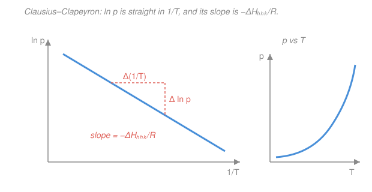

# Physical Chemistry · Lesson 2.2: The Clapeyron and Clausius–Clapeyron equations

> ⏱ ~15 min · Module 2: Phase equilibria, reactions, and solutions · Builds on: [2.1 Phase stability and one-component diagrams](02-01-phase-stability-one-component-diagrams.md) · Unlocks: [2.3 Ideal solutions: Raoult and Henry](02-03-ideal-solutions-raoult-henry.md)

## Why this matters

Lesson 2.1 drew the phase diagram — regions of solid, liquid, gas, and the *lines* where two of them coexist. But it never told you the one number that gives each line its character: its **slope**. That slope is why a pressure cooker cooks faster, why ice skates glide, why freeze-drying works, and how a chemist reads a heat of vaporization straight off a graph of vapor-pressure data. This lesson turns "there is a boundary" into "here is exactly how steep it is, and why" — starting from nothing but the equality of chemical potentials you met in 2.1, and ending with the single most-used equation in phase equilibria.

## The idea

A coexistence line is a truce between two phases: at every point on it, neither phase is more stable, so molecules cross both ways at equal rates. In the language of 2.1, the two phases have **equal molar Gibbs energy** — equal chemical potential, $\mu_\alpha = \mu_\beta$.

Now nudge along the line by warming a little ($dT$) and letting the pressure follow ($dp$) so the truce *holds*. If the truce holds, both potentials must change by the *same amount* — otherwise one phase would win and you'd fall off the line. That single demand, "$\mu$ of each phase must stay tied," is enough to pin down the ratio $dp/dT$. And the two things that decide it are physical and intuitive: the **entropy jump** and the **volume jump** as you cross. That's the whole Clapeyron equation — an *exact* statement, no approximations, valid for any boundary (melting, boiling, subliming). The famous Clausius–Clapeyron form is just Clapeyron with one honest approximation bolted on for the gas lines.

## The formal version

**Setup.** From 2.1, the molar Gibbs energy of a pure phase changes with $T$ and $p$ as

$$d\mu = -S_m\,dT + V_m\,dp,$$

where $S_m$ is the molar entropy ($\mathrm{J\,K^{-1}\,mol^{-1}}$) and $V_m$ the molar volume ($\mathrm{m^3\,mol^{-1}}$). *In words: heating drops $\mu$ (at rate $S_m$); squeezing raises it (at rate $V_m$).* This is the fundamental equation $dG = -S\,dT + V\,dp$ written per mole.

**Staying on the line.** Along coexistence of phases $\alpha$ and $\beta$, $\mu_\alpha = \mu_\beta$ *everywhere*, so a step along the line must keep them equal: $d\mu_\alpha = d\mu_\beta$. Write both out:

$$-S_{m,\alpha}\,dT + V_{m,\alpha}\,dp = -S_{m,\beta}\,dT + V_{m,\beta}\,dp.$$

Collect the $dT$ and $dp$ terms and divide:

$$\boxed{\;\frac{dp}{dT} = \frac{S_{m,\beta}-S_{m,\alpha}}{V_{m,\beta}-V_{m,\alpha}} = \frac{\Delta S_\text{trs}}{\Delta V_\text{trs}} = \frac{\Delta H_\text{trs}}{T\,\Delta V_\text{trs}}\;}$$

This is the **Clapeyron equation**. The last step used that at a reversible phase transition the entropy change is $\Delta S_\text{trs} = \Delta H_\text{trs}/T$ (heat absorbed at constant $T$ and $p$ is the enthalpy, delivered reversibly). *In words: the slope of a coexistence line equals the ratio of the entropy jump to the volume jump across it — or equivalently the latent heat divided by $T$ times the volume jump.* It is **exact** and holds for every boundary. Here $\Delta X_\text{trs} = X_\text{(final phase)} - X_\text{(initial phase)}$ for the chosen direction of crossing.

**Fusion lines are steep.** For melting, $\Delta H_\text{fus} > 0$ and $\Delta V_\text{fus}$ is *tiny* (solids and liquids have similar densities). A small denominator makes $dp/dT$ **huge** — fusion lines are nearly vertical. Their *sign* is set entirely by $\Delta V_\text{fus}$: most substances expand on melting ($\Delta V > 0$, line tilts right), but **water contracts** on melting ($\Delta V_\text{fus} < 0$, because ice is less dense than liquid water), so its solid–liquid line tilts *left* — the negative slope you saw in 2.1.

**Gas lines: the Clausius–Clapeyron approximation.** For vaporization or sublimation, one phase is a gas, so make two honest approximations: (1) the condensed volume is negligible next to the gas, $\Delta V \approx V_{m,\text{gas}}$; (2) the vapor is ideal, $V_{m,\text{gas}} = RT/p$. Then

$$\frac{dp}{dT} = \frac{\Delta H_\text{vap}}{T\,\Delta V} \approx \frac{\Delta H_\text{vap}}{T\,(RT/p)} = \frac{p\,\Delta H_\text{vap}}{RT^2}.$$

Divide by $p$ and use $\frac{1}{p}\frac{dp}{dT} = \frac{d\ln p}{dT}$:

$$\boxed{\;\frac{d\ln p}{dT} = \frac{\Delta H_\text{vap}}{RT^2}\;}$$

the **Clausius–Clapeyron equation**. *In words: the fractional rise in vapor pressure per degree is set by the heat of vaporization.* Treating $\Delta H_\text{vap}$ as constant over the range and integrating from $(T_1, p_1)$ to $(T_2, p_2)$ — note $\int dT/T^2 = -1/T$ — gives the workhorse form

$$\boxed{\;\ln\frac{p_2}{p_1} = -\frac{\Delta H_\text{vap}}{R}\left(\frac{1}{T_2}-\frac{1}{T_1}\right).\;}$$

Rearranged, $\ln p = -\dfrac{\Delta H_\text{vap}}{R}\cdot\dfrac{1}{T} + \text{const}$: **a plot of $\ln p$ against $1/T$ is a straight line of slope $-\Delta H_\text{vap}/R$.** That line is how heats of vaporization are measured. The same logic with $\Delta H_\text{sub}$ gives the sublimation line; since subliming = melting then vaporizing, $\Delta H_\text{sub} = \Delta H_\text{fus} + \Delta H_\text{vap}$, so the sublimation line is **steeper** than the vaporization line where they meet at the triple point.

## Picture

## Worked examples

**Example 1 (mechanical — get $\Delta H_\text{vap}$ from a slope).** Vapor-pressure data for a liquid give a straight $\ln p$ vs $1/T$ line with slope $-4.20\times10^{3}\ \mathrm{K}$. Then

$$-\frac{\Delta H_\text{vap}}{R} = -4.20\times10^{3}\ \mathrm{K}\;\Longrightarrow\; \Delta H_\text{vap} = (4.20\times10^{3}\ \mathrm{K})(8.314\ \mathrm{J\,K^{-1}\,mol^{-1}}) = 34.9\ \mathrm{kJ/mol}.$$

The slope *is* the measurement — no need for the intercept at all.

**Example 2 (why you'd care — the pressure cooker).** Water boils when its vapor pressure reaches the surrounding pressure. Raise the pressure and you raise the boiling temperature. Near $373\ \mathrm{K}$ with $\Delta H_\text{vap} = 40.7\ \mathrm{kJ/mol}$, how much does $T_b$ rise if a cooker holds $p_2 = 2.00\ \mathrm{atm}$ ($p_1 = 1.00\ \mathrm{atm}$ at $T_1 = 373\ \mathrm{K}$)?

$$\ln\frac{2.00}{1.00} = -\frac{40700}{8.314}\left(\frac{1}{T_2}-\frac{1}{373}\right)\;\Longrightarrow\; 0.693 = -4895\left(\frac{1}{T_2}-\frac{1}{373}\right).$$

So $\dfrac{1}{T_2}-\dfrac{1}{373} = -1.416\times10^{-4}$, giving $\dfrac{1}{T_2} = 2.681\times10^{-3} - 1.416\times10^{-4} = 2.540\times10^{-3}$, i.e. $T_2 \approx 394\ \mathrm{K}$ ($121\,^\circ\mathrm{C}$). That ~21 K boost is why a pressure cooker cooks in half the time.

## Watch out

- **You might plug $\Delta H_\text{vap}$ in kJ while $R$ is in J.** Keep both in joules: $\Delta H$ in $\mathrm{J/mol}$ with $R = 8.314\ \mathrm{J\,K^{-1}\,mol^{-1}}$. A stray factor of 1000 is the classic Clausius–Clapeyron error.
- **You might apply Clausius–Clapeyron to a melting line.** Don't — the "ignore the condensed phase, treat vapor as ideal" step needs a *gas*. Fusion lines demand the full Clapeyron equation with the real (tiny) $\Delta V_\text{fus}$.
- **You might drop the minus sign or flip which state is 1 vs 2.** In $\ln(p_2/p_1) = -\frac{\Delta H_\text{vap}}{R}(1/T_2 - 1/T_1)$, the same state's $T$ and $p$ must carry the same subscript. A useful sanity check: higher $T$ must give higher $p$, so if $T_2 > T_1$ then $p_2 > p_1$.
- **"Constant $\Delta H_\text{vap}$" is an approximation.** It drifts with temperature and vanishes at the critical point, so the integrated line bends over a very wide range. Fine across tens of kelvin; suspect across hundreds.

## One-liner

> Tie the two phases' chemical potentials and the slope falls out: $dp/dT = \Delta H_\text{trs}/(T\,\Delta V_\text{trs})$ exactly — and for a gas boundary that collapses to a straight $\ln p$ vs $1/T$ line of slope $-\Delta H_\text{vap}/R$.

## Problems

**P1 (🟢)** A liquid has vapor pressure $60.0\ \mathrm{kPa}$ at $350\ \mathrm{K}$ and $\Delta H_\text{vap} = 40.0\ \mathrm{kJ/mol}$ (assume constant). Find its **normal boiling point** — the temperature at which its vapor pressure equals $1\ \mathrm{atm} = 101.325\ \mathrm{kPa}$.

**P2 (🟡)** The vapor pressure of a substance is $12.0\ \mathrm{kPa}$ at $300\ \mathrm{K}$ and $40.0\ \mathrm{kPa}$ at $330\ \mathrm{K}$. Extract $\Delta H_\text{vap}$.

**P3 (🔴)** For the ice–water fusion line at $T = 273.15\ \mathrm{K}$: $\Delta H_\text{fus} = 6.01\ \mathrm{kJ/mol}$, molar mass $M = 18.015\ \mathrm{g/mol}$, and densities $\rho_\text{ice} = 0.917\ \mathrm{g\,cm^{-3}}$, $\rho_\text{water} = 1.000\ \mathrm{g\,cm^{-3}}$. Compute $\Delta V_\text{fus}$ and $dp/dT$ with the full Clapeyron equation, confirm the slope is negative, and estimate how much the melting point shifts if pressure is raised by $100\ \mathrm{bar}$.

Solutions

**P1** Use the integrated Clausius–Clapeyron with state 1 $= (350\ \mathrm{K},\ 60.0\ \mathrm{kPa})$ and state 2 $= (T_2,\ 101.325\ \mathrm{kPa})$:

$$\ln\frac{101.325}{60.0} = -\frac{40000}{8.314}\left(\frac{1}{T_2}-\frac{1}{350}\right).$$

Left side: $\ln(1.6888) = 0.5238$. Coefficient: $40000/8.314 = 4811\ \mathrm{K}$. So

$$\frac{1}{T_2}-\frac{1}{350} = -\frac{0.5238}{4811} = -1.089\times10^{-4}\ \mathrm{K^{-1}}.$$

With $1/350 = 2.857\times10^{-3}$: $\;1/T_2 = 2.857\times10^{-3} - 1.089\times10^{-4} = 2.748\times10^{-3}\ \mathrm{K^{-1}}$, so

$$T_2 = 363.9\ \mathrm{K}\ (\approx 91\,^\circ\mathrm{C}).$$

*Check.* Raising $p$ from 60.0 to 101 kPa should *raise* $T$ above 350 K — it does, by ~14 K. ✓

**P2** Both points feed the integrated form; solve for $\Delta H_\text{vap}$:

$$\ln\frac{40.0}{12.0} = -\frac{\Delta H_\text{vap}}{R}\left(\frac{1}{330}-\frac{1}{300}\right).$$

Left: $\ln(3.3333) = 1.2040$. The bracket: $1/330 - 1/300 = 3.0303\times10^{-3} - 3.3333\times10^{-3} = -3.030\times10^{-4}\ \mathrm{K^{-1}}$. Therefore

$$\Delta H_\text{vap} = -\frac{R\,\ln(40/12)}{(1/330 - 1/300)} = -\frac{(8.314)(1.2040)}{-3.030\times10^{-4}} = \frac{10.01}{3.030\times10^{-4}} = 3.30\times10^{4}\ \mathrm{J/mol}.$$

$$\Delta H_\text{vap} \approx 33.0\ \mathrm{kJ/mol}.$$

*Check.* Both minus signs cancel to give a positive $\Delta H_\text{vap}$, as vaporization must be endothermic. ✓

**P3** Molar volumes $V_m = M/\rho$ (convert $\mathrm{g\,cm^{-3}}$ to SI: $1\ \mathrm{cm^3} = 10^{-6}\ \mathrm{m^3}$):

$$V_{m,\text{water}} = \frac{18.015}{1.000} = 18.015\ \mathrm{cm^3/mol}, \qquad V_{m,\text{ice}} = \frac{18.015}{0.917} = 19.646\ \mathrm{cm^3/mol}.$$

Crossing solid $\to$ liquid (melting):

$$\Delta V_\text{fus} = V_{m,\text{water}} - V_{m,\text{ice}} = 18.015 - 19.646 = -1.631\ \mathrm{cm^3/mol} = -1.631\times10^{-6}\ \mathrm{m^3/mol}.$$

Negative, because liquid water is *denser* than ice. Full Clapeyron:

$$\frac{dp}{dT} = \frac{\Delta H_\text{fus}}{T\,\Delta V_\text{fus}} = \frac{6010\ \mathrm{J/mol}}{(273.15\ \mathrm{K})(-1.631\times10^{-6}\ \mathrm{m^3/mol})} = \frac{6010}{-4.455\times10^{-4}} = -1.35\times10^{7}\ \mathrm{Pa/K}.$$

That is $-135\ \mathrm{bar/K}$ — negative slope confirmed, and enormous (nearly vertical), exactly as expected for a fusion line with a tiny $\Delta V$. Inverting for the melting-point shift, $\dfrac{dT}{dp} = \dfrac{1}{-1.35\times10^{7}} = -7.41\times10^{-8}\ \mathrm{K/Pa}$. For $\Delta p = 100\ \mathrm{bar} = 1.0\times10^{7}\ \mathrm{Pa}$:

$$\Delta T \approx (-7.41\times10^{-8}\ \mathrm{K/Pa})(1.0\times10^{7}\ \mathrm{Pa}) = -0.74\ \mathrm{K}.$$

*Check.* Pressure *lowers* water's melting point (Le Chatelier: squeezing favors the denser liquid) — the hallmark of ice's left-tilting fusion line and the classic explanation for why the pressure of a blade helps ice skates glide. ✓

## Flashback

**From Lesson 2.1 (Phase stability and one-component diagrams):** For pure water (one component, $C = 1$), use the Gibbs phase rule $F = C - P + 2$ to find the number of degrees of freedom $F$ (a) at the triple point, (b) anywhere along the liquid–vapor coexistence line, and (c) in the middle of the single-phase liquid region. Why does part (b) make "the slope $dp/dT$" a well-defined single number at each temperature?

Solution

With $C = 1$, the phase rule is $F = 1 - P + 2 = 3 - P$.

- **(a) Triple point:** three phases coexist, $P = 3$, so $F = 3 - 3 = 0$. **Invariant** — it sits at one fixed $(T, p)$; you cannot move it.
- **(b) Liquid–vapor line:** two phases, $P = 2$, so $F = 3 - 2 = 1$. **Univariant** — one free variable.
- **(c) Single liquid region:** one phase, $P = 1$, so $F = 3 - 1 = 2$. **Bivariant** — $T$ and $p$ vary independently.

Part (b) is the point of *this* lesson: because $F = 1$, fixing $T$ forces a unique coexistence pressure $p(T)$ — the two-phase region collapses to a *curve*, not an area. A curve has a well-defined derivative at each point, so "$dp/dT$" is a single number there, and Clapeyron says exactly what it is: $\Delta H_\text{trs}/(T\,\Delta V_\text{trs})$.

## Connections

- **Backward:** the entire derivation rests on 2.1's coexistence condition $\mu_\alpha = \mu_\beta$ and the fundamental equation $d\mu = -S_m\,dT + V_m\,dp$; the phase rule's $F=1$ (Flashback) is precisely why a coexistence *slope* exists to compute. The relation $\Delta S = \Delta H/T$ at the transition is the second law from [1.2](01-02-entropy-second-law.md) applied to reversible heat.
- **Forward:** [2.3 Ideal solutions: Raoult and Henry](02-03-ideal-solutions-raoult-henry.md) reuses this vapor-pressure machinery for *mixtures* — how a solute lowers a solvent's vapor pressure — and [2.4 colligative properties](02-04-colligative-properties.md) leans on the same $\Delta H/(T\Delta V)$ logic for boiling-point elevation and freezing-point depression.
- **Sideways:** the "$\ln(\text{observable})$ vs $1/T$ with slope $-\Delta H/R$" pattern is a recurring bridge — you will meet it again as the van 't Hoff equation for equilibrium constants ([2.7](02-07-shifting-equilibria-van-t-hoff.md), $\ln K$ vs $1/T$) and as the Arrhenius plot for rate constants ([3.4](03-04-arrhenius-transition-state-theory.md), $\ln k$ vs $1/T$). Same straight line, three different chemistries; the gas behavior it rests on is the ideal-gas law from [general chemistry](../../general-chemistry/lessons/03-01-gases-ideal-gas-law-kinetic-theory.md).
