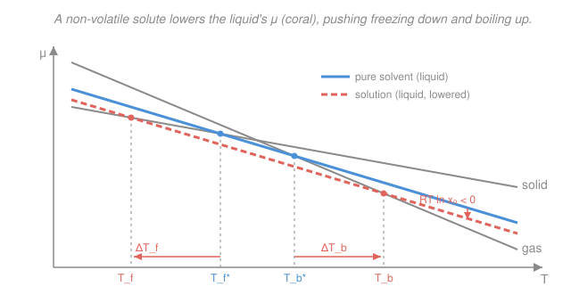

# Physical Chemistry · Lesson 2.4: Colligative properties

> ⏱ ~15 min · Module 2: Phase equilibria, reactions, and solutions · Builds on: [2.3 Ideal solutions: Raoult and Henry](02-03-ideal-solutions-raoult-henry.md) · Unlocks: [2.5 Binary phase diagrams](02-05-binary-phase-diagrams.md)

## Why this matters

Salt melts ice on winter roads; antifreeze keeps an engine liquid past 100 °C; your cells sit in a saline bath tuned so water doesn't rush in and burst them; and the way biochemists first weighed proteins was to measure how hard water pushes across a membrane to dilute them. All four are the *same* phenomenon: dissolve *anything* non-volatile in a solvent and you nudge its freezing point down, its boiling point up, and its tendency to cross a membrane way up. Remarkably, the size of the nudge doesn't care *what* you dissolved — only *how many particles*. That's the punchline of colligative properties, and it falls straight out of the chemical potential from [2.3](02-03-ideal-solutions-raoult-henry.md).

## The idea

Here's the one mechanism behind everything in this lesson. In [2.3](02-03-ideal-solutions-raoult-henry.md) we found that in an ideal solution the solvent's chemical potential is

$$\mu_A = \mu_A^* + RT\ln x_A,$$

where $\mu_A^*$ is the pure-solvent value, $x_A$ is the solvent mole fraction, $R$ the gas constant, $T$ temperature. Add solute and $x_A < 1$, so $\ln x_A < 0$: **the solvent's liquid $\mu$ drops.** Dilution makes the liquid more "comfortable" — lower free energy per mole — purely from mixing entropy.

Now recall that the solid, liquid, and gas of the solvent are in a tug-of-war, and whichever phase has the lowest $\mu$ at a given $T$ wins. Lowering *only the liquid's* $\mu$ tilts both boundaries:

- **Freezing** (liquid ↔ solid): the liquid is now more stable, so you must chill *further* — below the normal freezing point — before the solid finally undercuts it. Freezing point goes **down**.
- **Boiling** (liquid ↔ gas): the liquid is more stable, so it clings to the liquid state to *higher* $T$ before the gas wins. Boiling point goes **up**.

The solute is (almost always) assumed non-volatile and insoluble in the solid solvent, so it only touches the liquid line. Because the effect enters through $x_A$ — a head count — its magnitude depends on the *number* of dissolved particles, not their chemical identity. That "number, not identity" is the meaning of the word **colligative** (Latin *colligatus*, "bound together" — bound to the count).

## The formal version

**Vapor-pressure lowering.** Raoult's law from [2.3](02-03-ideal-solutions-raoult-henry.md) gives the solvent partial pressure $p_A = x_A p_A^*$. With one non-volatile solute, $x_A = 1 - x_B$, so

$$\Delta p = p_A - p_A^* = (x_A - 1)\,p_A^* = -\,x_B\, p_A^*.$$

*In words: the vapor pressure drops in proportion to the mole fraction of solute.* This is the root cause; the temperature shifts below are its consequences.

**Boiling-point elevation.** Setting the solution's liquid $\mu$ equal to the vapor's at boiling and using the Gibbs–Helmholtz temperature dependence (the same machinery as Clausius–Clapeyron, [2.2](02-02-clapeyron-clausius-clapeyron.md)), then linearizing $\ln x_A = \ln(1-x_B)\approx -x_B$ for dilute solutions, gives a shift proportional to solute amount. Expressed in **molality** $m$ (moles solute per kg solvent):

$$\boxed{\;\Delta T_b = K_b\, m\;}, \qquad K_b = \frac{R\,T_b^{2}\,M_A}{\Delta H_\text{vap}},$$

where $T_b$ is the pure solvent's boiling point (K), $M_A$ its molar mass (kg/mol), and $\Delta H_\text{vap}$ its molar enthalpy of vaporization. *In words: the boiling point rises linearly with how concentrated the solute is, at a rate $K_b$ fixed entirely by the solvent.* For water $K_b = 0.512\ \mathrm{K\,kg\,mol^{-1}}$.

**Freezing-point depression.** Identical derivation at the liquid–solid line (solute stays in the liquid), with $\Delta H_\text{fus}$ in place of $\Delta H_\text{vap}$:

$$\boxed{\;\Delta T_f = K_f\, m\;}, \qquad K_f = \frac{R\,T_f^{2}\,M_A}{\Delta H_\text{fus}}.$$

*In words: same story, opposite sign — the freezing point drops at the solvent-fixed rate $K_f$.* For water $K_f = 1.86\ \mathrm{K\,kg\,mol^{-1}}$. (Both constants use molality, not molarity, because it's mass-based and so temperature-independent — it doesn't drift as the solution expands.)

**Osmotic pressure.** Put pure solvent and solution on opposite sides of a membrane that passes solvent but not solute. Solvent flows toward the solution (lower $\mu_A$) until an extra hydrostatic pressure $\Pi$ on the solution side raises its $\mu_A$ back to balance. At equilibrium the solvent's chemical potential is equal across the membrane:

$$\mu_A^*(p) = \mu_A^*(p+\Pi) + RT\ln x_A.$$

Since $\left(\partial\mu/\partial p\right)_T = V_m$ (molar volume), $\mu_A^*(p+\Pi)\approx \mu_A^*(p) + V_m\,\Pi$. Cancel $\mu_A^*(p)$:

$$0 = V_m\,\Pi + RT\ln x_A \;\Longrightarrow\; V_m\,\Pi = -RT\ln x_A \approx RT\,x_B,$$

using $\ln(1-x_B)\approx -x_B$. With $x_B \approx n_B/n_A$ and $n_A V_m \approx V$ (solution volume), this collapses to the clean **van 't Hoff equation**:

$$\boxed{\;\Pi = \frac{n_B}{V}RT = [B]\,RT\;}$$

*In words: osmotic pressure obeys an "ideal-gas law" for the dissolved particles — as if they were a gas of concentration $[B]$ filling the volume.* Osmotic pressure is enormous compared to the other effects (a 1 M solution pulls ~24 atm at room temperature), which makes it the **most sensitive** colligative probe — the go-to method for the molar mass of proteins and polymers, where even a tiny molality gives a readable $\Pi$.

**Electrolytes — the van 't Hoff $i$ factor.** Every formula above counts *particles in solution*. A solute that dissociates delivers more particles than formula units, so multiply each expression by the **van 't Hoff factor** $i$ = particles released per formula unit:

$$\Delta T_f = i\,K_f\,m,\qquad \Delta T_b = i\,K_b\,m,\qquad \Pi = i\,[B]\,RT.$$

Ideally $\ce{NaCl -> Na+ + Cl-}$ gives $i=2$; $\ce{CaCl2 -> Ca^2+ + 2Cl-}$ gives $i=3$; a non-electrolyte like glucose gives $i=1$. (Real $i$ runs slightly below the ideal value — ion pairing means some ions travel together and undercount.)

**Real solutions.** Everything above assumed ideality ($\ln x_A$). For a real solvent, swap in the **activity** $a_A = \gamma_A x_A$ from [1.6](01-06-fugacity-activity.md): $\mu_A = \mu_A^* + RT\ln a_A$, and each result holds with $x_A \to a_A$ — indeed, measuring colligative shifts is a standard way to *back out* the solvent activity coefficient $\gamma_A$.

## Picture

Each phase's $\mu$ falls with $T$ (slope $= -S$, so gas is steepest, solid shallowest). The stable phase is the lowest line. Dropping only the liquid line by $RT\ln x_A$ slides its crossing with the solid **left** (freezing down) and its crossing with the gas **right** (boiling up).

## Worked examples

**Example 1 (mechanical — the temperature shifts).** Dissolve 0.50 mol of glucose (non-electrolyte, $i=1$) in 1.0 kg of water, so $m = 0.50\ \mathrm{mol/kg}$.

$$\Delta T_f = K_f\,m = 1.86 \times 0.50 = 0.93\ \mathrm{K} \;\Rightarrow\; T_f = -0.93\ ^\circ\mathrm{C},$$
$$\Delta T_b = K_b\,m = 0.512 \times 0.50 = 0.26\ \mathrm{K} \;\Rightarrow\; T_b = 100.26\ ^\circ\mathrm{C}.$$

Freezing drops nearly four times as much as boiling rises — because $K_f > K_b$, which in turn is because $\Delta H_\text{fus} \ll \Delta H_\text{vap}$ for water.

**Example 2 (why you'd care — weighing a protein).** Osmometry is how you find the molar mass of something too big and fragile to mass-spec casually. Dissolve $2.00\ \mathrm{g}$ of a protein in water to a total $0.100\ \mathrm{L}$, and measure $\Pi = 0.0250\ \mathrm{atm}$ at $300\ \mathrm{K}$. From $\Pi = \dfrac{n_B}{V}RT = \dfrac{m_\text{solute}}{M\,V}RT$,

$$M = \frac{m_\text{solute}\,RT}{\Pi\,V} = \frac{(2.00\ \mathrm{g})(0.08206\ \mathrm{L\,atm\,mol^{-1}K^{-1}})(300\ \mathrm{K})}{(0.0250\ \mathrm{atm})(0.100\ \mathrm{L})} \approx 1.97\times10^{4}\ \mathrm{g/mol}.$$

A ~20 kDa protein. Notice how a barely-there $0.025$ atm is measurable — the same solution would depress freezing by only $\sim 0.002\ \mathrm{K}$, far too small to read. That sensitivity is why osmometry wins for macromolecules.

## Watch out

- **You might think a more concentrated *by mass* solution always freezes lowest.** It's particle count, not grams. One mole of CaCl₂ per kg lowers freezing ~three times as much as one mole of glucose, despite CaCl₂ weighing more per mole — because it splits into three ions. Always ask "how many particles?"
- **You might reach for molarity in $\Delta T$ formulas.** Use **molality** for $\Delta T_f,\Delta T_b$ (mass-based, so temperature-proof) and **molarity** for $\Pi = [B]RT$. In dilute aqueous solution they're numerically close, but the formulas are written for specific concentration units — don't mix them up.
- **You might forget $i$ for salts, or trust the ideal $i$ exactly.** Ionic solutes need the factor; but real $i$ sits a bit below 2, 3, … because of ion pairing — the measured freezing depression of NaCl gives $i\approx 1.9$, not a clean 2.

## One-liner

> A non-volatile solute lowers the solvent's chemical potential by $RT\ln x_A$, and that single dip — sized by the *number* of particles, not their identity — drops freezing, lifts boiling, and drives osmosis.

## Problems

**P1 (🟢)** You dissolve $1.50\ \mathrm{mol}$ of glucose (non-electrolyte) in $2.00\ \mathrm{kg}$ of water. Using $K_f = 1.86$ and $K_b = 0.512\ \mathrm{K\,kg\,mol^{-1}}$, find the freezing and boiling points of the solution.

**P2 (🟡)** (a) Compute the osmotic pressure at $25\ ^\circ\mathrm{C}$ of a $0.10\ \mathrm{mol/L}$ aqueous solution of a non-electrolyte. (b) A different non-electrolyte: $3.60\ \mathrm{g}$ dissolved in water to $0.250\ \mathrm{L}$ gives $\Pi = 1.96\ \mathrm{atm}$ at $27\ ^\circ\mathrm{C}$. Find its molar mass. (Use $R = 0.08206\ \mathrm{L\,atm\,mol^{-1}K^{-1}}$.)

**P3 (🔴)** For equal molalities $m = 0.10\ \mathrm{mol/kg}$ in water, compute the *ideal* freezing-point depression of glucose, NaCl, and CaCl₂, and explain the ordering.

Solutions

**P1** Molality: $m = \dfrac{1.50\ \mathrm{mol}}{2.00\ \mathrm{kg}} = 0.750\ \mathrm{mol/kg}$. Glucose is a non-electrolyte, so $i=1$.

$$\Delta T_f = K_f\,m = 1.86 \times 0.750 = 1.40\ \mathrm{K} \;\Rightarrow\; T_f = -1.40\ ^\circ\mathrm{C},$$
$$\Delta T_b = K_b\,m = 0.512 \times 0.750 = 0.384\ \mathrm{K} \;\Rightarrow\; T_b = 100.38\ ^\circ\mathrm{C}.$$

*Check.* Units: $(\mathrm{K\,kg\,mol^{-1}})(\mathrm{mol\,kg^{-1}}) = \mathrm{K}$ ✓. Freezing drops far more than boiling rises, as expected from $K_f > K_b$.

**P2** (a) With $[B] = 0.10\ \mathrm{mol/L}$, $T = 298\ \mathrm{K}$:

$$\Pi = [B]RT = (0.10)(0.08206)(298) = 2.4\ \mathrm{atm}.$$

(b) Rearranged van 't Hoff, $\Pi = \dfrac{m_\text{solute}}{M\,V}RT$, so

$$M = \frac{m_\text{solute}\,RT}{\Pi\,V} = \frac{(3.60\ \mathrm{g})(0.08206)(300\ \mathrm{K})}{(1.96\ \mathrm{atm})(0.250\ \mathrm{L})} = \frac{88.62}{0.490} \approx 181\ \mathrm{g/mol}.$$

*Check.* Units: $\dfrac{\mathrm{g}\cdot \mathrm{L\,atm\,mol^{-1}K^{-1}}\cdot \mathrm{K}}{\mathrm{atm}\cdot \mathrm{L}} = \mathrm{g/mol}$ ✓. About the molar mass of glucose (180 g/mol) — sensible for a small sugar.

**P3** Ideal $\Delta T_f = i\,K_f\,m$ with $K_f\,m = 1.86 \times 0.10 = 0.186\ \mathrm{K}$:

| solute | dissociation | $i$ | $\Delta T_f$ |
|---|---|---|---|
| glucose | none | 1 | $0.186\ \mathrm{K}$ |
| NaCl | $\ce{Na+ + Cl-}$ | 2 | $0.372\ \mathrm{K}$ |
| CaCl₂ | $\ce{Ca^2+ + 2Cl-}$ | 3 | $0.558\ \mathrm{K}$ |

Ordering: $\text{CaCl}_2 > \text{NaCl} > \text{glucose}$. Colligative effects count *particles in solution*, and per formula unit CaCl₂ releases three, NaCl two, glucose one — so their depressions land in the ratio $3:2:1$ at equal molality. (In reality ion pairing pulls the salts' $i$ slightly below 3 and 2, so the true gaps are a touch smaller.)

*Check.* Non-electrolyte matches the plain $K_f m$; the salts scale by their integer $i$. ✓

## Flashback

**From Lesson 2.3 (Ideal solutions: Raoult and Henry):** At a fixed temperature, pure liquid A has vapor pressure $p_A^* = 90\ \mathrm{Torr}$ and pure liquid B has $p_B^* = 30\ \mathrm{Torr}$. They form an ideal solution with $x_A = 0.50$. Find the total vapor pressure and the mole fraction of A *in the vapor*. Is the vapor richer or poorer in the more volatile component?

Solution

Raoult's law for each component: $p_A = x_A p_A^* = 0.50 \times 90 = 45\ \mathrm{Torr}$, and $p_B = x_B p_B^* = 0.50 \times 30 = 15\ \mathrm{Torr}$.

Total (Dalton): $p = p_A + p_B = 45 + 15 = 60\ \mathrm{Torr}$.

Vapor composition (partial-pressure fraction): $y_A = \dfrac{p_A}{p} = \dfrac{45}{60} = 0.75$.

The vapor is **richer** in A: $y_A = 0.75 > x_A = 0.50$. The more volatile component (higher $p^*$) is always enriched in the gas phase — the principle that makes distillation work, and the seed of the binary phase diagrams in [2.5](02-05-binary-phase-diagrams.md).

*Check.* $y_A + y_B = 45/60 + 15/60 = 1$ ✓, and $y_A > x_A$ since $p_A^* > p_B^*$. ✓

## Connections

- **Backward:** the whole lesson is one consequence of $\mu_A = \mu_A^* + RT\ln x_A$ from [2.3](02-03-ideal-solutions-raoult-henry.md); the $\mu$-vs-$T$ crossings are the one-component phase competition of [2.1](02-01-phase-stability-one-component-diagrams.md), and the boiling/freezing derivations reuse the Gibbs–Helmholtz slope trick behind Clausius–Clapeyron in [2.2](02-02-clapeyron-clausius-clapeyron.md). For real solvents, swap $x_A \to a_A$ using the activity of [1.6](01-06-fugacity-activity.md).
- **Forward:** [2.5 Binary phase diagrams](02-05-binary-phase-diagrams.md) turns this "solute shifts the boundary" picture into full temperature–composition maps with tie lines and the lever rule; the flashback's vapor-enrichment is where that story begins.
- **Sideways (biology & thermodynamics of gases):** the van 't Hoff osmotic law $\Pi = [B]RT$ is the ideal-gas law ([general chemistry: gases](../../general-chemistry/lessons/03-01-gases-ideal-gas-law-kinetic-theory.md)) wearing a solution costume, and it underlies cell turgor, dialysis, and reverse osmosis — dissolved particles behave, thermodynamically, like a confined gas.
