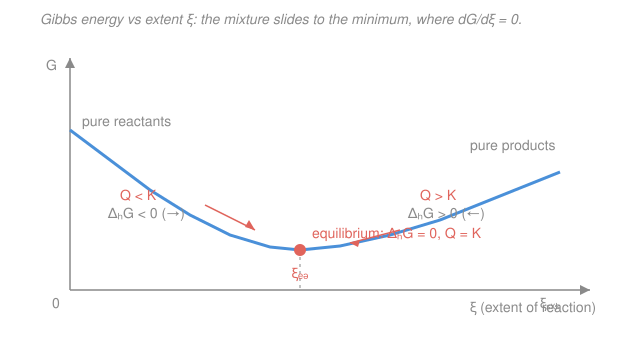

# Physical Chemistry · Lesson 2.6: Chemical equilibrium and the equilibrium constant

> ⏱ ~15 min · Module 2: Phase equilibria, reactions, and solutions · Builds on: [1.5 Chemical potential](01-05-chemical-potential.md), [1.3 Gibbs and Helmholtz energies](01-03-gibbs-helmholtz-energies.md), [general chemistry 3.4 (equilibrium & Le Chatelier)](../../general-chemistry/lessons/03-04-chemical-equilibrium-k-le-chatelier.md) · Unlocks: [2.7 Shifting equilibria and the van 't Hoff equation](02-07-shifting-equilibria-van-t-hoff.md)

## Why this matters

In general chemistry you *memorized* that $K = \frac{[\text{products}]}{[\text{reactants}]}$ and that a big $K$ means "products win." You were never told **why**, or where the number comes from. Here we derive it — and the answer is one of the most satisfying payoffs in all of thermodynamics: the equilibrium constant is just the standard reaction Gibbs energy in disguise,

$$\Delta_r G^\circ = -RT\ln K.$$

That single equation lets you predict the position of *any* reaction's equilibrium from a table of standard Gibbs energies — no experiment needed. It also cleans up the gen-chem picture in two ways: the "concentrations" are really **activities** (Lesson [1.6](01-06-fugacity-activity.md)), and $K$ is dimensionless. Get this, and 2.7's temperature dependence (van 't Hoff) and every acid–base / solubility calculation downstream become one idea wearing different clothes.

## The idea

Picture a reacting mixture as a ball rolling in a valley. The horizontal axis is the **extent of reaction** $\xi$ (Greek xi) — a single number tracking how far the reaction has run, from all-reactants ($\xi=0$) to all-products. The vertical axis is the mixture's total Gibbs energy $G$. Every spontaneous change at fixed $T,p$ lowers $G$ (that's [1.3](01-03-gibbs-helmholtz-energies.md)), so the mixture *rolls downhill in $\xi$* until it hits the bottom of the valley. **Equilibrium is that minimum** — the flat spot where rolling either way costs energy, so nothing net happens.

The slope of that valley, $dG/d\xi$, is what we call the **reaction Gibbs energy** $\Delta_r G$. Downhill to the right ($\Delta_r G<0$) means "make more product." Downhill to the left ($\Delta_r G>0$) means "run backward." At the bottom the slope is zero: $\Delta_r G = 0$. That's the whole of equilibrium in one line — not "forward rate equals backward rate" (that's kinetics), but "the Gibbs energy can't get any lower."

The equilibrium constant is simply the **composition at the bottom of the valley**, and because the shape of the valley is fixed by the standard Gibbs energies of the species, $K$ is fixed by them too.

## The formal version

**Reaction Gibbs energy.** Write any reaction with **signed stoichiometric numbers** $\nu_i$ (Greek nu): negative for reactants, positive for products. For $\ce{N2O4 -> 2 NO2}$, $\nu_{\ce{N2O4}} = -1$ and $\nu_{\ce{NO2}} = +2$. As the extent advances by $d\xi$, species $i$ changes by $dn_i = \nu_i\,d\xi$. Since $dG = \sum_i \mu_i\,dn_i$ at fixed $T,p$ (the chemical-potential form from [1.5](01-05-chemical-potential.md)),

$$\Delta_r G \equiv \left(\frac{\partial G}{\partial \xi}\right)_{T,p} = \sum_i \nu_i \mu_i.$$

*In words: the reaction Gibbs energy is the slope of the $G$-vs-$\xi$ valley, and it equals the stoichiometry-weighted sum of chemical potentials.* Note $\Delta_r G$ is a *per-mole-of-reaction* slope (units J/mol), not a total energy.

**Insert the activity form of $\mu$.** From [1.6](01-06-fugacity-activity.md), every chemical potential splits into a standard part plus an activity correction:

$$\mu_i = \mu_i^\circ + RT\ln a_i,$$

where $\mu_i^\circ$ is the standard chemical potential (the value at the chosen standard state) and $a_i$ is the **activity** (dimensionless, effective concentration). Substitute:

$$\Delta_r G = \underbrace{\sum_i \nu_i \mu_i^\circ}_{\equiv\,\Delta_r G^\circ} + RT\sum_i \nu_i \ln a_i = \Delta_r G^\circ + RT\ln\!\underbrace{\prod_i a_i^{\nu_i}}_{\equiv\,Q}.$$

This is the master relation

$$\boxed{\;\Delta_r G = \Delta_r G^\circ + RT\ln Q\;}, \qquad Q = \prod_i a_i^{\nu_i}.$$

*In words: the actual reaction slope equals the standard slope plus a correction for how far the current composition sits from standard, packaged in the reaction quotient $Q$.* Because the $\nu_i$ are signed, $Q$ automatically puts products (positive exponents) on top and reactants (negative exponents) on the bottom — this is the gen-chem $Q$, now built from **activities** instead of raw concentrations.

**Equilibrium.** At the valley bottom $\Delta_r G = 0$, and we christen the equilibrium value of $Q$ the **equilibrium constant** $K$:

$$0 = \Delta_r G^\circ + RT\ln K \;\;\Longrightarrow\;\; \boxed{\;\Delta_r G^\circ = -RT\ln K\;}, \qquad K = e^{-\Delta_r G^\circ/RT}.$$

*In words: the standard reaction Gibbs energy fixes the equilibrium constant, full stop.* Read off the sign logic:

- $\Delta_r G^\circ < 0 \Rightarrow K > 1$: products favored at equilibrium.
- $\Delta_r G^\circ > 0 \Rightarrow K < 1$: reactants favored.
- $\Delta_r G^\circ = 0 \Rightarrow K = 1$.

$K$ is a **pure number** (activities are dimensionless), and it depends only on $T$ — not on pressure, not on how much you started with.

**What goes into an activity.** The standard state you pick sets $a_i$:

- **Ideal gas:** $a_i = p_i/p^\circ$, the partial pressure over the standard pressure $p^\circ = 1\ \mathrm{bar}$. (Real gas: replace $p_i$ by the fugacity $f_i$ from [1.6](01-06-fugacity-activity.md).)
- **Solute in solution:** $a_i = \gamma_i\, c_i/c^\circ$ with $c^\circ = 1\ \mathrm{mol\,L^{-1}}$; ideal-dilute $\Rightarrow a_i \approx c_i/c^\circ$.
- **Pure solid or pure liquid:** $a_i = 1$ — it drops out of $K$ entirely. This is *why* solids and pure liquids never appear in equilibrium expressions.

**$K_p$, $K_c$, $K_x$.** For gas reactions people write $K$ three ways. Using $p_i = x_i\, p$ (mole fraction $x_i$ times total pressure $p$) and the ideal-gas law $p_i = c_i RT$, with $\Delta n = \sum_i \nu_i$ (net moles of gas):

$$K \;=\; K_p \;=\; \prod_i\!\left(\frac{p_i}{p^\circ}\right)^{\nu_i} \;=\; K_x\left(\frac{p}{p^\circ}\right)^{\Delta n} \;=\; K_c\left(\frac{c^\circ RT}{p^\circ}\right)^{\Delta n},$$

where $K_x = \prod x_i^{\nu_i}$ and $K_c = \prod (c_i/c^\circ)^{\nu_i}$. *In words: $K_p$ is the thermodynamic one and it's fixed; $K_x$ (mole fractions) and $K_c$ (concentrations) differ from it by factors of total pressure and $RT$ whenever $\Delta n \neq 0$.* When $\Delta n = 0$ all three coincide and the equilibrium is pressure-independent.

## Picture

## Worked examples

**Example 1 (mechanical — $\Delta_r G^\circ \to K$).** Ammonia synthesis $\ce{N2(g) + 3 H2(g) <=> 2 NH3(g)}$ has $\Delta_r G^\circ = -32.8\ \mathrm{kJ/mol}$ at 298 K (twice the formation value $\Delta_f G^\circ(\ce{NH3}) = -16.4\ \mathrm{kJ/mol}$). Then, with $RT = 8.314 \times 298 = 2478\ \mathrm{J/mol}$,

$$\ln K = -\frac{\Delta_r G^\circ}{RT} = -\frac{-32800}{2478} = 13.24 \;\;\Longrightarrow\;\; K = e^{13.24} \approx 5.6\times10^{5}.$$

$K \gg 1$, so at 298 K equilibrium sits far toward ammonia. (That the reaction is *slow* without a catalyst is a kinetics question, not a thermodynamic one — $K$ says nothing about rate.)

**Example 2 (why you'd care — equilibrium composition).** The water-gas shift $\ce{CO(g) + H2O(g) <=> CO2(g) + H2(g)}$ has $\Delta n = 0$. Suppose at some temperature $K = 4.0$ (equivalently $\Delta_r G^\circ = -RT\ln 4 = -3.4\ \mathrm{kJ/mol}$). Start with 1 mol CO and 1 mol H₂O, no products. Track the **extent** $\xi$ with an ICE table (amounts in mol):

| | $\ce{CO}$ | $\ce{H2O}$ | $\ce{CO2}$ | $\ce{H2}$ |
|---|---|---|---|---|
| Initial | 1 | 1 | 0 | 0 |
| Change | $-\xi$ | $-\xi$ | $+\xi$ | $+\xi$ |
| Equil. | $1-\xi$ | $1-\xi$ | $\xi$ | $\xi$ |

Because $\Delta n = 0$, the total moles stay at 2 and every $p/p^\circ$ or $RT$ factor cancels — mole fractions (or amounts) go straight in:

$$K = \frac{x_{\ce{CO2}}\,x_{\ce{H2}}}{x_{\ce{CO}}\,x_{\ce{H2O}}} = \frac{\xi^2}{(1-\xi)^2} = 4.0 \;\;\Longrightarrow\;\; \frac{\xi}{1-\xi} = 2 \;\;\Longrightarrow\;\; \xi = \tfrac23 \approx 0.667.$$

So at equilibrium: $0.33$ mol each of CO and H₂O, $0.67$ mol each of CO₂ and H₂. The lesson: $\Delta_r G^\circ$ gives you $K$; an extent-of-reaction table turns $K$ into an actual composition.

## Watch out

- **You might think $Q$ and $K$ are different kinds of object.** They're the same expression $\prod a_i^{\nu_i}$ — $Q$ is its value at *any* composition, $K$ is its value *at equilibrium only*. Comparing them tells you which way you'll go: $Q<K \Rightarrow \Delta_r G<0 \Rightarrow$ forward; $Q>K \Rightarrow$ backward.
- **You might use $\Delta_r G^\circ$ to judge spontaneity of the actual mixture.** No — $\Delta_r G^\circ = -RT\ln K$ is a fixed reference number; the sign of $\Delta_r G = \Delta_r G^\circ + RT\ln Q$ (which *includes* the current $Q$) is what tells you the direction. A reaction with $\Delta_r G^\circ > 0$ still runs forward from pure reactants, because there $Q\to 0$ and $RT\ln Q\to -\infty$.
- **You might leave solids or the solvent in $K$.** Pure condensed phases have $a=1$ and vanish. Likewise don't carry units on $K$: activities are ratios, so $K$ is dimensionless — the "$K_c$ has units" habit from gen chem is an artifact of dropping the $c^\circ$.

## One-liner

> Equilibrium is the bottom of the Gibbs valley ($\Delta_r G = 0$), and its position is set once and for all by $\Delta_r G^\circ = -RT\ln K$ — standard Gibbs energy in, equilibrium constant out.

## Problems

**P1 (🟢)** A reaction has $\Delta_r G^\circ = -12.0\ \mathrm{kJ/mol}$ at 298 K. Compute $K$ and state whether products or reactants are favored.

**P2 (🟡)** For the heterogeneous reaction $\ce{CaCO3(s) <=> CaO(s) + CO2(g)}$, write the equilibrium expression $K$ in terms of activities (omitting pure solids). Then, for a general gas-phase reaction, relate $K_p$ and $K_c$, and evaluate the conversion factor for $\Delta n = +1$ at 298 K.

**P3 (🔴, Boss-2 rehearsal)** For $\ce{N2O4(g) <=> 2 NO2(g)}$, $\Delta_r G^\circ = 4.73\ \mathrm{kJ/mol}$ at 298 K. (a) Compute $K$. (b) Starting from pure $\ce{N2O4}$ at total pressure $p = 1\ \mathrm{bar}$, find the **degree of dissociation** $\alpha$ by setting up $K = \dfrac{4\alpha^2}{1-\alpha^2}\cdot\dfrac{p}{p^\circ}$ and solving.

Solutions

**P1** With $RT = 8.314 \times 298 = 2478\ \mathrm{J/mol}$,

$$\ln K = -\frac{\Delta_r G^\circ}{RT} = -\frac{-12000}{2478} = 4.84 \;\;\Longrightarrow\;\; K = e^{4.84} \approx 1.3\times10^{2} \approx 126.$$

$\Delta_r G^\circ < 0 \Rightarrow K > 1$: **products favored**. *Check:* a ~12 kJ/mol drop is about $5\,RT$, and $e^{5}\approx150$ — right order of magnitude. ✓

**P2** Solids have $a=1$, so only the gas survives:

$$K = \frac{a_{\ce{CaO}}\,a_{\ce{CO2}}}{a_{\ce{CaCO3}}} = \frac{(1)\,(p_{\ce{CO2}}/p^\circ)}{(1)} = \frac{p_{\ce{CO2}}}{p^\circ}.$$

The equilibrium is set by a single CO₂ pressure (the "decomposition pressure") — a solid's amount doesn't enter, so piling on more CaCO₃ doesn't shift it.

General gas relation: from $p_i = c_i RT$, write $\dfrac{p_i}{p^\circ} = \dfrac{c_i}{c^\circ}\cdot\dfrac{c^\circ RT}{p^\circ}$, so raising to $\nu_i$ and multiplying,

$$K_p = K_c\left(\frac{c^\circ RT}{p^\circ}\right)^{\Delta n}, \qquad \Delta n = \sum_i \nu_i\ (\text{gas}).$$

Evaluate the factor for $\Delta n = +1$ at $T = 298\ \mathrm{K}$ with $c^\circ = 1\ \mathrm{mol\,L^{-1}}=10^{3}\ \mathrm{mol\,m^{-3}}$, $p^\circ = 10^{5}\ \mathrm{Pa}$, $R = 8.314\ \mathrm{J\,K^{-1}\,mol^{-1}}$:

$$\frac{c^\circ RT}{p^\circ} = \frac{(10^{3})(8.314)(298)}{10^{5}} = 24.8.$$

So $K_p = 24.8\,K_c$ here. (The common shortcut $K_p = K_c(RT)^{\Delta n}$ with $R$ in $\mathrm{L\,bar\,K^{-1}\,mol^{-1}} = 0.08314$ gives the same $0.08314\times298 = 24.8$ — it just hides the $c^\circ,p^\circ$.) For $\Delta n = 0$, the factor is 1 and $K_p = K_c = K_x$.

**P3 (a)** With $RT = 2478\ \mathrm{J/mol}$,

$$\ln K = -\frac{4730}{2478} = -1.909 \;\;\Longrightarrow\;\; K = e^{-1.909} = 0.148.$$

$K < 1$: N₂O₄ (reactant) favored at 298 K, but dissociation is appreciable.

**(b)** Start with 1 mol N₂O₄; let $\alpha$ dissociate. ICE (amounts, mol):

| | $\ce{N2O4}$ | $\ce{NO2}$ | total |
|---|---|---|---|
| Equil. | $1-\alpha$ | $2\alpha$ | $1+\alpha$ |

Mole fractions $x_{\ce{N2O4}} = \dfrac{1-\alpha}{1+\alpha}$, $x_{\ce{NO2}} = \dfrac{2\alpha}{1+\alpha}$; activities $a_i = x_i\,p/p^\circ$. With $\Delta n = +1$,

$$K = \frac{(a_{\ce{NO2}})^2}{a_{\ce{N2O4}}} = \frac{x_{\ce{NO2}}^2}{x_{\ce{N2O4}}}\cdot\frac{p}{p^\circ} = \frac{\big(\tfrac{2\alpha}{1+\alpha}\big)^2}{\tfrac{1-\alpha}{1+\alpha}}\cdot\frac{p}{p^\circ} = \frac{4\alpha^2}{1-\alpha^2}\cdot\frac{p}{p^\circ}.$$

At $p = p^\circ = 1\ \mathrm{bar}$ the pressure factor is 1, so

$$0.148 = \frac{4\alpha^2}{1-\alpha^2} \;\Longrightarrow\; 4\alpha^2 = 0.148 - 0.148\alpha^2 \;\Longrightarrow\; 4.148\,\alpha^2 = 0.148 \;\Longrightarrow\; \alpha^2 = 0.0357,$$

$$\alpha = 0.19 \quad(\approx 19\%\ \text{dissociated}).$$

*Check:* $K$ well below 1 but not tiny, so a modest ~19% dissociation is sensible; and by Le Chatelier lowering $p$ would push $\alpha$ up (the $p/p^\circ$ factor), which we'll formalize in 2.7. ✓

## Flashback

**From Lesson 1.3 (Gibbs and Helmholtz energies):** A reaction has $\Delta_r H^\circ = +55.0\ \mathrm{kJ/mol}$ and $\Delta_r S^\circ = +175\ \mathrm{J\,K^{-1}\,mol^{-1}}$ (assume both temperature-independent). Is it spontaneous under standard conditions at 298 K? Find the crossover temperature above which it becomes spontaneous.

Solution

Use $\Delta_r G^\circ = \Delta_r H^\circ - T\Delta_r S^\circ$. At 298 K (keep units consistent — convert $S$ to kJ):

$$\Delta_r G^\circ = 55.0 - (298)(0.175) = 55.0 - 52.2 = +2.8\ \mathrm{kJ/mol} > 0.$$

**Not spontaneous** at 298 K. This is an endothermic, entropy-*driven* reaction ($\Delta H>0$ opposes, $\Delta S>0$ favors), so heating helps. The crossover is where $\Delta_r G^\circ = 0$:

$$T^{*} = \frac{\Delta_r H^\circ}{\Delta_r S^\circ} = \frac{55000}{175} = 314\ \mathrm{K}.$$

Above ~314 K the $-T\Delta_r S^\circ$ term wins and $\Delta_r G^\circ < 0$ (so $K>1$). *Check:* 314 K is just above 298 K, matching that we sat only $+2.8$ kJ/mol shy of spontaneous. ✓ Note the bridge to this lesson: at that crossover $\Delta_r G^\circ = 0$ means $K = e^0 = 1$.

## Connections

- **Backward:** the derivation is nothing but [1.5](01-05-chemical-potential.md)'s $dG = \sum_i \mu_i\,dn_i$ evaluated along the reaction coordinate, plus [1.6](01-06-fugacity-activity.md)'s $\mu_i = \mu_i^\circ + RT\ln a_i$. The direction rule ($G$ falls to a minimum) is [1.3](01-03-gibbs-helmholtz-energies.md)'s second-law criterion at fixed $T,p$. It refines the [general-chemistry equilibrium constant](../../general-chemistry/lessons/03-04-chemical-equilibrium-k-le-chatelier.md) by replacing concentrations with activities and making $K$ dimensionless.
- **Forward:** [2.7](02-07-shifting-equilibria-van-t-hoff.md) differentiates $\ln K = -\Delta_r G^\circ/RT$ with respect to $T$ to get the van 't Hoff equation, turning the Le Chatelier "heat shifts equilibrium" rule into a quantitative slope. This lesson also feeds **Boss Problem 2**.
- **Sideways:** $\Delta_r G^\circ = -RT\ln K$ is the same $\mu$-equality logic that set the [phase](02-01-phase-stability-one-component-diagrams.md) and [Clapeyron](02-02-clapeyron-clausius-clapeyron.md) boundaries — a phase transition is just a reaction $\ce{A(phase 1) <=> A(phase 2)}$ with $K=1$ along the coexistence line. And in statistical mechanics the very same $K$ falls out of ratios of molecular partition functions (see [stat mech](../../stat-mech/syllabus.md)) — the microscopic origin of $\Delta_r G^\circ$.
