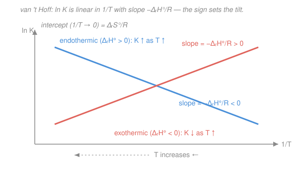

# Physical Chemistry · Lesson 2.7: Shifting equilibria — temperature, pressure, and van 't Hoff

> ⏱ ~15 min · Module 2: Phase equilibria, reactions, and solutions · Builds on: [2.6 Chemical equilibrium constant](02-06-chemical-equilibrium-constant.md) · Unlocks: [3.1 Rate laws and reaction order](03-01-rate-laws-reaction-order.md)

## Why this matters

You met Le Chatelier's principle in gen chem as a slogan: heat an endothermic reaction and it "shifts toward products." True — but *how much*? This lesson turns the slogan into a number. The **van 't Hoff equation** tells you exactly how the equilibrium constant $K$ moves when you change temperature, and — read backwards — lets you extract a reaction's enthalpy and entropy from nothing but $K$ measured at a few temperatures. It is the equilibrium twin of the Clausius–Clapeyron line from [2.2](02-02-clapeyron-clausius-clapeyron.md), and it closes Module 2 by making "which way does it go, and by how much" a calculation instead of a hand-wave.

## The idea

Two knobs sit on every gas-phase equilibrium: **temperature** and **pressure**. They act completely differently, and keeping them straight is the whole lesson.

**Temperature changes $K$ itself.** Heating supplies energy. An endothermic reaction ($\Delta_r H^\circ > 0$) *wants* that energy to climb its uphill enthalpy, so heating helps it along — $K$ grows, the mix tilts toward products. An exothermic reaction ($\Delta_r H^\circ < 0$) releases heat as it proceeds; pouring in more heat pushes back against it — $K$ shrinks. Think of temperature as changing the *exchange rate* between reactants and products.

**Pressure does not touch $K$.** $K$ depends on temperature and nothing else. What squeezing the container changes is the *composition* — how far along the reaction sits at that fixed $K$. If the two sides of the reaction have different numbers of gas molecules, compressing the system makes it relieve the squeeze by shifting toward the side with *fewer* gas molecules. Same $K$, new mixture. Miss this distinction and every equilibrium problem gets muddled.

## The formal version

**Start from the bridge equation** of [2.6](02-06-chemical-equilibrium-constant.md): the standard reaction Gibbs energy sets $K$,

$$\Delta_r G^\circ = -RT\ln K = \Delta_r H^\circ - T\,\Delta_r S^\circ,$$

with $R = 8.314\ \mathrm{J\,K^{-1}\,mol^{-1}}$, $T$ the absolute temperature (K), and $\Delta_r H^\circ$, $\Delta_r S^\circ$ the standard reaction enthalpy and entropy. Divide by $-RT$:

$$\ln K = -\frac{\Delta_r H^\circ}{R}\cdot\frac{1}{T} + \frac{\Delta_r S^\circ}{R}.$$

*In words: $\ln K$ is a straight line in the variable $1/T$* — slope $-\Delta_r H^\circ/R$, intercept $\Delta_r S^\circ/R$. Differentiate with respect to $T$ (treating $\Delta_r H^\circ$, $\Delta_r S^\circ$ as constant) to get the differential form, the **van 't Hoff equation**:

$$\boxed{\ \frac{d\ln K}{dT} = \frac{\Delta_r H^\circ}{RT^2}\ }$$

*In words: the fractional rate at which $K$ grows with temperature is fixed by the reaction enthalpy.* Because $RT^2 > 0$, the sign of $\Delta_r H^\circ$ is the sign of the slope: **endothermic $\Rightarrow$ $K$ rises with $T$; exothermic $\Rightarrow$ $K$ falls with $T$.** That is Le Chatelier, now quantitative.

**Integrate** between two temperatures, assuming $\Delta_r H^\circ$ is roughly constant over the range (it usually is across a few tens of kelvin):

$$\boxed{\ \ln\frac{K_2}{K_1} = -\frac{\Delta_r H^\circ}{R}\left(\frac{1}{T_2}-\frac{1}{T_1}\right)\ }$$

*In words: know $K$ at one temperature and the enthalpy, and you know $K$ at any other temperature.* This is the workhorse. Note the structural echo of Clausius–Clapeyron $\ln(p_2/p_1) = -\frac{\Delta_{\text{vap}}H}{R}(1/T_2-1/T_1)$ from [2.2](02-02-clapeyron-clausius-clapeyron.md) — a phase change is just an equilibrium, and both obey the same "$\ln$ of an equilibrium quantity is linear in $1/T$" law.

**Reading it backwards** is where van 't Hoff earns its keep. Measure $K$ at several temperatures, plot $\ln K$ against $1/T$: the slope hands you $\Delta_r H^\circ = -R\times(\text{slope})$ and the intercept hands you $\Delta_r S^\circ = R\times(\text{intercept})$. Both thermodynamic quantities extracted from equilibrium measurements alone — no calorimeter required.

**Pressure and composition.** $K$ is built from activities; for ideal gases, from partial pressures relative to the standard pressure $p^\circ = 1\ \mathrm{bar}$. Writing partial pressures as $p_i = x_i\,p$ (mole fraction times total pressure) for a reaction with $\Delta n_{\text{gas}} = \sum \nu_i$ (products minus reactants, gas species only):

$$K = \left(\prod_i x_i^{\nu_i}\right)\left(\frac{p}{p^\circ}\right)^{\Delta n_{\text{gas}}} \equiv K_x\left(\frac{p}{p^\circ}\right)^{\Delta n_{\text{gas}}}.$$

*In words: at fixed $T$, $K$ is frozen, so if you change the total pressure $p$ the mole-fraction part $K_x$ must move the opposite way to compensate — but only when $\Delta n_{\text{gas}} \neq 0$.* Compressing (raising $p$) with $\Delta n_{\text{gas}} > 0$ forces $K_x$ down, i.e. toward reactants — the side with fewer gas molecules. If $\Delta n_{\text{gas}} = 0$, pressure does nothing. **Adding inert gas** is the classic trap: at constant *volume* it changes nothing (partial pressures of the reactants are untouched); at constant *total pressure* it raises the volume, lowering each reactant's partial pressure — equivalent to expansion, so it shifts toward *more* gas molecules.

## Picture

## Worked examples

**Example 1 (mechanical — extrapolate $K$).** A reaction has $K_1 = 4.0$ at $T_1 = 300\ \mathrm{K}$ and $\Delta_r H^\circ = -40\ \mathrm{kJ/mol}$ (exothermic). Find $K$ at $T_2 = 350\ \mathrm{K}$.

$$\ln\frac{K_2}{K_1} = -\frac{\Delta_r H^\circ}{R}\left(\frac{1}{T_2}-\frac{1}{T_1}\right) = -\frac{-40000}{8.314}\left(\frac{1}{350}-\frac{1}{300}\right) = (4811)(-4.762\times10^{-4}) = -2.29.$$

So $K_2 = 4.0\,e^{-2.29} = 4.0\times0.101 = 0.40$. Heating an *exothermic* reaction dropped $K$ tenfold — it retreats toward reactants, exactly as Le Chatelier predicts, and now we have the number.

**Example 2 (why you'd care — extract $\Delta_r H^\circ$ and $\Delta_r S^\circ$ from data).** Suppose measurement gives $K = 3.3\times10^{-4}$ at $300\ \mathrm{K}$ and $K = 0.049$ at $400\ \mathrm{K}$. Slope first:

$$\ln\frac{K_2}{K_1} = \ln\frac{0.049}{3.3\times10^{-4}} = \ln(148) = 5.00 = -\frac{\Delta_r H^\circ}{R}\left(\frac{1}{400}-\frac{1}{300}\right) = -\frac{\Delta_r H^\circ}{R}(-8.33\times10^{-4}).$$

Thus $\Delta_r H^\circ = -R\cdot\dfrac{5.00}{-8.33\times10^{-4}} = 8.314\times6003 = 5.0\times10^{4}\ \mathrm{J/mol} = +50\ \mathrm{kJ/mol}$ (endothermic — $K$ climbed with $T$, consistent). For the intercept, use $\ln K = -\Delta_r H^\circ/(RT) + \Delta_r S^\circ/R$ at either point:

$$\frac{\Delta_r S^\circ}{R} = \ln K + \frac{\Delta_r H^\circ}{RT} = \ln(0.049) + \frac{50000}{8.314\times400} = -3.02 + 15.04 = 12.0,$$

so $\Delta_r S^\circ = 12.0\times8.314 = +100\ \mathrm{J\,K^{-1}\,mol^{-1}}$. Two measurements of a number you can read off a mixture, and out fall both thermodynamic quantities.

## Watch out

- **You might think pressure changes $K$.** It never does — $K = K(T)$ only. Pressure and inert gas shift the *composition* ($K_x$) at fixed $K$, and only when $\Delta n_{\text{gas}} \neq 0$. Keep "$K$ moves" (temperature) separate from "the mixture moves" (pressure).
- **You might drop the sign or the reciprocal.** In $\ln(K_2/K_1) = -\frac{\Delta_r H^\circ}{R}(1/T_2 - 1/T_1)$ the temperatures enter as $1/T$, and $1/T_2 < 1/T_1$ when $T_2 > T_1$. For endothermic ($\Delta_r H^\circ>0$) that product is positive, so $K_2 > K_1$ — sanity-check the direction against Le Chatelier every time.
- **You might forget van 't Hoff assumes constant $\Delta_r H^\circ$.** Over hundreds of kelvin, heat capacities make $\Delta_r H^\circ$ drift and the $\ln K$-vs-$1/T$ plot curves gently. For the ~50 K ranges here the straight-line form is fine.
- **Adding inert gas: constant $V$ vs constant $p$ are opposite.** At constant volume, nothing shifts (reactant partial pressures unchanged). At constant total pressure, it acts like expansion and shifts toward *more* gas molecules.

## One-liner

> $\ln K$ is a straight line in $1/T$ with slope $-\Delta_r H^\circ/R$ — so temperature sets $K$ (endothermic climbs, exothermic falls) while pressure only reshuffles composition toward fewer gas molecules.

## Problems

**P1 (🟢)** A gas-phase reaction has $K = 6.0$ at $310\ \mathrm{K}$ and $\Delta_r H^\circ = +52\ \mathrm{kJ/mol}$. Find $K$ at $360\ \mathrm{K}$, and say which way the equilibrium has shifted.

**P2 (🟡)** Equilibrium constants are measured at three temperatures: $K = 3.3\times10^{-4}$ at $300\ \mathrm{K}$, $K = 0.049$ at $400\ \mathrm{K}$, and $K = 1.0$ at $500\ \mathrm{K}$. Using the first two points, find $\Delta_r H^\circ$; using the third (the intercept), find $\Delta_r S^\circ$. Confirm the three points are collinear on a $\ln K$-vs-$1/T$ plot.

**P3 (🔴, Boss-2 rehearsal)** For $\ce{N2O4(g) <=> 2NO2(g)}$, $\Delta_r H^\circ = 57.2\ \mathrm{kJ/mol}$ and (from Lesson 2.6, via $\Delta_r G^\circ \approx 4.7\ \mathrm{kJ/mol}$) $K(298\ \mathrm{K}) = 0.15$. (a) Find $K(350\ \mathrm{K})$ and state the shift direction. (b) Compute $\Delta n_{\text{gas}}$ and confirm that lowering the total pressure *increases* the degree of dissociation — consistent with the pressure argument.

Solutions

**P1** Integrated van 't Hoff, $T_1 = 310$, $T_2 = 360$, $\Delta_r H^\circ = 52000\ \mathrm{J/mol}$:

$$\ln\frac{K_2}{K_1} = -\frac{52000}{8.314}\left(\frac{1}{360}-\frac{1}{310}\right) = -(6255)(-4.480\times10^{-4}) = 2.802.$$

So $K_2 = 6.0\,e^{2.802} = 6.0\times16.5 = 99$. *Endothermic, $K$ rose sharply — the equilibrium shifted toward products on heating.*

*Check.* $1/360 - 1/310 = 0.002778 - 0.003226 = -4.48\times10^{-4}$; times $-6255$ gives $+2.80$. Positive $\Rightarrow K_2 > K_1$, the correct Le Chatelier direction for $\Delta_r H^\circ > 0$. ✓

**P2** Slope from points 1 and 2 (as in Example 2): $\ln(0.049/3.3\times10^{-4}) = \ln(148) = 5.00$, and $1/400 - 1/300 = -8.33\times10^{-4}$, so

$$\Delta_r H^\circ = -R\cdot\frac{5.00}{-8.33\times10^{-4}} = 8.314\times6003 = +50\ \mathrm{kJ/mol}.$$

Intercept from the third point, where $\ln K = \ln(1.0) = 0$:

$$0 = -\frac{50000}{8.314\times500} + \frac{\Delta_r S^\circ}{R} \Rightarrow \frac{\Delta_r S^\circ}{R} = \frac{50000}{4157} = 12.03 \Rightarrow \Delta_r S^\circ = 12.03\times8.314 = +100\ \mathrm{J\,K^{-1}\,mol^{-1}}.$$

Collinearity: with slope $-\Delta_r H^\circ/R = -6013$ and intercept $\Delta_r S^\circ/R = 12.03$, predict $\ln K$ at $1/T = 1/300 = 3.333\times10^{-3}$: $-6013\times3.333\times10^{-3} + 12.03 = -20.04 + 12.03 = -8.01$, and $e^{-8.01} = 3.3\times10^{-4}$ ✓. At $1/400 = 2.5\times10^{-3}$: $-6013\times2.5\times10^{-3}+12.03 = -15.03+12.03 = -3.00$, $e^{-3.00} = 0.050$ ✓. All three lie on the line.

**P3** (a) Integrated van 't Hoff, $T_1 = 298$, $T_2 = 350$, $\Delta_r H^\circ = 57200\ \mathrm{J/mol}$:

$$\ln\frac{K_2}{K_1} = -\frac{57200}{8.314}\left(\frac{1}{350}-\frac{1}{298}\right) = -(6880)(-4.986\times10^{-4}) = 3.430.$$

$$K_2 = 0.15\,e^{3.430} = 0.15\times30.9 = 4.6.$$

Endothermic ($\Delta_r H^\circ > 0$), so heating from 298 to 350 K raised $K$ from 0.15 to about 4.6 — a thirtyfold jump *toward products* ($\ce{NO2}$). Warming pale $\ce{N2O4}$ deepens the brown $\ce{NO2}$ color, the classic demo.

(b) $\Delta n_{\text{gas}} = 2 - 1 = +1$: two moles of gas produced per one consumed. From the composition form, for $\ce{A <=> 2B}$ starting from pure $\ce{N2O4}$ with degree of dissociation $\alpha$,

$$K = \frac{4\alpha^2}{1-\alpha^2}\left(\frac{p}{p^\circ}\right).$$

At fixed $T$, $K$ is constant, so $\dfrac{4\alpha^2}{1-\alpha^2} = K\,\dfrac{p^\circ}{p}$: **lowering $p$ raises the right-hand side, forcing $\alpha$ up** — the gas dissociates more when expanded, shifting toward the side with more molecules ($\Delta n_{\text{gas}} = +1$). Fully consistent with the pressure argument. (Concretely at $298\ \mathrm{K}$, $p = p^\circ$: $4\alpha^2/(1-\alpha^2) = 0.15 \Rightarrow \alpha = 0.19$; halving the pressure gives $4\alpha^2/(1-\alpha^2) = 0.30 \Rightarrow \alpha = 0.26$.)

*Check.* $1/350 - 1/298 = 0.0028571 - 0.0033557 = -4.986\times10^{-4}$; $57200/8.314 = 6880$; product $+3.430$, $e^{3.430} = 30.9$ ✓.

## Flashback

**From Lesson 2.6 (Chemical equilibrium constant):** A gas-phase reaction has $\Delta_r G^\circ = +4.25\ \mathrm{kJ/mol}$ at $298\ \mathrm{K}$ (standard pressure $p^\circ = 1\ \mathrm{bar}$). (a) Compute $K$. (b) For the dissociation $\ce{A(g) <=> 2B(g)}$ starting from pure $\ce{A}$ at total pressure $p = p^\circ$, one has $K = 4\alpha^2/(1-\alpha^2)$ with $\alpha$ the degree of dissociation. Find $\alpha$. (Fresh variant — new numbers, same machinery.)

Solution

(a) From $\Delta_r G^\circ = -RT\ln K$,

$$\ln K = -\frac{\Delta_r G^\circ}{RT} = -\frac{4250}{8.314\times298} = -1.716 \Rightarrow K = e^{-1.716} = 0.18.$$

(b) Set $4\alpha^2/(1-\alpha^2) = 0.18$. Then $4\alpha^2 = 0.18(1-\alpha^2)$, so $4.18\,\alpha^2 = 0.18$, giving $\alpha^2 = 0.0431$ and

$$\alpha = 0.21.$$

*Check.* $\Delta_r G^\circ > 0 \Rightarrow K < 1$ ✓, so the mixture sits mostly on the reactant side and only about 21% of $\ce{A}$ dissociates — modest, as a small positive $\Delta_r G^\circ$ demands. ✓

## Connections

- **Backward:** this is [2.6](02-06-chemical-equilibrium-constant.md)'s $\Delta_r G^\circ = -RT\ln K$ differentiated — the temperature dependence hiding inside that one equation. Structurally it is [2.2](02-02-clapeyron-clausius-clapeyron.md)'s Clausius–Clapeyron line ($\ln p$ vs $1/T$) reborn for reactions ($\ln K$ vs $1/T$): a phase change is an equilibrium, and both are "$\ln$ is linear in $1/T$."
- **Forward:** [3.1 Rate laws](03-01-rate-laws-reaction-order.md) opens Module 3 on *kinetics* — how fast, not how far. The van 't Hoff plot ($\ln K$ vs $1/T$) has a near-identical cousin there, the **Arrhenius plot** ($\ln k$ vs $1/T$, slope $-E_a/R$); watching for the parallel is the fastest way to learn both. This lesson also feeds **Boss Problem 2** ($\ce{N2O4}$ dissociation across $T$ and $p$).
- **Sideways:** the underlying $\Delta_r H^\circ$, $\Delta_r S^\circ$ come from the stat-mech partition function (see [stat-mech](../../stat-mech/syllabus.md)) — Module 4 of this course will compute $K$ from molecular energy levels directly, closing the loop between the spectroscopic and the thermodynamic pictures of equilibrium.
