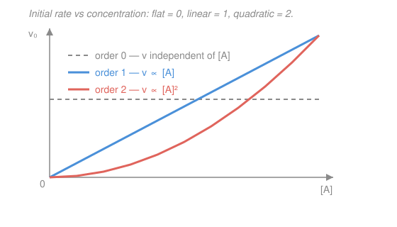

# Physical Chemistry · Lesson 3.1: Rate laws and reaction order

> ⏱ ~15 min · Module 3: Chemical kinetics · Builds on: [gen-chem 4.3 (a taste of kinetics)](../../general-chemistry/lessons/04-03-taste-of-kinetics.md), [2.7 (shifting equilibria, van 't Hoff)](02-07-shifting-equilibria-van-t-hoff.md) · Unlocks: [3.2 (integrated rate laws & half-lives)](03-02-integrated-rate-laws-half-lives.md)

## Why this matters

Modules 1–2 answered one question about a reaction: *will it go, and how far?* That's thermodynamics — $\Delta_r G$ and the equilibrium constant $K$ tell you the destination. But they say **nothing about the trip**. Diamond is thermodynamically unstable relative to graphite ($\Delta_r G < 0$), yet your ring survives the millennium because the *route* is impossibly slow. Kinetics is the missing half: **how fast** a reaction runs and **by what mechanism**. This lesson builds the vocabulary — reaction rate, rate law, order — and the two experimental tricks (initial rates, isolation) that let you *measure* a rate law rather than guess it. The rest of Module 3 (integrated laws, mechanisms, Arrhenius, catalysis) all hangs off this scaffold.

## The idea

A reaction rate is just a speed: how many moles per liter get consumed or produced each second. But there's a bookkeeping wrinkle. In $\ce{N2 + 3H2 -> 2NH3}$, hydrogen disappears three times faster than nitrogen and ammonia appears twice as fast — same reaction, three different "speeds." So we agree on *one* rate by dividing each concentration change by its stoichiometric coefficient. Now everyone reports the same number.

The deeper question is what *controls* that speed. Intuitively, the more crowded the reactants, the more often they collide, the faster they react — so rate should grow with concentration. The **rate law** is the exact functional form of that dependence, $v = k[\ce{A}]^m[\ce{B}]^n$. Here is the single most important, most counter-intuitive fact in all of kinetics, and the point where physical chemistry sharpens what gen chem told you:

> The exponents $m$ and $n$ are **not** the stoichiometric coefficients. They are measured in the lab, and often aren't even whole numbers.

Stoichiometry is the balanced *overall* equation — total accounting. The rate depends only on whatever collision actually forms the bottleneck (the slow step), which the overall equation hides. You cannot read the rate law off the balanced equation. You have to *do an experiment*, and the two workhorse experiments are the subject of the second half.

## The formal version

**Reaction rate.** For a general reaction $\ce{aA + bB -> cC + dD}$, the (unique) rate is

$$v = -\frac{1}{a}\frac{d[\ce{A}]}{dt} = -\frac{1}{b}\frac{d[\ce{B}]}{dt} = +\frac{1}{c}\frac{d[\ce{C}]}{dt} = +\frac{1}{d}\frac{d[\ce{D}]}{dt},$$

where $[\ce{X}]$ is molar concentration ($\mathrm{mol\,L^{-1}} = \mathrm{M}$) and $t$ is time (s). *In words: divide each species' rate of change by its coefficient — with a minus sign for reactants (being used up) and plus for products (being made) — and you get one shared number, in $\mathrm{M\,s^{-1}}$.*

**Rate law.** Experiment very often finds the rate is a product of concentration powers:

$$v = k\,[\ce{A}]^m[\ce{B}]^n.$$

- $m$ is the **order with respect to A**, $n$ the order with respect to B. *In words: how strongly the rate responds to each reactant — double $[\ce{A}]$ and the rate scales by $2^m$.*
- $m + n$ is the **overall order**.
- $k$ is the **rate constant** — the intrinsic speed at fixed temperature, independent of concentration (it carries the temperature dependence instead; that's Arrhenius, [3.4](03-04-arrhenius-transition-state-theory.md)).

$m$ and $n$ are determined **experimentally** and may be $0$, a fraction, or even negative. They are *not* $a$ and $b$.

**Units of $k$.** Because $v$ is always in $\mathrm{M\,s^{-1}}$, the units of $k$ must absorb the concentration powers. For overall order $p = m+n$,

$$[k] = \mathrm{M^{\,1-p}\,s^{-1}}.$$

*In words: 0th order → $\mathrm{M\,s^{-1}}$; 1st → $\mathrm{s^{-1}}$; 2nd → $\mathrm{M^{-1}\,s^{-1}}$; 3rd → $\mathrm{M^{-2}\,s^{-1}}$.* Reading the units of $k$ tells you the overall order at a glance.

**Molecularity vs. order.** A reaction *mechanism* is a sequence of **elementary steps** — single collision events. The **molecularity** of an elementary step is how many molecules collide in it (unimolecular, bimolecular, …) and it *is* an integer read straight from that step. For an elementary step *only*, order equals molecularity. But the **order** of the *overall* reaction is the empirical exponent above — a property of the measured rate law, not of any equation you wrote down. Molecularity is theory about one microscopic step; order is experiment about the whole reaction. (Mechanisms are [3.3](03-03-mechanisms-steady-state-pre-equilibrium.md).)

**How to measure a rate law.** Two standard methods:

1. **Method of initial rates.** Measure the initial rate $v_0$ (the slope at $t=0$, before products build up and complicate things) for several runs, changing *one* initial concentration at a time. Taking the *ratio* of two runs cancels $k$ and every unchanged concentration, isolating one exponent:
$$\frac{v_{0,2}}{v_{0,1}} = \left(\frac{[\ce{A}]_{0,2}}{[\ce{A}]_{0,1}}\right)^{m}.$$
*In words: if doubling $[\ce{A}]$ multiplies the rate by $2^m$, then a rate that doubles means $m=1$, quadruples means $m=2$, is unchanged means $m=0$.*

2. **Isolation method (pseudo-order).** Flood the flask with a large excess of every reactant except one. Those flooded concentrations barely change over the run, so they fold into an effective constant, and the rate law collapses to a dependence on the single "isolated" reactant — whose order you then read off easily. This is how you untangle a multi-reactant law one exponent at a time (worked in P3).

## Picture

The shape of "rate vs. concentration" *is* the order. Flat means the reactant doesn't appear in the rate law ($m=0$); a straight line through the origin means first order ($m=1$); an upward-curving parabola means second order ($m=2$). The method of initial rates is just reading which curve your data lie on.

## Worked examples

**Example 1 (units and orders from a given law).** For $\ce{2NO + Cl2 -> 2NOCl}$ the measured rate law is $v = k[\ce{NO}]^2[\ce{Cl2}]$. Order in NO is 2, order in $\ce{Cl2}$ is 1, overall order $2+1 = 3$. Note this is *not* what the coefficients (2 and 1) would suggest by coincidence here they match in $\ce{Cl2}$ but the point is you were *told* the law from experiment. Units of $k$: overall order $p=3$, so $[k] = \mathrm{M^{1-3}\,s^{-1}} = \mathrm{M^{-2}\,s^{-1}}$. Check: $k[\ce{NO}]^2[\ce{Cl2}] = (\mathrm{M^{-2}s^{-1}})(\mathrm{M^2})(\mathrm{M}) = \mathrm{M\,s^{-1}}$ ✓.

**Example 2 (a full initial-rates table).** For $\ce{A + B -> P}$, three runs at fixed temperature:

| Run | $[\ce{A}]_0$ (M) | $[\ce{B}]_0$ (M) | $v_0$ ($\mathrm{M\,s^{-1}}$) |
|----|----|----|----|
| 1 | 0.10 | 0.10 | $2.0\times10^{-3}$ |
| 2 | 0.20 | 0.10 | $8.0\times10^{-3}$ |
| 3 | 0.10 | 0.20 | $4.0\times10^{-3}$ |

*Order in A:* compare runs 1→2, where only $[\ce{A}]$ changes (doubles). The rate goes $2.0\times10^{-3} \to 8.0\times10^{-3}$, a factor of **4**. Since $2^m = 4$, we get $m = 2$.

*Order in B:* compare runs 1→3, where only $[\ce{B}]$ doubles. The rate goes $2.0\times10^{-3} \to 4.0\times10^{-3}$, a factor of **2**. Since $2^n = 2$, we get $n = 1$.

So $v = k[\ce{A}]^2[\ce{B}]$, overall order 3. Solve for $k$ from any run (use run 1):

$$k = \frac{v_0}{[\ce{A}]_0^2[\ce{B}]_0} = \frac{2.0\times10^{-3}}{(0.10)^2(0.10)} = \frac{2.0\times10^{-3}}{1.0\times10^{-3}} = 2.0\ \mathrm{M^{-2}\,s^{-1}}.$$

Check against run 2: $k[\ce{A}]^2[\ce{B}] = 2.0\,(0.20)^2(0.10) = 2.0\,(0.040)(0.10) = 8.0\times10^{-3}$ ✓. The stoichiometry ($1:1:1$) told us none of these exponents — the data did.

## Watch out

- **You might think orders come from the balanced equation.** Almost never — that's the gen-chem-to-p-chem upgrade. $m,n$ are experimental. They equal the coefficients *only* for a genuinely elementary one-step reaction, and you can't know a reaction is elementary just by looking at it.
- **You might treat $k$ as fixed forever.** $k$ is constant in *concentration* (that's the whole point of factoring it out), but it depends strongly on temperature — roughly exponentially (Arrhenius, [3.4](03-04-arrhenius-transition-state-theory.md)). "Rate constant" means constant at fixed $T$.
- **You might forget the stoichiometric $1/a$ when relating species.** $-d[\ce{A}]/dt$ and $-d[\ce{B}]/dt$ are generally *different* numbers; only after dividing by coefficients do they agree. Reporting a rate without saying which species (or without the coefficient) is ambiguous.

## One-liner

> Thermodynamics says *whether*; kinetics says *how fast* — through a rate law $v = k[\ce{A}]^m[\ce{B}]^n$ whose orders you must *measure*, never read off the balanced equation.

## Problems

**P1 (🟢)** A reaction has the experimentally determined rate law $v = k[\ce{NO}]^2[\ce{H2}]$. State the order in each reactant, the overall order, and the units of $k$.

**P2 (🟡)** For $\ce{A + B -> P}$, initial-rate data at fixed temperature:

| Run | $[\ce{A}]_0$ (M) | $[\ce{B}]_0$ (M) | $v_0$ ($\mathrm{M\,s^{-1}}$) |
|----|----|----|----|
| 1 | 0.050 | 0.10 | $1.5\times10^{-3}$ |
| 2 | 0.10 | 0.10 | $3.0\times10^{-3}$ |
| 3 | 0.050 | 0.20 | $1.5\times10^{-3}$ |

Determine the order in A, the order in B, the overall order, and compute $k$ with units.

**P3 (🔴)** A reaction $\ce{A + B -> P}$ is genuinely second order overall: $v = k[\ce{A}][\ce{B}]$. An experimenter runs it with $[\ce{B}]_0 = 1.0\ \mathrm{M}$ and $[\ce{A}]_0 = 1.0\times10^{-3}\ \mathrm{M}$. Explain why the reaction *appears* first order in A, write the observed rate law $v = k'[\ce{A}]$, and give the relation between the observed $k'$ and the true $k$. If $k = 0.25\ \mathrm{M^{-1}\,s^{-1}}$, what is $k'$?

Solutions

**P1** Order in $\ce{NO}$ is 2; order in $\ce{H2}$ is 1; overall order $= 2 + 1 = 3$. Units: for overall order $p=3$, $[k] = \mathrm{M^{1-3}\,s^{-1}} = \mathrm{M^{-2}\,s^{-1}}$. Verify: $(\mathrm{M^{-2}s^{-1}})(\mathrm{M^2})(\mathrm{M}) = \mathrm{M\,s^{-1}}$, the correct units for a rate ✓.

**P2** *Order in A* (runs 1→2, $[\ce{B}]$ fixed, $[\ce{A}]$ doubles): rate goes $1.5\times10^{-3}\to 3.0\times10^{-3}$, a factor of 2. $2^m = 2 \Rightarrow m = 1$.

*Order in B* (runs 1→3, $[\ce{A}]$ fixed, $[\ce{B}]$ doubles): rate is *unchanged* ($1.5\times10^{-3}$ both), factor of 1. $2^n = 1 \Rightarrow n = 0$ — the reaction is **zero order in B**; B doesn't appear in the rate law.

So $v = k[\ce{A}]$, overall order 1. Solve for $k$ using run 1:

$$k = \frac{v_0}{[\ce{A}]_0} = \frac{1.5\times10^{-3}}{0.050} = 0.030\ \mathrm{s^{-1}}.$$

Check with run 2: $k[\ce{A}] = 0.030\times0.10 = 3.0\times10^{-3}$ ✓. Units $\mathrm{s^{-1}}$ match overall order 1. (A zero-order dependence is common when B saturates a surface or catalyst — the rate can't respond to more of it.)

**P3** The true rate is $v = k[\ce{A}][\ce{B}]$. Because $[\ce{B}]_0 = 1.0\ \mathrm{M}$ is a **thousand-fold excess** over $[\ce{A}]_0 = 1.0\times10^{-3}\ \mathrm{M}$, when A is fully consumed it can only have used up $\approx 1.0\times10^{-3}\ \mathrm{M}$ of B — a $0.1\%$ dent. So $[\ce{B}] \approx [\ce{B}]_0$ stays essentially constant throughout. Group the (now nearly constant) $k[\ce{B}]$ into a single effective constant:

$$v = \underbrace{\left(k[\ce{B}]_0\right)}_{k'}[\ce{A}] = k'[\ce{A}].$$

The rate now depends only on $[\ce{A}]$ to the first power, so the reaction *looks* first order — this is a **pseudo-first-order** reaction, and $k'$ is the **pseudo-first-order rate constant**. The relation is

$$k' = k\,[\ce{B}]_0 \qquad\Longleftrightarrow\qquad k = \frac{k'}{[\ce{B}]_0}.$$

This is the isolation method in action: you measure the easy first-order $k'$, then divide by the known flooded concentration to recover the true second-order $k$. Numerically,

$$k' = k[\ce{B}]_0 = (0.25\ \mathrm{M^{-1}\,s^{-1}})(1.0\ \mathrm{M}) = 0.25\ \mathrm{s^{-1}}.$$

Note the units correctly shift from $\mathrm{M^{-1}\,s^{-1}}$ (2nd order) to $\mathrm{s^{-1}}$ (apparent 1st order) — a good sanity check that the flooding really did lower the apparent order by one.

## Flashback

**From Lesson 2.7 (Shifting equilibria, van 't Hoff):** An exothermic reaction with $\Delta_r H^\circ = -52\ \mathrm{kJ/mol}$ has equilibrium constant $K = 4.3$ at $298\ \mathrm{K}$. Estimate $K$ at $350\ \mathrm{K}$, and say in one line how this thermodynamic $K$ differs in meaning from the kinetic rate constant $k$ of this lesson. (Fresh variant — new numbers.)

Solution

Use the integrated van 't Hoff equation (constant $\Delta_r H^\circ$):

$$\ln\frac{K_2}{K_1} = -\frac{\Delta_r H^\circ}{R}\left(\frac{1}{T_2} - \frac{1}{T_1}\right).$$

With $\Delta_r H^\circ = -5.2\times10^{4}\ \mathrm{J/mol}$, $R = 8.314\ \mathrm{J\,K^{-1}\,mol^{-1}}$, $T_1 = 298\ \mathrm{K}$, $T_2 = 350\ \mathrm{K}$:

$$\frac{1}{T_2} - \frac{1}{T_1} = \frac{1}{350} - \frac{1}{298} = 2.857\times10^{-3} - 3.356\times10^{-3} = -4.99\times10^{-4}\ \mathrm{K^{-1}},$$

$$\ln\frac{K_2}{K_1} = -\frac{-5.2\times10^{4}}{8.314}\,(-4.99\times10^{-4}) = (6.25\times10^{3})(-4.99\times10^{-4}) = -3.12.$$

So $K_2/K_1 = e^{-3.12} = 0.044$, giving $K_2 = 4.3\times0.044 \approx 0.19$. Heating an exothermic reaction *lowers* $K$ (Le Chatelier: added heat pushes the equilibrium back toward reactants) ✓.

*The distinction:* $K$ is a **thermodynamic** quantity — it fixes the *equilibrium position*, where the reaction stops (the "whether/how far"). The rate constant $k$ is a **kinetic** quantity — it sets *how fast* you approach that equilibrium (the "how fast"). A reaction can have a huge $K$ (strongly favorable) yet a tiny $k$ (glacially slow), like diamond → graphite. They meet at exactly one place, previewed here and made precise in [3.3](03-03-mechanisms-steady-state-pre-equilibrium.md): at equilibrium the forward and reverse rates are equal, so $K = k_{\text{forward}}/k_{\text{reverse}}$ — thermodynamics as the ratio of two kinetics.

## Connections

- **Backward:** this sharpens [gen-chem 4.3 (a taste of kinetics)](../../general-chemistry/lessons/04-03-taste-of-kinetics.md) — same rate-law idea, but now with the firm insistence that orders are *measured*, plus the initial-rates and isolation methods to measure them. It's the kinetic complement to Modules 1–2's thermodynamics: [2.7](02-07-shifting-equilibria-van-t-hoff.md) told you where equilibrium sits and how it moves with $T$; this lesson governs the journey there.
- **Forward:** [3.2 (integrated rate laws & half-lives)](03-02-integrated-rate-laws-half-lives.md) integrates these differential rate laws to get $[\ce{A}](t)$ explicitly (and half-lives); [3.3](03-03-mechanisms-steady-state-pre-equilibrium.md) explains *why* the orders come out as they do, from elementary-step mechanisms — and pins down $K = k_f/k_r$; [3.4](03-04-arrhenius-transition-state-theory.md) gives $k$ its temperature law.
- **Sideways:** the isolation/pseudo-order trick — freezing a variable by making it effectively constant — is the same move as the small-angle truncation in mechanics or holding one variable fixed in a partial derivative like [1.4](01-04-fundamental-equations-maxwell-relations.md)'s $\left(\partial G/\partial p\right)_T$: simplify a hard multi-variable problem by pinning all but one axis.
