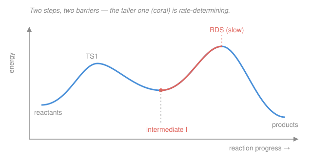

# Physical Chemistry · Lesson 3.3: Mechanisms — steady-state and pre-equilibrium

> ⏱ ~15 min · Module 3: Chemical kinetics · Builds on: [3.2 Integrated rate laws & half-lives](03-02-integrated-rate-laws-half-lives.md), [3.1 Rate laws & reaction order](03-01-rate-laws-reaction-order.md) · Unlocks: [3.4 Arrhenius & transition-state theory](03-04-arrhenius-transition-state-theory.md)

## Why this matters

A balanced equation like $2\ce{NO} + \ce{O2} -> 2\ce{NO2}$ tells you nothing about *how* the reaction happens — three molecules almost never collide at once. What actually occurs is a hidden **sequence of elementary steps**, and the rate law you measured back in [3.1](03-01-rate-laws-reaction-order.md) is the fingerprint that sequence leaves behind. This lesson is where kinetics turns detective: you take an observed rate law and reverse-engineer the molecular choreography. The two tools you'll build — **pre-equilibrium** and the **steady-state approximation** — are the standard machinery for every mechanism in chemistry, from ozone in the stratosphere to the enzyme kinetics of [3.5](03-05-catalysis-enzyme-kinetics.md).

## The idea

An **elementary step** is a reaction that happens exactly as written — the molecules in front of the arrow actually meet and react in one event. For these steps *only*, there's a gift: the rate is just the rate constant times the concentration of each reactant, and the exponents are simply how many molecules collide (the **molecularity**). No experiment needed. A bimolecular step $\ce{A + B -> \text{products}}$ has rate $k[\ce{A}][\ce{B}]$, period.

Chain a few elementary steps together and you get a **mechanism**. Along the way you often create an **intermediate**: a species that gets made in one step and eaten in a later one, so it never appears in the overall balanced equation (and rarely builds up to a measurable amount). Now, if one step is much slower than the rest, traffic backs up behind it — that **rate-determining step (RDS)** throttles the whole reaction, the way the narrowest section of pipe sets the flow. The overall rate is essentially the rate of that slow step.

The catch: the slow step's rate usually depends on an intermediate's concentration, and you can't put an intermediate in a rate law — it's not something you mix into the flask. So you need a way to express that intermediate in terms of the real reactants. That's the entire job of the two approximations below.

## The formal version

Take the general two-step mechanism with a reactive intermediate $\ce{I}$:

$$\ce{A + B <=>[k_1][k_{-1}] I} \qquad (\text{step 1, fast and reversible})$$
$$\ce{I + C ->[k_2] P} \qquad (\text{step 2, slow})$$

The slow step sets the pace, so the **rate** is

$$\text{rate} = k_2[\ce{I}][\ce{C}].$$

*In words: the reaction goes only as fast as its slowest step lets it.* But $[\ce{I}]$ isn't measurable — we need to eliminate it. Two routes:

**Pre-equilibrium approximation.** If step 1 is *much* faster than step 2 in both directions, $\ce{I}$ equilibrates with $\ce{A}$ and $\ce{B}$ long before the trickle through step 2 disturbs it. Set the forward and reverse rates of step 1 equal:

$$k_1[\ce{A}][\ce{B}] = k_{-1}[\ce{I}] \;\Longrightarrow\; [\ce{I}] = \frac{k_1}{k_{-1}}[\ce{A}][\ce{B}] = K[\ce{A}][\ce{B}], \qquad K \equiv \frac{k_1}{k_{-1}}.$$

*In words: a fast reversible step behaves like an equilibrium, and its equilibrium constant is the ratio of forward to reverse rate constants.* (That $K = k_1/k_{-1}$ is the kinetic route to the same equilibrium constant you met thermodynamically in [2.6](02-06-chemical-equilibrium-constant.md).) Substitute:

$$\boxed{\;\text{rate} = k_2 K[\ce{A}][\ce{B}][\ce{C}] = \frac{k_1 k_2}{k_{-1}}[\ce{A}][\ce{B}][\ce{C}].\;}$$

**Steady-state approximation (SSA).** Weaker and more general: assume the intermediate is so reactive and scarce that its concentration barely changes — as fast as it's made, it's destroyed. So its net rate of change is $\approx 0$:

$$\frac{d[\ce{I}]}{dt} = \underbrace{k_1[\ce{A}][\ce{B}]}_{\text{made}} - \underbrace{k_{-1}[\ce{I}]}_{\text{unmade}} - \underbrace{k_2[\ce{I}][\ce{C}]}_{\text{consumed}} \approx 0.$$

*In words: after a brief start-up, the intermediate sits at a near-constant low level — creation and destruction balance.* Solve for $[\ce{I}]$:

$$[\ce{I}] = \frac{k_1[\ce{A}][\ce{B}]}{k_{-1} + k_2[\ce{C}]}, \qquad\Longrightarrow\qquad \text{rate} = k_2[\ce{I}][\ce{C}] = \frac{k_1 k_2 [\ce{A}][\ce{B}][\ce{C}]}{k_{-1} + k_2[\ce{C}]}.$$

Notice: when the reverse of step 1 dominates its consumption, $k_{-1} \gg k_2[\ce{C}]$, the denominator collapses to $k_{-1}$ and SSA **reduces to the pre-equilibrium answer**. Pre-equilibrium is the special case of SSA where the intermediate mostly falls back rather than going forward.

**Testing a mechanism.** A proposed mechanism is only a *candidate*: derive its predicted rate law and compare to the measured one. Match is necessary but not sufficient — several mechanisms can give the same law — so a mismatch **kills** a mechanism, while agreement merely lets it survive.

## Picture

## Worked examples

**Example 1 (slow step first — read the rate law straight off).** Iodide-catalyzed decomposition of hydrogen peroxide, $2\ce{H2O2} -> 2\ce{H2O} + \ce{O2}$, is proposed to go:

$$\ce{H2O2 + I- ->[k_1] H2O + IO-} \quad (\text{slow}), \qquad \ce{H2O2 + IO- ->[k_2] H2O + O2 + I-} \quad (\text{fast}).$$

The slow step is *first*, and everything it needs ($\ce{H2O2}$, $\ce{I-}$) is a genuine reactant — no intermediate to eliminate. So the rate is simply that elementary step's rate:

$$\text{rate} = k_1[\ce{H2O2}][\ce{I-}].$$

Second order overall; $\ce{IO-}$ is the intermediate (made then consumed, absent from the overall equation) and $\ce{I-}$ is a catalyst (consumed in step 1, regenerated in step 2). The measured law is indeed first order in each of $\ce{H2O2}$ and $\ce{I-}$ — the mechanism survives.

**Example 2 (fast equilibrium first — why the algebra earns its keep).** Ozone decomposition $2\ce{O3} -> 3\ce{O2}$ is proposed as

$$\ce{O3 <=>[k_1][k_{-1}] O2 + O} \quad (\text{fast}), \qquad \ce{O + O3 ->[k_2] 2O2} \quad (\text{slow}).$$

Pre-equilibrium on step 1, with intermediate the oxygen atom $\ce{O}$:

$$k_1[\ce{O3}] = k_{-1}[\ce{O2}][\ce{O}] \;\Longrightarrow\; [\ce{O}] = \frac{k_1}{k_{-1}}\frac{[\ce{O3}]}{[\ce{O2}]}.$$

Feed into the slow step:

$$\text{rate} = k_2[\ce{O}][\ce{O3}] = \frac{k_1 k_2}{k_{-1}}\frac{[\ce{O3}]^2}{[\ce{O2}]}.$$

The rate law carries $[\ce{O2}]$ in the **denominator** — the product *inhibits* its own reaction, because more $\ce{O2}$ drags step 1 back to the left and starves the slow step of $\ce{O}$ atoms. You could never have guessed that $-1$ order in $\ce{O2}$ from the balanced equation; only the mechanism predicts it, and its experimental confirmation is exactly what makes the mechanism believable.

## Watch out

- **You might read exponents off the balanced equation.** Only for a single **elementary** step does molecularity equal order. For an overall reaction the orders come from the *mechanism* (or experiment) — that's the whole point of [3.1](03-01-rate-laws-reaction-order.md). A termolecular overall reaction almost never means three-body collisions.
- **You might leave an intermediate in the final rate law.** A rate law may only contain species you can actually put in the flask — reactants, products, catalysts. If $[\ce{I}]$ survives your algebra, you haven't finished: apply pre-equilibrium or SSA to eliminate it.
- **Don't confuse the two approximations.** Pre-equilibrium needs step 1 fast *both ways*; SSA only needs the intermediate to stay low and roughly constant. SSA is the safer default and *contains* pre-equilibrium as the $k_{-1} \gg k_2[\ce{C}]$ limit — never the other way around.

## One-liner

> The slowest elementary step throttles the rate; pre-equilibrium ($[\ce{I}] = K[\ce{reactants}]$) and the steady-state approximation ($d[\ce{I}]/dt \approx 0$) are the two ways to evict the intermediate and turn a mechanism into a testable rate law.

## Problems

**P1 (🟢)** A reaction $\ce{A + 2B -> D}$ is proposed to proceed by

$$\ce{A + B ->[k_1] X} \quad (\text{slow}), \qquad \ce{X + B ->[k_2] D} \quad (\text{fast}).$$

Write the predicted rate law and give the overall order. Which species is the intermediate?

**P2 (🟡)** A reaction $\ce{A2 + B -> \text{products}}$ is proposed as a fast pre-equilibrium followed by a slow step:

$$\ce{A2 <=>[k_1][k_{-1}] 2A} \quad (\text{fast}), \qquad \ce{A + B ->[k_2] \text{products}} \quad (\text{slow}).$$

Using the pre-equilibrium approximation with $K = k_1/k_{-1}$, derive the rate law and state the overall order. (Watch the stoichiometry of step 1.)

**P3 (🔴 — Boss-3 rehearsal)** The reaction $2\ce{NO} + \ce{O2} -> 2\ce{NO2}$ is proposed as

$$\ce{2NO <=>[k_1][k_{-1}] N2O2} \quad (\text{fast}), \qquad \ce{N2O2 + O2 ->[k_2] 2NO2} \quad (\text{slow}).$$

(a) Derive the rate law by **pre-equilibrium**. (b) Derive it again by the **steady-state approximation** on $\ce{N2O2}$. (c) Show the overall reaction is third order, and state the limit in which the two derivations agree.

Solutions

**P1** The slow step is first and uses only real reactants, so the rate is that step's elementary rate:

$$\text{rate} = k_1[\ce{A}][\ce{B}].$$

Overall order $= 1 + 1 = 2$ (first order in $\ce{A}$, first in $\ce{B}$; the second $\ce{B}$ enters only in the fast step and never appears in the rate law). The intermediate is $\ce{X}$ — made in step 1, consumed in step 2, absent from the overall equation.

**P2** Pre-equilibrium on the fast step $\ce{A2 <=> 2A}$. Set forward rate $=$ reverse rate. Because two $\ce{A}$ are produced, the reverse step is bimolecular in $\ce{A}$:

$$k_1[\ce{A2}] = k_{-1}[\ce{A}]^2 \;\Longrightarrow\; [\ce{A}]^2 = \frac{k_1}{k_{-1}}[\ce{A2}] = K[\ce{A2}] \;\Longrightarrow\; [\ce{A}] = K^{1/2}[\ce{A2}]^{1/2}.$$

The slow step gives $\text{rate} = k_2[\ce{A}][\ce{B}]$; substitute:

$$\boxed{\;\text{rate} = k_2 K^{1/2}[\ce{A2}]^{1/2}[\ce{B}].\;}$$

Overall order $= \tfrac12 + 1 = \tfrac32$ — a **half-integer order**, the classic fingerprint of a reactant that dissociates in a fast pre-equilibrium before the rate-determining step.

**P3 (a) Pre-equilibrium.** The intermediate is $\ce{N2O2}$. Equilibrate the fast step ($2\ce{NO} \rightleftharpoons \ce{N2O2}$, so the forward step is bimolecular in $\ce{NO}$):

$$k_1[\ce{NO}]^2 = k_{-1}[\ce{N2O2}] \;\Longrightarrow\; [\ce{N2O2}] = \frac{k_1}{k_{-1}}[\ce{NO}]^2.$$

The slow step sets the rate:

$$\text{rate} = k_2[\ce{N2O2}][\ce{O2}] = \frac{k_1 k_2}{k_{-1}}[\ce{NO}]^2[\ce{O2}].$$

**(b) Steady state.** Write the net rate of change of $[\ce{N2O2}]$ and set it to zero:

$$\frac{d[\ce{N2O2}]}{dt} = k_1[\ce{NO}]^2 - k_{-1}[\ce{N2O2}] - k_2[\ce{N2O2}][\ce{O2}] \approx 0.$$

Solve for the intermediate:

$$[\ce{N2O2}] = \frac{k_1[\ce{NO}]^2}{k_{-1} + k_2[\ce{O2}]}.$$

Then

$$\text{rate} = k_2[\ce{N2O2}][\ce{O2}] = \frac{k_1 k_2 [\ce{NO}]^2[\ce{O2}]}{k_{-1} + k_2[\ce{O2}]}.$$

**(c) Order and limit.** In the pre-equilibrium result $\text{rate} = \dfrac{k_1 k_2}{k_{-1}}[\ce{NO}]^2[\ce{O2}]$ the exponents sum to $2 + 1 = 3$: **third order overall** (second in $\ce{NO}$, first in $\ce{O2}$), with observed constant $k_{\text{obs}} = k_1 k_2/k_{-1}$.

The two derivations agree when the SSA denominator loses its $k_2[\ce{O2}]$ term, i.e. when

$$k_{-1} \gg k_2[\ce{O2}].$$

*In words: the $\ce{N2O2}$ intermediate falls back to $2\ce{NO}$ far more often than it reacts with $\ce{O2}$* — exactly the "fast reversible step reaches equilibrium before the slow step" condition. Then $k_{-1} + k_2[\ce{O2}] \to k_{-1}$ and the SSA rate becomes $\tfrac{k_1 k_2}{k_{-1}}[\ce{NO}]^2[\ce{O2}]$, identical to pre-equilibrium. (In the opposite limit $k_2[\ce{O2}] \gg k_{-1}$, the rate $\to k_1[\ce{NO}]^2$: the first step becomes rate-determining and the $\ce{O2}$ dependence disappears.)

## Flashback

**From Lesson 3.2 (Integrated rate laws & half-lives):** A reactant decays by **first-order** kinetics with half-life $t_{1/2} = 88\ \mathrm{s}$. (a) Find the rate constant $k$. (b) What fraction of the reactant remains after $300\ \mathrm{s}$? (Fresh variant — different numbers, no graph.)

Solution

For a first-order reaction the half-life is constant and independent of starting concentration: $t_{1/2} = \dfrac{\ln 2}{k}$.

**(a)** $\displaystyle k = \frac{\ln 2}{t_{1/2}} = \frac{0.693}{88\ \mathrm{s}} = 7.9\times10^{-3}\ \mathrm{s^{-1}}.$

**(b)** The integrated first-order law is $[\ce{A}]/[\ce{A}]_0 = e^{-kt}$:

$$\frac{[\ce{A}]}{[\ce{A}]_0} = e^{-(7.9\times10^{-3})(300)} = e^{-2.36} \approx 0.094,$$

so about **9.4 %** remains.

*Check.* $300\ \mathrm{s}$ is $300/88 \approx 3.4$ half-lives, and $(1/2)^{3.4} = 2^{-3.4} \approx 0.094$ ✓ — same answer, confirming the constant-half-life picture of first-order decay from [3.2](03-02-integrated-rate-laws-half-lives.md).

## Connections

- **Backward:** the observed rate laws and orders you're now *predicting* are exactly the quantities [3.1](03-01-rate-laws-reaction-order.md) taught you to *measure*, and the exponential decay of the Flashback is [3.2](03-02-integrated-rate-laws-half-lives.md). The equilibrium constant $K = k_1/k_{-1}$ links kinetics to the thermodynamic $K$ of [2.6](02-06-chemical-equilibrium-constant.md) — a fast step's forward/reverse balance *is* an equilibrium.
- **Forward:** [3.4](03-04-arrhenius-transition-state-theory.md) gives each elementary $k$ a temperature dependence (Arrhenius) and a molecular picture of that rate-determining barrier in the figure; [3.5](03-05-catalysis-enzyme-kinetics.md) applies the steady-state approximation to the enzyme–substrate intermediate to derive Michaelis–Menten. The $2\ce{NO}+\ce{O2}$ derivation here is the direct rehearsal for **Boss Problem 3**.
- **Sideways:** this is the same "eliminate the fast, hidden variable" move that appears whenever one process is much faster than another — the quasi-steady-state idea recurs in the gen-chem [taste of kinetics](../../general-chemistry/lessons/04-03-taste-of-kinetics.md) and, more broadly, in adiabatic elimination across dynamical systems.
