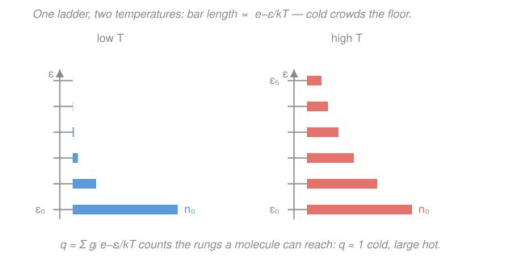

# Physical Chemistry · Lesson 4.1: The Boltzmann distribution and the molecular partition function

> ⏱ ~15 min · Module 4: Statistical thermodynamics and molecular spectroscopy · Builds on: [1.2 Entropy and the second law](01-02-entropy-second-law.md), [stat-mech](../../stat-mech/syllabus.md) · Unlocks: [4.2 From partition functions to thermodynamics](04-02-partition-functions-to-thermodynamics.md)

## Why this matters

Module 1 built thermodynamics from the top down: energy, entropy, and free energy as macroscopic bookkeeping, with atoms nowhere in sight. But a real sample is $10^{23}$ molecules, each sitting in one of a ladder of quantized energy levels (the box, oscillator, and rotor levels you will meet in [4.3](04-03-molecular-energy-levels-box-oscillator-rotor.md)). This lesson is the bridge: two ideas — the **Boltzmann distribution** (how molecules spread over their levels at temperature $T$) and the **partition function** $q$ (a single number that counts the levels they can reach) — let you compute *every* thermodynamic quantity from molecular structure. Get $q$ and you get $U$, $S$, $G$, equilibrium constants, heat capacities, and spectral intensities. It is the most important object in the second half of this course.

## The idea

Give a crowd of molecules a fixed amount of energy to share and let them collide freely. They don't all pile into the lowest level, and they don't spread out evenly either. Instead they settle into the **single most probable** distribution — the one realizable in the overwhelmingly largest number of ways, exactly the microstate-counting logic behind entropy in [1.2](01-02-entropy-second-law.md). Working that maximization out (subject to fixed total energy and fixed molecule count) forces one clean answer: the population of a level falls off **exponentially** with its energy.

Why exponential? Because probability has to *multiply* when energies *add*. Climbing two rungs of energy $\varepsilon$ each should cost the same population-factor twice over — and the only function where $f(\varepsilon_1+\varepsilon_2)=f(\varepsilon_1)f(\varepsilon_2)$ is the exponential. The rate of the falloff is set by temperature: the natural energy scale is $k_BT$ (about $4.1\times10^{-21}\ \mathrm{J}$, or $\sim 200\ \mathrm{cm^{-1}}$, at room temperature). A level much *higher* than $k_BT$ is nearly empty; a level *within* $k_BT$ is comfortably populated. Heat the sample and $k_BT$ grows, so molecules climb higher up the ladder — that is the whole story of the figure below.

The **partition function** $q$ is then just the sum of all those exponential weights. It answers one question in one number: *how many energy levels can a molecule actually get to at this temperature?* Cold sample, $q\approx 1$ (everyone stuck on the ground floor); hot sample, $q$ is large (many rungs in play).

## The formal version

**The Boltzmann distribution.** At thermal equilibrium at temperature $T$, the fraction of molecules occupying a level of energy $\varepsilon_i$ and degeneracy $g_i$ is

$$\frac{n_i}{N} = \frac{g_i\, e^{-\varepsilon_i/k_BT}}{q} = \frac{g_i\, e^{-\beta\varepsilon_i}}{q}, \qquad \beta \equiv \frac{1}{k_BT}.$$

*In words: the population of a level is proportional to its degeneracy times its Boltzmann factor $e^{-\varepsilon_i/k_BT}$, normalized so the fractions sum to one.* Here $N$ is the total number of molecules, $n_i$ the number in level $i$, $g_i$ the **degeneracy** (how many distinct states share energy $\varepsilon_i$), $k_B=1.381\times10^{-23}\ \mathrm{J/K}$, and $\beta$ is the "coldness" — large when cold, small when hot. Energies are measured from the ground level, $\varepsilon_0 \equiv 0$.

**The molecular partition function.** The normalizing sum is

$$\boxed{\,q = \sum_{i}\, g_i\, e^{-\varepsilon_i/k_BT} = \sum_i g_i\, e^{-\beta\varepsilon_i}\,}$$

where the sum runs over **energy levels** $i$ (each already weighted by its degeneracy $g_i$). Equivalently, summing over individual **states** drops the $g_i$: $q=\sum_{\text{states}} e^{-\beta\varepsilon}$. *In words: $q$ is the degeneracy-weighted total of every Boltzmann factor — the effective number of thermally accessible states.*

The two limits pin down its meaning:

- **As $T\to 0$** ($\beta\to\infty$): every $e^{-\beta\varepsilon_i}\to 0$ except the ground level ($\varepsilon_0=0$, factor $=1$), so $q\to g_0$. Only the ground state is reachable.
- **As $T\to\infty$** ($\beta\to 0$): every $e^{-\beta\varepsilon_i}\to 1$, so $q\to \sum_i g_i =$ the *total number of states*. Everything is accessible.

So $q$ slides from $g_0$ (usually 1) up toward the full state count as you heat the sample — literally a running tally of how many states are in play.

**Ratio of two populations.** Dividing two Boltzmann fractions makes $q$ cancel:

$$\frac{n_2}{n_1} = \frac{g_2}{g_1}\, e^{-\Delta\varepsilon/k_BT}, \qquad \Delta\varepsilon = \varepsilon_2-\varepsilon_1.$$

*In words: the relative population of two levels depends only on their energy gap and their degeneracies — no partition function needed.* This is the workhorse for spectral line intensities in [4.5](04-05-rotational-vibrational-spectroscopy.md). Note the two competing effects: the Boltzmann factor *suppresses* the upper level, but a larger $g_2$ *boosts* it — a high but very degenerate level can out-populate a low lonely one.

**Separability — why $q$ factorizes.** A molecule's energy is, to an excellent approximation, an independent sum over its modes of motion:

$$\varepsilon = \varepsilon_{\text{trans}} + \varepsilon_{\text{rot}} + \varepsilon_{\text{vib}} + \varepsilon_{\text{elec}}.$$

Because the exponential of a sum is a product of exponentials, the partition function **factors**:

$$\boxed{\,q = q_{\text{trans}}\, q_{\text{rot}}\, q_{\text{vib}}\, q_{\text{elec}}\,}$$

*In words: when the energies add, the partition functions multiply.* This is enormously powerful — it lets you compute each mode's $q$ separately from its own quantum-mechanical energy levels, then just multiply. Deriving those four factors from the box, rotor, and oscillator levels is the whole job of [4.3](04-03-molecular-energy-levels-box-oscillator-rotor.md).

## Picture

## Worked examples

**Example 1 (a two-level system — building $q$ from scratch).** Take a molecule with just two levels: a non-degenerate ground state ($g_0=1$, $\varepsilon_0=0$) and a doubly-degenerate excited level ($g_1=2$) at $\varepsilon_1 = 4.14\times10^{-21}\ \mathrm{J}$. At $T=300\ \mathrm{K}$, $k_BT = (1.381\times10^{-23})(300) = 4.14\times10^{-21}\ \mathrm{J}$ — so the gap equals $k_BT$ exactly, $\varepsilon_1/k_BT = 1$. Then

$$q = g_0 e^{0} + g_1 e^{-\varepsilon_1/k_BT} = 1 + 2e^{-1} = 1 + 2(0.368) = 1.74.$$

Read it: $q=1.74$ means "about 1.7 states worth" are thermally in play — the ground state plus roughly three-quarters of the excited manifold. It sits between the $T\to0$ answer ($q\to g_0=1$) and the $T\to\infty$ answer ($q\to g_0+g_1=3$), exactly as the limits promise. The excited-state *population fraction* is $n_1/N = 2e^{-1}/1.74 = 0.42$: a hefty 42% of molecules are up top, because the gap is only $k_BT$.

**Example 2 (the harmonic oscillator — a geometric series).** A vibrating bond is a quantum harmonic oscillator with evenly spaced, non-degenerate levels $\varepsilon_v = v\,h\nu$ for $v=0,1,2,\dots$ (measuring from the ground level, so we drop the zero-point offset — it is just a shift of reference). Define the **vibrational temperature** $\theta_V \equiv h\nu/k_B = hc\tilde\nu/k_B$, so $\varepsilon_v/k_BT = v\,\theta_V/T$. Then

$$q_{\text{vib}} = \sum_{v=0}^{\infty} e^{-v\theta_V/T} = \sum_{v=0}^{\infty}\left(e^{-\theta_V/T}\right)^{v}.$$

This is a geometric series $\sum_{v=0}^\infty x^v = \dfrac{1}{1-x}$ with $x=e^{-\theta_V/T}<1$, so it sums in closed form:

$$\boxed{\,q_{\text{vib}} = \frac{1}{1-e^{-\theta_V/T}} = \frac{1}{1-e^{-h\nu/k_BT}}.\,}$$

*In words: an infinite ladder of equally spaced levels has a partition function you can write down exactly.* Sanity-check the limits: cold ($T\to0$) gives $e^{-\theta_V/T}\to0$ and $q_{\text{vib}}\to 1$ (only $v=0$ populated — the vibration is "frozen"); hot ($T\to\infty$) gives $e^{-\theta_V/T}\to1$ and $q_{\text{vib}}\to\infty$ (endless rungs accessible). Because molecular vibrations have large wavenumbers, $\theta_V$ is typically thousands of kelvin, so at room temperature most vibrations sit near the frozen end — a fact P3 makes concrete.

## Watch out

- **You might think $q$ is a probability, so it should be $\le 1$.** No — $q$ is a *count* of accessible states, not a probability. It starts at $g_0$ (often 1) and grows without bound as $T$ rises. The probabilities are the *fractions* $n_i/N = g_ie^{-\beta\varepsilon_i}/q$, and those do sum to 1.
- **You might forget the degeneracy $g_i$.** A level's population scales with $g_i$, and a very degenerate upper level can be *more* populated than a lower one (see P1). Always ask whether your sum is over *levels* (keep $g_i$) or over individual *states* (no $g_i$) — mixing them double-counts or under-counts.
- **You might measure energies from the wrong zero.** The tidy limit $q\to g_0$ and the $1/(1-e^{-\theta_V/T})$ formula both assume $\varepsilon_0=0$. Choosing a different reference multiplies $q$ by a constant $e^{-\beta\varepsilon_{\text{ref}}}$; harmless for population *ratios* (it cancels) but it changes $q$ itself, so fix the ground level at zero and stay consistent.

## One-liner

> The Boltzmann distribution spreads molecules over their levels as $g_ie^{-\varepsilon_i/k_BT}$, and the partition function $q=\sum_i g_ie^{-\varepsilon_i/k_BT}$ is the single number counting how many levels they can reach — $g_0$ when cold, huge when hot, and a product over independent modes.

## Problems

**P1 (🟢)** A molecule has two rotational-type levels: a lower level with degeneracy $g_1=1$ and an upper level with degeneracy $g_2=2$, separated by $\Delta\varepsilon = 3.0\times10^{-21}\ \mathrm{J}$. At $T=300\ \mathrm{K}$, find the population ratio $n_2/n_1$. Is the upper or lower level more populated, and why is it close?

**P2 (🟡)** Consider a two-level system: ground state $g_0=1$ at $\varepsilon_0=0$ and an excited level $g_1=3$ at $\varepsilon_1 = 4.14\times10^{-21}\ \mathrm{J}$. Compute $q$ at $T=300\ \mathrm{K}$ and interpret it: how many states are thermally accessible, and how does your answer compare with the $T\to0$ and $T\to\infty$ limits?

**P3 (🔴)** For a diatomic with vibrational wavenumber $\tilde\nu = 2886\ \mathrm{cm^{-1}}$ (this is $\ce{^1H^35Cl}$), evaluate $q_{\text{vib}} = 1/(1-e^{-hc\tilde\nu/k_BT})$ at $T=300\ \mathrm{K}$. Is the vibration "frozen"? Use $hc/k_B = 1.439\ \mathrm{cm\,K}$.

Solutions

**P1** First the thermal energy scale: $k_BT = (1.381\times10^{-23})(300) = 4.14\times10^{-21}\ \mathrm{J}$. So

$$\frac{\Delta\varepsilon}{k_BT} = \frac{3.0\times10^{-21}}{4.14\times10^{-21}} = 0.724, \qquad e^{-0.724} = 0.485.$$

Then

$$\frac{n_2}{n_1} = \frac{g_2}{g_1}e^{-\Delta\varepsilon/k_BT} = \frac{2}{1}\,(0.485) = 0.97.$$

The **lower** level is (barely) more populated: $n_2/n_1 = 0.97 < 1$. It's close to 1 because two effects nearly cancel — the Boltzmann factor suppresses the upper level to 48.5% per state, but its double degeneracy ($g_2=2$) almost exactly compensates. The gap is comparable to $k_BT$, so thermal energy easily promotes molecules upward.

*Check.* Dimensionless exponent ✓. Had the gap been $\gg k_BT$, the exponential would win and $n_2/n_1\to0$; had it been $\ll k_BT$, degeneracy would win and $n_2/n_1\to g_2/g_1=2$. We are in between, so $\sim 1$ is right. ✓

**P2** With $\varepsilon_1/k_BT = (4.14\times10^{-21})/(4.14\times10^{-21}) = 1$,

$$q = g_0 e^{0} + g_1 e^{-1} = 1 + 3(0.368) = 1 + 1.10 = 2.10.$$

Interpretation: about **2.1 states are thermally accessible** — the ground state fully, plus a bit more than one state's worth of the triply-degenerate excited level. Limits: as $T\to0$, $q\to g_0 = 1$ (only the ground state); as $T\to\infty$, $q\to g_0+g_1 = 4$ (all four states). Our $q=2.10$ sits between them, as it must, and shows the sample is roughly halfway to fully exciting that upper manifold.

*Check.* The excited-state population fraction $n_1/N = 3e^{-1}/2.10 = 1.10/2.10 = 0.53$ — a slim majority is excited, consistent with a gap of just $k_BT$ and a threefold degeneracy pulling molecules up. ✓

**P3** The exponent is

$$\frac{hc\tilde\nu}{k_BT} = \frac{(1.439\ \mathrm{cm\,K})(2886\ \mathrm{cm^{-1}})}{300\ \mathrm{K}} = \frac{4153}{300} = 13.8.$$

(The numerator $\theta_V = hc\tilde\nu/k_B = 4153\ \mathrm{K}$ is HCl's vibrational temperature — far above room temperature.) Then $e^{-13.8} = 1.0\times10^{-6}$, so

$$q_{\text{vib}} = \frac{1}{1-1.0\times10^{-6}} = 1.000001 \approx 1.00.$$

**Yes, the vibration is frozen.** $q_{\text{vib}}\approx 1$ means essentially every HCl molecule sits in the vibrational ground state ($v=0$); the excited vibrational levels are $\sim 14\,k_BT$ up the ladder and effectively unreachable at 300 K. Vibration therefore contributes almost nothing to HCl's room-temperature heat capacity or entropy — you'd have to heat the gas toward $\theta_V\sim 4000\ \mathrm{K}$ before the bond starts storing thermal energy.

*Check.* The fraction excited is $n_{v\ge1}/N = 1 - 1/q_{\text{vib}} \approx 1.0\times10^{-6}$ — about one molecule in a million, matching "frozen." ✓ (Contrast a floppy low-frequency mode like $\ce{I2}$ at $\tilde\nu\approx 214\ \mathrm{cm^{-1}}$: there $\theta_V/T\approx 1$, $q_{\text{vib}}\approx 1.5$, and the vibration is genuinely active.)

## Flashback

**From Lesson 1.2 (Entropy and the second law):** A crystal of a linear molecule is frozen so that each of its $N_A$ molecules is locked at random into one of **3** equally likely orientations. Using Boltzmann's $S = k_B\ln W$, estimate the residual molar entropy of the crystal at $T=0$.

Solution

Each molecule independently has 3 orientations, so for one mole ($N_A$ molecules) the number of microscopic arrangements consistent with the frozen macrostate is

$$W = 3^{N_A}.$$

By Boltzmann's formula,

$$S = k_B\ln W = k_B\ln\!\left(3^{N_A}\right) = N_A k_B\ln 3 = R\ln 3,$$

using $N_A k_B = R = 8.314\ \mathrm{J\,K^{-1}\,mol^{-1}}$. Numerically,

$$S = (8.314)(\ln 3) = (8.314)(1.099) = 9.13\ \mathrm{J\,K^{-1}\,mol^{-1}}.$$

*Check.* The logarithm converts the multiplicative microstate count into an additive (extensive) entropy, and $N_A k_B$ folds the per-molecule Boltzmann constant up to the per-mole gas constant — the same $S=k_B\ln W$ bridge that this lesson's Boltzmann distribution is derived from. For comparison, a 2-orientation glass (like CO) gives $R\ln 2 = 5.76\ \mathrm{J\,K^{-1}\,mol^{-1}}$; more orientations, more residual disorder. ✓

## Connections

- **Backward:** the Boltzmann distribution *is* the microstate-counting of [1.2](01-02-entropy-second-law.md) carried to its conclusion — maximize $W$ (hence $S=k_B\ln W$) at fixed energy and you are forced into $n_i\propto g_ie^{-\varepsilon_i/k_BT}$. The same exponential weighting reappears as the Boltzmann factor $e^{-E_a/RT}$ in the Arrhenius law and transition-state theory of [3.4](03-04-arrhenius-transition-state-theory.md): reacting molecules are just the rare high-energy tail of this distribution.
- **Forward:** [4.2](04-02-partition-functions-to-thermodynamics.md) turns $q$ into thermodynamics — $U$, $S$, $A$, and $p$ all come from $q$ and its temperature derivative, closing the loop back to Module 1's state functions. [4.3](04-03-molecular-energy-levels-box-oscillator-rotor.md) computes the factors $q_{\text{trans}}$, $q_{\text{rot}}$, $q_{\text{vib}}$, $q_{\text{elec}}$ from quantum energy levels, and [4.5](04-05-rotational-vibrational-spectroscopy.md) uses the population ratio $n_2/n_1$ to predict spectral line intensities.
- **Sideways (quantum + stat mech):** the energy levels fed into $q$ come straight from the [quantum-mechanics](../../quantum-mechanics/syllabus.md) particle-in-a-box, rigid rotor, and harmonic oscillator, while the maximization machinery and the ensemble version of $q$ live in the [stat-mech](../../stat-mech/syllabus.md) course. This lesson is where those two subjects meet chemistry.
