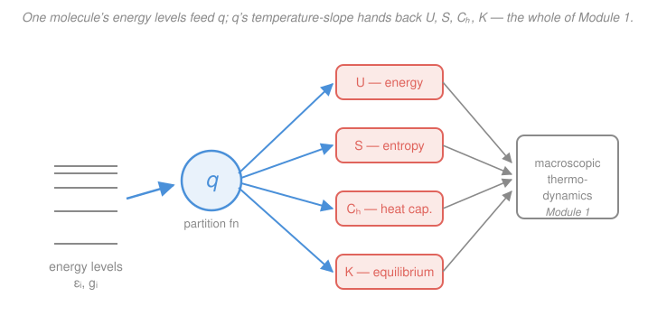

# Physical Chemistry · Lesson 4.2: From partition functions to thermodynamics

> ⏱ ~15 min · Module 4: Statistical thermodynamics and molecular spectroscopy · Builds on: [4.1 The Boltzmann distribution and the partition function](04-01-boltzmann-partition-function.md), [1.2 Entropy and the second law](01-02-entropy-second-law.md) · Unlocks: [4.3 Molecular energy levels: box, oscillator, rotor](04-03-molecular-energy-levels-box-oscillator-rotor.md)

## Why this matters

In [4.1](04-01-boltzmann-partition-function.md) we built the partition function $q = \sum_i g_i e^{-\beta\varepsilon_i}$ — a weighted count of how many molecular energy levels are thermally "in play." It looked like bookkeeping. This lesson is the payoff: **every macroscopic thermodynamic quantity from Module 1 — $U$, $S$, $C_V$, even an equilibrium constant $K$ — falls out of $q$ by differentiation.** That closes the loop stat mech was built to close. Hand me a molecule's energy-level ladder (which quantum mechanics and spectroscopy supply) and I can *predict* the entropy of a gas or the position of a chemical equilibrium — no calorimeter, no reaction vessel. The [stat-mech course](../../stat-mech/syllabus.md) develops this machinery in full; here we use it to do chemistry.

## The idea

A single number, $q$, already encodes *how the molecules are spread across their energy levels*. Two ideas turn that into thermodynamics.

First, **energy is a slope.** If you cool the system (raise $\beta = 1/k_BT$), molecules crowd into low levels and $q$ shrinks; heat it and $q$ grows as upper levels open up. How *fast* $q$ changes with $\beta$ is exactly the average energy — the internal energy $U$. Steeper slope, more energy stored.

Second, **entropy is a count.** In [1.2](01-02-entropy-second-law.md) entropy measured "how many ways" — how spread-out the system is. The partition function *is* an effective count of accessible states, so $\ln q$ is essentially entropy per molecule (plus the energy already carried). A gas where each molecule can be in $10^{30}$ translational states has enormous $S$; a crystal near 0 K, where $q \to 1$ (only the ground state), has $S \to 0$ — the third law, for free.

One subtlety separates a solid from a gas: are the molecules **tellable apart**? Atoms fixed on a lattice have addresses, so you multiply their partition functions straight up. Molecules in a gas are interchangeable — swapping two identical molecules is *not* a new state — so you must divide out the overcounting by $N!$. That single $N!$ is the difference between a right and a wrong entropy, and it's where the famous Sackur–Tetrode equation comes from.

## The formal version

**Molecular vs. canonical partition function.** $q$ (lowercase) is for *one molecule*: $q = \sum_i g_i e^{-\beta\varepsilon_i}$. The **canonical partition function** $Q$ (uppercase) is for the *whole system* of $N$ molecules. For $N$ independent molecules,

$$Q = q^N \ (\text{distinguishable, e.g. a solid}), \qquad Q = \frac{q^N}{N!}\ (\text{indistinguishable, e.g. a gas}).$$

*In words: $Q$ combines the molecules; if you can't tell them apart, divide by $N!$ so you don't count the same physical state many times.*

**Internal energy.** The exact thermodynamic bridge is

$$\boxed{\,U - U(0) = -\left(\frac{\partial \ln Q}{\partial \beta}\right)_V = -\frac{N}{q}\left(\frac{\partial q}{\partial \beta}\right)_V = Nk_BT^2\left(\frac{\partial \ln q}{\partial T}\right)_V\,}$$

Here $U(0)$ is the energy at $T=0$ (all molecules in the ground level) — partition functions only ever give energies *relative* to the ground state. The $N!$ is a constant, so it dies under $\partial/\partial\beta$: **$U$ is the same for a gas or a solid** built from the same $q$. The last equality just swaps the variable using $\partial/\partial\beta = -k_BT^2\,\partial/\partial T$. *In words: internal energy is how steeply the (log) partition function falls as you cool the system.*

**Heat capacity.** Differentiate once more:

$$C_V = \left(\frac{\partial U}{\partial T}\right)_V.$$

*In words: $C_V$ is how much $U$ moves per degree — the temperature-response of the same slope.*

**Entropy.** Combining Boltzmann's $S = k_B\ln W$ with the energy above gives

$$S = \frac{U - U(0)}{T} + k_B \ln Q.$$

*In words: entropy has two pieces — thermal energy spread over $T$, plus the raw count of accessible states $\ln Q$.* For **distinguishable** molecules $Q = q^N$, so

$$S = \frac{U-U(0)}{T} + Nk_B \ln q.$$

For an **indistinguishable** ideal gas, $Q = q^N/N!$; using Stirling's $\ln N! \approx N\ln N - N$,

$$S = \frac{U-U(0)}{T} + Nk_B\ln\!\frac{q}{N} + Nk_B .$$

That extra $-Nk_B\ln N + Nk_B$ is the $N!$ correction — indispensable for gases.

**Sackur–Tetrode equation.** Feed the translational partition function $q_\text{trans} = V/\Lambda^3$ (with thermal wavelength $\Lambda = h/\sqrt{2\pi m k_BT}$, $m$ = molecular mass) into the indistinguishable $S$, using $U-U(0) = \tfrac32 Nk_BT$. For one mole of a monatomic ideal gas:

$$\boxed{\,S_m = R\left[\ln\!\left(\frac{k_BT}{p\,\Lambda^3}\right) + \tfrac52\right]\,}$$

*In words: the absolute molar entropy of a noble gas, computed from nothing but its mass, the temperature, and the pressure* — no measurement of the substance itself. It is one of the cleanest triumphs in physical chemistry.

**Equilibrium constants from molecular properties.** For a gas-phase reaction $\sum_J \nu_J J$ (stoichiometric numbers $\nu_J$: $+$ for products, $-$ for reactants),

$$\boxed{\,K = \left[\prod_J \left(\frac{q_J^\circ}{N_A}\right)^{\nu_J}\right] e^{-\Delta_r E_0 / RT}\,}$$

where $q_J^\circ$ is the standard molar partition function of species $J$ (translational part evaluated at $V_m^\circ = RT/p^\circ$, $p^\circ = 1\ \mathrm{bar}$), and $\Delta_r E_0 = N_A\,\Delta\varepsilon_0$ is the reaction energy at $T=0$ (difference in ground-state energies — from spectroscopy or thermochemistry). This connects straight to [2.6](02-06-chemical-equilibrium-constant.md)'s thermodynamic definition:

$$\Delta_r G^\circ = -RT\ln K.$$

*In words: statistical mechanics predicts the equilibrium constant — and hence $\Delta_r G^\circ$ — from the energy levels and masses of the molecules alone.*

## Picture

## Worked examples

**Example 1 (mechanical — energy of a two-level system).** Take $N$ molecules each with a ground level ($\varepsilon = 0$) and one excited level at $\varepsilon$, both non-degenerate. Then $q = 1 + e^{-\beta\varepsilon}$. Apply the bridge:

$$\frac{\partial q}{\partial\beta} = -\varepsilon\, e^{-\beta\varepsilon}, \qquad U - U(0) = -\frac{N}{q}\frac{\partial q}{\partial\beta} = \frac{N\varepsilon\, e^{-\beta\varepsilon}}{1 + e^{-\beta\varepsilon}} = \frac{N\varepsilon}{e^{\beta\varepsilon}+1}.$$

Check the limits: as $T\to 0$ ($\beta\to\infty$), $U-U(0)\to 0$ — everyone's in the ground state. As $T\to\infty$ ($\beta\to 0$), $U-U(0)\to N\varepsilon/2$ — the two levels equally populated, each molecule carrying $\varepsilon/2$ on average. The whole thermodynamics came from differentiating one line.

**Example 2 (why you'd care — recovering the ideal gas).** For translation, $q_\text{trans} = V/\Lambda^3$ with $\Lambda \propto T^{-1/2} \propto \beta^{1/2}$, so $q_\text{trans} \propto \beta^{-3/2}$ and $\ln q = \text{const} - \tfrac32\ln\beta$. Then

$$U - U(0) = -N\frac{\partial \ln q}{\partial\beta} = -N\left(-\frac{3}{2\beta}\right) = \frac{3N}{2\beta} = \tfrac32 Nk_BT, \qquad C_V = \left(\frac{\partial U}{\partial T}\right)_V = \tfrac32 Nk_B.$$

This is exactly the monatomic ideal-gas energy and heat capacity — the same $\tfrac32 nRT$ and $\tfrac32 R$ you met from kinetic theory in [general chemistry](../../general-chemistry/lessons/03-01-gases-ideal-gas-law-kinetic-theory.md) and equipartition. Statistical mechanics *derives* what Module 1 took as given — and the identical $q_\text{trans}$ hands you the Sackur–Tetrode entropy (P2). One molecular input, two macroscopic laws.

## Watch out

- **You might think $q$ and $Q$ are interchangeable.** They aren't: $q$ describes one molecule, $Q$ the whole assembly. Entropy needs $Q$ (hence the $N!$ for a gas); internal energy happens to be blind to the $N!$ because it's constant under $\partial/\partial\beta$. Never put $Q = q^N$ for a gas — you'll get a nonsensical, non-extensive entropy (the classic "Gibbs paradox").
- **You might forget that $q$ gives only $U - U(0)$.** Partition functions measure energies from the ground level up; they can never tell you the absolute $U(0)$. In an equilibrium constant, that missing zero re-enters explicitly as the $e^{-\Delta_r E_0/RT}$ factor.
- **You might use the classical $q_\text{trans} = V/\Lambda^3$ where it fails.** It assumes levels so dense they're effectively continuous — true for translation at ordinary $T$, false for well-separated vibrational or electronic levels, where you must sum $q$ level by level (next lesson).

## One-liner

> The partition function is a generating function for thermodynamics: differentiate $\ln q$ for energy, add $\ln Q$ for entropy, and the whole of Module 1 — $U$, $S$, $C_V$, $K$ — pours out of the molecular energy levels.

## Problems

**P1 (🟢)** A certain molecular mode has partition function $q = aT^{3/2}$ for a constant $a$ (this is the temperature dependence of translation). For $N$ such molecules, use $U - U(0) = Nk_BT^2\,(\partial\ln q/\partial T)_V$ to find $U - U(0)$, and then $C_V$. What familiar result do you recover for one mole?

**P2 (🟡)** Use the Sackur–Tetrode equation to compute the standard molar entropy of argon gas (molar mass $M = 39.95\ \mathrm{g\,mol^{-1}}$) at $T = 298\ \mathrm{K}$ and $p = 1\ \mathrm{bar} = 10^5\ \mathrm{Pa}$. Compare with the tabulated value $154.8\ \mathrm{J\,K^{-1}\,mol^{-1}}$. Constants: $k_B = 1.381\times10^{-23}\ \mathrm{J\,K^{-1}}$, $h = 6.626\times10^{-34}\ \mathrm{J\,s}$, $N_A = 6.022\times10^{23}\ \mathrm{mol^{-1}}$, $R = 8.314\ \mathrm{J\,K^{-1}\,mol^{-1}}$.

**P3 (🔴)** Outline how the equilibrium constant of the gas-phase dissociation $\ce{I2(g) <=> 2 I(g)}$ is computed from partition functions, and connect your result to $\Delta_r G^\circ = -RT\ln K$. Identify what molecular data you would need and what physically controls whether $K$ is large or small.

Solutions

**P1** Take the log: $\ln q = \ln a + \tfrac32\ln T$, so $(\partial\ln q/\partial T)_V = \dfrac{3}{2T}$. Then

$$U - U(0) = Nk_BT^2\cdot\frac{3}{2T} = \tfrac32 Nk_BT, \qquad C_V = \left(\frac{\partial U}{\partial T}\right)_V = \tfrac32 Nk_B.$$

For one mole, $N = N_A$ and $N_Ak_B = R$, giving $U - U(0) = \tfrac32 RT$ and $C_{V,m} = \tfrac32 R \approx 12.5\ \mathrm{J\,K^{-1}\,mol^{-1}}$ — the internal energy and heat capacity of a monatomic ideal gas. The $T^{3/2}$ in $q$ *is* translational motion, and it delivers the equipartition result $\tfrac32 RT$ (three translational degrees of freedom, each $\tfrac12 RT$).

**P2** First the thermal wavelength. The molecular mass is

$$m = \frac{M}{N_A} = \frac{39.95\times10^{-3}\ \mathrm{kg\,mol^{-1}}}{6.022\times10^{23}\ \mathrm{mol^{-1}}} = 6.634\times10^{-26}\ \mathrm{kg}.$$

$$2\pi m k_BT = 2\pi (6.634\times10^{-26})(1.381\times10^{-23})(298) = 1.716\times10^{-45}\ \mathrm{kg^2\,m^2\,s^{-2}},$$
$$\Lambda = \frac{h}{\sqrt{2\pi m k_BT}} = \frac{6.626\times10^{-34}}{\sqrt{1.716\times10^{-45}}} = \frac{6.626\times10^{-34}}{4.142\times10^{-23}} = 1.600\times10^{-11}\ \mathrm{m}.$$

So $\Lambda^3 = (1.600\times10^{-11})^3 = 4.096\times10^{-33}\ \mathrm{m^3}$. Now the dimensionless argument:

$$\frac{k_BT}{p\,\Lambda^3} = \frac{(1.381\times10^{-23})(298)}{(10^5)(4.096\times10^{-33})} = \frac{4.115\times10^{-21}}{4.096\times10^{-28}} = 1.005\times10^{7}.$$

$$S_m = R\left[\ln(1.005\times10^7) + \tfrac52\right] = 8.314\left[16.12 + 2.50\right] = 8.314\times18.62 = 154.8\ \mathrm{J\,K^{-1}\,mol^{-1}}.$$

This matches the tabulated $154.8\ \mathrm{J\,K^{-1}\,mol^{-1}}$ essentially exactly — the residual entropy of a monatomic gas is *purely* translational, and the Sackur–Tetrode equation nails it from mass, $T$, and $p$ alone. (For a heavier or hotter gas $\Lambda$ shrinks, more translational states are accessible, and $S_m$ rises — as the logarithm shows.)

**P3** *Recipe.* Write the general result for $\ce{I2 <=> 2 I}$ ($\nu = +2$ for $\ce{I}$, $-1$ for $\ce{I2}$):

$$K = \frac{(q_{\ce{I}}^\circ/N_A)^2}{(q_{\ce{I2}}^\circ/N_A)}\; e^{-\Delta_r E_0/RT},$$

where $\Delta_r E_0 = N_A D_0 > 0$ is the molar dissociation energy (energy to pull $\ce{I2}$ apart into two ground-state atoms at $T=0$), and each $q^\circ$ is the standard molar partition function.

*What data you need.* Factor each molecule's partition function into independent motions, $q = q_\text{trans}\,q_\text{rot}\,q_\text{vib}\,q_\text{elec}$ (developed in [4.3](04-03-molecular-energy-levels-box-oscillator-rotor.md)):
- $q_\text{trans} = V_m^\circ/\Lambda^3$ for each species — needs only its mass (as in P2), with $V_m^\circ = RT/p^\circ$.
- Atomic $\ce{I}$ has no rotation or vibration; it contributes $q_\text{trans}\,q_\text{elec}$, where $q_\text{elec}$ counts its low-lying electronic states (degeneracy of the ground term, plus the spin–orbit excited state).
- $\ce{I2}$ adds $q_\text{rot}$ (from its bond length / rotational constant $B$) and $q_\text{vib}$ (from its vibrational frequency $\tilde\nu$) — both measurable by spectroscopy.
- $D_0$ from spectroscopy or thermochemistry.

*What controls $K$.* Two competing factors. The exponential $e^{-D_0/RT}$ makes $K$ tiny at low $T$ (the strong I–I bond keeps the molecule intact) but lets it grow as $T$ rises — dissociation is entropy-favored because two free atoms have far more translational states than one molecule. The ratio of partition functions carries that entropic/statistical driving force (note the factor $q_{\ce{I}}^2$: making *two* particles multiplies accessible states).

*The connection.* Once $K$ is in hand,

$$\Delta_r G^\circ = -RT\ln K.$$

So we have computed a bulk thermodynamic quantity — the standard reaction Gibbs energy of [2.6](02-06-chemical-equilibrium-constant.md) — entirely from molecular masses, bond lengths, vibrational frequencies, and a dissociation energy. That is the arc of the whole module: microscopic spectroscopy $\to$ $q$ $\to$ macroscopic equilibrium.

## Flashback

**From Lesson 4.1 (The Boltzmann distribution and the partition function):** A molecule has a ground level with degeneracy $g_0 = 2$ and a single excited level at $\varepsilon = 1.50\times10^{-21}\ \mathrm{J}$ with degeneracy $g_1 = 4$. At $T = 300\ \mathrm{K}$ ($k_B = 1.381\times10^{-23}\ \mathrm{J\,K^{-1}}$), compute the molecular partition function $q$ and the fraction of molecules in the excited level. (Fresh variant — different degeneracies and gap.)

Solution

The Boltzmann factor exponent is

$$\frac{\varepsilon}{k_BT} = \frac{1.50\times10^{-21}}{(1.381\times10^{-23})(300)} = \frac{1.50\times10^{-21}}{4.143\times10^{-21}} = 0.3621, \qquad e^{-0.3621} = 0.6963.$$

Partition function (ground level taken as $\varepsilon = 0$):

$$q = g_0 + g_1 e^{-\varepsilon/k_BT} = 2 + 4(0.6963) = 2 + 2.785 = 4.785.$$

Fraction in the excited level:

$$f_1 = \frac{g_1 e^{-\varepsilon/k_BT}}{q} = \frac{2.785}{4.785} = 0.582.$$

So about 58% of molecules sit in the *upper* level — even though it costs energy — because its degeneracy ($g_1 = 4$) outweighs the ground level's ($g_0 = 2$) and the gap is small compared with $k_BT$. Degeneracy and temperature, not energy alone, set the populations. (Sanity: $f_0 = 2/4.785 = 0.418$, and $f_0 + f_1 = 1$. ✓)

## Connections

- **Backward:** this is where [4.1](04-01-boltzmann-partition-function.md)'s partition function earns its keep, and it reconstructs [1.2](01-02-entropy-second-law.md)'s entropy and Module 1's $U$ and $C_V$ from molecular levels — $\ln q$ *is* entropy per molecule, so a crystal's $q\to1$ gives the third-law $S\to 0$.
- **Forward:** [4.3](04-03-molecular-energy-levels-box-oscillator-rotor.md) supplies the explicit $q_\text{trans}$, $q_\text{rot}$, $q_\text{vib}$ from the particle-in-a-box, rigid-rotor, and harmonic-oscillator levels — the raw material every formula here consumes; the equilibrium-constant result then meets [2.6](02-06-chemical-equilibrium-constant.md)'s $\Delta_r G^\circ = -RT\ln K$ from the molecular side.
- **Sideways:** the same $Z$-differentiation appears throughout the [stat-mech course](../../stat-mech/syllabus.md) (there $Q$ is often written $Z$, and $U = -\partial\ln Z/\partial\beta$, $F = -k_BT\ln Z$); the $N!$ indistinguishability correction is the resolution of the Gibbs paradox that motivates quantum statistics.
