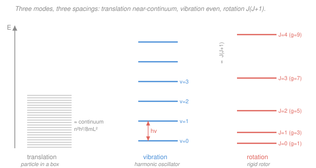

# Physical Chemistry · Lesson 4.3: Molecular energy levels — box, oscillator, and rotor

> ⏱ ~15 min · Module 4: Statistical thermodynamics and molecular spectroscopy · Builds on: [4.1 Boltzmann and the partition function](04-01-boltzmann-partition-function.md), [quantum-mechanics (PIB / oscillator / rotor)](../../quantum-mechanics/syllabus.md) · Unlocks: [4.4 Hydrogen atom and atomic spectra](04-04-hydrogen-atom-atomic-spectra.md)

## Why this matters

In [4.1](04-01-boltzmann-partition-function.md) we built the machine — the partition function $q = \sum_i g_i e^{-\beta\varepsilon_i}$ — that turns a molecule's energy ladder into every thermodynamic quantity. But we fed it toy levels. Now we plug in the *real* ones. A molecule can store energy three ways: by **moving** through space, by **vibrating** its bonds, and by **tumbling** end over end. Quantum mechanics already handed us all three level structures (particle in a box, harmonic oscillator, rigid rotor) — this lesson **applies** those results, converts each into its own partition function, and asks the decisive question: *at room temperature, which modes are actually awake?* The answer explains why heat capacities have the values they do, why an infrared spectrum looks the way it does ([4.5](04-05-rotational-vibrational-spectroscopy.md)), and it is the backbone of Boss Problem 4.

## The idea

Here is the one structural fact that makes everything tractable. A molecule's total energy is (to excellent approximation) a **sum** of independent pieces:

$$\varepsilon = \varepsilon_\text{trans} + \varepsilon_\text{vib} + \varepsilon_\text{rot} \;(+\,\varepsilon_\text{elec}).$$

And from [4.1](04-01-boltzmann-partition-function.md), whenever energies *add*, partition functions *multiply*:

$$q = q_\text{trans}\,q_\text{vib}\,q_\text{rot}.$$

So we can analyze each mode in isolation, get its little partition function, and multiply. The single number that tells you whether a mode is "on" is the **spacing** between its levels compared to the thermal energy $k_BT$. Think of $k_BT$ as the height of a coin flip: if the next rung up is far *higher* than $k_BT$, thermal kicks almost never reach it and the mode is stuck in its ground state — **frozen**. If the rungs are far *closer* than $k_BT$, dozens of levels are populated and the mode behaves like a smooth classical reservoir — **active**. The whole payoff of this lesson is that the three modes have wildly different spacings, so at 300 K they are in wildly different states: translation fully classical, rotation active, vibration mostly frozen.

We measure each spacing as a temperature — the **characteristic temperature** $\theta = (\text{level spacing})/k_B$ — precisely so the comparison is "is $\theta$ bigger or smaller than $T$?"

## The formal version

Everything below **quotes** the quantum-mechanics solutions — we do not re-derive them here.

**Translation — particle in a box.** A molecule of mass $m$ in a 1-D box of length $L$ has levels

$$E_n = \frac{n^2 h^2}{8 m L^2}, \qquad n = 1, 2, 3, \dots$$

*In words: energy grows as the square of the quantum number, and shrinks as the box grows.* For a real container ($L \sim$ cm) these rungs are absurdly close — spacings $\sim 10^{-19}$ times $k_BT$ — so the sum over states becomes an integral. In 3-D the result is a clean closed form:

$$\boxed{\,q_\text{trans} = \frac{V}{\Lambda^3}\,}, \qquad \Lambda = \frac{h}{\sqrt{2\pi m k_B T}}.$$

Here $V$ is the container volume, $k_B = 1.381\times10^{-23}\ \mathrm{J/K}$, and $\Lambda$ (meters) is the **thermal de Broglie wavelength** — roughly the quantum "size" of the molecule. *In words: count how many molecule-sized quantum cells of volume $\Lambda^3$ fit in the box.* Since $\Lambda \sim 10$–$20$ pm while $V$ is macroscopic, $q_\text{trans}$ is astronomically large ($\sim 10^{28}$–$10^{31}$) — translation is thoroughly classical, and $\theta_\text{trans}$ is effectively zero.

**Vibration — harmonic oscillator.** A bond of vibrational frequency $\nu$ (Hz) has evenly spaced levels

$$E_v = \left(v + \tfrac12\right) h\nu, \qquad v = 0, 1, 2, \dots$$

*In words: a ladder with identical rungs of height $h\nu$, sitting on a zero-point floor of $\tfrac12 h\nu$.* Measuring energy from the ground level, the partition function is a geometric series (done in 4.1's style) that sums to

$$\boxed{\,q_\text{vib} = \frac{1}{1 - e^{-\theta_V/T}}\,}, \qquad \theta_V = \frac{h\nu}{k_B} = \frac{h c \tilde\nu}{k_B}.$$

$\theta_V$ is the **vibrational temperature**; $\tilde\nu$ is the vibration's wavenumber (cm⁻¹) with $c = 2.998\times10^{10}\ \mathrm{cm/s}$, and the handy conversion is $hc/k_B = 1.439\ \mathrm{cm\,K}$. Typical bonds have $\tilde\nu \sim 1000$–$3000\ \mathrm{cm^{-1}}$, so $\theta_V \sim 1500$–$4000\ \mathrm{K}$ — far above 300 K. At room temperature $q_\text{vib} \approx 1$: essentially every molecule sits in $v=0$, **vibration is frozen**.

**Rotation — rigid rotor.** A diatomic tumbling with moment of inertia $I$ has levels

$$E_J = \frac{\hbar^2}{2I}\,J(J+1) = h c B\, J(J+1), \qquad J = 0, 1, 2, \dots, \qquad g_J = 2J+1.$$

*In words: the rungs spread apart as $J(J+1)$, and each level $J$ is $(2J+1)$-fold degenerate — there are $2J+1$ orientations of the tumble with the same energy.* The **rotational constant** and **moment of inertia** are

$$B = \frac{\hbar}{4\pi c I}\ (\mathrm{cm^{-1}}), \qquad I = \mu r^2, \qquad \mu = \frac{m_1 m_2}{m_1 + m_2},$$

where $r$ is the bond length and $\mu$ the **reduced mass** (the effective single mass of the two-body tumble). The rungs are close ($B \sim 0.1$–$10\ \mathrm{cm^{-1}}$), so the sum again becomes an integral, giving the high-temperature form

$$\boxed{\,q_\text{rot} = \frac{T}{\sigma\,\theta_R}\,}, \qquad \theta_R = \frac{h c B}{k_B}.$$

$\theta_R$ is the **rotational temperature** ($\sim 1$–$100\ \mathrm{K}$ for light diatomics, and much smaller for heavy ones), and $\sigma$ is the **symmetry number** — the count of indistinguishable orientations, which corrects for overcounting ($\sigma = 1$ for a heteronuclear molecule like $\ce{HCl}$, $\sigma = 2$ for a homonuclear one like $\ce{N2}$). Because $\theta_R \ll 300\ \mathrm{K}$, many rotational levels are populated: **rotation is active** at room temperature, and $q_\text{rot}$ runs from tens to thousands.

**The punchline — one inequality.** Stacking the three characteristic temperatures:

$$\theta_\text{trans} \;\ll\; \theta_R \;\ll\; \theta_V.$$

At 300 K this reads: translation *ultra*-classical, rotation comfortably active, vibration mostly asleep. That single ordering is the qualitative core of molecular statistical thermodynamics.

## Picture

## Worked examples

**Example 1 (mechanical — the three spacings for one molecule).** For $\ce{HCl}$: $B = 10.59\ \mathrm{cm^{-1}}$ and the vibration is $\tilde\nu = 2886\ \mathrm{cm^{-1}}$. Convert both to temperatures with $hc/k_B = 1.439\ \mathrm{cm\,K}$:

$$\theta_R = 1.439 \times 10.59 \approx 15.2\ \mathrm{K}, \qquad \theta_V = 1.439 \times 2886 \approx 4150\ \mathrm{K}.$$

Translation's spacing corresponds to $\theta_\text{trans} \approx 0$. So at $T = 300\ \mathrm{K}$: $\theta_\text{trans} \ll \theta_R = 15\,\mathrm{K} < 300 \ll \theta_V = 4150\,\mathrm{K}$. Translation and rotation are active (their $\theta \ll T$); vibration is frozen ($\theta_V$ is $14\times$ hotter than the room). This is exactly the $\theta_\text{trans}\ll\theta_R\ll\theta_V$ ordering, with 300 K landing *between* $\theta_R$ and $\theta_V$ — which is why it is the interesting temperature.

**Example 2 (why you'd care — how big is $q_\text{trans}$?).** Take one $\ce{N2}$ molecule ($m = 28\ \mathrm{amu} = 4.65\times10^{-26}\ \mathrm{kg}$) in $V = 1\ \mathrm{L} = 10^{-3}\ \mathrm{m^3}$ at 300 K. The thermal wavelength:

$$\Lambda = \frac{h}{\sqrt{2\pi m k_B T}} = \frac{6.626\times10^{-34}}{\sqrt{2\pi\,(4.65\times10^{-26})(1.381\times10^{-23})(300)}} \approx 1.9\times10^{-11}\ \mathrm{m} = 19\ \mathrm{pm}.$$

Then $q_\text{trans} = V/\Lambda^3 = 10^{-3} / (1.9\times10^{-11})^3 \approx 1.4\times10^{29}$. *That is roughly $10^{29}$ translational states thermally accessible to a single molecule* — the box's rungs are so dense that "which state am I in" is a near-continuum question. Contrast $q_\text{vib} \approx 1$ (one state) for the same molecule: the modes could hardly be more different, and it all comes from the spacing-vs-$k_BT$ comparison.

## Watch out

- **You might think a bigger partition function means bigger energy per molecule.** No — $q$ counts *accessible states*, not energy. A huge $q_\text{trans}$ just says translation has a near-continuum of cheap states; it does not mean a molecule carries more translational energy than vibrational. Energy comes from $\langle\varepsilon\rangle = -\partial\ln q/\partial\beta$ ([4.2](04-02-partition-functions-to-thermodynamics.md)), not from $q$ itself.
- **You might forget the degeneracy $2J+1$ in rotation.** Each rotational level is *not* a single state — it is $2J+1$ states. Dropping it under-counts $q_\text{rot}$ badly and misplaces the most-populated $J$ (the population $\propto (2J+1)e^{-\theta_R J(J+1)/T}$ peaks at a nonzero $J$ precisely because of this factor — see the rotational spectrum in 4.5).
- **You might use $q_\text{rot} = T/\sigma\theta_R$ at low temperature.** It is the *high-$T$* (many-levels-populated) approximation; it silently assumes $T \gg \theta_R$. For $\ce{H2}$ ($\theta_R \approx 88\ \mathrm{K}$) near or below $\theta_R$ you must sum the levels term by term. Always check $T \gg \theta_R$ before using the closed form.
- **You might drop the symmetry number.** $\sigma$ is easy to forget and it changes $q_\text{rot}$ (and hence entropy) by a factor of 2 for homonuclear diatomics. Heteronuclear $\sigma = 1$; homonuclear $\sigma = 2$.

## One-liner

> Every molecule stores energy as translation, vibration, and rotation, and their level spacings obey $\theta_\text{trans}\ll\theta_R\ll\theta_V$ — so at 300 K translation and rotation are wide awake while vibration is still asleep.

## Problems

**P1 (🟢)** Carbon monoxide $\ce{CO}$ has bond length $r = 112.8\ \mathrm{pm}$ and reduced mass $\mu = 6.86\ \mathrm{amu}$ ($1\ \mathrm{amu} = 1.6605\times10^{-27}\ \mathrm{kg}$). Compute (a) the moment of inertia $I$, (b) the rotational constant $B$ in cm⁻¹, and (c) the wavenumber spacing of the lowest rotational transition $J=0 \to 1$ (which equals $2B$).

**P2 (🟡)** Molecular iodine $\ce{I2}$ has $\tilde\nu_\text{vib} = 214.5\ \mathrm{cm^{-1}}$ and $B = 0.0374\ \mathrm{cm^{-1}}$. Compute $\theta_V$ and $\theta_R$ (use $hc/k_B = 1.439\ \mathrm{cm\,K}$). At 300 K, which of iodine's modes are active and which are frozen? How does this contrast with a light molecule like $\ce{N2}$ ($\tilde\nu \approx 2360\ \mathrm{cm^{-1}}$)?

**P3 (🔴 — Boss-4 rehearsal)** For $\ce{^1H^35Cl}$ the rotational constant is $B = 10.59\ \mathrm{cm^{-1}}$. Working backward, compute (a) the moment of inertia $I$ and (b) the bond length $r$. Use $\mu_{\ce{HCl}} = 0.980\ \mathrm{amu}$, $\hbar = 1.0546\times10^{-34}\ \mathrm{J\,s}$, $c = 2.998\times10^{10}\ \mathrm{cm/s}$.

Solutions

**P1** (a) Convert: $\mu = 6.86 \times 1.6605\times10^{-27} = 1.139\times10^{-26}\ \mathrm{kg}$, $r = 1.128\times10^{-10}\ \mathrm{m}$.

$$I = \mu r^2 = (1.139\times10^{-26})(1.128\times10^{-10})^2 = (1.139\times10^{-26})(1.272\times10^{-20}) = 1.45\times10^{-46}\ \mathrm{kg\,m^2}.$$

(b) Using $B = \dfrac{\hbar}{4\pi c I}$ with $c$ in cm/s to land in cm⁻¹:

$$B = \frac{1.0546\times10^{-34}}{4\pi\,(2.998\times10^{10})(1.45\times10^{-46})} = \frac{1.0546\times10^{-34}}{5.46\times10^{-35}} \approx 1.93\ \mathrm{cm^{-1}}.$$

(c) The $J=0\to1$ line sits at $2B \approx 3.86\ \mathrm{cm^{-1}}$.

*Check.* $B = 1.93\ \mathrm{cm^{-1}}$ matches the literature value for $\ce{CO}$ (1.93 cm⁻¹), and it is in the expected $0.1$–$10\ \mathrm{cm^{-1}}$ range for a light diatomic. ✓

**P2** With $hc/k_B = 1.439\ \mathrm{cm\,K}$:

$$\theta_V = 1.439 \times 214.5 \approx 309\ \mathrm{K}, \qquad \theta_R = 1.439 \times 0.0374 \approx 0.054\ \mathrm{K}.$$

At 300 K: $\theta_R \approx 0.05\,\mathrm{K} \ll 300$, so **rotation is fully active** (an enormous $q_\text{rot}$). And here is the twist — $\theta_V \approx 309\ \mathrm{K} \approx T$, so iodine's vibration is **partly active**, *not* frozen: $q_\text{vib} = 1/(1 - e^{-309/300}) = 1/(1 - e^{-1.03}) \approx 1.55$, meaning excited vibrational levels carry real population. Iodine is heavy and its bond is soft (low $\tilde\nu$), which pushes $\theta_V$ down to room temperature. Contrast $\ce{N2}$: $\theta_V = 1.439\times2360 \approx 3400\ \mathrm{K} \gg 300$, so nitrogen's vibration *is* frozen ($q_\text{vib}\approx1$). Same qualitative story for rotation, opposite story for vibration — the spacing decides.

*Check.* $\theta_V(\ce{I2}) < \theta_V(\ce{N2})$ because iodine's wavenumber is $\sim11\times$ smaller; the "vibration frozen at 300 K" rule of thumb has real exceptions for heavy/floppy molecules. ✓

**P3** (a) Invert $B = \dfrac{\hbar}{4\pi c I}$ for $I$:

$$I = \frac{\hbar}{4\pi c B} = \frac{1.0546\times10^{-34}}{4\pi\,(2.998\times10^{10})(10.59)} = \frac{1.0546\times10^{-34}}{3.99\times10^{12}} \approx 2.64\times10^{-47}\ \mathrm{kg\,m^2}.$$

(b) From $I = \mu r^2$ with $\mu = 0.980 \times 1.6605\times10^{-27} = 1.627\times10^{-27}\ \mathrm{kg}$:

$$r = \sqrt{\frac{I}{\mu}} = \sqrt{\frac{2.64\times10^{-47}}{1.627\times10^{-27}}} = \sqrt{1.62\times10^{-20}} \approx 1.27\times10^{-10}\ \mathrm{m} = 127\ \mathrm{pm}.$$

*Check.* $127\ \mathrm{pm}$ ($0.127\ \mathrm{nm}$) is the measured $\ce{HCl}$ bond length — this is spectroscopy's superpower: one measured line spacing ($2B$) gives you a bond length to three figures. This is exactly the Boss-4 move. ✓

## Flashback

**From Lesson 4.1 (Boltzmann and the partition function):** A molecule has just two energy levels — a nondegenerate ground state at $\varepsilon_0 = 0$ and a triply degenerate excited state ($g_1 = 3$) at $\varepsilon_1 = k_B \times (100\ \mathrm{K})$. At $T = 200\ \mathrm{K}$, compute the molecular partition function $q$ and the fraction of molecules in the excited level. (Fresh variant — a bare two-level system, no rotor.)

Solution

With $\beta\varepsilon_1 = \varepsilon_1/k_BT = (k_B\cdot100)/(k_B\cdot200) = 100/200 = 0.5$, and including the degeneracy $g_1 = 3$:

$$q = g_0 e^{-\beta\varepsilon_0} + g_1 e^{-\beta\varepsilon_1} = 1 + 3e^{-0.5} = 1 + 3(0.6065) = 1 + 1.820 = 2.82.$$

The excited-level population fraction is its Boltzmann weight divided by $q$:

$$\frac{N_1}{N} = \frac{g_1 e^{-\beta\varepsilon_1}}{q} = \frac{1.820}{2.82} \approx 0.65.$$

*Check.* Even though the gap is only half of $k_BT$, the degeneracy $g_1 = 3$ tilts the balance so a *majority* (65%) sit in the excited level — the same $g_J = 2J+1$ effect that makes rotation's most-populated level a nonzero $J$. Ignoring degeneracy would give $e^{-0.5}/(1+e^{-0.5}) = 0.38$ instead, a very different answer. ✓

## Connections

- **Backward:** the factorization $q = q_\text{trans}q_\text{vib}q_\text{rot}$ is [4.1](04-01-boltzmann-partition-function.md)'s "energies add ⇒ partition functions multiply" applied to a real molecule; each mode's $q$ is the same Boltzmann sum, just with the quantum-mechanics level formula plugged in. The rigid-rotor, oscillator, and particle-in-a-box levels come straight from the [quantum-mechanics](../../quantum-mechanics/syllabus.md) course — we quoted, not derived.
- **Forward:** feed these $q$'s into [4.2](04-02-partition-functions-to-thermodynamics.md)'s $U, S, C_V$ machinery and the frozen/active split *explains* heat capacities (why $C_V/R$ climbs in steps as modes thaw). The level spacings themselves are the spectral lines of [4.5 rotational–vibrational spectroscopy](04-05-rotational-vibrational-spectroscopy.md) — evenly spaced $2B$ rotational lines, a vibrational band — and the H-atom levels of [4.4](04-04-hydrogen-atom-atomic-spectra.md) extend the same "quote-the-QM-levels" logic to electronic energy. This is the direct rehearsal for Boss Problem 4.
- **Sideways (quantum mechanics ↔ statistical mechanics ↔ spectroscopy):** this lesson is the three-way bridge — QM supplies the energy levels, statistical mechanics turns them into partition functions and populations, and spectroscopy reads them back out as measured line spacings. One measured $B$ ⇒ a bond length is the cleanest example of the whole loop closing.
